Electricity Consumption Forecasting for a Single Day (15-Minute
Intervals)
================
Nikolai Len  
Data ScienceTech Institute, 2025


``` r
# Set CRAN mirror
options(repos = c(CRAN = "https://cran.rstudio.com"))

# Load necessary libraries
library(tidyverse)    # For data wrangling and visualization
library(knitr)        # For creating tables and controlling chunk output
library(kableExtra)   # For enhanced table formatting
library(ggplot2)      # For data visualization
library(dplyr)        # For data manipulation
library(tidyr)        # For data tidying
library(readr)        # For reading data
library(lubridate)    # For date manipulation
library(stringr)      # For string manipulation
library(forcats)      # For categorical data handling
library(rmarkdown)    # For document rendering
library(forecast)    

# Set global chunk options
knitr::opts_chunk$set(
  echo = TRUE,        # Display code in the output
  eval = TRUE,       # Do not evaluate code chunks
  warning = FALSE,    # Suppress warnings in the output
  message = FALSE,    # Suppress messages in the output
  fig.width = 7,      # Set default figure width
  fig.height = 5,     # Set default figure height
  fig.align = 'center', # Center align all figures by default
  cache = TRUE        # Enable caching to speed up knitting
)
```

Load models

``` r
# Load the saved models from their RDS files
hw_default <- readRDS("hw_default.rds")
hw_ft <- readRDS("hw_ft.rds")
arima_auto <- readRDS("arima_auto.rds")
tslm_model <- readRDS("tslm_model.rds")
arima_manual <- readRDS("arima_manual.rds")
arima_manual_xreg <- readRDS("arima_manual_xreg.rds")
nnar_temp <- readRDS("nnar_temp.rds")
nnar_temp_dt <- readRDS("nnar_temp_dt.rds")
nnar_temp_dt_ft <- readRDS("nnar_temp_dt_ft.rds")
rf_dt_no_lag <- readRDS("rf_dt_no_lag.rds")
rf_id_no_lag <- readRDS("rf_id_no_lag.rds")
xg_id_no_lag <- readRDS("xg_id_no_lag.rds")
rf_id_lagged <- readRDS("rf_id_lagged.rds")
final_model <- readRDS("final_model.rds")
```

# 1: Preprocessing


``` r
library(readxl)
library(lubridate)

# Set up the path as a separate line
file_path <- "consumption_15min_train.xlsx"

# Read the Excel file 
df <- read_excel(file_path)

# Define the column names
colnames(df) <- c("timestamp","temp","power") 
```


``` r
# Remove the first row
df <- df[-1, ]

# Drop the 4th
if (ncol(df) >= 4) {
  df <- df[, -4]
}

# View the modified dataset
head(df)
```

    ## # A tibble: 6 × 3
    ##   timestamp     temp  power
    ##   <chr>         <chr> <chr>
    ## 1 1/1/2010 1:15 51    165.1
    ## 2 1/1/2010 1:30 51    151.6
    ## 3 1/1/2010 1:45 51    146.9
    ## 4 1/1/2010 2:00 51    153.7
    ## 5 1/1/2010 2:15 51    153.8
    ## 6 1/1/2010 2:30 51    159


``` r
summary(df)
```

    ##   timestamp             temp              power          
    ##  Length:32059       Length:32059       Length:32059      
    ##  Class :character   Class :character   Class :character  
    ##  Mode  :character   Mode  :character   Mode  :character

We see that all the 3 columns are strings. We need to convert timestamps
and make ‘temp’ and ‘power’ numeric. After the transformation we will
double check NAs


``` r
# Parse all timestamps
df$timestamp <- parse_date_time(
  df$timestamp,
  orders = c("mdY HM", "Y-m-d H:M:S"),
  tz = "UTC"
)
```


``` r
df$temp <- as.numeric(df$temp)
df$power <- as.numeric(df$power)
```


``` r
summary(df)
```

    ##    timestamp                        temp            power      
    ##  Min.   :2010-01-01 01:15:00   Min.   : 33.00   Min.   :  0.0  
    ##  1st Qu.:2010-03-25 12:52:30   1st Qu.: 53.00   1st Qu.:195.4  
    ##  Median :2010-06-17 00:30:00   Median : 58.00   Median :276.5  
    ##  Mean   :2010-06-17 00:30:00   Mean   : 59.01   Mean   :262.3  
    ##  3rd Qu.:2010-09-08 12:07:30   3rd Qu.: 64.00   3rd Qu.:313.1  
    ##  Max.   :2010-11-30 23:45:00   Max.   :100.00   Max.   :457.9  
    ##                                                 NA's   :96

Now, as expected we have just 96 NAs in power column which refers to the
last day that we should forecast.


``` r
# Install and load tsibble
library(tsibble)

# Convert data frame to a tsibble
df_tsibble <- as_tsibble(df, index = timestamp)

# Check if the time series is regular
is_regular <- is_regular(df_tsibble)
print(paste("Is the time series regular?", is_regular))
```

    ## [1] "Is the time series regular? TRUE"

``` r
# Identify gaps in the time series
gaps <- scan_gaps(df_tsibble)
print("Gaps in the time series:")
```

    ## [1] "Gaps in the time series:"

``` r
print(gaps)
```

    ## # A tsibble: 0 x 1 [?] <UTC>
    ## # ℹ 1 variable: timestamp <dttm>

Based on the output, the dataframe is regular and there are no gaps in
the timestamps.


Despite the fact we haven’t found any gaps in the data frame, by manual
inspection of the data set, we can see that the observations in the
first date start from 01:15 instead of 00:00. It means that the first
day of the observation doesn’t have the full set of observations. Taking
into account that our forecast period starts at 00:00, the best way is
to delete the first day from our analysis.

``` r
library(dplyr)
library(lubridate)
```

Step 1: Calculate the frequency of the time series in minutes

``` r
frequency_minutes <- as.numeric(difftime(df$timestamp[2], df$timestamp[1], units = "mins"))
print(paste("Detected frequency (minutes):", frequency_minutes))
```

    ## [1] "Detected frequency (minutes): 15"

Step 2: Calculate the expected number of observations per day

``` r
observations_per_day <- 24 * 60 / frequency_minutes
print(paste("Expected observations per day:", observations_per_day))
```

    ## [1] "Expected observations per day: 96"

Step 3: Identify incomplete days

``` r
incomplete_days <- df %>%
  group_by(date = as.Date(timestamp)) %>%
  summarise(observations = n(), .groups = "drop") %>%
  filter(observations < observations_per_day)

# Print days with missing observations
if (nrow(incomplete_days) > 0) {
  print("Days missing full set of observations:")
  print(incomplete_days)
} else {
  print("No missing days found.")
}
```

    ## [1] "Days missing full set of observations:"
    ## # A tibble: 1 × 2
    ##   date       observations
    ##   <date>            <int>
    ## 1 2010-01-01           91

Step 4: Remove incomplete days from df

``` r
df <- df %>%
  filter(!as.Date(timestamp) %in% incomplete_days$date)

print("Incomplete days removed. df updated.")
```

    ## [1] "Incomplete days removed. df updated."

``` r
# Display the first few rows of the updated data frame to verify
print(head(df))
```

    ## # A tibble: 6 × 3
    ##   timestamp            temp power
    ##   <dttm>              <dbl> <dbl>
    ## 1 2010-01-02 00:00:00    56  163.
    ## 2 2010-01-02 00:15:00    51  154.
    ## 3 2010-01-02 00:30:00    51  152.
    ## 4 2010-01-02 00:45:00    51  159.
    ## 5 2010-01-02 01:00:00    51  164.
    ## 6 2010-01-02 01:15:00    50  159.


``` r
# Split df into historical and forecast parts based on NA in the power column
df_historical <- df %>%
  filter(!is.na(power))

df_forecast <- df %>%
  filter(is.na(power))

# Print summary information to verify the split
print("Historical Data (df_historical):")
```

    ## [1] "Historical Data (df_historical):"

``` r
print(head(df_historical))
```

    ## # A tibble: 6 × 3
    ##   timestamp            temp power
    ##   <dttm>              <dbl> <dbl>
    ## 1 2010-01-02 00:00:00    56  163.
    ## 2 2010-01-02 00:15:00    51  154.
    ## 3 2010-01-02 00:30:00    51  152.
    ## 4 2010-01-02 00:45:00    51  159.
    ## 5 2010-01-02 01:00:00    51  164.
    ## 6 2010-01-02 01:15:00    50  159.

``` r
print(paste("Number of historical rows:", nrow(df_historical)))
```

    ## [1] "Number of historical rows: 31872"

``` r
print("Forecast Data (df_forecast):")
```

    ## [1] "Forecast Data (df_forecast):"

``` r
print(head(df_forecast))
```

    ## # A tibble: 6 × 3
    ##   timestamp            temp power
    ##   <dttm>              <dbl> <dbl>
    ## 1 2010-11-30 00:00:00    41    NA
    ## 2 2010-11-30 00:15:00    39    NA
    ## 3 2010-11-30 00:30:00    39    NA
    ## 4 2010-11-30 00:45:00    39    NA
    ## 5 2010-11-30 01:00:00    39    NA
    ## 6 2010-11-30 01:15:00    37    NA

``` r
print(paste("Number of forecast rows:", nrow(df_forecast)))
```

    ## [1] "Number of forecast rows: 96"


Check for power

``` r
ggplot(df_historical, aes(x = timestamp, y = power)) +
geom_line() +
labs( x = "Timestamp", y = "Power Consumption")
```

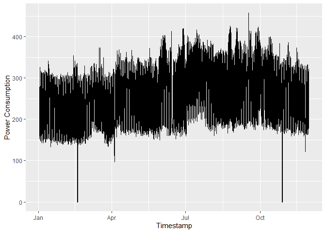

Based on the graph we can obviously see at least 2 zones of outliers.
Let’s check for the temp

``` r
ggplot(df_historical, aes(x = timestamp, y = temp)) +
geom_line() +
labs( x = "Timestamp", y = "Temp")
```

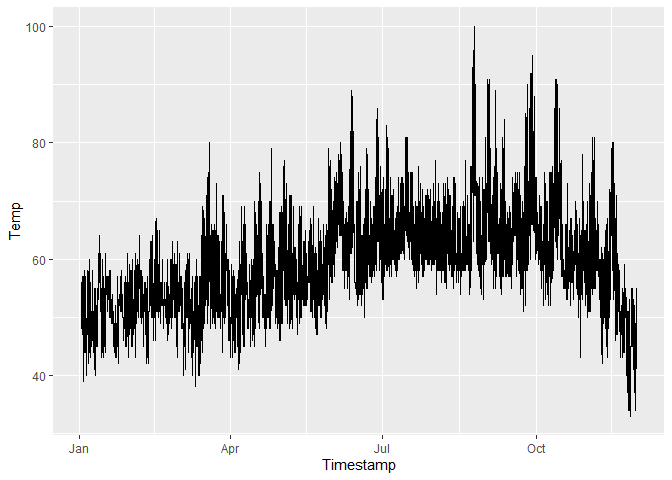

The data point reaching 100 degrees seems suspicious.


We will use tsclean function from forecast library to impute the
outliers

``` r
# Load the forecast package
library(forecast)

# Step 1: Convert the power and temp columns in df_historical to time series objects
# Assuming a regular frequency
power_ts <- ts(df_historical$power, frequency = 96)
temp_ts <- ts(df_historical$temp, frequency = 96)

# Step 2: tsclean to impute outliers and missing values in both columns
cleaned_power <- tsclean(power_ts)
cleaned_temp <- tsclean(temp_ts)

# Step 3: Replace the original columns in df_historical with the cleaned values
df_historical$power <- as.numeric(cleaned_power)
df_historical$temp <- as.numeric(cleaned_temp)

# Print the summary of the cleaned dataframe
summary(df_historical)
```

    ##    timestamp                        temp           power      
    ##  Min.   :2010-01-02 00:00:00   Min.   :33.00   Min.   :120.6  
    ##  1st Qu.:2010-03-25 23:56:15   1st Qu.:53.00   1st Qu.:196.9  
    ##  Median :2010-06-16 23:52:30   Median :58.00   Median :277.4  
    ##  Mean   :2010-06-16 23:52:30   Mean   :59.04   Mean   :263.1  
    ##  3rd Qu.:2010-09-07 23:48:45   3rd Qu.:64.00   3rd Qu.:313.3  
    ##  Max.   :2010-11-29 23:45:00   Max.   :95.00   Max.   :430.5


Check for power

``` r
ggplot(df_historical, aes(x = timestamp, y = power)) +
geom_line() +
labs( x = "Timestamp", y = "Power Consumption")
```

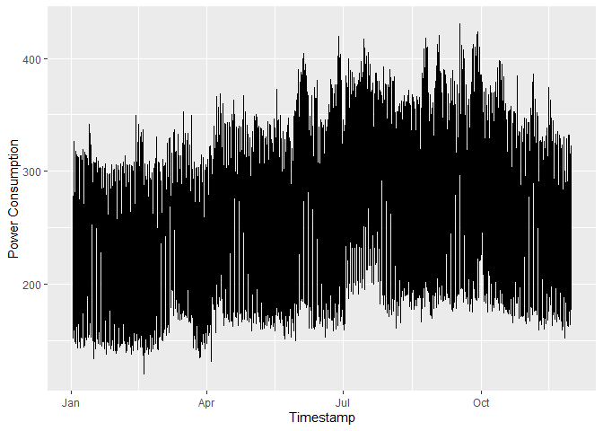

Now the power looks better. What about temp?

``` r
ggplot(df_historical, aes(x = timestamp, y = temp)) +
geom_line() +
labs( x = "Timestamp", y = "Temp")
```

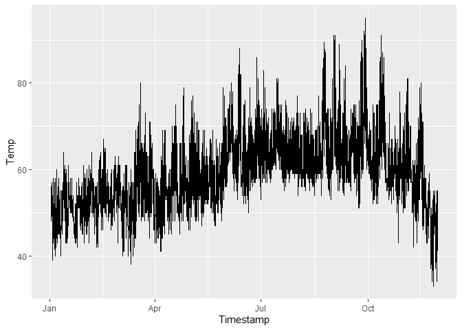

Not much difference from the original series, but it still looks a bit
smoother.

# 2: Data analysis

Taking into account that temperature influence the power consumption and
power consumption doesn’t influence the temperature, we are dealing with
univariate time series with external regressor presented by temperature


``` r
# Convert power to a time series object
power_ts <- ts(df_historical$power, frequency = 96) # 96 intervals per day for 15-min data

# Extract temp as a time series (external regressor)
temp_ts <- ts(df_historical$temp, frequency = 96)
```


``` r
# Decompose the time series to analyze trend and seasonality
decomposition <- stl(power_ts, s.window = "periodic")
autoplot(decomposition) +
  ggtitle("Decomposition of Power Time Series") +
  labs(x = "Time", y = "Power (kW)")
```

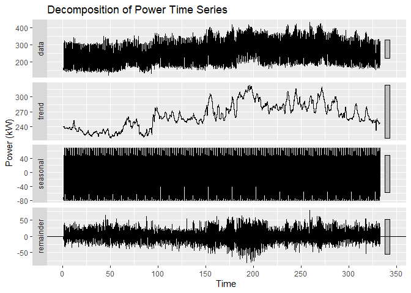

From the plot we can infer that there is an upward trend in the first
half a year and a slight downward trend in the second half year. Taking
into account that we have a lot of data points and at the same time we
are required to forecast just one day in November, let’s cut the dataset
in such a way that we keep only downward trend. It can help our models
to capture linear downward trend instead of taking into account more
complicated parabolic trend. In addition, by doing so we will reduce the
computation workload.


In order to optimize computation workload we will take a dataset of the
last 64 days. Taking into account that we are going to train machine
learning models we split the data set into 3 subsets: training,
validation and test sets. This should help us to avoid overfitting. In
addition I have a hypothesis (it will be checked later) that we have a
strong consumption pattern through 24 hours: Night, Morning, Day,
Evening. Let’s add these new features to the dataset through one-hot
encoding.

``` r
library(lubridate)

# 0) Add one-hot encoded columns based on the timestamp column
df_historical$hour <- hour(df_historical$timestamp)
df_historical$Night   <- as.integer(df_historical$hour >= 0  & df_historical$hour < 6)
df_historical$Morning <- as.integer(df_historical$hour >= 6  & df_historical$hour < 12)
df_historical$Day     <- as.integer(df_historical$hour >= 12 & df_historical$hour < 18)
df_historical$Evening <- as.integer(df_historical$hour >= 18 & df_historical$hour < 24)
df_historical$hour <- NULL  # remove temporary column

# 1) Identify earliest & latest day in df_historical
first_day <- min(df_historical$timestamp)
last_day  <- max(df_historical$timestamp)
# If df_historical doesn't have day_number yet, create it
df_historical$day_number <- as.integer(difftime(df_historical$timestamp, first_day, units = "days")) + 1
total_days <- max(df_historical$day_number)

cat("First day:", format(first_day, "%Y-%m-%d"), "\n")
```

    ## First day: 2010-01-02

``` r
cat("Last  day:", format(last_day,  "%Y-%m-%d"), "\n")
```

    ## Last  day: 2010-11-29

``` r
cat("Total days in dataset:", total_days, "\n\n")
```

    ## Total days in dataset: 332

``` r
# 2) Desired day counts (train, val, test)
n_train <- 60
n_val   <-  2
n_test  <-  2
days_needed <- n_train + n_val + n_test

# We keep the last 'days_needed' days of the dataset
cut_start_day <- total_days - days_needed + 1
cat("We keep days", cut_start_day, "through", total_days, "...\n\n")
```

    ## We keep days 269 through 332 ...

``` r
# 3) Build df_historical_cut
df_historical_cut <- subset(df_historical, day_number >= cut_start_day)

# 4) Define day ranges for train, val, test
train_start <- cut_start_day
train_end   <- cut_start_day + n_train - 1
val_start   <- train_end + 1
val_end     <- train_end + n_val
test_start  <- val_end + 1
test_end    <- val_end + n_test

cat("Train day_number range:", train_start, "to", train_end, "\n")
```

    ## Train day_number range: 269 to 328

``` r
cat("Val   day_number range:", val_start, "to", val_end, "\n")
```

    ## Val   day_number range: 329 to 330

``` r
cat("Test  day_number range:", test_start, "to", test_end, "\n\n")
```

    ## Test  day_number range: 331 to 332

``` r
# 5) Keep separate dataframes:
df_historical_cut_train     <- subset(df_historical_cut, day_number >= train_start & day_number <= train_end)
df_historical_cut_val       <- subset(df_historical_cut, day_number >= val_start   & day_number <= val_end)
df_historical_cut_test      <- subset(df_historical_cut, day_number >= test_start  & day_number <= test_end)
df_historical_cut_train_val <- subset(df_historical_cut, day_number >= train_start & day_number <= val_end)

# 6) Create multivariate ts object
ts_historical_cut <- ts(df_historical_cut[ , !(names(df_historical_cut) %in% c("timestamp"))],
                        frequency = 96, start = c(cut_start_day, 1))

# Create the training, validation, test, and train+validation mts objects using window()
ts_historical_cut_train     <- window(ts_historical_cut, start = c(train_start, 1), end = c(train_end, 96))
ts_historical_cut_val       <- window(ts_historical_cut, start = c(val_start, 1),   end = c(val_end, 96))
ts_historical_cut_test      <- window(ts_historical_cut, start = c(test_start, 1),  end = c(test_end, 96))
ts_historical_cut_train_val <- window(ts_historical_cut, start = c(train_start, 1), end = c(val_end, 96))
```

Build a new STL plot

``` r
# Decompose the time series to analyze trend and seasonality
decomposition <- stl(ts_historical_cut[,"power"], s.window = "periodic")
autoplot(decomposition) +
  ggtitle("Decomposition of Power Time Series") +
  labs(x = "Time", y = "Power (kW)")
```

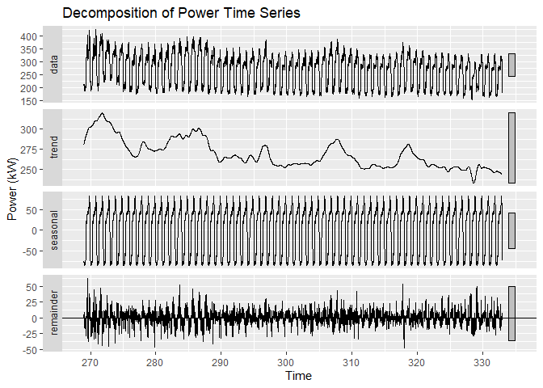


Despite the fact that we have cut our dataset, it’s still too large for
visual analysis purposes. Let’s have look at the last month.

``` r
power_ts_cut_month=window(power_ts,start=c(300,1),end=c(332,96))
temp_ts_cut_month=window(temp_ts,start=c(300,1),end=c(332,96))
```

Build an STL plot

``` r
# Decompose the time series to analyze trend and seasonality
decomposition <- stl(power_ts_cut_month, s.window = "periodic")
autoplot(decomposition) +
  ggtitle("Decomposition of Power Time Series") +
  labs(x = "Time", y = "Power (kW)")
```

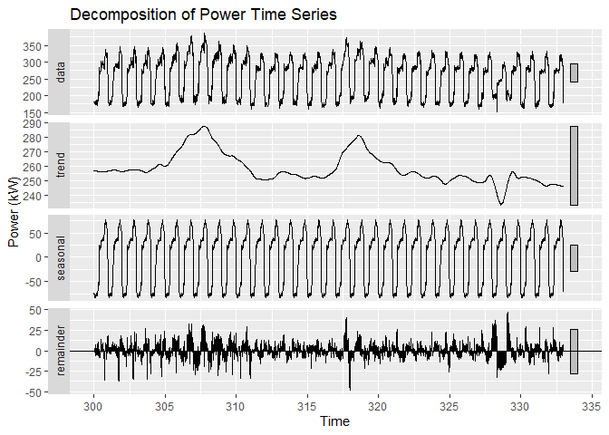

Now we can clearly see a stable seasonality pattern. Moreover, we can
see that the remainder looks like it has some additional pattern (not
just the white noise)


``` r
seasonplot(power_ts_cut_month, main = "Daily Seasonal Plot", col = rainbow(7), year.labels = FALSE, pch = 19)
```

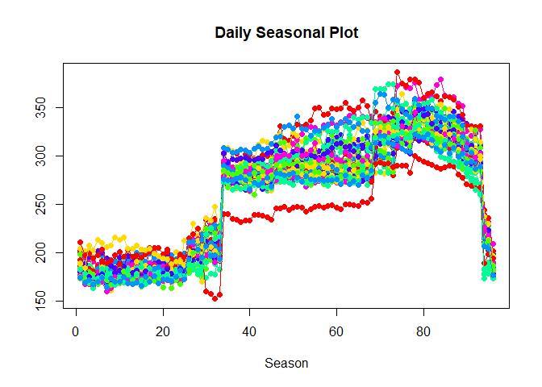

From the daily seasonality plot we can clearly see a pattern that we can
observe in real life. Night hours are the lowest in terms of electricity
consumption, the peak hours are somewhat in the evening. Moreover, I
have a hypothesis that the consumption on weekends or some weekdays can
be less or instead higher than on other days. Let’s check this
hypothesis.


Convert timestamp to Date format and aggregate to daily level

``` r
df_daily <- df_historical_cut %>%
  mutate(date = as.Date(timestamp)) %>%  # Extract only the date part
  group_by(date) %>%
  summarise(daily_power = mean(power, na.rm = TRUE))  # Compute daily mean power
```

Convert to a Time Series Object

``` r
power_ts_weekly <- ts(df_daily$daily_power, frequency = 7, start = c(year(df_daily$date[1]), week(df_daily$date[1])))
```

Visualize seasonality based on weekdays

``` r
seasonplot(power_ts_weekly, main = "Weekday Seasonal Plot",
           col = rainbow(7), year.labels = FALSE, pch = 19)
```

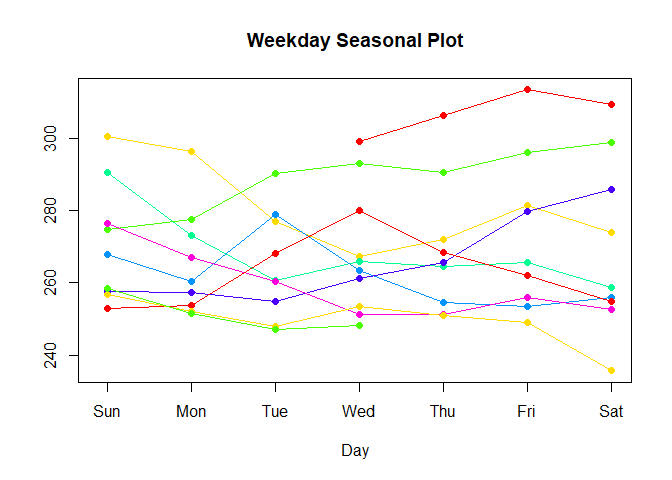

From the plot it’s quite ambiguous whether the daily seasonality exists.
Let’s make ANOVA test

``` r
# Ensure weekday column is present
df_daily$weekday <- weekdays(df_daily$date)

# Convert weekday to a factor (ensures correct ordering)
df_daily$weekday <- factor(df_daily$weekday, 
                           levels = c("Monday", "Tuesday", "Wednesday", 
                                      "Thursday", "Friday", "Saturday", "Sunday"))

anova_test <- aov(daily_power ~ weekday, data = df_daily)
summary(anova_test)
```

    ##             Df Sum Sq Mean Sq F value Pr(>F)
    ## weekday      6    423    70.6   0.207  0.973
    ## Residuals   57  19439   341.0

P-value (Pr(\>F)) is much greater than 0.05, meaning no significant
difference in power consumption across weekdays.

F-value A very low F-value suggests that variation in power consumption
is not explained by weekdays.

Sum of Squares (Sum Sq) for weekday is very small compared to the
residual variance, meaning most variability in power usage comes from
other factors, not the day of the week.

Thus, there is no strong evidence that power consumption varies
significantly across weekdays.


``` r
library(tseries)

# Perform the Augmented Dickey-Fuller Test
adf_result <- adf.test(ts_historical_cut[,"power"], alternative = "stationary")

# Print the result
print(adf_result)
```

    ## 
    ##  Augmented Dickey-Fuller Test
    ## 
    ## data:  ts_historical_cut[, "power"]
    ## Dickey-Fuller = -16.275, Lag order = 18, p-value = 0.01
    ## alternative hypothesis: stationary

The results of the Augmented Dickey-Fuller (ADF) test indicate that the
time series is stationary.


Let’s have a look at the relationship between Power and Temperature

``` r
plot(temp_ts_cut_month, power_ts_cut_month, xlab="Temperature", ylab="Power", main="Scatter plot of Power vs Temperature")
```

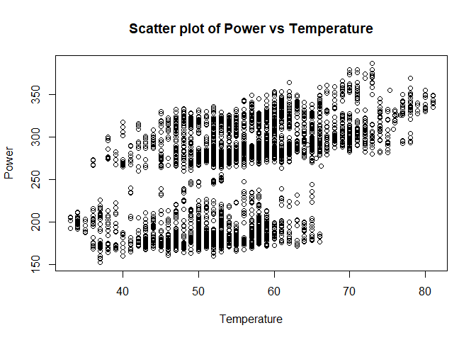

The scatter plot shows that temperature indeed has influence on power
consumption. However, the relationship is not linear or quadratic.
Instead the plot shows two distinct clusters. Let’s further investigate
the nature of the clusters. Despite the fact that I have already checked
the influence of weekdays on the power consumption, I would like to
double check it on the scatter plot

``` r
# Extract day of the week and classify as weekday (0) or weekend (1)
df_historical_cut$day_type <- ifelse(weekdays(df_historical_cut$timestamp) %in% c("Saturday", "Sunday"), 1, 0)
```

Plot the points marked weekend or weekday

``` r
# Define colors: Blue for Weekday (0), Red for Weekend (1)
colors <- ifelse(df_historical_cut$day_type == 0, "blue", "red")

# Create scatter plot with color differentiation
plot(df_historical_cut$temp, df_historical_cut$power, col = colors, pch = 19,
     xlab = "Temperature", ylab = "Power", main = "Power vs Temperature by Day Type")

# Add legend
legend("topleft", legend = c("Weekday", "Weekend"), col = c("blue", "red"), pch = 19)
```

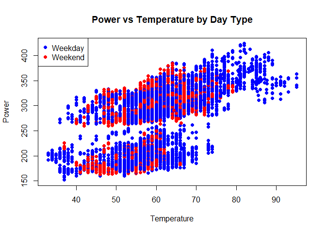

We have confirmed that the clusters we see are not workday vs weekend.
Let’s go further: we create an additional column that classifies each
data point in terms of the day time: Night, Morning, Day, Evening.

``` r
# Extract hour from timestamp
df_historical_cut$hour <- as.numeric(format(df_historical_cut$timestamp, "%H"))

# Classify into four time clusters
df_historical_cut$daytime <- cut(df_historical_cut$hour, 
                                 breaks = c(-1, 5, 11, 17, 23),
                                 labels = c("Night", "Morning", "Day", "Evening"))

# Define colors for each cluster
color_map <- c("Night" = "blue", "Morning" = "yellow", "Day" = "green", "Evening" = "red")
colors <- color_map[df_historical_cut$daytime]

# Create scatter plot with color differentiation
plot(df_historical_cut$temp, df_historical_cut$power, col = colors, pch = 19,
     xlab = "Temperature", ylab = "Power", main = "Power vs Temperature by Daytime Clusters")

# Add legend
legend("topleft", legend = names(color_map), col = color_map, pch = 19)
```

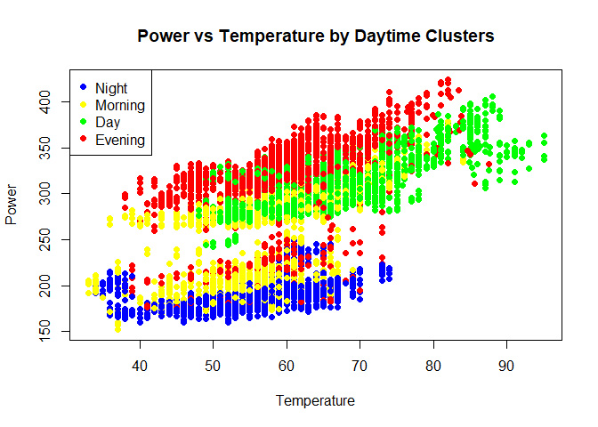

Great! Power demand follows a predictable daily cycle: Night: low,
Morning: increasing, Day: higher, but variable, Evening: peak demand.
For now we won’t create any additional columns and let the models
capture the seasonal pattern.


The analysis reveals the following attributes of our time series:

1.  The dataset is stationary;
2.  There is a slight downward trend;
3.  There is a strong intraday seasonality that can be devided into 4
    clusters
4.  Days of week follow similar energy consumption patterns
5.  Temperature serves as an external regressor with a non-linear
    dependancy


Based on the task, we need to perform a forecast both with and without
an external regressor. Here is the set of the models to be tested:

1.  Holt-Winters (HW) - without xreg
2.  ARIMA – without and with xreg
3.  NNETAR – without and with xreg
4.  Random Forest (RF) – without and with xreg
5.  XGBoost – without and with xreg
6.  Prophet (by Meta) – without and with xreg

# 3: Modelling


Taking into account that our dataset demonstrates seasonality and a
subtle downward trend we will start our training with Holt-Winters (HW)
model which is an extension of exponential smoothing used for time
series forecasting, particularly when the data exhibits trend and
seasonality. Based on the graphs we can conclude that seasonal
variations are relatively constant. That is why we will proceed with
Additive HW. As HW is deterministic we don’t need validation set here
that’s why we will use combined train and validation set for training.

### 3.1.1 Default HW

Let’s start with default parameters

``` r
library(forecast)
hw_default <- HoltWinters(ts_historical_cut_train_val[,"power"], 
                        seasonal = "additive",
                        alpha = NULL,    
                        beta  = NULL,
                        gamma = NULL)
```

Forecast for the next 2 days (test set)

``` r
library(ggplot2)
library(forecast)
hw_default_forecast <- forecast(hw_default, h = 2 * 96)

autoplot(ts_historical_cut_test[,"power"], series = "Test Data") + autolayer(hw_default_forecast$mean, series="additive HW")
```

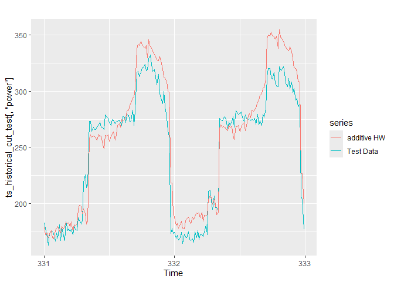

RMSE calculation

``` r
# Calculate the Root Mean Squared Error (RMSE)
hw_default_rmse <- sqrt(mean((hw_default_forecast$mean - ts_historical_cut_test[,"power"]) ^ 2))

# Print the RMSE
cat("HW Default RMSE:", hw_default_rmse, "\n")
```

    ## HW Default RMSE: 18.54785

From the plot we can infer that the model is trying to repeat the
pattern of the test set, but it considerably underperforms on the high,
middle and low peaks. Let’s check residuals and numeric parameters.

``` r
summary(hw_default)
```

    ##              Length Class  Mode     
    ## fitted       23424  mts    numeric  
    ## x             5952  ts     numeric  
    ## alpha            1  -none- numeric  
    ## beta             1  -none- numeric  
    ## gamma            1  -none- numeric  
    ## coefficients    98  -none- numeric  
    ## seasonal         1  -none- character
    ## SSE              1  -none- numeric  
    ## call             6  -none- call

``` r
checkresiduals(hw_default)
```

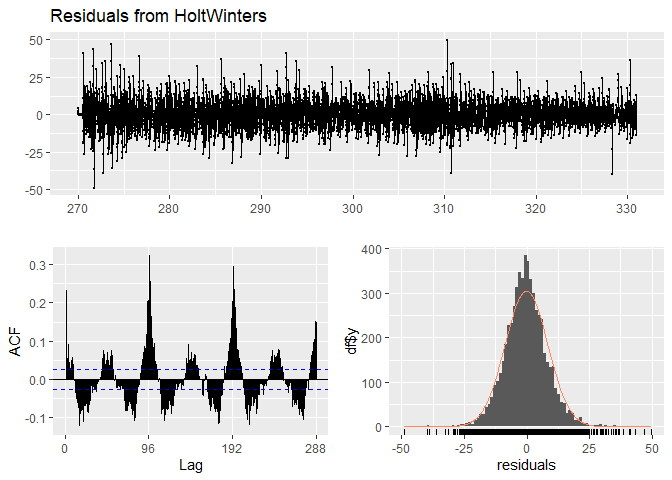

    ## 
    ##  Ljung-Box test
    ## 
    ## data:  Residuals from HoltWinters
    ## Q* = 6652.2, df = 192, p-value < 2.2e-16
    ## 
    ## Model df: 0.   Total lags used: 192

``` r
tsdisplay(residuals(hw_default))
```

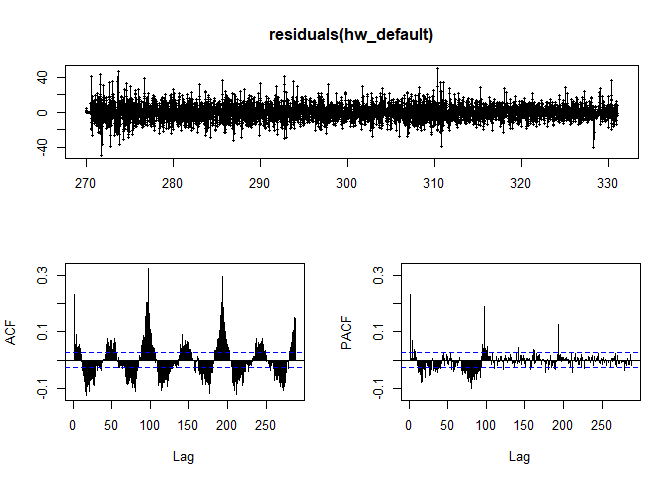

From ACF and PCF we clearly see that unfortunately a strong
autocorrelation remains in the residuals. It is also confirmed by
extremely low p-value in the Ljung–Box test. Let’s check the smoothing
parameters the model has chosen.

``` r
# Extract all optimized smoothing parameters
optimized_parameters <- c(alpha = hw_default$alpha,
                          beta = hw_default$beta,
                          gamma = hw_default$gamma)

# Print the optimized parameters
cat("Optimized Default Parameters:\n")
```

    ## Optimized Default Parameters:

``` r
print(optimized_parameters)
```

    ## alpha.alpha   beta.beta gamma.gamma 

### 3.1.2 HW Finetuned

Let’s use the default smoothing parameters as a starting point for the
adjustment. Just to recap: - Alpha (α) determines how much weight is
given to the most recent observations (1 gives more weight to recent
observations, a value close to 0 gives more weight to older
observations) - Beta (β) controls the smoothing of the trend component -
Gamma (γ) determines how much weight is given to the most recent
observations when estimating the seasonal pattern

As our test data are the autumn days, it makes sense to give more weight
to recent seasonal patterns by increasing Gamma, as the whether is
getting colder and the seasonal pattern from the latest days can be the
most relevant. Also we will play around with Alpha, and at the same time
will be very cautious in terms of Beta as the trend is very subtle.

``` r
library(forecast)
hw_ft <- HoltWinters(ts_historical_cut_train_val[,"power"], 
                        seasonal = "additive",
                        alpha = 0.45,    # or just omit entirely
                        beta  = 0.00003,
                        gamma = 0.8)
```

Forecast for the next 2 days (test set)

``` r
library(ggplot2)
library(forecast)
hw_ft_forecast <- forecast(hw_ft, h = 2 * 96)

autoplot(ts_historical_cut_test[,"power"], series = "Test Data") + autolayer(hw_ft_forecast$mean, series="additive HW Finetuned")
```

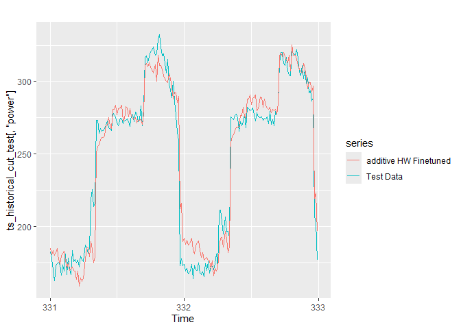

RMSE calculation

``` r
# Calculate the Root Mean Squared Error (RMSE)
hw_ft_rmse <- sqrt(mean((hw_ft_forecast$mean - ts_historical_cut_test[,"power"]) ^ 2))

# Print the RMSE
cat("HW Finetuned RMSE:", hw_ft_rmse, "\n")
```

    ## HW Finetuned RMSE: 12.20363

Through multiple iterations we have managed to find a set of parameters
leading us to a visible improvement of the plot and RMSE. Let’s check
residuals and numeric parameters.

``` r
summary(hw_ft)
```

    ##              Length Class  Mode     
    ## fitted       23424  mts    numeric  
    ## x             5952  ts     numeric  
    ## alpha            1  -none- numeric  
    ## beta             1  -none- numeric  
    ## gamma            1  -none- numeric  
    ## coefficients    98  -none- numeric  
    ## seasonal         1  -none- character
    ## SSE              1  -none- numeric  
    ## call             6  -none- call

``` r
checkresiduals(hw_ft)
```

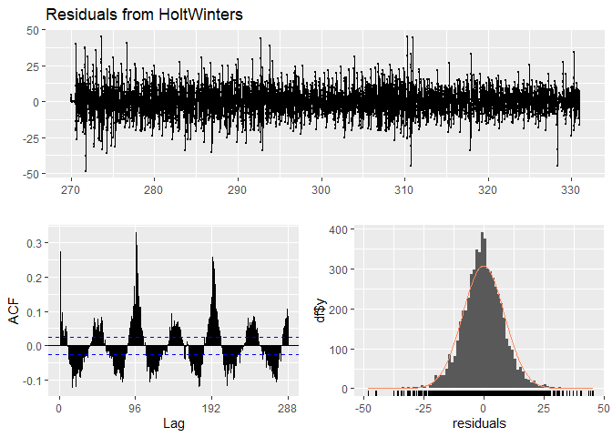

    ## 
    ##  Ljung-Box test
    ## 
    ## data:  Residuals from HoltWinters
    ## Q* = 7035.7, df = 192, p-value < 2.2e-16
    ## 
    ## Model df: 0.   Total lags used: 192

``` r
tsdisplay(residuals(hw_ft))
```

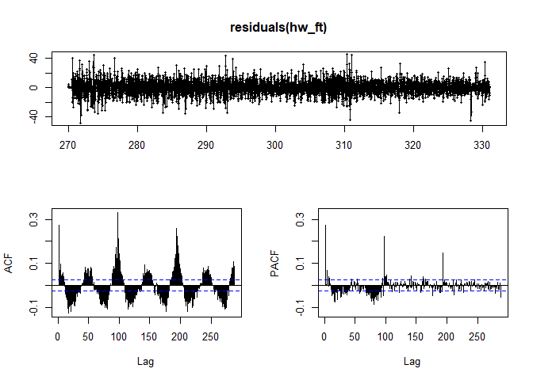

Despite the improvement of RMSE. ACF and PCF still indicates a strong
autocorrelation in the residuals. It is also confirmed by extremely low
p-value in the Ljung–Box test. It means that the model struggles to
catch the patterns in a proper way.


### 3.2.1 Auto-ARIMA w/o Xreg

``` r
library(forecast)
arima_auto = auto.arima(
  ts_historical_cut_train_val[,"power"],
  seasonal = TRUE,
  approximation = TRUE,
  stepwise = TRUE,
  trace = TRUE,
  max.p = 15, max.q = 15,  
  max.P = 2, max.Q = 2
)
```

Forecast for the next 2 days (test set)

``` r
library(ggplot2)
library(forecast)
arima_auto_forecast <- forecast(arima_auto, h = 2 * 96)

autoplot(ts_historical_cut_test[,"power"], series = "Test Data") + autolayer(arima_auto_forecast$mean, series="Auto Arima")
```

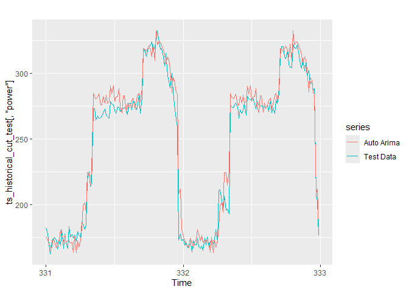

RMSE calculation

``` r
# Calculate the Root Mean Squared Error (RMSE)
arima_auto_rmse <- sqrt(mean((arima_auto_forecast$mean - ts_historical_cut_test[,"power"]) ^ 2))

# Print the RMSE
cat("Auto Arima RMSE:", arima_auto_rmse, "\n")
```

    ## Auto Arima RMSE: 9.714442

The plot and RMSE immediately look better than those of HW. Let’s check
residuals and parameters.

``` r
summary(arima_auto)
```

    ## Series: ts_historical_cut_train_val[, "power"] 
    ## ARIMA(7,0,2)(0,1,0)[96] 
    ## 
    ## Coefficients:
    ##          ar1      ar2     ar3     ar4      ar5     ar6     ar7      ma1     ma2
    ## s.e.  0.1677   0.2195  0.0584  0.0311   0.0282  0.0299  0.0181   0.1675  0.1393
    ## 
    ## sigma^2 = 80.03:  log likelihood = -21137.02
    ## AIC=42294.03   AICc=42294.07   BIC=42360.79
    ## 
    ## Training set error measures:
    ##                       ME     RMSE      MAE         MPE     MAPE      MASE
    ## Training set -0.07274023 8.866605 6.695282 -0.08068506 2.617148 0.5719789
    ##                      ACF1
    ## Training set 0.0001754989

``` r
checkresiduals(arima_auto)
```

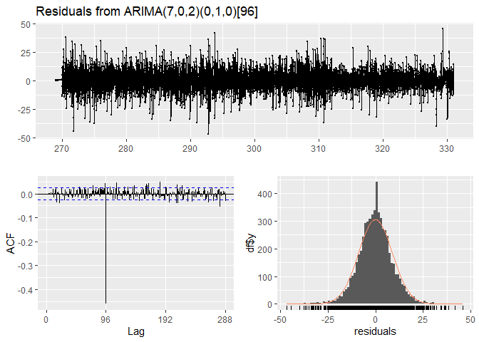

    ## 
    ##  Ljung-Box test
    ## 
    ## data:  Residuals from ARIMA(7,0,2)(0,1,0)[96]
    ## Q* = 1640.1, df = 183, p-value < 2.2e-16
    ## 
    ## Model df: 9.   Total lags used: 192

``` r
tsdisplay(residuals(arima_auto))
```

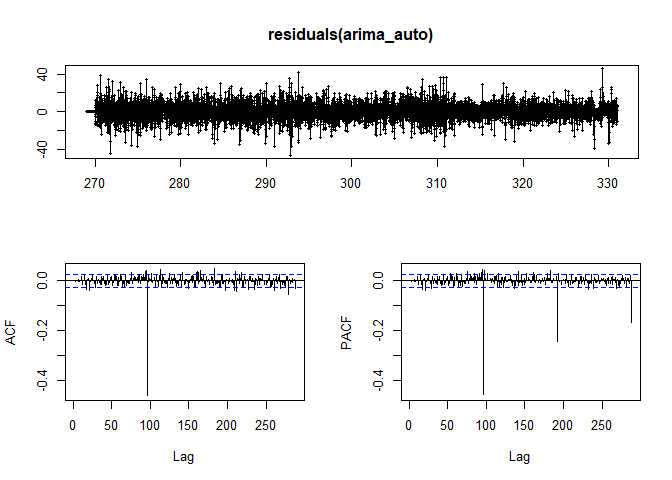

The ACF and PACF plots indicate that the time series is relatively
uncorrelated except for a set of distinct negative spikes in the PACF
(and one in ACF). Notably, these spikes occur in PACF at seasonal
lags—specifically at lags 96, 192, 288, etc.—with the largest spike at
lag 96, and each subsequent spike decreasing in magnitude. This pattern
suggests a seasonal effect with a period of our 96 observations per day.
The reason could be a drop in energy consumption at night. At the next
tries we will focus on seasonal AR terms (P), but first let’s start with
TSLM by removing the effect of covariate.

### 3.2.2 TSLM

``` r
tslm_model=tslm(power~temp+trend+season,data=ts_historical_cut_train_val)
```

Forecast for the next 2 days (test set)

``` r
library(ggplot2)
library(forecast)
tslm_model_forecast <- forecast(tslm_model, newdata = ts_historical_cut_test[,"temp"])

autoplot(ts_historical_cut_test[,"power"], series = "Test Data") + autolayer(tslm_model_forecast$mean, series="TSLM")
```

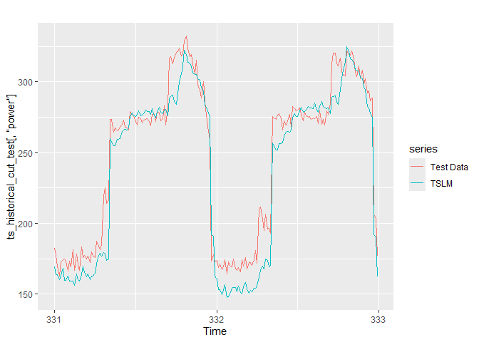

RMSE calculation

``` r
# Calculate the Root Mean Squared Error (RMSE)
tslm_rmse <- sqrt(mean((tslm_model_forecast$mean - ts_historical_cut_test[,"power"]) ^ 2))

# Print the RMSE
cat("TSLM RMSE:", tslm_rmse, "\n")
```

    ## TSLM RMSE: 15.80533

The plot and RMSE is worse then Auto Arima and fine tuned HW, but
interestingly it’s better than default HW. It’s due to the fact that we
have added temperature which improves the performace. Let’s check
residuals and parameters.

``` r
summary(tslm_model)
```

    ## 
    ## Call:
    ## tslm(formula = power ~ temp + trend + season, data = ts_historical_cut_train_val)
    ## 
    ## Residuals:
    ##     Min      1Q  Median      3Q     Max 
    ## -53.385  -9.725  -1.389   8.063  65.156 
    ## 
    ## Coefficients:
    ##               Estimate Std. Error t value Pr(>|t|)    
    ## (Intercept) 121.640314   2.993176  40.639  < 2e-16 ***
    ## temp          1.424798   0.033666  42.322  < 2e-16 ***
    ## trend        -0.003236   0.000157 -20.606  < 2e-16 ***
    ## season2      -4.271103   2.761150  -1.547  0.12195    
    ## season3      -4.247889   2.761149  -1.538  0.12399    
    ## season4      -7.749697   2.761148  -2.807  0.00502 ** 
    ## season5      -4.729695   2.761147  -1.713  0.08678 .  
    ## season6       0.279252   2.761521   0.101  0.91946    
    ## season7      -8.395824   2.761519  -3.040  0.00237 ** 
    ## season8      -8.127577   2.761518  -2.943  0.00326 ** 
    ## season9      -5.244402   2.761516  -1.899  0.05760 .  
    ## season10     -1.812562   2.761994  -0.656  0.51169    
    ## season11     -1.595921   2.761992  -0.578  0.56341    
    ## season12     -1.694237   2.761989  -0.613  0.53963    
    ## season13     -4.495836   2.761986  -1.628  0.10363    
    ## season14      0.695040   2.762658   0.252  0.80137    
    ## season15     -3.344016   2.762655  -1.210  0.22616    
    ## season16     -4.518280   2.762651  -1.635  0.10200    
    ## season17      0.363991   2.762648   0.132  0.89518    
    ## season18      4.731876   2.763091   1.713  0.08685 .  
    ## season19      0.549562   2.763088   0.199  0.84235    
    ## season20     -2.856169   2.763084  -1.034  0.30132    
    ## season21     -0.691830   2.763080  -0.250  0.80230    
    ## season22     -1.731055   2.763577  -0.626  0.53109    
    ## season23      0.770234   2.763573   0.279  0.78048    
    ## season24      0.726070   2.763569   0.263  0.79277    
    ## season25      2.588720   2.763564   0.937  0.34893    
    ## season26     11.892866   2.763896   4.303 1.71e-05 ***
    ## season27     16.422673   2.763887   5.942 2.98e-09 ***
    ## season28     19.537360   2.763878   7.069 1.74e-12 ***
    ## season29     17.416127   2.763869   6.301 3.17e-10 ***
    ## season30     24.549402   2.763849   8.882  < 2e-16 ***
    ## season31     23.228210   2.763844   8.404  < 2e-16 ***
    ## season32     18.623492   2.763840   6.738 1.76e-11 ***
    ## season33     19.650669   2.763835   7.110 1.30e-12 ***
    ## season34    100.743698   2.762072  36.474  < 2e-16 ***
    ## season35     98.754029   2.762070  35.754  < 2e-16 ***
    ## season36     95.624410   2.762067  34.621  < 2e-16 ***
    ## season37     95.590924   2.762064  34.609  < 2e-16 ***
    ## season38     90.341255   2.761274  32.717  < 2e-16 ***
    ## season39     90.307660   2.761275  32.705  < 2e-16 ***
    ## season40     90.749176   2.761276  32.865  < 2e-16 ***
    ## season41     95.560822   2.761277  34.607  < 2e-16 ***
    ## season42     92.553881   2.764454  33.480  < 2e-16 ***
    ## season43     93.183770   2.764460  33.708  < 2e-16 ***
    ## season44     92.641336   2.764465  33.511  < 2e-16 ***
    ## season45     94.222696   2.764470  34.083  < 2e-16 ***
    ## season46    100.449029   2.769828  36.265  < 2e-16 ***
    ## season47    103.108137   2.769836  37.225  < 2e-16 ***
    ## season48    101.093678   2.769845  36.498  < 2e-16 ***
    ## season49    100.700170   2.769853  36.356  < 2e-16 ***
    ## season50    101.960705   2.776998  36.716  < 2e-16 ***
    ## season51    104.822469   2.777010  37.747  < 2e-16 ***
    ## season52    101.205561   2.777021  36.444  < 2e-16 ***
    ## season53    101.596445   2.777033  36.585  < 2e-16 ***
    ## season54    101.083472   2.783242  36.319  < 2e-16 ***
    ## season55    103.517625   2.783256  37.193  < 2e-16 ***
    ## season56    102.962353   2.783269  36.993  < 2e-16 ***
    ## season57    102.955646   2.783283  36.991  < 2e-16 ***
    ## season58    100.784374   2.787367  36.158  < 2e-16 ***
    ## season59    104.894555   2.787382  37.632  < 2e-16 ***
    ## season60     99.635188   2.787396  35.745  < 2e-16 ***
    ## season61     98.476276   2.787411  35.329  < 2e-16 ***
    ## season62    102.179997   2.787725  36.654  < 2e-16 ***
    ## season63    105.761610   2.787740  37.938  < 2e-16 ***
    ## season64    102.324593   2.787755  36.705  < 2e-16 ***
    ## season65    101.340965   2.787770  36.352  < 2e-16 ***
    ## season66    103.639908   2.784009  37.227  < 2e-16 ***
    ## season67    104.094178   2.783967  37.391  < 2e-16 ***
    ## season68     99.916685   2.783925  35.891  < 2e-16 ***
    ## season69    111.598686   2.783883  40.087  < 2e-16 ***
    ## season70    116.348187   2.776457  41.905  < 2e-16 ***
    ## season71    117.217279   2.776466  42.218  < 2e-16 ***
    ## season72    112.531057   2.776473  40.530  < 2e-16 ***
    ## season73    110.835804   2.776479  39.920  < 2e-16 ***
    ## season74    121.432686   2.769384  43.848  < 2e-16 ***
    ## season75    129.081802   2.769380  46.610  < 2e-16 ***
    ## season76    135.109748   2.769376  48.787  < 2e-16 ***
    ## season77    140.505998   2.769371  50.736  < 2e-16 ***
    ## season78    153.046922   2.765138  55.349  < 2e-16 ***
    ## season79    150.255554   2.765144  54.339  < 2e-16 ***
    ## season80    144.851066   2.765150  52.385  < 2e-16 ***
    ## season81    144.127199   2.765157  52.123  < 2e-16 ***
    ## season82    144.400720   2.762869  52.265  < 2e-16 ***
    ## season83    139.788238   2.762873  50.595  < 2e-16 ***
    ## season84    138.973752   2.762877  50.300  < 2e-16 ***
    ## season85    139.009413   2.762881  50.313  < 2e-16 ***
    ## season86    138.747930   2.761895  50.236  < 2e-16 ***
    ## season87    137.879337   2.761898  49.922  < 2e-16 ***
    ## season88    132.394465   2.761901  47.936  < 2e-16 ***
    ## season89    130.386569   2.761904  47.209  < 2e-16 ***
    ## season90    120.950190   2.761256  43.803  < 2e-16 ***
    ## season91    119.882858   2.761261  43.416  < 2e-16 ***
    ## season92    116.279837   2.761266  42.111  < 2e-16 ***
    ## season93    113.185371   2.761271  40.990  < 2e-16 ***
    ## season94     31.574391   2.761111  11.435  < 2e-16 ***
    ## season95     30.344839   2.761111  10.990  < 2e-16 ***
    ## season96      2.243527   2.761111   0.813  0.41651    
    ## ---
    ## Signif. codes:  0 '***' 0.001 '**' 0.01 '*' 0.05 '.' 0.1 ' ' 1
    ## 
    ## Residual standard error: 15.37 on 5854 degrees of freedom
    ## Multiple R-squared:  0.9425, Adjusted R-squared:  0.9415 
    ## F-statistic: 988.4 on 97 and 5854 DF,  p-value: < 2.2e-16

``` r
checkresiduals(tslm_model)
```

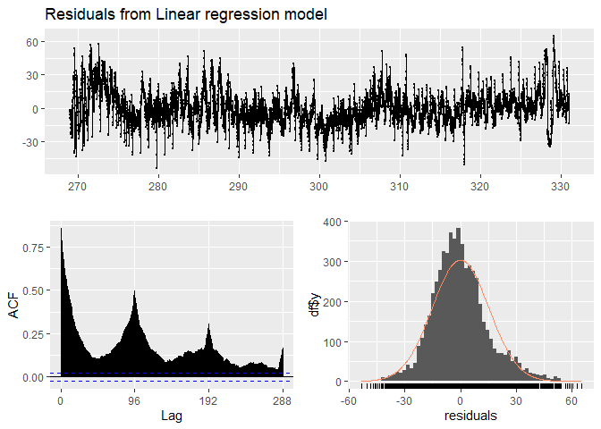

    ## 
    ##  Breusch-Godfrey test for serial correlation of order up to 192
    ## 
    ## data:  Residuals from Linear regression model
    ## LM test = 4655, df = 192, p-value < 2.2e-16

``` r
tsdisplay(residuals(tslm_model))
```

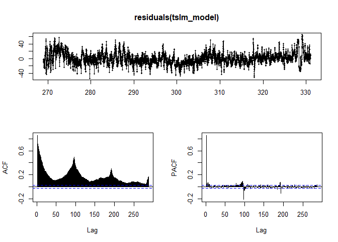

This model tells us that power consumption is very well explained (about
94% of the variation) by temperature, a time trend, and seasonal
effects. In particular:

• The temperature coefficient is highly significant, meaning that for
every one‐unit increase in temperature, power consumption increases by
about 1.425 units, holding other factors constant.

• The trend coefficient is negative and highly significant, which
suggests a very slight downward movement in power consumption over time.
We saw it on the graph.

• The seasonal dummy variables capture strong cyclical patterns
throughout the period. Some seasonal coefficients (especially those
later in the year) are very large and statistically significant,
indicating that power usage in certain seasons differs markedly from the
baseline season. In contrast, a few seasonal dummies (e.g., season2,
season3, season5, season6, season10, etc.) are not statistically
significant, suggesting that not every period deviates significantly
from the baseline.

ACF shows a strong repeating pattern that does not die out quickly, it
may imply that we need seasonal differencing at least D=1. Also Large,
slowly decaying spikes at seasonal lags can incur a seasonal MA
component (𝑄\>0).

Based on the plots from auto arima and tslm we need to consider non zero
P,D,Q

### 3.2.3 Manual ARIMA w/o Xreg

let’s take the parameters from the auto arima as starting point which is
ARIMA(7,0,2)(0,1,0)\[96\] and add P=1 and Q=1

``` r
library(forecast)
arima_manual <- Arima(
ts_historical_cut_train_val[,"power"],
order = c(0,1,9),
seasonal = list(order = c(1,1,1))
)
```

Forecast for the next 2 days (test set)

``` r
library(ggplot2)
library(forecast)
arima_manual_forecast <- forecast(arima_manual, h = 2 * 96)

autoplot(ts_historical_cut_test[,"power"], series = "Test Data") + autolayer(arima_manual_forecast$mean, series="Manual Arima")
```

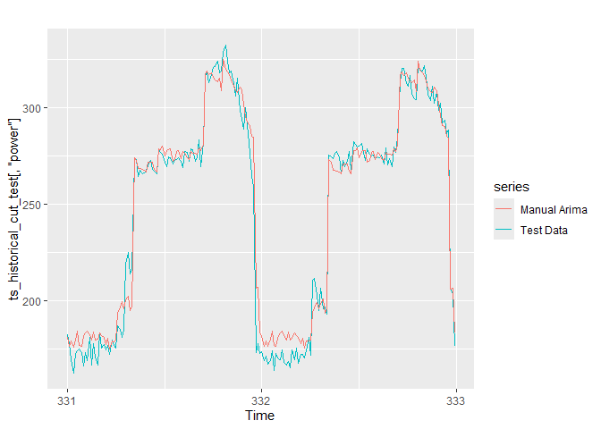

RMSE calculation

``` r
# Calculate the Root Mean Squared Error (RMSE)
arima_manual_rmse <- sqrt(mean((arima_manual_forecast$mean - ts_historical_cut_test[,"power"]) ^ 2))

# Print the RMSE
cat("Manual Arima RMSE:", arima_manual_rmse, "\n")
```

    ## Manual Arima RMSE: 8.299387

Let’s check residuals and parameters.

``` r
summary(arima_manual)
```

    ## Series: ts_historical_cut_train_val[, "power"] 
    ## ARIMA(0,1,9)(1,1,1)[96] 
    ## 
    ## Coefficients:
    ##           ma1      ma2      ma3     ma4      ma5      ma6     ma7     ma8
    ##       -0.4070  -0.0532  -0.0860  0.0237  -0.0512  -0.0333  0.0203  0.0172
    ## s.e.   0.0131   0.0142   0.0141  0.0142   0.0142   0.0143  0.0142  0.0145
    ##          ma9    sar1     sma1
    ## s.e.  0.0132  0.0191   0.0138
    ## 
    ## sigma^2 = 53.54:  log likelihood = -19997.87
    ## AIC=40019.75   AICc=40019.8   BIC=40099.85
    ## 
    ## Training set error measures:
    ##                       ME     RMSE     MAE         MPE     MAPE     MASE
    ## Training set -0.01026584 7.250247 5.37239 -0.04477942 2.087084 0.458964
    ##                       ACF1
    ## Training set -0.0003108443

``` r
checkresiduals(arima_manual)
```

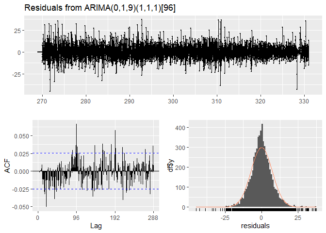

    ## 
    ##  Ljung-Box test
    ## 
    ## data:  Residuals from ARIMA(0,1,9)(1,1,1)[96]
    ## Q* = 344.29, df = 181, p-value = 2.951e-12
    ## 
    ## Model df: 11.   Total lags used: 192

``` r
tsdisplay(residuals(arima_manual))
```

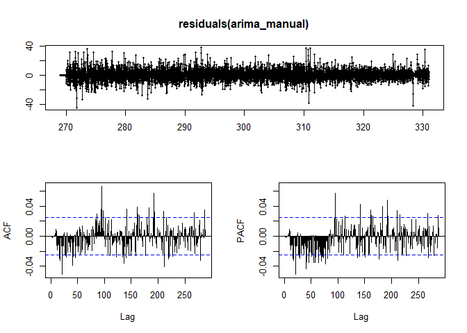

After multiple iterations we have managed to achieve the best result
with the following model

ARIMA(0,1,9)(1,1,1)\[96\]

Theoretically increase of P and Q could improve the result, but the
calculation takes too long. Also the increase of q more than 9 leads to
infinite calculation. Adding any non-zero parameter to p while having
(1,1,1) for (P,D,Q) doesn’t allow even to start training (the code
breaks). Unfortunately despite the best RMSE so far we haven’t managed
to capture the full pattern as the residuals contain patterns. Let’s
test a model with this parameters with temperature as xreg.

### 3.2.4 Manual ARIMA w/ Xreg

let’s take thi model ARIMA(0,1,9)(1,1,1)\[96\] and add temperature as
xreg

``` r
library(forecast)
arima_manual_xreg <- Arima(ts_historical_cut_train_val[,"power"],
                      order = c(0,1,9),
                      seasonal = list(order = c(1,1,1)),
                      xreg = ts_historical_cut_train_val[,"temp"])
```

Forecast for the next 2 days (test set)

``` r
library(ggplot2)
library(forecast)
arima_manual_xreg_forecast <- forecast(arima_manual_xreg, h = 2 * 96, 
                                  xreg = ts_historical_cut_test[,"temp"])

autoplot(ts_historical_cut_test[,"power"], series = "Test Data") + 
  autolayer(arima_manual_xreg_forecast$mean, series = "Manual Arima w/ Xreg")
```

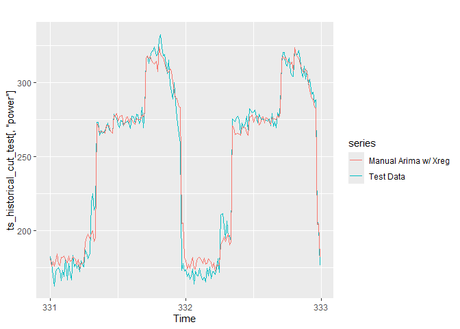

RMSE calculation

``` r
# Calculate the Root Mean Squared Error (RMSE)
arima_manual_xreg_rmse <- sqrt(mean((arima_manual_xreg_forecast$mean - ts_historical_cut_test[,"power"]) ^ 2))

# Print the RMSE
cat("Manual Arima w/ Xreg RMSE:", arima_manual_xreg_rmse, "\n")
```

    ## Manual Arima w/ Xreg RMSE: 8.066566

Let’s check residuals and parameters.

``` r
summary(arima_manual_xreg)
```

    ## Series: ts_historical_cut_train_val[, "power"] 
    ## Regression with ARIMA(0,1,9)(1,1,1)[96] errors 
    ## 
    ## Coefficients:
    ##           ma1      ma2      ma3     ma4      ma5      ma6     ma7     ma8
    ##       -0.4084  -0.0543  -0.0865  0.0232  -0.0524  -0.0346  0.0199  0.0152
    ## s.e.   0.0131   0.0142   0.0141  0.0142   0.0143   0.0143  0.0142  0.0146
    ##          ma9    sar1     sma1    xreg
    ## s.e.  0.0132  0.0191   0.0137  0.1125
    ## 
    ## sigma^2 = 53.49:  log likelihood = -19994.67
    ## AIC=40015.35   AICc=40015.41   BIC=40102.12
    ## 
    ## Training set error measures:
    ##                        ME     RMSE      MAE         MPE     MAPE     MASE
    ## Training set -0.009865449 7.246073 5.364769 -0.04535045 2.083983 0.458313
    ##                       ACF1
    ## Training set -0.0003246181

``` r
checkresiduals(arima_manual_xreg)
```

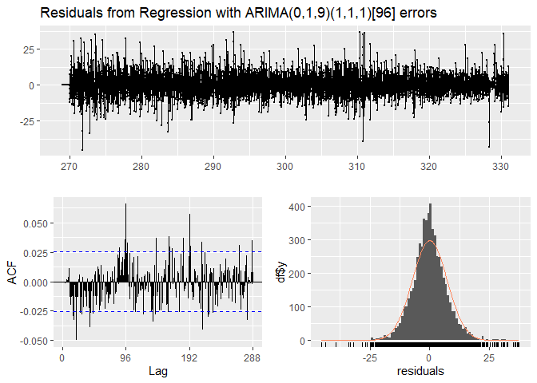

    ## 
    ##  Ljung-Box test
    ## 
    ## data:  Residuals from Regression with ARIMA(0,1,9)(1,1,1)[96] errors
    ## Q* = 340.25, df = 181, p-value = 7.839e-12
    ## 
    ## Model df: 11.   Total lags used: 192

``` r
tsdisplay(residuals(arima_manual_xreg))
```

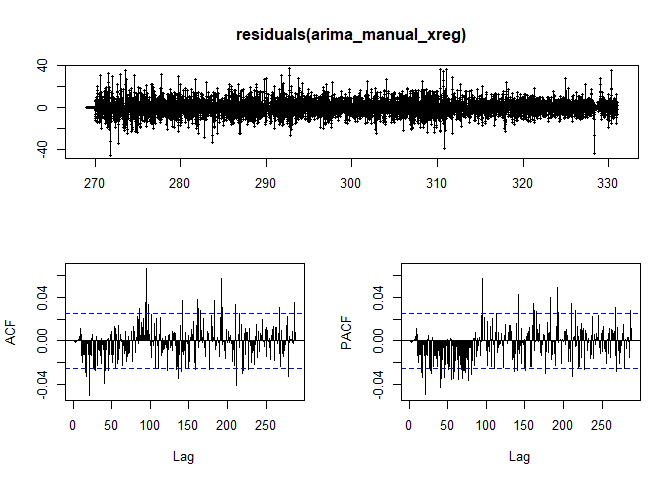

With xreg, we’ve managed to improve the RMSE. However, the residuals
still exhibit autocorrelation. For our upcoming models, we plan to
incorporate xreg right from the start of the training process.


### 3.3.1 NNAR w/ Temperature

Let’s start with NNAR including temperature as xreg with default
parameters.

``` r
library(forecast)
nnar_temp=nnetar(ts_historical_cut_train_val[,2],xreg=ts_historical_cut_train_val[,1])
```

Forecast for the next 2 days (test set)

``` r
library(ggplot2)
library(forecast)
nnar_temp_forecast <- forecast(nnar_temp, h = 2 * 96, 
                                  xreg = ts_historical_cut_test[,1])
```


``` r
autoplot(ts_historical_cut_test[,"power"], series = "Test Data") + 
  autolayer(nnar_temp_forecast$mean, series = "NNAR w/ Temp")
```


From the plot we can see that for some reasons the model performs poorly
at the high peaks. Let’s have a look at RMSE.

``` r
# Calculate the Root Mean Squared Error (RMSE)
nnar_temp_rmse <- sqrt(mean((nnar_temp_forecast$mean - ts_historical_cut_test[,"power"]) ^ 2))
```


``` r
# Print the RMSE
cat("NNAR w/ Temp RMSE:", nnar_temp_rmse, "\n")
```


Interestingly RMSE is even better than the fine tuned HW, but
considerably worse than all ARIMA models.

``` r
summary(nnar_temp)
```

    ##           Length Class        Mode     
    ## x         5952   ts           numeric  
    ## m            1   -none-       numeric  
    ## p            1   -none-       numeric  
    ## P            1   -none-       numeric  
    ## scalex       2   -none-       list     
    ## scalexreg    2   -none-       list     
    ## size         1   -none-       numeric  
    ## xreg      5952   -none-       numeric  
    ## subset    5952   -none-       numeric  
    ## model       20   nnetarmodels list     
    ## nnetargs     0   -none-       list     
    ## fitted    5952   ts           numeric  
    ## residuals 5952   ts           numeric  
    ## lags        31   -none-       numeric  
    ## series       1   -none-       character
    ## method       1   -none-       character
    ## call         3   -none-       call

``` r
checkresiduals(nnar_temp)
```

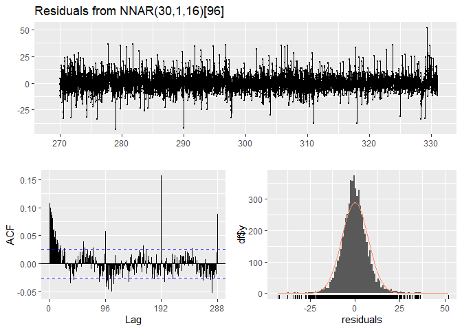

    ## 
    ##  Ljung-Box test
    ## 
    ## data:  Residuals from NNAR(30,1,16)[96]
    ## Q* = 865.82, df = 192, p-value < 2.2e-16
    ## 
    ## Model df: 0.   Total lags used: 192

``` r
tsdisplay(residuals(nnar_temp))
```

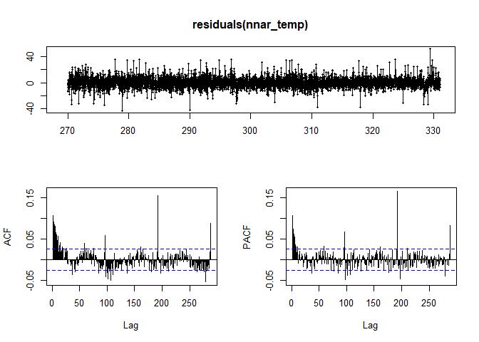

As before we still don’t see the white noise in ACF and PACF (some
pattern is still here).

### 3.3.2 NNAR w/ Temperature & Daytime

In paragraph 2.8 devoted to the relationship between power and
temperature we have identified 4 time clusters: Night, Morning, Day,
Evening. Let’s add these parameters through one-hot encoding into xreg
along with the temperature.

``` r
library(forecast)
nnar_temp_dt=nnetar(ts_historical_cut_train_val[,2],xreg=ts_historical_cut_train_val[, c(1, 3, 4, 5, 6)])
```

Forecast for the next 2 days (test set)

``` r
library(ggplot2)
library(forecast)
nnar_temp_dt_forecast <- forecast(nnar_temp_dt, h = 2 * 96, 
                                  xreg = ts_historical_cut_test[, c(1, 3, 4, 5, 6)])
```


``` r
autoplot(ts_historical_cut_test[,"power"], series = "Test Data") + 
  autolayer(nnar_temp_dt_forecast$mean, series = "NNAR w/ Xreg & Daytime")
```


RMSE calculation

``` r
# Calculate the Root Mean Squared Error (RMSE)
nnar_temp_dt_rmse <- sqrt(mean((nnar_temp_dt_forecast$mean - ts_historical_cut_test[,"power"]) ^ 2))
```


``` r
# Print the RMSE
cat("NNAR w/ Temp & Daytime:", nnar_temp_dt_rmse, "\n")
```


By adding daytime as an additional xreg we have substantially improved
the performance of the model. The result is comparable to basic Auto
Arima.

``` r
summary(nnar_temp_dt)
```

    ##           Length Class        Mode     
    ## x          5952  ts           numeric  
    ## m             1  -none-       numeric  
    ## p             1  -none-       numeric  
    ## P             1  -none-       numeric  
    ## scalex        2  -none-       list     
    ## scalexreg     2  -none-       list     
    ## size          1  -none-       numeric  
    ## xreg      29760  mts          numeric  
    ## subset     5952  -none-       numeric  
    ## model        20  nnetarmodels list     
    ## nnetargs      0  -none-       list     
    ## fitted     5952  ts           numeric  
    ## residuals  5952  ts           numeric  
    ## lags         31  -none-       numeric  
    ## series        1  -none-       character
    ## method        1  -none-       character
    ## call          3  -none-       call

``` r
print(nnar_temp_dt)
```

    ## Series: ts_historical_cut_train_val[, 2] 
    ## Model:  NNAR(30,1,18)[96] 
    ## Call:   nnetar(y = ts_historical_cut_train_val[, 2], xreg = ts_historical_cut_train_val[, 
    ##     c(1, 3, 4, 5, 6)])
    ## 
    ## Average of 20 networks, each of which is
    ## $n
    ## [1] 36 18  1
    ## 
    ## $nunits
    ## [1] 56
    ## 
    ## $nconn
    ##  [1]   0   0   0   0   0   0   0   0   0   0   0   0   0   0   0   0   0   0   0
    ## [20]   0   0   0   0   0   0   0   0   0   0   0   0   0   0   0   0   0   0   0
    ## [39]  37  74 111 148 185 222 259 296 333 370 407 444 481 518 555 592 629 666 685
    ## 
    ## $conn
    ##   [1]  0  1  2  3  4  5  6  7  8  9 10 11 12 13 14 15 16 17 18 19 20 21 22 23 24
    ##  [26] 25 26 27 28 29 30 31 32 33 34 35 36  0  1  2  3  4  5  6  7  8  9 10 11 12
    ##  [51] 13 14 15 16 17 18 19 20 21 22 23 24 25 26 27 28 29 30 31 32 33 34 35 36  0
    ##  [76]  1  2  3  4  5  6  7  8  9 10 11 12 13 14 15 16 17 18 19 20 21 22 23 24 25
    ## [101] 26 27 28 29 30 31 32 33 34 35 36  0  1  2  3  4  5  6  7  8  9 10 11 12 13
    ## [126] 14 15 16 17 18 19 20 21 22 23 24 25 26 27 28 29 30 31 32 33 34 35 36  0  1
    ## [151]  2  3  4  5  6  7  8  9 10 11 12 13 14 15 16 17 18 19 20 21 22 23 24 25 26
    ## [176] 27 28 29 30 31 32 33 34 35 36  0  1  2  3  4  5  6  7  8  9 10 11 12 13 14
    ## [201] 15 16 17 18 19 20 21 22 23 24 25 26 27 28 29 30 31 32 33 34 35 36  0  1  2
    ## [226]  3  4  5  6  7  8  9 10 11 12 13 14 15 16 17 18 19 20 21 22 23 24 25 26 27
    ## [251] 28 29 30 31 32 33 34 35 36  0  1  2  3  4  5  6  7  8  9 10 11 12 13 14 15
    ## [276] 16 17 18 19 20 21 22 23 24 25 26 27 28 29 30 31 32 33 34 35 36  0  1  2  3
    ## [301]  4  5  6  7  8  9 10 11 12 13 14 15 16 17 18 19 20 21 22 23 24 25 26 27 28
    ## [326] 29 30 31 32 33 34 35 36  0  1  2  3  4  5  6  7  8  9 10 11 12 13 14 15 16
    ## [351] 17 18 19 20 21 22 23 24 25 26 27 28 29 30 31 32 33 34 35 36  0  1  2  3  4
    ## [376]  5  6  7  8  9 10 11 12 13 14 15 16 17 18 19 20 21 22 23 24 25 26 27 28 29
    ## [401] 30 31 32 33 34 35 36  0  1  2  3  4  5  6  7  8  9 10 11 12 13 14 15 16 17
    ## [426] 18 19 20 21 22 23 24 25 26 27 28 29 30 31 32 33 34 35 36  0  1  2  3  4  5
    ## [451]  6  7  8  9 10 11 12 13 14 15 16 17 18 19 20 21 22 23 24 25 26 27 28 29 30
    ## [476] 31 32 33 34 35 36  0  1  2  3  4  5  6  7  8  9 10 11 12 13 14 15 16 17 18
    ## [501] 19 20 21 22 23 24 25 26 27 28 29 30 31 32 33 34 35 36  0  1  2  3  4  5  6
    ## [526]  7  8  9 10 11 12 13 14 15 16 17 18 19 20 21 22 23 24 25 26 27 28 29 30 31
    ## [551] 32 33 34 35 36  0  1  2  3  4  5  6  7  8  9 10 11 12 13 14 15 16 17 18 19
    ## [576] 20 21 22 23 24 25 26 27 28 29 30 31 32 33 34 35 36  0  1  2  3  4  5  6  7
    ## [601]  8  9 10 11 12 13 14 15 16 17 18 19 20 21 22 23 24 25 26 27 28 29 30 31 32
    ## [626] 33 34 35 36  0  1  2  3  4  5  6  7  8  9 10 11 12 13 14 15 16 17 18 19 20
    ## [651] 21 22 23 24 25 26 27 28 29 30 31 32 33 34 35 36  0 37 38 39 40 41 42 43 44
    ## [676] 45 46 47 48 49 50 51 52 53 54
    ## 
    ## $nsunits
    ## [1] 55
    ## 
    ## $decay
    ## [1] 0
    ## 
    ## $entropy
    ## [1] FALSE
    ## 
    ## $softmax
    ## [1] FALSE
    ## 
    ## $censored
    ## [1] FALSE
    ## 
    ## $value
    ## [1] 80.2789
    ## 
    ## $wts
    ##   [1]  1.610328778  0.315552363  0.595597609  0.546702381 -0.233249558
    ##   [6]  0.099972586 -0.034630657  0.006182401 -0.319055553  0.370690806
    ##  [11]  0.129084977 -0.079397993 -0.080753285 -0.179455750  0.597694071
    ##  [16] -0.557520626 -0.610161979  0.284589137  0.144483587 -0.241681781
    ##  [21]  0.039963801  0.412060775  0.184797573 -0.307100439  0.211382975
    ##  [26] -0.526015833  0.636648660 -0.242239244 -0.202571825  0.352529821
    ##  [31] -0.389421974 -1.493731756 -0.605038837 -0.015354760 -0.308852866
    ##  [36] -0.060037390  0.130823262  0.575793475 -2.198464976  0.502684033
    ##  [41]  1.864910755 -0.193307387 -0.254541531  0.352871032  0.600153896
    ##  [46] -0.256440368 -0.427993568  0.312047287 -0.159275889  0.793271275
    ##  [51]  0.075888245 -0.786009423 -0.116751723  0.816731286  0.291507392
    ##  [56]  0.066602022 -1.028505915  0.516101699 -1.035440747  0.153716188
    ##  [61] -0.284273622  1.160232910 -0.538387493 -0.558455001 -0.249984695
    ##  [66]  0.051149420  0.374286738  0.167400174  1.435549410  0.254081775
    ##  [71] -0.367246030 -0.054186063  0.432940278  0.003667715 -0.433859578
    ##  [76] -1.056780583  0.504465933 -0.266026300 -1.404935025 -0.027684372
    ##  [81]  0.165044952 -0.579355275 -2.045291502  0.457129641  0.200961004
    ##  [86] -0.755385934  1.356913053  1.322536745  0.023927428  1.401128080
    ##  [91]  1.847908649  0.374512798  0.097793603  0.254312359 -0.247724508
    ##  [96] -0.577654418 -0.662769963 -0.106985938  0.291107429  0.307274522
    ## [101] -1.205289996  0.379994252  0.176239766 -0.046398750  0.617536309
    ## [106] -3.491558709  0.227967999  1.847651551  0.390775469 -1.202624226
    ## [111] -1.038022869  0.572737773 -0.259780048 -1.044900290 -1.263414064
    ## [116] -0.480868305  0.438667533 -0.017074172 -0.169997462 -0.383073811
    ## [121]  0.200336175  0.288104679 -0.425259706  0.301270632  0.902399932
    ## [126]  0.972355734  1.053806755  0.353921762 -0.012118947 -1.054100425
    ## [131] -1.090420797 -0.613160498 -0.244975485  0.619420802 -0.136143747
    ## [136]  0.703453233 -0.280115297 -0.415875303 -0.359574908 -0.149653448
    ## [141] -0.687171872  0.790038525 -1.532411104  0.276704328 -1.625302919
    ## [146]  0.907965375  1.073784302 -0.654674469 -1.596734248  1.828810144
    ## [151] -0.389119666 -0.615557121  0.332980748 -0.065278175  0.455499718
    ## [156]  0.214389112 -0.034609164  0.132697589  0.008671164  0.010544640
    ## [161] -0.176171505 -0.392044507 -0.171804441  0.092549224 -0.436395751
    ## [166]  0.083504743 -0.285038411 -0.374449086 -0.128489178  0.508447314
    ## [171]  0.319878018 -0.081487472 -0.001337578  0.010576395  0.274105154
    ## [176] -0.454821241 -0.035750197  0.176910614 -0.587631310  0.684586317
    ## [181]  0.059401064  1.095552557 -1.400653518 -1.021416954  0.309755258
    ## [186]  2.502836645 -0.059763917 -0.034117189 -0.017590955  0.301140639
    ## [191]  0.125311020 -0.274294162  0.534672151 -0.303163005  0.210458740
    ## [196] -0.343921737  0.733828878 -0.399350676  0.453124424  0.257632941
    ## [201] -0.524465873  0.200589761 -0.120168033 -0.137017983 -0.004236819
    ## [206] -0.258152268 -0.599162446  0.099351330 -0.084340777  0.181634725
    ## [211]  0.488351132  0.229462988 -0.520400102  0.630051845 -0.486073152
    ## [216] -0.099762381 -0.061673463  0.188090933 -0.579862082  1.706606938
    ## [221] -1.063872128 -0.915695409 -2.054993252  1.836427387 -1.902978624
    ## [226] -1.889793364 -2.855492452 -0.295587930 -0.366317292 -0.653438747
    ## [231] -1.515242956 -1.751839697 -0.332954624  0.223360384 -0.167356387
    ## [236]  0.830693604  0.433585421  1.111750867  0.908043429 -0.350209076
    ## [241]  0.377178403  0.701565442 -0.259729720 -0.004272006 -0.297340844
    ## [246]  0.724344578 -0.762720083 -0.717998115 -0.416385431  0.592349033
    ## [251]  0.530411087 -0.446812971  1.539703472  1.753088589  0.434548521
    ## [256]  0.300910182  0.604555689  0.185484316 -2.186155183 -0.037579287
    ## [261] -0.448961026  0.741432535  0.536731177 -0.318718049  0.089860883
    ## [266] -0.137585533 -0.794429316 -0.923454677 -0.184298757  0.066121128
    ## [271] -0.625900920 -1.111953620 -0.180758281 -0.451238534 -1.389789193
    ## [276] -0.848904441  0.541012348  0.853066697 -0.200903912 -0.106261293
    ## [281]  0.869034185  0.646977132 -0.027612387 -0.431522655  0.117580395
    ## [286]  0.487442578 -0.074111012 -0.518453624  0.437631257  0.771384062
    ## [291]  1.760335002 -0.450003953 -1.156862807  0.428576917  1.451056669
    ## [296] -0.649351327  0.506651613  3.256842901  0.578147891 -0.587677192
    ## [301] -0.255946567  0.191969384 -0.174851455 -0.393420360  0.038228591
    ## [306]  0.678444519  0.023566097  0.087497926  0.963952246 -0.038496196
    ## [311]  0.322893166 -0.611567431  0.278667133  0.226477351 -1.147002386
    ## [316]  0.534129569 -0.309450582  0.725980724 -0.051336670 -1.081931480
    ## [321]  0.888489275  0.510232754 -0.942739629  0.356974947  0.065133015
    ## [326]  0.560318872 -0.578672402 -3.366319386 -0.158549200 -1.210641343
    ## [331]  0.289795797 -0.699645866  2.414652703  0.888693530  0.401337976
    ## [336] -0.142251004  0.466226502  0.009760996  0.298722081 -0.100485246
    ## [341]  0.043243953  0.624966342  0.347044506 -0.288392592 -0.994483533
    ## [346] -1.058427432 -0.422896716 -0.502217118 -1.337323179 -1.035006567
    ## [351] -0.734534339 -0.901418596  0.451859681 -0.206644129 -0.135052935
    ## [356]  0.938101038  0.458486745 -0.646905289 -1.355861802 -0.933684163
    ## [361]  0.043569113 -0.634935535  0.595951184 -0.800808053 -1.344855244
    ## [366] -2.234258089 -0.999172919 -0.092370377  0.845916376  0.070900700
    ## [371]  0.477307454  2.868821114 -0.112128569  0.797323871 -0.664478439
    ## [376] -0.898407205 -0.139015224 -0.512011045 -0.239998584  1.435286569
    ## [381] -0.340752631 -0.270876053  0.211239697 -0.173026031  0.744463191
    ## [386] -0.234799904  0.183529018 -0.685197148  0.444550622 -0.247632221
    ## [391]  0.053206869  0.592198409  0.064642269  0.971446980 -0.654143064
    ## [396] -0.639019241  0.540363273 -0.758402481 -0.628408851 -0.480757246
    ## [401] -0.270725363  1.019521603 -0.113629585  1.502169591  1.938966793
    ## [406] -0.475104392 -1.591800144 -1.021513349 -1.121736373 -0.181725714
    ## [411]  0.695153585  0.492746191  0.038417521  0.463509142  0.128284554
    ## [416]  0.082988223  0.290739719  0.598193403  0.486382638  0.094958631
    ## [421]  0.024760008  0.278284921  0.156284032  0.492717396  0.390160889
    ## [426]  0.095898343 -0.138069807 -0.066579288 -0.007787581  0.105231775
    ## [431]  0.201814899  0.736435074 -0.187798728  0.391403163  0.257365243
    ## [436]  0.506399731  1.024947084  0.456685809  1.222921616  0.579078190
    ## [441] -0.248831028 -0.179574366  0.582643482  0.835019225  0.397382210
    ## [446] -2.121821446 -0.800602885  0.196144443  0.919641463 -0.001658862
    ## [451]  0.793029930  0.218594022  0.790531980 -0.500467006 -0.285739536
    ## [456]  0.476262164 -0.500275952 -0.993897529  0.463848639  0.180943545
    ## [461]  0.431403088 -0.533747261 -1.265795114  0.029215546  0.426313541
    ## [466]  0.511850993  0.322608450  0.020857053  0.595159740 -0.130860147
    ## [471] -1.063220056 -0.595898294  0.002134108 -1.120528296 -0.421942063
    ## [476]  2.505823060 -0.251283409  1.565505830 -0.521900461 -0.997135513
    ## [481]  0.199792004  0.440439086  0.261708943  0.495208885  0.781675691
    ## [486] -0.189730510  0.928020487  0.277038601  0.667395102  0.180945819
    ## [491]  0.384633588  0.114274997  0.425507776  0.357976188 -0.096287602
    ## [496]  0.288074703  0.849427307  0.615284312  0.652249029  0.498090146
    ## [501] -0.603493688  0.190454212  0.284196614  0.139208705 -0.277067366
    ## [506] -0.728654935  0.591205226 -0.092141184  0.014689259  0.484410932
    ## [511] -0.204815761  0.054381588 -0.111775985 -0.588940519  0.144569894
    ## [516] -0.595539587  1.552366287  0.543006968  0.366592818 -1.882383924
    ## [521] -1.276471893 -0.252766246 -1.176145371 -0.517755617  0.410810918
    ## [526] -0.451128024  1.046923322 -0.414657579  0.415511740  0.256348474
    ## [531]  0.712096162  0.102155624 -0.152963182 -0.544166296  0.682619923
    ## [536] -0.818460982 -0.793438712 -0.223756598  0.018585620  0.089742859
    ## [541] -0.313100078  0.201110082  0.129806026  0.220678025 -1.331561347
    ## [546] -0.079495035 -0.493870456  1.087556570  0.466775763  0.462067856
    ## [551]  0.350635632 -0.151416756  0.151940944 -1.004463341  0.629865616
    ## [556] -1.652367789 -2.009876169  3.779127167  1.200178815  0.781076693
    ## [561]  0.219432367  0.013403092 -0.007492360 -0.360789114 -0.129694918
    ## [566]  0.390004442 -0.058910802 -0.820634318  0.340673940  1.246817711
    ## [571] -0.400124828 -0.297422696  0.074993475 -0.097595258 -0.162708408
    ## [576]  0.552819938 -0.317559536 -0.443246703 -0.090293472  0.005361559
    ## [581] -0.591683600 -0.146361629 -0.576140827  0.162889376 -0.932193964
    ## [586]  1.999346174 -1.495774639 -0.223087832  1.282682010 -0.575904697
    ## [591] -0.323361235 -1.442299878  0.415523843  1.484790026  0.505952001
    ## [596]  0.455691862  0.794611846  0.607606779  0.180450648  0.652132021
    ## [601]  0.486322488 -0.622142914 -0.633508111 -0.857227688 -0.677267558
    ## [606] -0.444026120  0.911505657 -0.642860609 -0.539451442 -0.207558719
    ## [611]  0.529037736  0.362643241  0.312383799 -0.091925178  0.473267157
    ## [616] -0.010193538 -0.229075664  0.421202075 -0.258568268  1.042525098
    ## [621]  0.017734016 -0.294213899 -1.077218498  0.056847119 -1.289916503
    ## [626]  1.278000849  1.839910831 -1.178244247 -3.052596381 -1.293612658
    ## [631] -1.072559489  1.870292154 -0.067313113 -0.447734940 -0.005676716
    ## [636]  0.688104371  0.671122539 -0.580579259 -0.288902124  0.439529533
    ## [641] -0.743644426 -1.117227182 -0.091746418 -0.347687983 -1.362471154
    ## [646] -0.472529218 -0.885041287  0.345354803  0.340995375  0.580287055
    ## [651] -1.044679933 -0.312992011  0.331286467 -0.156280796  0.526352882
    ## [656] -0.219251950  0.295581315 -0.833080808 -0.038277777 -0.627247455
    ## [661]  0.710204518 -0.739336876  0.390782510  0.298202725 -0.409794326
    ## [666]  0.889917447  0.241471761 -0.913091079  0.479766118 -1.042267487
    ## [671] -0.124452525  0.915462184 -0.001801219  0.338953513 -0.091150833
    ## [676]  0.423749388  0.131342875  0.479298005  0.156398321 -0.260316895
    ## [681] -0.073853219 -0.357139134  0.382028786  0.267066738 -0.226835622
    ## 
    ## $convergence
    ## [1] 1
    ## 
    ## $fitted.values
    ##                  [,1]
    ##    [1,] -0.7605668900
    ##    [2,] -0.8492987315
    ##    [3,] -0.7729328283
    ##    [4,] -0.8196209059
    ##    [5,] -0.8369733061
    ##    [6,] -0.8476751736
    ##    [7,] -1.1961801391
    ##    [8,] -1.1781940008
    ##    [9,] -1.1196424606
    ##   [10,] -1.0551794847
    ##   [11,] -1.1112246800
    ##   [12,] -1.0900072891
    ##   [13,] -1.1567341490
    ##   [14,] -1.1346679405
    ##   [15,] -1.1712846163
    ##   [16,] -1.1139045329
    ##   [17,] -1.1050439965
    ##   [18,] -1.0859175199
    ##   [19,] -1.0818970397
    ##   [20,] -1.1636289705
    ##   [21,] -1.1532169462
    ##   [22,] -1.1901402749
    ##   [23,] -1.0806612346
    ##   [24,] -1.0321822729
    ##   [25,] -1.0740239039
    ##   [26,] -0.8165497117
    ##   [27,] -0.6203567957
    ##   [28,] -0.6731571334
    ##   [29,] -0.5944906217
    ##   [30,] -0.6826043791
    ##   [31,] -0.7634515220
    ##   [32,] -0.6632078716
    ##   [33,] -0.5944998551
    ##   [34,]  0.6279069196
    ##   [35,]  0.7494100922
    ##   [36,]  0.6320840614
    ##   [37,]  0.5930888140
    ##   [38,]  0.6859272707
    ##   [39,]  0.8078518652
    ##   [40,]  0.9630096453
    ##   [41,]  0.9134164793
    ##   [42,]  1.1216791436
    ##   [43,]  1.3693878802
    ##   [44,]  1.2348679599
    ##   [45,]  1.2340231893
    ##   [46,]  1.4256849793
    ##   [47,]  1.5694492062
    ##   [48,]  1.4953709061
    ##   [49,]  1.4907663657
    ##   [50,]  1.7159894766
    ##   [51,]  1.8841498227
    ##   [52,]  1.7088157321
    ##   [53,]  1.7779159104
    ##   [54,]  1.7717066008
    ##   [55,]  1.8728223908
    ##   [56,]  1.8696934317
    ##   [57,]  1.8486474081
    ##   [58,]  1.6924681020
    ##   [59,]  1.4132284895
    ##   [60,]  1.2016869613
    ##   [61,]  0.9724123852
    ##   [62,]  0.9526397116
    ##   [63,]  1.1410729661
    ##   [64,]  1.2208925854
    ##   [65,]  1.3179909228
    ##   [66,]  1.2094907889
    ##   [67,]  1.3407188534
    ##   [68,]  1.2559635302
    ##   [69,]  1.1273083406
    ##   [70,]  1.0841053164
    ##   [71,]  1.1694399746
    ##   [72,]  1.0214746382
    ##   [73,]  1.0783626270
    ##   [74,]  1.5217522846
    ##   [75,]  1.8012064875
    ##   [76,]  1.5322666980
    ##   [77,]  1.8307138739
    ##   [78,]  2.1852388007
    ##   [79,]  2.2012663164
    ##   [80,]  2.1862872370
    ##   [81,]  2.0524992641
    ##   [82,]  2.0909193420
    ##   [83,]  2.0165890061
    ##   [84,]  1.9818962208
    ##   [85,]  1.8954458117
    ##   [86,]  1.9400302386
    ##   [87,]  1.9732945512
    ##   [88,]  1.7706560098
    ##   [89,]  1.8598701023
    ##   [90,]  1.7315470156
    ##   [91,]  1.5439262144
    ##   [92,]  1.4254830981
    ##   [93,]  1.3389176414
    ##   [94,] -0.1942451703
    ##   [95,] -0.3296973451
    ##   [96,] -0.7898860783
    ##   [97,] -0.6355693181
    ##   [98,] -0.7420728685
    ##   [99,] -0.8924274896
    ##  [100,] -0.8996605784
    ##  [101,] -0.9193983399
    ##  [102,] -0.7619770156
    ##  [103,] -1.0356709865
    ##  [104,] -1.0464623033
    ##  [105,] -1.0075809700
    ##  [106,] -0.9330729374
    ##  [107,] -0.9226494486
    ##  [108,] -0.8726970587
    ##  [109,] -0.9074662569
    ##  [110,] -0.9187075289
    ##  [111,] -0.9800470381
    ##  [112,] -1.0062452795
    ##  [113,] -0.9552507520
    ##  [114,] -0.9343521278
    ##  [115,] -0.9514703479
    ##  [116,] -1.0373661244
    ##  [117,] -1.0039571069
    ##  [118,] -1.1219296765
    ##  [119,] -1.0935121466
    ##  [120,] -0.9904555654
    ##  [121,] -0.8589944439
    ##  [122,] -0.6833677765
    ##  [123,] -0.4468054425
    ##  [124,] -0.3986093475
    ##  [125,] -0.3775780761
    ##  [126,] -0.4252410163
    ##  [127,] -0.5797460693
    ##  [128,] -0.5657285008
    ##  [129,] -0.3567654787
    ##  [130,]  0.6516923937
    ##  [131,]  0.8706218582
    ##  [132,]  0.8249232681
    ##  [133,]  0.6581296775
    ##  [134,]  0.8520782158
    ##  [135,]  0.9395581764
    ##  [136,]  0.8947052445
    ##  [137,]  1.0704044167
    ##  [138,]  1.4010066075
    ##  [139,]  1.3428385834
    ##  [140,]  1.3166789423
    ##  [141,]  1.4272060516
    ##  [142,]  1.5372563701
    ##  [143,]  1.6038399380
    ##  [144,]  1.6490159468
    ##  [145,]  1.7159222059
    ##  [146,]  1.7778736578
    ##  [147,]  1.8389678979
    ##  [148,]  1.7779220512
    ##  [149,]  1.7558357742
    ##  [150,]  1.8887542803
    ##  [151,]  2.0102840405
    ##  [152,]  1.9192916342
    ##  [153,]  1.9043675452
    ##  [154,]  1.8833285522
    ##  [155,]  1.6279606299
    ##  [156,]  1.6134929661
    ##  [157,]  1.6884532779
    ##  [158,]  1.6740597861
    ##  [159,]  1.8802541439
    ##  [160,]  1.7453546667
    ##  [161,]  1.6287535581
    ##  [162,]  1.6523734185
    ##  [163,]  1.6010065484
    ##  [164,]  1.6026192535
    ##  [165,]  1.5467197498
    ##  [166,]  1.5558120166
    ##  [167,]  1.5502052537
    ##  [168,]  1.4179074946
    ##  [169,]  1.2832022726
    ##  [170,]  1.5719508004
    ##  [171,]  1.5947475800
    ##  [172,]  1.6064427745
    ##  [173,]  1.6066292557
    ##  [174,]  2.1029307339
    ##  [175,]  2.1202335383
    ##  [176,]  1.9350552256
    ##  [177,]  2.0056402652
    ##  [178,]  1.8672092942
    ##  [179,]  1.8102633511
    ##  [180,]  1.7512735578
    ##  [181,]  1.7240098851
    ##  [182,]  1.6145809468
    ##  [183,]  1.6130983863
    ##  [184,]  1.5130240932
    ##  [185,]  1.4020787509
    ##  [186,]  1.3871521329
    ##  [187,]  1.1907330290
    ##  [188,]  1.1649169757
    ##  [189,]  1.0885034717
    ##  [190,] -0.4699250098
    ##  [191,] -0.3538768179
    ##  [192,] -0.8765354472
    ##  [193,] -0.5829458819
    ##  [194,] -0.5174802035
    ##  [195,] -0.4354034186
    ##  [196,] -0.4278352102
    ##  [197,] -0.4802182461
    ##  [198,] -0.4042234477
    ##  [199,] -0.6756062979
    ##  [200,] -0.6617933317
    ##  [201,] -0.5852988906
    ##  [202,] -0.5132164741
    ##  [203,] -0.4601909929
    ##  [204,] -0.5170231100
    ##  [205,] -0.5373850964
    ##  [206,] -0.5380620553
    ##  [207,] -0.6006254193
    ##  [208,] -0.5635243675
    ##  [209,] -0.5427018398
    ##  [210,] -0.6084054652
    ##  [211,] -0.5399868999
    ##  [212,] -0.5987966357
    ##  [213,] -0.6940756215
    ##  [214,] -0.7409723087
    ##  [215,] -0.5498047846
    ##  [216,] -0.5652631565
    ##  [217,] -0.3891479025
    ##  [218,] -0.3035105494
    ##  [219,] -0.2134754556
    ##  [220,] -0.4262114830
    ##  [221,] -0.3385336062
    ##  [222,] -0.4394965542
    ##  [223,] -0.4510415660
    ##  [224,] -0.5410836905
    ##  [225,] -0.3341798561
    ##  [226,]  0.6385573007
    ##  [227,]  0.9484195875
    ##  [228,]  0.9892015161
    ##  [229,]  0.8956215463
    ##  [230,]  0.8397597191
    ##  [231,]  0.8930804041
    ##  [232,]  0.8165203987
    ##  [233,]  0.9492974274
    ##  [234,]  0.9775757116
    ##  [235,]  1.0323040010
    ##  [236,]  1.0012298150
    ##  [237,]  0.9664253867
    ##  [238,]  1.0878630503
    ##  [239,]  1.2539504000
    ##  [240,]  1.1874211948
    ##  [241,]  1.3522917504
    ##  [242,]  1.4146212194
    ##  [243,]  1.3603441198
    ##  [244,]  1.2950832755
    ##  [245,]  1.3929873066
    ##  [246,]  1.4061549045
    ##  [247,]  1.4348564352
    ##  [248,]  1.4523700348
    ##  [249,]  1.5178821564
    ##  [250,]  1.5259696497
    ##  [251,]  1.4476730145
    ##  [252,]  1.2296384741
    ##  [253,]  1.2897501369
    ##  [254,]  1.2937639518
    ##  [255,]  1.6005347121
    ##  [256,]  1.4560384648
    ##  [257,]  1.3737370981
    ##  [258,]  1.2842340321
    ##  [259,]  1.3199589057
    ##  [260,]  1.2014273907
    ##  [261,]  1.3104203545
    ##  [262,]  1.2843245154
    ##  [263,]  1.2060687037
    ##  [264,]  1.0725692997
    ##  [265,]  1.2182142164
    ##  [266,]  1.2372484128
    ##  [267,]  1.3027869132
    ##  [268,]  0.9832656693
    ##  [269,]  1.3385661160
    ##  [270,]  1.8758188203
    ##  [271,]  1.8507704079
    ##  [272,]  1.7437141709
    ##  [273,]  1.6139796964
    ##  [274,]  1.5497537203
    ##  [275,]  1.4420220472
    ##  [276,]  1.4483154853
    ##  [277,]  1.4466749086
    ##  [278,]  1.3832536202
    ##  [279,]  1.3713220575
    ##  [280,]  1.2654255417
    ##  [281,]  1.2078937653
    ##  [282,]  1.2363245590
    ##  [283,]  1.2255770657
    ##  [284,]  1.0666489873
    ##  [285,]  1.2149811412
    ##  [286,] -0.1602475159
    ##  [287,] -0.3357356067
    ##  [288,] -0.8752164398
    ##  [289,] -0.5061191464
    ##  [290,] -0.6221554084
    ##  [291,] -0.5036275323
    ##  [292,] -0.6357687084
    ##  [293,] -0.6043262980
    ##  [294,] -0.5183171216
    ##  [295,] -0.5384540502
    ##  [296,] -0.5244205421
    ##  [297,] -0.4133509597
    ##  [298,] -0.5513637404
    ##  [299,] -0.2949839131
    ##  [300,] -0.4072524391
    ##  [301,] -0.4117667463
    ##  [302,] -0.4320023329
    ##  [303,] -0.5320654905
    ##  [304,] -0.5269453791
    ##  [305,] -0.5578495869
    ##  [306,] -0.4758413610
    ##  [307,] -0.4267119304
    ##  [308,] -0.6021794975
    ##  [309,] -0.5222083294
    ##  [310,] -0.5782925341
    ##  [311,] -0.5091405338
    ##  [312,] -0.4042834178
    ##  [313,] -0.3337824668
    ##  [314,] -0.1294787344
    ##  [315,] -0.1504991031
    ##  [316,] -0.3401839519
    ##  [317,] -0.0821931408
    ##  [318,] -0.2041671953
    ##  [319,] -0.4514929227
    ##  [320,] -0.1803888945
    ##  [321,] -0.3554156747
    ##  [322,]  0.6592799438
    ##  [323,]  1.0288010979
    ##  [324,]  0.9739698831
    ##  [325,]  0.8432187054
    ##  [326,]  0.9063983995
    ##  [327,]  0.8899759516
    ##  [328,]  0.9299901322
    ##  [329,]  0.7909364870
    ##  [330,]  0.8502955985
    ##  [331,]  0.8592704972
    ##  [332,]  0.7602310827
    ##  [333,]  0.9389022862
    ##  [334,]  1.0017403020
    ##  [335,]  0.9803315787
    ##  [336,]  0.9868539632
    ##  [337,]  1.0072388955
    ##  [338,]  0.9339535373
    ##  [339,]  1.0181944527
    ##  [340,]  0.9447810544
    ##  [341,]  1.0724018039
    ##  [342,]  1.1480608474
    ##  [343,]  1.0054032236
    ##  [344,]  0.9541980682
    ##  [345,]  1.0912909478
    ##  [346,]  0.8151166380
    ##  [347,]  0.9467545503
    ##  [348,]  0.8977677705
    ##  [349,]  0.9929293990
    ##  [350,]  1.1512382515
    ##  [351,]  1.1307806224
    ##  [352,]  1.0883580052
    ##  [353,]  1.1097830570
    ##  [354,]  1.1341964191
    ##  [355,]  1.0662701038
    ##  [356,]  0.9541836898
    ##  [357,]  0.8509177936
    ##  [358,]  0.7454178010
    ##  [359,]  0.7822605591
    ##  [360,]  0.9285321566
    ##  [361,]  1.0596718752
    ##  [362,]  0.9721085263
    ##  [363,]  0.9872755281
    ##  [364,]  0.8741004102
    ##  [365,]  1.2290589080
    ##  [366,]  1.7057960366
    ##  [367,]  1.6425910517
    ##  [368,]  1.5376351409
    ##  [369,]  1.5208988104
    ##  [370,]  1.3717367572
    ##  [371,]  1.3194317449
    ##  [372,]  1.3064408306
    ##  [373,]  1.3208163623
    ##  [374,]  1.3733892986
    ##  [375,]  1.2803722503
    ##  [376,]  1.1740903543
    ##  [377,]  1.1677390540
    ##  [378,]  1.0340818278
    ##  [379,]  0.9066212703
    ##  [380,]  0.9972128950
    ##  [381,]  0.8878329936
    ##  [382,] -0.3617090465
    ##  [383,] -0.5370441969
    ##  [384,] -0.9354281648
    ##  [385,] -0.6978803505
    ##  [386,] -0.6888472715
    ##  [387,] -0.6951163689
    ##  [388,] -0.6384643202
    ##  [389,] -0.6672319011
    ##  [390,] -0.6203305351
    ##  [391,] -0.6712498776
    ##  [392,] -0.6535165177
    ##  [393,] -0.7639268160
    ##  [394,] -0.5838207210
    ##  [395,] -0.6231201300
    ##  [396,] -0.5938937647
    ##  [397,] -0.6688868160
    ##  [398,] -0.6908667063
    ##  [399,] -0.6933914147
    ##  [400,] -0.7859552764
    ##  [401,] -0.6457233625
    ##  [402,] -0.4382955195
    ##  [403,] -0.4770691754
    ##  [404,] -0.5447349937
    ##  [405,] -0.5487819903
    ##  [406,] -0.6362446809
    ##  [407,] -0.5698536163
    ##  [408,] -0.4086717677
    ##  [409,] -0.2824562012
    ##  [410,] -0.2677697178
    ##  [411,] -0.3442091904
    ##  [412,] -0.1439902777
    ##  [413,] -0.3815952358
    ##  [414,] -0.4811406171
    ##  [415,] -0.3531841954
    ##  [416,] -0.6825466454
    ##  [417,] -0.6272340265
    ##  [418,]  0.6761722842
    ##  [419,]  0.6614916471
    ##  [420,]  0.6333487571
    ##  [421,]  0.6170914866
    ##  [422,]  0.5504080103
    ##  [423,]  0.6197061719
    ##  [424,]  0.5960224156
    ##  [425,]  0.6733744981
    ##  [426,]  0.6761854302
    ##  [427,]  0.5536582588
    ##  [428,]  0.4772638776
    ##  [429,]  0.6184749891
    ##  [430,]  0.7816336957
    ##  [431,]  0.8417520182
    ##  [432,]  0.7582702597
    ##  [433,]  0.7936796166
    ##  [434,]  0.9494171693
    ##  [435,]  1.0915209555
    ##  [436,]  0.9211362306
    ##  [437,]  1.0155321726
    ##  [438,]  1.1346168624
    ##  [439,]  1.1847578744
    ##  [440,]  1.1825675082
    ##  [441,]  1.1962251591
    ##  [442,]  1.2503311063
    ##  [443,]  1.3394123689
    ##  [444,]  1.2036370736
    ##  [445,]  1.1288163770
    ##  [446,]  1.1891999835
    ##  [447,]  1.3200996937
    ##  [448,]  1.2422449432
    ##  [449,]  1.2149597776
    ##  [450,]  1.2601449346
    ##  [451,]  1.0644197965
    ##  [452,]  1.1022809716
    ##  [453,]  1.1881181209
    ##  [454,]  1.1089054723
    ##  [455,]  1.0837817452
    ##  [456,]  1.0542530331
    ##  [457,]  1.0769176412
    ##  [458,]  1.0744001167
    ##  [459,]  0.9474310418
    ##  [460,]  0.8984282321
    ##  [461,]  1.3486958601
    ##  [462,]  1.5289390572
    ##  [463,]  1.4889058749
    ##  [464,]  1.4716784711
    ##  [465,]  1.4197690352
    ##  [466,]  1.3712016040
    ##  [467,]  1.3909798221
    ##  [468,]  1.3534460576
    ##  [469,]  1.3623467222
    ##  [470,]  1.2743569552
    ##  [471,]  1.1779508137
    ##  [472,]  1.2248225406
    ##  [473,]  1.1331236829
    ##  [474,]  1.0495478516
    ##  [475,]  1.0110182157
    ##  [476,]  0.9079734656
    ##  [477,]  0.9466212946
    ##  [478,] -0.2407799830
    ##  [479,] -0.4825661897
    ##  [480,] -0.9759287539
    ##  [481,] -0.9909096978
    ##  [482,] -1.1313032243
    ##  [483,] -1.1541890036
    ##  [484,] -1.1050744065
    ##  [485,] -1.1870287845
    ##  [486,] -0.9805118598
    ##  [487,] -1.1451338134
    ##  [488,] -1.1866726481
    ##  [489,] -0.9889197220
    ##  [490,] -1.0494475775
    ##  [491,] -1.0070762355
    ##  [492,] -0.9619706102
    ##  [493,] -1.0177224805
    ##  [494,] -1.0199547566
    ##  [495,] -1.1810165423
    ##  [496,] -1.0812973140
    ##  [497,] -0.9635380613
    ##  [498,] -0.8668990608
    ##  [499,] -0.8852756247
    ##  [500,] -1.0318786938
    ##  [501,] -1.0406121606
    ##  [502,] -1.1236364342
    ##  [503,] -1.0270258466
    ##  [504,] -1.0278783901
    ##  [505,] -0.8325139804
    ##  [506,] -0.7356257983
    ##  [507,] -0.7851535866
    ##  [508,] -0.9056508887
    ##  [509,] -0.7933514862
    ##  [510,] -0.6647425134
    ##  [511,] -0.7767074039
    ##  [512,] -1.0259115590
    ##  [513,] -1.0746570747
    ##  [514,]  0.3498949719
    ##  [515,]  0.4457686430
    ##  [516,]  0.3084434994
    ##  [517,]  0.4317229326
    ##  [518,]  0.4036616910
    ##  [519,]  0.4325352082
    ##  [520,]  0.4596900036
    ##  [521,]  0.4802420686
    ##  [522,]  0.4366463192
    ##  [523,]  0.5621304950
    ##  [524,]  0.5760963971
    ##  [525,]  0.5557688544
    ##  [526,]  0.6452384983
    ##  [527,]  0.6681284220
    ##  [528,]  0.6377413173
    ##  [529,]  0.6998147472
    ##  [530,]  0.8003917166
    ##  [531,]  0.8086956879
    ##  [532,]  0.7512119813
    ##  [533,]  0.8982934910
    ##  [534,]  0.8588998530
    ##  [535,]  0.8798279927
    ##  [536,]  0.9164708458
    ##  [537,]  0.9230795538
    ##  [538,]  0.8963834636
    ##  [539,]  0.8695806470
    ##  [540,]  0.7128182122
    ##  [541,]  0.7785876770
    ##  [542,]  0.8733434239
    ##  [543,]  0.9493900738
    ##  [544,]  0.8360232970
    ##  [545,]  0.8387141854
    ##  [546,]  0.7961240694
    ##  [547,]  0.8261777422
    ##  [548,]  0.8396888465
    ##  [549,]  0.7512082918
    ##  [550,]  0.8350405796
    ##  [551,]  0.7714936550
    ##  [552,]  0.7175296276
    ##  [553,]  1.0557642859
    ##  [554,]  0.8536473972
    ##  [555,]  0.8232248014
    ##  [556,]  0.8522741324
    ##  [557,]  1.1512802858
    ##  [558,]  1.4598282792
    ##  [559,]  1.3813108168
    ##  [560,]  1.5241085661
    ##  [561,]  1.4543902666
    ##  [562,]  1.3169645002
    ##  [563,]  1.2523038021
    ##  [564,]  1.1812219067
    ##  [565,]  1.2168636400
    ##  [566,]  1.1900634072
    ##  [567,]  1.2384433429
    ##  [568,]  1.1490628378
    ##  [569,]  1.0035343182
    ##  [570,]  1.0406985697
    ##  [571,]  0.8504724605
    ##  [572,]  0.7214507806
    ##  [573,]  0.6373766822
    ##  [574,] -0.6264114887
    ##  [575,] -0.8818689339
    ##  [576,] -1.2379302798
    ##  [577,] -1.3373604426
    ##  [578,] -1.3285138920
    ##  [579,] -1.3045734474
    ##  [580,] -1.2957375107
    ##  [581,] -1.2665810177
    ##  [582,] -1.1489697291
    ##  [583,] -1.3625066262
    ##  [584,] -1.3248599958
    ##  [585,] -1.2132346341
    ##  [586,] -1.2370565574
    ##  [587,] -1.2153108460
    ##  [588,] -1.0538338750
    ##  [589,] -1.2115532186
    ##  [590,] -1.1112608481
    ##  [591,] -1.1157467699
    ##  [592,] -1.2417819982
    ##  [593,] -1.2013661179
    ##  [594,] -1.1266703271
    ##  [595,] -1.2815773020
    ##  [596,] -1.3395213457
    ##  [597,] -1.3089415005
    ##  [598,] -1.3281297530
    ##  [599,] -1.2757017652
    ##  [600,] -1.2603579027
    ##  [601,] -1.0884497190
    ##  [602,] -0.9768446371
    ##  [603,] -0.9950715584
    ##  [604,] -1.0636828435
    ##  [605,] -1.0795179614
    ##  [606,] -0.9960377155
    ##  [607,] -0.9963759682
    ##  [608,] -1.1466375442
    ##  [609,] -0.8638176356
    ##  [610,]  0.3316336389
    ##  [611,]  0.3731627352
    ##  [612,]  0.3737675184
    ##  [613,]  0.4187794311
    ##  [614,]  0.3537728569
    ##  [615,]  0.3783047039
    ##  [616,]  0.3805356761
    ##  [617,]  0.5397279201
    ##  [618,]  0.4352951493
    ##  [619,]  0.3822988962
    ##  [620,]  0.3781885406
    ##  [621,]  0.3752843929
    ##  [622,]  0.4302722541
    ##  [623,]  0.3679953118
    ##  [624,]  0.3850032039
    ##  [625,]  0.5334161566
    ##  [626,]  0.5020878782
    ##  [627,]  0.5352475074
    ##  [628,]  0.5305672405
    ##  [629,]  0.5216032961
    ##  [630,]  0.5218554067
    ##  [631,]  0.5190563310
    ##  [632,]  0.4627831503
    ##  [633,]  0.5483443032
    ##  [634,]  0.4755786288
    ##  [635,]  0.6133547026
    ##  [636,]  0.4354902404
    ##  [637,]  0.4628868580
    ##  [638,]  0.4300526824
    ##  [639,]  0.6183968732
    ##  [640,]  0.7572496420
    ##  [641,]  0.7058240666
    ##  [642,]  0.6045664431
    ##  [643,]  0.4966069992
    ##  [644,]  0.4281153236
    ##  [645,]  0.4947078174
    ##  [646,]  0.5003815070
    ##  [647,]  0.5387968793
    ##  [648,]  0.6188016795
    ##  [649,]  0.6692559639
    ##  [650,]  0.6575183600
    ##  [651,]  0.5397422089
    ##  [652,]  0.5825456581
    ##  [653,]  0.9320653891
    ##  [654,]  1.3244741838
    ##  [655,]  1.4270944314
    ##  [656,]  1.3976748678
    ##  [657,]  1.2742206794
    ##  [658,]  1.1089282143
    ##  [659,]  1.0853236117
    ##  [660,]  1.0328815195
    ##  [661,]  1.1229437095
    ##  [662,]  1.1055673251
    ##  [663,]  1.0600471549
    ##  [664,]  1.0302461057
    ##  [665,]  1.0595469617
    ##  [666,]  0.9526466893
    ##  [667,]  0.7605715900
    ##  [668,]  0.6720337347
    ##  [669,]  0.4439058486
    ##  [670,] -0.6873124301
    ##  [671,] -0.6394068328
    ##  [672,] -1.1620456489
    ##  [673,] -1.2387423640
    ##  [674,] -1.3412786819
    ##  [675,] -1.4112226179
    ##  [676,] -1.4372136992
    ##  [677,] -1.4009925374
    ##  [678,] -1.2819322165
    ##  [679,] -1.3809172193
    ##  [680,] -1.4536459673
    ##  [681,] -1.3452595676
    ##  [682,] -1.3209998499
    ##  [683,] -1.3206595223
    ##  [684,] -1.2663978514
    ##  [685,] -1.3021784568
    ##  [686,] -1.2943318106
    ##  [687,] -1.3793912889
    ##  [688,] -1.3301216180
    ##  [689,] -1.3115625307
    ##  [690,] -1.2311257793
    ##  [691,] -1.2627267197
    ##  [692,] -1.3166158847
    ##  [693,] -1.3053089987
    ##  [694,] -1.3422073150
    ##  [695,] -1.3291278471
    ##  [696,] -1.3608806266
    ##  [697,] -1.3341238739
    ##  [698,] -1.1770131325
    ##  [699,] -1.1660900644
    ##  [700,] -1.0467405696
    ##  [701,] -1.0823755153
    ##  [702,] -1.0196046640
    ##  [703,] -1.0039629491
    ##  [704,] -1.0729867649
    ##  [705,] -1.1059657518
    ##  [706,]  0.3483331134
    ##  [707,]  0.3382880191
    ##  [708,]  0.2832025445
    ##  [709,]  0.2396575824
    ##  [710,]  0.1840965933
    ##  [711,]  0.1699068108
    ##  [712,]  0.2010448778
    ##  [713,]  0.2344358855
    ##  [714,]  0.2921388346
    ##  [715,]  0.2929329945
    ##  [716,]  0.2594712279
    ##  [717,]  0.3091223971
    ##  [718,]  0.4985465763
    ##  [719,]  0.6011257007
    ##  [720,]  0.5167687990
    ##  [721,]  0.5031732599
    ##  [722,]  0.6179615523
    ##  [723,]  0.7479375153
    ##  [724,]  0.6414913158
    ##  [725,]  0.6343590988
    ##  [726,]  0.6310830057
    ##  [727,]  0.6436346339
    ##  [728,]  0.5914434893
    ##  [729,]  0.5865424207
    ##  [730,]  0.6932007755
    ##  [731,]  0.8167922387
    ##  [732,]  0.6923636612
    ##  [733,]  0.6930189564
    ##  [734,]  0.7005746117
    ##  [735,]  0.5766407145
    ##  [736,]  0.5400320048
    ##  [737,]  0.4889517110
    ##  [738,]  0.5397014139
    ##  [739,]  0.6044516393
    ##  [740,]  0.5684234516
    ##  [741,]  0.6089542569
    ##  [742,]  0.7906232140
    ##  [743,]  0.7924438078
    ##  [744,]  0.6596124875
    ##  [745,]  0.8517066341
    ##  [746,]  0.7329350682
    ##  [747,]  0.7342071744
    ##  [748,]  0.8117604377
    ##  [749,]  1.3167175223
    ##  [750,]  1.3506234839
    ##  [751,]  1.4185584797
    ##  [752,]  1.4273109234
    ##  [753,]  1.3063630994
    ##  [754,]  1.3306111161
    ##  [755,]  1.3048816835
    ##  [756,]  1.2395716890
    ##  [757,]  1.2552946189
    ##  [758,]  1.2659995565
    ##  [759,]  1.2447216214
    ##  [760,]  1.2191466286
    ##  [761,]  1.1191781728
    ##  [762,]  1.1205106155
    ##  [763,]  1.1565670063
    ##  [764,]  1.1041712572
    ##  [765,]  1.0201574954
    ##  [766,] -0.1123789855
    ##  [767,] -0.3492530172
    ##  [768,] -0.7496827915
    ##  [769,] -0.6912016415
    ##  [770,] -0.8175823473
    ##  [771,] -0.9264576071
    ##  [772,] -0.8030121527
    ##  [773,] -0.9240034660
    ##  [774,] -0.7589439285
    ##  [775,] -0.9005011753
    ##  [776,] -0.9110315256
    ##  [777,] -0.9099607619
    ##  [778,] -0.8724995791
    ##  [779,] -0.8304879975
    ##  [780,] -0.8271300104
    ##  [781,] -0.8175245692
    ##  [782,] -0.8072299599
    ##  [783,] -0.9105023868
    ##  [784,] -0.8551490987
    ##  [785,] -0.9038574757
    ##  [786,] -0.8358448843
    ##  [787,] -0.8519413527
    ##  [788,] -0.8779627936
    ##  [789,] -0.9372701354
    ##  [790,] -0.9579928758
    ##  [791,] -0.9001568449
    ##  [792,] -0.9269420789
    ##  [793,] -0.9327912678
    ##  [794,] -0.8763306528
    ##  [795,] -0.7045495235
    ##  [796,] -0.7887868944
    ##  [797,] -0.7756579371
    ##  [798,] -0.7558580148
    ##  [799,] -0.7762649769
    ##  [800,] -0.8652538199
    ##  [801,] -0.9255422379
    ##  [802,]  0.1992732443
    ##  [803,]  0.3237621110
    ##  [804,]  0.3355925177
    ##  [805,]  0.4159023451
    ##  [806,]  0.3402353788
    ##  [807,]  0.3450121186
    ##  [808,]  0.3406803595
    ##  [809,]  0.3818951093
    ##  [810,]  0.4875246482
    ##  [811,]  0.4521784048
    ##  [812,]  0.3611221040
    ##  [813,]  0.4415489545
    ##  [814,]  0.5882839558
    ##  [815,]  0.6455935535
    ##  [816,]  0.6546787916
    ##  [817,]  0.6723082324
    ##  [818,]  0.6905482032
    ##  [819,]  0.6362471963
    ##  [820,]  0.6738483059
    ##  [821,]  0.6662307947
    ##  [822,]  0.6778713635
    ##  [823,]  0.7453601696
    ##  [824,]  0.7070166597
    ##  [825,]  0.7669956306
    ##  [826,]  0.6997281491
    ##  [827,]  0.7531951557
    ##  [828,]  0.7974848244
    ##  [829,]  0.7629574032
    ##  [830,]  0.6001484293
    ##  [831,]  0.6276611807
    ##  [832,]  0.6262730824
    ##  [833,]  0.6562277273
    ##  [834,]  0.7441115045
    ##  [835,]  0.7948244776
    ##  [836,]  0.8398256667
    ##  [837,]  0.7380291172
    ##  [838,]  0.6125180404
    ##  [839,]  0.5325627746
    ##  [840,]  0.5391550950
    ##  [841,]  0.6838647574
    ##  [842,]  0.7246854230
    ##  [843,]  0.5982229216
    ##  [844,]  0.8394485076
    ##  [845,]  1.2068913346
    ##  [846,]  1.4171633624
    ##  [847,]  1.5632944985
    ##  [848,]  1.4370681144
    ##  [849,]  1.2599939319
    ##  [850,]  1.2433641917
    ##  [851,]  1.1571955226
    ##  [852,]  1.1426216316
    ##  [853,]  1.1408825906
    ##  [854,]  1.2244493580
    ##  [855,]  1.2395319070
    ##  [856,]  1.0867716017
    ##  [857,]  1.1581180124
    ##  [858,]  1.2015566081
    ##  [859,]  1.1516565326
    ##  [860,]  1.0703973976
    ##  [861,]  1.1335307157
    ##  [862,]  0.2758243706
    ##  [863,] -0.3714738542
    ##  [864,] -0.7912251006
    ##  [865,] -0.9562434831
    ##  [866,] -1.0880535007
    ##  [867,] -1.0579168745
    ##  [868,] -1.2975003159
    ##  [869,] -1.0886347671
    ##  [870,] -1.1143446238
    ##  [871,] -1.2477752841
    ##  [872,] -1.1722220306
    ##  [873,] -1.1243920034
    ##  [874,] -1.0192863518
    ##  [875,] -1.0647691065
    ##  [876,] -0.9643525778
    ##  [877,] -1.1403272575
    ##  [878,] -1.0542548403
    ##  [879,] -1.2492511646
    ##  [880,] -1.2286374334
    ##  [881,] -1.0519735283
    ##  [882,] -1.0335373923
    ##  [883,] -1.0295445482
    ##  [884,] -1.1811875791
    ##  [885,] -1.1576612547
    ##  [886,] -1.1962554254
    ##  [887,] -1.1188440122
    ##  [888,] -1.1511461102
    ##  [889,] -1.1527239925
    ##  [890,] -1.1297534749
    ##  [891,] -1.0013998052
    ##  [892,] -0.9009287934
    ##  [893,] -0.9504409749
    ##  [894,] -0.8002373907
    ##  [895,] -0.9451430327
    ##  [896,] -1.0671879711
    ##  [897,] -0.9613309602
    ##  [898,]  0.3132459093
    ##  [899,]  0.2715898088
    ##  [900,]  0.1666436286
    ##  [901,]  0.2759001881
    ##  [902,]  0.2300552949
    ##  [903,]  0.2449377120
    ##  [904,]  0.1884508664
    ##  [905,]  0.3564092010
    ##  [906,]  0.3910994001
    ##  [907,]  0.4954985057
    ##  [908,]  0.4622803423
    ##  [909,]  0.3709555598
    ##  [910,]  0.6236291089
    ##  [911,]  0.5820631602
    ##  [912,]  0.4881165186
    ##  [913,]  0.4560554681
    ##  [914,]  0.5780087506
    ##  [915,]  0.6657146039
    ##  [916,]  0.5770470617
    ##  [917,]  0.5825350190
    ##  [918,]  0.6304555201
    ##  [919,]  0.6079374547
    ##  [920,]  0.6471297696
    ##  [921,]  0.7283837873
    ##  [922,]  0.7414705560
    ##  [923,]  0.8454051525
    ##  [924,]  0.6777373772
    ##  [925,]  0.7214784305
    ##  [926,]  0.7436881339
    ##  [927,]  0.8403848582
    ##  [928,]  0.7240644300
    ##  [929,]  0.7399012454
    ##  [930,]  0.7383901793
    ##  [931,]  0.7309180031
    ##  [932,]  0.7511807985
    ##  [933,]  0.6624294192
    ##  [934,]  0.6754394427
    ##  [935,]  0.6036627909
    ##  [936,]  0.6762524101
    ##  [937,]  0.8436286104
    ##  [938,]  0.5004758295
    ##  [939,]  0.5135663600
    ##  [940,]  0.6337497364
    ##  [941,]  1.1824520204
    ##  [942,]  1.3927690982
    ##  [943,]  1.4588564592
    ##  [944,]  1.4728871726
    ##  [945,]  1.4142464862
    ##  [946,]  1.3504495100
    ##  [947,]  1.2392323076
    ##  [948,]  1.1871499776
    ##  [949,]  1.2234649734
    ##  [950,]  1.2091690941
    ##  [951,]  1.1488683788
    ##  [952,]  1.0688401810
    ##  [953,]  1.0507810361
    ##  [954,]  0.8713279370
    ##  [955,]  0.8708298096
    ##  [956,]  1.0121740897
    ##  [957,]  1.0183019273
    ##  [958,] -0.3790047847
    ##  [959,] -0.4930588149
    ##  [960,] -0.9152248717
    ##  [961,] -0.9247330892
    ##  [962,] -1.1851975162
    ##  [963,] -1.1737788585
    ##  [964,] -1.2083017507
    ##  [965,] -1.2600426838
    ##  [966,] -1.1764975090
    ##  [967,] -1.3744211205
    ##  [968,] -1.4153384093
    ##  [969,] -1.2877098510
    ##  [970,] -1.2169542066
    ##  [971,] -1.2985557938
    ##  [972,] -1.2476005334
    ##  [973,] -1.1997058061
    ##  [974,] -1.2543826333
    ##  [975,] -1.3204365560
    ##  [976,] -1.4146662559
    ##  [977,] -1.3160946086
    ##  [978,] -1.1329213751
    ##  [979,] -1.3385362819
    ##  [980,] -1.3224198444
    ##  [981,] -1.3565677094
    ##  [982,] -1.3748228575
    ##  [983,] -1.3114423591
    ##  [984,] -1.3762960919
    ##  [985,] -1.2133683890
    ##  [986,] -1.2485989456
    ##  [987,] -1.0620855182
    ##  [988,] -0.9081013290
    ##  [989,] -0.9348338738
    ##  [990,] -0.8780014067
    ##  [991,] -0.8819135939
    ##  [992,] -0.9432793622
    ##  [993,] -0.9907754584
    ##  [994,]  0.2217056520
    ##  [995,]  0.2767959423
    ##  [996,]  0.3073075976
    ##  [997,]  0.2483554900
    ##  [998,]  0.2043921448
    ##  [999,]  0.2655113633
    ## [1000,]  0.2177250872
    ## [1001,]  0.3125916416
    ## [1002,]  0.3980021488
    ## [1003,]  0.3863656550
    ## [1004,]  0.4042509873
    ## [1005,]  0.3896122130
    ## [1006,]  0.6202831647
    ## [1007,]  0.6128211809
    ## [1008,]  0.5627352745
    ## [1009,]  0.5894902635
    ## [1010,]  0.6394430445
    ## [1011,]  0.7368779640
    ## [1012,]  0.8205067693
    ## [1013,]  0.7974995634
    ## [1014,]  0.8430845356
    ## [1015,]  0.9157905590
    ## [1016,]  0.8317043968
    ## [1017,]  0.8305505999
    ## [1018,]  0.8142864389
    ## [1019,]  0.7592661731
    ## [1020,]  0.7148982405
    ## [1021,]  0.6782615108
    ## [1022,]  0.7623374968
    ## [1023,]  0.7493934122
    ## [1024,]  0.7957067428
    ## [1025,]  0.8915265418
    ## [1026,]  0.9590180133
    ## [1027,]  1.0269047246
    ## [1028,]  0.9643390171
    ## [1029,]  0.8632028200
    ## [1030,]  0.8256886133
    ## [1031,]  0.8515637681
    ## [1032,]  0.7916797895
    ## [1033,]  0.7741998815
    ## [1034,]  0.7727221549
    ## [1035,]  0.6307092236
    ## [1036,]  0.8448023876
    ## [1037,]  1.3175579468
    ## [1038,]  1.3870317559
    ## [1039,]  1.5873208847
    ## [1040,]  1.5275542227
    ## [1041,]  1.3560932829
    ## [1042,]  1.3333768225
    ## [1043,]  1.2663472377
    ## [1044,]  1.2391879070
    ## [1045,]  1.2857457907
    ## [1046,]  1.2753044442
    ## [1047,]  1.1880082376
    ## [1048,]  1.0953121527
    ## [1049,]  1.0432002654
    ## [1050,]  1.0290288784
    ## [1051,]  0.8934868097
    ## [1052,]  0.9701953342
    ## [1053,]  0.8341337817
    ## [1054,] -0.4040378292
    ## [1055,] -0.6236501737
    ## [1056,] -1.0171404473
    ## [1057,] -1.0731002143
    ## [1058,] -1.0731931453
    ## [1059,] -1.2087258050
    ## [1060,] -1.1612543188
    ## [1061,] -1.2350826442
    ## [1062,] -1.2305065395
    ## [1063,] -1.4031740562
    ## [1064,] -1.4206465715
    ## [1065,] -1.3165805157
    ## [1066,] -1.3246549543
    ## [1067,] -1.3113474046
    ## [1068,] -1.3412629496
    ## [1069,] -1.2998386175
    ## [1070,] -1.2011785048
    ## [1071,] -1.2717926247
    ## [1072,] -1.2701417142
    ## [1073,] -1.2851039255
    ## [1074,] -1.2348127553
    ## [1075,] -1.2869798260
    ## [1076,] -1.3566635031
    ## [1077,] -1.3740520018
    ## [1078,] -1.3855848672
    ## [1079,] -1.3603476669
    ## [1080,] -1.3859545103
    ## [1081,] -1.2849204689
    ## [1082,] -1.2453120595
    ## [1083,] -1.1618489725
    ## [1084,] -0.9725546452
    ## [1085,] -1.0609064174
    ## [1086,] -0.9714572680
    ## [1087,] -0.9034227209
    ## [1088,] -1.0424790675
    ## [1089,] -1.1038248486
    ## [1090,]  0.3324625228
    ## [1091,]  0.2964146198
    ## [1092,]  0.2191583069
    ## [1093,]  0.2462809098
    ## [1094,]  0.1752675374
    ## [1095,]  0.1940471105
    ## [1096,]  0.1508008829
    ## [1097,]  0.1776789257
    ## [1098,]  0.3584350299
    ## [1099,]  0.3267751727
    ## [1100,]  0.3039503420
    ## [1101,]  0.3212625050
    ## [1102,]  0.6428883189
    ## [1103,]  0.6253894013
    ## [1104,]  0.5951869101
    ## [1105,]  0.5661185783
    ## [1106,]  0.7723234753
    ## [1107,]  0.8949492915
    ## [1108,]  0.7926522433
    ## [1109,]  0.7657230320
    ## [1110,]  0.7723476715
    ## [1111,]  0.9854038363
    ## [1112,]  0.9996748942
    ## [1113,]  0.9207936852
    ## [1114,]  0.9689649118
    ## [1115,]  1.0209844990
    ## [1116,]  0.9151723063
    ## [1117,]  1.0335593354
    ## [1118,]  1.1969340161
    ## [1119,]  1.1393811088
    ## [1120,]  1.0324905734
    ## [1121,]  1.1459903466
    ## [1122,]  1.1167295501
    ## [1123,]  1.0660144589
    ## [1124,]  1.0439914056
    ## [1125,]  1.0464795732
    ## [1126,]  1.0622669513
    ## [1127,]  0.9078270056
    ## [1128,]  0.7603693395
    ## [1129,]  0.9722784351
    ## [1130,]  0.8688199218
    ## [1131,]  0.6565024811
    ## [1132,]  1.0504122282
    ## [1133,]  1.6843742175
    ## [1134,]  1.5112125301
    ## [1135,]  1.5869936314
    ## [1136,]  1.4724944040
    ## [1137,]  1.3563224528
    ## [1138,]  1.3360006332
    ## [1139,]  1.2893543434
    ## [1140,]  1.2789394777
    ## [1141,]  1.3181931656
    ## [1142,]  1.3327564349
    ## [1143,]  1.2124752338
    ## [1144,]  1.2849571114
    ## [1145,]  1.2300687357
    ## [1146,]  1.1279401286
    ## [1147,]  1.1167563496
    ## [1148,]  1.0299646714
    ## [1149,]  0.9611220697
    ## [1150,] -0.2473169515
    ## [1151,] -0.4748858928
    ## [1152,] -0.9167782414
    ## [1153,] -0.9559753256
    ## [1154,] -1.1076987368
    ## [1155,] -1.0037801898
    ## [1156,] -1.0216891266
    ## [1157,] -1.0006892089
    ## [1158,] -1.1718828076
    ## [1159,] -1.1297734681
    ## [1160,] -1.0877315094
    ## [1161,] -1.0825947206
    ## [1162,] -1.0012129554
    ## [1163,] -1.0837008323
    ## [1164,] -1.0492108701
    ## [1165,] -1.0497638997
    ## [1166,] -1.1136071230
    ## [1167,] -1.0925478660
    ## [1168,] -0.9689339597
    ## [1169,] -0.9856477120
    ## [1170,] -0.9660697138
    ## [1171,] -0.9929641210
    ## [1172,] -1.0085244761
    ## [1173,] -0.9986740285
    ## [1174,] -0.9950593611
    ## [1175,] -0.9280687219
    ## [1176,] -0.9468134789
    ## [1177,] -1.0696915778
    ## [1178,] -0.8699495368
    ## [1179,] -0.9276865671
    ## [1180,] -0.8451651640
    ## [1181,] -0.9496282029
    ## [1182,] -0.8675976705
    ## [1183,] -0.8582514707
    ## [1184,] -0.9451998990
    ## [1185,] -0.9941928254
    ## [1186,]  0.2363418540
    ## [1187,]  0.3712931351
    ## [1188,]  0.3131268583
    ## [1189,]  0.2909118734
    ## [1190,]  0.4252773476
    ## [1191,]  0.4032147402
    ## [1192,]  0.4925015398
    ## [1193,]  0.5582591580
    ## [1194,]  0.6143567228
    ## [1195,]  0.5920818188
    ## [1196,]  0.6598343274
    ## [1197,]  0.7773023549
    ## [1198,]  0.8497348077
    ## [1199,]  0.9282317135
    ## [1200,]  0.9401015081
    ## [1201,]  1.0309916767
    ## [1202,]  1.0546816437
    ## [1203,]  1.1968581081
    ## [1204,]  1.1632013535
    ## [1205,]  1.1326075121
    ## [1206,]  1.2506912401
    ## [1207,]  1.2647035414
    ## [1208,]  1.2924956088
    ## [1209,]  1.3256760641
    ## [1210,]  1.1714952826
    ## [1211,]  1.4041276885
    ## [1212,]  1.3535772550
    ## [1213,]  1.3187743757
    ## [1214,]  1.4873154488
    ## [1215,]  1.3742136366
    ## [1216,]  1.4029799382
    ## [1217,]  1.3974156758
    ## [1218,]  1.3753618766
    ## [1219,]  1.4163305316
    ## [1220,]  1.4276205842
    ## [1221,]  1.3435063071
    ## [1222,]  1.2575534342
    ## [1223,]  1.2337755773
    ## [1224,]  1.2609521312
    ## [1225,]  1.1835556140
    ## [1226,]  1.0249145995
    ## [1227,]  0.9318840392
    ## [1228,]  1.3652970014
    ## [1229,]  1.5823682608
    ## [1230,]  1.4853279422
    ## [1231,]  1.5793900265
    ## [1232,]  1.4625182717
    ## [1233,]  1.3409247301
    ## [1234,]  1.3838123359
    ## [1235,]  1.3999899422
    ## [1236,]  1.3356867525
    ## [1237,]  1.3904353043
    ## [1238,]  1.2610150491
    ## [1239,]  1.2200500825
    ## [1240,]  1.2025406258
    ## [1241,]  1.1468457429
    ## [1242,]  1.0070625276
    ## [1243,]  0.9756987128
    ## [1244,]  0.8716356700
    ## [1245,]  0.7355270352
    ## [1246,] -0.5700342289
    ## [1247,] -0.7054502490
    ## [1248,] -1.1148534644
    ## [1249,] -1.0859002940
    ## [1250,] -1.1155622189
    ## [1251,] -1.1524796595
    ## [1252,] -1.1866610192
    ## [1253,] -1.0343792932
    ## [1254,] -1.0859111610
    ## [1255,] -1.2356435312
    ## [1256,] -1.1618697686
    ## [1257,] -1.2153862330
    ## [1258,] -1.0429430558
    ## [1259,] -1.1336845599
    ## [1260,] -1.1149953092
    ## [1261,] -1.2329031908
    ## [1262,] -1.2230779241
    ## [1263,] -1.2430477259
    ## [1264,] -1.2737338980
    ## [1265,] -1.2117714886
    ## [1266,] -1.0821832743
    ## [1267,] -1.1249034924
    ## [1268,] -1.1124415721
    ## [1269,] -1.0624261053
    ## [1270,] -1.1090774647
    ## [1271,] -1.1007631322
    ## [1272,] -1.0978125180
    ## [1273,] -1.0477797331
    ## [1274,] -1.0205891358
    ## [1275,] -0.8708225122
    ## [1276,] -0.7470387047
    ## [1277,] -0.7721251903
    ## [1278,] -0.6738279946
    ## [1279,] -0.7248427591
    ## [1280,] -0.8175752482
    ## [1281,] -0.9301814579
    ## [1282,]  0.4062842307
    ## [1283,]  0.6270403950
    ## [1284,]  0.5448175735
    ## [1285,]  0.5949182452
    ## [1286,]  0.6407369247
    ## [1287,]  0.6380993507
    ## [1288,]  0.6298984600
    ## [1289,]  0.6657409180
    ## [1290,]  0.8254996433
    ## [1291,]  0.9166234265
    ## [1292,]  0.8683864676
    ## [1293,]  0.9948170824
    ## [1294,]  1.0615660058
    ## [1295,]  1.1350812454
    ## [1296,]  1.1487856710
    ## [1297,]  1.2138990957
    ## [1298,]  1.2118208486
    ## [1299,]  1.2656218233
    ## [1300,]  1.2814561008
    ## [1301,]  1.2729308925
    ## [1302,]  1.3631089677
    ## [1303,]  1.4916502258
    ## [1304,]  1.5264013982
    ## [1305,]  1.3810490505
    ## [1306,]  1.2824799524
    ## [1307,]  1.5016611359
    ## [1308,]  1.4563684964
    ## [1309,]  1.5273815523
    ## [1310,]  1.6313986867
    ## [1311,]  1.7597966076
    ## [1312,]  1.7574863445
    ## [1313,]  1.3653647273
    ## [1314,]  1.2338912327
    ## [1315,]  1.2654354325
    ## [1316,]  1.2644354208
    ## [1317,]  1.2235400228
    ## [1318,]  1.1610893456
    ## [1319,]  1.2414866018
    ## [1320,]  1.1515089751
    ## [1321,]  1.2836282739
    ## [1322,]  1.1018567336
    ## [1323,]  1.0085001927
    ## [1324,]  1.5689389562
    ## [1325,]  1.6619319046
    ## [1326,]  1.8119912707
    ## [1327,]  1.6741683896
    ## [1328,]  1.3963213217
    ## [1329,]  1.3864476905
    ## [1330,]  1.3957864931
    ## [1331,]  1.4041744007
    ## [1332,]  1.3732366604
    ## [1333,]  1.3529465705
    ## [1334,]  1.4327204659
    ## [1335,]  1.3170746902
    ## [1336,]  1.2543641608
    ## [1337,]  1.1801357101
    ## [1338,]  0.9324886005
    ## [1339,]  0.9223493573
    ## [1340,]  0.8272663846
    ## [1341,]  0.6308673020
    ## [1342,] -0.5388343170
    ## [1343,] -0.4850937707
    ## [1344,] -0.9801115843
    ## [1345,] -1.1109322573
    ## [1346,] -1.2450729012
    ## [1347,] -1.1942287272
    ## [1348,] -1.2619670936
    ## [1349,] -1.1576857290
    ## [1350,] -1.0689124622
    ## [1351,] -1.2706227355
    ## [1352,] -1.1814466689
    ## [1353,] -1.2162644096
    ## [1354,] -1.1208700713
    ## [1355,] -1.1650273395
    ## [1356,] -1.1950233796
    ## [1357,] -1.2958857277
    ## [1358,] -1.2346030263
    ## [1359,] -1.3385405083
    ## [1360,] -1.3058265156
    ## [1361,] -1.2865572706
    ## [1362,] -1.0907387305
    ## [1363,] -1.1478199614
    ## [1364,] -1.2476233299
    ## [1365,] -1.2432443664
    ## [1366,] -1.1904044691
    ## [1367,] -1.2160161212
    ## [1368,] -1.1484917701
    ## [1369,] -1.2042277943
    ## [1370,] -1.0040046089
    ## [1371,] -0.8128294593
    ## [1372,] -0.9304106094
    ## [1373,] -0.8124800553
    ## [1374,] -0.6805041883
    ## [1375,] -0.6558659599
    ## [1376,] -0.7712423618
    ## [1377,] -0.8247107678
    ## [1378,]  0.5805050466
    ## [1379,]  0.6904095054
    ## [1380,]  0.5754235600
    ## [1381,]  0.5808547250
    ## [1382,]  0.6207961936
    ## [1383,]  0.6142029215
    ## [1384,]  0.6621714504
    ## [1385,]  0.8239808393
    ## [1386,]  0.8879046425
    ## [1387,]  0.9825605376
    ## [1388,]  0.9256614086
    ## [1389,]  0.9557560810
    ## [1390,]  1.1024924767
    ## [1391,]  1.1763055090
    ## [1392,]  1.0791372626
    ## [1393,]  1.1128165597
    ## [1394,]  1.2411676563
    ## [1395,]  1.3617412103
    ## [1396,]  1.1822493861
    ## [1397,]  1.2750819668
    ## [1398,]  1.3200554664
    ## [1399,]  1.3676530745
    ## [1400,]  1.4076285887
    ## [1401,]  1.2617639331
    ## [1402,]  1.1756601871
    ## [1403,]  1.3158240113
    ## [1404,]  1.2572527912
    ## [1405,]  1.2818638298
    ## [1406,]  1.3151904606
    ## [1407,]  1.4640722912
    ## [1408,]  1.3076387317
    ## [1409,]  1.3037007953
    ## [1410,]  1.2410506627
    ## [1411,]  1.2793299247
    ## [1412,]  1.2119944022
    ## [1413,]  1.2273149424
    ## [1414,]  1.2446881452
    ## [1415,]  1.2665269242
    ## [1416,]  1.1954600462
    ## [1417,]  1.3734265581
    ## [1418,]  1.2760221497
    ## [1419,]  1.3587767859
    ## [1420,]  1.5757033797
    ## [1421,]  1.8913155632
    ## [1422,]  1.8169007722
    ## [1423,]  1.8238288382
    ## [1424,]  1.7680768853
    ## [1425,]  1.5312187789
    ## [1426,]  1.5688484795
    ## [1427,]  1.5391933786
    ## [1428,]  1.5185139046
    ## [1429,]  1.6209800456
    ## [1430,]  1.5656997298
    ## [1431,]  1.4754045821
    ## [1432,]  1.4893282525
    ## [1433,]  1.3529620742
    ## [1434,]  1.1347170199
    ## [1435,]  1.1100403739
    ## [1436,]  1.0504826609
    ## [1437,]  1.0984817771
    ## [1438,] -0.3760816728
    ## [1439,] -0.4521323446
    ## [1440,] -0.9457632035
    ## [1441,] -1.1754078020
    ## [1442,] -1.2594075928
    ## [1443,] -1.3077567122
    ## [1444,] -1.2546526772
    ## [1445,] -1.0579401019
    ## [1446,] -1.1492928743
    ## [1447,] -1.2362205597
    ## [1448,] -1.3171415526
    ## [1449,] -1.3003932720
    ## [1450,] -1.1869175311
    ## [1451,] -1.2392835982
    ## [1452,] -1.2360704847
    ## [1453,] -1.2640162225
    ## [1454,] -1.2319678209
    ## [1455,] -1.3187812952
    ## [1456,] -1.3172673606
    ## [1457,] -1.2430374903
    ## [1458,] -1.0218599216
    ## [1459,] -1.1179395291
    ## [1460,] -1.2032426999
    ## [1461,] -1.1575150055
    ## [1462,] -1.2268247291
    ## [1463,] -1.2417937551
    ## [1464,] -1.2106277306
    ## [1465,] -1.1826790612
    ## [1466,] -0.9641174740
    ## [1467,] -0.8103969586
    ## [1468,] -0.8298810499
    ## [1469,] -0.8298775771
    ## [1470,] -0.8394957850
    ## [1471,] -0.7288832715
    ## [1472,] -0.9145237743
    ## [1473,] -0.8291811050
    ## [1474,]  0.5505155282
    ## [1475,]  0.5843731688
    ## [1476,]  0.5144471380
    ## [1477,]  0.5645756560
    ## [1478,]  0.6488709440
    ## [1479,]  0.5683137844
    ## [1480,]  0.5881434331
    ## [1481,]  0.7803602970
    ## [1482,]  0.8652597782
    ## [1483,]  0.8633541619
    ## [1484,]  0.8342263362
    ## [1485,]  1.0032708683
    ## [1486,]  1.1342505932
    ## [1487,]  1.1291717567
    ## [1488,]  1.0580235104
    ## [1489,]  1.1440170127
    ## [1490,]  1.2306797775
    ## [1491,]  1.2879293442
    ## [1492,]  1.2669802294
    ## [1493,]  1.3583403119
    ## [1494,]  1.3694590479
    ## [1495,]  1.5166309609
    ## [1496,]  1.5515768554
    ## [1497,]  1.4509333541
    ## [1498,]  1.3525083180
    ## [1499,]  1.7306559199
    ## [1500,]  1.5759570955
    ## [1501,]  1.5248718718
    ## [1502,]  1.4843154227
    ## [1503,]  1.4775214216
    ## [1504,]  1.6858363674
    ## [1505,]  1.7423852439
    ## [1506,]  1.5808956547
    ## [1507,]  1.6787737081
    ## [1508,]  1.6153787112
    ## [1509,]  1.4753031042
    ## [1510,]  1.6018853532
    ## [1511,]  1.5692960083
    ## [1512,]  1.5403427147
    ## [1513,]  1.5292423625
    ## [1514,]  1.3402030669
    ## [1515,]  1.3988422966
    ## [1516,]  1.7052605435
    ## [1517,]  1.8680704125
    ## [1518,]  1.9369671399
    ## [1519,]  1.8861997182
    ## [1520,]  1.7379086506
    ## [1521,]  1.6281284916
    ## [1522,]  1.6493488148
    ## [1523,]  1.5721024477
    ## [1524,]  1.4868155784
    ## [1525,]  1.4525808177
    ## [1526,]  1.5819381115
    ## [1527,]  1.4885677576
    ## [1528,]  1.3514041035
    ## [1529,]  1.3489264986
    ## [1530,]  1.2026487597
    ## [1531,]  1.0936643987
    ## [1532,]  1.0124250926
    ## [1533,]  0.9709681196
    ## [1534,] -0.5154651092
    ## [1535,] -0.4378422552
    ## [1536,] -0.8211685351
    ## [1537,] -0.9094984462
    ## [1538,] -1.1200212533
    ## [1539,] -1.1274902468
    ## [1540,] -1.2097872903
    ## [1541,] -1.0808950248
    ## [1542,] -1.2273327640
    ## [1543,] -1.2194005780
    ## [1544,] -1.2609053913
    ## [1545,] -1.1918275784
    ## [1546,] -1.1472047870
    ## [1547,] -1.1816072348
    ## [1548,] -1.0515160621
    ## [1549,] -1.0776591013
    ## [1550,] -1.1413213954
    ## [1551,] -1.1954738029
    ## [1552,] -1.2346942309
    ## [1553,] -1.1310052297
    ## [1554,] -0.9895579129
    ## [1555,] -1.0072289595
    ## [1556,] -1.1128142761
    ## [1557,] -1.0860894197
    ## [1558,] -1.0861274730
    ## [1559,] -1.1216584825
    ## [1560,] -1.0286865161
    ## [1561,] -1.0109018198
    ## [1562,] -0.8866622022
    ## [1563,] -0.7999369411
    ## [1564,] -0.7234608761
    ## [1565,] -0.7830955821
    ## [1566,] -0.7738201859
    ## [1567,] -0.6948152385
    ## [1568,] -0.8103027435
    ## [1569,] -0.8170732014
    ## [1570,]  0.5961599501
    ## [1571,]  0.6600413665
    ## [1572,]  0.5580139168
    ## [1573,]  0.4651673457
    ## [1574,]  0.5013461252
    ## [1575,]  0.4827531069
    ## [1576,]  0.5805946667
    ## [1577,]  0.6497700248
    ## [1578,]  0.7175008394
    ## [1579,]  0.8852672974
    ## [1580,]  0.9510239260
    ## [1581,]  0.9689494614
    ## [1582,]  1.1362863932
    ## [1583,]  1.2623809867
    ## [1584,]  1.2048571902
    ## [1585,]  1.2960861574
    ## [1586,]  1.4084426005
    ## [1587,]  1.5195744054
    ## [1588,]  1.3687095670
    ## [1589,]  1.4599309738
    ## [1590,]  1.4889974500
    ## [1591,]  1.5401567645
    ## [1592,]  1.5035769314
    ## [1593,]  1.5570131118
    ## [1594,]  1.5649252106
    ## [1595,]  1.7852537295
    ## [1596,]  1.7136232716
    ## [1597,]  1.7079376384
    ## [1598,]  1.7959805487
    ## [1599,]  1.7176519549
    ## [1600,]  1.7600539548
    ## [1601,]  1.7693898972
    ## [1602,]  1.6180857886
    ## [1603,]  1.6336770685
    ## [1604,]  1.6626337223
    ## [1605,]  1.5689572203
    ## [1606,]  1.6286739803
    ## [1607,]  1.5623015201
    ## [1608,]  1.6021999793
    ## [1609,]  1.6088507543
    ## [1610,]  1.2571140660
    ## [1611,]  1.4740377786
    ## [1612,]  1.8809404289
    ## [1613,]  1.8881294833
    ## [1614,]  1.8854294113
    ## [1615,]  1.8483258621
    ## [1616,]  1.7412091247
    ## [1617,]  1.6108076500
    ## [1618,]  1.5646132733
    ## [1619,]  1.5371582727
    ## [1620,]  1.4732553712
    ## [1621,]  1.5705453169
    ## [1622,]  1.3748105763
    ## [1623,]  1.2954714538
    ## [1624,]  1.2196798645
    ## [1625,]  1.3559983458
    ## [1626,]  1.0866516570
    ## [1627,]  0.9138748361
    ## [1628,]  0.8590967346
    ## [1629,]  0.9743286257
    ## [1630,] -0.4106713073
    ## [1631,] -0.3913197288
    ## [1632,] -0.9302564545
    ## [1633,] -0.9699700135
    ## [1634,] -1.0838613706
    ## [1635,] -1.1256413158
    ## [1636,] -1.2096497410
    ## [1637,] -1.1999851112
    ## [1638,] -1.0247375931
    ## [1639,] -1.1148529753
    ## [1640,] -1.2350128219
    ## [1641,] -1.2352103367
    ## [1642,] -1.0469905046
    ## [1643,] -1.0978852644
    ## [1644,] -1.0316371951
    ## [1645,] -1.1099066809
    ## [1646,] -1.1025629351
    ## [1647,] -1.2294523083
    ## [1648,] -1.3089133734
    ## [1649,] -1.1439969283
    ## [1650,] -1.0910077752
    ## [1651,] -1.2167572501
    ## [1652,] -1.2830357632
    ## [1653,] -1.2630905405
    ## [1654,] -1.2989711862
    ## [1655,] -1.2353501748
    ## [1656,] -1.1945815713
    ## [1657,] -1.1005786797
    ## [1658,] -0.9904442299
    ## [1659,] -0.8934623897
    ## [1660,] -0.8841010788
    ## [1661,] -0.9640290231
    ## [1662,] -0.9090457780
    ## [1663,] -0.9095444209
    ## [1664,] -0.8393168564
    ## [1665,] -0.8402389679
    ## [1666,]  0.4193057217
    ## [1667,]  0.5691251643
    ## [1668,]  0.4919843802
    ## [1669,]  0.6202443934
    ## [1670,]  0.6347082667
    ## [1671,]  0.4907905937
    ## [1672,]  0.5330397566
    ## [1673,]  0.6596328101
    ## [1674,]  0.7527100651
    ## [1675,]  0.8610819233
    ## [1676,]  0.9050087215
    ## [1677,]  0.9439308385
    ## [1678,]  1.1272103381
    ## [1679,]  1.1795519124
    ## [1680,]  1.1014267052
    ## [1681,]  1.2328054842
    ## [1682,]  1.2853203157
    ## [1683,]  1.3760702829
    ## [1684,]  1.2371318950
    ## [1685,]  1.2227446888
    ## [1686,]  1.2362292966
    ## [1687,]  1.3860239378
    ## [1688,]  1.3631598869
    ## [1689,]  1.3428588784
    ## [1690,]  1.4021554327
    ## [1691,]  1.5142358421
    ## [1692,]  1.2833136361
    ## [1693,]  1.2617914464
    ## [1694,]  1.3539267107
    ## [1695,]  1.5136541706
    ## [1696,]  1.5036420494
    ## [1697,]  1.4086323107
    ## [1698,]  1.4014368777
    ## [1699,]  1.4979325424
    ## [1700,]  1.4307856863
    ## [1701,]  1.3388179228
    ## [1702,]  1.3165395717
    ## [1703,]  1.2657509922
    ## [1704,]  1.1977116687
    ## [1705,]  1.2480334891
    ## [1706,]  1.0937281686
    ## [1707,]  1.1971034956
    ## [1708,]  1.5592517210
    ## [1709,]  1.6801880799
    ## [1710,]  1.7973331420
    ## [1711,]  1.7432683293
    ## [1712,]  1.6498005908
    ## [1713,]  1.5984476335
    ## [1714,]  1.3557448858
    ## [1715,]  1.3601504575
    ## [1716,]  1.3724548704
    ## [1717,]  1.3347436202
    ## [1718,]  1.2233420826
    ## [1719,]  1.0521835185
    ## [1720,]  1.1930493997
    ## [1721,]  1.1711371959
    ## [1722,]  1.0175567908
    ## [1723,]  0.8591311867
    ## [1724,]  0.9270832293
    ## [1725,]  0.9467637558
    ## [1726,] -0.6627468200
    ## [1727,] -0.5144702889
    ## [1728,] -1.0508613393
    ## [1729,] -1.1157899834
    ## [1730,] -1.2291879382
    ## [1731,] -1.3583174369
    ## [1732,] -1.2493167782
    ## [1733,] -1.2850568838
    ## [1734,] -1.1502948585
    ## [1735,] -1.3448944196
    ## [1736,] -1.3875018135
    ## [1737,] -1.3409464065
    ## [1738,] -1.2400494111
    ## [1739,] -1.2261978045
    ## [1740,] -1.2164987336
    ## [1741,] -1.2095888608
    ## [1742,] -1.1210901430
    ## [1743,] -1.2900789366
    ## [1744,] -1.2580204454
    ## [1745,] -1.1652383351
    ## [1746,] -1.1485825589
    ## [1747,] -1.2594129694
    ## [1748,] -1.2725798238
    ## [1749,] -1.2654813966
    ## [1750,] -1.2831251032
    ## [1751,] -1.2544682324
    ## [1752,] -1.3355297201
    ## [1753,] -1.2843491271
    ## [1754,] -1.2087894701
    ## [1755,] -1.1081248151
    ## [1756,] -1.0450624486
    ## [1757,] -1.1718747260
    ## [1758,] -1.0758877247
    ## [1759,] -0.9523121292
    ## [1760,] -0.9215699250
    ## [1761,] -1.0034002309
    ## [1762,]  0.4262773414
    ## [1763,]  0.3220337290
    ## [1764,]  0.3125249659
    ## [1765,]  0.3396541693
    ## [1766,]  0.2942169512
    ## [1767,]  0.2479084822
    ## [1768,]  0.3428885763
    ## [1769,]  0.5024645963
    ## [1770,]  0.4607272156
    ## [1771,]  0.4206731628
    ## [1772,]  0.3677535171
    ## [1773,]  0.5030816804
    ## [1774,]  0.6055871332
    ## [1775,]  0.5216369720
    ## [1776,]  0.5507207833
    ## [1777,]  0.5977068136
    ## [1778,]  0.8214438600
    ## [1779,]  0.8763292803
    ## [1780,]  0.7555729471
    ## [1781,]  0.7751571299
    ## [1782,]  0.8650962642
    ## [1783,]  0.9068470964
    ## [1784,]  0.8576764109
    ## [1785,]  0.9104425761
    ## [1786,]  0.9887793974
    ## [1787,]  1.0571494383
    ## [1788,]  0.8835435936
    ## [1789,]  0.9404589100
    ## [1790,]  0.9130630545
    ## [1791,]  0.9180568141
    ## [1792,]  0.7751391270
    ## [1793,]  0.8830290374
    ## [1794,]  0.8863096302
    ## [1795,]  0.8815376373
    ## [1796,]  0.7966266184
    ## [1797,]  0.8065324461
    ## [1798,]  0.7573227170
    ## [1799,]  0.7441889722
    ## [1800,]  0.7068270470
    ## [1801,]  0.7568935033
    ## [1802,]  0.5879936431
    ## [1803,]  0.7335608795
    ## [1804,]  1.0699658564
    ## [1805,]  1.2870638266
    ## [1806,]  1.2538380616
    ## [1807,]  1.3765850359
    ## [1808,]  1.3607216497
    ## [1809,]  1.2615288551
    ## [1810,]  1.2288243652
    ## [1811,]  1.1492242507
    ## [1812,]  1.1457577526
    ## [1813,]  1.2024778320
    ## [1814,]  1.1547969279
    ## [1815,]  1.0425669103
    ## [1816,]  1.2424611560
    ## [1817,]  1.1982383161
    ## [1818,]  1.0837359105
    ## [1819,]  0.9282683566
    ## [1820,]  0.8986184561
    ## [1821,]  0.8870780707
    ## [1822,] -0.3862848588
    ## [1823,] -0.5310391882
    ## [1824,] -1.1215216978
    ## [1825,] -1.0848602714
    ## [1826,] -1.1808228231
    ## [1827,] -1.1024477756
    ## [1828,] -1.1783054942
    ## [1829,] -1.1018891736
    ## [1830,] -1.1850290648
    ## [1831,] -1.2902174681
    ## [1832,] -1.3280109520
    ## [1833,] -1.3344376874
    ## [1834,] -1.2730083141
    ## [1835,] -1.3135260903
    ## [1836,] -1.2931501327
    ## [1837,] -1.3961030175
    ## [1838,] -1.3393357913
    ## [1839,] -1.3367435785
    ## [1840,] -1.3551148819
    ## [1841,] -1.2945496811
    ## [1842,] -1.2435618420
    ## [1843,] -1.2859524838
    ## [1844,] -1.3522364661
    ## [1845,] -1.2552422194
    ## [1846,] -1.2581994077
    ## [1847,] -1.2758355487
    ## [1848,] -1.2647362090
    ## [1849,] -1.2604581933
    ## [1850,] -1.1607366130
    ## [1851,] -1.0984797190
    ## [1852,] -1.0451542904
    ## [1853,] -1.0432357743
    ## [1854,] -0.9643120627
    ## [1855,] -0.9204190427
    ## [1856,] -1.0366603808
    ## [1857,] -0.9635023472
    ## [1858,]  0.1288850632
    ## [1859,]  0.2710523265
    ## [1860,]  0.2515925066
    ## [1861,]  0.2602779149
    ## [1862,]  0.1456727827
    ## [1863,]  0.2127177887
    ## [1864,]  0.1645972161
    ## [1865,]  0.2406303575
    ## [1866,]  0.1971164535
    ## [1867,]  0.1729331282
    ## [1868,]  0.1714990305
    ## [1869,]  0.1585835341
    ## [1870,]  0.2547998420
    ## [1871,]  0.3914884640
    ## [1872,]  0.3511541588
    ## [1873,]  0.2832010042
    ## [1874,]  0.4205340796
    ## [1875,]  0.4435793707
    ## [1876,]  0.4162009117
    ## [1877,]  0.4728821496
    ## [1878,]  0.5094580948
    ## [1879,]  0.4993344240
    ## [1880,]  0.5307334098
    ## [1881,]  0.5556086522
    ## [1882,]  0.5781641418
    ## [1883,]  0.6714584638
    ## [1884,]  0.6155423550
    ## [1885,]  0.5452163259
    ## [1886,]  0.5925767204
    ## [1887,]  0.6532222048
    ## [1888,]  0.6680130690
    ## [1889,]  0.6566810873
    ## [1890,]  0.6169121839
    ## [1891,]  0.6017686208
    ## [1892,]  0.5741212018
    ## [1893,]  0.5425542062
    ## [1894,]  0.4350428007
    ## [1895,]  0.3697941865
    ## [1896,]  0.3786053309
    ## [1897,]  0.2263708676
    ## [1898,]  0.1710506273
    ## [1899,]  0.3436019875
    ## [1900,]  0.7745871456
    ## [1901,]  0.9624335678
    ## [1902,]  1.0502443122
    ## [1903,]  1.1170258453
    ## [1904,]  1.0436869347
    ## [1905,]  0.9692204687
    ## [1906,]  1.0504760963
    ## [1907,]  0.9582000901
    ## [1908,]  0.9730116342
    ## [1909,]  0.9901193267
    ## [1910,]  0.8688092455
    ## [1911,]  0.8047254495
    ## [1912,]  0.6861104152
    ## [1913,]  0.5884155884
    ## [1914,]  0.6022568772
    ## [1915,]  0.5395593323
    ## [1916,]  0.3427954253
    ## [1917,]  0.2513370330
    ## [1918,] -0.9440122935
    ## [1919,] -1.0313678691
    ## [1920,] -1.3670000474
    ## [1921,] -1.3494723105
    ## [1922,] -1.4832137108
    ## [1923,] -1.3617610824
    ## [1924,] -1.4859989833
    ## [1925,] -1.4367967173
    ## [1926,] -1.3262196417
    ## [1927,] -1.5155151214
    ## [1928,] -1.5110448967
    ## [1929,] -1.4515824632
    ## [1930,] -1.4210390243
    ## [1931,] -1.4178107568
    ## [1932,] -1.3115037185
    ## [1933,] -1.3917474931
    ## [1934,] -1.3231257110
    ## [1935,] -1.3447513170
    ## [1936,] -1.3886000387
    ## [1937,] -1.2852680024
    ## [1938,] -1.3089737762
    ## [1939,] -1.3113990869
    ## [1940,] -1.2792194084
    ## [1941,] -1.2727358941
    ## [1942,] -1.2454907526
    ## [1943,] -1.2058789255
    ## [1944,] -1.1880721795
    ## [1945,] -1.1640171929
    ## [1946,] -1.1256928548
    ## [1947,] -1.0731827949
    ## [1948,] -1.0619226226
    ## [1949,] -0.9576711464
    ## [1950,] -0.9477915998
    ## [1951,] -0.8518197777
    ## [1952,] -0.9559463616
    ## [1953,] -1.0133822056
    ## [1954,]  0.2940445439
    ## [1955,]  0.3488678905
    ## [1956,]  0.2357325185
    ## [1957,]  0.2533838520
    ## [1958,]  0.2169017970
    ## [1959,]  0.2691459987
    ## [1960,]  0.2433250338
    ## [1961,]  0.2968698404
    ## [1962,]  0.2808099301
    ## [1963,]  0.2879981573
    ## [1964,]  0.2437376874
    ## [1965,]  0.3246369332
    ## [1966,]  0.4415747851
    ## [1967,]  0.4586451453
    ## [1968,]  0.4541116226
    ## [1969,]  0.4439340447
    ## [1970,]  0.5003994551
    ## [1971,]  0.4431537023
    ## [1972,]  0.3766872755
    ## [1973,]  0.4449575051
    ## [1974,]  0.5244716757
    ## [1975,]  0.5771541108
    ## [1976,]  0.5607859736
    ## [1977,]  0.5625426729
    ## [1978,]  0.5344737657
    ## [1979,]  0.6512713785
    ## [1980,]  0.5758135334
    ## [1981,]  0.5799641776
    ## [1982,]  0.6304899274
    ## [1983,]  0.5697474586
    ## [1984,]  0.6376205117
    ## [1985,]  0.5006575821
    ## [1986,]  0.4634955731
    ## [1987,]  0.5164507312
    ## [1988,]  0.6173783439
    ## [1989,]  0.5315468504
    ## [1990,]  0.3833485334
    ## [1991,]  0.4016557902
    ## [1992,]  0.4043700747
    ## [1993,]  0.3054281663
    ## [1994,]  0.2569195678
    ## [1995,]  0.5584200506
    ## [1996,]  0.9949400606
    ## [1997,]  1.0142104029
    ## [1998,]  1.0700199964
    ## [1999,]  1.2204218260
    ## [2000,]  1.0626240364
    ## [2001,]  1.1127773591
    ## [2002,]  1.0815824756
    ## [2003,]  1.0867963622
    ## [2004,]  1.1742905283
    ## [2005,]  1.1530940130
    ## [2006,]  1.0392240915
    ## [2007,]  0.9275512090
    ## [2008,]  0.9675452143
    ## [2009,]  0.9752359278
    ## [2010,]  0.7051879836
    ## [2011,]  0.7131992309
    ## [2012,]  0.5455146270
    ## [2013,]  0.3568510517
    ## [2014,] -0.7672494633
    ## [2015,] -0.7099958102
    ## [2016,] -1.2710476792
    ## [2017,] -1.3412371413
    ## [2018,] -1.3539159818
    ## [2019,] -1.3933417775
    ## [2020,] -1.5350666624
    ## [2021,] -1.3977154008
    ## [2022,] -1.3139677783
    ## [2023,] -1.5094812769
    ## [2024,] -1.4728107535
    ## [2025,] -1.4764036453
    ## [2026,] -1.3770238039
    ## [2027,] -1.4372691812
    ## [2028,] -1.3471998002
    ## [2029,] -1.3954441711
    ## [2030,] -1.3010072168
    ## [2031,] -1.3547371951
    ## [2032,] -1.4356410610
    ## [2033,] -1.3494727747
    ## [2034,] -1.3412919976
    ## [2035,] -1.3467476789
    ## [2036,] -1.3908484265
    ## [2037,] -1.3700390082
    ## [2038,] -1.3461705925
    ## [2039,] -1.3770520049
    ## [2040,] -1.3416854489
    ## [2041,] -1.3732099139
    ## [2042,] -1.2411744258
    ## [2043,] -1.2177687667
    ## [2044,] -1.0795940162
    ## [2045,] -1.0673749854
    ## [2046,] -0.8985784338
    ## [2047,] -0.8653875526
    ## [2048,] -1.0009525708
    ## [2049,] -0.9941397291
    ## [2050,]  0.3434715286
    ## [2051,]  0.2784240661
    ## [2052,]  0.1706803684
    ## [2053,]  0.1300960323
    ## [2054,]  0.0849232039
    ## [2055,]  0.0635415429
    ## [2056,]  0.0669270363
    ## [2057,]  0.1758089596
    ## [2058,]  0.1395104025
    ## [2059,]  0.1513349219
    ## [2060,]  0.1486636650
    ## [2061,]  0.2011131734
    ## [2062,]  0.3863711402
    ## [2063,]  0.4640209075
    ## [2064,]  0.4460674516
    ## [2065,]  0.3744442218
    ## [2066,]  0.4309572173
    ## [2067,]  0.6032166758
    ## [2068,]  0.4543890821
    ## [2069,]  0.4941808970
    ## [2070,]  0.4667128633
    ## [2071,]  0.4900213264
    ## [2072,]  0.4312122257
    ## [2073,]  0.4164266058
    ## [2074,]  0.6456475952
    ## [2075,]  0.6957093508
    ## [2076,]  0.5704712472
    ## [2077,]  0.6645213456
    ## [2078,]  0.6278368801
    ## [2079,]  0.5802897499
    ## [2080,]  0.5481719787
    ## [2081,]  0.6219146001
    ## [2082,]  0.6523091801
    ## [2083,]  0.6930965860
    ## [2084,]  0.5862032061
    ## [2085,]  0.5719744862
    ## [2086,]  0.5566828879
    ## [2087,]  0.4514749772
    ## [2088,]  0.4676030847
    ## [2089,]  0.3400319817
    ## [2090,]  0.3350631093
    ## [2091,]  0.7182796263
    ## [2092,]  1.1070251013
    ## [2093,]  1.1082932083
    ## [2094,]  1.2994215002
    ## [2095,]  1.2437804407
    ## [2096,]  1.3116430921
    ## [2097,]  1.1855694659
    ## [2098,]  1.2009546224
    ## [2099,]  1.1576787390
    ## [2100,]  1.1435999314
    ## [2101,]  1.0429190119
    ## [2102,]  0.9943564272
    ## [2103,]  0.9896449093
    ## [2104,]  0.8418182618
    ## [2105,]  0.7288939661
    ## [2106,]  0.8810760932
    ## [2107,]  0.8266683691
    ## [2108,]  0.9285321887
    ## [2109,]  0.7236404695
    ## [2110,] -0.5026464298
    ## [2111,] -0.5707899349
    ## [2112,] -1.1370024405
    ## [2113,] -1.1262957267
    ## [2114,] -1.1932558815
    ## [2115,] -1.2954965496
    ## [2116,] -1.4195471436
    ## [2117,] -1.3137758405
    ## [2118,] -1.1028467429
    ## [2119,] -1.2262336917
    ## [2120,] -1.3610635750
    ## [2121,] -1.2779931322
    ## [2122,] -1.2133978518
    ## [2123,] -1.3106989319
    ## [2124,] -1.2510750415
    ## [2125,] -1.3023352986
    ## [2126,] -1.3578781683
    ## [2127,] -1.3175809046
    ## [2128,] -1.3688229194
    ## [2129,] -1.4376207045
    ## [2130,] -1.3049237489
    ## [2131,] -1.3251338185
    ## [2132,] -1.4045915067
    ## [2133,] -1.3752287417
    ## [2134,] -1.3348051095
    ## [2135,] -1.3268064340
    ## [2136,] -1.3104919070
    ## [2137,] -1.2774988401
    ## [2138,] -1.1920274467
    ## [2139,] -1.1084475682
    ## [2140,] -1.0588652853
    ## [2141,] -0.9789964102
    ## [2142,] -0.8506806387
    ## [2143,] -0.8977666801
    ## [2144,] -0.8607386817
    ## [2145,] -1.0399386407
    ## [2146,]  0.2980181692
    ## [2147,]  0.2964943606
    ## [2148,]  0.2143687626
    ## [2149,]  0.2247675807
    ## [2150,]  0.2103570987
    ## [2151,]  0.1249801933
    ## [2152,]  0.1572893239
    ## [2153,]  0.3450072338
    ## [2154,]  0.3788459835
    ## [2155,]  0.3421914838
    ## [2156,]  0.2940249418
    ## [2157,]  0.3355841446
    ## [2158,]  0.5279488379
    ## [2159,]  0.4393976232
    ## [2160,]  0.4597406136
    ## [2161,]  0.4018789507
    ## [2162,]  0.4806521561
    ## [2163,]  0.4709305505
    ## [2164,]  0.4177362663
    ## [2165,]  0.5255218400
    ## [2166,]  0.5851687591
    ## [2167,]  0.6293444884
    ## [2168,]  0.4930236653
    ## [2169,]  0.5474584907
    ## [2170,]  0.6477278449
    ## [2171,]  0.6306729812
    ## [2172,]  0.5409753791
    ## [2173,]  0.4868417209
    ## [2174,]  0.4820345759
    ## [2175,]  0.6662827915
    ## [2176,]  0.7032343576
    ## [2177,]  0.5985920602
    ## [2178,]  0.5712140358
    ## [2179,]  0.4053133096
    ## [2180,]  0.4909265476
    ## [2181,]  0.3593312638
    ## [2182,]  0.2864252854
    ## [2183,]  0.4587536162
    ## [2184,]  0.3896963655
    ## [2185,]  0.3330967378
    ## [2186,]  0.6934969872
    ## [2187,]  1.1161861493
    ## [2188,]  0.9509597408
    ## [2189,]  1.1156513854
    ## [2190,]  1.0625747722
    ## [2191,]  1.2946630929
    ## [2192,]  1.2174214614
    ## [2193,]  0.9618343473
    ## [2194,]  1.0769845975
    ## [2195,]  0.9724608431
    ## [2196,]  0.8942151794
    ## [2197,]  0.9662100021
    ## [2198,]  0.8679598398
    ## [2199,]  0.8596988774
    ## [2200,]  0.9730433645
    ## [2201,]  0.8198646331
    ## [2202,]  0.9234806500
    ## [2203,]  0.6685999451
    ## [2204,]  0.5212417390
    ## [2205,]  0.4356648604
    ## [2206,] -0.5488183050
    ## [2207,] -0.8328650700
    ## [2208,] -1.1631291714
    ## [2209,] -1.2031495705
    ## [2210,] -1.3008049074
    ## [2211,] -1.3713649619
    ## [2212,] -1.4447543839
    ## [2213,] -1.3915210551
    ## [2214,] -1.3396812461
    ## [2215,] -1.4302669977
    ## [2216,] -1.4163730814
    ## [2217,] -1.4304243474
    ## [2218,] -1.4008450812
    ## [2219,] -1.4488608680
    ## [2220,] -1.4351386955
    ## [2221,] -1.3686333225
    ## [2222,] -1.2762810563
    ## [2223,] -1.3593218445
    ## [2224,] -1.3634742704
    ## [2225,] -1.3263273911
    ## [2226,] -1.2466888854
    ## [2227,] -1.2072776130
    ## [2228,] -1.2678732589
    ## [2229,] -1.2531803532
    ## [2230,] -1.3036830351
    ## [2231,] -1.3279647811
    ## [2232,] -1.3676824953
    ## [2233,] -1.3392826994
    ## [2234,] -1.2208003267
    ## [2235,] -1.1032466335
    ## [2236,] -1.0604994059
    ## [2237,] -1.0636821824
    ## [2238,] -0.9879014390
    ## [2239,] -0.8929793119
    ## [2240,] -0.9895167285
    ## [2241,] -1.0914602514
    ## [2242,]  0.2813950829
    ## [2243,]  0.2734424499
    ## [2244,]  0.2448120106
    ## [2245,]  0.2294066489
    ## [2246,]  0.1476955775
    ## [2247,]  0.1222077572
    ## [2248,]  0.0952073344
    ## [2249,]  0.2200293289
    ## [2250,]  0.2132615449
    ## [2251,]  0.2144110391
    ## [2252,]  0.2324240461
    ## [2253,]  0.2384801394
    ## [2254,]  0.3916454347
    ## [2255,]  0.4478124500
    ## [2256,]  0.4116982171
    ## [2257,]  0.3523668198
    ## [2258,]  0.4574873311
    ## [2259,]  0.4281805671
    ## [2260,]  0.3652578618
    ## [2261,]  0.4017136365
    ## [2262,]  0.4704489804
    ## [2263,]  0.3896390734
    ## [2264,]  0.3393373259
    ## [2265,]  0.4530141483
    ## [2266,]  0.4072500449
    ## [2267,]  0.3616590298
    ## [2268,]  0.2757674619
    ## [2269,]  0.3057914903
    ## [2270,]  0.4173162210
    ## [2271,]  0.3214471953
    ## [2272,]  0.3970014842
    ## [2273,]  0.5232889142
    ## [2274,]  0.3847921612
    ## [2275,]  0.3929780100
    ## [2276,]  0.3401342144
    ## [2277,]  0.2522008887
    ## [2278,]  0.3538431883
    ## [2279,]  0.3019375534
    ## [2280,]  0.3066428233
    ## [2281,]  0.4531958911
    ## [2282,]  0.4844467185
    ## [2283,]  0.5708937102
    ## [2284,]  0.9837232243
    ## [2285,]  0.7675578348
    ## [2286,]  1.0390508729
    ## [2287,]  1.1870423810
    ## [2288,]  0.9978897217
    ## [2289,]  0.9799512245
    ## [2290,]  0.8891336455
    ## [2291,]  0.8606929404
    ## [2292,]  0.8559456634
    ## [2293,]  0.8993778578
    ## [2294,]  0.8757107803
    ## [2295,]  1.0027141367
    ## [2296,]  0.9696713010
    ## [2297,]  0.9298779749
    ## [2298,]  0.7834735839
    ## [2299,]  0.5991901261
    ## [2300,]  0.6165182146
    ## [2301,]  0.6583936525
    ## [2302,] -0.7095793787
    ## [2303,] -0.7419998191
    ## [2304,] -1.2504507802
    ## [2305,] -1.3497853302
    ## [2306,] -1.3924753912
    ## [2307,] -1.3650416099
    ## [2308,] -1.4049183999
    ## [2309,] -1.4481040531
    ## [2310,] -1.2419164032
    ## [2311,] -1.4769964089
    ## [2312,] -1.5114653500
    ## [2313,] -1.4907202985
    ## [2314,] -1.4243409886
    ## [2315,] -1.4242298479
    ## [2316,] -1.4069302007
    ## [2317,] -1.3853673696
    ## [2318,] -1.3081681920
    ## [2319,] -1.4033786478
    ## [2320,] -1.4620047486
    ## [2321,] -1.3591321194
    ## [2322,] -1.2836874018
    ## [2323,] -1.3300980557
    ## [2324,] -1.1697032097
    ## [2325,] -1.2347336423
    ## [2326,] -1.2969606751
    ## [2327,] -1.1099585351
    ## [2328,] -1.1910676103
    ## [2329,] -1.1399870120
    ## [2330,] -1.0251771348
    ## [2331,] -0.9692942024
    ## [2332,] -0.9236066516
    ## [2333,] -0.8898561873
    ## [2334,] -0.6910948287
    ## [2335,] -0.7452200766
    ## [2336,] -0.8681731454
    ## [2337,] -0.8737072485
    ## [2338,]  0.3469323684
    ## [2339,]  0.4007974627
    ## [2340,]  0.2284514307
    ## [2341,]  0.2417526857
    ## [2342,]  0.2506190101
    ## [2343,]  0.2529864592
    ## [2344,]  0.1273278778
    ## [2345,]  0.2541441078
    ## [2346,]  0.2144464783
    ## [2347,]  0.3226966962
    ## [2348,]  0.3429866138
    ## [2349,]  0.2962917606
    ## [2350,]  0.4679973599
    ## [2351,]  0.5351843980
    ## [2352,]  0.4664748263
    ## [2353,]  0.5674718281
    ## [2354,]  0.6273067747
    ## [2355,]  0.6832990571
    ## [2356,]  0.6145917892
    ## [2357,]  0.5338402261
    ## [2358,]  0.5558834687
    ## [2359,]  0.6732399371
    ## [2360,]  0.5946986224
    ## [2361,]  0.5561776922
    ## [2362,]  0.5955438406
    ## [2363,]  0.4989638156
    ## [2364,]  0.4236031093
    ## [2365,]  0.4812621178
    ## [2366,]  0.5029294251
    ## [2367,]  0.6758347203
    ## [2368,]  0.6530272909
    ## [2369,]  0.6681807734
    ## [2370,]  0.5283617092
    ## [2371,]  0.5068589898
    ## [2372,]  0.5602464809
    ## [2373,]  0.5297379405
    ## [2374,]  0.6492243043
    ## [2375,]  0.6207143457
    ## [2376,]  0.6402759806
    ## [2377,]  0.5925497306
    ## [2378,]  0.6024605681
    ## [2379,]  0.7763280263
    ## [2380,]  1.0833957659
    ## [2381,]  1.1452643814
    ## [2382,]  1.1725386000
    ## [2383,]  1.2608699868
    ## [2384,]  1.1565755308
    ## [2385,]  1.1014737029
    ## [2386,]  1.0363620929
    ## [2387,]  0.9875334812
    ## [2388,]  1.0545421326
    ## [2389,]  1.0665974542
    ## [2390,]  1.0795392268
    ## [2391,]  1.0854983578
    ## [2392,]  1.0040157018
    ## [2393,]  0.8498996788
    ## [2394,]  0.8562441729
    ## [2395,]  0.6341829717
    ## [2396,]  0.4501210076
    ## [2397,]  0.5895548305
    ## [2398,] -0.6913878437
    ## [2399,] -0.6861661408
    ## [2400,] -1.2438808905
    ## [2401,] -1.1547999604
    ## [2402,] -1.3343550885
    ## [2403,] -1.3696381650
    ## [2404,] -1.4423785484
    ## [2405,] -1.4896022154
    ## [2406,] -1.3284776039
    ## [2407,] -1.4636356054
    ## [2408,] -1.4963153662
    ## [2409,] -1.4505092615
    ## [2410,] -1.4299225124
    ## [2411,] -1.4311860901
    ## [2412,] -1.4199614154
    ## [2413,] -1.4244025768
    ## [2414,] -1.3145445449
    ## [2415,] -1.4387106409
    ## [2416,] -1.4669787227
    ## [2417,] -1.3937584513
    ## [2418,] -1.3095276541
    ## [2419,] -1.3223189939
    ## [2420,] -1.4672579446
    ## [2421,] -1.4053313969
    ## [2422,] -1.3942569354
    ## [2423,] -1.4298390372
    ## [2424,] -1.4470894265
    ## [2425,] -1.3823965496
    ## [2426,] -1.3090777582
    ## [2427,] -1.1341877872
    ## [2428,] -1.1468600947
    ## [2429,] -1.0601382963
    ## [2430,] -1.0582813147
    ## [2431,] -0.8078956784
    ## [2432,] -0.9756462601
    ## [2433,] -1.0262434028
    ## [2434,]  0.3182794819
    ## [2435,]  0.2145304071
    ## [2436,]  0.1394703849
    ## [2437,]  0.1770206469
    ## [2438,]  0.0006126659
    ## [2439,] -0.0367483373
    ## [2440,]  0.0378941351
    ## [2441,]  0.1112667277
    ## [2442,]  0.1726482138
    ## [2443,]  0.1525369612
    ## [2444,]  0.0990534191
    ## [2445,]  0.1630289839
    ## [2446,]  0.2868520173
    ## [2447,]  0.4037147949
    ## [2448,]  0.3197294505
    ## [2449,]  0.1911406035
    ## [2450,]  0.3092058779
    ## [2451,]  0.3537920219
    ## [2452,]  0.2516586402
    ## [2453,]  0.2983046691
    ## [2454,]  0.2651554580
    ## [2455,]  0.2669559249
    ## [2456,]  0.3416438739
    ## [2457,]  0.3424572051
    ## [2458,]  0.3721543624
    ## [2459,]  0.3313305009
    ## [2460,]  0.3409868795
    ## [2461,]  0.3936727816
    ## [2462,]  0.3968469288
    ## [2463,]  0.4961700284
    ## [2464,]  0.4309741808
    ## [2465,]  0.4351969564
    ## [2466,]  0.4876902985
    ## [2467,]  0.5076559795
    ## [2468,]  0.6302290805
    ## [2469,]  0.5933266958
    ## [2470,]  0.5823208434
    ## [2471,]  0.4964997563
    ## [2472,]  0.5427991350
    ## [2473,]  0.5511912569
    ## [2474,]  0.6086821771
    ## [2475,]  0.7457666144
    ## [2476,]  1.1283117408
    ## [2477,]  1.0382805486
    ## [2478,]  1.0848965950
    ## [2479,]  1.2430402539
    ## [2480,]  1.1670936002
    ## [2481,]  1.1222546899
    ## [2482,]  1.1099513650
    ## [2483,]  1.0706199188
    ## [2484,]  1.0388014849
    ## [2485,]  1.0379728991
    ## [2486,]  1.0657692795
    ## [2487,]  1.1606759616
    ## [2488,]  1.1285669367
    ## [2489,]  1.1812636946
    ## [2490,]  1.0935830380
    ## [2491,]  0.8535981154
    ## [2492,]  0.8279384284
    ## [2493,]  0.9321995449
    ## [2494,] -0.5464587946
    ## [2495,] -0.5967558562
    ## [2496,] -1.1580502389
    ## [2497,] -1.0885452864
    ## [2498,] -1.2328579492
    ## [2499,] -1.2132217835
    ## [2500,] -1.3120918894
    ## [2501,] -1.2974743439
    ## [2502,] -1.2021105608
    ## [2503,] -1.3032456259
    ## [2504,] -1.3269198483
    ## [2505,] -1.2904588829
    ## [2506,] -1.2001458046
    ## [2507,] -1.2104694263
    ## [2508,] -1.2764079362
    ## [2509,] -1.2551877994
    ## [2510,] -1.1641268200
    ## [2511,] -1.2233601684
    ## [2512,] -1.2194853202
    ## [2513,] -1.2182124160
    ## [2514,] -1.0888193264
    ## [2515,] -1.1679443211
    ## [2516,] -1.2392538092
    ## [2517,] -1.2029335135
    ## [2518,] -1.1882785886
    ## [2519,] -1.1409298490
    ## [2520,] -1.1124126905
    ## [2521,] -1.1058799813
    ## [2522,] -1.0040508888
    ## [2523,] -0.8654067859
    ## [2524,] -0.9658573852
    ## [2525,] -1.0100922051
    ## [2526,] -0.8253977035
    ## [2527,] -0.8892369396
    ## [2528,] -0.9168454519
    ## [2529,] -1.0174353693
    ## [2530,]  0.2534594685
    ## [2531,]  0.4410073822
    ## [2532,]  0.3186259559
    ## [2533,]  0.4378390200
    ## [2534,]  0.4629314727
    ## [2535,]  0.4216873983
    ## [2536,]  0.4721385780
    ## [2537,]  0.4796896068
    ## [2538,]  0.4798170603
    ## [2539,]  0.4641244867
    ## [2540,]  0.5077485624
    ## [2541,]  0.5035857696
    ## [2542,]  0.5986018811
    ## [2543,]  0.6225424632
    ## [2544,]  0.6520724721
    ## [2545,]  0.7973537033
    ## [2546,]  0.8289161580
    ## [2547,]  0.8429660068
    ## [2548,]  0.7519418144
    ## [2549,]  0.7167937919
    ## [2550,]  0.7907351421
    ## [2551,]  0.7686380122
    ## [2552,]  0.7536728340
    ## [2553,]  0.6816802793
    ## [2554,]  0.8159006950
    ## [2555,]  0.9093101341
    ## [2556,]  0.8372356686
    ## [2557,]  0.8376475307
    ## [2558,]  0.8473601372
    ## [2559,]  1.0125319993
    ## [2560,]  1.0691296152
    ## [2561,]  1.1289906423
    ## [2562,]  1.0865954305
    ## [2563,]  0.9163671905
    ## [2564,]  0.8103525425
    ## [2565,]  0.9079348878
    ## [2566,]  0.9416842308
    ## [2567,]  0.9645557395
    ## [2568,]  0.9722433724
    ## [2569,]  0.9299029166
    ## [2570,]  0.8377091133
    ## [2571,]  1.1088888944
    ## [2572,]  1.3417657498
    ## [2573,]  1.3951330766
    ## [2574,]  1.6143407621
    ## [2575,]  1.5677386339
    ## [2576,]  1.5633855328
    ## [2577,]  1.5362608929
    ## [2578,]  1.5909162605
    ## [2579,]  1.4960505403
    ## [2580,]  1.3560721324
    ## [2581,]  1.3136493373
    ## [2582,]  1.1844623174
    ## [2583,]  1.0850657743
    ## [2584,]  1.0509547414
    ## [2585,]  1.1092571475
    ## [2586,]  1.0299318278
    ## [2587,]  0.7164795140
    ## [2588,]  0.5752898148
    ## [2589,]  0.2920339803
    ## [2590,] -0.8337836237
    ## [2591,] -0.7636673279
    ## [2592,] -1.3004540536
    ## [2593,] -1.3047401535
    ## [2594,] -1.3053103823
    ## [2595,] -1.2471488027
    ## [2596,] -1.3205035565
    ## [2597,] -1.1158203856
    ## [2598,] -1.0606966175
    ## [2599,] -1.2560194297
    ## [2600,] -1.2496786165
    ## [2601,] -1.2289068752
    ## [2602,] -1.1748900428
    ## [2603,] -1.1849357341
    ## [2604,] -1.1386992656
    ## [2605,] -1.2044360377
    ## [2606,] -1.1382911109
    ## [2607,] -1.2274612585
    ## [2608,] -1.2507051621
    ## [2609,] -1.2866626916
    ## [2610,] -1.1875395960
    ## [2611,] -1.1892850305
    ## [2612,] -1.2387060251
    ## [2613,] -1.2028318161
    ## [2614,] -1.1830152899
    ## [2615,] -1.1575285600
    ## [2616,] -1.1737154975
    ## [2617,] -1.1447309352
    ## [2618,] -0.9406861144
    ## [2619,] -0.9810187342
    ## [2620,] -1.0252163550
    ## [2621,] -0.8722368901
    ## [2622,] -0.8299884179
    ## [2623,] -0.7757761125
    ## [2624,] -0.8876448185
    ## [2625,] -0.9548202165
    ## [2626,]  0.3025779147
    ## [2627,]  0.3536917997
    ## [2628,]  0.3787701418
    ## [2629,]  0.2738844653
    ## [2630,]  0.2849033878
    ## [2631,]  0.3349141740
    ## [2632,]  0.3643751243
    ## [2633,]  0.3970334040
    ## [2634,]  0.4010069398
    ## [2635,]  0.3895907229
    ## [2636,]  0.3914311357
    ## [2637,]  0.5031913620
    ## [2638,]  0.4951818209
    ## [2639,]  0.4931986255
    ## [2640,]  0.4552875765
    ## [2641,]  0.4969272224
    ## [2642,]  0.5611753725
    ## [2643,]  0.5441972602
    ## [2644,]  0.5431489221
    ## [2645,]  0.5509491918
    ## [2646,]  0.4557678835
    ## [2647,]  0.4639860698
    ## [2648,]  0.4749057733
    ## [2649,]  0.4966575387
    ## [2650,]  0.5704568975
    ## [2651,]  0.4658471861
    ## [2652,]  0.4370213835
    ## [2653,]  0.4613508167
    ## [2654,]  0.6173408512
    ## [2655,]  0.5634000595
    ## [2656,]  0.5717560586
    ## [2657,]  0.5048402156
    ## [2658,]  0.4498907134
    ## [2659,]  0.4203826372
    ## [2660,]  0.5097862620
    ## [2661,]  0.5692727931
    ## [2662,]  0.5163382696
    ## [2663,]  0.6066822048
    ## [2664,]  0.5566417445
    ## [2665,]  0.3892106813
    ## [2666,]  0.4946692582
    ## [2667,]  0.9838134941
    ## [2668,]  1.0388566110
    ## [2669,]  1.0063244202
    ## [2670,]  0.9577229057
    ## [2671,]  1.1227744551
    ## [2672,]  0.9671634056
    ## [2673,]  0.9454876617
    ## [2674,]  1.0272288753
    ## [2675,]  0.9422325172
    ## [2676,]  0.8347907467
    ## [2677,]  0.8397581844
    ## [2678,]  0.7480828792
    ## [2679,]  0.8136857770
    ## [2680,]  0.7944301548
    ## [2681,]  0.7689813995
    ## [2682,]  0.6977936308
    ## [2683,]  0.5025522161
    ## [2684,]  0.5030534174
    ## [2685,]  0.3873161993
    ## [2686,] -0.8578638232
    ## [2687,] -0.8881620592
    ## [2688,] -1.3213919770
    ## [2689,] -1.3458838062
    ## [2690,] -1.3189882419
    ## [2691,] -1.4394247938
    ## [2692,] -1.5316367725
    ## [2693,] -1.4706963635
    ## [2694,] -1.4824821757
    ## [2695,] -1.5618582993
    ## [2696,] -1.5832530492
    ## [2697,] -1.5059706620
    ## [2698,] -1.4641775440
    ## [2699,] -1.4723424072
    ## [2700,] -1.4481515373
    ## [2701,] -1.4081270550
    ## [2702,] -1.4316140789
    ## [2703,] -1.5232888956
    ## [2704,] -1.4388440776
    ## [2705,] -1.3632154638
    ## [2706,] -1.2816698718
    ## [2707,] -1.3448808574
    ## [2708,] -1.4530207286
    ## [2709,] -1.4298911816
    ## [2710,] -1.3772266293
    ## [2711,] -1.3722856039
    ## [2712,] -1.3553019503
    ## [2713,] -1.2890123524
    ## [2714,] -1.1689659123
    ## [2715,] -1.1773112047
    ## [2716,] -0.9666427025
    ## [2717,] -0.9489071306
    ## [2718,] -0.7862985914
    ## [2719,] -0.8795313089
    ## [2720,] -0.8950754105
    ## [2721,] -0.9413200356
    ## [2722,]  0.3148140080
    ## [2723,]  0.2266288999
    ## [2724,]  0.1255385508
    ## [2725,]  0.1604329448
    ## [2726,]  0.0609551168
    ## [2727,]  0.0155446980
    ## [2728,]  0.0413642523
    ## [2729,]  0.1126412481
    ## [2730,]  0.1158757292
    ## [2731,]  0.1154929448
    ## [2732,]  0.1168587119
    ## [2733,]  0.1214291779
    ## [2734,]  0.2441690243
    ## [2735,]  0.3674868081
    ## [2736,]  0.3172502721
    ## [2737,]  0.2722016235
    ## [2738,]  0.3460438951
    ## [2739,]  0.3672651263
    ## [2740,]  0.3141858352
    ## [2741,]  0.2276231605
    ## [2742,]  0.2482190296
    ## [2743,]  0.2722996810
    ## [2744,]  0.2295362532
    ## [2745,]  0.2875867752
    ## [2746,]  0.2862028739
    ## [2747,]  0.2903124159
    ## [2748,]  0.3358273893
    ## [2749,]  0.2478981970
    ## [2750,]  0.1867848023
    ## [2751,]  0.3862355653
    ## [2752,]  0.3948978183
    ## [2753,]  0.4450003215
    ## [2754,]  0.3908118435
    ## [2755,]  0.3165772256
    ## [2756,]  0.3341092050
    ## [2757,]  0.2033307233
    ## [2758,]  0.2567465486
    ## [2759,]  0.3111080034
    ## [2760,]  0.2756458871
    ## [2761,]  0.2014624908
    ## [2762,]  0.4127065946
    ## [2763,]  0.7669834420
    ## [2764,]  0.8087592270
    ## [2765,]  0.8294502891
    ## [2766,]  0.9682052470
    ## [2767,]  0.9868513681
    ## [2768,]  0.9477185914
    ## [2769,]  0.8720709350
    ## [2770,]  0.8858093117
    ## [2771,]  0.8479001141
    ## [2772,]  0.8173367446
    ## [2773,]  0.8140796107
    ## [2774,]  0.8257494680
    ## [2775,]  0.7148697841
    ## [2776,]  0.7699189287
    ## [2777,]  0.7403414921
    ## [2778,]  0.6292133296
    ## [2779,]  0.5840119828
    ## [2780,]  0.4481281514
    ## [2781,]  0.3270286219
    ## [2782,] -0.7900136421
    ## [2783,] -0.8950064792
    ## [2784,] -1.3904557405
    ## [2785,] -1.4274357501
    ## [2786,] -1.4730085134
    ## [2787,] -1.4526921206
    ## [2788,] -1.5722068462
    ## [2789,] -1.5310178232
    ## [2790,] -1.4091537883
    ## [2791,] -1.5554120806
    ## [2792,] -1.5568483404
    ## [2793,] -1.5011090375
    ## [2794,] -1.4450796199
    ## [2795,] -1.3789154025
    ## [2796,] -1.3517580936
    ## [2797,] -1.3769086478
    ## [2798,] -1.3738982094
    ## [2799,] -1.4530107641
    ## [2800,] -1.4586201933
    ## [2801,] -1.3837797501
    ## [2802,] -1.3163872566
    ## [2803,] -1.4085802545
    ## [2804,] -1.3883502446
    ## [2805,] -1.3854588214
    ## [2806,] -1.4177325409
    ## [2807,] -1.3263089946
    ## [2808,] -1.4072966190
    ## [2809,] -1.3246813943
    ## [2810,] -1.2157712411
    ## [2811,] -1.1700771417
    ## [2812,] -1.0694519098
    ## [2813,] -1.1451342904
    ## [2814,] -0.9319919170
    ## [2815,] -0.8770261105
    ## [2816,] -0.8927307194
    ## [2817,] -1.0276553909
    ## [2818,]  0.0637081663
    ## [2819,]  0.1194005648
    ## [2820,]  0.1000024291
    ## [2821,]  0.0855682743
    ## [2822,]  0.0260639613
    ## [2823,]  0.0348789830
    ## [2824,]  0.0563481582
    ## [2825,]  0.1624343393
    ## [2826,]  0.1484060849
    ## [2827,]  0.0929656542
    ## [2828,]  0.0692790996
    ## [2829,]  0.0132264439
    ## [2830,]  0.3341961272
    ## [2831,]  0.2830542214
    ## [2832,]  0.1663181768
    ## [2833,]  0.1296895307
    ## [2834,]  0.2334661904
    ## [2835,]  0.2158603790
    ## [2836,]  0.2821823683
    ## [2837,]  0.2425762677
    ## [2838,]  0.2478619591
    ## [2839,]  0.2181388240
    ## [2840,]  0.2417391723
    ## [2841,]  0.2352265371
    ## [2842,]  0.1975716731
    ## [2843,]  0.2990495441
    ## [2844,]  0.2639416516
    ## [2845,]  0.2435926575
    ## [2846,]  0.2486386479
    ## [2847,]  0.3687173001
    ## [2848,]  0.3126613817
    ## [2849,]  0.2781809518
    ## [2850,]  0.2402117700
    ## [2851,]  0.2768596418
    ## [2852,]  0.2683037123
    ## [2853,]  0.2216973096
    ## [2854,]  0.2476407416
    ## [2855,]  0.2197049938
    ## [2856,]  0.1777606299
    ## [2857,]  0.2741357660
    ## [2858,]  0.2445111086
    ## [2859,]  0.7365524617
    ## [2860,]  0.7820363449
    ## [2861,]  0.8930274473
    ## [2862,]  0.8736933455
    ## [2863,]  1.0337917351
    ## [2864,]  0.8995077051
    ## [2865,]  0.8738110415
    ## [2866,]  0.8749280582
    ## [2867,]  0.8657892192
    ## [2868,]  0.8766476286
    ## [2869,]  0.8213922585
    ## [2870,]  0.8196840997
    ## [2871,]  0.8742048369
    ## [2872,]  0.7901187266
    ## [2873,]  0.8422879108
    ## [2874,]  0.6719616700
    ## [2875,]  0.4389979738
    ## [2876,]  0.4122679473
    ## [2877,]  0.3902780179
    ## [2878,] -0.8695667782
    ## [2879,] -0.9100739684
    ## [2880,] -1.3252014601
    ## [2881,] -1.4303207070
    ## [2882,] -1.4273542670
    ## [2883,] -1.4104861965
    ## [2884,] -1.5527912346
    ## [2885,] -1.4601786529
    ## [2886,] -1.4221079726
    ## [2887,] -1.4999704337
    ## [2888,] -1.5264705480
    ## [2889,] -1.4874294327
    ## [2890,] -1.3928776674
    ## [2891,] -1.4711033571
    ## [2892,] -1.4375880692
    ## [2893,] -1.4420717866
    ## [2894,] -1.3521193822
    ## [2895,] -1.4494535936
    ## [2896,] -1.4924027374
    ## [2897,] -1.4059824848
    ## [2898,] -1.3619225873
    ## [2899,] -1.4026060885
    ## [2900,] -1.4550163453
    ## [2901,] -1.4644928442
    ## [2902,] -1.4725305190
    ## [2903,] -1.3917126607
    ## [2904,] -1.4190918044
    ## [2905,] -1.2666716283
    ## [2906,] -1.2243094433
    ## [2907,] -1.1910785478
    ## [2908,] -1.1018133939
    ## [2909,] -1.0524329821
    ## [2910,] -0.8816052507
    ## [2911,] -0.8358515785
    ## [2912,] -0.9761698933
    ## [2913,] -1.0155631483
    ## [2914,]  0.2221377760
    ## [2915,]  0.1746773568
    ## [2916,]  0.0603587063
    ## [2917,]  0.0846395561
    ## [2918,] -0.0085019231
    ## [2919,] -0.0073394515
    ## [2920,] -0.0265668333
    ## [2921,]  0.0609039601
    ## [2922,]  0.0774292176
    ## [2923,]  0.1075292828
    ## [2924,]  0.0964489769
    ## [2925,]  0.0755302083
    ## [2926,]  0.4003694131
    ## [2927,]  0.4635626175
    ## [2928,]  0.3788682782
    ## [2929,]  0.4690658453
    ## [2930,]  0.4416582845
    ## [2931,]  0.4551223236
    ## [2932,]  0.4649054270
    ## [2933,]  0.3694510382
    ## [2934,]  0.3633891599
    ## [2935,]  0.3864754242
    ## [2936,]  0.4027823228
    ## [2937,]  0.4277840567
    ## [2938,]  0.4481195532
    ## [2939,]  0.5645720152
    ## [2940,]  0.4830338157
    ## [2941,]  0.4204450674
    ## [2942,]  0.4084863494
    ## [2943,]  0.5128200083
    ## [2944,]  0.3711400017
    ## [2945,]  0.3456296576
    ## [2946,]  0.2963754185
    ## [2947,]  0.2672611032
    ## [2948,]  0.3509581216
    ## [2949,]  0.2383661120
    ## [2950,]  0.4183503785
    ## [2951,]  0.3954367934
    ## [2952,]  0.3127589556
    ## [2953,]  0.2822132839
    ## [2954,]  0.5089090554
    ## [2955,]  0.8070179884
    ## [2956,]  1.0027072714
    ## [2957,]  0.9381872433
    ## [2958,]  0.9897300137
    ## [2959,]  1.0711857876
    ## [2960,]  0.9939329709
    ## [2961,]  0.9890260266
    ## [2962,]  0.9077947305
    ## [2963,]  0.8050135400
    ## [2964,]  0.8675758848
    ## [2965,]  0.9292639450
    ## [2966,]  0.8576606721
    ## [2967,]  0.9161638380
    ## [2968,]  0.8607136831
    ## [2969,]  0.8311205590
    ## [2970,]  0.8298069302
    ## [2971,]  0.5855028118
    ## [2972,]  0.4155424834
    ## [2973,]  0.4332444400
    ## [2974,] -0.8415383454
    ## [2975,] -0.8961215506
    ## [2976,] -1.2387951150
    ## [2977,] -1.3748205657
    ## [2978,] -1.4823442175
    ## [2979,] -1.3842041688
    ## [2980,] -1.4622020511
    ## [2981,] -1.3888053057
    ## [2982,] -1.3517643789
    ## [2983,] -1.4869866905
    ## [2984,] -1.5006200479
    ## [2985,] -1.4670163783
    ## [2986,] -1.4940567982
    ## [2987,] -1.4307965817
    ## [2988,] -1.4829321769
    ## [2989,] -1.4853815124
    ## [2990,] -1.3567742251
    ## [2991,] -1.3493247752
    ## [2992,] -1.4445927894
    ## [2993,] -1.4235319129
    ## [2994,] -1.3416143322
    ## [2995,] -1.4015125107
    ## [2996,] -1.4599615714
    ## [2997,] -1.4552733662
    ## [2998,] -1.4274416348
    ## [2999,] -1.3761440439
    ## [3000,] -1.3832428368
    ## [3001,] -1.3525830781
    ## [3002,] -1.1362535418
    ## [3003,] -1.1126863990
    ## [3004,] -1.0710183650
    ## [3005,] -1.0695670587
    ## [3006,] -0.9957714490
    ## [3007,] -0.9382846250
    ## [3008,] -0.9916071384
    ## [3009,] -0.9924074330
    ## [3010,]  0.2878653073
    ## [3011,]  0.2261224814
    ## [3012,]  0.1256303455
    ## [3013,]  0.2011822758
    ## [3014,]  0.1716269462
    ## [3015,]  0.1307811377
    ## [3016,]  0.1400250044
    ## [3017,]  0.2140570445
    ## [3018,]  0.1906959710
    ## [3019,]  0.1961504185
    ## [3020,]  0.1609841027
    ## [3021,]  0.2362994270
    ## [3022,]  0.3917081233
    ## [3023,]  0.3454653609
    ## [3024,]  0.2775584241
    ## [3025,]  0.3393606899
    ## [3026,]  0.3417272212
    ## [3027,]  0.3505587344
    ## [3028,]  0.3511008650
    ## [3029,]  0.2977626099
    ## [3030,]  0.3550964892
    ## [3031,]  0.3618095227
    ## [3032,]  0.3369652818
    ## [3033,]  0.3349224213
    ## [3034,]  0.3355795439
    ## [3035,]  0.4556096741
    ## [3036,]  0.3506375352
    ## [3037,]  0.2992863241
    ## [3038,]  0.4205406272
    ## [3039,]  0.2756805829
    ## [3040,]  0.3138730013
    ## [3041,]  0.2762527371
    ## [3042,]  0.3311403537
    ## [3043,]  0.3492066088
    ## [3044,]  0.3612992369
    ## [3045,]  0.3073789233
    ## [3046,]  0.2325516166
    ## [3047,]  0.2292907687
    ## [3048,]  0.1680138472
    ## [3049,]  0.2321010702
    ## [3050,]  0.4229930539
    ## [3051,]  0.8330134453
    ## [3052,]  0.9180947765
    ## [3053,]  0.8275981708
    ## [3054,]  1.0053289646
    ## [3055,]  1.1114000479
    ## [3056,]  1.0142019231
    ## [3057,]  1.0085569753
    ## [3058,]  0.9656479194
    ## [3059,]  0.9663935006
    ## [3060,]  0.8722049041
    ## [3061,]  0.8764631755
    ## [3062,]  0.8292280087
    ## [3063,]  0.8881279286
    ## [3064,]  0.8838037370
    ## [3065,]  0.9539275175
    ## [3066,]  0.6820557884
    ## [3067,]  0.5441284559
    ## [3068,]  0.4028556829
    ## [3069,]  0.4230691981
    ## [3070,] -0.6607919435
    ## [3071,] -0.8037022046
    ## [3072,] -1.3002650350
    ## [3073,] -1.3588827600
    ## [3074,] -1.3397052265
    ## [3075,] -1.4686527855
    ## [3076,] -1.5122774620
    ## [3077,] -1.5237271006
    ## [3078,] -1.4561157779
    ## [3079,] -1.4946435478
    ## [3080,] -1.5057018079
    ## [3081,] -1.5016967440
    ## [3082,] -1.4807282953
    ## [3083,] -1.4704403417
    ## [3084,] -1.4956107242
    ## [3085,] -1.4762989068
    ## [3086,] -1.3364268941
    ## [3087,] -1.4305533514
    ## [3088,] -1.4580591635
    ## [3089,] -1.4491675596
    ## [3090,] -1.3946959395
    ## [3091,] -1.4427612971
    ## [3092,] -1.4976559274
    ## [3093,] -1.4802301640
    ## [3094,] -1.5071579681
    ## [3095,] -1.5168174545
    ## [3096,] -1.4950609022
    ## [3097,] -1.4070689533
    ## [3098,] -1.2739212270
    ## [3099,] -1.2199986696
    ## [3100,] -1.2337018377
    ## [3101,] -1.2602607642
    ## [3102,] -1.1364402612
    ## [3103,] -1.0288502915
    ## [3104,] -0.9254257836
    ## [3105,] -1.0295213976
    ## [3106,]  0.2159111698
    ## [3107,]  0.1969664798
    ## [3108,]  0.0828220737
    ## [3109,]  0.2055365829
    ## [3110,]  0.0751496945
    ## [3111,]  0.0211397468
    ## [3112,]  0.0190508904
    ## [3113,]  0.0975944459
    ## [3114,]  0.1861178635
    ## [3115,]  0.1548914410
    ## [3116,]  0.0869815137
    ## [3117,]  0.0776484098
    ## [3118,]  0.3655951809
    ## [3119,]  0.3333735201
    ## [3120,]  0.3242188231
    ## [3121,]  0.2533151507
    ## [3122,]  0.3655574348
    ## [3123,]  0.3718125645
    ## [3124,]  0.3232932581
    ## [3125,]  0.2686250761
    ## [3126,]  0.2637622288
    ## [3127,]  0.2745512291
    ## [3128,]  0.3294212205
    ## [3129,]  0.2974105844
    ## [3130,]  0.5058451706
    ## [3131,]  0.7026340368
    ## [3132,]  0.6185858061
    ## [3133,]  0.4800725330
    ## [3134,]  0.3849658171
    ## [3135,]  0.4338637107
    ## [3136,]  0.4446570847
    ## [3137,]  0.5209890596
    ## [3138,]  0.5043005257
    ## [3139,]  0.4485670859
    ## [3140,]  0.4155284372
    ## [3141,]  0.3583484766
    ## [3142,]  0.4657240374
    ## [3143,]  0.4284283363
    ## [3144,]  0.5720019452
    ## [3145,]  0.3182440332
    ## [3146,]  0.5248807498
    ## [3147,]  0.8810892507
    ## [3148,]  0.8596021865
    ## [3149,]  0.8716756873
    ## [3150,]  1.0672016060
    ## [3151,]  1.0813716512
    ## [3152,]  1.0519913745
    ## [3153,]  1.0588937317
    ## [3154,]  1.0236266076
    ## [3155,]  1.0995483861
    ## [3156,]  0.9286031522
    ## [3157,]  1.0393122686
    ## [3158,]  0.9886011060
    ## [3159,]  0.9023721136
    ## [3160,]  0.7998433529
    ## [3161,]  0.6545152008
    ## [3162,]  0.6312256511
    ## [3163,]  0.6098209592
    ## [3164,]  0.5207193276
    ## [3165,]  0.6241548732
    ## [3166,] -0.7175791246
    ## [3167,] -0.7738994995
    ## [3168,] -1.3188933266
    ## [3169,] -1.2352990104
    ## [3170,] -1.2373490742
    ## [3171,] -1.3834483571
    ## [3172,] -1.5877504378
    ## [3173,] -1.5150994697
    ## [3174,] -1.4689369919
    ## [3175,] -1.5147702618
    ## [3176,] -1.4816946355
    ## [3177,] -1.4922010815
    ## [3178,] -1.5374258028
    ## [3179,] -1.4819494150
    ## [3180,] -1.4869679806
    ## [3181,] -1.4254992974
    ## [3182,] -1.3031131539
    ## [3183,] -1.4090271780
    ## [3184,] -1.3779500692
    ## [3185,] -1.4216561089
    ## [3186,] -1.3458672987
    ## [3187,] -1.3917662360
    ## [3188,] -1.4711101629
    ## [3189,] -1.4296323155
    ## [3190,] -1.3947936410
    ## [3191,] -1.3847967197
    ## [3192,] -1.4000736135
    ## [3193,] -1.4301211553
    ## [3194,] -1.2737363566
    ## [3195,] -1.2460440335
    ## [3196,] -1.1919653113
    ## [3197,] -1.2200055659
    ## [3198,] -1.1554091791
    ## [3199,] -1.0783042692
    ## [3200,] -1.1358789020
    ## [3201,] -1.1713845734
    ## [3202,]  0.0586402373
    ## [3203,]  0.1245487175
    ## [3204,]  0.0847198725
    ## [3205,]  0.1304558671
    ## [3206,]  0.0308332336
    ## [3207,] -0.0164254279
    ## [3208,] -0.0974494939
    ## [3209,]  0.0938135688
    ## [3210,]  0.0942789183
    ## [3211,]  0.0183799253
    ## [3212,]  0.0102883866
    ## [3213,]  0.0252708018
    ## [3214,]  0.2961359721
    ## [3215,]  0.3787098997
    ## [3216,]  0.2707545764
    ## [3217,]  0.3270678010
    ## [3218,]  0.3728990519
    ## [3219,]  0.3903659895
    ## [3220,]  0.3948105180
    ## [3221,]  0.3502836690
    ## [3222,]  0.3787576460
    ## [3223,]  0.4425645763
    ## [3224,]  0.4593163745
    ## [3225,]  0.4204593362
    ## [3226,]  0.5306160015
    ## [3227,]  0.7071773146
    ## [3228,]  0.6726083592
    ## [3229,]  0.6237489905
    ## [3230,]  0.6836188872
    ## [3231,]  0.6469551742
    ## [3232,]  0.5315974423
    ## [3233,]  0.4900257758
    ## [3234,]  0.4805663550
    ## [3235,]  0.4189863614
    ## [3236,]  0.5090692567
    ## [3237,]  0.5387010295
    ## [3238,]  0.4329561474
    ## [3239,]  0.3373869997
    ## [3240,]  0.2381569703
    ## [3241,]  0.1330255986
    ## [3242,]  0.6434611124
    ## [3243,]  1.0273813852
    ## [3244,]  0.9649818365
    ## [3245,]  1.0588333832
    ## [3246,]  0.8863405756
    ## [3247,]  1.0252347996
    ## [3248,]  1.0562303423
    ## [3249,]  1.0593326089
    ## [3250,]  1.0309489258
    ## [3251,]  1.0034049724
    ## [3252,]  0.9903585215
    ## [3253,]  0.8751965719
    ## [3254,]  0.8374361762
    ## [3255,]  0.8497985340
    ## [3256,]  0.5666777577
    ## [3257,]  0.6991834478
    ## [3258,]  0.5820793901
    ## [3259,]  0.3777572088
    ## [3260,]  0.2269294884
    ## [3261,]  0.2680471568
    ## [3262,] -1.1199429797
    ## [3263,] -1.1216459798
    ## [3264,] -1.3819403550
    ## [3265,] -1.3725564268
    ## [3266,] -1.4844203224
    ## [3267,] -1.5101132999
    ## [3268,] -1.5458757497
    ## [3269,] -1.4450764166
    ## [3270,] -1.4613856755
    ## [3271,] -1.5722619304
    ## [3272,] -1.5634035660
    ## [3273,] -1.4977042894
    ## [3274,] -1.4270550635
    ## [3275,] -1.4587825143
    ## [3276,] -1.3875221304
    ## [3277,] -1.4514010260
    ## [3278,] -1.4169567499
    ## [3279,] -1.3755283444
    ## [3280,] -1.4629940319
    ## [3281,] -1.4548576432
    ## [3282,] -1.3231060500
    ## [3283,] -1.4532702139
    ## [3284,] -1.4565196374
    ## [3285,] -1.4304209009
    ## [3286,] -1.4073798894
    ## [3287,] -1.4038735653
    ## [3288,] -1.3607379712
    ## [3289,] -1.3701724511
    ## [3290,] -1.1627668210
    ## [3291,] -1.1721089389
    ## [3292,] -1.1291727988
    ## [3293,] -1.0086064523
    ## [3294,] -1.0167390600
    ## [3295,] -0.9268740175
    ## [3296,] -0.9503499254
    ## [3297,] -0.9481353430
    ## [3298,]  0.1156094822
    ## [3299,]  0.1989901170
    ## [3300,]  0.1875097263
    ## [3301,]  0.1435313507
    ## [3302,]  0.2096304910
    ## [3303,]  0.1902399150
    ## [3304,]  0.1592751531
    ## [3305,]  0.2535803098
    ## [3306,]  0.2709536672
    ## [3307,]  0.2886371950
    ## [3308,]  0.2600805875
    ## [3309,]  0.2832940995
    ## [3310,]  0.3421053275
    ## [3311,]  0.3766612151
    ## [3312,]  0.3643311904
    ## [3313,]  0.4181694030
    ## [3314,]  0.3946859333
    ## [3315,]  0.5078847808
    ## [3316,]  0.4829263403
    ## [3317,]  0.4680851363
    ## [3318,]  0.4554051409
    ## [3319,]  0.4864428589
    ## [3320,]  0.3971995604
    ## [3321,]  0.4851893521
    ## [3322,]  0.4787678399
    ## [3323,]  0.6408715449
    ## [3324,]  0.5858520291
    ## [3325,]  0.5067772579
    ## [3326,]  0.4414503001
    ## [3327,]  0.4174709434
    ## [3328,]  0.4451658544
    ## [3329,]  0.4519142957
    ## [3330,]  0.5139645310
    ## [3331,]  0.6065164617
    ## [3332,]  0.6636979001
    ## [3333,]  0.5971451819
    ## [3334,]  0.4912659406
    ## [3335,]  0.4402844867
    ## [3336,]  0.4056278000
    ## [3337,]  0.5840114623
    ## [3338,]  0.7743883460
    ## [3339,]  1.0328555512
    ## [3340,]  1.0508439500
    ## [3341,]  0.9421363945
    ## [3342,]  0.9866610044
    ## [3343,]  1.0274484124
    ## [3344,]  1.0790678576
    ## [3345,]  1.0899743430
    ## [3346,]  1.1012039207
    ## [3347,]  1.0725840410
    ## [3348,]  1.0217858077
    ## [3349,]  0.9611722261
    ## [3350,]  0.9521283808
    ## [3351,]  0.9017713516
    ## [3352,]  0.8304106078
    ## [3353,]  0.7722642411
    ## [3354,]  0.6136191513
    ## [3355,]  0.5982557711
    ## [3356,]  0.5359122250
    ## [3357,]  0.3478830268
    ## [3358,] -0.7594184993
    ## [3359,] -0.7610886348
    ## [3360,] -1.2529216665
    ## [3361,] -1.3544267183
    ## [3362,] -1.3211020413
    ## [3363,] -1.2762720810
    ## [3364,] -1.5062351680
    ## [3365,] -1.4479960191
    ## [3366,] -1.4560711388
    ## [3367,] -1.5303422144
    ## [3368,] -1.5436805405
    ## [3369,] -1.5019870686
    ## [3370,] -1.4603097263
    ## [3371,] -1.5109220385
    ## [3372,] -1.4521766542
    ## [3373,] -1.4319853011
    ## [3374,] -1.3710825321
    ## [3375,] -1.4162212460
    ## [3376,] -1.4681597141
    ## [3377,] -1.3807211150
    ## [3378,] -1.3973750896
    ## [3379,] -1.4536321006
    ## [3380,] -1.5015520263
    ## [3381,] -1.5143330157
    ## [3382,] -1.4167214226
    ## [3383,] -1.4674655415
    ## [3384,] -1.4661487720
    ## [3385,] -1.4891505291
    ## [3386,] -1.3187489763
    ## [3387,] -1.3100534241
    ## [3388,] -1.1824526736
    ## [3389,] -1.1283257882
    ## [3390,] -1.0087565001
    ## [3391,] -0.9078496781
    ## [3392,] -0.9262985938
    ## [3393,] -0.9838739153
    ## [3394,]  0.2350919667
    ## [3395,]  0.0893559808
    ## [3396,]  0.1409440961
    ## [3397,]  0.1069274692
    ## [3398,]  0.0840157630
    ## [3399,]  0.0632798455
    ## [3400,]  0.0552760598
    ## [3401,]  0.1493953826
    ## [3402,]  0.1986593075
    ## [3403,]  0.2214646257
    ## [3404,]  0.2147632948
    ## [3405,]  0.2975871920
    ## [3406,]  0.4214838479
    ## [3407,]  0.4410389421
    ## [3408,]  0.4444229914
    ## [3409,]  0.3957503897
    ## [3410,]  0.4246306844
    ## [3411,]  0.5807022564
    ## [3412,]  0.5834837523
    ## [3413,]  0.4980774126
    ## [3414,]  0.4194102975
    ## [3415,]  0.5051113135
    ## [3416,]  0.5162158477
    ## [3417,]  0.5133017496
    ## [3418,]  0.5922427806
    ## [3419,]  0.7427365471
    ## [3420,]  0.6826021170
    ## [3421,]  0.7230211733
    ## [3422,]  0.7815856412
    ## [3423,]  0.7529339391
    ## [3424,]  0.5895117813
    ## [3425,]  0.6441480290
    ## [3426,]  0.6992300467
    ## [3427,]  0.6981433011
    ## [3428,]  0.7017766540
    ## [3429,]  0.6292257527
    ## [3430,]  0.7305318214
    ## [3431,]  0.8032111894
    ## [3432,]  0.8132488116
    ## [3433,]  0.7724353224
    ## [3434,]  0.8018672982
    ## [3435,]  1.1925726891
    ## [3436,]  1.1818480440
    ## [3437,]  1.2427078716
    ## [3438,]  1.2192226147
    ## [3439,]  1.2636576097
    ## [3440,]  1.2809352052
    ## [3441,]  1.2758537831
    ## [3442,]  1.2287236136
    ## [3443,]  1.2469936693
    ## [3444,]  1.1910571938
    ## [3445,]  1.1051292236
    ## [3446,]  1.0428161091
    ## [3447,]  1.0448335343
    ## [3448,]  1.0002934409
    ## [3449,]  1.0243508840
    ## [3450,]  0.9550635385
    ## [3451,]  0.9347123331
    ## [3452,]  0.9732364992
    ## [3453,]  0.7716814860
    ## [3454,] -0.4929068548
    ## [3455,] -0.6079213038
    ## [3456,] -1.2028715444
    ## [3457,] -1.2505544509
    ## [3458,] -1.2946812680
    ## [3459,] -1.2798523631
    ## [3460,] -1.2728584438
    ## [3461,] -1.1604443707
    ## [3462,] -1.2273521401
    ## [3463,] -1.2971315163
    ## [3464,] -1.3637215075
    ## [3465,] -1.3364297436
    ## [3466,] -1.2542283638
    ## [3467,] -1.3149452496
    ## [3468,] -1.3232496031
    ## [3469,] -1.3439899673
    ## [3470,] -1.2984631165
    ## [3471,] -1.3010321992
    ## [3472,] -1.3965572046
    ## [3473,] -1.3745245845
    ## [3474,] -1.2706903056
    ## [3475,] -1.2564910030
    ## [3476,] -1.3237880852
    ## [3477,] -1.3114523397
    ## [3478,] -1.2608406367
    ## [3479,] -1.2998779391
    ## [3480,] -1.3269084879
    ## [3481,] -1.2358620915
    ## [3482,] -1.2226976578
    ## [3483,] -1.0715817739
    ## [3484,] -1.1163463778
    ## [3485,] -0.9419030014
    ## [3486,] -0.8535074067
    ## [3487,] -0.8446509044
    ## [3488,] -0.7415400270
    ## [3489,] -0.8442133431
    ## [3490,]  0.0928506712
    ## [3491,]  0.3559728291
    ## [3492,]  0.3651122971
    ## [3493,]  0.2299536794
    ## [3494,]  0.3074407275
    ## [3495,]  0.1904486366
    ## [3496,]  0.2043659155
    ## [3497,]  0.3184590000
    ## [3498,]  0.3391190845
    ## [3499,]  0.3744167809
    ## [3500,]  0.3301481233
    ## [3501,]  0.4011439461
    ## [3502,]  0.5512942846
    ## [3503,]  0.5901015994
    ## [3504,]  0.5643338964
    ## [3505,]  0.5294428513
    ## [3506,]  0.5493396950
    ## [3507,]  0.6446303888
    ## [3508,]  0.5925456996
    ## [3509,]  0.7635674052
    ## [3510,]  0.8364419462
    ## [3511,]  0.9175079127
    ## [3512,]  0.9494626062
    ## [3513,]  0.8659902343
    ## [3514,]  0.8648527552
    ## [3515,]  1.1135797914
    ## [3516,]  0.9556424752
    ## [3517,]  0.9777811258
    ## [3518,]  1.0668787068
    ## [3519,]  1.0258174356
    ## [3520,]  1.0497594403
    ## [3521,]  1.1182404328
    ## [3522,]  1.2229505736
    ## [3523,]  1.1989286525
    ## [3524,]  1.1028153843
    ## [3525,]  1.1320003335
    ## [3526,]  1.0273017579
    ## [3527,]  1.0337357287
    ## [3528,]  1.0567367386
    ## [3529,]  0.9634274410
    ## [3530,]  1.2602594689
    ## [3531,]  1.5623369442
    ## [3532,]  1.5796505514
    ## [3533,]  1.6140898547
    ## [3534,]  1.5855600528
    ## [3535,]  1.5104369175
    ## [3536,]  1.3967852289
    ## [3537,]  1.3546272786
    ## [3538,]  1.3608984557
    ## [3539,]  1.4069171540
    ## [3540,]  1.4488976039
    ## [3541,]  1.4783048349
    ## [3542,]  1.3447404468
    ## [3543,]  1.3686071756
    ## [3544,]  1.3293564025
    ## [3545,]  1.2491006255
    ## [3546,]  1.1716943111
    ## [3547,]  1.0012486880
    ## [3548,]  0.8282838929
    ## [3549,]  0.7074127949
    ## [3550,] -0.4946363850
    ## [3551,] -0.6258231199
    ## [3552,] -1.1751900100
    ## [3553,] -1.2484919412
    ## [3554,] -1.1326763300
    ## [3555,] -1.2523995455
    ## [3556,] -1.2710728314
    ## [3557,] -1.1869930867
    ## [3558,] -1.2653739873
    ## [3559,] -1.3027151794
    ## [3560,] -1.3241101959
    ## [3561,] -1.3140037964
    ## [3562,] -1.2129328484
    ## [3563,] -1.2281898231
    ## [3564,] -1.2838135485
    ## [3565,] -1.2454626952
    ## [3566,] -1.2529754002
    ## [3567,] -1.2830478271
    ## [3568,] -1.1326915483
    ## [3569,] -1.2576905045
    ## [3570,] -0.9561064801
    ## [3571,] -1.1359918510
    ## [3572,] -1.2502989883
    ## [3573,] -1.0642582535
    ## [3574,] -1.1327905520
    ## [3575,] -1.2149719709
    ## [3576,] -1.1960890857
    ## [3577,] -1.2117958632
    ## [3578,] -1.1545342688
    ## [3579,] -1.0339054562
    ## [3580,] -0.9424839412
    ## [3581,] -1.0033479382
    ## [3582,] -0.8811492409
    ## [3583,] -0.7422482463
    ## [3584,] -0.6953874362
    ## [3585,] -0.8201336557
    ## [3586,]  0.3852188140
    ## [3587,]  0.1724096584
    ## [3588,]  0.3233228427
    ## [3589,]  0.4183385785
    ## [3590,]  0.4035070114
    ## [3591,]  0.4471649812
    ## [3592,]  0.3881709261
    ## [3593,]  0.5442926002
    ## [3594,]  0.5529123675
    ## [3595,]  0.4774532567
    ## [3596,]  0.4201463314
    ## [3597,]  0.5799345991
    ## [3598,]  0.6270751566
    ## [3599,]  0.8401619763
    ## [3600,]  0.8198457266
    ## [3601,]  0.8315844019
    ## [3602,]  0.7811731485
    ## [3603,]  0.9520511735
    ## [3604,]  0.8299929433
    ## [3605,]  0.8846601154
    ## [3606,]  0.9826351973
    ## [3607,]  1.0107739027
    ## [3608,]  1.1438042327
    ## [3609,]  1.1697912339
    ## [3610,]  1.0566004866
    ## [3611,]  1.2946590978
    ## [3612,]  1.2053987318
    ## [3613,]  1.2271525465
    ## [3614,]  1.3036499906
    ## [3615,]  1.3994628977
    ## [3616,]  1.2620497064
    ## [3617,]  1.1907838994
    ## [3618,]  1.2571676344
    ## [3619,]  1.3597047400
    ## [3620,]  1.3166707742
    ## [3621,]  1.0942840592
    ## [3622,]  1.1654894652
    ## [3623,]  1.1895230753
    ## [3624,]  0.9987272262
    ## [3625,]  1.1144956538
    ## [3626,]  1.5214594444
    ## [3627,]  1.8162692206
    ## [3628,]  1.7011572615
    ## [3629,]  1.6922595891
    ## [3630,]  1.7483347416
    ## [3631,]  1.5779744208
    ## [3632,]  1.5493573244
    ## [3633,]  1.4573777122
    ## [3634,]  1.4423623328
    ## [3635,]  1.5115144541
    ## [3636,]  1.4469596966
    ## [3637,]  1.3686223694
    ## [3638,]  1.3913694214
    ## [3639,]  1.3977946757
    ## [3640,]  1.3499717720
    ## [3641,]  1.3159717697
    ## [3642,]  0.9958857960
    ## [3643,]  0.8603651443
    ## [3644,]  0.8785946912
    ## [3645,]  0.8459169989
    ## [3646,] -0.5811235120
    ## [3647,] -0.4997169442
    ## [3648,] -1.0676028016
    ## [3649,] -1.1356314815
    ## [3650,] -1.1703098378
    ## [3651,] -1.1882488905
    ## [3652,] -1.2092247734
    ## [3653,] -1.1712346421
    ## [3654,] -1.1364979761
    ## [3655,] -1.3219754696
    ## [3656,] -1.3298121717
    ## [3657,] -1.2893725100
    ## [3658,] -1.2591820083
    ## [3659,] -1.3313584126
    ## [3660,] -1.1986234604
    ## [3661,] -1.2758678586
    ## [3662,] -1.2692156067
    ## [3663,] -1.2967617840
    ## [3664,] -1.2225122758
    ## [3665,] -1.2608780463
    ## [3666,] -1.1948335274
    ## [3667,] -1.1798611265
    ## [3668,] -1.2477425115
    ## [3669,] -1.2436335501
    ## [3670,] -1.2051301708
    ## [3671,] -1.2105458333
    ## [3672,] -1.2139999669
    ## [3673,] -1.2188549769
    ## [3674,] -0.9111469822
    ## [3675,] -0.8631266513
    ## [3676,] -0.7774891628
    ## [3677,] -0.8264980231
    ## [3678,] -0.6806514876
    ## [3679,] -0.6302162944
    ## [3680,] -0.5368059578
    ## [3681,] -0.5720092909
    ## [3682,]  0.2138122790
    ## [3683,]  0.3058277234
    ## [3684,]  0.4655645697
    ## [3685,]  0.3404989326
    ## [3686,]  0.3702022806
    ## [3687,]  0.3350373704
    ## [3688,]  0.3248780115
    ## [3689,]  0.3551981957
    ## [3690,]  0.4688771894
    ## [3691,]  0.5651349624
    ## [3692,]  0.5668346356
    ## [3693,]  0.6733317431
    ## [3694,]  0.6312359063
    ## [3695,]  0.7778832373
    ## [3696,]  0.6685934267
    ## [3697,]  0.6575571930
    ## [3698,]  0.7685167134
    ## [3699,]  0.8620428487
    ## [3700,]  0.7146696433
    ## [3701,]  0.7085842229
    ## [3702,]  0.7217623771
    ## [3703,]  0.7309549052
    ## [3704,]  0.6536012073
    ## [3705,]  0.7826994189
    ## [3706,]  0.7690416814
    ## [3707,]  0.9229157680
    ## [3708,]  0.7453829914
    ## [3709,]  0.7427130224
    ## [3710,]  0.8448215326
    ## [3711,]  0.7281933207
    ## [3712,]  0.7162396751
    ## [3713,]  0.8472515966
    ## [3714,]  0.9780271015
    ## [3715,]  0.9450641357
    ## [3716,]  0.8151256291
    ## [3717,]  0.7886047541
    ## [3718,]  0.7047102696
    ## [3719,]  0.6798436516
    ## [3720,]  0.5509443530
    ## [3721,]  0.9201676050
    ## [3722,]  1.3664142690
    ## [3723,]  1.4035464973
    ## [3724,]  1.4586009901
    ## [3725,]  1.3619865618
    ## [3726,]  1.3280986623
    ## [3727,]  1.1683120297
    ## [3728,]  1.2590658077
    ## [3729,]  1.2154413414
    ## [3730,]  1.2338299187
    ## [3731,]  1.1839624041
    ## [3732,]  1.2150441514
    ## [3733,]  1.2622869142
    ## [3734,]  1.0575826228
    ## [3735,]  1.1771786902
    ## [3736,]  1.1498439960
    ## [3737,]  0.8912058794
    ## [3738,]  0.9423587781
    ## [3739,]  0.8542023061
    ## [3740,]  0.9537212067
    ## [3741,]  0.7939120896
    ## [3742,] -0.2620923320
    ## [3743,] -0.6303148845
    ## [3744,] -1.1875120633
    ## [3745,] -1.1840392987
    ## [3746,] -1.2493181850
    ## [3747,] -1.2545474991
    ## [3748,] -1.2476123906
    ## [3749,] -1.3980330897
    ## [3750,] -1.3748790045
    ## [3751,] -1.2874854659
    ## [3752,] -1.3538727721
    ## [3753,] -1.3612133696
    ## [3754,] -1.3216849716
    ## [3755,] -1.3227666159
    ## [3756,] -1.3759977701
    ## [3757,] -1.3753435730
    ## [3758,] -1.2730955792
    ## [3759,] -1.3520719879
    ## [3760,] -1.3146046046
    ## [3761,] -1.3546024644
    ## [3762,] -1.2963210038
    ## [3763,] -1.2409316183
    ## [3764,] -1.3666505952
    ## [3765,] -1.3694516406
    ## [3766,] -1.4017874406
    ## [3767,] -1.4108817810
    ## [3768,] -1.4173679913
    ## [3769,] -1.2480428808
    ## [3770,] -1.1216296751
    ## [3771,] -1.0717844141
    ## [3772,] -1.0908788689
    ## [3773,] -1.1046781913
    ## [3774,] -0.8213188824
    ## [3775,] -0.9019549120
    ## [3776,] -0.6268924300
    ## [3777,] -0.9337767505
    ## [3778,]  0.3955347864
    ## [3779,]  0.3831087998
    ## [3780,]  0.1907997908
    ## [3781,]  0.2551722435
    ## [3782,]  0.2604241234
    ## [3783,]  0.2081469320
    ## [3784,]  0.1812664390
    ## [3785,]  0.3038754735
    ## [3786,]  0.3585241979
    ## [3787,]  0.3927474260
    ## [3788,]  0.2468912852
    ## [3789,]  0.2567615917
    ## [3790,]  0.4421705513
    ## [3791,]  0.6047522950
    ## [3792,]  0.5836687670
    ## [3793,]  0.5807666971
    ## [3794,]  0.6306889598
    ## [3795,]  0.6017471546
    ## [3796,]  0.6043879953
    ## [3797,]  0.5417709034
    ## [3798,]  0.7087504165
    ## [3799,]  0.7586658843
    ## [3800,]  0.7237292847
    ## [3801,]  0.7813360917
    ## [3802,]  0.6433521566
    ## [3803,]  0.5961227287
    ## [3804,]  0.6740564093
    ## [3805,]  0.6587292709
    ## [3806,]  0.6886646981
    ## [3807,]  0.7697718937
    ## [3808,]  0.6710055300
    ## [3809,]  0.6234478530
    ## [3810,]  0.5929848083
    ## [3811,]  0.6823907218
    ## [3812,]  0.6454475850
    ## [3813,]  0.6864153293
    ## [3814,]  0.5592384079
    ## [3815,]  0.5068380151
    ## [3816,]  0.4625702297
    ## [3817,]  0.6536341305
    ## [3818,]  0.9214874352
    ## [3819,]  1.2930652748
    ## [3820,]  1.2591003203
    ## [3821,]  1.1275870089
    ## [3822,]  1.0961691150
    ## [3823,]  1.2265220201
    ## [3824,]  1.1235647079
    ## [3825,]  1.0908642274
    ## [3826,]  1.1286196448
    ## [3827,]  0.9934933811
    ## [3828,]  1.0204229554
    ## [3829,]  1.0352169999
    ## [3830,]  1.1549110629
    ## [3831,]  0.9232058584
    ## [3832,]  1.0102001625
    ## [3833,]  0.9394623128
    ## [3834,]  0.7793208559
    ## [3835,]  0.7871829233
    ## [3836,]  0.7323477419
    ## [3837,]  0.7296435016
    ## [3838,] -0.4902090040
    ## [3839,] -0.6859650248
    ## [3840,] -1.2111862959
    ## [3841,] -1.2527643045
    ## [3842,] -1.3367265461
    ## [3843,] -1.3285226602
    ## [3844,] -1.4463996032
    ## [3845,] -1.3580420186
    ## [3846,] -1.3404669903
    ## [3847,] -1.4310294905
    ## [3848,] -1.4045700601
    ## [3849,] -1.3963235911
    ## [3850,] -1.3917090325
    ## [3851,] -1.4230567591
    ## [3852,] -1.4178884142
    ## [3853,] -1.4080273631
    ## [3854,] -1.3151069911
    ## [3855,] -1.3246721799
    ## [3856,] -1.3319719028
    ## [3857,] -1.2860011864
    ## [3858,] -1.2222016383
    ## [3859,] -1.3022708510
    ## [3860,] -1.3666688424
    ## [3861,] -1.3018421272
    ## [3862,] -1.2636355709
    ## [3863,] -1.2926018847
    ## [3864,] -1.2671036537
    ## [3865,] -1.3180855590
    ## [3866,] -1.2428314799
    ## [3867,] -1.1074376739
    ## [3868,] -1.1464872691
    ## [3869,] -1.1610745843
    ## [3870,] -1.1909867816
    ## [3871,] -1.1895307776
    ## [3872,] -1.1549992670
    ## [3873,] -1.2686162646
    ## [3874,]  0.1729428617
    ## [3875,]  0.3148399193
    ## [3876,]  0.1177043830
    ## [3877,]  0.2830271280
    ## [3878,]  0.2963837647
    ## [3879,]  0.3213121380
    ## [3880,]  0.2976378576
    ## [3881,]  0.3529273634
    ## [3882,]  0.2222082623
    ## [3883,]  0.2040470644
    ## [3884,]  0.1830458381
    ## [3885,]  0.2921419341
    ## [3886,]  0.4013754766
    ## [3887,]  0.4285218065
    ## [3888,]  0.4499131912
    ## [3889,]  0.4811902103
    ## [3890,]  0.4625866171
    ## [3891,]  0.4676101275
    ## [3892,]  0.4661724568
    ## [3893,]  0.5038075012
    ## [3894,]  0.5432768239
    ## [3895,]  0.5136519430
    ## [3896,]  0.4637923237
    ## [3897,]  0.3635005150
    ## [3898,]  0.4647334242
    ## [3899,]  0.5450814439
    ## [3900,]  0.4690625361
    ## [3901,]  0.4174989696
    ## [3902,]  0.5835513982
    ## [3903,]  0.6373777579
    ## [3904,]  0.6684132887
    ## [3905,]  0.6437768576
    ## [3906,]  0.6143812403
    ## [3907,]  0.4248817476
    ## [3908,]  0.4997319603
    ## [3909,]  0.3616935130
    ## [3910,]  0.5132390326
    ## [3911,]  0.8262721970
    ## [3912,]  0.9186938810
    ## [3913,]  1.0601384624
    ## [3914,]  1.1594806052
    ## [3915,]  1.0150868378
    ## [3916,]  1.0601406706
    ## [3917,]  1.0050955947
    ## [3918,]  1.0866627368
    ## [3919,]  1.1489146286
    ## [3920,]  1.0623921141
    ## [3921,]  1.0929387697
    ## [3922,]  0.9526040452
    ## [3923,]  0.8658710015
    ## [3924,]  0.9080428380
    ## [3925,]  1.0102312064
    ## [3926,]  0.7225648071
    ## [3927,]  0.8470858869
    ## [3928,]  0.8227141428
    ## [3929,]  0.7601537295
    ## [3930,]  0.4442038486
    ## [3931,]  0.2281814618
    ## [3932,]  0.2815235479
    ## [3933,]  0.0523208696
    ## [3934,] -1.1891695084
    ## [3935,] -1.2738871251
    ## [3936,] -1.4750898176
    ## [3937,] -1.4359308873
    ## [3938,] -1.4502036367
    ## [3939,] -1.5198555118
    ## [3940,] -1.4713518931
    ## [3941,] -1.4803498135
    ## [3942,] -1.4629293355
    ## [3943,] -1.5358379857
    ## [3944,] -1.5667263016
    ## [3945,] -1.5213456895
    ## [3946,] -1.4496582912
    ## [3947,] -1.4578036078
    ## [3948,] -1.4032774047
    ## [3949,] -1.4431650422
    ## [3950,] -1.4069422681
    ## [3951,] -1.4560580655
    ## [3952,] -1.5111996282
    ## [3953,] -1.4336844276
    ## [3954,] -1.3681320781
    ## [3955,] -1.4807211674
    ## [3956,] -1.4635323935
    ## [3957,] -1.4694371937
    ## [3958,] -1.4712205009
    ## [3959,] -1.4354689077
    ## [3960,] -1.4288541094
    ## [3961,] -1.3797402315
    ## [3962,] -1.2570634348
    ## [3963,] -1.2510754703
    ## [3964,] -1.1894495839
    ## [3965,] -1.0751215472
    ## [3966,] -1.0448886020
    ## [3967,] -1.1007471311
    ## [3968,] -1.0805543370
    ## [3969,] -1.0887317604
    ## [3970,]  0.2963521472
    ## [3971,]  0.2433479376
    ## [3972,]  0.1612372958
    ## [3973,]  0.1408719609
    ## [3974,]  0.1164813171
    ## [3975,]  0.0623973045
    ## [3976,]  0.0872667652
    ## [3977,]  0.1846381747
    ## [3978,]  0.1078527656
    ## [3979,]  0.1281005337
    ## [3980,]  0.1477135695
    ## [3981,]  0.1693500844
    ## [3982,]  0.2590182203
    ## [3983,]  0.3455318778
    ## [3984,]  0.2995976835
    ## [3985,]  0.2588257922
    ## [3986,]  0.2704189132
    ## [3987,]  0.2648947768
    ## [3988,]  0.2317200920
    ## [3989,]  0.1391627812
    ## [3990,]  0.1928886410
    ## [3991,]  0.1711290757
    ## [3992,]  0.1731936323
    ## [3993,]  0.2380558307
    ## [3994,]  0.2324835998
    ## [3995,]  0.3103382046
    ## [3996,]  0.1924086578
    ## [3997,]  0.2454734565
    ## [3998,]  0.2862932274
    ## [3999,]  0.3134433168
    ## [4000,]  0.3360385047
    ## [4001,]  0.2719149665
    ## [4002,]  0.2526841175
    ## [4003,]  0.3432334419
    ## [4004,]  0.1816100672
    ## [4005,]  0.3474988300
    ## [4006,]  0.6331066671
    ## [4007,]  1.0065060660
    ## [4008,]  0.9784243870
    ## [4009,]  0.8205259511
    ## [4010,]  0.7213459168
    ## [4011,]  0.7157369857
    ## [4012,]  0.7438843798
    ## [4013,]  0.7567067844
    ## [4014,]  0.7639165377
    ## [4015,]  0.9432795955
    ## [4016,]  0.8411470132
    ## [4017,]  0.8191078458
    ## [4018,]  0.7484582601
    ## [4019,]  0.6256096233
    ## [4020,]  0.6419529230
    ## [4021,]  0.6002490584
    ## [4022,]  0.6940169798
    ## [4023,]  0.7079122997
    ## [4024,]  0.7052090398
    ## [4025,]  0.4724148985
    ## [4026,]  0.3114792738
    ## [4027,]  0.2038760536
    ## [4028,]  0.2528561181
    ## [4029,]  0.1582655384
    ## [4030,] -0.8828514496
    ## [4031,] -0.9221032126
    ## [4032,] -1.3169089708
    ## [4033,] -1.3656138183
    ## [4034,] -1.4975501251
    ## [4035,] -1.4651673360
    ## [4036,] -1.5068706164
    ## [4037,] -1.5396790768
    ## [4038,] -1.4799793967
    ## [4039,] -1.5224082053
    ## [4040,] -1.5997179366
    ## [4041,] -1.4697019618
    ## [4042,] -1.3908770793
    ## [4043,] -1.4112507079
    ## [4044,] -1.4316933787
    ## [4045,] -1.4688377263
    ## [4046,] -1.4299495554
    ## [4047,] -1.4567849681
    ## [4048,] -1.5015345876
    ## [4049,] -1.4053403482
    ## [4050,] -1.3843621897
    ## [4051,] -1.5111073440
    ## [4052,] -1.5642847436
    ## [4053,] -1.5535332956
    ## [4054,] -1.5164852695
    ## [4055,] -1.4695803719
    ## [4056,] -1.5198993113
    ## [4057,] -1.4182256161
    ## [4058,] -1.3285137261
    ## [4059,] -1.3172116996
    ## [4060,] -1.2633076621
    ## [4061,] -1.1426479072
    ## [4062,] -1.1768779720
    ## [4063,] -1.1543274108
    ## [4064,] -1.1398748436
    ## [4065,] -1.1688721475
    ## [4066,]  0.1205981389
    ## [4067,]  0.0633852708
    ## [4068,]  0.0701713944
    ## [4069,]  0.1032248447
    ## [4070,]  0.0340117448
    ## [4071,]  0.0188499124
    ## [4072,]  0.0175971965
    ## [4073,]  0.0463072352
    ## [4074,]  0.0420526507
    ## [4075,]  0.0590246949
    ## [4076,]  0.1202786723
    ## [4077,]  0.1120618976
    ## [4078,]  0.2111397939
    ## [4079,]  0.2839088135
    ## [4080,]  0.2707768115
    ## [4081,]  0.2165100818
    ## [4082,]  0.2433697553
    ## [4083,]  0.1629761128
    ## [4084,]  0.1362209029
    ## [4085,]  0.0951709120
    ## [4086,]  0.0992930717
    ## [4087,]  0.1211892575
    ## [4088,]  0.1925781960
    ## [4089,]  0.1146323427
    ## [4090,]  0.2008671859
    ## [4091,]  0.2464076510
    ## [4092,]  0.2134077271
    ## [4093,]  0.1867021832
    ## [4094,]  0.2391258413
    ## [4095,]  0.3718694590
    ## [4096,]  0.2384319553
    ## [4097,]  0.2403116064
    ## [4098,]  0.2108376191
    ## [4099,]  0.2343552063
    ## [4100,]  0.2630504960
    ## [4101,]  0.2052418543
    ## [4102,]  0.6039253980
    ## [4103,]  0.9212596361
    ## [4104,]  0.8066612394
    ## [4105,]  0.7070763571
    ## [4106,]  0.7917511930
    ## [4107,]  0.7268498778
    ## [4108,]  0.7692327922
    ## [4109,]  0.7577621076
    ## [4110,]  0.7672775790
    ## [4111,]  0.8995280809
    ## [4112,]  0.8019898149
    ## [4113,]  0.7259662661
    ## [4114,]  0.7567906098
    ## [4115,]  0.7044453529
    ## [4116,]  0.6751096212
    ## [4117,]  0.7037993843
    ## [4118,]  0.6527158974
    ## [4119,]  0.8339437575
    ## [4120,]  0.7559378912
    ## [4121,]  0.5202415482
    ## [4122,]  0.4522532194
    ## [4123,]  0.4571765918
    ## [4124,]  0.4718671570
    ## [4125,]  0.5020458811
    ## [4126,] -0.6568480177
    ## [4127,] -0.9031648162
    ## [4128,] -1.3161950831
    ## [4129,] -1.3540712745
    ## [4130,] -1.4848749043
    ## [4131,] -1.4807899407
    ## [4132,] -1.5064044720
    ## [4133,] -1.5505702562
    ## [4134,] -1.4260349914
    ## [4135,] -1.4793177570
    ## [4136,] -1.5643953740
    ## [4137,] -1.5234443549
    ## [4138,] -1.4622765400
    ## [4139,] -1.4620840488
    ## [4140,] -1.4532208834
    ## [4141,] -1.3399879621
    ## [4142,] -1.3529132769
    ## [4143,] -1.3824552525
    ## [4144,] -1.4324757506
    ## [4145,] -1.4207892707
    ## [4146,] -1.2855626578
    ## [4147,] -1.3412357941
    ## [4148,] -1.3931085768
    ## [4149,] -1.4433394612
    ## [4150,] -1.3851005543
    ## [4151,] -1.3401125133
    ## [4152,] -1.3408795711
    ## [4153,] -1.2515123349
    ## [4154,] -1.0542192112
    ## [4155,] -1.1192773841
    ## [4156,] -1.0173859865
    ## [4157,] -0.9915205490
    ## [4158,] -0.9596349303
    ## [4159,] -1.0797557219
    ## [4160,] -1.0847206954
    ## [4161,] -1.0655041290
    ## [4162,]  0.1054420241
    ## [4163,]  0.2783037291
    ## [4164,]  0.2367599377
    ## [4165,]  0.1725827662
    ## [4166,]  0.2268173800
    ## [4167,]  0.1835227827
    ## [4168,]  0.1988268837
    ## [4169,]  0.1665863792
    ## [4170,]  0.1774546255
    ## [4171,]  0.2004246714
    ## [4172,]  0.2021596794
    ## [4173,]  0.2019446917
    ## [4174,]  0.2763608746
    ## [4175,]  0.2923610131
    ## [4176,]  0.2501279534
    ## [4177,]  0.2446419924
    ## [4178,]  0.1930062912
    ## [4179,]  0.1973167500
    ## [4180,]  0.2261105576
    ## [4181,]  0.1214654663
    ## [4182,]  0.1864643645
    ## [4183,]  0.1855021682
    ## [4184,]  0.1406838108
    ## [4185,]  0.2386728246
    ## [4186,]  0.2496972050
    ## [4187,]  0.1803004820
    ## [4188,]  0.2340369461
    ## [4189,]  0.2472562084
    ## [4190,]  0.2632037324
    ## [4191,]  0.3687104695
    ## [4192,]  0.2766576482
    ## [4193,]  0.3137289157
    ## [4194,]  0.3068200662
    ## [4195,]  0.2328839548
    ## [4196,]  0.2022955524
    ## [4197,]  0.3274687400
    ## [4198,]  0.7095180248
    ## [4199,]  0.7675749330
    ## [4200,]  0.7915891599
    ## [4201,]  0.7499197375
    ## [4202,]  0.7902270150
    ## [4203,]  0.7235259885
    ## [4204,]  0.7465934001
    ## [4205,]  0.7977318407
    ## [4206,]  0.8011035815
    ## [4207,]  0.9179991440
    ## [4208,]  0.7897967535
    ## [4209,]  0.7732882055
    ## [4210,]  0.8026513069
    ## [4211,]  0.7654758181
    ## [4212,]  0.6762978787
    ## [4213,]  0.6495568360
    ## [4214,]  0.6872684587
    ## [4215,]  0.7336474245
    ## [4216,]  0.7173058695
    ## [4217,]  0.5007028640
    ## [4218,]  0.5032081437
    ## [4219,]  0.4438435539
    ## [4220,]  0.4965842234
    ## [4221,]  0.4877083568
    ## [4222,] -0.6400805815
    ## [4223,] -0.7844227391
    ## [4224,] -1.3174840561
    ## [4225,] -1.2810032267
    ## [4226,] -1.4876248002
    ## [4227,] -1.4919496173
    ## [4228,] -1.5291370883
    ## [4229,] -1.4690563209
    ## [4230,] -1.4530291209
    ## [4231,] -1.4008938969
    ## [4232,] -1.5037852639
    ## [4233,] -1.4428414159
    ## [4234,] -1.4344903568
    ## [4235,] -1.4735791053
    ## [4236,] -1.4571607375
    ## [4237,] -1.4162659813
    ## [4238,] -1.4392591233
    ## [4239,] -1.4341602344
    ## [4240,] -1.4349173785
    ## [4241,] -1.4028038241
    ## [4242,] -1.3274363399
    ## [4243,] -1.4365072127
    ## [4244,] -1.4428759840
    ## [4245,] -1.4309794656
    ## [4246,] -1.4843878578
    ## [4247,] -1.4580367784
    ## [4248,] -1.4951698640
    ## [4249,] -1.4540969610
    ## [4250,] -1.3328640293
    ## [4251,] -1.2522983738
    ## [4252,] -1.1214784749
    ## [4253,] -1.0994635453
    ## [4254,] -1.0719192128
    ## [4255,] -1.1464100859
    ## [4256,] -1.0916475566
    ## [4257,] -1.0851441815
    ## [4258,]  0.3001967044
    ## [4259,]  0.2034204360
    ## [4260,]  0.1043341800
    ## [4261,]  0.1416764494
    ## [4262,]  0.0928260554
    ## [4263,]  0.0550036807
    ## [4264,]  0.0432464537
    ## [4265,]  0.1112846215
    ## [4266,]  0.0990179768
    ## [4267,]  0.2039147823
    ## [4268,]  0.1556867923
    ## [4269,]  0.1136858861
    ## [4270,]  0.2738766121
    ## [4271,]  0.3602893430
    ## [4272,]  0.3290002573
    ## [4273,]  0.2664868643
    ## [4274,]  0.3172723371
    ## [4275,]  0.3769525305
    ## [4276,]  0.2540008452
    ## [4277,]  0.2080045640
    ## [4278,]  0.2827189495
    ## [4279,]  0.2505367622
    ## [4280,]  0.2666191187
    ## [4281,]  0.2529097365
    ## [4282,]  0.2729124089
    ## [4283,]  0.2896574141
    ## [4284,]  0.1998832562
    ## [4285,]  0.1454863731
    ## [4286,]  0.1993301838
    ## [4287,]  0.2614433090
    ## [4288,]  0.3045512160
    ## [4289,]  0.3618879488
    ## [4290,]  0.3047059666
    ## [4291,]  0.2729525126
    ## [4292,]  0.2077431868
    ## [4293,]  0.3746028382
    ## [4294,]  0.6995135912
    ## [4295,]  0.8247048832
    ## [4296,]  0.8063863661
    ## [4297,]  0.8239746858
    ## [4298,]  0.8005054479
    ## [4299,]  0.7734760634
    ## [4300,]  0.7017312925
    ## [4301,]  0.7695271419
    ## [4302,]  0.8023216755
    ## [4303,]  0.8636937063
    ## [4304,]  0.7978051725
    ## [4305,]  0.7562225337
    ## [4306,]  0.6954874557
    ## [4307,]  0.7247077752
    ## [4308,]  0.6475244225
    ## [4309,]  0.5756208031
    ## [4310,]  0.6198498528
    ## [4311,]  0.6893055946
    ## [4312,]  0.6011731488
    ## [4313,]  0.4895487076
    ## [4314,]  0.4548154992
    ## [4315,]  0.4626208254
    ## [4316,]  0.3721249386
    ## [4317,]  0.4013591224
    ## [4318,] -0.7318221604
    ## [4319,] -0.9858255483
    ## [4320,] -1.3580014140
    ## [4321,] -1.4789564321
    ## [4322,] -1.5466091860
    ## [4323,] -1.5395460318
    ## [4324,] -1.5883888797
    ## [4325,] -1.4884680803
    ## [4326,] -1.4671966014
    ## [4327,] -1.5588349830
    ## [4328,] -1.5963303930
    ## [4329,] -1.5427498823
    ## [4330,] -1.4824158543
    ## [4331,] -1.4678780491
    ## [4332,] -1.4414802405
    ## [4333,] -1.4504930436
    ## [4334,] -1.4713188705
    ## [4335,] -1.5238875496
    ## [4336,] -1.5131606600
    ## [4337,] -1.4146224124
    ## [4338,] -1.3059927195
    ## [4339,] -1.3832512664
    ## [4340,] -1.4820679076
    ## [4341,] -1.4842110937
    ## [4342,] -1.4654160510
    ## [4343,] -1.4418003765
    ## [4344,] -1.4308014371
    ## [4345,] -1.3039370041
    ## [4346,] -1.2131262969
    ## [4347,] -1.1971507760
    ## [4348,] -1.1831744630
    ## [4349,] -1.2261151859
    ## [4350,] -1.3304216012
    ## [4351,] -1.1347439685
    ## [4352,] -1.1887753706
    ## [4353,] -1.1448218205
    ## [4354,]  0.1314284200
    ## [4355,]  0.0972884881
    ## [4356,]  0.0321553728
    ## [4357,]  0.1422804972
    ## [4358,]  0.0273504045
    ## [4359,]  0.0567466440
    ## [4360,]  0.0957896183
    ## [4361,]  0.1016536259
    ## [4362,]  0.1346420414
    ## [4363,]  0.1204890136
    ## [4364,]  0.1218447082
    ## [4365,]  0.0801356680
    ## [4366,]  0.2593661113
    ## [4367,]  0.3327254581
    ## [4368,]  0.3283057393
    ## [4369,]  0.1483412088
    ## [4370,]  0.2707989966
    ## [4371,]  0.3404956804
    ## [4372,]  0.3419749695
    ## [4373,]  0.2777030413
    ## [4374,]  0.3107747501
    ## [4375,]  0.3260224005
    ## [4376,]  0.3244704924
    ## [4377,]  0.2842029934
    ## [4378,]  0.2572776586
    ## [4379,]  0.4089458116
    ## [4380,]  0.1780146483
    ## [4381,]  0.2507832563
    ## [4382,]  0.2560055310
    ## [4383,]  0.2582626511
    ## [4384,]  0.3664007391
    ## [4385,]  0.4717976801
    ## [4386,]  0.3759673308
    ## [4387,]  0.3138386186
    ## [4388,]  0.2469383450
    ## [4389,]  0.3863975668
    ## [4390,]  0.7635517645
    ## [4391,]  0.8865219878
    ## [4392,]  0.8998364340
    ## [4393,]  0.9228371670
    ## [4394,]  0.7627612967
    ## [4395,]  0.7542875678
    ## [4396,]  0.7406656502
    ## [4397,]  0.7159290631
    ## [4398,]  0.8368687182
    ## [4399,]  0.8925159604
    ## [4400,]  0.8131663664
    ## [4401,]  0.8539471395
    ## [4402,]  0.7950771949
    ## [4403,]  0.6209169462
    ## [4404,]  0.7309426142
    ## [4405,]  0.6332365312
    ## [4406,]  0.7134811819
    ## [4407,]  0.7480448045
    ## [4408,]  0.6580748938
    ## [4409,]  0.4787035519
    ## [4410,]  0.4626514698
    ## [4411,]  0.3875281919
    ## [4412,]  0.3736634850
    ## [4413,]  0.2711482162
    ## [4414,] -0.8581539596
    ## [4415,] -0.9772196840
    ## [4416,] -1.3499459031
    ## [4417,] -1.3896762621
    ## [4418,] -1.4942267637
    ## [4419,] -1.4711092939
    ## [4420,] -1.5471344553
    ## [4421,] -1.5773654689
    ## [4422,] -1.5056115231
    ## [4423,] -1.5766163474
    ## [4424,] -1.5794624095
    ## [4425,] -1.5421257581
    ## [4426,] -1.5091444126
    ## [4427,] -1.5304420275
    ## [4428,] -1.5078690231
    ## [4429,] -1.4918615072
    ## [4430,] -1.4530927317
    ## [4431,] -1.4656435769
    ## [4432,] -1.5348268352
    ## [4433,] -1.4701846603
    ## [4434,] -1.3892855825
    ## [4435,] -1.4717634679
    ## [4436,] -1.5427675475
    ## [4437,] -1.5350128000
    ## [4438,] -1.5284998265
    ## [4439,] -1.4686979737
    ## [4440,] -1.5020542664
    ## [4441,] -1.4387210669
    ## [4442,] -1.3354880000
    ## [4443,] -1.3373982371
    ## [4444,] -1.1974792678
    ## [4445,] -1.2268251139
    ## [4446,] -1.2162767470
    ## [4447,] -1.2562154685
    ## [4448,] -1.1633532470
    ## [4449,] -1.1682656778
    ## [4450,]  0.2165556494
    ## [4451,]  0.1209033221
    ## [4452,]  0.0161052488
    ## [4453,]  0.1071255201
    ## [4454,]  0.1304576737
    ## [4455,]  0.0337002237
    ## [4456,]  0.0046418529
    ## [4457,]  0.1043269355
    ## [4458,]  0.1676730014
    ## [4459,]  0.1189529995
    ## [4460,]  0.0820406328
    ## [4461,]  0.0727576381
    ## [4462,]  0.3553272284
    ## [4463,]  0.4011587553
    ## [4464,]  0.3117715893
    ## [4465,]  0.2856666167
    ## [4466,]  0.3935040549
    ## [4467,]  0.3736857083
    ## [4468,]  0.3857060188
    ## [4469,]  0.3945520938
    ## [4470,]  0.3901617600
    ## [4471,]  0.3840127435
    ## [4472,]  0.4703641548
    ## [4473,]  0.3652577450
    ## [4474,]  0.4335739210
    ## [4475,]  0.4888437036
    ## [4476,]  0.3731432048
    ## [4477,]  0.3701460492
    ## [4478,]  0.3327893844
    ## [4479,]  0.3416772692
    ## [4480,]  0.4913514215
    ## [4481,]  0.3036106371
    ## [4482,]  0.2654451488
    ## [4483,]  0.3816403509
    ## [4484,]  0.2968625985
    ## [4485,]  0.5028614123
    ## [4486,]  0.8712307083
    ## [4487,]  0.9080701170
    ## [4488,]  0.8541723445
    ## [4489,]  1.0035637440
    ## [4490,]  0.9037525776
    ## [4491,]  0.8537907700
    ## [4492,]  0.8565016644
    ## [4493,]  0.8554827008
    ## [4494,]  0.9498783434
    ## [4495,]  0.9718078514
    ## [4496,]  0.8730635640
    ## [4497,]  0.9109324415
    ## [4498,]  0.7962450532
    ## [4499,]  0.8572109444
    ## [4500,]  0.7920548184
    ## [4501,]  0.6795403203
    ## [4502,]  0.6663019389
    ## [4503,]  0.7503522768
    ## [4504,]  0.7254215326
    ## [4505,]  0.6899701493
    ## [4506,]  0.5138432409
    ## [4507,]  0.4899515912
    ## [4508,]  0.4381898092
    ## [4509,]  0.3445980068
    ## [4510,] -0.7617606847
    ## [4511,] -0.9124573693
    ## [4512,] -1.3879871340
    ## [4513,] -1.3696616277
    ## [4514,] -1.4964601552
    ## [4515,] -1.4897025699
    ## [4516,] -1.4751376453
    ## [4517,] -1.4463804443
    ## [4518,] -1.4379348785
    ## [4519,] -1.5113850936
    ## [4520,] -1.5166878028
    ## [4521,] -1.4854216981
    ## [4522,] -1.4617793849
    ## [4523,] -1.4290151953
    ## [4524,] -1.4472675704
    ## [4525,] -1.3812156957
    ## [4526,] -1.4044440427
    ## [4527,] -1.4563111750
    ## [4528,] -1.4661204817
    ## [4529,] -1.4499045270
    ## [4530,] -1.3381915330
    ## [4531,] -1.4387232423
    ## [4532,] -1.4816897956
    ## [4533,] -1.4313774614
    ## [4534,] -1.4859052966
    ## [4535,] -1.4445040118
    ## [4536,] -1.3843650129
    ## [4537,] -1.3550755695
    ## [4538,] -1.2374432344
    ## [4539,] -1.1562118393
    ## [4540,] -0.9981579620
    ## [4541,] -0.9935618164
    ## [4542,] -1.0541855296
    ## [4543,] -1.0448444294
    ## [4544,] -1.0400454589
    ## [4545,] -1.1145546091
    ## [4546,]  0.2164844782
    ## [4547,]  0.2761693322
    ## [4548,]  0.1950934876
    ## [4549,]  0.1927827832
    ## [4550,]  0.1517597150
    ## [4551,]  0.1585384551
    ## [4552,]  0.1375460710
    ## [4553,]  0.2220693129
    ## [4554,]  0.3196447796
    ## [4555,]  0.3949409503
    ## [4556,]  0.3646789998
    ## [4557,]  0.2759150675
    ## [4558,]  0.4405234964
    ## [4559,]  0.5008080111
    ## [4560,]  0.4375722567
    ## [4561,]  0.4312867744
    ## [4562,]  0.5169736265
    ## [4563,]  0.5600448386
    ## [4564,]  0.4869517760
    ## [4565,]  0.5363003817
    ## [4566,]  0.6824201816
    ## [4567,]  0.7281446155
    ## [4568,]  0.8596162030
    ## [4569,]  0.7524308403
    ## [4570,]  0.7252918747
    ## [4571,]  0.8884965457
    ## [4572,]  0.8170345034
    ## [4573,]  0.8438311963
    ## [4574,]  0.8663242146
    ## [4575,]  0.9747052918
    ## [4576,]  0.9125119026
    ## [4577,]  0.9880872314
    ## [4578,]  1.0653822836
    ## [4579,]  1.0817929459
    ## [4580,]  1.0872785040
    ## [4581,]  1.0365742091
    ## [4582,]  1.3605235333
    ## [4583,]  1.4814388323
    ## [4584,]  1.4211785229
    ## [4585,]  1.5809399206
    ## [4586,]  1.5151890013
    ## [4587,]  1.3535341539
    ## [4588,]  1.3070259135
    ## [4589,]  1.2255087179
    ## [4590,]  1.2919580922
    ## [4591,]  1.2785722420
    ## [4592,]  1.2350591323
    ## [4593,]  1.2619252138
    ## [4594,]  1.2593659030
    ## [4595,]  1.1468173498
    ## [4596,]  1.1281775501
    ## [4597,]  0.9702038144
    ## [4598,]  0.9715953161
    ## [4599,]  1.0477545491
    ## [4600,]  0.7971021160
    ## [4601,]  0.6255268941
    ## [4602,]  0.5875329677
    ## [4603,]  0.4476638157
    ## [4604,]  0.2340596280
    ## [4605,]  0.0555026466
    ## [4606,] -1.2055707730
    ## [4607,] -1.1050786241
    ## [4608,] -1.2914081323
    ## [4609,] -1.2753173097
    ## [4610,] -1.3743294365
    ## [4611,] -1.3771469432
    ## [4612,] -1.3616254452
    ## [4613,] -1.3267284894
    ## [4614,] -1.3386734084
    ## [4615,] -1.3551948147
    ## [4616,] -1.3762199239
    ## [4617,] -1.3561889609
    ## [4618,] -1.2894863619
    ## [4619,] -1.2953359185
    ## [4620,] -1.2856076758
    ## [4621,] -1.2802029628
    ## [4622,] -1.1928900855
    ## [4623,] -1.1933783279
    ## [4624,] -1.1440765353
    ## [4625,] -1.2000842057
    ## [4626,] -1.1386202947
    ## [4627,] -1.2002627593
    ## [4628,] -1.2664357226
    ## [4629,] -1.1755203659
    ## [4630,] -1.1795348780
    ## [4631,] -1.1558165236
    ## [4632,] -1.1785889193
    ## [4633,] -1.1106016685
    ## [4634,] -1.0137030460
    ## [4635,] -1.0354348004
    ## [4636,] -1.0324235134
    ## [4637,] -1.0195848070
    ## [4638,] -0.9048588783
    ## [4639,] -0.8959306946
    ## [4640,] -0.9096338553
    ## [4641,] -0.8375405712
    ## [4642,]  0.2289590080
    ## [4643,]  0.4739865115
    ## [4644,]  0.5079427597
    ## [4645,]  0.5174491821
    ## [4646,]  0.5783863781
    ## [4647,]  0.6089806127
    ## [4648,]  0.5950028167
    ## [4649,]  0.6756048329
    ## [4650,]  0.7153839764
    ## [4651,]  0.6916614238
    ## [4652,]  0.7098641707
    ## [4653,]  0.7582809968
    ## [4654,]  0.8040735928
    ## [4655,]  0.8893173944
    ## [4656,]  0.8637926400
    ## [4657,]  0.9947526454
    ## [4658,]  1.0765286952
    ## [4659,]  1.0096007806
    ## [4660,]  0.9528003333
    ## [4661,]  0.9810055530
    ## [4662,]  0.9619365090
    ## [4663,]  0.8898503098
    ## [4664,]  0.8501809793
    ## [4665,]  0.8622175894
    ## [4666,]  0.8528356819
    ## [4667,]  1.0662690106
    ## [4668,]  0.9524001716
    ## [4669,]  0.9615250785
    ## [4670,]  1.0363685745
    ## [4671,]  1.0679837279
    ## [4672,]  1.0276161042
    ## [4673,]  1.0003259119
    ## [4674,]  0.9718886394
    ## [4675,]  0.9425257402
    ## [4676,]  0.8485302345
    ## [4677,]  0.8918815434
    ## [4678,]  1.2649438722
    ## [4679,]  1.3684641360
    ## [4680,]  1.2482215739
    ## [4681,]  1.5286697597
    ## [4682,]  1.4593572592
    ## [4683,]  1.3546632102
    ## [4684,]  1.3118690978
    ## [4685,]  1.2467012054
    ## [4686,]  1.2475974385
    ## [4687,]  1.3792071839
    ## [4688,]  1.3053295619
    ## [4689,]  1.2112542380
    ## [4690,]  1.3449947577
    ## [4691,]  1.2274728688
    ## [4692,]  1.1569470154
    ## [4693,]  1.1508384298
    ## [4694,]  1.0702735090
    ## [4695,]  1.0305947414
    ## [4696,]  0.8604430283
    ## [4697,]  0.8189245160
    ## [4698,]  0.6138136502
    ## [4699,]  0.5775402654
    ## [4700,]  0.3496450262
    ## [4701,]  0.1552027263
    ## [4702,] -0.9942921856
    ## [4703,] -0.8010864386
    ## [4704,] -1.2836951537
    ## [4705,] -1.3345719000
    ## [4706,] -1.3402140665
    ## [4707,] -1.2938594412
    ## [4708,] -1.2905062365
    ## [4709,] -1.1755421851
    ## [4710,] -1.1224205894
    ## [4711,] -1.2182515309
    ## [4712,] -1.2792522651
    ## [4713,] -1.2524337341
    ## [4714,] -1.2355055428
    ## [4715,] -1.2839884275
    ## [4716,] -1.2839809029
    ## [4717,] -1.2795083909
    ## [4718,] -1.1871838211
    ## [4719,] -1.3113632042
    ## [4720,] -1.3305648292
    ## [4721,] -1.3258584778
    ## [4722,] -1.2790583146
    ## [4723,] -1.3278389065
    ## [4724,] -1.3540151042
    ## [4725,] -1.3038494489
    ## [4726,] -1.2582973488
    ## [4727,] -1.2506791230
    ## [4728,] -1.2894700979
    ## [4729,] -1.2416260826
    ## [4730,] -1.0663452046
    ## [4731,] -1.1044211487
    ## [4732,] -1.1199764990
    ## [4733,] -1.0344522155
    ## [4734,] -0.9119809710
    ## [4735,] -0.9932238681
    ## [4736,] -0.7765007062
    ## [4737,] -0.7845375283
    ## [4738,]  0.4221445363
    ## [4739,]  0.4691673261
    ## [4740,]  0.3771925396
    ## [4741,]  0.4246629126
    ## [4742,]  0.4593281643
    ## [4743,]  0.3968916796
    ## [4744,]  0.4765823551
    ## [4745,]  0.5240262100
    ## [4746,]  0.4945419281
    ## [4747,]  0.4656872222
    ## [4748,]  0.4483194221
    ## [4749,]  0.5470881576
    ## [4750,]  0.7056840163
    ## [4751,]  0.6630206445
    ## [4752,]  0.6328593684
    ## [4753,]  0.6877212292
    ## [4754,]  0.6679362000
    ## [4755,]  0.7206948886
    ## [4756,]  0.6326990447
    ## [4757,]  0.6426801109
    ## [4758,]  0.6561720389
    ## [4759,]  0.4990966605
    ## [4760,]  0.5239029037
    ## [4761,]  0.6351757579
    ## [4762,]  0.5485999786
    ## [4763,]  0.7168501351
    ## [4764,]  0.5475277803
    ## [4765,]  0.7214504385
    ## [4766,]  0.7887683187
    ## [4767,]  0.6799956530
    ## [4768,]  0.6817321799
    ## [4769,]  0.6372366986
    ## [4770,]  0.5275461632
    ## [4771,]  0.6166260955
    ## [4772,]  0.4454971814
    ## [4773,]  0.5813810388
    ## [4774,]  1.0869192192
    ## [4775,]  1.0627641424
    ## [4776,]  0.9415079447
    ## [4777,]  1.2376956763
    ## [4778,]  1.1052201359
    ## [4779,]  0.9912893475
    ## [4780,]  1.0530975494
    ## [4781,]  0.9831329752
    ## [4782,]  1.0962503190
    ## [4783,]  1.1783698357
    ## [4784,]  1.0828721102
    ## [4785,]  1.1564076812
    ## [4786,]  1.1779186564
    ## [4787,]  1.0006741788
    ## [4788,]  1.0134643301
    ## [4789,]  0.9437777885
    ## [4790,]  0.9618932705
    ## [4791,]  1.0022267075
    ## [4792,]  0.9509832910
    ## [4793,]  0.8042692061
    ## [4794,]  0.6414268738
    ## [4795,]  0.5993898545
    ## [4796,]  0.5896112541
    ## [4797,]  0.4771626323
    ## [4798,] -0.7744502470
    ## [4799,] -0.8110924150
    ## [4800,] -1.3122484625
    ## [4801,] -1.2576103065
    ## [4802,] -1.4657103228
    ## [4803,] -1.4120425578
    ## [4804,] -1.4611027783
    ## [4805,] -1.4439520096
    ## [4806,] -1.3740602027
    ## [4807,] -1.4916684589
    ## [4808,] -1.5420600304
    ## [4809,] -1.5152696409
    ## [4810,] -1.4564711916
    ## [4811,] -1.4750250799
    ## [4812,] -1.4118257535
    ## [4813,] -1.3949889875
    ## [4814,] -1.2934180791
    ## [4815,] -1.3795990899
    ## [4816,] -1.4091481287
    ## [4817,] -1.3693256128
    ## [4818,] -1.2754533837
    ## [4819,] -1.3417881009
    ## [4820,] -1.3678187654
    ## [4821,] -1.3550716362
    ## [4822,] -1.3749905347
    ## [4823,] -1.2947268384
    ## [4824,] -1.3008164940
    ## [4825,] -1.2506051653
    ## [4826,] -1.0935693429
    ## [4827,] -1.0483773583
    ## [4828,] -0.9849373360
    ## [4829,] -1.0521699993
    ## [4830,] -1.0340807863
    ## [4831,] -1.0804537450
    ## [4832,] -1.1032701314
    ## [4833,] -1.0839281889
    ## [4834,]  0.3347350560
    ## [4835,]  0.3000143361
    ## [4836,]  0.1135607145
    ## [4837,]  0.1790082363
    ## [4838,]  0.1460518805
    ## [4839,]  0.1615400137
    ## [4840,]  0.1793516238
    ## [4841,]  0.2957335579
    ## [4842,]  0.2656172751
    ## [4843,]  0.2346242342
    ## [4844,]  0.2632748123
    ## [4845,]  0.2151915855
    ## [4846,]  0.4346602733
    ## [4847,]  0.4904984699
    ## [4848,]  0.3832638196
    ## [4849,]  0.4676026875
    ## [4850,]  0.5778172715
    ## [4851,]  0.6528909144
    ## [4852,]  0.5758086648
    ## [4853,]  0.5138780050
    ## [4854,]  0.5761077530
    ## [4855,]  0.5539918517
    ## [4856,]  0.6687648457
    ## [4857,]  0.5808747954
    ## [4858,]  0.4836287777
    ## [4859,]  0.5166099181
    ## [4860,]  0.4106503135
    ## [4861,]  0.4492962029
    ## [4862,]  0.5116763742
    ## [4863,]  0.5873054028
    ## [4864,]  0.5195648973
    ## [4865,]  0.3925045027
    ## [4866,]  0.4041645708
    ## [4867,]  0.3728520781
    ## [4868,]  0.3575119598
    ## [4869,]  0.6317513736
    ## [4870,]  1.0330746383
    ## [4871,]  1.0040241198
    ## [4872,]  0.9294351597
    ## [4873,]  1.0493982256
    ## [4874,]  0.8778920418
    ## [4875,]  0.8972937538
    ## [4876,]  0.9458977151
    ## [4877,]  0.8930994510
    ## [4878,]  1.0092334978
    ## [4879,]  1.0707184953
    ## [4880,]  0.8879494227
    ## [4881,]  0.8637842825
    ## [4882,]  0.8248568467
    ## [4883,]  0.7743437325
    ## [4884,]  0.7918025330
    ## [4885,]  0.7843918175
    ## [4886,]  0.7758803516
    ## [4887,]  0.8461943057
    ## [4888,]  0.7767804454
    ## [4889,]  0.7009887806
    ## [4890,]  0.6787507695
    ## [4891,]  0.6399823061
    ## [4892,]  0.5716796042
    ## [4893,]  0.5452895208
    ## [4894,] -0.6582688238
    ## [4895,] -0.6739945556
    ## [4896,] -1.2804528468
    ## [4897,] -1.2781966543
    ## [4898,] -1.4250016163
    ## [4899,] -1.3609154173
    ## [4900,] -1.4211127943
    ## [4901,] -1.4178344244
    ## [4902,] -1.3926443727
    ## [4903,] -1.4233354504
    ## [4904,] -1.4537358895
    ## [4905,] -1.4565559096
    ## [4906,] -1.4060116049
    ## [4907,] -1.3732313258
    ## [4908,] -1.3734735699
    ## [4909,] -1.4219383173
    ## [4910,] -1.4162599255
    ## [4911,] -1.3126560267
    ## [4912,] -1.3969394611
    ## [4913,] -1.3720184553
    ## [4914,] -1.3187852329
    ## [4915,] -1.4060965990
    ## [4916,] -1.4241262075
    ## [4917,] -1.4270034608
    ## [4918,] -1.4195017357
    ## [4919,] -1.3647965319
    ## [4920,] -1.3587537043
    ## [4921,] -1.3332898410
    ## [4922,] -1.1132642112
    ## [4923,] -1.0021837294
    ## [4924,] -0.9110643672
    ## [4925,] -0.9430811121
    ## [4926,] -0.9350872190
    ## [4927,] -1.0325031600
    ## [4928,] -0.9974909050
    ## [4929,] -1.1186779491
    ## [4930,]  0.3239859881
    ## [4931,]  0.2340941056
    ## [4932,]  0.1066384290
    ## [4933,]  0.0185006928
    ## [4934,]  0.0368927378
    ## [4935,]  0.0074016606
    ## [4936,]  0.0191893138
    ## [4937,]  0.0787940613
    ## [4938,]  0.1037546732
    ## [4939,]  0.1207287713
    ## [4940,]  0.0449492305
    ## [4941,]  0.0320784916
    ## [4942,]  0.1742252712
    ## [4943,]  0.1983576850
    ## [4944,]  0.0918898071
    ## [4945,]  0.1705735694
    ## [4946,]  0.2177148765
    ## [4947,]  0.1732707910
    ## [4948,]  0.1059984445
    ## [4949,]  0.1018152239
    ## [4950,]  0.2669279306
    ## [4951,]  0.2336836193
    ## [4952,]  0.2478553828
    ## [4953,]  0.3041086969
    ## [4954,]  0.2085240112
    ## [4955,]  0.2135226544
    ## [4956,]  0.2803227398
    ## [4957,]  0.2302433046
    ## [4958,]  0.2828830637
    ## [4959,]  0.2684278656
    ## [4960,]  0.2697531310
    ## [4961,]  0.2414296231
    ## [4962,]  0.2785178365
    ## [4963,]  0.1915487027
    ## [4964,]  0.2958041503
    ## [4965,]  0.4265508841
    ## [4966,]  0.9357007452
    ## [4967,]  0.8782718552
    ## [4968,]  0.8509336010
    ## [4969,]  0.7457928823
    ## [4970,]  0.7980013164
    ## [4971,]  0.6602986155
    ## [4972,]  0.7558659234
    ## [4973,]  0.7643525253
    ## [4974,]  0.8195209647
    ## [4975,]  0.7870750412
    ## [4976,]  0.7734207644
    ## [4977,]  0.7762121039
    ## [4978,]  0.8673381525
    ## [4979,]  0.7283583080
    ## [4980,]  0.7063801821
    ## [4981,]  0.7194184520
    ## [4982,]  0.6965074224
    ## [4983,]  0.6696101822
    ## [4984,]  0.7792956217
    ## [4985,]  0.6405609227
    ## [4986,]  0.5387356955
    ## [4987,]  0.5384902627
    ## [4988,]  0.4225847316
    ## [4989,]  0.4398898483
    ## [4990,] -0.7016825976
    ## [4991,] -0.8716354058
    ## [4992,] -1.3656597480
    ## [4993,] -1.3128853047
    ## [4994,] -1.4521952426
    ## [4995,] -1.4349904391
    ## [4996,] -1.5406826921
    ## [4997,] -1.5018900819
    ## [4998,] -1.4813836096
    ## [4999,] -1.5241584805
    ## [5000,] -1.5790257559
    ## [5001,] -1.4909570541
    ## [5002,] -1.4583808102
    ## [5003,] -1.4597280569
    ## [5004,] -1.4387983187
    ## [5005,] -1.4115531836
    ## [5006,] -1.3363093720
    ## [5007,] -1.3344522472
    ## [5008,] -1.3977175875
    ## [5009,] -1.2999906983
    ## [5010,] -1.2944984431
    ## [5011,] -1.3810540040
    ## [5012,] -1.4394296053
    ## [5013,] -1.4094719409
    ## [5014,] -1.4246366468
    ## [5015,] -1.3934484217
    ## [5016,] -1.3959795345
    ## [5017,] -1.2481008759
    ## [5018,] -1.1010371308
    ## [5019,] -1.0866303624
    ## [5020,] -0.9658447540
    ## [5021,] -1.0345474646
    ## [5022,] -0.9884802181
    ## [5023,] -1.0396450219
    ## [5024,] -1.0981791302
    ## [5025,] -1.0819726689
    ## [5026,]  0.2107681950
    ## [5027,]  0.2148327012
    ## [5028,]  0.1205310518
    ## [5029,]  0.0982062950
    ## [5030,]  0.0779740377
    ## [5031,]  0.0763209367
    ## [5032,]  0.0596417665
    ## [5033,]  0.1495117556
    ## [5034,]  0.0681313584
    ## [5035,]  0.1279532568
    ## [5036,]  0.2673347846
    ## [5037,]  0.1333005026
    ## [5038,]  0.2293805051
    ## [5039,]  0.2100731551
    ## [5040,]  0.2311916494
    ## [5041,]  0.2289068110
    ## [5042,]  0.1796888383
    ## [5043,]  0.2729894268
    ## [5044,]  0.2277978637
    ## [5045,]  0.2290261880
    ## [5046,]  0.3235578788
    ## [5047,]  0.3314794510
    ## [5048,]  0.3283151500
    ## [5049,]  0.3046573988
    ## [5050,]  0.3009694074
    ## [5051,]  0.2310338012
    ## [5052,]  0.2646877224
    ## [5053,]  0.2663423574
    ## [5054,]  0.2317644388
    ## [5055,]  0.3117404993
    ## [5056,]  0.2953172686
    ## [5057,]  0.2992496004
    ## [5058,]  0.2175528690
    ## [5059,]  0.2527023194
    ## [5060,]  0.2829307756
    ## [5061,]  0.4355871483
    ## [5062,]  0.8753221501
    ## [5063,]  0.8660905067
    ## [5064,]  0.9187490371
    ## [5065,]  0.8758644396
    ## [5066,]  0.7914966569
    ## [5067,]  0.7471301577
    ## [5068,]  0.8021211331
    ## [5069,]  0.7546167371
    ## [5070,]  0.7973670409
    ## [5071,]  0.8823610125
    ## [5072,]  0.8497376307
    ## [5073,]  0.8573203420
    ## [5074,]  0.8269250820
    ## [5075,]  0.7811998302
    ## [5076,]  0.7735667111
    ## [5077,]  0.7358657673
    ## [5078,]  0.7997076516
    ## [5079,]  0.7925259922
    ## [5080,]  0.7517970966
    ## [5081,]  0.6914803615
    ## [5082,]  0.6091585600
    ## [5083,]  0.4658346989
    ## [5084,]  0.5269757554
    ## [5085,]  0.4943132227
    ## [5086,] -0.7298951108
    ## [5087,] -0.8107643034
    ## [5088,] -1.2956039386
    ## [5089,] -1.3540043629
    ## [5090,] -1.5301942340
    ## [5091,] -1.4974513114
    ## [5092,] -1.5180261803
    ## [5093,] -1.4264649491
    ## [5094,] -1.4055696675
    ## [5095,] -1.4999010860
    ## [5096,] -1.5851773927
    ## [5097,] -1.4868246101
    ## [5098,] -1.4590393055
    ## [5099,] -1.5111873771
    ## [5100,] -1.4310681483
    ## [5101,] -1.4575529533
    ## [5102,] -1.4386083499
    ## [5103,] -1.5043711006
    ## [5104,] -1.5778843250
    ## [5105,] -1.4693452358
    ## [5106,] -1.3464723969
    ## [5107,] -1.4740012731
    ## [5108,] -1.5056113752
    ## [5109,] -1.4887589061
    ## [5110,] -1.4874692699
    ## [5111,] -1.4407391638
    ## [5112,] -1.4727720520
    ## [5113,] -1.4366987769
    ## [5114,] -1.3140016637
    ## [5115,] -1.3003451917
    ## [5116,] -1.2014147789
    ## [5117,] -1.1432662056
    ## [5118,] -1.1356821870
    ## [5119,] -1.1621195181
    ## [5120,] -1.1698008443
    ## [5121,] -1.1747708899
    ## [5122,]  0.0214622605
    ## [5123,]  0.0168204825
    ## [5124,]  0.0058115237
    ## [5125,]  0.0442033319
    ## [5126,] -0.0653619834
    ## [5127,] -0.0745063224
    ## [5128,] -0.0521467758
    ## [5129,]  0.0143185721
    ## [5130,] -0.0526405013
    ## [5131,] -0.0860115164
    ## [5132,] -0.0490671738
    ## [5133,] -0.0440783544
    ## [5134,]  0.1029137077
    ## [5135,]  0.1153841847
    ## [5136,]  0.0868799192
    ## [5137,]  0.0397442785
    ## [5138,]  0.0416881448
    ## [5139,]  0.1024143593
    ## [5140,]  0.0661556926
    ## [5141,]  0.0592060768
    ## [5142,]  0.1186920408
    ## [5143,]  0.1434213515
    ## [5144,]  0.2276868955
    ## [5145,]  0.1776037356
    ## [5146,]  0.2077252667
    ## [5147,]  0.3328503630
    ## [5148,]  0.2208085163
    ## [5149,]  0.1827764667
    ## [5150,]  0.1373628529
    ## [5151,]  0.2923610878
    ## [5152,]  0.2194982968
    ## [5153,]  0.3021484667
    ## [5154,]  0.3435016899
    ## [5155,]  0.3606579276
    ## [5156,]  0.3036795674
    ## [5157,]  0.4266401290
    ## [5158,]  0.9342121628
    ## [5159,]  0.9351158371
    ## [5160,]  0.9559029384
    ## [5161,]  0.9852657817
    ## [5162,]  0.9195923423
    ## [5163,]  0.8538626853
    ## [5164,]  0.8443272487
    ## [5165,]  0.8039984067
    ## [5166,]  0.8337375485
    ## [5167,]  0.8989110794
    ## [5168,]  0.8025926156
    ## [5169,]  0.8538293287
    ## [5170,]  0.8815966813
    ## [5171,]  0.7442961742
    ## [5172,]  0.7498828655
    ## [5173,]  0.7342739943
    ## [5174,]  0.6935311051
    ## [5175,]  0.8064226056
    ## [5176,]  0.7410964303
    ## [5177,]  0.5974627198
    ## [5178,]  0.6105933766
    ## [5179,]  0.6373474593
    ## [5180,]  0.5341770536
    ## [5181,]  0.4729670338
    ## [5182,] -0.5760111702
    ## [5183,] -0.7921655887
    ## [5184,] -1.3266286753
    ## [5185,] -1.3412163477
    ## [5186,] -1.4713831065
    ## [5187,] -1.4671080260
    ## [5188,] -1.5117433919
    ## [5189,] -1.5031430515
    ## [5190,] -1.4453513025
    ## [5191,] -1.4837751629
    ## [5192,] -1.5090238498
    ## [5193,] -1.4326822804
    ## [5194,] -1.3836090340
    ## [5195,] -1.4461174636
    ## [5196,] -1.4259071387
    ## [5197,] -1.4614676724
    ## [5198,] -1.4335162486
    ## [5199,] -1.4141914908
    ## [5200,] -1.3931932860
    ## [5201,] -1.3932837949
    ## [5202,] -1.3519276966
    ## [5203,] -1.4428573327
    ## [5204,] -1.4531413473
    ## [5205,] -1.4052790892
    ## [5206,] -1.4264007824
    ## [5207,] -1.4257715768
    ## [5208,] -1.4225245219
    ## [5209,] -1.3645897957
    ## [5210,] -1.2537772152
    ## [5211,] -1.2406037910
    ## [5212,] -1.2686814399
    ## [5213,] -1.3086094920
    ## [5214,] -1.2717019904
    ## [5215,] -1.2121142935
    ## [5216,] -1.1531272014
    ## [5217,] -1.2183413991
    ## [5218,] -0.0495529443
    ## [5219,]  0.0432349600
    ## [5220,] -0.0383070398
    ## [5221,]  0.0649222497
    ## [5222,]  0.0384035150
    ## [5223,]  0.0138830390
    ## [5224,] -0.0470026660
    ## [5225,]  0.0650785819
    ## [5226,] -0.0150220113
    ## [5227,]  0.0398779730
    ## [5228,]  0.0282682469
    ## [5229,] -0.0405059955
    ## [5230,]  0.1107562941
    ## [5231,]  0.1882716622
    ## [5232,]  0.1564302373
    ## [5233,] -0.0062776894
    ## [5234,]  0.0056379586
    ## [5235,]  0.1115737901
    ## [5236,]  0.0936759768
    ## [5237,]  0.1355099886
    ## [5238,]  0.1335208480
    ## [5239,]  0.1692578872
    ## [5240,]  0.1960252548
    ## [5241,]  0.1248533253
    ## [5242,]  0.1276863562
    ## [5243,]  0.2023129319
    ## [5244,]  0.1127498125
    ## [5245,]  0.0730669231
    ## [5246,]  0.1072419821
    ## [5247,]  0.3215707786
    ## [5248,]  0.2537753012
    ## [5249,]  0.2758955320
    ## [5250,]  0.1926198432
    ## [5251,]  0.2649137717
    ## [5252,]  0.2816779719
    ## [5253,]  0.5284000065
    ## [5254,]  0.8152897287
    ## [5255,]  0.9014845887
    ## [5256,]  0.8745189668
    ## [5257,]  0.8529781979
    ## [5258,]  0.8794345117
    ## [5259,]  0.8304695272
    ## [5260,]  0.8143811508
    ## [5261,]  0.8276832697
    ## [5262,]  0.8882331946
    ## [5263,]  0.8951502345
    ## [5264,]  0.8012651494
    ## [5265,]  0.8101957475
    ## [5266,]  0.8148897934
    ## [5267,]  0.7416171434
    ## [5268,]  0.6628675554
    ## [5269,]  0.5131868736
    ## [5270,]  0.4751945211
    ## [5271,]  0.4868312648
    ## [5272,]  0.4327524382
    ## [5273,]  0.3155246891
    ## [5274,]  0.2733844165
    ## [5275,]  0.2004128790
    ## [5276,]  0.0578328356
    ## [5277,] -0.0814171524
    ## [5278,] -1.2098814643
    ## [5279,] -1.3205581289
    ## [5280,] -1.5199908492
    ## [5281,] -1.4498215569
    ## [5282,] -1.4829378625
    ## [5283,] -1.5299610371
    ## [5284,] -1.5472668537
    ## [5285,] -1.5574657953
    ## [5286,] -1.5629160664
    ## [5287,] -1.5831355617
    ## [5288,] -1.5672410860
    ## [5289,] -1.4416902579
    ## [5290,] -1.4201102941
    ## [5291,] -1.4235040061
    ## [5292,] -1.4328883252
    ## [5293,] -1.5223236812
    ## [5294,] -1.4448957951
    ## [5295,] -1.4610440725
    ## [5296,] -1.5000293174
    ## [5297,] -1.3782263544
    ## [5298,] -1.3962602295
    ## [5299,] -1.4554551595
    ## [5300,] -1.4033148923
    ## [5301,] -1.3861778761
    ## [5302,] -1.4296660905
    ## [5303,] -1.3959936914
    ## [5304,] -1.3790553096
    ## [5305,] -1.2776938706
    ## [5306,] -1.2209029932
    ## [5307,] -1.1731630072
    ## [5308,] -1.1816340741
    ## [5309,] -1.0938944735
    ## [5310,] -1.0170445788
    ## [5311,] -1.0577506943
    ## [5312,] -1.0470104354
    ## [5313,] -1.1043929147
    ## [5314,] -0.0503345481
    ## [5315,]  0.2031116847
    ## [5316,]  0.1914051416
    ## [5317,]  0.1518588307
    ## [5318,]  0.1583078493
    ## [5319,]  0.1187148642
    ## [5320,]  0.1296239361
    ## [5321,]  0.2227494096
    ## [5322,]  0.1273381979
    ## [5323,]  0.1868832643
    ## [5324,]  0.2053079625
    ## [5325,]  0.1356383734
    ## [5326,]  0.2199162991
    ## [5327,]  0.2009310993
    ## [5328,]  0.2266286788
    ## [5329,]  0.2188696468
    ## [5330,]  0.2434283895
    ## [5331,]  0.2428216305
    ## [5332,]  0.2002893005
    ## [5333,]  0.2025849285
    ## [5334,]  0.2027584927
    ## [5335,]  0.2010636650
    ## [5336,]  0.2364326660
    ## [5337,]  0.2089887630
    ## [5338,]  0.1922244127
    ## [5339,]  0.2189462682
    ## [5340,]  0.2442884452
    ## [5341,]  0.2161630520
    ## [5342,]  0.2246741478
    ## [5343,]  0.2442144934
    ## [5344,]  0.2118345991
    ## [5345,]  0.1638736653
    ## [5346,]  0.2101526075
    ## [5347,]  0.1901605993
    ## [5348,]  0.2639889156
    ## [5349,]  0.4315147150
    ## [5350,]  0.9478234785
    ## [5351,]  0.8688783916
    ## [5352,]  0.8697424065
    ## [5353,]  0.8316977837
    ## [5354,]  0.7137286160
    ## [5355,]  0.6840056225
    ## [5356,]  0.7825342485
    ## [5357,]  0.6896521125
    ## [5358,]  0.7813685647
    ## [5359,]  0.7713175734
    ## [5360,]  0.7968042679
    ## [5361,]  0.8031117201
    ## [5362,]  0.7929256496
    ## [5363,]  0.6926304467
    ## [5364,]  0.6516279569
    ## [5365,]  0.5929659391
    ## [5366,]  0.6149178636
    ## [5367,]  0.6765214866
    ## [5368,]  0.6308433175
    ## [5369,]  0.5666626579
    ## [5370,]  0.5487464111
    ## [5371,]  0.4801870155
    ## [5372,]  0.3971092488
    ## [5373,]  0.2306897156
    ## [5374,] -0.9458514336
    ## [5375,] -0.9374630127
    ## [5376,] -1.3330093928
    ## [5377,] -1.4090527523
    ## [5378,] -1.5393509558
    ## [5379,] -1.4405651130
    ## [5380,] -1.5072476229
    ## [5381,] -1.5171927379
    ## [5382,] -1.4342702882
    ## [5383,] -1.5124158587
    ## [5384,] -1.5835063672
    ## [5385,] -1.5353192324
    ## [5386,] -1.4760395791
    ## [5387,] -1.4192417953
    ## [5388,] -1.4321602989
    ## [5389,] -1.4267490000
    ## [5390,] -1.3558197744
    ## [5391,] -1.4264668281
    ## [5392,] -1.4447310188
    ## [5393,] -1.3779086806
    ## [5394,] -1.3107635599
    ## [5395,] -1.4197779797
    ## [5396,] -1.4875768748
    ## [5397,] -1.4582958184
    ## [5398,] -1.4144359791
    ## [5399,] -1.3624372269
    ## [5400,] -1.4175289052
    ## [5401,] -1.3253330003
    ## [5402,] -1.2277053030
    ## [5403,] -1.0854152493
    ## [5404,] -1.0853461612
    ## [5405,] -1.0541429699
    ## [5406,] -1.0862275794
    ## [5407,] -1.0101554967
    ## [5408,] -1.0706403750
    ## [5409,] -1.0952357105
    ## [5410,]  0.2812878417
    ## [5411,]  0.1197105598
    ## [5412,]  0.0572915055
    ## [5413,]  0.1246079628
    ## [5414,]  0.0017267684
    ## [5415,] -0.0194515416
    ## [5416,] -0.0004003438
    ## [5417,]  0.1225737943
    ## [5418,]  0.1086076322
    ## [5419,]  0.1108519152
    ## [5420,]  0.0640915948
    ## [5421,]  0.0197041215
    ## [5422,]  0.1504031593
    ## [5423,]  0.1546684926
    ## [5424,]  0.1490860027
    ## [5425,]  0.0764542266
    ## [5426,]  0.1017724550
    ## [5427,]  0.1046023474
    ## [5428,]  0.1973017827
    ## [5429,]  0.0682818140
    ## [5430,]  0.1291615006
    ## [5431,]  0.1183965570
    ## [5432,]  0.1604254235
    ## [5433,]  0.1635667647
    ## [5434,]  0.2272752217
    ## [5435,]  0.1419127756
    ## [5436,]  0.1477241391
    ## [5437,]  0.0781176453
    ## [5438,]  0.0637473953
    ## [5439,]  0.2447431867
    ## [5440,]  0.2474666933
    ## [5441,]  0.2293846550
    ## [5442,]  0.1574365975
    ## [5443,]  0.1307843428
    ## [5444,]  0.1432331315
    ## [5445,]  0.4432230347
    ## [5446,]  0.8516542871
    ## [5447,]  0.7437243107
    ## [5448,]  0.8001479753
    ## [5449,]  0.6792028121
    ## [5450,]  0.6050118013
    ## [5451,]  0.7045633523
    ## [5452,]  0.7109016717
    ## [5453,]  0.6983607626
    ## [5454,]  0.6811171452
    ## [5455,]  0.8060755954
    ## [5456,]  0.6919784881
    ## [5457,]  0.7777649435
    ## [5458,]  0.6847819251
    ## [5459,]  0.6805035655
    ## [5460,]  0.7385796572
    ## [5461,]  0.6536688222
    ## [5462,]  0.7032517770
    ## [5463,]  0.7823354263
    ## [5464,]  0.6096759801
    ## [5465,]  0.6044292771
    ## [5466,]  0.4807722322
    ## [5467,]  0.4444308760
    ## [5468,]  0.3687302904
    ## [5469,]  0.4036665377
    ## [5470,] -0.7892680468
    ## [5471,] -0.8900446579
    ## [5472,] -1.3611467391
    ## [5473,] -1.4576476211
    ## [5474,] -1.5127414319
    ## [5475,] -1.5190901488
    ## [5476,] -1.5817458305
    ## [5477,] -1.5901225717
    ## [5478,] -1.4844716181
    ## [5479,] -1.6125943430
    ## [5480,] -1.6349505629
    ## [5481,] -1.5217258887
    ## [5482,] -1.4215693236
    ## [5483,] -1.4779713397
    ## [5484,] -1.4970042405
    ## [5485,] -1.5557514841
    ## [5486,] -1.5343670471
    ## [5487,] -1.5678492068
    ## [5488,] -1.5278991495
    ## [5489,] -1.4600995745
    ## [5490,] -1.3759204180
    ## [5491,] -1.4871357154
    ## [5492,] -1.5434616401
    ## [5493,] -1.5105538548
    ## [5494,] -1.5051497521
    ## [5495,] -1.4530439173
    ## [5496,] -1.5105851193
    ## [5497,] -1.4335571134
    ## [5498,] -1.3470736817
    ## [5499,] -1.1250020638
    ## [5500,] -1.0563437728
    ## [5501,] -1.0848757855
    ## [5502,] -1.0640209198
    ## [5503,] -1.0372660017
    ## [5504,] -1.1144003851
    ## [5505,] -1.1961477395
    ## [5506,] -0.0255905341
    ## [5507,]  0.0363277768
    ## [5508,]  0.0871036908
    ## [5509,]  0.0629930088
    ## [5510,] -0.0064463064
    ## [5511,] -0.0193986954
    ## [5512,] -0.0682924404
    ## [5513,]  0.0263100286
    ## [5514,]  0.0163178568
    ## [5515,]  0.0705957674
    ## [5516,]  0.0262057210
    ## [5517,]  0.0060464198
    ## [5518,]  0.1110636230
    ## [5519,]  0.1128879558
    ## [5520,]  0.0621318648
    ## [5521,]  0.1297965380
    ## [5522,]  0.1208012580
    ## [5523,]  0.1220456528
    ## [5524,]  0.1398433747
    ## [5525,]  0.0325467621
    ## [5526,]  0.0006929292
    ## [5527,]  0.1133287513
    ## [5528,]  0.0718405121
    ## [5529,]  0.1049707501
    ## [5530,]  0.1283594279
    ## [5531,]  0.1045352393
    ## [5532,]  0.1014622266
    ## [5533,]  0.0196447076
    ## [5534,]  0.0165204937
    ## [5535,]  0.1339072857
    ## [5536,]  0.1598511115
    ## [5537,]  0.1524312038
    ## [5538,]  0.0970210454
    ## [5539,]  0.1406485974
    ## [5540,]  0.1723600995
    ## [5541,]  0.4508685602
    ## [5542,]  0.6987359204
    ## [5543,]  0.7824091924
    ## [5544,]  0.8032278334
    ## [5545,]  0.7384600118
    ## [5546,]  0.6605119796
    ## [5547,]  0.6643021516
    ## [5548,]  0.7566922428
    ## [5549,]  0.6513950957
    ## [5550,]  0.7430287137
    ## [5551,]  0.8391891081
    ## [5552,]  0.8206777383
    ## [5553,]  0.7623620149
    ## [5554,]  0.6994516838
    ## [5555,]  0.6931389631
    ## [5556,]  0.7382531170
    ## [5557,]  0.6750135853
    ## [5558,]  0.6461453562
    ## [5559,]  0.7277676306
    ## [5560,]  0.6393119194
    ## [5561,]  0.4666744654
    ## [5562,]  0.4949427522
    ## [5563,]  0.4234160136
    ## [5564,]  0.4702956367
    ## [5565,]  0.4658735962
    ## [5566,] -0.7551695512
    ## [5567,] -0.9431857588
    ## [5568,] -1.2905578020
    ## [5569,] -1.1061964163
    ## [5570,] -1.0661897964
    ## [5571,] -1.0515748423
    ## [5572,] -1.0253273448
    ## [5573,] -1.0319583359
    ## [5574,] -1.0084861189
    ## [5575,] -1.0028811815
    ## [5576,] -1.1143472611
    ## [5577,] -1.1543082921
    ## [5578,] -1.0456204972
    ## [5579,] -1.0707221349
    ## [5580,] -1.1610835498
    ## [5581,] -1.1166103937
    ## [5582,] -1.1298506011
    ## [5583,] -1.2107649664
    ## [5584,] -1.2293703596
    ## [5585,] -1.1630888237
    ## [5586,] -1.1264029686
    ## [5587,] -1.1542944589
    ## [5588,] -1.1268153665
    ## [5589,] -1.1630430629
    ## [5590,] -1.1236602136
    ## [5591,] -1.1862218543
    ## [5592,] -1.2504101384
    ## [5593,] -1.1485190026
    ## [5594,] -1.1315434952
    ## [5595,] -1.1148687364
    ## [5596,] -1.1138806099
    ## [5597,] -1.0891170617
    ## [5598,] -1.0948120046
    ## [5599,] -1.3983836204
    ## [5600,] -1.4779183688
    ## [5601,] -1.5864524791
    ## [5602,] -0.4238942934
    ## [5603,] -0.2100374678
    ## [5604,] -0.4927577790
    ## [5605,] -0.5167034974
    ## [5606,] -0.3615211469
    ## [5607,] -0.3941151495
    ## [5608,] -0.4966479918
    ## [5609,] -0.1732073663
    ## [5610,]  0.0239405509
    ## [5611,] -0.2851441239
    ## [5612,] -0.2613310281
    ## [5613,] -0.3033199938
    ## [5614,] -0.1774384942
    ## [5615,] -0.0905003979
    ## [5616,] -0.1585448828
    ## [5617,] -0.4720160304
    ## [5618,] -0.4018239295
    ## [5619,] -0.4824166233
    ## [5620,] -0.3292268231
    ## [5621,] -0.4377789304
    ## [5622,] -0.3395459466
    ## [5623,] -0.3841191540
    ## [5624,] -0.3133288821
    ## [5625,] -0.1252100284
    ## [5626,] -0.3126968928
    ## [5627,] -0.3368677200
    ## [5628,] -0.2999906257
    ## [5629,] -0.3169527163
    ## [5630,] -0.2738379607
    ## [5631,] -0.3071279598
    ## [5632,] -0.2167295354
    ## [5633,] -0.2323659552
    ## [5634,] -0.2355999078
    ## [5635,] -0.1881207727
    ## [5636,] -0.1978041007
    ## [5637,]  0.0883726572
    ## [5638,]  0.4749607638
    ## [5639,]  0.3990372783
    ## [5640,]  0.3471736342
    ## [5641,]  0.3340086650
    ## [5642,]  0.2674921165
    ## [5643,]  0.3453411815
    ## [5644,]  0.3757875444
    ## [5645,]  0.3139151267
    ## [5646,]  0.3672582175
    ## [5647,]  0.4489019877
    ## [5648,]  0.3602414692
    ## [5649,]  0.3483695356
    ## [5650,]  0.3159116342
    ## [5651,]  0.2718617027
    ## [5652,]  0.2947634601
    ## [5653,]  0.2579470541
    ## [5654,]  0.2875836079
    ## [5655,]  0.3662455685
    ## [5656,]  0.1740421735
    ## [5657,]  0.1218032758
    ## [5658,]  0.1135478146
    ## [5659,]  0.0608970198
    ## [5660,]  0.0214434522
    ## [5661,] -0.0460643494
    ## [5662,] -1.0735770422
    ## [5663,] -1.2918181850
    ## [5664,] -1.3792350904
    ## [5665,] -1.2813709476
    ## [5666,] -1.3226722757
    ## [5667,] -1.2253256754
    ## [5668,] -1.0337408140
    ## [5669,] -0.9363765872
    ## [5670,] -0.7798908177
    ## [5671,] -0.9550496973
    ## [5672,] -0.9243827234
    ## [5673,] -0.9659404413
    ## [5674,] -0.9131404512
    ## [5675,] -0.9057479264
    ## [5676,] -0.9458553830
    ## [5677,] -1.1120326694
    ## [5678,] -1.0495818720
    ## [5679,] -1.0526000970
    ## [5680,] -1.0844476955
    ## [5681,] -0.9542655519
    ## [5682,] -0.9873989302
    ## [5683,] -1.1313654567
    ## [5684,] -1.1504383498
    ## [5685,] -1.1872517229
    ## [5686,] -1.2663203817
    ## [5687,] -1.1694294798
    ## [5688,] -1.2363589241
    ## [5689,] -1.1711706737
    ## [5690,] -1.1878105915
    ## [5691,] -1.1458228170
    ## [5692,] -1.1708402848
    ## [5693,] -1.1368110492
    ## [5694,] -1.0620352826
    ## [5695,] -1.0378055531
    ## [5696,] -1.0309754657
    ## [5697,] -1.0483250667
    ## [5698,] -0.8078711771
    ## [5699,] -0.0912911169
    ## [5700,] -0.1759118011
    ## [5701,] -0.0372928115
    ## [5702,] -0.0145467721
    ## [5703,]  0.0146092615
    ## [5704,] -0.0747683080
    ## [5705,]  0.1545691571
    ## [5706,]  0.0264252800
    ## [5707,]  0.0696983212
    ## [5708,]  0.1574944852
    ## [5709,]  0.1551520085
    ## [5710,]  0.1521131468
    ## [5711,]  0.0624026122
    ## [5712,]  0.1061417550
    ## [5713,]  0.3130937496
    ## [5714,]  0.2622104143
    ## [5715,]  0.3402419092
    ## [5716,]  0.3388038174
    ## [5717,]  0.1245542733
    ## [5718,]  0.1003542891
    ## [5719,]  0.2364181538
    ## [5720,]  0.2944450911
    ## [5721,]  0.1870131465
    ## [5722,]  0.2985009254
    ## [5723,]  0.2349476500
    ## [5724,]  0.3093662801
    ## [5725,]  0.1353351295
    ## [5726,]  0.0270385766
    ## [5727,]  0.1742298699
    ## [5728,]  0.0564698744
    ## [5729,]  0.1271615277
    ## [5730,]  0.1447231744
    ## [5731,]  0.1230492456
    ## [5732,]  0.1593661977
    ## [5733,]  0.3145135059
    ## [5734,]  0.7767508728
    ## [5735,]  0.8798740173
    ## [5736,]  0.9719281188
    ## [5737,]  0.8218664553
    ## [5738,]  0.7125790341
    ## [5739,]  0.7603881526
    ## [5740,]  0.8310335674
    ## [5741,]  0.7380112910
    ## [5742,]  0.7754053666
    ## [5743,]  0.8266947788
    ## [5744,]  0.8035480284
    ## [5745,]  0.8156189363
    ## [5746,]  0.7548172587
    ## [5747,]  0.6443196187
    ## [5748,]  0.6269797049
    ## [5749,]  0.4915442440
    ## [5750,]  0.5528153729
    ## [5751,]  0.6648507884
    ## [5752,]  0.3764149165
    ## [5753,]  0.3655305705
    ## [5754,]  0.3052104118
    ## [5755,]  0.1407203642
    ## [5756,]  0.1614299439
    ## [5757,]  0.0279642944
    ## [5758,] -0.9728752106
    ## [5759,] -0.9888447383
    ## [5760,] -1.3017428104
    ## [5761,] -1.4158409637
    ## [5762,] -1.5140074430
    ## [5763,] -1.4524336600
    ## [5764,] -1.6099159467
    ## [5765,] -1.5501238302
    ## [5766,] -1.5402834113
    ## [5767,] -1.6247055738
    ## [5768,] -1.5966818314
    ## [5769,] -1.5421937657
    ## [5770,] -1.5213817153
    ## [5771,] -1.4694691801
    ## [5772,] -1.3742648677
    ## [5773,] -1.4702057004
    ## [5774,] -1.4721584357
    ## [5775,] -1.4676062816
    ## [5776,] -1.4665257929
    ## [5777,] -1.3703067850
    ## [5778,] -1.3372733338
    ## [5779,] -1.4633055453
    ## [5780,] -1.5303173559
    ## [5781,] -1.5432751437
    ## [5782,] -1.5431662883
    ## [5783,] -1.5601238735
    ## [5784,] -1.5718632565
    ## [5785,] -1.5086348958
    ## [5786,] -1.3328381917
    ## [5787,] -1.3027312084
    ## [5788,] -1.1181232556
    ## [5789,] -1.1413263520
    ## [5790,] -1.1409814953
    ## [5791,] -0.8700352477
    ## [5792,] -0.8652653846
    ## [5793,] -0.9544258260
    ## [5794,]  0.0324190187
    ## [5795,]  0.1272297431
    ## [5796,]  0.0982368696
    ## [5797,]  0.0691872562
    ## [5798,]  0.1057030478
    ## [5799,]  0.1074578431
    ## [5800,]  0.1771085530
    ## [5801,]  0.1573419622
    ## [5802,]  0.1550780540
    ## [5803,]  0.1968328939
    ## [5804,]  0.1917328728
    ## [5805,]  0.2705305831
    ## [5806,]  0.2741625114
    ## [5807,]  0.3054772397
    ## [5808,]  0.2520986352
    ## [5809,]  0.2894785797
    ## [5810,]  0.2120410611
    ## [5811,]  0.2616889371
    ## [5812,]  0.2234347683
    ## [5813,]  0.2017782630
    ## [5814,]  0.1606518498
    ## [5815,]  0.1483164194
    ## [5816,]  0.1545163676
    ## [5817,]  0.1491342596
    ## [5818,]  0.1053975707
    ## [5819,]  0.1670662486
    ## [5820,]  0.0855272641
    ## [5821,]  0.1017177686
    ## [5822,]  0.1581618543
    ## [5823,]  0.1892086539
    ## [5824,]  0.2127491003
    ## [5825,]  0.1645874208
    ## [5826,]  0.2278871140
    ## [5827,]  0.2533249272
    ## [5828,]  0.2530318869
    ## [5829,]  0.5131906016
    ## [5830,]  0.7886074988
    ## [5831,]  0.7973726706
    ## [5832,]  0.7775409763
    ## [5833,]  0.7361810328
    ## [5834,]  0.7519061029
    ## [5835,]  0.7129592636
    ## [5836,]  0.7311848438
    ## [5837,]  0.7607637446
    ## [5838,]  0.7454311270
    ## [5839,]  0.8885665274
    ## [5840,]  0.7825109423
    ## [5841,]  0.8046683366
    ## [5842,]  0.8388456551
    ## [5843,]  0.7957322642
    ## [5844,]  0.7691884669
    ## [5845,]  0.6855662585
    ## [5846,]  0.6387226150
    ## [5847,]  0.7188641698
    ## [5848,]  0.5871347702
    ## [5849,]  0.4313714706
    ## [5850,]  0.2891159631
    ## [5851,]  0.4084381396
    ## [5852,]  0.2117999159
    ## [5853,]  0.1936699064
    ## [5854,] -0.9351450554
    ## [5855,] -1.0540227003
    ## [5856,] -1.4034269177
    ## 
    ## $residuals
    ##                  [,1]
    ##    [1,] -3.236237e-02
    ##    [2,]  1.130071e-01
    ##    [3,] -4.674199e-02
    ##    [4,] -4.882524e-02
    ##    [5,] -1.714937e-01
    ##    [6,] -2.205761e-01
    ##    [7,] -1.285139e-01
    ##    [8,] -3.322467e-02
    ##    [9,] -5.087123e-02
    ##   [10,] -2.565790e-02
    ##   [11,] -1.838403e-02
    ##   [12,]  4.850161e-02
    ##   [13,] -5.940433e-02
    ##   [14,] -4.685863e-02
    ##   [15,]  6.212840e-02
    ##   [16,] -1.570418e-02
    ##   [17,] -2.299144e-02
    ##   [18,]  6.171780e-02
    ##   [19,] -4.141860e-02
    ##   [20,] -1.003126e-02
    ##   [21,]  4.729015e-03
    ##   [22,]  9.042367e-02
    ##   [23,]  1.555653e-02
    ##   [24,] -1.163057e-01
    ##   [25,]  2.338966e-01
    ##   [26,]  2.957959e-01
    ##   [27,]  1.058961e-01
    ##   [28,]  3.883936e-01
    ##   [29,] -1.701198e-01
    ##   [30,] -3.166146e-02
    ##   [31,]  7.593125e-02
    ##   [32,] -3.060547e-02
    ##   [33,] -1.278372e-02
    ##   [34,]  1.036610e-01
    ##   [35,] -9.975864e-03
    ##   [36,]  1.136432e-01
    ##   [37,]  1.604715e-03
    ##   [38,]  2.076873e-01
    ##   [39,]  8.733594e-02
    ##   [40,] -1.228862e-01
    ##   [41,]  1.009016e-02
    ##   [42,]  1.054683e-01
    ##   [43,] -2.539425e-01
    ##   [44,] -6.907798e-02
    ##   [45,]  8.752037e-02
    ##   [46,]  4.846562e-02
    ##   [47,] -2.135499e-02
    ##   [48,] -5.268567e-02
    ##   [49,]  1.942022e-01
    ##   [50,]  1.876634e-01
    ##   [51,] -3.713459e-02
    ##   [52,]  2.020436e-02
    ##   [53,]  1.448774e-03
    ##   [54,] -1.122114e-02
    ##   [55,]  3.240377e-02
    ##   [56,] -9.504855e-02
    ##   [57,] -3.624409e-02
    ##   [58,] -5.738762e-01
    ##   [59,] -2.615979e-01
    ##   [60,] -5.204637e-01
    ##   [61,] -1.149830e-01
    ##   [62,] -3.699942e-02
    ##   [63,]  2.087894e-01
    ##   [64,]  1.022242e-01
    ##   [65,]  5.125906e-03
    ##   [66,]  2.615133e-01
    ##   [67,]  9.143540e-03
    ##   [68,] -1.310785e-01
    ##   [69,] -6.378081e-02
    ##   [70,]  1.981065e-01
    ##   [71,] -3.649992e-03
    ##   [72,] -1.451661e-01
    ##   [73,] -9.349852e-02
    ##   [74,]  2.906510e-01
    ##   [75,] -9.263888e-02
    ##   [76,]  4.099982e-02
    ##   [77,]  4.222046e-01
    ##   [78,]  1.888214e-01
    ##   [79,]  2.262850e-01
    ##   [80,]  6.348472e-02
    ##   [81,]  1.343420e-01
    ##   [82,]  1.116546e-01
    ##   [83,]  1.387868e-01
    ##   [84,]  9.859707e-03
    ##   [85,]  8.057743e-02
    ##   [86,] -1.244804e-01
    ##   [87,] -1.215595e-01
    ##   [88,] -3.219631e-02
    ##   [89,]  6.024348e-03
    ##   [90,] -2.825687e-01
    ##   [91,]  3.877991e-02
    ##   [92,] -9.292666e-02
    ##   [93,] -1.422754e-02
    ##   [94,]  1.174408e-02
    ##   [95,]  2.305795e-01
    ##   [96,]  1.826025e-01
    ##   [97,] -1.085886e-01
    ##   [98,] -7.917522e-02
    ##   [99,]  8.248661e-03
    ##  [100,] -8.206090e-02
    ##  [101,]  1.217493e-01
    ##  [102,] -7.353215e-03
    ##  [103,]  1.168803e-01
    ##  [104,]  3.642200e-02
    ##  [105,]  1.202556e-01
    ##  [106,] -5.651488e-02
    ##  [107,]  1.061212e-01
    ##  [108,]  1.526379e-02
    ##  [109,]  4.216665e-02
    ##  [110,] -8.818624e-02
    ##  [111,] -7.247152e-02
    ##  [112,] -2.424752e-02
    ##  [113,] -7.591500e-03
    ##  [114,]  7.534559e-02
    ##  [115,] -7.272937e-02
    ##  [116,] -2.495694e-01
    ##  [117,] -8.631989e-02
    ##  [118,] -4.532496e-03
    ##  [119,]  1.275234e-01
    ##  [120,]  8.734091e-03
    ##  [121,]  2.830674e-02
    ##  [122,]  3.812983e-01
    ##  [123,]  3.130757e-01
    ##  [124,]  1.437379e-01
    ##  [125,]  9.596107e-02
    ##  [126,] -1.686329e-01
    ##  [127,]  5.961709e-02
    ##  [128,]  9.280410e-02
    ##  [129,] -6.683513e-02
    ##  [130,]  2.439094e-01
    ##  [131,]  6.075112e-02
    ##  [132,] -2.098503e-02
    ##  [133,]  1.599680e-01
    ##  [134,]  6.356208e-02
    ##  [135,] -1.183140e-01
    ##  [136,]  1.939946e-01
    ##  [137,]  2.605788e-01
    ##  [138,] -2.540958e-01
    ##  [139,]  5.264860e-02
    ##  [140,]  1.197132e-01
    ##  [141,]  6.110397e-02
    ##  [142,] -4.894635e-02
    ##  [143,]  1.173138e-01
    ##  [144,]  6.060529e-03
    ##  [145,]  1.012009e-01
    ##  [146,] -6.309215e-02
    ##  [147,]  7.727114e-02
    ##  [148,] -1.212723e-01
    ##  [149,]  1.918686e-01
    ##  [150,]  6.996301e-02
    ##  [151,] -1.019113e-01
    ##  [152,]  9.606332e-02
    ##  [153,]  2.415687e-01
    ##  [154,] -4.086595e-01
    ##  [155,]  7.985735e-02
    ##  [156,] -6.828409e-03
    ##  [157,]  1.475491e-01
    ##  [158,]  3.460150e-01
    ##  [159,]  1.083552e-01
    ##  [160,] -1.292098e-01
    ##  [161,]  1.525553e-01
    ##  [162,]  3.254070e-02
    ##  [163,]  5.028386e-02
    ##  [164,] -3.777652e-02
    ##  [165,]  7.808365e-02
    ##  [166,]  9.769119e-02
    ##  [167,]  1.740950e-01
    ##  [168,]  7.040252e-02
    ##  [169,]  9.969876e-02
    ##  [170,] -8.364078e-02
    ##  [171,]  1.704577e-01
    ##  [172,] -4.548122e-01
    ##  [173,]  3.489415e-01
    ##  [174,] -2.464504e-02
    ##  [175,]  9.649978e-02
    ##  [176,]  1.699760e-01
    ##  [177,]  2.544737e-02
    ##  [178,]  3.329706e-02
    ##  [179,] -5.764423e-02
    ##  [180,]  7.371591e-02
    ##  [181,] -1.271443e-01
    ##  [182,] -9.952536e-02
    ##  [183,] -1.090557e-01
    ##  [184,] -2.072132e-01
    ##  [185,] -6.637577e-02
    ##  [186,] -2.433879e-01
    ##  [187,]  8.990555e-02
    ##  [188,] -1.611736e-01
    ##  [189,]  1.716826e-01
    ##  [190,]  1.898813e-01
    ##  [191,]  2.170005e-01
    ##  [192,]  1.134983e-01
    ##  [193,]  2.053595e-01
    ##  [194,]  1.005621e-01
    ##  [195,] -3.540434e-03
    ##  [196,] -2.054825e-02
    ##  [197,] -5.941479e-02
    ##  [198,] -1.039442e-01
    ##  [199,]  1.013614e-01
    ##  [200,]  4.349687e-02
    ##  [201,]  1.841135e-01
    ##  [202,] -4.390802e-03
    ##  [203,]  7.159173e-02
    ##  [204,]  2.930793e-02
    ##  [205,]  3.708377e-02
    ##  [206,]  6.135976e-02
    ##  [207,] -2.396411e-02
    ##  [208,]  6.585379e-03
    ##  [209,] -1.605511e-01
    ##  [210,]  9.551799e-02
    ##  [211,]  2.395289e-02
    ##  [212,] -1.548009e-01
    ##  [213,]  1.088178e-01
    ##  [214,]  1.871799e-01
    ##  [215,]  2.747770e-02
    ##  [216,] -5.617984e-02
    ##  [217,] -1.363257e-01
    ##  [218,]  1.052768e-01
    ##  [219,]  4.985358e-02
    ##  [220,]  9.267662e-02
    ##  [221,]  9.624831e-02
    ##  [222,]  1.767588e-01
    ##  [223,]  4.198981e-02
    ##  [224,]  1.949627e-01
    ##  [225,]  3.791527e-03
    ##  [226,]  3.919316e-01
    ##  [227,]  2.016377e-01
    ##  [228,] -3.894931e-02
    ##  [229,] -2.395705e-01
    ##  [230,] -4.998090e-02
    ##  [231,] -4.981046e-02
    ##  [232,]  1.557576e-01
    ##  [233,] -8.557499e-02
    ##  [234,]  3.875377e-02
    ##  [235,] -3.328048e-02
    ##  [236,]  2.296601e-02
    ##  [237,] -1.302665e-02
    ##  [238,]  1.502973e-01
    ##  [239,]  5.658028e-02
    ##  [240,]  1.577214e-01
    ##  [241,]  7.780733e-02
    ##  [242,] -8.363805e-02
    ##  [243,]  3.514306e-02
    ##  [244,]  3.904643e-02
    ##  [245,] -8.402989e-02
    ##  [246,]  3.181052e-02
    ##  [247,]  1.116645e-01
    ##  [248,] -1.597788e-02
    ##  [249,]  3.039608e-01
    ##  [250,] -2.904068e-01
    ##  [251,] -9.707587e-03
    ##  [252,] -1.079000e-01
    ##  [253,] -3.585712e-02
    ##  [254,]  1.929728e-01
    ##  [255,]  9.702001e-02
    ##  [256,] -1.753999e-01
    ##  [257,]  5.164218e-02
    ##  [258,]  8.990696e-03
    ##  [259,] -1.886784e-02
    ##  [260,]  1.673142e-01
    ##  [261,] -6.911349e-02
    ##  [262,] -1.751722e-01
    ##  [263,] -1.095025e-01
    ##  [264,]  3.544380e-03
    ##  [265,] -2.207640e-01
    ##  [266,] -2.586774e-01
    ##  [267,] -2.770178e-01
    ##  [268,] -3.144020e-02
    ##  [269,]  4.565313e-01
    ##  [270,] -4.768281e-02
    ##  [271,] -1.012978e-01
    ##  [272,] -1.295427e-01
    ##  [273,]  1.435122e-02
    ##  [274,]  2.036626e-02
    ##  [275,]  3.809722e-03
    ##  [276,]  7.617971e-02
    ##  [277,] -3.230851e-02
    ##  [278,]  5.156527e-02
    ##  [279,]  2.573839e-02
    ##  [280,]  3.094572e-02
    ##  [281,]  2.756964e-01
    ##  [282,]  7.577939e-02
    ##  [283,] -2.881446e-06
    ##  [284,]  1.557787e-01
    ##  [285,] -1.262813e-01
    ##  [286,] -1.528349e-01
    ##  [287,] -4.027751e-02
    ##  [288,]  4.897637e-01
    ##  [289,] -4.767330e-02
    ##  [290,]  6.836296e-02
    ##  [291,] -1.791729e-01
    ##  [292,]  2.219972e-01
    ##  [293,] -2.183650e-02
    ##  [294,]  1.659030e-01
    ##  [295,] -4.680377e-02
    ##  [296,] -7.342343e-02
    ##  [297,] -1.876395e-01
    ##  [298,]  2.115358e-01
    ##  [299,] -1.738520e-01
    ##  [300,] -3.483795e-02
    ##  [301,] -1.719178e-01
    ##  [302,] -7.931187e-02
    ##  [303,]  6.637607e-02
    ##  [304,] -1.291095e-01
    ##  [305,]  8.114729e-02
    ##  [306,]  1.487175e-02
    ##  [307,] -9.991967e-02
    ##  [308,]  2.636129e-02
    ##  [309,]  2.662681e-02
    ##  [310,]  5.911199e-02
    ##  [311,]  8.750263e-02
    ##  [312,]  8.962777e-02
    ##  [313,]  5.059219e-02
    ##  [314,] -1.253927e-01
    ##  [315,] -2.113546e-01
    ##  [316,]  3.433285e-01
    ##  [317,] -4.052375e-02
    ##  [318,] -7.770736e-02
    ##  [319,]  1.333974e-01
    ##  [320,] -1.840287e-01
    ##  [321,]  7.047566e-02
    ##  [322,]  3.274917e-01
    ##  [323,] -3.775323e-02
    ##  [324,] -6.199665e-02
    ##  [325,] -2.810981e-02
    ##  [326,] -2.231426e-02
    ##  [327,]  2.566434e-02
    ##  [328,] -2.424738e-01
    ##  [329,]  1.011048e-01
    ##  [330,] -2.118507e-02
    ##  [331,] -7.263822e-02
    ##  [332,]  5.472003e-02
    ##  [333,] -7.529305e-03
    ##  [334,] -8.295347e-02
    ##  [335,]  1.162346e-01
    ##  [336,] -7.908001e-02
    ##  [337,] -4.597381e-02
    ##  [338,]  1.185611e-01
    ##  [339,] -1.130459e-02
    ##  [340,]  7.312169e-02
    ##  [341,]  2.138608e-03
    ##  [342,] -1.789294e-01
    ##  [343,] -2.840546e-02
    ##  [344,] -1.181221e-02
    ##  [345,] -2.181289e-01
    ##  [346,]  8.007117e-02
    ##  [347,]  1.167730e-01
    ##  [348,]  2.223974e-01
    ##  [349,]  2.121923e-01
    ##  [350,]  2.871115e-02
    ##  [351,]  8.535395e-02
    ##  [352,]  8.215178e-02
    ##  [353,]  4.971385e-02
    ##  [354,] -3.605698e-02
    ##  [355,] -2.387328e-01
    ##  [356,] -1.722712e-01
    ##  [357,] -6.428551e-02
    ##  [358,]  2.048344e-01
    ##  [359,]  2.828402e-01
    ##  [360,]  7.835771e-02
    ##  [361,] -8.424738e-02
    ##  [362,] -5.174842e-02
    ##  [363,] -2.100829e-01
    ##  [364,] -1.981758e-02
    ##  [365,]  3.882591e-01
    ##  [366,]  1.378445e-02
    ##  [367,] -8.348395e-02
    ##  [368,] -5.538004e-04
    ##  [369,] -4.517494e-02
    ##  [370,]  5.206925e-02
    ##  [371,]  2.256431e-02
    ##  [372,]  1.047790e-01
    ##  [373,]  1.960642e-02
    ##  [374,] -8.645764e-02
    ##  [375,] -5.951787e-02
    ##  [376,] -7.595092e-02
    ##  [377,] -1.592759e-01
    ##  [378,] -1.860921e-01
    ##  [379,]  1.002686e-01
    ##  [380,] -8.629240e-02
    ##  [381,] -9.951140e-03
    ##  [382,] -3.003675e-02
    ##  [383,]  7.607459e-02
    ##  [384,]  3.423040e-01
    ##  [385,]  6.542448e-02
    ##  [386,]  6.046806e-03
    ##  [387,]  1.860898e-02
    ##  [388,]  8.781841e-02
    ##  [389,] -2.982416e-03
    ##  [390,]  8.227077e-02
    ##  [391,] -3.357635e-02
    ##  [392,] -2.684208e-01
    ##  [393,]  1.676561e-01
    ##  [394,] -7.223418e-02
    ##  [395,]  3.943558e-02
    ##  [396,] -1.329582e-01
    ##  [397,]  8.112109e-03
    ##  [398,]  9.144947e-02
    ##  [399,]  2.160383e-02
    ##  [400,]  3.550427e-02
    ##  [401,]  1.690211e-01
    ##  [402,] -2.739390e-02
    ##  [403,] -4.352926e-03
    ##  [404,] -5.910920e-03
    ##  [405,] -2.388968e-02
    ##  [406,] -7.959442e-02
    ##  [407,]  1.025909e-01
    ##  [408,] -1.309613e-01
    ##  [409,] -2.005392e-01
    ##  [410,] -2.230920e-01
    ##  [411,] -2.253159e-01
    ##  [412,] -5.985944e-01
    ##  [413,] -1.564645e-01
    ##  [414,]  1.302998e-01
    ##  [415,] -2.871380e-01
    ##  [416,] -1.858995e-01
    ##  [417,] -3.356082e-01
    ##  [418,] -2.938700e-01
    ##  [419,] -3.061294e-02
    ##  [420,] -1.409177e-01
    ##  [421,] -9.162177e-02
    ##  [422,]  5.215186e-02
    ##  [423,]  2.847849e-02
    ##  [424,] -6.897943e-02
    ##  [425,] -6.609482e-02
    ##  [426,] -1.648751e-01
    ##  [427,]  3.159566e-02
    ##  [428,]  8.281775e-02
    ##  [429,]  1.083045e-02
    ##  [430,]  1.286493e-02
    ##  [431,] -2.680090e-02
    ##  [432,]  1.420261e-02
    ##  [433,]  1.534260e-01
    ##  [434,]  1.424292e-01
    ##  [435,] -9.407070e-02
    ##  [436,] -8.642471e-03
    ##  [437,]  6.687458e-02
    ##  [438,]  3.274639e-02
    ##  [439,]  9.350941e-03
    ##  [440,]  7.132551e-02
    ##  [441,]  4.980152e-02
    ##  [442,]  4.604016e-02
    ##  [443,] -6.192033e-02
    ##  [444,]  8.329458e-02
    ##  [445,]  1.809438e-02
    ##  [446,]  1.449297e-01
    ##  [447,] -5.834033e-02
    ##  [448,]  3.367383e-02
    ##  [449,]  1.690748e-02
    ##  [450,] -1.997639e-01
    ##  [451,]  8.878404e-02
    ##  [452,]  1.295863e-01
    ##  [453,] -1.088579e-01
    ##  [454,]  1.125972e-02
    ##  [455,]  3.009038e-02
    ##  [456,] -3.005721e-02
    ##  [457,]  4.010102e-02
    ##  [458,] -1.210014e-01
    ##  [459,] -6.482938e-02
    ##  [460,]  1.698191e-01
    ##  [461,]  8.926957e-02
    ##  [462,] -2.804289e-02
    ##  [463,] -5.408698e-02
    ##  [464,]  2.764443e-02
    ##  [465,]  8.584694e-02
    ##  [466,]  2.209441e-01
    ##  [467,]  9.418366e-02
    ##  [468,]  1.002521e-01
    ##  [469,] -8.642795e-02
    ##  [470,] -4.878277e-02
    ##  [471,]  2.238294e-01
    ##  [472,]  3.851009e-02
    ##  [473,]  4.367918e-02
    ##  [474,] -3.951145e-02
    ##  [475,]  1.160434e-02
    ##  [476,]  1.303818e-01
    ##  [477,]  1.149725e-02
    ##  [478,] -1.415262e-01
    ##  [479,] -6.178665e-02
    ##  [480,] -2.181840e-01
    ##  [481,] -6.003559e-02
    ##  [482,]  1.694515e-03
    ##  [483,]  7.274341e-03
    ##  [484,] -2.259127e-01
    ##  [485,]  2.304796e-01
    ##  [486,] -6.414035e-02
    ##  [487,]  5.485682e-02
    ##  [488,]  5.706394e-02
    ##  [489,] -1.674346e-01
    ##  [490,] -1.408386e-02
    ##  [491,] -8.005423e-02
    ##  [492,]  7.464524e-02
    ##  [493,] -1.166060e-01
    ##  [494,] -2.312419e-02
    ##  [495,]  1.363643e-01
    ##  [496,] -6.561735e-02
    ##  [497,] -1.172993e-01
    ##  [498,] -1.242620e-01
    ##  [499,] -1.499370e-01
    ##  [500,] -2.110053e-01
    ##  [501,] -9.528962e-02
    ##  [502,]  4.594558e-02
    ##  [503,] -9.760024e-03
    ##  [504,]  5.716980e-02
    ##  [505,] -1.051560e-01
    ##  [506,] -2.870007e-01
    ##  [507,] -6.441334e-02
    ##  [508,]  1.017088e-01
    ##  [509,] -3.299641e-01
    ##  [510,] -1.218937e-01
    ##  [511,] -2.978369e-01
    ##  [512,] -1.225764e-01
    ##  [513,]  2.439694e-01
    ##  [514,]  7.645883e-02
    ##  [515,] -1.720219e-01
    ##  [516,]  1.242034e-01
    ##  [517,]  3.081605e-02
    ##  [518,]  2.741192e-02
    ##  [519,] -3.764677e-02
    ##  [520,]  1.700839e-02
    ##  [521,] -1.058061e-01
    ##  [522,]  2.083918e-01
    ##  [523,]  9.077397e-02
    ##  [524,]  9.157521e-03
    ##  [525,]  6.095043e-02
    ##  [526,]  7.688978e-02
    ##  [527,]  9.647810e-02
    ##  [528,] -1.630222e-02
    ##  [529,]  1.130065e-02
    ##  [530,] -9.039629e-03
    ##  [531,]  1.097523e-02
    ##  [532,]  1.785877e-01
    ##  [533,] -5.659681e-02
    ##  [534,]  2.212854e-02
    ##  [535,]  6.098460e-02
    ##  [536,] -1.471445e-01
    ##  [537,] -1.128482e-01
    ##  [538,] -2.277463e-01
    ##  [539,] -9.553451e-02
    ##  [540,]  2.504275e-02
    ##  [541,] -5.331287e-02
    ##  [542,]  2.971072e-02
    ##  [543,] -1.076934e-01
    ##  [544,] -5.568409e-02
    ##  [545,] -2.061653e-02
    ##  [546,]  4.557261e-02
    ##  [547,] -2.223951e-02
    ##  [548,] -1.081210e-01
    ##  [549,]  7.318243e-02
    ##  [550,] -4.840830e-02
    ##  [551,]  8.845553e-03
    ##  [552,]  1.933909e-01
    ##  [553,] -3.399291e-01
    ##  [554,] -1.645578e-01
    ##  [555,] -1.687471e-01
    ##  [556,]  1.774138e-02
    ##  [557,]  2.803921e-01
    ##  [558,]  2.533520e-02
    ##  [559,]  2.533132e-01
    ##  [560,] -3.579855e-02
    ##  [561,] -8.407538e-02
    ##  [562,] -2.059323e-02
    ##  [563,] -9.280689e-02
    ##  [564,]  4.749881e-02
    ##  [565,]  3.990739e-03
    ##  [566,]  9.372171e-02
    ##  [567,] -8.681278e-02
    ##  [568,] -1.484660e-01
    ##  [569,]  1.512428e-01
    ##  [570,] -2.146056e-01
    ##  [571,] -1.471896e-01
    ##  [572,] -1.278582e-01
    ##  [573,] -2.901271e-01
    ##  [574,] -4.559992e-01
    ##  [575,] -2.933646e-01
    ##  [576,]  6.269678e-02
    ##  [577,]  1.322348e-01
    ##  [578,]  1.060823e-01
    ##  [579,]  9.771549e-03
    ##  [580,] -3.839610e-02
    ##  [581,]  7.561484e-02
    ##  [582,] -1.682416e-02
    ##  [583,]  4.095916e-02
    ##  [584,]  6.938981e-02
    ##  [585,] -7.999400e-02
    ##  [586,]  5.710326e-02
    ##  [587,]  2.115636e-01
    ##  [588,] -3.486985e-02
    ##  [589,]  7.879797e-02
    ##  [590,]  1.059403e-01
    ##  [591,] -1.586026e-01
    ##  [592,] -1.190972e-01
    ##  [593,] -4.938426e-02
    ##  [594,] -1.728514e-01
    ##  [595,] -3.053055e-02
    ##  [596,] -1.978456e-02
    ##  [597,]  2.043268e-02
    ##  [598,]  8.155559e-03
    ##  [599,]  4.498893e-03
    ##  [600,]  7.568480e-02
    ##  [601,]  2.177175e-02
    ##  [602,] -1.212987e-01
    ##  [603,] -9.048563e-02
    ##  [604,] -4.075357e-02
    ##  [605,] -2.491845e-02
    ##  [606,]  9.612620e-02
    ##  [607,] -2.244823e-01
    ##  [608,]  9.569226e-02
    ##  [609,] -8.486520e-02
    ##  [610,]  8.370729e-02
    ##  [611,]  3.116531e-02
    ##  [612,]  6.989224e-02
    ##  [613,] -3.805041e-02
    ##  [614,]  2.380962e-02
    ##  [615,]  4.647583e-02
    ##  [616,]  1.354944e-01
    ##  [617,] -2.093435e-01
    ##  [618,]  2.881710e-02
    ##  [619,] -8.023330e-02
    ##  [620,]  2.613950e-02
    ##  [621,] -1.125505e-01
    ##  [622,] -4.010363e-02
    ##  [623,]  1.936596e-01
    ##  [624,]  1.876646e-01
    ##  [625,] -8.975640e-02
    ##  [626,]  9.222422e-03
    ##  [627,] -1.449760e-02
    ##  [628,] -1.451184e-01
    ##  [629,] -6.850393e-02
    ##  [630,] -1.757383e-01
    ##  [631,]  1.270646e-02
    ##  [632,]  6.268657e-02
    ##  [633,] -8.423206e-02
    ##  [634,]  7.820992e-02
    ##  [635,] -7.372557e-02
    ##  [636,]  5.064776e-02
    ##  [637,] -2.473510e-01
    ##  [638,]  1.142963e-01
    ##  [639,]  2.893771e-01
    ##  [640,] -6.802535e-03
    ##  [641,] -2.244059e-01
    ##  [642,] -2.474365e-01
    ##  [643,]  9.493999e-02
    ##  [644,]  6.274249e-02
    ##  [645,] -2.276738e-03
    ##  [646,]  4.635720e-03
    ##  [647,]  1.030947e-01
    ##  [648,] -6.186659e-02
    ##  [649,] -9.816146e-02
    ##  [650,] -3.176943e-01
    ##  [651,] -1.181082e-01
    ##  [652,]  1.789143e-01
    ##  [653,]  3.548663e-01
    ##  [654,]  1.789182e-03
    ##  [655,] -2.374091e-02
    ##  [656,] -1.705274e-01
    ##  [657,] -5.965937e-02
    ##  [658,]  8.832714e-02
    ##  [659,] -6.112779e-02
    ##  [660,] -2.127185e-02
    ##  [661,] -1.931440e-01
    ##  [662,]  7.595534e-02
    ##  [663,]  2.550614e-02
    ##  [664,]  2.698835e-02
    ##  [665,] -6.681651e-02
    ##  [666,] -1.911867e-01
    ##  [667,]  1.015776e-01
    ##  [668,] -1.283620e-02
    ##  [669,]  3.018215e-01
    ##  [670,]  7.688231e-02
    ##  [671,] -2.451441e-02
    ##  [672,] -6.982551e-02
    ##  [673,]  7.294848e-02
    ##  [674,] -7.938469e-02
    ##  [675,] -7.867490e-03
    ##  [676,] -5.110022e-02
    ##  [677,] -5.511422e-03
    ##  [678,]  6.894028e-02
    ##  [679,] -7.907787e-02
    ##  [680,]  1.934560e-01
    ##  [681,] -3.449883e-02
    ##  [682,]  5.609005e-02
    ##  [683,]  8.092202e-02
    ##  [684,] -2.053770e-02
    ##  [685,] -1.058988e-01
    ##  [686,] -5.710775e-02
    ##  [687,]  7.514978e-02
    ##  [688,]  7.000887e-03
    ##  [689,]  1.990717e-02
    ##  [690,]  6.375863e-02
    ##  [691,]  2.613575e-02
    ##  [692,] -1.279792e-02
    ##  [693,] -3.354442e-02
    ##  [694,] -7.688279e-02
    ##  [695,]  2.331307e-02
    ##  [696,] -5.820948e-02
    ##  [697,]  5.505466e-02
    ##  [698,] -4.227188e-02
    ##  [699,]  4.277443e-02
    ##  [700,]  4.771314e-02
    ##  [701,]  3.111397e-03
    ##  [702,]  1.543051e-01
    ##  [703,] -3.439619e-02
    ##  [704,] -7.864770e-02
    ##  [705,]  1.883529e-02
    ##  [706,] -2.109522e-02
    ##  [707,]  5.345388e-02
    ##  [708,] -1.132915e-01
    ##  [709,]  4.197079e-03
    ##  [710,]  6.266940e-03
    ##  [711,]  2.674980e-02
    ##  [712,] -8.777150e-02
    ##  [713,]  9.418776e-03
    ##  [714,]  4.871492e-04
    ##  [715,]  6.105046e-02
    ##  [716,]  4.835923e-03
    ##  [717,]  6.059374e-02
    ##  [718,]  1.354787e-01
    ##  [719,] -9.296194e-02
    ##  [720,] -4.321694e-02
    ##  [721,] -4.692736e-02
    ##  [722,]  1.277657e-01
    ##  [723,] -6.986076e-02
    ##  [724,] -2.319876e-02
    ##  [725,] -9.158343e-02
    ##  [726,]  1.368967e-03
    ##  [727,] -6.939359e-02
    ##  [728,]  2.370253e-02
    ##  [729,]  5.220263e-02
    ##  [730,]  6.825921e-02
    ##  [731,]  3.119751e-02
    ##  [732,]  2.819135e-02
    ##  [733,] -7.944621e-02
    ##  [734,] -1.515059e-01
    ##  [735,] -2.914524e-02
    ##  [736,] -8.850591e-02
    ##  [737,]  9.000913e-02
    ##  [738,]  1.305090e-01
    ##  [739,]  1.698745e-02
    ##  [740,]  1.190929e-01
    ##  [741,]  3.066860e-01
    ##  [742,]  3.691405e-02
    ##  [743,] -8.447495e-02
    ##  [744,]  6.094252e-02
    ##  [745,] -1.311516e-01
    ##  [746,] -4.699197e-02
    ##  [747,] -1.819919e-01
    ##  [748,]  4.090939e-01
    ##  [749,]  1.432737e-01
    ##  [750,]  2.006173e-01
    ##  [751,]  2.100994e-03
    ##  [752,] -1.183535e-01
    ##  [753,]  1.520548e-01
    ##  [754,]  1.293801e-01
    ##  [755,]  8.795535e-03
    ##  [756,]  1.055709e-01
    ##  [757,]  6.939548e-02
    ##  [758,]  1.184747e-01
    ##  [759,]  7.052887e-02
    ##  [760,] -5.650318e-02
    ##  [761,]  9.223660e-02
    ##  [762,]  4.999917e-02
    ##  [763,]  1.036191e-01
    ##  [764,]  7.892468e-02
    ##  [765,]  1.991236e-01
    ##  [766,]  7.266759e-02
    ##  [767,]  2.961285e-01
    ##  [768,]  8.553163e-02
    ##  [769,]  3.158886e-02
    ##  [770,]  2.848196e-02
    ##  [771,]  1.348190e-01
    ##  [772,] -9.895587e-02
    ##  [773,]  1.123326e-01
    ##  [774,] -3.478267e-02
    ##  [775,] -1.209108e-02
    ##  [776,]  6.027868e-02
    ##  [777,]  4.278634e-02
    ##  [778,]  6.442860e-02
    ##  [779,]  8.583659e-02
    ##  [780,]  6.365904e-02
    ##  [781,]  4.461686e-02
    ##  [782,]  1.976851e-02
    ##  [783,]  3.575164e-02
    ##  [784,] -8.548655e-02
    ##  [785,]  4.314351e-02
    ##  [786,]  5.557945e-02
    ##  [787,]  1.257554e-02
    ##  [788,] -6.550986e-02
    ##  [789,]  5.672206e-03
    ##  [790,]  1.303407e-02
    ##  [791,] -6.316345e-02
    ##  [792,] -3.532231e-02
    ##  [793,]  9.211091e-03
    ##  [794,]  2.313573e-02
    ##  [795,]  3.648576e-02
    ##  [796,]  8.041453e-02
    ##  [797,]  8.167833e-02
    ##  [798,]  2.103299e-01
    ##  [799,]  2.967830e-02
    ##  [800,]  5.341544e-02
    ##  [801,]  2.002635e-01
    ##  [802,]  1.610033e-01
    ##  [803,]  7.269959e-02
    ##  [804,]  5.772265e-02
    ##  [805,] -1.720477e-01
    ##  [806,] -1.142422e-02
    ##  [807,]  1.054460e-02
    ##  [808,] -2.917515e-02
    ##  [809,]  1.907727e-01
    ##  [810,] -2.279373e-01
    ##  [811,] -6.672958e-02
    ##  [812,] -2.129807e-02
    ##  [813,]  2.570983e-02
    ##  [814,]  1.427592e-02
    ##  [815,]  1.001337e-01
    ##  [816,] -9.640671e-03
    ##  [817,] -1.075068e-01
    ##  [818,] -9.428141e-02
    ##  [819,]  1.425187e-01
    ##  [820,] -7.128843e-02
    ##  [821,] -7.311053e-02
    ##  [822,]  7.572228e-02
    ##  [823,] -7.499210e-03
    ##  [824,]  1.063612e-01
    ##  [825,] -7.633272e-02
    ##  [826,]  5.229223e-02
    ##  [827,]  1.797511e-01
    ##  [828,] -5.490406e-02
    ##  [829,] -2.091689e-01
    ##  [830,]  2.601047e-02
    ##  [831,]  1.684107e-01
    ##  [832,]  1.147344e-01
    ##  [833,]  1.225382e-01
    ##  [834,]  1.699555e-01
    ##  [835,]  5.631181e-02
    ##  [836,] -1.224172e-01
    ##  [837,] -1.228831e-01
    ##  [838,] -9.491467e-02
    ##  [839,]  8.415651e-02
    ##  [840,] -9.706861e-02
    ##  [841,] -1.127703e-01
    ##  [842,] -2.464138e-01
    ##  [843,] -1.926208e-02
    ##  [844,]  1.045106e-01
    ##  [845,]  8.633339e-02
    ##  [846,]  2.583656e-01
    ##  [847,] -1.662341e-01
    ##  [848,] -2.775712e-01
    ##  [849,] -9.577722e-02
    ##  [850,] -2.565635e-02
    ##  [851,]  8.594460e-03
    ##  [852,] -2.560297e-02
    ##  [853,]  1.051441e-01
    ##  [854,]  1.222665e-01
    ##  [855,] -1.366727e-01
    ##  [856,]  1.214966e-01
    ##  [857,]  2.074771e-01
    ##  [858,] -5.621912e-02
    ##  [859,] -1.022884e-01
    ##  [860,]  7.965990e-02
    ##  [861,] -1.336552e-02
    ##  [862,] -7.367940e-01
    ##  [863,]  1.103093e-01
    ##  [864,] -2.565736e-01
    ##  [865,]  9.133915e-03
    ##  [866,] -7.302058e-02
    ##  [867,] -2.117127e-01
    ##  [868,]  6.720242e-02
    ##  [869,] -1.070512e-01
    ##  [870,]  1.420628e-01
    ##  [871,]  5.208930e-02
    ##  [872,]  5.362620e-02
    ##  [873,]  1.521101e-01
    ##  [874,] -3.637874e-02
    ##  [875,]  2.955650e-02
    ##  [876,] -2.077344e-01
    ##  [877,]  1.098345e-01
    ##  [878,] -1.382846e-01
    ##  [879,]  9.132362e-02
    ##  [880,]  1.304941e-01
    ##  [881,] -1.468590e-01
    ##  [882,]  4.237631e-02
    ##  [883,] -7.803840e-02
    ##  [884,] -4.911031e-02
    ##  [885,] -4.117127e-02
    ##  [886,]  8.709921e-02
    ##  [887,] -2.530480e-01
    ##  [888,] -1.829875e-01
    ##  [889,] -1.892760e-01
    ##  [890,]  1.115764e-02
    ##  [891,]  1.612725e-01
    ##  [892,] -1.075382e-01
    ##  [893,] -1.554781e-02
    ##  [894,]  1.989428e-02
    ##  [895,] -5.703093e-02
    ##  [896,]  1.781595e-02
    ##  [897,] -1.257995e-01
    ##  [898,] -3.635261e-02
    ##  [899,] -5.290744e-02
    ##  [900,]  3.267415e-03
    ##  [901,] -6.873231e-03
    ##  [902,]  1.213219e-03
    ##  [903,] -5.929398e-02
    ##  [904,]  4.596418e-02
    ##  [905,]  1.800734e-01
    ##  [906,]  2.083139e-01
    ##  [907,] -1.336487e-01
    ##  [908,] -6.896518e-02
    ##  [909,]  6.641112e-02
    ##  [910,] -2.421577e-02
    ##  [911,] -1.037915e-01
    ##  [912,] -1.073875e-01
    ##  [913,]  6.941425e-02
    ##  [914,]  5.286995e-02
    ##  [915,] -2.382302e-02
    ##  [916,]  6.012472e-02
    ##  [917,] -4.447915e-02
    ##  [918,]  3.660836e-02
    ##  [919,]  9.059179e-02
    ##  [920,]  6.083909e-02
    ##  [921,]  7.083464e-02
    ##  [922,]  1.191053e-01
    ##  [923,] -7.135902e-02
    ##  [924,]  7.585627e-02
    ##  [925,] -2.496692e-03
    ##  [926,]  3.665107e-02
    ##  [927,] -1.182566e-01
    ##  [928,]  2.008960e-02
    ##  [929,]  3.257162e-02
    ##  [930,]  8.600055e-02
    ##  [931,]  1.485371e-01
    ##  [932,] -1.281684e-01
    ##  [933,]  1.210563e-01
    ##  [934,] -5.557362e-02
    ##  [935,]  2.490468e-01
    ##  [936,]  1.166729e-01
    ##  [937,] -4.251411e-01
    ##  [938,] -1.685181e-01
    ##  [939,] -2.429661e-01
    ##  [940,]  4.628164e-01
    ##  [941,] -5.756702e-02
    ##  [942,]  6.092901e-02
    ##  [943,]  1.096903e-01
    ##  [944,] -6.602913e-03
    ##  [945,]  7.406353e-02
    ##  [946,] -3.677229e-02
    ##  [947,] -4.512349e-02
    ##  [948,] -3.709268e-02
    ##  [949,]  5.874688e-02
    ##  [950,]  1.483182e-02
    ##  [951,] -1.168062e-01
    ##  [952,] -1.122949e-01
    ##  [953,] -1.776190e-01
    ##  [954,]  3.172621e-02
    ##  [955,]  1.974175e-01
    ##  [956,]  6.708613e-02
    ##  [957,] -2.300964e-01
    ##  [958,]  1.571720e-01
    ##  [959,]  3.523574e-02
    ##  [960,]  9.869659e-02
    ##  [961,] -2.190350e-01
    ##  [962,] -2.307462e-02
    ##  [963,]  6.776918e-02
    ##  [964,] -1.384180e-01
    ##  [965,]  7.851611e-02
    ##  [966,] -7.267960e-02
    ##  [967,] -5.725513e-02
    ##  [968,]  1.063771e-01
    ##  [969,]  1.942863e-01
    ##  [970,] -1.281923e-01
    ##  [971,]  1.012965e-01
    ##  [972,]  5.820762e-02
    ##  [973,]  1.031289e-02
    ##  [974,] -5.300541e-02
    ##  [975,] -1.489981e-01
    ##  [976,] -3.746249e-02
    ##  [977,]  8.579672e-02
    ##  [978,] -1.115359e-01
    ##  [979,]  1.475701e-01
    ##  [980,]  1.345853e-02
    ##  [981,]  1.299449e-02
    ##  [982,]  1.237041e-02
    ##  [983,] -9.348833e-02
    ##  [984,]  1.145328e-01
    ##  [985,] -5.626121e-02
    ##  [986,]  6.707238e-02
    ##  [987,]  2.801691e-01
    ##  [988,] -2.642209e-02
    ##  [989,]  9.470656e-02
    ##  [990,]  6.304639e-02
    ##  [991,]  6.223877e-02
    ##  [992,] -1.641635e-02
    ##  [993,]  1.062725e-02
    ##  [994,]  2.015016e-01
    ##  [995,]  8.505385e-02
    ##  [996,] -3.828064e-02
    ##  [997,]  2.696454e-02
    ##  [998,]  6.935462e-02
    ##  [999,]  2.239482e-02
    ## [1000,] -1.949521e-02
    ## [1001,]  6.027103e-02
    ## [1002,] -1.412659e-02
    ## [1003,]  3.841488e-02
    ## [1004,] -1.250909e-02
    ## [1005,]  1.106852e-01
    ## [1006,] -6.964115e-02
    ## [1007,] -2.284746e-02
    ## [1008,] -2.625268e-02
    ## [1009,] -1.379642e-01
    ## [1010,]  7.796543e-02
    ## [1011,]  2.621456e-01
    ## [1012,]  5.422855e-02
    ## [1013,]  1.115848e-02
    ## [1014,]  1.055944e-01
    ## [1015,] -1.732098e-01
    ## [1016,] -4.821865e-02
    ## [1017,] -8.167676e-02
    ## [1018,] -2.164464e-01
    ## [1019,]  6.040475e-02
    ## [1020,] -7.300666e-02
    ## [1021,]  5.173311e-02
    ## [1022,] -9.842016e-02
    ## [1023,]  1.819796e-01
    ## [1024,]  1.215068e-01
    ## [1025,]  1.200831e-01
    ## [1026,]  1.233887e-01
    ## [1027,] -1.372178e-02
    ## [1028,] -9.432351e-02
    ## [1029,] -4.038536e-02
    ## [1030,]  9.781803e-02
    ## [1031,] -3.818592e-02
    ## [1032,] -1.057367e-01
    ## [1033,] -6.465775e-02
    ## [1034,] -7.104637e-02
    ## [1035,] -1.099593e-01
    ## [1036,]  3.902114e-01
    ## [1037,]  1.188342e-01
    ## [1038,]  1.815150e-01
    ## [1039,] -5.653262e-02
    ## [1040,] -1.713988e-01
    ## [1041,]  2.680775e-02
    ## [1042,]  2.120538e-02
    ## [1043,]  6.425001e-03
    ## [1044,]  4.617048e-02
    ## [1045,]  2.321162e-02
    ## [1046,] -1.826489e-02
    ## [1047,] -5.997670e-02
    ## [1048,] -3.178462e-02
    ## [1049,]  1.446155e-01
    ## [1050,] -3.163402e-01
    ## [1051,]  9.609710e-02
    ## [1052,] -8.444714e-02
    ## [1053,] -1.922422e-01
    ## [1054,] -9.783676e-02
    ## [1055,]  3.367255e-02
    ## [1056,]  1.581339e-01
    ## [1057,]  2.215493e-02
    ## [1058,] -1.413721e-01
    ## [1059,]  1.672201e-01
    ## [1060,] -1.791724e-01
    ## [1061,] -4.654858e-03
    ## [1062,] -1.256528e-01
    ## [1063,] -9.622977e-03
    ## [1064,]  6.276269e-03
    ## [1065,]  3.279150e-02
    ## [1066,]  4.558574e-02
    ## [1067,] -1.334659e-02
    ## [1068,]  9.995218e-02
    ## [1069,]  1.387645e-01
    ## [1070,]  2.909155e-02
    ## [1071,]  8.456095e-03
    ## [1072,] -1.269226e-01
    ## [1073,] -3.487027e-02
    ## [1074,]  6.272580e-02
    ## [1075,] -8.019242e-02
    ## [1076,] -5.141373e-02
    ## [1077,] -7.279662e-03
    ## [1078,] -2.039871e-03
    ## [1079,]  8.442499e-02
    ## [1080,] -2.369599e-02
    ## [1081,] -8.697158e-02
    ## [1082,] -1.643384e-01
    ## [1083,]  2.949761e-01
    ## [1084,] -5.479161e-02
    ## [1085,]  1.782747e-02
    ## [1086,]  1.266102e-01
    ## [1087,] -1.018978e-01
    ## [1088,] -9.342272e-02
    ## [1089,]  1.047974e-01
    ## [1090,]  2.152093e-02
    ## [1091,]  3.082327e-02
    ## [1092,]  2.469635e-02
    ## [1093,] -4.018469e-02
    ## [1094,]  3.712175e-02
    ## [1095,] -2.003421e-01
    ## [1096,] -4.488866e-03
    ## [1097,]  1.259599e-01
    ## [1098,] -1.074465e-02
    ## [1099,]  3.609254e-03
    ## [1100,]  4.688657e-02
    ## [1101,]  2.545518e-01
    ## [1102,]  1.158941e-02
    ## [1103,]  1.335565e-02
    ## [1104,] -1.405143e-01
    ## [1105,]  1.780355e-01
    ## [1106,]  5.049398e-02
    ## [1107,]  8.676828e-02
    ## [1108,] -8.782992e-02
    ## [1109,]  1.461618e-02
    ## [1110,]  2.581412e-01
    ## [1111,]  2.148603e-02
    ## [1112,] -1.076336e-01
    ## [1113,] -1.459300e-02
    ## [1114,] -4.073847e-02
    ## [1115,]  2.523708e-02
    ## [1116,]  1.766741e-01
    ## [1117,]  1.369505e-01
    ## [1118,] -1.035144e-01
    ## [1119,] -3.652186e-02
    ## [1120,]  6.407560e-02
    ## [1121,] -3.841130e-02
    ## [1122,] -2.960299e-02
    ## [1123,] -3.867210e-02
    ## [1124,] -2.489632e-03
    ## [1125,] -5.217585e-02
    ## [1126,] -1.340405e-01
    ## [1127,] -1.636730e-01
    ## [1128,]  8.762041e-02
    ## [1129,] -1.777798e-01
    ## [1130,] -2.552472e-01
    ## [1131,]  1.213467e-02
    ## [1132,]  5.024018e-01
    ## [1133,] -2.621415e-01
    ## [1134,]  8.093321e-02
    ## [1135,] -1.144163e-01
    ## [1136,] -7.858049e-02
    ## [1137,]  2.657858e-02
    ## [1138,]  5.319347e-02
    ## [1139,]  3.218922e-02
    ## [1140,]  3.272371e-03
    ## [1141,]  1.748367e-01
    ## [1142,]  1.081288e-02
    ## [1143,]  2.601021e-01
    ## [1144,]  1.298742e-02
    ## [1145,]  2.539755e-02
    ## [1146,] -3.609376e-02
    ## [1147,]  1.040980e-01
    ## [1148,]  8.233418e-02
    ## [1149,] -2.500067e-01
    ## [1150,] -5.789908e-02
    ## [1151,]  1.523639e-01
    ## [1152,]  4.518556e-02
    ## [1153,]  5.134401e-02
    ## [1154,]  1.778951e-01
    ## [1155,] -3.113580e-03
    ## [1156,] -6.072153e-02
    ## [1157,] -2.689404e-01
    ## [1158,]  2.751178e-01
    ## [1159,]  8.512126e-02
    ## [1160,]  1.720873e-01
    ## [1161,] -2.011943e-01
    ## [1162,]  9.028856e-02
    ## [1163,]  5.163477e-02
    ## [1164,]  1.634588e-01
    ## [1165,] -5.939232e-02
    ## [1166,]  1.916699e-01
    ## [1167,]  1.092531e-01
    ## [1168,] -1.040371e-01
    ## [1169,]  4.483122e-02
    ## [1170,]  2.525322e-02
    ## [1171,]  1.910899e-02
    ## [1172,]  2.837627e-02
    ## [1173,]  7.673676e-02
    ## [1174,]  8.098843e-02
    ## [1175,] -5.522602e-02
    ## [1176,] -9.626547e-02
    ## [1177,]  7.695722e-02
    ## [1178,] -1.542502e-01
    ## [1179,]  8.598599e-02
    ## [1180,] -8.149191e-02
    ## [1181,] -3.774439e-03
    ## [1182,]  1.250130e-01
    ## [1183,] -8.099175e-02
    ## [1184,]  4.383405e-03
    ## [1185,] -5.989900e-02
    ## [1186,]  8.774950e-02
    ## [1187,]  3.775472e-02
    ## [1188,] -1.117504e-01
    ## [1189,]  1.448815e-01
    ## [1190,]  1.208934e-02
    ## [1191,]  1.395609e-01
    ## [1192,]  9.369150e-03
    ## [1193,]  6.475320e-02
    ## [1194,] -5.112856e-02
    ## [1195,]  7.812860e-02
    ## [1196,]  1.551168e-01
    ## [1197,] -9.549294e-03
    ## [1198,]  6.747876e-02
    ## [1199,]  1.258562e-01
    ## [1200,]  5.577548e-02
    ## [1201,] -6.500679e-02
    ## [1202,]  7.964297e-02
    ## [1203,]  2.871608e-02
    ## [1204,] -3.674308e-02
    ## [1205,]  1.779232e-01
    ## [1206,] -4.242301e-02
    ## [1207,]  1.750831e-02
    ## [1208,]  9.984503e-02
    ## [1209,] -1.347138e-01
    ## [1210,]  1.767938e-01
    ## [1211,]  2.125159e-02
    ## [1212,]  1.300130e-01
    ## [1213,]  1.176178e-01
    ## [1214,] -1.358798e-01
    ## [1215,]  6.217852e-02
    ## [1216,]  3.520120e-03
    ## [1217,] -3.496713e-02
    ## [1218,]  4.372433e-02
    ## [1219,]  5.624680e-02
    ## [1220,] -1.013572e-01
    ## [1221,] -7.388061e-02
    ## [1222,] -1.467330e-02
    ## [1223,]  8.462145e-02
    ## [1224,] -5.425717e-02
    ## [1225,] -3.606215e-03
    ## [1226,] -3.847722e-02
    ## [1227,]  1.410831e-01
    ## [1228,]  3.574300e-01
    ## [1229,] -1.192305e-01
    ## [1230,]  1.902010e-01
    ## [1231,]  8.035905e-03
    ## [1232,] -7.489744e-02
    ## [1233,]  1.300793e-01
    ## [1234,]  1.957473e-01
    ## [1235,]  7.258739e-02
    ## [1236,]  1.417564e-02
    ## [1237,] -1.192363e-01
    ## [1238,] -7.122032e-03
    ## [1239,] -2.279473e-02
    ## [1240,] -4.933679e-02
    ## [1241,] -2.825381e-02
    ## [1242,] -1.856661e-01
    ## [1243,] -1.219965e-01
    ## [1244,] -1.119114e-01
    ## [1245,] -2.566095e-01
    ## [1246,] -2.858258e-01
    ## [1247,] -1.803018e-01
    ## [1248,]  2.039291e-01
    ## [1249,]  1.073254e-01
    ## [1250,] -4.393859e-02
    ## [1251,]  9.052149e-02
    ## [1252,]  1.483019e-01
    ## [1253,] -6.533732e-02
    ## [1254,] -1.380545e-02
    ## [1255,]  7.142292e-02
    ## [1256,] -3.066968e-02
    ## [1257,]  6.689830e-02
    ## [1258,] -6.621316e-02
    ## [1259,] -8.245392e-02
    ## [1260,] -1.168759e-01
    ## [1261,] -6.976505e-02
    ## [1262,]  4.155135e-02
    ## [1263,] -4.556119e-03
    ## [1264,]  1.039737e-02
    ## [1265,]  8.216278e-02
    ## [1266,]  1.161945e-01
    ## [1267,]  1.919533e-01
    ## [1268,]  2.059131e-02
    ## [1269,] -9.078163e-02
    ## [1270,] -1.109163e-02
    ## [1271,] -3.673282e-03
    ## [1272,]  2.956128e-02
    ## [1273,] -1.180142e-01
    ## [1274,]  1.804618e-01
    ## [1275,]  2.808449e-01
    ## [1276,]  9.413034e-02
    ## [1277,]  3.898013e-02
    ## [1278,]  1.027296e-01
    ## [1279,]  9.238688e-02
    ## [1280,]  2.620232e-03
    ## [1281,]  1.498383e-01
    ## [1282,]  2.576331e-01
    ## [1283,]  3.687695e-02
    ## [1284,]  1.332592e-01
    ## [1285,]  3.596046e-02
    ## [1286,] -3.031071e-02
    ## [1287,] -3.553948e-02
    ## [1288,] -3.677820e-02
    ## [1289,]  8.313292e-02
    ## [1290,] -8.763868e-02
    ## [1291,] -3.244850e-02
    ## [1292,]  1.337836e-01
    ## [1293,] -1.043491e-01
    ## [1294,]  1.454767e-02
    ## [1295,]  4.486815e-02
    ## [1296,]  9.094793e-02
    ## [1297,] -1.346389e-01
    ## [1298,] -3.344472e-02
    ## [1299,]  1.361584e-01
    ## [1300,]  5.475554e-03
    ## [1301,]  1.068236e-01
    ## [1302,]  3.552475e-02
    ## [1303,]  1.115084e-01
    ## [1304,] -6.955675e-02
    ## [1305,] -5.950549e-02
    ## [1306,]  7.210225e-02
    ## [1307,]  6.059250e-02
    ## [1308,]  8.401761e-02
    ## [1309,]  8.552689e-02
    ## [1310,]  9.919468e-02
    ## [1311,]  1.658820e-01
    ## [1312,] -3.966111e-01
    ## [1313,] -3.710610e-01
    ## [1314,] -3.506261e-02
    ## [1315,] -1.468895e-02
    ## [1316,] -8.291275e-02
    ## [1317,] -7.820253e-02
    ## [1318,]  4.560562e-02
    ## [1319,] -5.839067e-02
    ## [1320,] -6.595568e-02
    ## [1321,] -2.846047e-01
    ## [1322,] -2.318412e-01
    ## [1323,]  1.273977e-01
    ## [1324,]  1.176029e-01
    ## [1325,]  1.674360e-02
    ## [1326,] -1.396088e-01
    ## [1327,] -6.786324e-02
    ## [1328,]  8.254909e-02
    ## [1329,] -5.546452e-02
    ## [1330,]  2.959279e-02
    ## [1331,] -2.127337e-02
    ## [1332,] -1.571021e-01
    ## [1333,]  6.771290e-02
    ## [1334,] -8.914455e-03
    ## [1335,]  8.942537e-02
    ## [1336,]  3.886057e-02
    ## [1337,] -1.700993e-01
    ## [1338,] -4.262156e-03
    ## [1339,]  6.566129e-02
    ## [1340,]  1.953562e-01
    ## [1341,]  3.256780e-01
    ## [1342,]  1.061835e-01
    ## [1343,]  2.884396e-02
    ## [1344,] -1.243248e-01
    ## [1345,] -1.036329e-01
    ## [1346,]  1.783949e-01
    ## [1347,] -9.113356e-02
    ## [1348,]  1.121671e-02
    ## [1349,]  9.258103e-02
    ## [1350,] -8.901508e-02
    ## [1351,]  2.212507e-01
    ## [1352,] -6.930371e-02
    ## [1353,] -3.920578e-02
    ## [1354,] -6.537630e-02
    ## [1355,] -1.580934e-01
    ## [1356,] -1.422568e-01
    ## [1357,] -3.195481e-02
    ## [1358,] -5.134476e-03
    ## [1359,]  5.632476e-02
    ## [1360,] -4.875958e-02
    ## [1361,]  1.050307e-01
    ## [1362,] -2.628383e-02
    ## [1363,] -1.954719e-02
    ## [1364,]  1.260563e-02
    ## [1365,]  2.710589e-02
    ## [1366,] -2.101420e-02
    ## [1367,]  4.392916e-02
    ## [1368,] -5.348729e-02
    ## [1369,] -3.550971e-02
    ## [1370,] -1.334704e-01
    ## [1371,] -4.426407e-01
    ## [1372,]  4.780505e-02
    ## [1373,] -2.135418e-02
    ## [1374,] -3.690818e-02
    ## [1375,] -8.671871e-02
    ## [1376,] -1.412553e-01
    ## [1377,] -3.272250e-02
    ## [1378,]  4.093405e-02
    ## [1379,] -1.366210e-01
    ## [1380,]  2.084324e-02
    ## [1381,]  2.170515e-02
    ## [1382,]  3.840134e-02
    ## [1383,] -3.838861e-02
    ## [1384,]  1.228876e-01
    ## [1385,] -5.308124e-02
    ## [1386,]  2.773565e-02
    ## [1387,] -2.211006e-01
    ## [1388,] -1.940935e-01
    ## [1389,] -1.392317e-01
    ## [1390,] -3.896494e-02
    ## [1391,] -1.033384e-01
    ## [1392,] -6.123452e-02
    ## [1393,]  2.937440e-02
    ## [1394,]  3.947092e-02
    ## [1395,] -1.078482e-01
    ## [1396,]  5.905748e-02
    ## [1397,] -8.097315e-02
    ## [1398,] -1.658443e-03
    ## [1399,] -1.307088e-02
    ## [1400,] -2.890367e-01
    ## [1401,] -1.195730e-01
    ## [1402,] -6.493460e-02
    ## [1403,] -1.158640e-02
    ## [1404,] -7.573012e-02
    ## [1405,] -7.359560e-02
    ## [1406,] -5.972418e-02
    ## [1407,] -8.431780e-02
    ## [1408,] -1.088101e-01
    ## [1409,] -7.969988e-02
    ## [1410,]  5.374733e-02
    ## [1411,] -3.802306e-02
    ## [1412,]  4.976496e-02
    ## [1413,] -2.061998e-02
    ## [1414,]  5.954946e-02
    ## [1415,]  1.096512e-02
    ## [1416,]  3.798048e-02
    ## [1417,] -1.525722e-01
    ## [1418,] -1.149520e-01
    ## [1419,] -1.206165e-01
    ## [1420,]  2.131009e-01
    ## [1421,] -6.947263e-02
    ## [1422,]  2.063205e-01
    ## [1423,] -4.603742e-02
    ## [1424,] -2.121163e-01
    ## [1425,]  7.435830e-03
    ## [1426,]  1.255597e-01
    ## [1427,]  7.340485e-02
    ## [1428,]  2.171397e-02
    ## [1429,] -6.973929e-02
    ## [1430,] -6.637683e-02
    ## [1431,]  1.324738e-01
    ## [1432,] -7.311308e-03
    ## [1433,] -8.333637e-02
    ## [1434,] -1.136677e-01
    ## [1435,] -6.224553e-02
    ## [1436,]  5.394985e-02
    ## [1437,] -1.151909e-01
    ## [1438,]  2.524085e-02
    ## [1439,] -8.120762e-02
    ## [1440,] -2.278970e-01
    ## [1441,] -1.587258e-01
    ## [1442,]  2.124336e-02
    ## [1443,]  3.498057e-02
    ## [1444,]  2.278152e-02
    ## [1445,] -1.456122e-01
    ## [1446,] -9.044463e-02
    ## [1447,] -2.206280e-01
    ## [1448,] -5.317723e-02
    ## [1449,]  2.604386e-02
    ## [1450,] -1.424963e-01
    ## [1451,] -1.304005e-02
    ## [1452,] -1.153691e-01
    ## [1453,]  5.399499e-03
    ## [1454,]  3.470857e-02
    ## [1455,] -1.220578e-02
    ## [1456,] -1.529298e-02
    ## [1457,]  1.448941e-01
    ## [1458,] -1.964575e-02
    ## [1459,] -4.470782e-02
    ## [1460,] -7.582651e-02
    ## [1461,] -8.851557e-02
    ## [1462,] -7.584351e-02
    ## [1463,]  3.194835e-02
    ## [1464,]  5.584673e-02
    ## [1465,]  1.836516e-01
    ## [1466,]  8.465845e-02
    ## [1467,]  5.994595e-02
    ## [1468,]  8.632960e-03
    ## [1469,] -1.329647e-01
    ## [1470,]  1.220834e-01
    ## [1471,] -6.719252e-02
    ## [1472,]  9.327568e-02
    ## [1473,]  1.054757e-01
    ## [1474,]  1.291345e-01
    ## [1475,] -2.429155e-02
    ## [1476,]  1.982415e-01
    ## [1477,]  7.416939e-02
    ## [1478,] -1.816122e-01
    ## [1479,]  9.073792e-03
    ## [1480,]  5.217488e-02
    ## [1481,] -4.092607e-02
    ## [1482,] -1.415582e-01
    ## [1483,] -2.637729e-02
    ## [1484,]  9.714664e-02
    ## [1485,]  9.912073e-03
    ## [1486,] -9.589536e-02
    ## [1487,] -1.348680e-01
    ## [1488,] -6.057325e-02
    ## [1489,] -2.385182e-02
    ## [1490,] -8.252130e-03
    ## [1491,]  1.343034e-01
    ## [1492,]  9.704158e-02
    ## [1493,]  4.815975e-02
    ## [1494,]  8.109253e-02
    ## [1495,]  4.876921e-02
    ## [1496,] -4.438762e-02
    ## [1497,] -9.477789e-02
    ## [1498,]  2.947018e-01
    ## [1499,] -1.636825e-01
    ## [1500,] -9.708669e-02
    ## [1501,] -1.986085e-01
    ## [1502,] -3.237307e-02
    ## [1503,]  2.490522e-01
    ## [1504,]  1.737650e-01
    ## [1505,] -1.149904e-01
    ## [1506,]  2.566800e-01
    ## [1507,] -5.988241e-02
    ## [1508,] -4.997854e-02
    ## [1509,]  1.042565e-01
    ## [1510,] -2.704557e-02
    ## [1511,] -2.906813e-02
    ## [1512,] -9.765748e-02
    ## [1513,] -2.643365e-01
    ## [1514,]  2.197154e-04
    ## [1515,]  7.058850e-02
    ## [1516,]  2.534567e-01
    ## [1517,]  1.198345e-02
    ## [1518,]  7.838781e-02
    ## [1519,] -1.715873e-02
    ## [1520,] -4.192720e-02
    ## [1521,]  1.339302e-01
    ## [1522,] -1.629810e-02
    ## [1523,] -5.075379e-02
    ## [1524,] -1.243670e-01
    ## [1525,]  2.921720e-01
    ## [1526,] -9.992117e-02
    ## [1527,] -6.948155e-02
    ## [1528,]  6.610883e-02
    ## [1529,]  3.045767e-01
    ## [1530,] -4.315185e-02
    ## [1531,] -5.373589e-02
    ## [1532,] -1.660086e-01
    ## [1533,]  1.240248e-01
    ## [1534,]  3.943215e-01
    ## [1535,]  7.441529e-02
    ## [1536,] -1.275143e-01
    ## [1537,] -6.750322e-02
    ## [1538,]  1.401157e-02
    ## [1539,]  3.249344e-02
    ## [1540,]  7.808231e-03
    ## [1541,] -2.312128e-01
    ## [1542,]  2.408915e-01
    ## [1543,] -1.336123e-01
    ## [1544,]  1.328700e-01
    ## [1545,] -5.105646e-02
    ## [1546,]  7.266047e-02
    ## [1547,]  1.920194e-01
    ## [1548,] -1.315838e-01
    ## [1549,] -6.324823e-03
    ## [1550,] -1.739330e-01
    ## [1551,]  3.125319e-02
    ## [1552,]  1.695895e-01
    ## [1553,]  7.848667e-02
    ## [1554,]  4.087508e-02
    ## [1555,] -8.304804e-02
    ## [1556,] -2.308751e-02
    ## [1557,]  1.232472e-01
    ## [1558,] -1.724893e-01
    ## [1559,]  2.374797e-01
    ## [1560,]  7.633331e-03
    ## [1561,]  1.187439e-02
    ## [1562,] -9.977908e-02
    ## [1563,]  8.409784e-02
    ## [1564,]  5.639310e-02
    ## [1565,] -1.246823e-01
    ## [1566,]  8.158011e-02
    ## [1567,] -1.264329e-01
    ## [1568,] -1.446732e-01
    ## [1569,]  1.326995e-01
    ## [1570,] -6.911696e-02
    ## [1571,] -2.132351e-01
    ## [1572,] -8.446206e-02
    ## [1573,] -6.083930e-02
    ## [1574,] -1.678139e-02
    ## [1575,] -2.021413e-02
    ## [1576,] -7.715071e-02
    ## [1577,]  2.988000e-02
    ## [1578,]  7.542452e-02
    ## [1579,]  1.436483e-01
    ## [1580,] -1.486590e-01
    ## [1581,]  1.071642e-01
    ## [1582,]  3.736993e-02
    ## [1583,]  6.702892e-02
    ## [1584,]  2.071699e-02
    ## [1585,]  8.524160e-02
    ## [1586,]  4.840205e-02
    ## [1587,] -1.193674e-01
    ## [1588,]  2.363107e-02
    ## [1589,]  3.781866e-02
    ## [1590,] -1.123895e-01
    ## [1591,]  2.838995e-02
    ## [1592,]  1.137411e-01
    ## [1593,]  4.142570e-02
    ## [1594,]  1.782543e-01
    ## [1595,]  4.130901e-02
    ## [1596,]  1.237406e-03
    ## [1597,]  1.478938e-02
    ## [1598,] -1.191728e-01
    ## [1599,]  7.875578e-02
    ## [1600,]  1.459092e-02
    ## [1601,] -2.265735e-01
    ## [1602,]  3.384415e-02
    ## [1603,] -2.199620e-03
    ## [1604,] -1.264173e-03
    ## [1605,]  2.161525e-02
    ## [1606,] -3.023517e-02
    ## [1607,]  1.085076e-01
    ## [1608,] -1.862603e-01
    ## [1609,] -4.462073e-01
    ## [1610,]  9.746813e-02
    ## [1611,]  2.691417e-01
    ## [1612,]  9.665608e-02
    ## [1613,] -2.223503e-02
    ## [1614,]  4.654231e-02
    ## [1615,]  2.858147e-02
    ## [1616,] -1.585030e-01
    ## [1617,]  1.197857e-01
    ## [1618,]  9.832954e-02
    ## [1619,]  1.053321e-01
    ## [1620,]  1.283300e-01
    ## [1621,] -2.332691e-01
    ## [1622,] -1.382235e-01
    ## [1623,] -1.642934e-01
    ## [1624,]  3.263988e-02
    ## [1625,] -1.791955e-01
    ## [1626,] -7.346872e-02
    ## [1627,]  1.606656e-01
    ## [1628,]  3.066932e-01
    ## [1629,]  2.591119e-01
    ## [1630,] -1.179488e-01
    ## [1631,] -1.388737e-01
    ## [1632,] -7.821058e-02
    ## [1633,] -7.782874e-02
    ## [1634,] -1.338504e-01
    ## [1635,] -2.599315e-02
    ## [1636,] -3.795410e-02
    ## [1637,]  2.371429e-01
    ## [1638,]  1.547182e-01
    ## [1639,] -1.264578e-01
    ## [1640,] -4.720293e-02
    ## [1641,] -1.351084e-01
    ## [1642,]  4.953635e-02
    ## [1643,] -2.857691e-02
    ## [1644,] -1.530359e-01
    ## [1645,]  5.581486e-02
    ## [1646,] -4.120519e-02
    ## [1647,] -1.314269e-01
    ## [1648,]  1.148007e-01
    ## [1649,] -8.315443e-02
    ## [1650,] -6.219996e-02
    ## [1651,] -6.860504e-02
    ## [1652,] -3.221863e-02
    ## [1653,] -9.685600e-03
    ## [1654,]  4.192773e-02
    ## [1655,]  8.843551e-02
    ## [1656,]  8.699862e-02
    ## [1657,] -5.105579e-02
    ## [1658,] -2.746242e-02
    ## [1659,] -7.095313e-02
    ## [1660,] -1.542581e-01
    ## [1661,] -2.898679e-01
    ## [1662,] -5.064994e-02
    ## [1663,]  1.213350e-01
    ## [1664,]  1.020242e-02
    ## [1665,]  1.354127e-01
    ## [1666,]  1.848274e-01
    ## [1667,]  5.231393e-02
    ## [1668,]  1.483339e-01
    ## [1669,] -4.128355e-02
    ## [1670,] -1.171049e-01
    ## [1671,] -6.758333e-02
    ## [1672,]  1.288245e-02
    ## [1673,]  4.361624e-02
    ## [1674,]  7.797373e-02
    ## [1675,]  1.064762e-01
    ## [1676,]  3.895041e-02
    ## [1677,]  1.888205e-01
    ## [1678,]  2.394470e-03
    ## [1679,] -5.152037e-02
    ## [1680,] -1.901995e-02
    ## [1681,] -1.000541e-01
    ## [1682,]  7.083515e-02
    ## [1683,] -6.081980e-02
    ## [1684,] -6.662211e-02
    ## [1685,]  1.069584e-02
    ## [1686,]  1.262192e-01
    ## [1687,] -1.549639e-03
    ## [1688,]  2.288768e-02
    ## [1689,]  1.171323e-01
    ## [1690,]  4.682287e-02
    ## [1691,] -1.517873e-01
    ## [1692,] -6.403253e-02
    ## [1693,]  4.559270e-02
    ## [1694,]  1.453962e-01
    ## [1695,]  9.894406e-02
    ## [1696,] -1.238876e-01
    ## [1697,]  7.181137e-02
    ## [1698,]  1.938554e-01
    ## [1699,]  3.442899e-02
    ## [1700,] -1.281213e-01
    ## [1701,] -4.244666e-02
    ## [1702,] -6.893963e-02
    ## [1703,]  6.365891e-02
    ## [1704,] -3.978803e-02
    ## [1705,] -2.757555e-01
    ## [1706,] -2.347255e-01
    ## [1707,]  6.465586e-02
    ## [1708,]  4.233363e-02
    ## [1709,]  9.131026e-02
    ## [1710,]  2.484032e-03
    ## [1711,]  5.969538e-02
    ## [1712,] -4.821524e-02
    ## [1713,] -2.249862e-01
    ## [1714,]  4.918190e-02
    ## [1715,] -2.130094e-02
    ## [1716,]  1.201943e-02
    ## [1717,] -3.994562e-02
    ## [1718,] -1.550947e-01
    ## [1719,]  1.639511e-01
    ## [1720,]  1.615328e-01
    ## [1721,]  1.205143e-01
    ## [1722,] -2.104720e-01
    ## [1723,]  3.920316e-02
    ## [1724,] -1.624767e-01
    ## [1725,] -5.472249e-02
    ## [1726,]  3.815729e-02
    ## [1727,] -9.124002e-02
    ## [1728,] -1.738990e-02
    ## [1729,] -1.538396e-01
    ## [1730,] -1.442774e-01
    ## [1731,]  2.239889e-01
    ## [1732,] -1.823595e-01
    ## [1733,]  7.363821e-02
    ## [1734,] -1.256278e-01
    ## [1735,] -1.528591e-01
    ## [1736,]  1.162989e-01
    ## [1737,] -1.096091e-01
    ## [1738,]  6.953572e-02
    ## [1739,] -7.246624e-03
    ## [1740,]  2.379238e-01
    ## [1741,] -6.633382e-02
    ## [1742,] -1.217939e-01
    ## [1743,]  1.274316e-01
    ## [1744,]  5.132158e-02
    ## [1745,] -6.348629e-02
    ## [1746,] -4.553016e-02
    ## [1747,]  3.383488e-02
    ## [1748,] -2.379534e-02
    ## [1749,]  3.718136e-03
    ## [1750,] -5.100851e-02
    ## [1751,] -4.348020e-02
    ## [1752,]  9.262452e-03
    ## [1753,] -1.190083e-01
    ## [1754,] -3.566784e-02
    ## [1755,] -1.127335e-01
    ## [1756,] -2.340068e-01
    ## [1757,] -2.538453e-02
    ## [1758,]  2.782387e-01
    ## [1759,]  1.467967e-01
    ## [1760,] -2.111853e-01
    ## [1761,]  7.988969e-02
    ## [1762,] -2.390603e-01
    ## [1763,]  6.341509e-02
    ## [1764,] -8.886103e-03
    ## [1765,]  8.669963e-02
    ## [1766,] -2.204346e-02
    ## [1767,]  1.548463e-01
    ## [1768,]  1.998871e-01
    ## [1769,] -9.656328e-02
    ## [1770,] -8.629127e-02
    ## [1771,] -6.668971e-02
    ## [1772,]  2.096341e-01
    ## [1773,] -7.672788e-02
    ## [1774,] -2.977283e-02
    ## [1775,]  1.784655e-01
    ## [1776,]  1.131966e-01
    ## [1777,]  1.747661e-01
    ## [1778,] -3.323831e-02
    ## [1779,] -1.593964e-03
    ## [1780,] -1.215477e-01
    ## [1781,] -1.527041e-02
    ## [1782,] -8.475706e-02
    ## [1783,] -7.773657e-02
    ## [1784,] -1.906125e-01
    ## [1785,]  7.127500e-02
    ## [1786,] -1.178163e-02
    ## [1787,]  9.448113e-02
    ## [1788,]  2.035830e-01
    ## [1789,] -1.034820e-01
    ## [1790,] -9.653867e-02
    ## [1791,] -1.959285e-01
    ## [1792,]  6.970409e-02
    ## [1793,] -1.247156e-01
    ## [1794,] -1.799140e-01
    ## [1795,] -2.253501e-02
    ## [1796,] -1.943395e-02
    ## [1797,] -1.675363e-02
    ## [1798,] -7.137962e-02
    ## [1799,] -2.363397e-02
    ## [1800,] -1.294395e-01
    ## [1801,] -3.321130e-01
    ## [1802,] -3.205400e-01
    ## [1803,] -9.166930e-02
    ## [1804,] -1.087008e-01
    ## [1805,] -2.329759e-01
    ## [1806,] -4.085003e-02
    ## [1807,] -1.053861e-01
    ## [1808,] -3.603155e-02
    ## [1809,]  1.753646e-02
    ## [1810,] -3.786209e-02
    ## [1811,] -1.804617e-02
    ## [1812,]  8.925604e-02
    ## [1813,]  1.867163e-01
    ## [1814,] -1.180150e-01
    ## [1815,]  3.749460e-01
    ## [1816,]  7.121606e-02
    ## [1817,] -1.819088e-01
    ## [1818,] -1.570827e-01
    ## [1819,]  7.862151e-02
    ## [1820,] -2.860295e-02
    ## [1821,] -1.680963e-01
    ## [1822,]  7.125207e-03
    ## [1823,]  1.094013e-01
    ## [1824,]  2.495163e-02
    ## [1825,]  1.047121e-01
    ## [1826,]  1.377439e-01
    ## [1827,] -1.121174e-01
    ## [1828,]  4.240371e-02
    ## [1829,] -1.409949e-01
    ## [1830,]  6.328670e-02
    ## [1831,]  1.901460e-02
    ## [1832,]  1.704155e-04
    ## [1833,]  4.278233e-02
    ## [1834,] -8.787086e-02
    ## [1835,]  1.085785e-02
    ## [1836,] -1.338063e-01
    ## [1837,] -5.445246e-02
    ## [1838,]  6.026658e-02
    ## [1839,]  2.148919e-02
    ## [1840,]  2.098127e-02
    ## [1841,]  2.649335e-02
    ## [1842,]  4.787586e-02
    ## [1843,] -4.129609e-03
    ## [1844,]  2.100416e-01
    ## [1845,] -9.619734e-02
    ## [1846,]  4.302489e-03
    ## [1847,] -4.256538e-02
    ## [1848,]  1.005156e-01
    ## [1849,] -2.647736e-02
    ## [1850,]  2.809071e-03
    ## [1851,] -3.112899e-02
    ## [1852,] -1.365734e-02
    ## [1853,] -5.648083e-02
    ## [1854,] -1.676727e-03
    ## [1855,] -1.226599e-01
    ## [1856,]  1.336023e-01
    ## [1857,] -3.080527e-02
    ## [1858,]  1.307023e-01
    ## [1859,] -1.461152e-02
    ## [1860,] -1.210132e-01
    ## [1861,] -5.260843e-02
    ## [1862,]  4.311748e-02
    ## [1863,] -4.752655e-02
    ## [1864,]  3.740559e-03
    ## [1865,] -7.788575e-03
    ## [1866,]  4.831148e-02
    ## [1867,] -7.741890e-03
    ## [1868,]  7.851624e-03
    ## [1869,]  3.146301e-04
    ## [1870,]  1.511015e-01
    ## [1871,] -1.390598e-02
    ## [1872,]  1.698871e-02
    ## [1873,]  7.078245e-02
    ## [1874,]  8.448315e-02
    ## [1875,]  1.653654e-03
    ## [1876,]  1.847857e-01
    ## [1877,]  5.389513e-03
    ## [1878,]  4.905026e-02
    ## [1879,]  1.354914e-02
    ## [1880,] -1.784984e-02
    ## [1881,]  2.807200e-02
    ## [1882,]  2.439573e-02
    ## [1883,]  1.133810e-02
    ## [1884,] -5.860727e-02
    ## [1885,]  2.115837e-02
    ## [1886,] -1.676241e-02
    ## [1887,]  4.530704e-02
    ## [1888,] -5.129378e-02
    ## [1889,] -1.453708e-01
    ## [1890,] -9.632507e-03
    ## [1891,] -8.731178e-02
    ## [1892,] -6.595744e-02
    ## [1893,] -1.822777e-01
    ## [1894,] -1.140980e-01
    ## [1895,]  1.093483e-02
    ## [1896,] -1.709358e-01
    ## [1897,] -8.792519e-02
    ## [1898,]  2.403271e-02
    ## [1899,]  4.823620e-01
    ## [1900,]  3.361384e-01
    ## [1901,]  7.277513e-02
    ## [1902,]  6.992088e-02
    ## [1903,] -7.080427e-02
    ## [1904,] -6.118925e-04
    ## [1905,]  2.264616e-01
    ## [1906,] -7.505160e-02
    ## [1907,] -5.829248e-02
    ## [1908,] -5.579807e-02
    ## [1909,] -4.458693e-02
    ## [1910,] -1.781463e-01
    ## [1911,] -2.336309e-01
    ## [1912,] -1.496278e-01
    ## [1913,]  1.729082e-02
    ## [1914,] -1.583362e-01
    ## [1915,] -2.850268e-01
    ## [1916,] -1.392138e-01
    ## [1917,] -1.849791e-01
    ## [1918,] -4.294530e-01
    ## [1919,] -2.854598e-01
    ## [1920,] -3.321084e-02
    ## [1921,] -9.793663e-02
    ## [1922,]  9.244244e-02
    ## [1923,] -4.788941e-02
    ## [1924,]  2.285736e-02
    ## [1925,]  8.221062e-02
    ## [1926,] -3.780607e-02
    ## [1927,]  3.821408e-02
    ## [1928,]  5.104981e-02
    ## [1929,]  4.035870e-02
    ## [1930,]  2.240141e-02
    ## [1931,]  1.293019e-01
    ## [1932,] -7.769429e-02
    ## [1933,] -2.734261e-02
    ## [1934,] -1.258117e-02
    ## [1935,]  2.477712e-02
    ## [1936,]  6.390604e-02
    ## [1937,] -2.998639e-02
    ## [1938,]  1.321670e-01
    ## [1939,]  1.345923e-01
    ## [1940,]  1.588288e-02
    ## [1941,]  4.873108e-02
    ## [1942,]  3.407208e-02
    ## [1943,]  2.277909e-02
    ## [1944,] -7.211781e-02
    ## [1945,] -9.617280e-02
    ## [1946,]  4.957527e-02
    ## [1947,] -6.081324e-03
    ## [1948,]  2.217953e-01
    ## [1949,]  1.121968e-03
    ## [1950,]  2.791506e-01
    ## [1951,] -6.697096e-02
    ## [1952,] -8.398605e-02
    ## [1953,]  8.829840e-02
    ## [1954,]  9.927062e-02
    ## [1955,] -4.680230e-02
    ## [1956,]  5.689347e-02
    ## [1957,]  5.025501e-02
    ## [1958,]  7.415092e-02
    ## [1959,] -6.462305e-02
    ## [1960,]  5.402076e-02
    ## [1961,]  5.082054e-02
    ## [1962,] -1.014593e-01
    ## [1963,]  3.923973e-02
    ## [1964,]  1.008062e-01
    ## [1965,]  1.111565e-01
    ## [1966,]  9.951314e-03
    ## [1967,]  5.467101e-03
    ## [1968,] -1.674494e-02
    ## [1969,]  7.592054e-03
    ## [1970,] -1.259635e-01
    ## [1971,] -7.973064e-02
    ## [1972,]  1.662789e-02
    ## [1973,]  1.859212e-01
    ## [1974,]  6.707532e-02
    ## [1975,]  6.788401e-02
    ## [1976,]  1.345507e-02
    ## [1977,] -1.346156e-01
    ## [1978,]  9.483167e-02
    ## [1979,]  8.973612e-02
    ## [1980,]  1.258692e-02
    ## [1981,]  2.731550e-02
    ## [1982,] -1.050202e-01
    ## [1983,]  2.373373e-01
    ## [1984,] -1.750815e-01
    ## [1985,]  2.009233e-02
    ## [1986,]  7.770683e-02
    ## [1987,]  1.915181e-01
    ## [1988,] -9.190863e-02
    ## [1989,] -1.020465e-01
    ## [1990,]  1.169489e-01
    ## [1991,]  1.521328e-01
    ## [1992,] -5.667969e-02
    ## [1993,] -6.786658e-02
    ## [1994,]  6.245198e-02
    ## [1995,]  2.958628e-01
    ## [1996,]  3.712210e-02
    ## [1997,]  2.414483e-02
    ## [1998,]  1.508344e-01
    ## [1999,] -5.305858e-02
    ## [2000,]  7.956692e-02
    ## [2001,]  1.348226e-01
    ## [2002,]  1.392719e-01
    ## [2003,]  2.174412e-01
    ## [2004,]  2.296482e-02
    ## [2005,]  7.248017e-02
    ## [2006,] -1.345967e-01
    ## [2007,]  1.658684e-01
    ## [2008,] -4.706864e-03
    ## [2009,] -1.948967e-01
    ## [2010,]  2.214652e-01
    ## [2011,] -2.882940e-02
    ## [2012,]  2.411177e-01
    ## [2013,]  3.180792e-01
    ## [2014,]  1.001817e-01
    ## [2015,]  1.373241e-01
    ## [2016,] -9.612457e-02
    ## [2017,] -1.334896e-02
    ## [2018,] -5.888105e-02
    ## [2019,] -8.238599e-02
    ## [2020,]  6.877850e-02
    ## [2021,]  1.323720e-02
    ## [2022,] -9.096291e-02
    ## [2023,]  7.007941e-03
    ## [2024,]  6.158699e-02
    ## [2025,]  1.721621e-01
    ## [2026,] -1.049970e-01
    ## [2027,]  1.503336e-01
    ## [2028,] -1.301012e-01
    ## [2029,] -4.690937e-05
    ## [2030,]  6.205318e-03
    ## [2031,] -9.424501e-02
    ## [2032,] -1.334115e-02
    ## [2033,] -6.175099e-02
    ## [2034,]  9.998123e-02
    ## [2035,]  1.418734e-02
    ## [2036,]  1.738310e-02
    ## [2037,]  1.073310e-02
    ## [2038,] -6.190664e-02
    ## [2039,]  8.067684e-02
    ## [2040,] -1.057235e-01
    ## [2041,] -6.161288e-02
    ## [2042,] -1.322909e-01
    ## [2043,]  1.149056e-01
    ## [2044,]  1.356310e-01
    ## [2045,]  8.880005e-02
    ## [2046,]  1.025026e-01
    ## [2047,] -5.025665e-02
    ## [2048,] -1.223427e-02
    ## [2049,] -5.680556e-02
    ## [2050,] -3.353959e-02
    ## [2051,] -1.242457e-01
    ## [2052,] -1.046050e-01
    ## [2053,]  3.981501e-02
    ## [2054,] -1.132440e-01
    ## [2055,]  1.063695e-01
    ## [2056,] -1.343786e-02
    ## [2057,]  2.556745e-02
    ## [2058,] -8.130142e-02
    ## [2059,]  1.287049e-01
    ## [2060,]  8.417812e-02
    ## [2061,]  1.261247e-01
    ## [2062,]  9.819360e-02
    ## [2063,]  1.322459e-01
    ## [2064,] -1.361355e-01
    ## [2065,]  3.303036e-02
    ## [2066,]  1.291244e-01
    ## [2067,] -7.460042e-02
    ## [2068,]  1.528906e-01
    ## [2069,] -9.299939e-02
    ## [2070,]  2.729148e-02
    ## [2071,] -1.092923e-01
    ## [2072,] -3.789706e-02
    ## [2073,]  2.616502e-01
    ## [2074,] -5.329280e-03
    ## [2075,]  7.361698e-02
    ## [2076,]  1.579501e-01
    ## [2077,] -8.870704e-02
    ## [2078,] -4.258296e-02
    ## [2079,]  4.964169e-03
    ## [2080,]  1.676632e-01
    ## [2081,] -6.340625e-02
    ## [2082,]  1.343231e-01
    ## [2083,] -1.692001e-01
    ## [2084,]  1.013132e-01
    ## [2085,]  5.413090e-03
    ## [2086,] -1.098766e-01
    ## [2087,]  1.196195e-01
    ## [2088,] -2.347613e-01
    ## [2089,] -2.852678e-02
    ## [2090,] -3.105414e-03
    ## [2091,]  4.616698e-01
    ## [2092,] -1.203220e-02
    ## [2093,]  1.802117e-01
    ## [2094,]  2.212206e-02
    ## [2095,]  9.349580e-02
    ## [2096,] -5.145700e-02
    ## [2097,]  4.944433e-02
    ## [2098,] -5.404386e-02
    ## [2099,] -4.066008e-02
    ## [2100,] -8.951201e-02
    ## [2101,]  1.116891e-02
    ## [2102,]  2.983939e-02
    ## [2103,] -2.108790e-01
    ## [2104,] -5.361271e-02
    ## [2105,]  1.867463e-01
    ## [2106,]  1.887445e-01
    ## [2107,]  1.644888e-01
    ## [2108,] -1.131862e-02
    ## [2109,] -1.635588e-01
    ## [2110,]  1.486591e-01
    ## [2111,] -2.862730e-02
    ## [2112,]  1.211354e-02
    ## [2113,]  9.265639e-02
    ## [2114,] -9.053314e-02
    ## [2115,] -4.650340e-02
    ## [2116,]  1.278918e-01
    ## [2117,]  2.156325e-01
    ## [2118,] -1.102928e-02
    ## [2119,] -1.739772e-01
    ## [2120,]  2.880925e-01
    ## [2121,]  4.971867e-04
    ## [2122,] -5.151195e-02
    ## [2123,]  7.253470e-02
    ## [2124,] -1.176705e-01
    ## [2125,] -1.749657e-01
    ## [2126,]  4.105051e-02
    ## [2127,] -1.109488e-01
    ## [2128,] -1.367970e-01
    ## [2129,]  1.270861e-01
    ## [2130,]  1.186774e-01
    ## [2131,]  4.449134e-02
    ## [2132,]  1.113629e-01
    ## [2133,]  2.064264e-02
    ## [2134,]  1.325765e-02
    ## [2135,]  5.391660e-04
    ## [2136,]  1.254347e-02
    ## [2137,]  3.149431e-03
    ## [2138,]  6.556527e-02
    ## [2139,] -3.689383e-02
    ## [2140,]  1.794063e-01
    ## [2141,]  1.772743e-02
    ## [2142,]  1.055333e-02
    ## [2143,]  1.048374e-01
    ## [2144,] -1.964997e-01
    ## [2145,]  6.923005e-02
    ## [2146,] -2.427141e-02
    ## [2147,] -1.124239e-01
    ## [2148,] -1.613889e-02
    ## [2149,] -6.586942e-02
    ## [2150,] -3.572625e-02
    ## [2151,]  9.684871e-02
    ## [2152,]  2.816506e-01
    ## [2153,]  1.206783e-01
    ## [2154,] -8.622000e-02
    ## [2155,] -9.833682e-02
    ## [2156,]  8.985061e-02
    ## [2157,]  2.150579e-01
    ## [2158,] -1.157545e-01
    ## [2159,] -1.357588e-01
    ## [2160,] -1.293432e-02
    ## [2161,]  5.751349e-02
    ## [2162,]  1.964527e-02
    ## [2163,] -2.098499e-03
    ## [2164,]  1.045869e-01
    ## [2165,]  9.749052e-02
    ## [2166,]  1.658428e-03
    ## [2167,] -2.029907e-01
    ## [2168,]  1.362818e-01
    ## [2169,]  1.070192e-01
    ## [2170,] -5.303432e-02
    ## [2171,] -9.233888e-03
    ## [2172,] -1.256345e-01
    ## [2173,] -3.216909e-02
    ## [2174,]  1.630035e-01
    ## [2175,]  1.234960e-01
    ## [2176,] -1.604587e-01
    ## [2177,] -1.648468e-02
    ## [2178,] -1.794721e-01
    ## [2179,]  1.406089e-01
    ## [2180,] -7.401236e-02
    ## [2181,] -4.310625e-02
    ## [2182,]  2.720831e-01
    ## [2183,] -4.080980e-03
    ## [2184,]  3.618800e-03
    ## [2185,]  4.031910e-01
    ## [2186,]  4.502672e-01
    ## [2187,] -1.926795e-01
    ## [2188,]  8.582223e-02
    ## [2189,] -1.024684e-01
    ## [2190,]  3.171797e-01
    ## [2191,]  7.250525e-02
    ## [2192,] -2.231177e-01
    ## [2193,]  1.363051e-01
    ## [2194,] -9.369376e-02
    ## [2195,] -3.329419e-03
    ## [2196,]  8.838969e-03
    ## [2197,] -2.697068e-02
    ## [2198,]  9.015871e-02
    ## [2199,]  1.094325e-01
    ## [2200,] -1.612388e-01
    ## [2201,]  1.476935e-01
    ## [2202,] -4.279030e-01
    ## [2203,] -1.305441e-01
    ## [2204,] -6.784902e-03
    ## [2205,]  2.911832e-01
    ## [2206,] -2.582704e-01
    ## [2207,]  2.397409e-01
    ## [2208,]  3.194719e-02
    ## [2209,] -9.165233e-02
    ## [2210,]  1.858916e-02
    ## [2211,]  7.970960e-02
    ## [2212,] -1.081288e-03
    ## [2213,] -1.183637e-02
    ## [2214,]  1.026744e-02
    ## [2215,]  9.456012e-02
    ## [2216,] -1.128458e-01
    ## [2217,] -7.362226e-02
    ## [2218,] -3.083117e-02
    ## [2219,]  8.955496e-02
    ## [2220,]  9.313874e-02
    ## [2221,] -2.685776e-02
    ## [2222,] -5.934695e-03
    ## [2223,]  3.620111e-02
    ## [2224,]  1.046144e-02
    ## [2225,]  2.051261e-02
    ## [2226,]  2.067565e-01
    ## [2227,] -3.088662e-02
    ## [2228,] -8.049418e-03
    ## [2229,] -8.409979e-02
    ## [2230,] -6.034268e-02
    ## [2231,] -8.011245e-02
    ## [2232,]  8.232021e-02
    ## [2233,] -2.159647e-02
    ## [2234,]  1.410146e-02
    ## [2235,] -3.737496e-02
    ## [2236,]  6.461852e-02
    ## [2237,]  8.017091e-03
    ## [2238,]  2.185712e-01
    ## [2239,] -2.212396e-03
    ## [2240,] -8.817412e-02
    ## [2241,]  1.207517e-01
    ## [2242,]  4.937827e-03
    ## [2243,]  5.851525e-02
    ## [2244,] -9.849999e-02
    ## [2245,]  7.580548e-02
    ## [2246,] -8.476679e-02
    ## [2247,] -1.522745e-02
    ## [2248,]  2.435912e-02
    ## [2249,] -7.371731e-02
    ## [2250,] -7.009607e-02
    ## [2251,]  2.009299e-01
    ## [2252,] -7.037935e-02
    ## [2253,] -1.979777e-02
    ## [2254,] -4.395505e-02
    ## [2255,] -6.393690e-02
    ## [2256,] -4.670188e-02
    ## [2257,] -1.411605e-02
    ## [2258,] -8.462466e-02
    ## [2259,] -1.103823e-01
    ## [2260,]  1.861769e-02
    ## [2261,]  1.379155e-01
    ## [2262,] -1.762497e-01
    ## [2263,] -8.914675e-02
    ## [2264,]  9.488282e-02
    ## [2265,] -1.304961e-01
    ## [2266,] -1.429429e-01
    ## [2267,] -8.791227e-02
    ## [2268,]  2.629813e-02
    ## [2269,] -1.316551e-02
    ## [2270,] -1.797546e-01
    ## [2271,]  6.085509e-02
    ## [2272,]  7.969691e-02
    ## [2273,] -2.023441e-01
    ## [2274,] -4.024832e-02
    ## [2275,] -4.214109e-02
    ## [2276,] -1.198786e-01
    ## [2277,]  7.975681e-02
    ## [2278,] -7.380335e-02
    ## [2279,]  2.687361e-02
    ## [2280,] -9.268026e-02
    ## [2281,] -3.635215e-01
    ## [2282,] -2.311524e-01
    ## [2283,]  3.982377e-01
    ## [2284,] -1.341602e-01
    ## [2285,]  1.465092e-01
    ## [2286,] -1.013525e-02
    ## [2287,] -3.383855e-02
    ## [2288,]  3.417244e-02
    ## [2289,] -8.948322e-02
    ## [2290,] -1.025014e-01
    ## [2291,] -1.558706e-01
    ## [2292,]  1.399313e-01
    ## [2293,]  3.356839e-02
    ## [2294,]  1.689375e-01
    ## [2295,]  3.878764e-02
    ## [2296,] -5.088447e-02
    ## [2297,] -1.416724e-01
    ## [2298,] -9.910375e-02
    ## [2299,]  2.067570e-02
    ## [2300,] -5.643659e-02
    ## [2301,] -9.359222e-02
    ## [2302,]  8.498985e-02
    ## [2303,] -4.620963e-02
    ## [2304,] -1.387472e-01
    ## [2305,]  8.172900e-02
    ## [2306,] -1.874837e-02
    ## [2307,]  3.720107e-02
    ## [2308,] -1.243005e-01
    ## [2309,]  2.146596e-01
    ## [2310,] -1.284024e-01
    ## [2311,] -1.603732e-02
    ## [2312,] -1.215893e-01
    ## [2313,]  1.455738e-01
    ## [2314,]  5.310757e-04
    ## [2315,]  1.593201e-01
    ## [2316,]  9.865852e-03
    ## [2317,]  7.182242e-03
    ## [2318,] -4.641791e-02
    ## [2319,] -1.101076e-01
    ## [2320,]  6.494040e-02
    ## [2321,] -3.635896e-02
    ## [2322,]  5.338951e-02
    ## [2323,]  3.578162e-01
    ## [2324,] -1.266720e-01
    ## [2325,]  2.174170e-02
    ## [2326,]  1.940975e-01
    ## [2327,]  3.948852e-03
    ## [2328,] -7.856199e-02
    ## [2329,]  8.746846e-02
    ## [2330,]  1.828337e-02
    ## [2331,]  1.323134e-01
    ## [2332,]  9.134568e-02
    ## [2333,] -3.365435e-02
    ## [2334,] -4.205023e-02
    ## [2335,]  7.657903e-02
    ## [2336,] -1.104018e-01
    ## [2337,] -6.868251e-02
    ## [2338,] -1.497467e-02
    ## [2339,] -1.270507e-01
    ## [2340,]  1.540323e-02
    ## [2341,]  7.761886e-02
    ## [2342,] -8.857431e-02
    ## [2343,] -1.570190e-01
    ## [2344,]  1.118070e-01
    ## [2345,]  2.296701e-03
    ## [2346,]  1.647093e-01
    ## [2347,]  1.115234e-01
    ## [2348,]  1.557229e-03
    ## [2349,]  1.568076e-01
    ## [2350,]  1.125368e-01
    ## [2351,]  6.265567e-02
    ## [2352,]  7.787411e-02
    ## [2353,]  4.761372e-04
    ## [2354,] -2.946671e-02
    ## [2355,] -2.882133e-02
    ## [2356,] -9.384188e-02
    ## [2357,] -5.871510e-02
    ## [2358,]  4.982294e-02
    ## [2359,] -1.304643e-01
    ## [2360,] -1.578362e-03
    ## [2361,] -1.313972e-01
    ## [2362,] -2.399871e-01
    ## [2363,] -5.687733e-02
    ## [2364,]  1.317587e-01
    ## [2365,]  2.060857e-02
    ## [2366,]  1.326691e-01
    ## [2367,]  6.045297e-02
    ## [2368,] -9.562439e-03
    ## [2369,] -1.254051e-01
    ## [2370,]  3.486645e-02
    ## [2371,]  1.350326e-01
    ## [2372,]  2.028763e-02
    ## [2373,]  1.813775e-01
    ## [2374,]  4.143860e-02
    ## [2375,]  9.354759e-02
    ## [2376,]  1.420175e-02
    ## [2377,]  5.248839e-02
    ## [2378,]  5.988351e-02
    ## [2379,]  5.011640e-01
    ## [2380,]  2.318547e-01
    ## [2381,]  5.199097e-02
    ## [2382,]  1.348455e-01
    ## [2383,] -2.113639e-02
    ## [2384,]  2.966694e-02
    ## [2385,] -1.040234e-01
    ## [2386,]  6.649715e-02
    ## [2387,]  1.620985e-02
    ## [2388,]  5.838863e-03
    ## [2389,]  6.458062e-02
    ## [2390,]  5.163885e-02
    ## [2391,] -6.916888e-02
    ## [2392,] -2.095171e-01
    ## [2393,]  1.931754e-01
    ## [2394,] -1.356892e-01
    ## [2395,] -4.263598e-02
    ## [2396,]  7.849525e-02
    ## [2397,]  2.253963e-01
    ## [2398,] -9.367507e-02
    ## [2399,]  8.202910e-02
    ## [2400,]  1.488841e-01
    ## [2401,] -1.777604e-01
    ## [2402,] -8.001521e-02
    ## [2403,]  3.393129e-02
    ## [2404,] -6.009479e-02
    ## [2405,]  1.035507e-01
    ## [2406,] -1.252244e-01
    ## [2407,] -2.652556e-03
    ## [2408,] -2.503719e-02
    ## [2409,]  8.491028e-02
    ## [2410,]  6.112600e-03
    ## [2411,]  6.401384e-02
    ## [2412,] -8.723173e-02
    ## [2413,] -2.929944e-02
    ## [2414,] -1.674763e-01
    ## [2415,]  2.119380e-02
    ## [2416,]  3.530247e-02
    ## [2417,]  1.714659e-02
    ## [2418,]  2.139608e-03
    ## [2419,] -1.408226e-01
    ## [2420,]  1.299778e-01
    ## [2421,] -7.511618e-02
    ## [2422,] -1.333887e-01
    ## [2423,] -1.442337e-02
    ## [2424,] -3.493142e-02
    ## [2425,] -8.546488e-02
    ## [2426,] -4.865488e-02
    ## [2427,] -2.093854e-01
    ## [2428,]  1.682852e-01
    ## [2429,] -1.025091e-01
    ## [2430,]  2.338867e-01
    ## [2431,] -8.414949e-02
    ## [2432,] -1.004713e-01
    ## [2433,] -8.448609e-02
    ## [2434,] -1.955665e-01
    ## [2435,] -1.484551e-01
    ## [2436,] -6.710199e-02
    ## [2437,] -1.833157e-01
    ## [2438,] -1.477403e-02
    ## [2439,]  3.045331e-02
    ## [2440,] -5.048223e-02
    ## [2441,]  8.224334e-02
    ## [2442,] -5.780157e-02
    ## [2443,] -4.083685e-02
    ## [2444,] -9.379068e-03
    ## [2445,] -6.076848e-02
    ## [2446,] -2.726467e-02
    ## [2447,] -5.602441e-02
    ## [2448,] -9.632728e-02
    ## [2449,]  1.023581e-02
    ## [2450,] -9.367005e-02
    ## [2451,] -8.476507e-02
    ## [2452,]  3.467427e-02
    ## [2453,] -5.130347e-02
    ## [2454,] -1.658099e-02
    ## [2455,]  1.011869e-01
    ## [2456,]  1.035892e-01
    ## [2457,]  3.659906e-03
    ## [2458,] -9.054126e-02
    ## [2459,]  6.355793e-02
    ## [2460,]  1.152590e-01
    ## [2461,] -5.070221e-02
    ## [2462,] -9.824837e-03
    ## [2463,] -1.657856e-01
    ## [2464,] -1.248672e-02
    ## [2465,]  5.094105e-02
    ## [2466,]  3.305961e-02
    ## [2467,]  1.263693e-01
    ## [2468,] -1.708366e-01
    ## [2469,] -3.796488e-02
    ## [2470,] -1.339413e-01
    ## [2471,]  9.504724e-02
    ## [2472,] -6.452747e-02
    ## [2473,]  2.934286e-02
    ## [2474,] -1.178244e-01
    ## [2475,]  3.838382e-01
    ## [2476,] -2.073269e-02
    ## [2477,]  9.514299e-03
    ## [2478,]  2.020351e-01
    ## [2479,]  4.074486e-02
    ## [2480,]  4.432117e-02
    ## [2481,] -5.236030e-03
    ## [2482,]  2.909305e-02
    ## [2483,] -3.855776e-02
    ## [2484,]  2.787258e-02
    ## [2485,]  1.671488e-01
    ## [2486,]  1.755376e-01
    ## [2487,]  9.833826e-03
    ## [2488,]  8.442110e-02
    ## [2489,] -2.334005e-02
    ## [2490,] -1.936754e-01
    ## [2491,]  7.305506e-02
    ## [2492,]  5.780977e-02
    ## [2493,] -9.050287e-02
    ## [2494,] -5.767825e-02
    ## [2495,]  1.153338e-01
    ## [2496,]  1.008119e-01
    ## [2497,]  5.962576e-02
    ## [2498,]  9.223636e-02
    ## [2499,] -6.112763e-02
    ## [2500,] -4.878728e-02
    ## [2501,]  1.997840e-02
    ## [2502,]  8.980780e-02
    ## [2503,]  5.406851e-02
    ## [2504,]  1.060616e-01
    ## [2505,]  4.128177e-02
    ## [2506,]  9.570939e-02
    ## [2507,] -2.297500e-02
    ## [2508,]  1.625319e-01
    ## [2509,]  4.376913e-02
    ## [2510,]  5.339733e-02
    ## [2511,]  8.794961e-03
    ## [2512,] -1.553238e-02
    ## [2513,]  3.511258e-02
    ## [2514,]  2.686116e-02
    ## [2515,] -3.403474e-02
    ## [2516,]  8.955918e-03
    ## [2517,]  7.017827e-02
    ## [2518,]  7.125603e-02
    ## [2519,]  6.481227e-02
    ## [2520,]  6.618721e-02
    ## [2521,] -6.463371e-02
    ## [2522,]  1.009928e-01
    ## [2523,] -1.540731e-01
    ## [2524,] -1.259929e-01
    ## [2525,]  1.054609e-01
    ## [2526,] -1.630288e-02
    ## [2527,]  8.529480e-02
    ## [2528,] -1.498325e-01
    ## [2529,]  4.358024e-02
    ## [2530,]  1.367092e-01
    ## [2531,]  4.225643e-03
    ## [2532,]  1.344734e-01
    ## [2533,] -3.980405e-02
    ## [2534,] -1.455191e-02
    ## [2535,] -3.309204e-02
    ## [2536,] -4.578477e-02
    ## [2537,] -9.581405e-02
    ## [2538,]  2.787092e-05
    ## [2539,]  6.449177e-02
    ## [2540,] -2.633036e-02
    ## [2541,] -5.205967e-02
    ## [2542,]  3.385009e-02
    ## [2543,]  1.168918e-01
    ## [2544,]  1.015212e-01
    ## [2545,] -1.161304e-01
    ## [2546,] -1.146542e-01
    ## [2547,] -8.937236e-02
    ## [2548,] -9.589081e-02
    ## [2549,] -1.354474e-02
    ## [2550,] -1.220980e-01
    ## [2551,] -3.077705e-02
    ## [2552,] -6.458320e-02
    ## [2553,]  5.460741e-02
    ## [2554,]  5.726135e-02
    ## [2555,]  2.048958e-02
    ## [2556,]  1.390062e-02
    ## [2557,] -4.000237e-02
    ## [2558,]  3.074170e-01
    ## [2559,]  2.272016e-01
    ## [2560,]  1.328455e-01
    ## [2561,] -5.287696e-02
    ## [2562,] -2.779374e-01
    ## [2563,] -9.354973e-02
    ## [2564,]  2.295760e-01
    ## [2565,]  7.850249e-02
    ## [2566,] -2.919047e-02
    ## [2567,]  3.761432e-02
    ## [2568,]  1.262074e-02
    ## [2569,] -3.183378e-02
    ## [2570,]  2.368313e-01
    ## [2571,]  4.958430e-01
    ## [2572,]  1.968889e-01
    ## [2573,]  3.370336e-01
    ## [2574,]  6.118820e-02
    ## [2575,]  1.801607e-01
    ## [2576,]  1.617406e-02
    ## [2577,]  2.761424e-01
    ## [2578,] -6.636866e-03
    ## [2579,] -1.729337e-01
    ## [2580,] -3.610184e-02
    ## [2581,] -9.436823e-02
    ## [2582,] -7.688327e-02
    ## [2583,] -1.080680e-01
    ## [2584,]  2.123779e-01
    ## [2585,]  8.013186e-02
    ## [2586,] -1.954275e-01
    ## [2587,] -8.490943e-02
    ## [2588,] -1.237932e-01
    ## [2589,]  1.225476e-01
    ## [2590,] -2.140151e-01
    ## [2591,] -1.283778e-01
    ## [2592,]  1.157809e-01
    ## [2593,]  1.074809e-01
    ## [2594,]  2.213265e-01
    ## [2595,] -1.121571e-01
    ## [2596,]  2.491058e-01
    ## [2597,]  8.237434e-03
    ## [2598,]  3.020382e-02
    ## [2599,] -7.496764e-02
    ## [2600,] -4.826982e-02
    ## [2601,] -8.162771e-02
    ## [2602,] -1.922267e-02
    ## [2603,]  1.835897e-03
    ## [2604,]  1.066332e-01
    ## [2605,] -1.092451e-01
    ## [2606,] -9.200678e-02
    ## [2607,] -1.227624e-02
    ## [2608,] -5.353635e-02
    ## [2609,]  1.004163e-01
    ## [2610,]  1.413141e-01
    ## [2611,] -7.974223e-03
    ## [2612,]  4.459331e-02
    ## [2613,] -1.959973e-02
    ## [2614,]  9.116502e-02
    ## [2615,] -1.105278e-01
    ## [2616,]  3.624045e-02
    ## [2617,]  1.268243e-01
    ## [2618,]  2.346865e-02
    ## [2619,] -1.580296e-01
    ## [2620,]  2.920713e-01
    ## [2621,]  1.296522e-01
    ## [2622,]  2.919287e-01
    ## [2623,] -5.963139e-02
    ## [2624,] -6.575782e-02
    ## [2625,]  1.650375e-01
    ## [2626,]  1.851334e-01
    ## [2627,]  1.938037e-01
    ## [2628,] -6.726494e-02
    ## [2629,]  1.587624e-01
    ## [2630,]  9.267909e-02
    ## [2631,]  1.040258e-01
    ## [2632,] -2.612436e-02
    ## [2633,]  4.819962e-02
    ## [2634,]  4.107955e-02
    ## [2635,]  8.238787e-02
    ## [2636,]  7.268111e-02
    ## [2637,] -1.492079e-01
    ## [2638,] -3.106957e-02
    ## [2639,]  2.597802e-02
    ## [2640,]  4.029004e-02
    ## [2641,] -7.371996e-02
    ## [2642,]  3.626056e-03
    ## [2643,]  5.206954e-02
    ## [2644,] -9.162282e-02
    ## [2645,] -1.953925e-01
    ## [2646,]  4.767607e-02
    ## [2647,]  6.148365e-02
    ## [2648,] -2.310511e-01
    ## [2649,]  1.307949e-02
    ## [2650,] -2.652448e-01
    ## [2651,]  5.647599e-02
    ## [2652,] -1.853392e-02
    ## [2653,] -1.372595e-01
    ## [2654,] -2.869564e-01
    ## [2655,] -3.101058e-01
    ## [2656,] -4.097114e-01
    ## [2657,] -2.798648e-01
    ## [2658,] -2.548074e-01
    ## [2659,] -2.001270e-01
    ## [2660,] -2.973970e-01
    ## [2661,] -4.150944e-01
    ## [2662,] -1.843806e-01
    ## [2663,] -3.014701e-01
    ## [2664,] -3.694247e-01
    ## [2665,] -2.664977e-01
    ## [2666,]  1.047441e-01
    ## [2667,] -1.310880e-02
    ## [2668,] -1.987332e-01
    ## [2669,] -1.992396e-01
    ## [2670,]  7.591253e-02
    ## [2671,] -1.772421e-01
    ## [2672,] -8.298848e-02
    ## [2673,] -6.131273e-02
    ## [2674,] -1.871055e-01
    ## [2675,] -1.335745e-01
    ## [2676,] -9.063671e-02
    ## [2677,] -1.176299e-01
    ## [2678,]  6.529497e-02
    ## [2679,] -2.076042e-02
    ## [2680,] -4.712958e-02
    ## [2681,] -4.527986e-02
    ## [2682,] -1.471516e-01
    ## [2683,]  5.438287e-02
    ## [2684,] -8.613922e-02
    ## [2685,]  8.151585e-02
    ## [2686,]  9.168013e-02
    ## [2687,]  1.204051e-01
    ## [2688,] -4.578027e-02
    ## [2689,] -1.814191e-02
    ## [2690,] -8.908899e-02
    ## [2691,] -3.315644e-02
    ## [2692,]  1.343075e-02
    ## [2693,] -3.807005e-02
    ## [2694,]  7.597822e-02
    ## [2695,] -1.455865e-02
    ## [2696,]  1.075253e-01
    ## [2697,]  8.217131e-03
    ## [2698,]  5.767358e-02
    ## [2699,] -7.890225e-02
    ## [2700,]  6.052680e-02
    ## [2701,] -1.415443e-01
    ## [2702,] -1.007514e-01
    ## [2703,]  9.161264e-02
    ## [2704,]  5.436588e-02
    ## [2705,]  8.629363e-03
    ## [2706,] -1.942510e-02
    ## [2707,] -1.182608e-01
    ## [2708,]  1.094475e-01
    ## [2709,]  1.394761e-02
    ## [2710,] -9.584981e-04
    ## [2711,]  6.686624e-03
    ## [2712,]  8.095254e-02
    ## [2713,] -8.287970e-02
    ## [2714,] -1.413393e-02
    ## [2715,] -2.309459e-02
    ## [2716,]  6.830446e-02
    ## [2717,] -1.665422e-01
    ## [2718,] -6.630667e-03
    ## [2719,]  3.311092e-02
    ## [2720,] -2.843513e-02
    ## [2721,] -1.064787e-01
    ## [2722,] -1.213039e-01
    ## [2723,] -9.132976e-02
    ## [2724,] -2.327805e-02
    ## [2725,] -4.681318e-03
    ## [2726,] -1.349007e-01
    ## [2727,] -3.127933e-02
    ## [2728,] -6.024542e-02
    ## [2729,] -6.229861e-02
    ## [2730,] -7.811924e-02
    ## [2731,]  1.440944e-01
    ## [2732,]  4.281009e-03
    ## [2733,]  6.264128e-02
    ## [2734,]  2.643120e-02
    ## [2735,] -1.507662e-02
    ## [2736,]  5.561240e-02
    ## [2737,]  7.838212e-03
    ## [2738,] -9.366394e-03
    ## [2739,] -3.058763e-02
    ## [2740,] -5.617176e-02
    ## [2741,] -4.220989e-03
    ## [2742,]  1.136832e-02
    ## [2743,] -4.889751e-02
    ## [2744,]  8.039568e-02
    ## [2745,] -7.519748e-02
    ## [2746,] -9.111954e-02
    ## [2747,]  1.124424e-01
    ## [2748,] -8.253312e-02
    ## [2749,] -1.582238e-01
    ## [2750,]  2.002373e-01
    ## [2751,]  7.787668e-02
    ## [2752,]  6.134809e-02
    ## [2753,] -1.067496e-01
    ## [2754,] -1.202116e-01
    ## [2755,]  4.999238e-02
    ## [2756,] -1.405991e-01
    ## [2757,]  5.311009e-02
    ## [2758,]  6.577154e-02
    ## [2759,]  1.298335e-02
    ## [2760,] -1.025883e-01
    ## [2761,] -2.997818e-02
    ## [2762,]  1.819869e-01
    ## [2763,]  1.329242e-01
    ## [2764,]  7.226916e-02
    ## [2765,]  1.554138e-01
    ## [2766,]  5.756384e-02
    ## [2767,]  4.305815e-03
    ## [2768,] -2.421195e-02
    ## [2769,]  4.514263e-02
    ## [2770,] -1.422053e-02
    ## [2771,] -9.745301e-02
    ## [2772,] -5.115695e-02
    ## [2773,]  1.031111e-02
    ## [2774,] -6.586275e-02
    ## [2775,]  9.221499e-02
    ## [2776,]  4.031238e-02
    ## [2777,]  6.660046e-04
    ## [2778,]  4.571689e-02
    ## [2779,] -9.630071e-02
    ## [2780,] -7.369221e-02
    ## [2781,]  1.024717e-01
    ## [2782,] -1.539494e-01
    ## [2783,]  6.746532e-02
    ## [2784,] -4.122051e-02
    ## [2785,]  1.621198e-02
    ## [2786,]  5.234514e-02
    ## [2787,] -1.359604e-02
    ## [2788,]  2.725526e-02
    ## [2789,]  8.832869e-02
    ## [2790,] -4.769476e-02
    ## [2791,]  5.136548e-02
    ## [2792,]  8.750219e-03
    ## [2793,]  1.323635e-01
    ## [2794,]  1.025683e-02
    ## [2795,]  4.478179e-02
    ## [2796,] -1.856069e-02
    ## [2797,] -1.114053e-01
    ## [2798,] -3.417902e-02
    ## [2799,] -1.642393e-02
    ## [2800,]  4.424989e-02
    ## [2801,]  2.447384e-02
    ## [2802,] -1.145328e-02
    ## [2803,]  9.647240e-02
    ## [2804,] -3.703294e-02
    ## [2805,] -8.554915e-02
    ## [2806,]  1.009049e-01
    ## [2807,] -2.123495e-01
    ## [2808,]  4.799071e-02
    ## [2809,]  2.987950e-02
    ## [2810,] -1.452665e-02
    ## [2811,]  1.285715e-01
    ## [2812,] -7.746275e-02
    ## [2813,]  2.121841e-01
    ## [2814,]  2.177261e-01
    ## [2815,]  1.627603e-01
    ## [2816,] -1.991195e-01
    ## [2817,] -9.251371e-02
    ## [2818,]  2.084653e-01
    ## [2819,]  3.005799e-02
    ## [2820,]  8.551144e-03
    ## [2821,] -4.623851e-02
    ## [2822,]  1.485669e-01
    ## [2823,]  2.647654e-02
    ## [2824,]  8.052425e-02
    ## [2825,] -7.905306e-02
    ## [2826,] -8.075749e-02
    ## [2827,] -1.370191e-01
    ## [2828,]  8.961906e-02
    ## [2829,] -4.941357e-02
    ## [2830,] -1.438326e-01
    ## [2831,] -7.695800e-02
    ## [2832,]  1.145921e-02
    ## [2833,]  3.864824e-02
    ## [2834,] -1.006402e-02
    ## [2835,]  7.047253e-02
    ## [2836,] -8.435606e-03
    ## [2837,] -8.161217e-03
    ## [2838,] -3.861920e-02
    ## [2839,]  1.470296e-02
    ## [2840,] -6.868159e-02
    ## [2841,] -7.318184e-02
    ## [2842,]  8.404143e-02
    ## [2843,] -1.271663e-02
    ## [2844,]  8.231842e-03
    ## [2845,] -6.266873e-02
    ## [2846,]  3.926753e-02
    ## [2847,] -1.154230e-01
    ## [2848,] -7.509979e-02
    ## [2849,] -8.939069e-02
    ## [2850,] -3.254228e-02
    ## [2851,]  6.326731e-03
    ## [2852,] -1.298580e-01
    ## [2853,] -2.976051e-02
    ## [2854,] -1.060485e-01
    ## [2855,] -5.608702e-02
    ## [2856,]  1.148654e-01
    ## [2857,] -2.709912e-01
    ## [2858,]  3.391695e-01
    ## [2859,]  7.839865e-02
    ## [2860,]  1.870951e-01
    ## [2861,] -7.335653e-02
    ## [2862,]  2.307392e-01
    ## [2863,] -6.308704e-02
    ## [2864,] -3.578527e-02
    ## [2865,] -4.627378e-02
    ## [2866,] -2.221850e-02
    ## [2867,]  1.681244e-02
    ## [2868,] -8.214900e-02
    ## [2869,]  4.233018e-02
    ## [2870,]  7.853163e-03
    ## [2871,] -4.509431e-02
    ## [2872,]  3.899180e-02
    ## [2873,] -1.610646e-01
    ## [2874,] -1.606514e-01
    ## [2875,]  3.770042e-02
    ## [2876,] -2.367259e-02
    ## [2877,]  7.756953e-03
    ## [2878,]  5.187997e-02
    ## [2879,]  1.241621e-01
    ## [2880,] -4.351114e-02
    ## [2881,]  6.349001e-02
    ## [2882,]  3.343645e-02
    ## [2883,] -4.793562e-02
    ## [2884,]  6.762385e-02
    ## [2885,]  2.220932e-02
    ## [2886,]  5.178919e-02
    ## [2887,]  3.053574e-02
    ## [2888,]  7.276853e-02
    ## [2889,]  1.359899e-01
    ## [2890,] -9.386298e-02
    ## [2891,]  5.987959e-02
    ## [2892,] -9.163083e-02
    ## [2893,]  1.196880e-02
    ## [2894,] -1.125955e-01
    ## [2895,] -4.358013e-02
    ## [2896,]  5.600668e-02
    ## [2897,]  1.521121e-02
    ## [2898,]  5.296127e-02
    ## [2899,]  1.970116e-02
    ## [2900,] -9.308178e-02
    ## [2901,]  1.841551e-02
    ## [2902,]  9.747465e-02
    ## [2903,]  1.233542e-02
    ## [2904,]  1.415959e-01
    ## [2905,] -9.420755e-02
    ## [2906,] -1.019578e-01
    ## [2907,]  8.349560e-02
    ## [2908,]  1.122256e-01
    ## [2909,]  6.284517e-02
    ## [2910,] -7.809046e-02
    ## [2911,] -6.720647e-02
    ## [2912,]  2.119398e-02
    ## [2913,] -5.111482e-02
    ## [2914,] -5.028679e-03
    ## [2915,] -1.904120e-01
    ## [2916,] -5.406758e-02
    ## [2917,] -5.002960e-02
    ## [2918,] -2.512907e-03
    ## [2919,] -6.817939e-02
    ## [2920,]  1.392587e-03
    ## [2921,] -5.775937e-02
    ## [2922,]  7.525329e-03
    ## [2923,] -7.921240e-02
    ## [2924,] -7.442517e-02
    ## [2925,]  9.424338e-03
    ## [2926,] -2.334442e-03
    ## [2927,]  6.662690e-02
    ## [2928,]  7.265782e-02
    ## [2929,] -2.016122e-01
    ## [2930,] -5.778273e-02
    ## [2931,]  1.123581e-03
    ## [2932,] -1.046289e-01
    ## [2933,] -1.240231e-01
    ## [2934,] -1.539364e-03
    ## [2935,] -3.406524e-02
    ## [2936,]  6.265527e-03
    ## [2937,] -2.660255e-02
    ## [2938,]  1.756596e-02
    ## [2939,] -2.808942e-02
    ## [2940,] -8.185231e-02
    ## [2941,] -4.443585e-02
    ## [2942,]  1.075438e-01
    ## [2943,] -1.887287e-01
    ## [2944,] -6.143669e-03
    ## [2945,] -1.536929e-01
    ## [2946,] -8.241286e-02
    ## [2947,]  1.402135e-01
    ## [2948,] -1.700342e-01
    ## [2949,]  1.785481e-01
    ## [2950,] -1.874214e-02
    ## [2951,] -5.875929e-02
    ## [2952,] -4.058546e-02
    ## [2953,] -1.233151e-01
    ## [2954,]  9.207755e-02
    ## [2955,]  6.771733e-02
    ## [2956,] -9.021351e-02
    ## [2957,] -9.963710e-02
    ## [2958,]  1.244005e-02
    ## [2959,] -4.069689e-02
    ## [2960,]  8.060744e-02
    ## [2961,] -1.441828e-01
    ## [2962,] -2.124120e-01
    ## [2963,] -9.389814e-02
    ## [2964,]  4.963768e-02
    ## [2965,] -7.655439e-02
    ## [2966,]  2.915228e-03
    ## [2967,] -7.761370e-02
    ## [2968,] -6.430857e-03
    ## [2969,]  7.350686e-02
    ## [2970,] -1.753292e-01
    ## [2971,] -1.780282e-01
    ## [2972,] -5.841249e-02
    ## [2973,]  1.828166e-02
    ## [2974,]  2.169488e-01
    ## [2975,]  1.708428e-01
    ## [2976,] -1.000583e-01
    ## [2977,]  7.648318e-03
    ## [2978,]  7.269372e-02
    ## [2979,]  1.073885e-02
    ## [2980,]  3.524560e-02
    ## [2981,] -5.388383e-02
    ## [2982,] -8.777822e-02
    ## [2983,] -3.436587e-02
    ## [2984,] -3.803846e-02
    ## [2985,] -1.815100e-02
    ## [2986,]  9.541918e-02
    ## [2987,] -6.381041e-02
    ## [2988,]  3.237670e-02
    ## [2989,]  4.583891e-02
    ## [2990,]  6.354559e-02
    ## [2991,] -1.059505e-01
    ## [2992,]  2.078288e-02
    ## [2993,]  3.590717e-02
    ## [2994,] -2.398465e-02
    ## [2995,] -9.711254e-03
    ## [2996,] -6.453752e-02
    ## [2997,]  1.148467e-01
    ## [2998,]  7.757534e-02
    ## [2999,]  4.358370e-02
    ## [3000,] -1.539478e-02
    ## [3001,]  9.081982e-02
    ## [3002,]  2.080425e-02
    ## [3003,] -2.006885e-02
    ## [3004,] -5.859034e-02
    ## [3005,] -8.123792e-03
    ## [3006,]  1.052995e-01
    ## [3007,] -2.927743e-02
    ## [3008,] -7.035103e-02
    ## [3009,] -9.766531e-03
    ## [3010,] -5.817006e-02
    ## [3011,] -1.018362e-01
    ## [3012,]  2.540148e-02
    ## [3013,] -2.969796e-02
    ## [3014,] -5.363376e-02
    ## [3015,]  5.328932e-02
    ## [3016,] -7.866949e-02
    ## [3017,] -5.515888e-02
    ## [3018,] -2.078493e-02
    ## [3019,]  4.770424e-02
    ## [3020,]  9.231017e-02
    ## [3021,] -1.132399e-02
    ## [3022,] -1.085218e-01
    ## [3023,] -2.766708e-02
    ## [3024,]  1.220498e-01
    ## [3025,] -2.313568e-02
    ## [3026,] -2.550221e-02
    ## [3027,]  1.286433e-02
    ## [3028,] -9.466006e-02
    ## [3029,]  1.128585e-01
    ## [3030,] -2.156553e-02
    ## [3031,]  4.027354e-05
    ## [3032,] -9.940369e-02
    ## [3033,] -2.341722e-02
    ## [3034,]  8.290792e-02
    ## [3035,] -4.341529e-02
    ## [3036,] -1.225156e-01
    ## [3037,]  9.088230e-02
    ## [3038,] -1.876988e-01
    ## [3039,]  2.638501e-02
    ## [3040,]  2.595104e-02
    ## [3041,]  1.091961e-01
    ## [3042,] -6.683320e-02
    ## [3043,]  1.306383e-01
    ## [3044,] -1.268842e-01
    ## [3045,] -1.044292e-01
    ## [3046,] -2.488213e-02
    ## [3047,] -3.892724e-02
    ## [3048,]  9.943984e-02
    ## [3049,]  3.377935e-02
    ## [3050,]  5.304057e-01
    ## [3051,]  8.891992e-02
    ## [3052,] -1.346736e-02
    ## [3053,]  2.343561e-01
    ## [3054,]  2.218185e-01
    ## [3055,]  8.765149e-03
    ## [3056,] -1.045859e-02
    ## [3057,]  7.772503e-03
    ## [3058,]  5.540136e-02
    ## [3059,] -1.010978e-01
    ## [3060,]  2.298290e-02
    ## [3061,] -1.431401e-02
    ## [3062,]  6.281326e-02
    ## [3063,]  1.061758e-01
    ## [3064,]  6.802173e-02
    ## [3065,] -1.940408e-01
    ## [3066,] -2.757806e-02
    ## [3067,] -6.900333e-02
    ## [3068,]  2.028507e-01
    ## [3069,]  9.138764e-02
    ## [3070,] -1.099564e-02
    ## [3071,]  6.426407e-02
    ## [3072,]  2.276909e-02
    ## [3073,]  1.395977e-01
    ## [3074,] -1.281562e-01
    ## [3075,]  8.574785e-02
    ## [3076,] -7.672564e-02
    ## [3077,]  4.170625e-02
    ## [3078,]  3.230586e-02
    ## [3079,]  7.712671e-02
    ## [3080,] -1.069003e-01
    ## [3081,] -3.066869e-02
    ## [3082,]  3.646589e-02
    ## [3083,]  3.247101e-02
    ## [3084,] -6.035374e-02
    ## [3085,]  2.731670e-02
    ## [3086,] -6.378399e-02
    ## [3087,]  1.775632e-02
    ## [3088,] -9.318550e-02
    ## [3089,] -2.813348e-02
    ## [3090,]  1.179101e-02
    ## [3091,] -5.813877e-02
    ## [3092,]  2.035489e-02
    ## [3093,] -5.213527e-02
    ## [3094,] -1.104805e-02
    ## [3095,] -7.681640e-03
    ## [3096,]  4.450543e-02
    ## [3097,]  2.101748e-02
    ## [3098,] -6.178565e-02
    ## [3099,] -1.267211e-01
    ## [3100,] -2.137071e-01
    ## [3101,] -1.021917e-01
    ## [3102,]  2.223693e-01
    ## [3103,]  2.626666e-01
    ## [3104,] -8.776106e-02
    ## [3105,] -2.457043e-02
    ## [3106,] -1.768129e-02
    ## [3107,] -1.167317e-01
    ## [3108,]  3.989092e-02
    ## [3109,] -8.125032e-02
    ## [3110,]  3.340388e-02
    ## [3111,] -5.103380e-02
    ## [3112,] -1.275977e-02
    ## [3113,]  6.759679e-02
    ## [3114,] -1.778009e-02
    ## [3115,] -8.409631e-02
    ## [3116,]  2.629186e-02
    ## [3117,]  8.124975e-02
    ## [3118,] -9.342169e-02
    ## [3119,]  4.106242e-02
    ## [3120,] -1.743342e-02
    ## [3121,]  1.116812e-01
    ## [3122,] -6.663838e-02
    ## [3123,] -2.569545e-02
    ## [3124,] -1.156238e-01
    ## [3125,] -3.106349e-02
    ## [3126,] -1.990757e-02
    ## [3127,]  1.329234e-01
    ## [3128,]  9.535931e-02
    ## [3129,]  2.752572e-01
    ## [3130,]  1.722316e-01
    ## [3131,] -9.582518e-04
    ## [3132,] -2.866281e-01
    ## [3133,] -7.102468e-02
    ## [3134,]  9.922617e-03
    ## [3135,]  9.003274e-02
    ## [3136,]  9.025224e-02
    ## [3137,] -2.855798e-02
    ## [3138,] -1.518903e-01
    ## [3139,] -1.434694e-02
    ## [3140,] -3.794596e-02
    ## [3141,]  1.608282e-01
    ## [3142,] -8.814156e-02
    ## [3143,]  2.685276e-01
    ## [3144,] -3.438800e-01
    ## [3145,] -1.027082e-01
    ## [3146,]  2.680446e-01
    ## [3147,]  9.748178e-02
    ## [3148,]  1.985294e-02
    ## [3149,]  1.006023e-01
    ## [3150,]  2.779130e-02
    ## [3151,] -4.773622e-02
    ## [3152,]  1.027857e-01
    ## [3153,]  9.116357e-02
    ## [3154,]  1.893614e-01
    ## [3155,] -2.279596e-01
    ## [3156,]  2.513462e-01
    ## [3157,] -9.063333e-02
    ## [3158,] -5.722812e-02
    ## [3159,] -1.503517e-01
    ## [3160,] -3.357311e-01
    ## [3161,]  1.085181e-01
    ## [3162,]  3.741150e-02
    ## [3163,] -1.198089e-02
    ## [3164,]  2.218614e-01
    ## [3165,] -2.002173e-02
    ## [3166,] -8.006994e-02
    ## [3167,]  1.744823e-01
    ## [3168,]  1.436598e-01
    ## [3169,] -9.726133e-02
    ## [3170,] -2.084866e-01
    ## [3171,] -1.080121e-01
    ## [3172,]  4.751866e-02
    ## [3173,]  3.186523e-03
    ## [3174,]  6.085976e-02
    ## [3175,]  1.035465e-01
    ## [3176,] -1.592263e-01
    ## [3177,]  2.313893e-03
    ## [3178,]  4.281881e-02
    ## [3179,]  8.016526e-02
    ## [3180,]  1.910655e-02
    ## [3181,] -3.030421e-03
    ## [3182,] -4.517987e-02
    ## [3183,] -1.320947e-02
    ## [3184,] -1.780144e-01
    ## [3185,]  5.763040e-02
    ## [3186,]  3.867346e-03
    ## [3187,] -4.620309e-02
    ## [3188,]  4.730025e-02
    ## [3189,]  6.088680e-02
    ## [3190,] -6.990513e-03
    ## [3191,] -8.306471e-02
    ## [3192,] -8.037396e-02
    ## [3193,]  8.654793e-02
    ## [3194,] -1.500736e-01
    ## [3195,] -8.808958e-02
    ## [3196,] -1.217158e-01
    ## [3197,] -7.636960e-02
    ## [3198,] -8.747486e-02
    ## [3199,] -2.141234e-02
    ## [3200,] -1.180180e-01
    ## [3201,] -1.973609e-01
    ## [3202,]  1.096975e-01
    ## [3203,]  3.592272e-02
    ## [3204,] -5.797626e-02
    ## [3205,] -1.068588e-01
    ## [3206,] -8.904612e-02
    ## [3207,] -6.066668e-02
    ## [3208,]  7.070198e-02
    ## [3209,] -3.717785e-02
    ## [3210,] -5.022935e-02
    ## [3211,] -3.726110e-02
    ## [3212,]  3.376118e-02
    ## [3213,] -2.999256e-02
    ## [3214,] -4.598824e-02
    ## [3215,]  3.348449e-02
    ## [3216,]  1.414398e-01
    ## [3217,]  1.747604e-02
    ## [3218,] -4.251462e-02
    ## [3219,]  6.116011e-02
    ## [3220,]  1.651185e-03
    ## [3221,]  6.505726e-02
    ## [3222,]  3.343674e-02
    ## [3223,]  2.668449e-03
    ## [3224,] -3.296257e-02
    ## [3225,]  2.119926e-01
    ## [3226,]  1.207152e-01
    ## [3227,]  1.250798e-01
    ## [3228,] -5.431580e-02
    ## [3229,]  9.680602e-02
    ## [3230,] -1.219640e-01
    ## [3231,] -6.799433e-02
    ## [3232,] -1.005238e-01
    ## [3233,]  2.915087e-02
    ## [3234,] -1.659146e-01
    ## [3235,]  1.694141e-01
    ## [3236,]  4.471929e-02
    ## [3237,] -1.642651e-01
    ## [3238,] -2.189936e-01
    ## [3239,] -3.846794e-02
    ## [3240,] -4.464690e-02
    ## [3241,]  2.791688e-01
    ## [3242,]  3.539891e-01
    ## [3243,] -4.409054e-02
    ## [3244,]  2.145554e-02
    ## [3245,] -2.202832e-01
    ## [3246,]  2.448375e-01
    ## [3247,]  9.650367e-02
    ## [3248,]  1.032666e-01
    ## [3249,] -1.263864e-01
    ## [3250,] -6.496404e-02
    ## [3251,]  2.551065e-02
    ## [3252,] -1.455153e-01
    ## [3253,] -5.709892e-02
    ## [3254,]  3.100607e-02
    ## [3255,] -2.645446e-01
    ## [3256,]  9.094651e-02
    ## [3257,] -8.875723e-02
    ## [3258,] -1.586430e-01
    ## [3259,] -1.678021e-01
    ## [3260,] -2.403256e-02
    ## [3261,] -2.511046e-01
    ## [3262,] -2.393629e-01
    ## [3263,] -1.291044e-01
    ## [3264,]  4.780674e-02
    ## [3265,] -1.031713e-01
    ## [3266,]  1.341236e-02
    ## [3267,]  5.483802e-02
    ## [3268,]  6.700144e-02
    ## [3269,] -5.739692e-02
    ## [3270,] -2.220844e-02
    ## [3271,]  5.562918e-02
    ## [3272,]  4.362428e-02
    ## [3273,]  2.197652e-02
    ## [3274,] -7.767729e-03
    ## [3275,] -5.932379e-03
    ## [3276,] -1.055116e-01
    ## [3277,] -1.014169e-01
    ## [3278,]  1.001291e-01
    ## [3279,] -1.064925e-01
    ## [3280,] -4.891892e-02
    ## [3281,]  1.160042e-01
    ## [3282,] -6.137215e-02
    ## [3283,]  4.204645e-02
    ## [3284,] -3.475450e-03
    ## [3285,]  5.223577e-02
    ## [3286,] -5.418847e-02
    ## [3287,]  6.187361e-02
    ## [3288,] -7.093828e-02
    ## [3289,]  2.187942e-02
    ## [3290,] -5.494492e-02
    ## [3291,] -2.515031e-02
    ## [3292,]  2.229682e-01
    ## [3293,]  2.059190e-02
    ## [3294,]  2.049306e-01
    ## [3295,]  1.701299e-01
    ## [3296,]  2.234979e-01
    ## [3297,] -4.459901e-02
    ## [3298,]  2.415205e-01
    ## [3299,]  4.958435e-02
    ## [3300,]  2.487957e-02
    ## [3301,]  7.829755e-02
    ## [3302,]  2.163802e-02
    ## [3303,] -2.032887e-02
    ## [3304,]  2.322204e-02
    ## [3305,]  7.208431e-02
    ## [3306,] -2.552574e-02
    ## [3307,] -1.564846e-01
    ## [3308,] -7.758340e-02
    ## [3309,] -8.663749e-02
    ## [3310,] -5.262588e-02
    ## [3311,]  1.283560e-01
    ## [3312,]  6.988896e-02
    ## [3313,] -6.261268e-02
    ## [3314,]  6.785304e-02
    ## [3315,]  8.995529e-02
    ## [3316,] -2.510717e-02
    ## [3317,] -4.487787e-02
    ## [3318,]  5.118535e-02
    ## [3319,] -1.733644e-01
    ## [3320,]  3.230078e-02
    ## [3321,] -4.939594e-02
    ## [3322,]  7.030090e-02
    ## [3323,]  7.024385e-02
    ## [3324,] -1.343259e-01
    ## [3325,] -1.213284e-01
    ## [3326,] -8.117377e-02
    ## [3327,]  1.315978e-01
    ## [3328,] -1.251898e-02
    ## [3329,]  1.758179e-01
    ## [3330,]  1.263538e-01
    ## [3331,]  1.659564e-01
    ## [3332,] -7.646901e-03
    ## [3333,] -1.377527e-01
    ## [3334,] -3.554667e-03
    ## [3335,]  3.375270e-03
    ## [3336,]  1.009627e-01
    ## [3337,] -2.787993e-01
    ## [3338,]  9.562716e-02
    ## [3339,] -1.250816e-01
    ## [3340,] -1.682423e-01
    ## [3341,] -7.526742e-02
    ## [3342,] -4.899495e-02
    ## [3343,] -2.213181e-02
    ## [3344,] -2.340667e-02
    ## [3345,]  6.637603e-02
    ## [3346,] -5.183580e-02
    ## [3347,] -3.580207e-02
    ## [3348,] -5.580092e-02
    ## [3349,]  1.102216e-01
    ## [3350,] -1.918213e-02
    ## [3351,] -3.490238e-02
    ## [3352,] -2.089715e-01
    ## [3353,] -9.104095e-02
    ## [3354,]  1.289616e-01
    ## [3355,]  7.195464e-02
    ## [3356,]  3.057845e-01
    ## [3357,]  3.097412e-01
    ## [3358,] -3.508403e-02
    ## [3359,]  1.066070e-01
    ## [3360,] -4.502677e-02
    ## [3361,]  1.242677e-02
    ## [3362,]  1.490151e-01
    ## [3363,] -1.790032e-01
    ## [3364,] -1.669066e-02
    ## [3365,] -7.807634e-02
    ## [3366,]  3.383449e-02
    ## [3367,] -7.911338e-02
    ## [3368,]  7.581911e-02
    ## [3369,]  2.468603e-02
    ## [3370,] -8.621513e-02
    ## [3371,]  7.295271e-02
    ## [3372,] -3.299073e-02
    ## [3373,] -5.947516e-02
    ## [3374,] -2.283528e-02
    ## [3375,] -1.145709e-01
    ## [3376,] -1.543440e-02
    ## [3377,] -7.927397e-02
    ## [3378,] -9.128870e-03
    ## [3379,] -1.580260e-02
    ## [3380,]  1.166484e-02
    ## [3381,]  1.204152e-01
    ## [3382,] -1.392430e-01
    ## [3383,]  4.050909e-02
    ## [3384,] -1.291474e-01
    ## [3385,] -1.646934e-02
    ## [3386,] -6.887576e-02
    ## [3387,] -1.778711e-02
    ## [3388,]  6.543011e-02
    ## [3389,]  1.245786e-01
    ## [3390,]  9.783211e-02
    ## [3391,] -4.869950e-02
    ## [3392,] -8.224826e-03
    ## [3393,] -8.595059e-02
    ## [3394,] -1.580038e-01
    ## [3395,]  9.628775e-02
    ## [3396,] -3.553706e-02
    ## [3397,]  7.084992e-02
    ## [3398,] -1.951371e-02
    ## [3399,]  6.572622e-02
    ## [3400,] -3.360151e-03
    ## [3401,]  8.659294e-02
    ## [3402,]  4.519535e-02
    ## [3403,] -1.379514e-02
    ## [3404,]  7.314288e-02
    ## [3405,] -2.856024e-02
    ## [3406,] -5.176771e-02
    ## [3407,]  3.880599e-02
    ## [3408,] -7.942666e-02
    ## [3409,] -5.581761e-03
    ## [3410,]  6.150732e-02
    ## [3411,]  1.807577e-01
    ## [3412,] -1.665696e-01
    ## [3413,] -1.598266e-01
    ## [3414,]  1.296584e-01
    ## [3415,]  2.350494e-02
    ## [3416,]  4.229251e-02
    ## [3417,]  9.397793e-02
    ## [3418,]  1.408984e-01
    ## [3419,]  9.109379e-02
    ## [3420,]  9.301729e-02
    ## [3421,]  8.721014e-02
    ## [3422,] -9.564254e-02
    ## [3423,] -1.661068e-01
    ## [3424,]  7.125902e-02
    ## [3425,]  9.685947e-02
    ## [3426,] -9.037710e-02
    ## [3427,]  1.105147e-01
    ## [3428,] -9.607025e-02
    ## [3429,]  1.652729e-01
    ## [3430,]  1.237510e-01
    ## [3431,]  1.250153e-01
    ## [3432,] -1.257324e-01
    ## [3433,] -2.611250e-01
    ## [3434,]  4.583188e-01
    ## [3435,]  1.536126e-03
    ## [3436,]  2.821160e-03
    ## [3437,] -4.547540e-03
    ## [3438,]  1.432259e-01
    ## [3439,]  1.248286e-03
    ## [3440,] -4.277487e-02
    ## [3441,]  5.512939e-02
    ## [3442,]  7.863450e-03
    ## [3443,] -6.075120e-02
    ## [3444,] -1.495554e-01
    ## [3445,]  8.765572e-04
    ## [3446,] -4.536585e-02
    ## [3447,]  1.492753e-01
    ## [3448,]  1.120054e-01
    ## [3449,]  5.018953e-02
    ## [3450,]  4.395999e-02
    ## [3451,]  2.812602e-02
    ## [3452,] -1.331131e-01
    ## [3453,] -1.329364e-01
    ## [3454,]  1.305802e-02
    ## [3455,] -1.818614e-01
    ## [3456,]  7.798264e-02
    ## [3457,]  1.634240e-01
    ## [3458,]  6.123684e-02
    ## [3459,]  7.472677e-02
    ## [3460,]  2.682787e-02
    ## [3461,] -1.296377e-01
    ## [3462,] -1.238536e-02
    ## [3463,] -7.948034e-02
    ## [3464,]  1.460098e-01
    ## [3465,] -1.658309e-02
    ## [3466,] -4.843988e-02
    ## [3467,] -1.289529e-02
    ## [3468,] -1.444396e-03
    ## [3469,] -3.262189e-02
    ## [3470,] -1.058588e-03
    ## [3471,] -1.086183e-01
    ## [3472,] -2.882598e-02
    ## [3473,]  7.500288e-02
    ## [3474,]  1.756935e-01
    ## [3475,] -2.125721e-03
    ## [3476,] -2.607821e-02
    ## [3477,]  6.699503e-02
    ## [3478,] -1.189178e-01
    ## [3479,] -3.740221e-02
    ## [3480,]  8.717099e-02
    ## [3481,] -1.297369e-01
    ## [3482,]  1.182612e-01
    ## [3483,] -1.036517e-01
    ## [3484,]  2.950983e-01
    ## [3485,]  1.458272e-01
    ## [3486,]  1.675604e-01
    ## [3487,]  2.074752e-01
    ## [3488,]  1.720149e-01
    ## [3489,] -4.311202e-02
    ## [3490,]  4.404854e-01
    ## [3491,]  2.947599e-02
    ## [3492,] -7.720612e-02
    ## [3493,] -2.700400e-02
    ## [3494,] -7.145241e-02
    ## [3495,]  8.801793e-02
    ## [3496,]  8.196699e-02
    ## [3497,]  1.192543e-02
    ## [3498,]  5.424759e-03
    ## [3499,] -4.875216e-02
    ## [3500,] -7.630039e-03
    ## [3501,] -2.356147e-02
    ## [3502,] -8.246223e-02
    ## [3503,] -8.980418e-02
    ## [3504,] -9.078204e-02
    ## [3505,] -7.162368e-02
    ## [3506,] -3.330959e-02
    ## [3507,]  9.165730e-02
    ## [3508,]  2.302718e-01
    ## [3509,]  2.118571e-01
    ## [3510,]  1.169568e-01
    ## [3511,]  1.229180e-02
    ## [3512,] -1.124857e-01
    ## [3513,]  1.062877e-01
    ## [3514,]  1.231579e-01
    ## [3515,] -1.035434e-01
    ## [3516,]  1.506222e-02
    ## [3517,]  4.326816e-02
    ## [3518,] -6.156211e-02
    ## [3519,]  1.085072e-01
    ## [3520,]  9.400478e-02
    ## [3521,]  1.450922e-01
    ## [3522,] -1.043586e-01
    ## [3523,] -1.055090e-01
    ## [3524,]  1.734981e-02
    ## [3525,] -1.062312e-01
    ## [3526,] -6.252474e-03
    ## [3527,]  2.979180e-02
    ## [3528,] -1.788549e-01
    ## [3529,] -1.160197e-02
    ## [3530,]  3.507655e-01
    ## [3531,]  9.588607e-02
    ## [3532,]  4.628843e-03
    ## [3533,] -3.925007e-02
    ## [3534,]  8.052930e-02
    ## [3535,] -1.212428e-01
    ## [3536,] -1.860400e-02
    ## [3537,]  1.100837e-01
    ## [3538,]  7.234717e-02
    ## [3539,]  2.198405e-01
    ## [3540,]  2.769760e-01
    ## [3541,] -1.988692e-02
    ## [3542,]  8.850518e-02
    ## [3543,]  6.621171e-02
    ## [3544,] -7.812842e-03
    ## [3545,]  3.468449e-02
    ## [3546,] -2.953857e-01
    ## [3547,] -1.957372e-01
    ## [3548,]  2.599893e-02
    ## [3549,]  2.066542e-01
    ## [3550,] -2.558146e-01
    ## [3551,]  2.797915e-02
    ## [3552,]  9.907243e-02
    ## [3553,]  1.818140e-01
    ## [3554,] -3.068663e-01
    ## [3555,]  1.589760e-01
    ## [3556,]  8.010665e-02
    ## [3557,] -1.361276e-01
    ## [3558,]  1.184593e-01
    ## [3559,] -1.725901e-02
    ## [3560,] -4.935513e-02
    ## [3561,]  8.055937e-02
    ## [3562,]  4.084589e-02
    ## [3563,] -1.830339e-01
    ## [3564,]  1.699375e-01
    ## [3565,] -2.790364e-01
    ## [3566,]  1.013409e-01
    ## [3567,]  1.565857e-01
    ## [3568,] -2.627995e-01
    ## [3569,]  2.366373e-01
    ## [3570,] -6.494671e-02
    ## [3571,] -7.228028e-02
    ## [3572,]  1.143972e-01
    ## [3573,]  1.960604e-02
    ## [3574,] -1.148133e-01
    ## [3575,] -6.252397e-02
    ## [3576,]  3.501501e-02
    ## [3577,] -1.364972e-01
    ## [3578,]  9.572264e-02
    ## [3579,] -3.591905e-02
    ## [3580,] -1.540861e-01
    ## [3581,]  1.270355e-01
    ## [3582,]  3.210637e-01
    ## [3583,]  1.067646e-02
    ## [3584,]  1.463148e-01
    ## [3585,] -1.316957e-01
    ## [3586,] -2.022248e-02
    ## [3587,]  1.532550e-01
    ## [3588,]  2.100132e-01
    ## [3589,]  9.769153e-02
    ## [3590,]  1.026064e-02
    ## [3591,]  5.627898e-02
    ## [3592,]  1.074067e-01
    ## [3593,] -1.022061e-01
    ## [3594,] -2.067953e-01
    ## [3595,]  1.183129e-02
    ## [3596,]  4.868572e-02
    ## [3597,] -1.016629e-01
    ## [3598,]  1.438244e-01
    ## [3599,]  1.163833e-01
    ## [3600,] -7.411842e-02
    ## [3601,] -1.094561e-01
    ## [3602,]  2.119182e-02
    ## [3603,]  2.966640e-02
    ## [3604,]  1.234058e-01
    ## [3605,]  1.002040e-01
    ## [3606,]  6.987946e-02
    ## [3607,]  2.336795e-01
    ## [3608,]  1.163819e-01
    ## [3609,] -2.445374e-02
    ## [3610,]  1.044697e-01
    ## [3611,] -4.076608e-02
    ## [3612,]  2.489526e-02
    ## [3613,]  1.572759e-02
    ## [3614,]  3.519952e-02
    ## [3615,] -1.565828e-01
    ## [3616,] -5.692801e-02
    ## [3617,]  6.625565e-02
    ## [3618,]  1.225869e-01
    ## [3619,] -6.962655e-02
    ## [3620,] -2.798970e-01
    ## [3621,]  1.013980e-01
    ## [3622,] -4.532427e-02
    ## [3623,] -1.684738e-01
    ## [3624,] -7.679386e-02
    ## [3625,]  7.017355e-02
    ## [3626,]  3.113964e-01
    ## [3627,] -1.596195e-01
    ## [3628,] -8.383923e-02
    ## [3629,]  2.889416e-02
    ## [3630,] -3.032753e-02
    ## [3631,]  8.654167e-02
    ## [3632,] -1.286979e-01
    ## [3633,]  2.149270e-02
    ## [3634,]  7.269325e-02
    ## [3635,] -6.882922e-02
    ## [3636,] -8.608442e-02
    ## [3637,]  7.091633e-02
    ## [3638,]  3.872966e-02
    ## [3639,] -7.342287e-04
    ## [3640,] -7.090646e-02
    ## [3641,] -1.706343e-01
    ## [3642,] -2.360783e-02
    ## [3643,]  1.024732e-01
    ## [3644,]  7.323078e-02
    ## [3645,]  1.169214e-01
    ## [3646,]  1.815114e-01
    ## [3647,] -3.519629e-02
    ## [3648,]  9.248305e-04
    ## [3649,]  1.035654e-01
    ## [3650,]  9.261899e-02
    ## [3651,]  1.357303e-01
    ## [3652,]  4.185762e-02
    ## [3653,]  9.669033e-02
    ## [3654,] -1.740366e-01
    ## [3655,] -1.506058e-01
    ## [3656,] -1.128770e-01
    ## [3657,] -1.674760e-01
    ## [3658,] -1.064170e-01
    ## [3659,]  1.687111e-01
    ## [3660,]  1.099197e-01
    ## [3661,]  7.811524e-03
    ## [3662,]  9.712865e-02
    ## [3663,]  6.961043e-02
    ## [3664,] -7.543616e-02
    ## [3665,] -8.426844e-02
    ## [3666,]  7.466443e-02
    ## [3667,] -4.099715e-02
    ## [3668,] -6.593861e-02
    ## [3669,]  1.281843e-01
    ## [3670,] -2.202118e-02
    ## [3671,]  1.218421e-01
    ## [3672,] -1.311465e-01
    ## [3673,]  3.236633e-01
    ## [3674,] -1.350679e-03
    ## [3675,]  2.416837e-01
    ## [3676,] -4.847873e-02
    ## [3677,]  5.874106e-02
    ## [3678,]  1.425917e-01
    ## [3679,]  5.597135e-02
    ## [3680,]  1.843919e-01
    ## [3681,] -2.004675e-01
    ## [3682,]  2.786188e-01
    ## [3683,]  3.061718e-01
    ## [3684,]  8.822398e-02
    ## [3685,] -9.507100e-02
    ## [3686,] -3.632679e-03
    ## [3687,]  8.030355e-02
    ## [3688,]  2.910544e-02
    ## [3689,]  6.958234e-02
    ## [3690,]  1.950402e-01
    ## [3691,]  1.554200e-01
    ## [3692,]  1.316946e-01
    ## [3693,] -2.469779e-01
    ## [3694,]  1.569696e-01
    ## [3695,]  4.965403e-02
    ## [3696,] -4.400780e-02
    ## [3697,] -9.372536e-03
    ## [3698,]  8.576611e-02
    ## [3699,] -5.495808e-02
    ## [3700,] -9.847321e-03
    ## [3701,] -1.658086e-01
    ## [3702,] -1.852798e-01
    ## [3703,] -1.315416e-01
    ## [3704,]  6.223399e-02
    ## [3705,]  1.297943e-01
    ## [3706,]  1.104134e-01
    ## [3707,] -5.447353e-02
    ## [3708,] -6.887950e-02
    ## [3709,] -8.036895e-02
    ## [3710,] -1.651715e-01
    ## [3711,] -2.966407e-02
    ## [3712,]  4.050051e-02
    ## [3713,]  8.569465e-02
    ## [3714,]  3.043603e-02
    ## [3715,] -4.830306e-02
    ## [3716,] -1.811004e-01
    ## [3717,] -7.434282e-02
    ## [3718,]  2.528435e-02
    ## [3719,] -9.930954e-02
    ## [3720,]  1.035334e-01
    ## [3721,]  9.632108e-03
    ## [3722,] -1.298272e-01
    ## [3723,]  8.004372e-02
    ## [3724,] -1.480703e-01
    ## [3725,] -1.080935e-01
    ## [3726,] -3.259286e-01
    ## [3727,]  1.422187e-01
    ## [3728,] -1.971115e-01
    ## [3729,] -1.062890e-01
    ## [3730,] -1.419836e-01
    ## [3731,]  9.510291e-02
    ## [3732,]  1.017796e-01
    ## [3733,] -2.207851e-01
    ## [3734,]  1.774312e-01
    ## [3735,] -1.262373e-01
    ## [3736,] -3.317463e-01
    ## [3737,] -5.457684e-03
    ## [3738,] -1.840453e-01
    ## [3739,]  5.986472e-02
    ## [3740,] -2.001276e-01
    ## [3741,] -9.223630e-02
    ## [3742,] -2.523684e-01
    ## [3743,]  4.152084e-03
    ## [3744,]  3.587760e-02
    ## [3745,]  6.387020e-02
    ## [3746,] -1.401834e-02
    ## [3747,]  1.579774e-01
    ## [3748,] -1.305727e-01
    ## [3749,] -5.566892e-02
    ## [3750,]  2.248178e-01
    ## [3751,] -1.832931e-02
    ## [3752,] -5.735099e-02
    ## [3753,] -4.385610e-03
    ## [3754,]  1.197059e-01
    ## [3755,] -6.171159e-02
    ## [3756,] -8.714385e-02
    ## [3757,]  1.057140e-01
    ## [3758,] -1.069344e-02
    ## [3759,]  3.209779e-02
    ## [3760,] -1.485370e-01
    ## [3761,] -5.504803e-02
    ## [3762,]  1.730054e-01
    ## [3763,] -1.262406e-01
    ## [3764,] -9.961264e-03
    ## [3765,] -7.166423e-02
    ## [3766,] -1.100959e-02
    ## [3767,] -1.922121e-02
    ## [3768,] -1.430826e-02
    ## [3769,] -1.600343e-01
    ## [3770,] -1.668791e-01
    ## [3771,] -1.003025e-01
    ## [3772,] -2.825865e-01
    ## [3773,] -1.035939e-01
    ## [3774,] -2.721047e-01
    ## [3775,] -7.347349e-02
    ## [3776,] -1.550239e-01
    ## [3777,] -2.068448e-01
    ## [3778,] -9.661573e-02
    ## [3779,] -2.257839e-01
    ## [3780,] -3.819470e-02
    ## [3781,]  3.745374e-02
    ## [3782,]  4.478801e-02
    ## [3783,]  8.447905e-02
    ## [3784,] -8.215248e-02
    ## [3785,]  1.077627e-02
    ## [3786,]  3.951077e-02
    ## [3787,] -8.438876e-02
    ## [3788,]  6.146738e-02
    ## [3789,]  2.642478e-02
    ## [3790,]  2.154537e-01
    ## [3791,]  7.961754e-02
    ## [3792,]  1.180070e-01
    ## [3793,] -1.213743e-01
    ## [3794,] -9.420636e-02
    ## [3795,]  2.913155e-02
    ## [3796,] -2.228061e-02
    ## [3797,]  2.275554e-01
    ## [3798,]  7.630860e-02
    ## [3799,] -2.395146e-02
    ## [3800,]  1.541526e-01
    ## [3801,] -2.385604e-01
    ## [3802,] -2.358776e-01
    ## [3803,]  2.141086e-01
    ## [3804,]  2.289957e-02
    ## [3805,] -4.043671e-02
    ## [3806,]  9.864550e-03
    ## [3807,] -6.738639e-03
    ## [3808,] -1.172170e-01
    ## [3809,] -8.381872e-02
    ## [3810,]  1.637554e-01
    ## [3811,] -7.460501e-03
    ## [3812,]  9.030146e-03
    ## [3813,] -9.486834e-02
    ## [3814,]  2.416484e-03
    ## [3815,]  2.649804e-02
    ## [3816,] -3.149662e-02
    ## [3817,] -3.534157e-02
    ## [3818,]  2.128372e-01
    ## [3819,] -4.546533e-02
    ## [3820,] -2.789560e-01
    ## [3821,]  1.303068e-02
    ## [3822,]  2.064952e-01
    ## [3823,]  7.456905e-02
    ## [3824,] -1.598566e-02
    ## [3825,]  6.233961e-02
    ## [3826,] -2.664705e-01
    ## [3827,] -5.740059e-02
    ## [3828,]  1.264878e-01
    ## [3829,]  2.139562e-01
    ## [3830,] -2.707361e-01
    ## [3831,]  1.356019e-01
    ## [3832,] -4.736181e-02
    ## [3833,] -2.539528e-02
    ## [3834,] -2.258067e-02
    ## [3835,] -1.327052e-01
    ## [3836,]  1.675599e-01
    ## [3837,] -1.286569e-01
    ## [3838,] -1.406736e-01
    ## [3839,] -3.616715e-02
    ## [3840,] -4.428389e-02
    ## [3841,] -5.619701e-02
    ## [3842,]  1.045928e-02
    ## [3843,]  2.585442e-02
    ## [3844,] -3.090144e-02
    ## [3845,] -1.263887e-03
    ## [3846,] -5.187755e-02
    ## [3847,]  1.110553e-01
    ## [3848,] -5.542503e-02
    ## [3849,] -1.804671e-02
    ## [3850,] -1.233505e-01
    ## [3851,]  8.263007e-02
    ## [3852,]  7.588846e-02
    ## [3853,]  2.826897e-02
    ## [3854,]  6.435661e-02
    ## [3855,]  6.920199e-02
    ## [3856,] -4.935976e-02
    ## [3857,]  5.358704e-03
    ## [3858,] -1.281606e-02
    ## [3859,]  1.690856e-02
    ## [3860,]  8.287982e-02
    ## [3861,]  8.727692e-02
    ## [3862,] -3.745940e-02
    ## [3863,]  6.545053e-02
    ## [3864,] -1.362538e-01
    ## [3865,] -4.279362e-02
    ## [3866,]  6.287818e-02
    ## [3867,] -1.779246e-01
    ## [3868,] -1.373018e-01
    ## [3869,] -3.398255e-01
    ## [3870,] -3.130598e-01
    ## [3871,] -2.437187e-01
    ## [3872,] -3.018493e-01
    ## [3873,]  2.365502e-01
    ## [3874,]  2.219456e-01
    ## [3875,] -2.850701e-02
    ## [3876,]  1.245770e-01
    ## [3877,] -8.951706e-02
    ## [3878,] -3.522315e-02
    ## [3879,]  3.109805e-02
    ## [3880,] -1.151407e-01
    ## [3881,] -1.861629e-01
    ## [3882,] -1.105082e-01
    ## [3883,]  1.499364e-01
    ## [3884,]  1.253128e-01
    ## [3885,]  1.090396e-01
    ## [3886,]  1.618527e-01
    ## [3887,]  1.158271e-01
    ## [3888,]  2.993174e-02
    ## [3889,] -7.528890e-02
    ## [3890,]  2.197812e-02
    ## [3891,]  2.796749e-02
    ## [3892,] -6.780016e-03
    ## [3893,] -3.340218e-02
    ## [3894,] -2.881999e-02
    ## [3895,] -1.533754e-01
    ## [3896,] -1.003693e-01
    ## [3897,]  3.768099e-02
    ## [3898,] -5.340983e-03
    ## [3899,]  7.950419e-02
    ## [3900,] -5.686815e-02
    ## [3901,]  1.205569e-01
    ## [3902,]  1.428867e-02
    ## [3903,]  1.728536e-01
    ## [3904,] -7.057322e-02
    ## [3905,] -2.252894e-01
    ## [3906,] -2.572512e-01
    ## [3907,]  1.210405e-01
    ## [3908,] -1.929466e-01
    ## [3909,]  1.873752e-01
    ## [3910,]  4.952241e-01
    ## [3911,]  2.860267e-01
    ## [3912,]  3.320526e-01
    ## [3913,]  1.858882e-01
    ## [3914,] -9.437980e-02
    ## [3915,]  6.889318e-02
    ## [3916,] -3.594485e-02
    ## [3917,]  8.360423e-02
    ## [3918,]  4.451534e-02
    ## [3919,] -1.144348e-02
    ## [3920,]  9.553153e-02
    ## [3921,] -1.112212e-01
    ## [3922,]  3.383333e-02
    ## [3923,] -5.091989e-02
    ## [3924,] -2.072137e-02
    ## [3925,] -2.786633e-01
    ## [3926,]  1.033992e-01
    ## [3927,] -6.831995e-02
    ## [3928,] -3.293532e-02
    ## [3929,] -3.747049e-01
    ## [3930,] -2.382970e-01
    ## [3931,] -1.551239e-01
    ## [3932,] -2.451808e-01
    ## [3933,] -1.543971e-01
    ## [3934,] -2.629592e-01
    ## [3935,] -1.153109e-01
    ## [3936,]  1.708483e-01
    ## [3937,]  7.505171e-02
    ## [3938,] -1.167737e-01
    ## [3939,]  2.052871e-02
    ## [3940,] -2.954817e-02
    ## [3941,] -1.740372e-02
    ## [3942,]  1.709366e-02
    ## [3943,] -1.931860e-01
    ## [3944,] -2.510418e-04
    ## [3945,] -4.720492e-02
    ## [3946,]  2.270184e-02
    ## [3947,] -1.320436e-02
    ## [3948,] -6.143749e-02
    ## [3949,] -8.762713e-02
    ## [3950,] -1.057457e-02
    ## [3951,] -4.798854e-02
    ## [3952,]  1.973917e-02
    ## [3953,]  1.616759e-02
    ## [3954,] -5.882437e-02
    ## [3955,]  1.915281e-02
    ## [3956,] -9.243207e-02
    ## [3957,]  9.442106e-03
    ## [3958,] -7.058455e-02
    ## [3959,] -5.756482e-02
    ## [3960,] -2.012810e-02
    ## [3961,] -5.193602e-02
    ## [3962,] -3.301866e-02
    ## [3963,] -4.215316e-02
    ## [3964,]  5.826761e-02
    ## [3965,] -6.235350e-02
    ## [3966,] -7.213396e-02
    ## [3967,]  6.396126e-02
    ## [3968,] -3.804149e-02
    ## [3969,]  5.981223e-02
    ## [3970,]  1.829960e-02
    ## [3971,] -2.639813e-03
    ## [3972,] -2.436489e-02
    ## [3973,]  1.487967e-02
    ## [3974,] -3.781984e-02
    ## [3975,]  5.716915e-02
    ## [3976,]  3.387296e-02
    ## [3977,] -1.421619e-01
    ## [3978,]  3.059291e-02
    ## [3979,]  1.330601e-01
    ## [3980,] -4.548090e-03
    ## [3981,] -8.124900e-02
    ## [3982,]  7.765928e-02
    ## [3983,] -8.279799e-02
    ## [3984,] -2.270438e-02
    ## [3985,] -5.744938e-02
    ## [3986,] -6.432270e-02
    ## [3987,] -4.778568e-02
    ## [3988,] -1.263131e-01
    ## [3989,] -6.994092e-02
    ## [3990,] -3.871028e-02
    ## [3991,] -2.481706e-02
    ## [3992,]  9.740659e-02
    ## [3993,] -7.601113e-02
    ## [3994,] -2.953392e-02
    ## [3995,] -1.262677e-01
    ## [3996,] -2.407088e-02
    ## [3997,] -1.495060e-01
    ## [3998,] -1.793129e-01
    ## [3999,] -1.592650e-01
    ## [4000,] -2.259117e-01
    ## [4001,] -1.444822e-01
    ## [4002,] -1.354926e-02
    ## [4003,] -2.362531e-01
    ## [4004,] -3.372478e-02
    ## [4005,]  1.435097e-02
    ## [4006,]  2.022969e-01
    ## [4007,] -1.065985e-01
    ## [4008,] -1.493139e-01
    ## [4009,] -1.629017e-01
    ## [4010,] -7.788107e-02
    ## [4011,]  3.785666e-02
    ## [4012,] -2.804918e-02
    ## [4013,] -1.006558e-01
    ## [4014,]  1.202584e-01
    ## [4015,] -1.330483e-01
    ## [4016,]  5.496653e-04
    ## [4017,] -1.032726e-01
    ## [4018,] -1.049934e-01
    ## [4019,] -3.091609e-02
    ## [4020,] -3.781978e-02
    ## [4021,]  1.344654e-01
    ## [4022,] -1.279368e-02
    ## [4023,] -9.383052e-03
    ## [4024,] -1.750195e-01
    ## [4025,]  2.001618e-02
    ## [4026,]  1.211676e-01
    ## [4027,]  1.328014e-01
    ## [4028,]  1.845106e-01
    ## [4029,]  3.152863e-01
    ## [4030,]  2.384492e-02
    ## [4031,]  2.691150e-02
    ## [4032,]  2.053380e-02
    ## [4033,] -3.617034e-02
    ## [4034,]  7.662937e-03
    ## [4035,]  7.754260e-02
    ## [4036,] -9.314536e-02
    ## [4037,]  2.147306e-02
    ## [4038,]  3.257046e-02
    ## [4039,] -8.232758e-02
    ## [4040,]  1.648951e-01
    ## [4041,] -1.389215e-02
    ## [4042,] -4.079918e-02
    ## [4043,] -9.279590e-02
    ## [4044,]  1.889635e-02
    ## [4045,]  1.041591e-02
    ## [4046,]  2.501886e-02
    ## [4047,] -2.680915e-02
    ## [4048,] -1.981797e-02
    ## [4049,] -6.409435e-02
    ## [4050,] -1.558696e-01
    ## [4051,] -9.048191e-02
    ## [4052,]  2.719950e-02
    ## [4053,]  2.274113e-02
    ## [4054,] -1.902670e-02
    ## [4055,] -7.694448e-02
    ## [4056,] -3.026515e-03
    ## [4057,] -9.840714e-02
    ## [4058,] -5.911101e-02
    ## [4059,]  5.103848e-03
    ## [4060,]  2.422545e-01
    ## [4061,] -1.112490e-01
    ## [4062,]  6.364282e-03
    ## [4063,] -4.765165e-02
    ## [4064,] -7.469036e-02
    ## [4065,]  1.881095e-02
    ## [4066,] -8.898029e-03
    ## [4067,]  9.551289e-02
    ## [4068,] -5.669338e-03
    ## [4069,] -7.257419e-03
    ## [4070,]  1.003782e-02
    ## [4071,] -9.751529e-02
    ## [4072,] -5.063779e-02
    ## [4073,]  1.662155e-02
    ## [4074,]  8.380688e-02
    ## [4075,]  5.739522e-02
    ## [4076,] -1.312935e-01
    ## [4077,] -1.452120e-02
    ## [4078,]  5.002082e-02
    ## [4079,] -6.207991e-02
    ## [4080,] -8.042929e-03
    ## [4081,] -3.243962e-02
    ## [4082,] -1.631350e-01
    ## [4083,]  5.361662e-03
    ## [4084,]  5.728917e-02
    ## [4085,] -2.280251e-02
    ## [4086,] -1.748506e-02
    ## [4087,]  1.195189e-01
    ## [4088,] -8.559789e-02
    ## [4089,]  1.009035e-01
    ## [4090,]  2.882806e-02
    ## [4091,]  2.104604e-02
    ## [4092,] -4.506995e-02
    ## [4093,]  9.963073e-02
    ## [4094,]  1.242972e-01
    ## [4095,] -1.956653e-01
    ## [4096,] -8.740013e-02
    ## [4097,] -5.466788e-02
    ## [4098,]  7.234875e-02
    ## [4099,]  1.736580e-02
    ## [4100,] -1.969752e-01
    ## [4101,]  2.667367e-01
    ## [4102,]  3.117149e-01
    ## [4103,] -7.956296e-02
    ## [4104,] -7.194682e-02
    ## [4105,]  7.168958e-02
    ## [4106,] -4.287735e-02
    ## [4107,]  1.022607e-01
    ## [4108,] -1.721242e-02
    ## [4109,] -4.821998e-02
    ## [4110,]  1.121775e-01
    ## [4111,] -4.209872e-02
    ## [4112,] -7.042193e-02
    ## [4113,]  7.482543e-02
    ## [4114,] -3.623560e-02
    ## [4115,] -3.266167e-02
    ## [4116,]  4.540405e-03
    ## [4117,]  4.822099e-02
    ## [4118,]  1.952739e-01
    ## [4119,] -7.405704e-02
    ## [4120,] -1.297790e-01
    ## [4121,] -1.837086e-02
    ## [4122,]  1.188413e-01
    ## [4123,]  4.312083e-02
    ## [4124,] -4.608373e-03
    ## [4125,] -3.164056e-02
    ## [4126,] -1.533872e-01
    ## [4127,]  4.573155e-02
    ## [4128,] -1.164545e-02
    ## [4129,]  3.095054e-02
    ## [4130,]  7.573864e-03
    ## [4131,] -3.741608e-02
    ## [4132,] -4.484019e-02
    ## [4133,]  1.078811e-01
    ## [4134,]  7.144889e-02
    ## [4135,] -1.804824e-01
    ## [4136,]  7.765472e-02
    ## [4137,]  5.185286e-04
    ## [4138,]  8.723795e-02
    ## [4139,]  3.662230e-03
    ## [4140,]  2.071903e-01
    ## [4141,] -5.707639e-02
    ## [4142,]  1.720640e-02
    ## [4143,] -9.484579e-02
    ## [4144,] -4.167875e-02
    ## [4145,]  9.294873e-02
    ## [4146,]  1.278652e-02
    ## [4147,] -1.020377e-02
    ## [4148,] -7.947266e-02
    ## [4149,]  1.343781e-01
    ## [4150,] -2.769648e-02
    ## [4151,]  1.145344e-01
    ## [4152,]  8.698265e-02
    ## [4153,]  2.593425e-02
    ## [4154,] -1.477598e-01
    ## [4155,]  2.272322e-01
    ## [4156,]  1.363537e-01
    ## [4157,] -1.537322e-02
    ## [4158,] -8.344401e-02
    ## [4159,]  2.723717e-02
    ## [4160,]  8.883981e-02
    ## [4161,]  2.772947e-01
    ## [4162,]  2.925929e-01
    ## [4163,]  2.848167e-02
    ## [4164,]  2.597395e-02
    ## [4165,]  5.194620e-03
    ## [4166,] -1.442809e-02
    ## [4167,] -7.024940e-02
    ## [4168,] -9.027331e-02
    ## [4169,]  9.617738e-03
    ## [4170,]  9.762371e-03
    ## [4171,] -3.768064e-03
    ## [4172,] -1.077655e-01
    ## [4173,] -1.358694e-01
    ## [4174,] -1.992007e-02
    ## [4175,] -6.423904e-02
    ## [4176,] -5.504461e-02
    ## [4177,] -7.315768e-02
    ## [4178,]  1.938300e-02
    ## [4179,]  1.000290e-01
    ## [4180,] -7.665200e-02
    ## [4181,]  2.641982e-02
    ## [4182,] -2.913947e-02
    ## [4183,] -9.740109e-02
    ## [4184,]  1.267699e-01
    ## [4185,] -1.111237e-03
    ## [4186,] -1.159713e-01
    ## [4187,]  8.872647e-02
    ## [4188,]  8.218806e-02
    ## [4189,] -1.913423e-02
    ## [4190,]  7.976684e-02
    ## [4191,] -1.169895e-01
    ## [4192,]  1.439507e-02
    ## [4193,] -4.312869e-02
    ## [4194,] -8.499116e-02
    ## [4195,] -5.196003e-02
    ## [4196,]  3.841257e-02
    ## [4197,]  2.876773e-01
    ## [4198,]  5.980830e-02
    ## [4199,]  6.310887e-02
    ## [4200,] -1.596976e-02
    ## [4201,]  5.087196e-02
    ## [4202,] -5.393932e-02
    ## [4203,]  8.827859e-02
    ## [4204,]  6.835771e-02
    ## [4205,] -2.683224e-02
    ## [4206,]  1.522952e-01
    ## [4207,] -1.297936e-01
    ## [4208,]  4.246031e-02
    ## [4209,]  1.334408e-02
    ## [4210,]  3.904537e-02
    ## [4211,] -1.078516e-01
    ## [4212,] -8.160435e-02
    ## [4213,] -1.553160e-02
    ## [4214,]  3.800635e-02
    ## [4215,]  3.882544e-02
    ## [4216,] -1.257589e-01
    ## [4217,]  7.039164e-02
    ## [4218,] -5.482858e-02
    ## [4219,]  1.949015e-01
    ## [4220,]  1.944588e-02
    ## [4221,] -7.863426e-03
    ## [4222,] -6.317237e-02
    ## [4223,]  2.610539e-02
    ## [4224,]  2.582869e-02
    ## [4225,] -4.054424e-02
    ## [4226,] -5.408925e-03
    ## [4227,] -2.625640e-02
    ## [4228,]  1.242064e-01
    ## [4229,]  2.636719e-02
    ## [4230,]  1.896926e-01
    ## [4231,] -7.955368e-02
    ## [4232,]  1.861788e-02
    ## [4233,] -7.714061e-03
    ## [4234,] -3.966415e-02
    ## [4235,]  8.864212e-03
    ## [4236,]  2.391121e-02
    ## [4237,] -8.306082e-02
    ## [4238,]  9.411263e-02
    ## [4239,] -1.010217e-02
    ## [4240,] -2.822425e-02
    ## [4241,] -3.700136e-03
    ## [4242,] -6.962801e-02
    ## [4243,]  1.149598e-01
    ## [4244,] -5.487755e-02
    ## [4245,] -1.642947e-02
    ## [4246,] -7.157661e-02
    ## [4247,] -4.286329e-02
    ## [4248,] -8.876741e-03
    ## [4249,] -5.309618e-02
    ## [4250,] -7.835974e-02
    ## [4251,]  8.965103e-02
    ## [4252,]  1.429035e-01
    ## [4253,]  1.233308e-02
    ## [4254,] -1.741114e-01
    ## [4255,]  7.186577e-02
    ## [4256,] -7.571960e-02
    ## [4257,] -9.323585e-02
    ## [4258,] -1.161262e-01
    ## [4259,] -9.644013e-02
    ## [4260,]  8.602935e-02
    ## [4261,] -8.346747e-02
    ## [4262,] -6.136264e-02
    ## [4263,] -3.140660e-02
    ## [4264,] -2.122265e-02
    ## [4265,]  4.761354e-02
    ## [4266,]  8.819902e-02
    ## [4267,] -1.866108e-01
    ## [4268,] -7.545205e-02
    ## [4269,] -2.401153e-02
    ## [4270,]  8.797318e-02
    ## [4271,] -3.305145e-02
    ## [4272,] -1.244773e-01
    ## [4273,]  2.141931e-02
    ## [4274,] -2.620595e-03
    ## [4275,] -7.174040e-02
    ## [4276,] -3.374521e-02
    ## [4277,]  3.270356e-02
    ## [4278,] -8.291581e-02
    ## [4279,] -6.682101e-03
    ## [4280,] -1.332485e-02
    ## [4281,] -1.534815e-02
    ## [4282,] -4.793697e-02
    ## [4283,] -8.041466e-02
    ## [4284,] -6.301085e-02
    ## [4285,] -7.040699e-03
    ## [4286,] -1.053992e-02
    ## [4287,] -1.444211e-02
    ## [4288,]  3.212628e-02
    ## [4289,] -7.555504e-02
    ## [4290,] -2.151959e-02
    ## [4291,] -1.124811e-01
    ## [4292,] -7.559059e-02
    ## [4293,]  2.421164e-01
    ## [4294,]  1.107177e-01
    ## [4295,]  1.856506e-02
    ## [4296,] -2.604716e-02
    ## [4297,]  9.855650e-03
    ## [4298,] -1.701970e-02
    ## [4299,] -1.001191e-01
    ## [4300,]  5.500889e-02
    ## [4301,] -3.481272e-02
    ## [4302,]  1.007325e-01
    ## [4303,] -4.087625e-02
    ## [4304,] -4.735807e-02
    ## [4305,] -7.657251e-02
    ## [4306,]  1.351963e-01
    ## [4307,] -2.775180e-02
    ## [4308,] -5.755070e-02
    ## [4309,]  2.221926e-02
    ## [4310,]  2.833480e-02
    ## [4311,] -2.381498e-02
    ## [4312,] -2.535884e-02
    ## [4313,]  1.004250e-01
    ## [4314,] -3.632804e-02
    ## [4315,] -1.086374e-01
    ## [4316,]  4.950906e-02
    ## [4317,] -1.055866e-01
    ## [4318,] -1.492101e-01
    ## [4319,] -7.455935e-02
    ## [4320,] -1.161531e-01
    ## [4321,]  3.784057e-02
    ## [4322,] -1.488936e-03
    ## [4323,]  2.134001e-02
    ## [4324,]  1.236740e-01
    ## [4325,]  2.060665e-02
    ## [4326,] -1.797078e-02
    ## [4327,] -1.849286e-03
    ## [4328,] -1.232540e-01
    ## [4329,]  1.510425e-02
    ## [4330,] -2.751529e-03
    ## [4331,]  1.574930e-02
    ## [4332,]  3.340301e-02
    ## [4333,] -8.187239e-02
    ## [4334,] -3.115447e-02
    ## [4335,] -4.623633e-02
    ## [4336,]  9.879036e-02
    ## [4337,]  6.475612e-02
    ## [4338,] -2.656762e-02
    ## [4339,] -1.506874e-01
    ## [4340,] -6.246012e-03
    ## [4341,] -4.815434e-02
    ## [4342,] -4.964343e-02
    ## [4343,] -5.608563e-03
    ## [4344,]  3.688363e-02
    ## [4345,] -9.627388e-02
    ## [4346,]  3.474626e-02
    ## [4347,] -6.618575e-02
    ## [4348,] -1.918641e-01
    ## [4349,] -3.408622e-01
    ## [4350,]  2.338515e-01
    ## [4351,] -2.633011e-02
    ## [4352,]  2.298149e-02
    ## [4353,]  8.129039e-02
    ## [4354,]  8.253414e-02
    ## [4355,] -1.076067e-02
    ## [4356,]  1.346746e-02
    ## [4357,] -6.882861e-04
    ## [4358,]  1.142418e-01
    ## [4359,] -2.685649e-02
    ## [4360,] -1.335500e-01
    ## [4361,]  5.095146e-02
    ## [4362,]  2.582939e-02
    ## [4363,]  1.638339e-02
    ## [4364,] -3.531689e-02
    ## [4365,] -5.811186e-02
    ## [4366,]  6.629851e-02
    ## [4367,] -5.111235e-02
    ## [4368,] -1.206363e-01
    ## [4369,]  7.978077e-02
    ## [4370,]  6.115870e-02
    ## [4371,]  4.967295e-02
    ## [4372,] -9.812031e-02
    ## [4373,]  3.910063e-03
    ## [4374,] -4.961414e-02
    ## [4375,]  5.470662e-02
    ## [4376,] -2.083163e-02
    ## [4377,] -1.882356e-01
    ## [4378,]  5.894735e-02
    ## [4379,] -2.610605e-01
    ## [4380,]  1.067450e-01
    ## [4381,] -1.794147e-02
    ## [4382,] -6.564200e-02
    ## [4383,]  9.729407e-02
    ## [4384,]  1.464828e-01
    ## [4385,] -1.162410e-01
    ## [4386,] -1.305394e-01
    ## [4387,] -4.323839e-02
    ## [4388,] -5.185501e-02
    ## [4389,]  3.137049e-01
    ## [4390,]  1.363558e-01
    ## [4391,]  5.429060e-02
    ## [4392,] -3.139419e-02
    ## [4393,] -1.031662e-01
    ## [4394,]  3.016406e-02
    ## [4395,] -4.946525e-02
    ## [4396,] -5.629582e-02
    ## [4397,]  7.070322e-02
    ## [4398,]  1.291162e-01
    ## [4399,]  2.312434e-02
    ## [4400,]  3.639665e-02
    ## [4401,] -6.888813e-02
    ## [4402,] -7.766873e-02
    ## [4403,]  1.421163e-01
    ## [4404,]  2.198540e-03
    ## [4405,]  8.102540e-02
    ## [4406,] -1.023213e-02
    ## [4407,]  1.184191e-02
    ## [4408,] -1.860963e-01
    ## [4409,]  7.665827e-02
    ## [4410,] -2.213825e-02
    ## [4411,]  5.770483e-02
    ## [4412,] -2.911964e-02
    ## [4413,]  7.811543e-02
    ## [4414,]  2.431972e-02
    ## [4415,]  1.072003e-01
    ## [4416,] -1.407981e-02
    ## [4417,] -1.997423e-02
    ## [4418,]  2.321880e-02
    ## [4419,] -2.664424e-02
    ## [4420,] -8.749343e-02
    ## [4421,]  7.331886e-02
    ## [4422,] -5.664601e-02
    ## [4423,]  8.065736e-03
    ## [4424,] -2.370011e-02
    ## [4425,]  1.605339e-02
    ## [4426,] -8.929830e-02
    ## [4427,] -3.024224e-02
    ## [4428,] -2.606968e-02
    ## [4429,] -7.039603e-02
    ## [4430,]  4.344223e-02
    ## [4431,] -1.784239e-01
    ## [4432,] -6.978213e-03
    ## [4433,]  3.221533e-02
    ## [4434,] -4.081740e-02
    ## [4435,] -7.318812e-02
    ## [4436,] -1.948999e-02
    ## [4437,] -5.218979e-03
    ## [4438,]  3.389283e-02
    ## [4439,] -8.097342e-02
    ## [4440,] -3.503098e-02
    ## [4441,] -7.319188e-02
    ## [4442,] -8.202884e-02
    ## [4443,]  4.102307e-02
    ## [4444,] -2.011583e-01
    ## [4445,] -2.315967e-01
    ## [4446,] -1.446024e-01
    ## [4447,]  1.580721e-01
    ## [4448,] -5.121196e-02
    ## [4449,] -2.427377e-02
    ## [4450,] -1.457605e-01
    ## [4451,] -1.570904e-01
    ## [4452,] -9.477062e-02
    ## [4453,] -6.779576e-02
    ## [4454,] -1.178735e-01
    ## [4455,] -2.583583e-02
    ## [4456,] -1.053330e-01
    ## [4457,] -7.443679e-02
    ## [4458,] -1.645284e-01
    ## [4459,] -8.276978e-02
    ## [4460,] -5.529702e-02
    ## [4461,]  1.219691e-02
    ## [4462,] -1.366449e-01
    ## [4463,] -1.352783e-01
    ## [4464,]  4.693167e-02
    ## [4465,]  6.045049e-02
    ## [4466,] -5.682655e-02
    ## [4467,] -2.396301e-03
    ## [4468,]  6.110027e-02
    ## [4469,] -4.843498e-02
    ## [4470,] -3.932484e-02
    ## [4471,]  1.257243e-01
    ## [4472,] -1.053678e-01
    ## [4473,]  7.840201e-02
    ## [4474,] -5.284490e-02
    ## [4475,] -6.720971e-02
    ## [4476,] -2.859936e-02
    ## [4477,] -4.605470e-02
    ## [4478,] -1.656437e-02
    ## [4479,]  1.004092e-01
    ## [4480,] -2.931215e-01
    ## [4481,] -4.402329e-02
    ## [4482,]  1.766413e-01
    ## [4483,] -8.744110e-02
    ## [4484,]  8.071988e-02
    ## [4485,]  3.545680e-01
    ## [4486,]  4.755613e-02
    ## [4487,]  5.634150e-02
    ## [4488,]  1.133858e-01
    ## [4489,] -5.488481e-02
    ## [4490,] -8.722819e-02
    ## [4491,]  2.094455e-02
    ## [4492,] -5.365375e-03
    ## [4493,]  2.869223e-02
    ## [4494,]  1.325284e-01
    ## [4495,] -7.190024e-02
    ## [4496,]  1.897771e-02
    ## [4497,] -5.350308e-02
    ## [4498,]  1.272616e-01
    ## [4499,] -8.788462e-02
    ## [4500,] -1.076850e-01
    ## [4501,] -1.562298e-02
    ## [4502,]  5.897287e-02
    ## [4503,]  1.920336e-01
    ## [4504,]  1.401270e-02
    ## [4505,] -4.493203e-02
    ## [4506,] -2.770524e-02
    ## [4507,]  3.709139e-02
    ## [4508,]  2.323410e-03
    ## [4509,]  6.238910e-03
    ## [4510,] -1.019657e-01
    ## [4511,]  4.401123e-02
    ## [4512,]  3.508933e-03
    ## [4513,] -2.740272e-02
    ## [4514,] -4.439913e-03
    ## [4515,] -4.904424e-03
    ## [4516,] -3.677530e-02
    ## [4517,] -9.070480e-02
    ## [4518,] -1.734040e-02
    ## [4519,]  1.269069e-01
    ## [4520,] -8.332818e-02
    ## [4521,]  1.756027e-02
    ## [4522,]  8.988733e-02
    ## [4523,]  2.093797e-02
    ## [4524,]  2.503093e-02
    ## [4525,] -1.511497e-01
    ## [4526,]  2.311238e-02
    ## [4527,] -8.864041e-02
    ## [4528,] -7.411130e-02
    ## [4529,]  5.913325e-02
    ## [4530,] -3.842033e-02
    ## [4531,]  3.221928e-02
    ## [4532,]  2.956105e-02
    ## [4533,] -4.749685e-02
    ## [4534,]  5.265577e-02
    ## [4535,]  9.463772e-02
    ## [4536,]  2.348584e-02
    ## [4537,] -9.547991e-02
    ## [4538,]  7.951569e-02
    ## [4539,]  1.430250e-01
    ## [4540,]  8.570146e-03
    ## [4541,] -1.423400e-01
    ## [4542,] -9.115586e-02
    ## [4543,]  9.930813e-02
    ## [4544,] -3.764539e-02
    ## [4545,]  4.158356e-02
    ## [4546,] -8.814992e-03
    ## [4547,] -7.951272e-02
    ## [4548,] -5.822108e-02
    ## [4549,] -1.062550e-01
    ## [4550,] -5.736556e-02
    ## [4551,] -1.694624e-02
    ## [4552,] -1.483308e-02
    ## [4553,] -1.813679e-03
    ## [4554,]  5.951097e-02
    ## [4555,] -1.620992e-01
    ## [4556,] -1.680224e-01
    ## [4557,] -4.936636e-02
    ## [4558,] -1.069925e-01
    ## [4559,] -1.169325e-01
    ## [4560,]  4.514231e-03
    ## [4561,] -3.482507e-02
    ## [4562,] -5.758119e-02
    ## [4563,] -5.974742e-02
    ## [4564,]  9.200907e-02
    ## [4565,]  1.638021e-01
    ## [4566,]  6.960019e-02
    ## [4567,]  1.261382e-01
    ## [4568,] -2.735914e-02
    ## [4569,] -1.325650e-01
    ## [4570,]  1.510167e-01
    ## [4571,] -1.690777e-02
    ## [4572,]  6.714042e-02
    ## [4573,] -1.122633e-01
    ## [4574,]  8.864779e-02
    ## [4575,] -6.850461e-02
    ## [4576,]  1.950671e-01
    ## [4577,]  7.386703e-02
    ## [4578,]  3.433042e-02
    ## [4579,]  2.263957e-02
    ## [4580,] -7.243779e-02
    ## [4581,]  5.225329e-01
    ## [4582,]  2.064499e-01
    ## [4583,]  7.766827e-02
    ## [4584,]  2.213118e-01
    ## [4585,]  6.627021e-02
    ## [4586,] -1.700464e-01
    ## [4587,] -6.974904e-02
    ## [4588,]  1.923745e-02
    ## [4589,]  6.358540e-03
    ## [4590,]  5.318450e-02
    ## [4591,]  2.723863e-02
    ## [4592,]  8.648443e-02
    ## [4593,]  7.377776e-02
    ## [4594,]  1.376945e-01
    ## [4595,]  1.023559e-01
    ## [4596,]  5.177185e-02
    ## [4597,]  1.232158e-01
    ## [4598,]  1.108114e-01
    ## [4599,] -2.249371e-01
    ## [4600,] -1.583571e-01
    ## [4601,] -3.397990e-02
    ## [4602,] -2.513962e-01
    ## [4603,] -2.023793e-01
    ## [4604,] -1.570747e-01
    ## [4605,] -1.156980e-01
    ## [4606,] -1.741876e-01
    ## [4607,] -2.196154e-01
    ## [4608,] -7.104431e-02
    ## [4609,] -1.878243e-01
    ## [4610,] -4.004087e-02
    ## [4611,] -9.071449e-02
    ## [4612,] -8.735676e-02
    ## [4613,] -3.100415e-02
    ## [4614,]  1.964786e-01
    ## [4615,]  1.626554e-01
    ## [4616,]  5.901139e-03
    ## [4617,]  1.164515e-01
    ## [4618,]  2.772310e-02
    ## [4619,]  3.199939e-02
    ## [4620,]  8.362862e-02
    ## [4621,]  9.000091e-03
    ## [4622,]  9.474675e-02
    ## [4623,]  3.702405e-02
    ## [4624,] -9.408770e-02
    ## [4625,]  8.778145e-02
    ## [4626,] -3.189340e-02
    ## [4627,] -3.790147e-02
    ## [4628,]  9.592203e-02
    ## [4629,]  6.636415e-02
    ## [4630,]  4.520636e-02
    ## [4631,] -4.930907e-02
    ## [4632,] -3.754956e-02
    ## [4633,] -4.847625e-03
    ## [4634,]  8.382545e-03
    ## [4635,]  1.438161e-02
    ## [4636,]  1.766340e-02
    ## [4637,]  2.187892e-01
    ## [4638,]  1.260890e-01
    ## [4639,]  1.863847e-01
    ## [4640,]  2.551522e-01
    ## [4641,]  1.767659e-01
    ## [4642,]  3.783207e-01
    ## [4643,]  1.081209e-01
    ## [4644,]  2.224676e-02
    ## [4645,]  2.532649e-02
    ## [4646,] -9.988020e-04
    ## [4647,] -4.732572e-02
    ## [4648,] -6.324003e-02
    ## [4649,] -8.248457e-02
    ## [4650,] -8.922508e-02
    ## [4651,] -1.079808e-01
    ## [4652,] -1.135974e-01
    ## [4653,] -9.121712e-02
    ## [4654,] -2.216112e-02
    ## [4655,] -1.042584e-01
    ## [4656,]  8.645956e-02
    ## [4657,] -1.775488e-02
    ## [4658,] -1.593151e-01
    ## [4659,]  1.074179e-01
    ## [4660,] -3.086696e-02
    ## [4661,] -7.165833e-02
    ## [4662,] -1.611448e-01
    ## [4663,] -1.039519e-02
    ## [4664,]  2.612761e-02
    ## [4665,]  7.702173e-02
    ## [4666,]  1.257354e-01
    ## [4667,]  6.698132e-03
    ## [4668,]  9.985679e-04
    ## [4669,]  5.323113e-02
    ## [4670,]  3.974511e-02
    ## [4671,] -4.064137e-02
    ## [4672,] -8.523024e-02
    ## [4673,] -2.875655e-03
    ## [4674,] -8.614044e-02
    ## [4675,] -5.992408e-02
    ## [4676,] -2.255179e-01
    ## [4677,]  4.548343e-01
    ## [4678,]  2.139265e-01
    ## [4679,]  9.939339e-02
    ## [4680,]  1.196452e-02
    ## [4681,] -1.316093e-01
    ## [4682,] -7.802950e-02
    ## [4683,] -1.212227e-01
    ## [4684,] -1.539455e-01
    ## [4685,] -1.454152e-01
    ## [4686,]  1.589026e-01
    ## [4687,] -8.126265e-02
    ## [4688,] -1.474059e-01
    ## [4689,]  4.263878e-02
    ## [4690,] -9.424828e-02
    ## [4691,] -9.786806e-02
    ## [4692,] -5.408777e-02
    ## [4693,] -8.259109e-02
    ## [4694,]  4.517188e-02
    ## [4695,]  8.799719e-02
    ## [4696,]  1.794855e-01
    ## [4697,]  1.517802e-01
    ## [4698,]  9.415521e-02
    ## [4699,]  4.389883e-02
    ## [4700,]  1.962772e-01
    ## [4701,]  3.781333e-01
    ## [4702,]  2.768798e-01
    ## [4703,] -1.072204e-02
    ## [4704,] -9.606324e-02
    ## [4705,]  5.550269e-02
    ## [4706,]  5.485178e-02
    ## [4707,]  1.343586e-01
    ## [4708,]  1.026866e-01
    ## [4709,]  1.009979e-01
    ## [4710,]  3.057032e-02
    ## [4711,]  3.357842e-02
    ## [4712,] -2.498924e-02
    ## [4713,] -1.005791e-01
    ## [4714,]  5.869878e-02
    ## [4715,] -3.126596e-02
    ## [4716,]  1.339197e-01
    ## [4717,]  2.403820e-02
    ## [4718,] -2.580812e-02
    ## [4719,] -2.119714e-02
    ## [4720,] -9.861855e-03
    ## [4721,] -3.555327e-03
    ## [4722,] -6.303973e-03
    ## [4723,]  6.607565e-02
    ## [4724,]  9.067857e-02
    ## [4725,]  1.742407e-01
    ## [4726,] -3.193751e-04
    ## [4727,] -2.367029e-02
    ## [4728,]  3.242664e-02
    ## [4729,]  6.167278e-02
    ## [4730,] -5.697043e-02
    ## [4731,] -1.195837e-01
    ## [4732,] -6.941641e-02
    ## [4733,]  1.030753e-01
    ## [4734,] -2.018951e-01
    ## [4735,]  1.307566e-02
    ## [4736,] -1.595960e-01
    ## [4737,] -1.484126e-01
    ## [4738,]  9.703211e-02
    ## [4739,] -1.041710e-01
    ## [4740,]  4.286819e-02
    ## [4741,] -9.321988e-03
    ## [4742,] -2.038821e-02
    ## [4743,]  5.778096e-02
    ## [4744,] -6.124143e-02
    ## [4745,] -1.134051e-01
    ## [4746,] -6.504159e-02
    ## [4747,] -3.933342e-02
    ## [4748,]  7.243049e-02
    ## [4749,] -1.060556e-02
    ## [4750,] -5.592609e-02
    ## [4751,] -1.013658e-01
    ## [4752,] -1.199758e-01
    ## [4753,] -2.173159e-01
    ## [4754,] -1.267338e-01
    ## [4755,] -1.527469e-01
    ## [4756,] -6.632435e-02
    ## [4757,] -1.486758e-01
    ## [4758,] -1.621677e-01
    ## [4759,] -3.813095e-02
    ## [4760,] -7.709661e-02
    ## [4761,] -1.395981e-01
    ## [4762,] -7.397577e-03
    ## [4763,] -1.095705e-01
    ## [4764,]  1.258292e-01
    ## [4765,] -4.180041e-02
    ## [4766,] -1.751956e-01
    ## [4767,] -4.439714e-02
    ## [4768,] -1.216506e-01
    ## [4769,] -1.794175e-01
    ## [4770,]  1.174920e-01
    ## [4771,] -1.415010e-01
    ## [4772,] -1.623108e-01
    ## [4773,]  4.255088e-01
    ## [4774,] -1.552534e-02
    ## [4775,]  3.380203e-02
    ## [4776,]  1.660711e-01
    ## [4777,] -1.552889e-01
    ## [4778,] -2.147521e-01
    ## [4779,]  3.447974e-02
    ## [4780,] -1.248711e-01
    ## [4781,] -8.007883e-02
    ## [4782,]  6.167332e-02
    ## [4783,]  3.933801e-02
    ## [4784,]  5.145250e-02
    ## [4785,]  6.235764e-03
    ## [4786,] -1.757486e-01
    ## [4787,] -7.716754e-02
    ## [4788,] -1.576082e-01
    ## [4789,] -3.600383e-02
    ## [4790,] -8.873122e-02
    ## [4791,] -1.086122e-01
    ## [4792,] -1.549114e-01
    ## [4793,] -1.466449e-01
    ## [4794,]  2.406374e-02
    ## [4795,]  4.407500e-02
    ## [4796,] -3.424944e-02
    ## [4797,]  5.460016e-02
    ## [4798,]  2.871904e-02
    ## [4799,]  8.581370e-02
    ## [4800,] -6.279013e-02
    ## [4801,] -9.854906e-02
    ## [4802,]  9.539154e-02
    ## [4803,]  1.655148e-02
    ## [4804,] -2.721114e-02
    ## [4805,]  3.272824e-02
    ## [4806,] -6.233586e-02
    ## [4807,] -4.069698e-02
    ## [4808,] -1.334728e-01
    ## [4809,]  9.303300e-02
    ## [4810,]  2.769178e-03
    ## [4811,]  4.806863e-02
    ## [4812,] -1.355743e-02
    ## [4813,]  1.049069e-01
    ## [4814,] -2.340958e-02
    ## [4815,] -6.452380e-03
    ## [4816,] -2.095486e-02
    ## [4817,]  9.654947e-02
    ## [4818,] -1.620198e-02
    ## [4819,]  1.361417e-03
    ## [4820,]  4.312477e-02
    ## [4821,] -6.087193e-02
    ## [4822,]  8.490844e-02
    ## [4823,]  3.453685e-02
    ## [4824,]  1.860074e-02
    ## [4825,]  2.974688e-02
    ## [4826,] -2.345322e-02
    ## [4827,]  1.594787e-01
    ## [4828,] -5.027527e-02
    ## [4829,]  4.370296e-02
    ## [4830,] -1.191270e-01
    ## [4831,]  9.055969e-03
    ## [4832,] -4.836434e-02
    ## [4833,]  3.298290e-02
    ## [4834,]  6.015338e-02
    ## [4835,] -1.127973e-01
    ## [4836,]  3.275130e-02
    ## [4837,]  2.079491e-02
    ## [4838,] -6.032938e-03
    ## [4839,]  6.658196e-02
    ## [4840,]  5.034362e-02
    ## [4841,] -1.934731e-01
    ## [4842,] -1.074973e-02
    ## [4843,]  2.024331e-02
    ## [4844,] -4.931225e-02
    ## [4845,]  2.237000e-02
    ## [4846,] -1.302628e-02
    ## [4847,] -3.110603e-02
    ## [4848,]  1.201801e-01
    ## [4849,]  1.066898e-02
    ## [4850,]  1.002595e-01
    ## [4851,] -7.707661e-02
    ## [4852,] -1.022568e-01
    ## [4853,] -1.515385e-02
    ## [4854,] -1.287959e-02
    ## [4855,]  1.335245e-01
    ## [4856,] -2.597170e-01
    ## [4857,] -1.545210e-01
    ## [4858,] -1.579642e-01
    ## [4859,] -2.732538e-02
    ## [4860,]  7.837148e-03
    ## [4861,] -5.283450e-02
    ## [4862,]  2.637949e-02
    ## [4863,] -1.137535e-01
    ## [4864,] -1.860339e-01
    ## [4865,] -8.099930e-02
    ## [4866,] -9.276137e-03
    ## [4867,]  9.912651e-02
    ## [4868,] -6.675043e-03
    ## [4869,]  3.814316e-01
    ## [4870,]  3.045289e-02
    ## [4871,]  8.782224e-02
    ## [4872,]  7.745471e-02
    ## [4873,] -1.431975e-01
    ## [4874,] -2.675575e-02
    ## [4875,]  6.711786e-02
    ## [4876,] -1.010545e-01
    ## [4877,]  3.355372e-02
    ## [4878,]  1.738624e-01
    ## [4879,] -1.645178e-01
    ## [4880,] -8.873099e-02
    ## [4881,] -4.411336e-02
    ## [4882,]  4.987847e-02
    ## [4883,]  1.858162e-02
    ## [4884,] -1.618313e-02
    ## [4885,]  4.157218e-02
    ## [4886,]  1.861827e-02
    ## [4887,] -3.438973e-02
    ## [4888,]  4.918355e-02
    ## [4889,]  1.265485e-01
    ## [4890,] -6.740115e-04
    ## [4891,] -9.091356e-02
    ## [4892,] -7.295545e-02
    ## [4893,] -2.611288e-02
    ## [4894,] -1.666530e-02
    ## [4895,] -1.535466e-01
    ## [4896,]  2.498266e-02
    ## [4897,]  6.363145e-02
    ## [4898,]  4.052342e-02
    ## [4899,]  1.609512e-03
    ## [4900,] -1.056346e-02
    ## [4901,] -9.879833e-02
    ## [4902,]  1.654930e-01
    ## [4903,] -6.655174e-02
    ## [4904,] -4.873745e-02
    ## [4905,]  2.645292e-02
    ## [4906,]  1.206493e-01
    ## [4907,] -2.697956e-02
    ## [4908,] -3.617693e-02
    ## [4909,] -6.637560e-02
    ## [4910,]  1.891086e-01
    ## [4911,] -4.507661e-02
    ## [4912,]  9.314723e-03
    ## [4913,] -3.920531e-02
    ## [4914,] -7.482035e-03
    ## [4915,]  3.420455e-02
    ## [4916,] -5.632137e-02
    ## [4917,]  9.758966e-02
    ## [4918,]  2.715719e-02
    ## [4919,]  7.471444e-02
    ## [4920,]  1.832702e-02
    ## [4921,]  8.568600e-02
    ## [4922,]  2.542577e-01
    ## [4923,]  1.998149e-01
    ## [4924,]  2.046649e-01
    ## [4925,]  3.372999e-02
    ## [4926,] -4.978079e-02
    ## [4927,]  1.388847e-01
    ## [4928,] -1.273980e-01
    ## [4929,]  1.542624e-01
    ## [4930,] -8.013133e-02
    ## [4931,] -4.373057e-02
    ## [4932,] -1.223731e-01
    ## [4933,] -3.580860e-02
    ## [4934,] -3.689469e-02
    ## [4935,]  3.609268e-03
    ## [4936,]  1.070084e-02
    ## [4937,]  3.605259e-02
    ## [4938,] -6.213979e-03
    ## [4939,] -4.836037e-02
    ## [4940,] -1.015888e-01
    ## [4941,] -2.188342e-03
    ## [4942,]  3.816402e-02
    ## [4943,] -5.361894e-02
    ## [4944,]  1.315124e-01
    ## [4945,] -4.156751e-02
    ## [4946,] -3.679095e-02
    ## [4947,] -8.202317e-02
    ## [4948,] -2.576370e-02
    ## [4949,]  1.278800e-01
    ## [4950,] -5.611191e-02
    ## [4951,]  2.747700e-02
    ## [4952,]  3.533099e-02
    ## [4953,] -1.294778e-01
    ## [4954,] -1.973375e-02
    ## [4955,]  1.624866e-01
    ## [4956,] -5.220076e-02
    ## [4957,] -7.606495e-02
    ## [4958,] -8.465319e-02
    ## [4959,] -2.614647e-02
    ## [4960,] -9.354901e-02
    ## [4961,]  7.144844e-03
    ## [4962,] -1.652445e-01
    ## [4963,]  6.017230e-02
    ## [4964,] -2.375952e-01
    ## [4965,]  3.569349e-01
    ## [4966,] -1.789606e-01
    ## [4967,] -1.963270e-03
    ## [4968,] -1.004865e-01
    ## [4969,]  8.489092e-02
    ## [4970,] -1.938682e-01
    ## [4971,]  2.564448e-02
    ## [4972,] -3.845745e-02
    ## [4973,] -1.020085e-01
    ## [4974,] -5.176790e-02
    ## [4975,]  4.518203e-02
    ## [4976,]  3.051747e-02
    ## [4977,]  8.593706e-02
    ## [4978,] -2.406821e-02
    ## [4979,] -3.612213e-02
    ## [4980,] -1.414401e-02
    ## [4981,] -4.448823e-02
    ## [4982,] -9.394755e-02
    ## [4983,]  1.201686e-01
    ## [4984,] -5.874062e-02
    ## [4985,] -4.901393e-02
    ## [4986,] -1.029423e-01
    ## [4987,] -4.605918e-02
    ## [4988,] -5.916167e-02
    ## [4989,] -2.297566e-02
    ## [4990,] -1.478843e-01
    ## [4991,]  2.993483e-02
    ## [4992,]  6.299151e-02
    ## [4993,]  4.010916e-02
    ## [4994,]  2.838533e-02
    ## [4995,] -1.225473e-01
    ## [4996,]  6.495492e-02
    ## [4997,]  9.900141e-04
    ## [4998,]  1.519698e-01
    ## [4999,] -5.697828e-02
    ## [5000,]  1.379099e-01
    ## [5001,]  2.624216e-02
    ## [5002,]  2.355802e-02
    ## [5003,]  2.647853e-02
    ## [5004,]  1.184187e-02
    ## [5005,]  4.280767e-02
    ## [5006,]  9.185206e-02
    ## [5007,] -2.800020e-02
    ## [5008,]  8.560974e-02
    ## [5009,] -4.358252e-02
    ## [5010,] -4.278170e-02
    ## [5011,] -6.006186e-02
    ## [5012,]  4.865833e-02
    ## [5013,] -3.321719e-02
    ## [5014,]  4.645152e-02
    ## [5015,]  1.526329e-02
    ## [5016,]  1.735480e-01
    ## [5017,] -4.827429e-02
    ## [5018,]  2.893790e-03
    ## [5019,]  6.872371e-02
    ## [5020,]  7.065305e-02
    ## [5021,]  4.181311e-02
    ## [5022,] -7.347795e-02
    ## [5023,] -4.591217e-02
    ## [5024,] -4.558900e-02
    ## [5025,]  1.135282e-03
    ## [5026,] -2.355120e-02
    ## [5027,] -8.110683e-02
    ## [5028,] -8.434783e-02
    ## [5029,]  9.687704e-02
    ## [5030,] -2.763140e-02
    ## [5031,] -2.597830e-02
    ## [5032,]  1.272663e-02
    ## [5033,]  1.410621e-02
    ## [5034,]  2.087619e-01
    ## [5035,]  4.353106e-02
    ## [5036,] -2.075525e-01
    ## [5037,]  2.245112e-02
    ## [5038,] -4.216351e-02
    ## [5039,]  2.748843e-02
    ## [5040,]  3.783531e-02
    ## [5041,] -9.203441e-02
    ## [5042,]  7.832524e-02
    ## [5043,] -1.812189e-02
    ## [5044,]  1.057331e-01
    ## [5045,]  9.034536e-02
    ## [5046,] -4.037151e-02
    ## [5047,] -8.961366e-03
    ## [5048,] -4.355551e-02
    ## [5049,] -1.203142e-02
    ## [5050,] -1.373514e-01
    ## [5051,]  9.777736e-02
    ## [5052,]  5.311056e-02
    ## [5053,] -8.384517e-02
    ## [5054,] -1.465534e-02
    ## [5055,] -1.911452e-02
    ## [5056,] -3.258339e-02
    ## [5057,] -1.623772e-01
    ## [5058,]  4.990082e-02
    ## [5059,]  8.554845e-02
    ## [5060,] -4.851573e-02
    ## [5061,]  4.485878e-01
    ## [5062,] -8.453176e-03
    ## [5063,]  4.482998e-02
    ## [5064,] -4.682009e-03
    ## [5065,] -1.371527e-02
    ## [5066,] -3.475648e-02
    ## [5067,]  2.691598e-02
    ## [5068,] -3.436807e-02
    ## [5069,] -1.203597e-02
    ## [5070,]  1.544584e-01
    ## [5071,]  1.150892e-01
    ## [5072,] -1.746099e-04
    ## [5073,]  4.828827e-03
    ## [5074,]  8.478523e-03
    ## [5075,]  4.633743e-02
    ## [5076,]  9.919034e-03
    ## [5077,]  1.907874e-01
    ## [5078,] -5.209027e-03
    ## [5079,]  3.501127e-02
    ## [5080,]  3.955499e-02
    ## [5081,]  2.278157e-02
    ## [5082,] -2.142701e-01
    ## [5083,]  1.131261e-01
    ## [5084,]  1.894645e-02
    ## [5085,] -1.918810e-02
    ## [5086,] -5.359454e-02
    ## [5087,] -1.095997e-01
    ## [5088,] -1.178411e-02
    ## [5089,] -1.610551e-01
    ## [5090,] -1.318408e-02
    ## [5091,]  8.308101e-02
    ## [5092,]  6.589743e-02
    ## [5093,] -4.768955e-02
    ## [5094,]  2.212245e-03
    ## [5095,] -6.235645e-02
    ## [5096,]  3.865254e-02
    ## [5097,] -5.812697e-02
    ## [5098,] -8.591228e-02
    ## [5099,]  5.905863e-02
    ## [5100,] -4.937943e-02
    ## [5101,] -3.076097e-02
    ## [5102,] -7.330460e-02
    ## [5103,] -1.223904e-01
    ## [5104,] -1.111878e-02
    ## [5105,]  4.710859e-02
    ## [5106,] -2.699293e-02
    ## [5107,]  2.993306e-03
    ## [5108,] -1.416791e-02
    ## [5109,] -2.701551e-03
    ## [5110,] -3.073675e-02
    ## [5111,] -2.554900e-02
    ## [5112,] -5.487358e-02
    ## [5113,] -3.902900e-02
    ## [5114,] -1.035152e-01
    ## [5115,] -1.333593e-02
    ## [5116,]  1.001249e-01
    ## [5117,] -4.140690e-02
    ## [5118,] -9.933551e-02
    ## [5119,] -5.716549e-02
    ## [5120,] -1.959207e-02
    ## [5121,]  5.932160e-02
    ## [5122,]  4.146653e-02
    ## [5123,]  4.453504e-02
    ## [5124,] -3.885211e-02
    ## [5125,] -9.612314e-02
    ## [5126,]  4.805408e-02
    ## [5127,]  4.775881e-02
    ## [5128,] -3.281167e-02
    ## [5129,] -1.622078e-01
    ## [5130,]  8.253065e-02
    ## [5131,]  2.937190e-02
    ## [5132,] -3.903781e-02
    ## [5133,]  7.891229e-03
    ## [5134,] -5.099780e-02
    ## [5135,] -1.155042e-02
    ## [5136,]  1.221164e-03
    ## [5137,]  7.667564e-02
    ## [5138,]  8.259811e-02
    ## [5139,]  6.139214e-03
    ## [5140,]  7.228998e-02
    ## [5141,]  1.405971e-01
    ## [5142,]  6.380515e-02
    ## [5143,]  7.998082e-02
    ## [5144,]  8.301423e-03
    ## [5145,]  1.746919e-03
    ## [5146,]  1.887364e-01
    ## [5147,] -4.651745e-02
    ## [5148,]  1.517980e-02
    ## [5149,] -5.062387e-02
    ## [5150,]  1.505433e-01
    ## [5151,] -8.783814e-02
    ## [5152,]  9.200691e-02
    ## [5153,]  4.554191e-02
    ## [5154,] -6.188859e-02
    ## [5155,] -1.498419e-01
    ## [5156,] -7.907047e-03
    ## [5157,]  5.881161e-01
    ## [5158,]  7.425097e-02
    ## [5159,] -1.947554e-02
    ## [5160,]  2.424137e-02
    ## [5161,]  4.994292e-02
    ## [5162,] -5.272337e-02
    ## [5163,] -1.034156e-01
    ## [5164,] -1.363584e-01
    ## [5165,] -1.023226e-01
    ## [5166,]  7.560967e-02
    ## [5167,] -8.710650e-02
    ## [5168,]  4.539714e-02
    ## [5169,]  6.338424e-02
    ## [5170,] -4.304654e-02
    ## [5171,] -8.008483e-03
    ## [5172,]  6.857316e-03
    ## [5173,] -2.315860e-02
    ## [5174,]  8.523483e-02
    ## [5175,]  2.426119e-02
    ## [5176,]  6.204140e-03
    ## [5177,]  1.026398e-01
    ## [5178,] -6.460237e-03
    ## [5179,] -7.883910e-02
    ## [5180,] -8.265095e-02
    ## [5181,] -6.706572e-02
    ## [5182,] -1.996121e-01
    ## [5183,] -1.879826e-01
    ## [5184,]  1.924063e-02
    ## [5185,] -7.836050e-04
    ## [5186,] -3.738330e-02
    ## [5187,] -2.907224e-02
    ## [5188,]  7.696787e-03
    ## [5189,] -5.623359e-03
    ## [5190,]  7.975232e-02
    ## [5191,]  3.007315e-02
    ## [5192,]  6.948125e-02
    ## [5193,] -3.203261e-02
    ## [5194,] -9.683854e-02
    ## [5195,] -1.702416e-02
    ## [5196,] -6.712659e-02
    ## [5197,] -2.527298e-02
    ## [5198,]  8.836976e-02
    ## [5199,]  7.533808e-02
    ## [5200,] -7.624141e-02
    ## [5201,]  8.805594e-03
    ## [5202,] -3.412377e-02
    ## [5203,]  5.208606e-02
    ## [5204,]  1.674529e-02
    ## [5205,] -4.212985e-02
    ## [5206,] -1.138310e-01
    ## [5207,]  5.702606e-02
    ## [5208,] -3.589730e-02
    ## [5209,] -5.764685e-02
    ## [5210,] -1.023822e-01
    ## [5211,] -1.375813e-01
    ## [5212,] -1.724344e-01
    ## [5213,] -1.183470e-01
    ## [5214,]  1.780507e-02
    ## [5215,]  9.981154e-02
    ## [5216,] -1.338084e-01
    ## [5217,] -1.566972e-01
    ## [5218,]  8.888270e-02
    ## [5219,] -1.177154e-02
    ## [5220,]  2.886548e-02
    ## [5221,]  2.947191e-02
    ## [5222,] -2.739259e-02
    ## [5223,] -6.580285e-02
    ## [5224,]  1.553535e-02
    ## [5225,] -5.878746e-02
    ## [5226,]  8.581714e-02
    ## [5227,] -5.875915e-02
    ## [5228,] -1.085069e-01
    ## [5229,] -4.759899e-02
    ## [5230,]  6.702109e-02
    ## [5231,] -1.269161e-01
    ## [5232,] -1.013678e-01
    ## [5233,]  8.965897e-02
    ## [5234,]  1.060622e-01
    ## [5235,]  2.215208e-02
    ## [5236,]  1.045539e-01
    ## [5237,] -3.357388e-03
    ## [5238,]  1.593771e-02
    ## [5239,]  4.627794e-02
    ## [5240,] -5.915285e-02
    ## [5241,] -1.091226e-01
    ## [5242,]  5.481083e-02
    ## [5243,] -1.352267e-02
    ## [5244,] -7.342776e-03
    ## [5245,] -1.013814e-02
    ## [5246,]  1.790909e-01
    ## [5247,] -1.107548e-01
    ## [5248,] -7.599792e-02
    ## [5249,] -1.311568e-01
    ## [5250,]  1.110190e-01
    ## [5251,] -3.364526e-02
    ## [5252,] -6.299561e-02
    ## [5253,]  2.299134e-01
    ## [5254,]  1.680011e-01
    ## [5255,] -8.338694e-02
    ## [5256,] -7.372727e-02
    ## [5257,]  1.114334e-01
    ## [5258,]  4.879193e-02
    ## [5259,] -1.256472e-01
    ## [5260,] -2.460233e-02
    ## [5261,]  2.187975e-02
    ## [5262,]  8.247150e-02
    ## [5263,] -1.368368e-01
    ## [5264,] -2.407248e-02
    ## [5265,]  4.566035e-02
    ## [5266,] -9.378290e-03
    ## [5267,] -1.831088e-01
    ## [5268,] -2.050484e-01
    ## [5269,] -7.896673e-02
    ## [5270,] -9.131897e-02
    ## [5271,] -1.045290e-01
    ## [5272,] -6.303630e-02
    ## [5273,]  4.475184e-02
    ## [5274,] -1.214172e-01
    ## [5275,] -1.376631e-01
    ## [5276,] -9.677586e-02
    ## [5277,] -6.251790e-02
    ## [5278,] -2.280879e-01
    ## [5279,] -6.234680e-02
    ## [5280,]  1.465255e-01
    ## [5281,] -2.275968e-02
    ## [5282,] -4.785431e-02
    ## [5283,] -1.027074e-02
    ## [5284,] -3.072337e-02
    ## [5285,] -1.737789e-02
    ## [5286,]  1.218002e-01
    ## [5287,]  4.255337e-04
    ## [5288,]  2.543604e-02
    ## [5289,] -5.606327e-02
    ## [5290,] -5.272887e-03
    ## [5291,] -1.761186e-02
    ## [5292,] -1.041969e-01
    ## [5293,]  2.299688e-02
    ## [5294,] -3.397851e-02
    ## [5295,] -7.132136e-02
    ## [5296,]  3.216789e-02
    ## [5297,] -7.232912e-02
    ## [5298,]  4.167413e-02
    ## [5299,]  1.276146e-01
    ## [5300,]  2.040996e-02
    ## [5301,] -1.398945e-01
    ## [5302,] -6.966071e-02
    ## [5303,] -4.040237e-02
    ## [5304,]  4.649497e-02
    ## [5305,] -1.256636e-01
    ## [5306,]  7.911055e-03
    ## [5307,] -1.468112e-01
    ## [5308,]  8.034420e-02
    ## [5309,]  2.002760e-01
    ## [5310,] -2.435338e-03
    ## [5311,]  1.106411e-01
    ## [5312,]  5.112955e-02
    ## [5313,]  6.131397e-02
    ## [5314,]  3.697061e-01
    ## [5315,]  8.007469e-02
    ## [5316,]  3.514357e-02
    ## [5317,] -8.270089e-04
    ## [5318,] -2.615525e-02
    ## [5319,]  7.144662e-03
    ## [5320,]  4.343364e-02
    ## [5321,]  5.372567e-03
    ## [5322,]  5.043919e-02
    ## [5323,] -1.019287e-01
    ## [5324,] -1.124871e-01
    ## [5325,] -1.057482e-01
    ## [5326,] -1.696662e-02
    ## [5327,] -1.528737e-02
    ## [5328,]  3.767847e-02
    ## [5329,] -4.738533e-02
    ## [5330,]  8.292614e-03
    ## [5331,] -8.077693e-02
    ## [5332,]  8.919015e-02
    ## [5333,] -5.469964e-02
    ## [5334,]  4.910994e-03
    ## [5335,]  3.127477e-04
    ## [5336,]  4.832698e-02
    ## [5337,] -7.683616e-02
    ## [5338,]  2.173815e-02
    ## [5339,]  8.469259e-02
    ## [5340,]  2.712753e-03
    ## [5341,] -5.097181e-02
    ## [5342,] -6.262945e-02
    ## [5343,] -6.486384e-02
    ## [5344,] -6.866912e-02
    ## [5345,] -2.542799e-02
    ## [5346,] -1.349600e-02
    ## [5347,]  4.110791e-02
    ## [5348,] -4.687982e-02
    ## [5349,]  4.306345e-01
    ## [5350,] -1.139931e-01
    ## [5351,] -4.291440e-02
    ## [5352,] -3.276553e-02
    ## [5353,] -1.614874e-01
    ## [5354,] -2.778552e-02
    ## [5355,]  6.486822e-02
    ## [5356,] -1.091773e-01
    ## [5357,] -4.618726e-02
    ## [5358,]  7.134099e-02
    ## [5359,]  1.663485e-01
    ## [5360,]  2.443992e-02
    ## [5361,]  8.692858e-03
    ## [5362,] -1.101317e-02
    ## [5363,] -4.759233e-02
    ## [5364,]  5.319437e-02
    ## [5365,]  1.134297e-01
    ## [5366,]  1.229431e-01
    ## [5367,]  1.211237e-01
    ## [5368,]  1.104827e-02
    ## [5369,]  2.168231e-01
    ## [5370,]  6.167980e-02
    ## [5371,]  4.685597e-02
    ## [5372,] -2.110004e-02
    ## [5373,]  1.547591e-01
    ## [5374,]  8.055183e-02
    ## [5375,] -1.436636e-02
    ## [5376,] -5.304208e-02
    ## [5377,] -5.317550e-03
    ## [5378,]  1.328470e-01
    ## [5379,] -5.718842e-02
    ## [5380,] -7.703567e-02
    ## [5381,]  4.461150e-02
    ## [5382,] -1.628519e-02
    ## [5383,] -4.040207e-02
    ## [5384,] -2.437596e-02
    ## [5385,]  1.067895e-01
    ## [5386,]  8.369504e-02
    ## [5387,] -7.379193e-02
    ## [5388,]  2.565634e-02
    ## [5389,] -2.074498e-04
    ## [5390,] -3.337823e-02
    ## [5391,] -5.398075e-02
    ## [5392,]  5.081321e-02
    ## [5393,]  4.849488e-02
    ## [5394,] -1.618177e-01
    ## [5395,] -3.077750e-02
    ## [5396,]  5.432735e-02
    ## [5397,]  1.005632e-01
    ## [5398,] -2.196008e-02
    ## [5399,] -6.294595e-02
    ## [5400,]  5.192993e-02
    ## [5401,] -8.117096e-02
    ## [5402,]  2.113719e-01
    ## [5403,]  9.297667e-03
    ## [5404,]  1.552165e-02
    ## [5405,] -7.389247e-02
    ## [5406,]  7.304074e-02
    ## [5407,] -6.177883e-03
    ## [5408,] -1.281921e-01
    ## [5409,] -1.287691e-01
    ## [5410,] -2.246521e-01
    ## [5411,] -8.038080e-02
    ## [5412,] -5.572019e-02
    ## [5413,] -1.057307e-01
    ## [5414,] -2.690101e-02
    ## [5415,] -5.449403e-02
    ## [5416,]  2.714396e-02
    ## [5417,]  8.352242e-02
    ## [5418,]  2.197170e-02
    ## [5419,] -1.722113e-01
    ## [5420,] -3.577471e-02
    ## [5421,] -2.285261e-02
    ## [5422,]  5.569306e-02
    ## [5423,] -1.936936e-02
    ## [5424,]  2.554485e-02
    ## [5425,]  6.985779e-02
    ## [5426,]  1.936727e-02
    ## [5427,]  1.958900e-01
    ## [5428,] -9.189475e-02
    ## [5429,]  5.443118e-02
    ## [5430,] -3.476734e-02
    ## [5431,]  6.882044e-02
    ## [5432,]  5.983021e-02
    ## [5433,]  3.308984e-02
    ## [5434,] -8.410974e-02
    ## [5435,]  3.114480e-02
    ## [5436,] -2.985391e-03
    ## [5437,] -2.777501e-02
    ## [5438,]  1.030171e-01
    ## [5439,]  8.551085e-03
    ## [5440,] -1.184606e-01
    ## [5441,] -1.050984e-01
    ## [5442,] -8.821474e-02
    ## [5443,] -1.908423e-02
    ## [5444,]  1.094523e-02
    ## [5445,]  4.047667e-01
    ## [5446,] -1.735775e-01
    ## [5447,]  6.650700e-02
    ## [5448,] -7.801970e-02
    ## [5449,] -3.259142e-02
    ## [5450,]  1.375690e-01
    ## [5451,]  7.105605e-02
    ## [5452,] -2.181203e-02
    ## [5453,] -1.823307e-01
    ## [5454,]  1.369805e-01
    ## [5455,] -7.765425e-02
    ## [5456,]  1.528647e-01
    ## [5457,] -4.934359e-02
    ## [5458,]  3.891962e-02
    ## [5459,]  5.735739e-02
    ## [5460,] -6.050290e-02
    ## [5461,]  5.901984e-02
    ## [5462,]  8.652704e-02
    ## [5463,] -5.234081e-02
    ## [5464,] -8.230347e-04
    ## [5465,] -1.623428e-01
    ## [5466,] -2.164651e-01
    ## [5467,] -9.202069e-02
    ## [5468,]  6.077005e-02
    ## [5469,] -4.496328e-02
    ## [5470,] -1.405356e-01
    ## [5471,] -1.609006e-01
    ## [5472,] -8.311566e-02
    ## [5473,] -1.178708e-02
    ## [5474,] -9.671416e-02
    ## [5475,] -9.036544e-02
    ## [5476,] -7.176128e-02
    ## [5477,]  9.079577e-02
    ## [5478,] -9.194534e-02
    ## [5479,] -1.164297e-01
    ## [5480,] -9.116935e-03
    ## [5481,]  2.711889e-02
    ## [5482,] -9.349016e-02
    ## [5483,] -5.596737e-02
    ## [5484,] -7.311964e-02
    ## [5485,] -5.213084e-02
    ## [5486,] -2.631722e-02
    ## [5487,]  4.806992e-02
    ## [5488,] -5.166434e-02
    ## [5489,]  2.055698e-02
    ## [5490,] -1.548718e-01
    ## [5491,] -5.309606e-02
    ## [5492,] -1.092956e-02
    ## [5493,] -3.597100e-02
    ## [5494,] -7.126720e-02
    ## [5495,] -6.516210e-02
    ## [5496,] -4.065954e-02
    ## [5497,] -7.520930e-02
    ## [5498,]  3.952443e-01
    ## [5499,]  1.542935e-01
    ## [5500,] -7.798474e-02
    ## [5501,] -5.102600e-02
    ## [5502,] -7.974721e-02
    ## [5503,]  2.722570e-02
    ## [5504,] -1.394965e-01
    ## [5505,]  3.608291e-03
    ## [5506,]  1.671827e-01
    ## [5507,]  1.634754e-01
    ## [5508,] -3.361451e-02
    ## [5509,] -9.760687e-02
    ## [5510,] -4.862004e-02
    ## [5511,] -2.780131e-02
    ## [5512,] -1.666601e-02
    ## [5513,]  3.504549e-02
    ## [5514,]  6.234362e-02
    ## [5515,]  6.492437e-03
    ## [5516,] -7.183246e-02
    ## [5517,] -5.796623e-02
    ## [5518,] -2.768235e-02
    ## [5519,]  8.534192e-02
    ## [5520,]  1.612703e-01
    ## [5521,] -2.124296e-02
    ## [5522,]  1.921768e-02
    ## [5523,]  3.213271e-02
    ## [5524,] -1.241058e-02
    ## [5525,] -6.086755e-02
    ## [5526,]  1.078606e-01
    ## [5527,] -7.085245e-02
    ## [5528,] -4.191919e-03
    ## [5529,]  2.088878e-02
    ## [5530,] -1.823259e-02
    ## [5531,]  2.445065e-03
    ## [5532,] -5.898593e-02
    ## [5533,]  2.597813e-02
    ## [5534,]  3.854195e-02
    ## [5535,] -1.814171e-04
    ## [5536,] -1.000689e-01
    ## [5537,] -1.272609e-01
    ## [5538,]  1.027821e-01
    ## [5539,]  1.982284e-02
    ## [5540,]  4.946880e-02
    ## [5541,]  2.822726e-01
    ## [5542,]  1.508271e-01
    ## [5543,] -1.780267e-02
    ## [5544,]  4.161538e-02
    ## [5545,] -7.926248e-02
    ## [5546,] -3.120654e-02
    ## [5547,]  1.223301e-01
    ## [5548,] -1.096494e-02
    ## [5549,]  4.556088e-02
    ## [5550,]  2.103700e-01
    ## [5551,]  6.543831e-02
    ## [5552,] -5.764448e-02
    ## [5553,] -4.338028e-02
    ## [5554,] -4.068973e-03
    ## [5555,]  3.056258e-02
    ## [5556,] -7.118924e-02
    ## [5557,] -6.144083e-02
    ## [5558,]  1.777199e-02
    ## [5559,]  1.638640e-02
    ## [5560,] -1.390145e-01
    ## [5561,]  1.012735e-01
    ## [5562,] -1.824436e-02
    ## [5563,] -8.075089e-03
    ## [5564,] -1.562300e-02
    ## [5565,] -2.172991e-01
    ## [5566,]  7.865079e-03
    ## [5567,]  1.124981e-01
    ## [5568,]  3.340086e-01
    ## [5569,]  1.732463e-01
    ## [5570,] -6.971199e-02
    ## [5571,] -6.387445e-02
    ## [5572,] -1.609190e-01
    ## [5573,] -1.039434e-01
    ## [5574,] -3.773936e-02
    ## [5575,] -2.636019e-01
    ## [5576,] -1.128041e-01
    ## [5577,]  1.054017e-02
    ## [5578,] -3.521689e-02
    ## [5579,] -9.664502e-02
    ## [5580,]  1.195779e-01
    ## [5581,] -5.075676e-02
    ## [5582,] -4.477914e-03
    ## [5583,]  2.923840e-02
    ## [5584,]  1.060547e-01
    ## [5585,]  8.067817e-02
    ## [5586,]  9.433690e-02
    ## [5587,]  1.363878e-01
    ## [5588,]  8.219536e-03
    ## [5589,]  8.063241e-02
    ## [5590,] -7.989211e-02
    ## [5591,] -3.778296e-02
    ## [5592,]  1.223747e-01
    ## [5593,] -3.143430e-02
    ## [5594,]  1.183567e-01
    ## [5595,] -1.002017e-02
    ## [5596,]  7.709474e-02
    ## [5597,] -1.846589e-02
    ## [5598,] -6.310655e-01
    ## [5599,] -3.699721e-01
    ## [5600,] -3.722473e-01
    ## [5601,] -1.897696e-01
    ## [5602,] -5.100366e-02
    ## [5603,] -2.649489e-01
    ## [5604,] -5.477009e-02
    ## [5605,] -3.743062e-02
    ## [5606,] -2.333934e-01
    ## [5607,] -1.795434e-01
    ## [5608,] -7.363846e-02
    ## [5609,] -3.048798e-01
    ## [5610,] -5.016534e-01
    ## [5611,] -2.137687e-01
    ## [5612,] -2.601036e-01
    ## [5613,] -2.536132e-01
    ## [5614,] -2.013038e-01
    ## [5615,] -2.809407e-01
    ## [5616,] -1.971184e-01
    ## [5617,]  6.918406e-02
    ## [5618,]  3.130906e-02
    ## [5619,]  1.311541e-01
    ## [5620,] -2.909891e-02
    ## [5621,]  1.076683e-02
    ## [5622,] -5.088380e-02
    ## [5623,]  2.856701e-02
    ## [5624,] -1.905736e-02
    ## [5625,] -2.436208e-01
    ## [5626,] -2.111085e-02
    ## [5627,]  1.007807e-02
    ## [5628,] -5.923841e-02
    ## [5629,] -7.594437e-02
    ## [5630,] -3.757551e-02
    ## [5631,]  4.544571e-04
    ## [5632,] -1.118654e-01
    ## [5633,] -1.102111e-01
    ## [5634,] -3.153536e-02
    ## [5635,] -1.033511e-01
    ## [5636,] -2.536863e-02
    ## [5637,]  2.522683e-01
    ## [5638,] -1.056983e-01
    ## [5639,] -5.967386e-02
    ## [5640,]  1.030086e-02
    ## [5641,] -3.981965e-02
    ## [5642,]  4.862767e-02
    ## [5643,] -2.581001e-02
    ## [5644,] -6.104691e-02
    ## [5645,] -1.089920e-01
    ## [5646,]  1.126300e-01
    ## [5647,] -2.510810e-02
    ## [5648,]  2.612543e-02
    ## [5649,]  5.267347e-03
    ## [5650,]  9.824446e-03
    ## [5651,]  1.651717e-02
    ## [5652,] -2.996444e-02
    ## [5653,]  3.218699e-02
    ## [5654,]  2.732455e-02
    ## [5655,] -6.790993e-02
    ## [5656,] -5.701436e-03
    ## [5657,] -5.057608e-04
    ## [5658,] -9.200089e-02
    ## [5659,] -7.206061e-02
    ## [5660,] -6.826230e-02
    ## [5661,]  3.606773e-03
    ## [5662,] -1.944793e-01
    ## [5663,]  1.622095e-01
    ## [5664,]  1.945620e-01
    ## [5665,] -3.991340e-03
    ## [5666,] -1.932768e-02
    ## [5667,]  2.404577e-01
    ## [5668,] -2.821735e-02
    ## [5669,]  4.747795e-02
    ## [5670,] -1.577791e-01
    ## [5671,] -4.555100e-02
    ## [5672,] -5.891202e-02
    ## [5673,]  1.195201e-01
    ## [5674,]  2.109528e-02
    ## [5675,]  5.460774e-02
    ## [5676,] -9.250376e-02
    ## [5677,]  7.682007e-02
    ## [5678,]  6.970436e-02
    ## [5679,]  7.637398e-04
    ## [5680,]  1.975464e-02
    ## [5681,] -7.235229e-02
    ## [5682,] -1.190716e-01
    ## [5683,] -2.189382e-02
    ## [5684,] -3.605334e-02
    ## [5685,] -1.577584e-02
    ## [5686,] -1.801302e-02
    ## [5687,] -6.894850e-02
    ## [5688,] -9.597291e-03
    ## [5689,] -1.278869e-01
    ## [5690,]  1.181268e-01
    ## [5691,]  1.553226e-02
    ## [5692,]  1.323605e-01
    ## [5693,]  7.632303e-03
    ## [5694,]  3.627011e-02
    ## [5695,]  3.060579e-02
    ## [5696,] -4.390192e-02
    ## [5697,] -1.666434e-01
    ## [5698,]  8.629336e-01
    ## [5699,]  1.384872e-01
    ## [5700,]  1.208455e-01
    ## [5701,] -3.614120e-03
    ## [5702,] -2.478689e-02
    ## [5703,]  1.112503e-01
    ## [5704,]  9.679212e-02
    ## [5705,] -9.793344e-02
    ## [5706,]  6.796888e-02
    ## [5707,]  9.391965e-02
    ## [5708,] -8.827262e-02
    ## [5709,] -2.495501e-01
    ## [5710,]  5.083653e-02
    ## [5711,]  2.475293e-01
    ## [5712,]  9.523466e-02
    ## [5713,] -1.180104e-01
    ## [5714,]  5.234686e-04
    ## [5715,] -1.105467e-01
    ## [5716,] -1.610264e-01
    ## [5717,] -6.477202e-02
    ## [5718,]  5.382407e-02
    ## [5719,] -8.381306e-02
    ## [5720,] -1.229608e-01
    ## [5721,]  2.038500e-04
    ## [5722,] -2.318089e-02
    ## [5723,] -7.132968e-02
    ## [5724,] -2.543038e-01
    ## [5725,] -8.027268e-02
    ## [5726,]  1.287131e-01
    ## [5727,]  4.009789e-04
    ## [5728,]  1.842382e-01
    ## [5729,] -7.595075e-03
    ## [5730,]  1.260172e-02
    ## [5731,]  7.203409e-02
    ## [5732,]  1.112340e-01
    ## [5733,]  5.570753e-01
    ## [5734,]  1.640617e-01
    ## [5735,] -3.031100e-02
    ## [5736,] -3.111553e-02
    ## [5737,]  7.244075e-03
    ## [5738,]  1.417038e-01
    ## [5739,]  6.714911e-02
    ## [5740,]  3.268887e-02
    ## [5741,] -9.589942e-03
    ## [5742,]  1.402349e-01
    ## [5743,]  8.265244e-02
    ## [5744,]  6.804075e-02
    ## [5745,] -2.241090e-03
    ## [5746,] -7.516723e-02
    ## [5747,]  1.802445e-02
    ## [5748,]  8.618804e-03
    ## [5749,]  2.463167e-01
    ## [5750,]  2.700021e-01
    ## [5751,] -3.554535e-02
    ## [5752,]  2.009727e-01
    ## [5753,]  1.127411e-01
    ## [5754,]  2.202748e-02
    ## [5755,]  2.415819e-01
    ## [5756,]  6.511876e-02
    ## [5757,]  3.936697e-01
    ## [5758,]  1.789930e-02
    ## [5759,]  1.062392e-01
    ## [5760,] -1.598255e-01
    ## [5761,] -8.033930e-02
    ## [5762,] -1.993126e-02
    ## [5763,] -1.428625e-01
    ## [5764,]  9.899966e-03
    ## [5765,] -6.405157e-02
    ## [5766,]  4.724969e-02
    ## [5767,]  8.132726e-02
    ## [5768,] -2.535991e-02
    ## [5769,] -1.849050e-02
    ## [5770,]  1.261531e-02
    ## [5771,]  7.083156e-02
    ## [5772,] -8.415695e-02
    ## [5773,] -7.002608e-02
    ## [5774,]  9.016811e-03
    ## [5775,] -8.049184e-02
    ## [5776,] -5.797330e-02
    ## [5777,] -1.589121e-01
    ## [5778,] -2.202644e-01
    ## [5779,] -8.479258e-02
    ## [5780,] -1.373492e-01
    ## [5781,]  6.125430e-02
    ## [5782,] -1.260735e-01
    ## [5783,]  3.090497e-02
    ## [5784,] -3.444580e-02
    ## [5785,] -1.743747e-02
    ## [5786,] -4.220040e-02
    ## [5787,]  1.982948e-01
    ## [5788,]  4.829875e-02
    ## [5789,] -3.862695e-02
    ## [5790,]  4.298622e-01
    ## [5791,]  1.573427e-01
    ## [5792,]  6.258851e-03
    ## [5793,]  2.606125e-01
    ## [5794,]  2.082891e-01
    ## [5795,]  6.785360e-02
    ## [5796,]  7.167417e-02
    ## [5797,]  1.227495e-01
    ## [5798,]  1.224189e-01
    ## [5799,] -5.197344e-03
    ## [5800,] -7.799459e-02
    ## [5801,]  4.718099e-02
    ## [5802,] -3.236506e-02
    ## [5803,]  2.342274e-02
    ## [5804,] -7.059315e-02
    ## [5805,] -1.273651e-01
    ## [5806,]  5.150211e-02
    ## [5807,] -7.106219e-02
    ## [5808,]  8.143233e-02
    ## [5809,] -1.415933e-01
    ## [5810,] -1.223792e-02
    ## [5811,] -5.559272e-02
    ## [5812,]  7.548429e-02
    ## [5813,] -1.199703e-01
    ## [5814,] -1.559340e-01
    ## [5815,]  6.092634e-02
    ## [5816,]  5.787292e-02
    ## [5817,] -1.334035e-01
    ## [5818,]  1.731542e-02
    ## [5819,] -1.104305e-01
    ## [5820,]  1.673324e-02
    ## [5821,]  5.088732e-02
    ## [5822,]  2.276207e-02
    ## [5823,] -1.325729e-01
    ## [5824,] -1.010490e-01
    ## [5825,]  4.465533e-02
    ## [5826,]  1.596755e-02
    ## [5827,] -1.038664e-01
    ## [5828,]  4.746044e-02
    ## [5829,]  2.671486e-01
    ## [5830,] -1.613463e-02
    ## [5831,] -5.479191e-02
    ## [5832,] -3.494842e-03
    ## [5833,]  7.247701e-02
    ## [5834,]  1.584696e-02
    ## [5835,] -3.645577e-02
    ## [5836,]  9.792569e-02
    ## [5837,] -1.235920e-01
    ## [5838,]  2.425795e-01
    ## [5839,] -6.260253e-02
    ## [5840,]  8.121149e-02
    ## [5841,]  4.804122e-02
    ## [5842,] -2.546781e-02
    ## [5843,] -3.741881e-02
    ## [5844,] -5.964634e-02
    ## [5845,] -9.401927e-02
    ## [5846,]  3.778087e-02
    ## [5847,] -6.753298e-02
    ## [5848,] -5.537198e-02
    ## [5849,] -1.717841e-01
    ## [5850,]  1.388111e-01
    ## [5851,] -5.683363e-03
    ## [5852,]  3.677455e-02
    ## [5853,]  3.917188e-02
    ## [5854,] -2.297739e-02
    ## [5855,]  1.556845e-01
    ## [5856,]  2.209525e-02
    ## 
    ## $call
    ## nnet.default(x = x, y = y, size = ..1, linout = linout, trace = trace)
    ## 
    ## attr(,"class")
    ## [1] "nnet"
    ## 
    ## sigma^2 estimated as 47.74

``` r
checkresiduals(nnar_temp_dt)
```

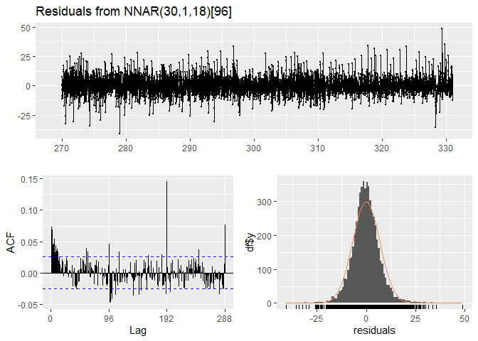

    ## 
    ##  Ljung-Box test
    ## 
    ## data:  Residuals from NNAR(30,1,18)[96]
    ## Q* = 551.41, df = 192, p-value < 2.2e-16
    ## 
    ## Model df: 0.   Total lags used: 192

``` r
tsdisplay(residuals(nnar_temp_dt))
```

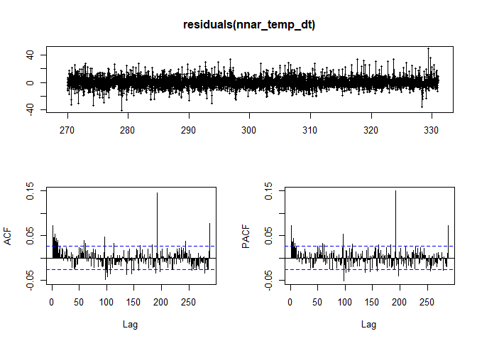

The residuals also look better. Let’s try to fine tune this model.

### 3.3.3 NNAR w/ Temp & Daytime finetuned

``` r
library(forecast)
# Define the tuning grid with parameters that vary
tuning_grid <- expand.grid(
  p = 30,        # Non-seasonal autoregressive lags
  P = 1,                  # Seasonal autoregressive lags
  size = 17         # Hidden layer sizes
)

best_rmse <- Inf
best_model <- NULL
best_params <- list()
total_models <- nrow(tuning_grid)
cat("Total models to train:", total_models, "\n")

for(i in 1:nrow(tuning_grid)) {
  cat("Training model", i, "of", total_models, "\n")
  
  # Extract parameters that vary
  p_val    <- tuning_grid$p[i]
  P_val    <- tuning_grid$P[i]
  size_val <- tuning_grid$size[i]
  
  # Fit NNAR model using the training set 
  model <- nnetar(ts_historical_cut_train[, 2],
                  xreg = ts_historical_cut_train[, c(1, 3, 4, 5, 6)],
                  p = p_val,
                  P = P_val,
                  size = size_val,
                  repeats = 20,                # Fixed parameter
                  lambda = "auto",             # Fixed parameter
                  decay = 0,                   # Fixed parameter
                  maxit = 1000,                # Fixed parameter
                  stepmax = 1e+05,             # Fixed parameter
                  MaxNWts = 1000,              # Added parameter to increase weight limit
                  trace = FALSE)
  
  # Forecast over the validation horizon
  fc <- forecast(model, xreg = ts_historical_cut_val[, c(1, 3, 4, 5, 6)], h = length(ts_historical_cut_val[, 2]))
  rmse_val <- sqrt(mean((fc$mean - ts_historical_cut_val[, 2])^2))
  
  cat("RMSE for current model:", rmse_val, "\n\n")
  
  if(rmse_val < best_rmse) {
    best_rmse <- rmse_val
    best_model <- model
    best_params <- list(p = p_val, P = P_val, size = size_val)
  }
}

cat("Best parameters found on validation set:\n")
print(best_params)
cat("Best RMSE on validation set:", best_rmse, "\n")
```

Retrain the final model on the already combined training and validation
set

``` r
nnar_temp_dt_ft <- nnetar(ts_historical_cut_train_val[, 2],
                      xreg = ts_historical_cut_train_val[, c(1, 3, 4, 5, 6)],
                      p = best_params$p,
                      P = best_params$P,
                      size = best_params$size,
                      repeats = 20,            # Fixed parameter
                      lambda = "auto",         # Fixed parameter
                      decay = 0,               # Fixed parameter
                      maxit = 1000,            # Fixed parameter
                      stepmax = 1e+05,         # Fixed parameter
                      trace = FALSE)
```

Finally, forecast using the final model on the test set

``` r
library(ggplot2)
library(forecast)
nnar_temp_dt_ft_forecast <- forecast(nnar_temp_dt_ft, xreg = ts_historical_cut_test[, c(1, 3, 4, 5, 6)], h = length(ts_historical_cut_test[, 2]))
```


``` r
autoplot(ts_historical_cut_test[,"power"], series = "Test Data") + 
  autolayer(nnar_temp_dt_ft_forecast$mean, series = "Finetuned NNAR w/ Temp & Daytime")
```


Let’s check RMSE

``` r
nnar_temp_dt_ft_rmse <- sqrt(mean((nnar_temp_dt_ft_forecast$mean - ts_historical_cut_test[, 2])^2))
```


``` r
cat("RMSE Finetuned NNAR w/ Temp & Daytime:", nnar_temp_dt_ft_rmse, "\n")
```


Residuals

``` r
summary(nnar_temp_dt_ft)
```

    ##           Length Class        Mode     
    ## x          5952  ts           numeric  
    ## m             1  -none-       numeric  
    ## p             1  -none-       numeric  
    ## P             1  -none-       numeric  
    ## scalex        2  -none-       list     
    ## scalexreg     2  -none-       list     
    ## size          1  -none-       numeric  
    ## xreg      29760  mts          numeric  
    ## lambda        1  -none-       numeric  
    ## subset     5952  -none-       numeric  
    ## model        20  nnetarmodels list     
    ## nnetargs      4  -none-       list     
    ## fitted     5952  ts           numeric  
    ## residuals  5952  ts           numeric  
    ## lags         31  -none-       numeric  
    ## series        1  -none-       character
    ## method        1  -none-       character
    ## call         12  -none-       call

``` r
print(nnar_temp_dt_ft)
```

    ## Series: ts_historical_cut_train_val[, 2] 
    ## Model:  NNAR(30,1,17)[96] 
    ## Call:   nnetar(y = ts_historical_cut_train_val[, 2], p = best_params$p, 
    ##     P = best_params$P, size = best_params$size, repeats = 20, 
    ##     xreg = ts_historical_cut_train_val[, c(1, 3, 4, 5, 6)], lambda = "auto", 
    ##     decay = 0, maxit = 1000, stepmax = 1e+05, trace = FALSE)
    ## 
    ## Average of 20 networks, each of which is
    ## $n
    ## [1] 36 17  1
    ## 
    ## $nunits
    ## [1] 55
    ## 
    ## $nconn
    ##  [1]   0   0   0   0   0   0   0   0   0   0   0   0   0   0   0   0   0   0   0
    ## [20]   0   0   0   0   0   0   0   0   0   0   0   0   0   0   0   0   0   0   0
    ## [39]  37  74 111 148 185 222 259 296 333 370 407 444 481 518 555 592 629 647
    ## 
    ## $conn
    ##   [1]  0  1  2  3  4  5  6  7  8  9 10 11 12 13 14 15 16 17 18 19 20 21 22 23 24
    ##  [26] 25 26 27 28 29 30 31 32 33 34 35 36  0  1  2  3  4  5  6  7  8  9 10 11 12
    ##  [51] 13 14 15 16 17 18 19 20 21 22 23 24 25 26 27 28 29 30 31 32 33 34 35 36  0
    ##  [76]  1  2  3  4  5  6  7  8  9 10 11 12 13 14 15 16 17 18 19 20 21 22 23 24 25
    ## [101] 26 27 28 29 30 31 32 33 34 35 36  0  1  2  3  4  5  6  7  8  9 10 11 12 13
    ## [126] 14 15 16 17 18 19 20 21 22 23 24 25 26 27 28 29 30 31 32 33 34 35 36  0  1
    ## [151]  2  3  4  5  6  7  8  9 10 11 12 13 14 15 16 17 18 19 20 21 22 23 24 25 26
    ## [176] 27 28 29 30 31 32 33 34 35 36  0  1  2  3  4  5  6  7  8  9 10 11 12 13 14
    ## [201] 15 16 17 18 19 20 21 22 23 24 25 26 27 28 29 30 31 32 33 34 35 36  0  1  2
    ## [226]  3  4  5  6  7  8  9 10 11 12 13 14 15 16 17 18 19 20 21 22 23 24 25 26 27
    ## [251] 28 29 30 31 32 33 34 35 36  0  1  2  3  4  5  6  7  8  9 10 11 12 13 14 15
    ## [276] 16 17 18 19 20 21 22 23 24 25 26 27 28 29 30 31 32 33 34 35 36  0  1  2  3
    ## [301]  4  5  6  7  8  9 10 11 12 13 14 15 16 17 18 19 20 21 22 23 24 25 26 27 28
    ## [326] 29 30 31 32 33 34 35 36  0  1  2  3  4  5  6  7  8  9 10 11 12 13 14 15 16
    ## [351] 17 18 19 20 21 22 23 24 25 26 27 28 29 30 31 32 33 34 35 36  0  1  2  3  4
    ## [376]  5  6  7  8  9 10 11 12 13 14 15 16 17 18 19 20 21 22 23 24 25 26 27 28 29
    ## [401] 30 31 32 33 34 35 36  0  1  2  3  4  5  6  7  8  9 10 11 12 13 14 15 16 17
    ## [426] 18 19 20 21 22 23 24 25 26 27 28 29 30 31 32 33 34 35 36  0  1  2  3  4  5
    ## [451]  6  7  8  9 10 11 12 13 14 15 16 17 18 19 20 21 22 23 24 25 26 27 28 29 30
    ## [476] 31 32 33 34 35 36  0  1  2  3  4  5  6  7  8  9 10 11 12 13 14 15 16 17 18
    ## [501] 19 20 21 22 23 24 25 26 27 28 29 30 31 32 33 34 35 36  0  1  2  3  4  5  6
    ## [526]  7  8  9 10 11 12 13 14 15 16 17 18 19 20 21 22 23 24 25 26 27 28 29 30 31
    ## [551] 32 33 34 35 36  0  1  2  3  4  5  6  7  8  9 10 11 12 13 14 15 16 17 18 19
    ## [576] 20 21 22 23 24 25 26 27 28 29 30 31 32 33 34 35 36  0  1  2  3  4  5  6  7
    ## [601]  8  9 10 11 12 13 14 15 16 17 18 19 20 21 22 23 24 25 26 27 28 29 30 31 32
    ## [626] 33 34 35 36  0 37 38 39 40 41 42 43 44 45 46 47 48 49 50 51 52 53
    ## 
    ## $nsunits
    ## [1] 54
    ## 
    ## $decay
    ## [1] 0
    ## 
    ## $entropy
    ## [1] FALSE
    ## 
    ## $softmax
    ## [1] FALSE
    ## 
    ## $censored
    ## [1] FALSE
    ## 
    ## $value
    ## [1] 54.02784
    ## 
    ## $wts
    ##   [1]  3.420696e-02  9.116737e-01 -4.817557e-02  2.913878e-02  5.786128e-02
    ##   [6] -1.468063e-01  1.927911e-01  9.756949e-02  2.092677e-01 -3.698283e-01
    ##  [11] -1.042951e-01  2.844331e-02 -7.479136e-02 -1.150447e-01 -8.657795e-02
    ##  [16] -1.089664e-01 -2.541255e-02  1.050650e-01 -9.158584e-02  8.910968e-02
    ##  [21] -1.070382e-01  2.086479e-01 -7.516398e-02  2.516362e-01 -2.998405e-01
    ##  [26]  1.715488e-01 -2.808846e-01  1.180598e-01  1.510351e-01 -5.733413e-02
    ##  [31] -1.875469e-01  3.640084e-01 -1.401263e-01 -1.373826e+00  1.145585e+00
    ##  [36] -1.126678e+00 -3.135487e-01 -1.643791e+01 -2.212913e+01  9.398011e+01
    ##  [41]  7.848152e+00 -1.122811e+01 -6.980242e+01 -1.324763e+02  1.288156e+02
    ##  [46] -1.898737e+02  5.954868e+01 -1.728783e+02 -7.755267e+01  1.175618e+01
    ##  [51]  6.528953e+01  6.893533e+01  1.115092e+02  2.177588e+02 -5.201981e+01
    ##  [56]  1.902775e+02  3.231803e+01 -1.421068e+02 -2.704852e+02  7.899765e+01
    ##  [61] -1.272833e+02  1.757467e+02  6.219836e+01 -8.802055e+01  3.044950e+01
    ##  [66]  1.012909e+02 -3.251573e+01  5.864428e+01 -3.271825e+02  4.116637e+01
    ##  [71]  1.018167e+02  4.133239e+01 -8.691701e+01 -5.548283e+01 -1.570716e+02
    ##  [76]  1.603720e+02  7.343485e+00  1.966710e+01 -5.533264e+01  1.276673e+02
    ##  [81] -2.465642e+02  5.117265e+01 -1.111345e+02  1.448636e+02  8.830421e+00
    ##  [86] -4.053644e+01  6.147055e+01 -1.538207e+02  2.119188e+02  4.618216e+01
    ##  [91] -5.854160e+01  8.785499e+00 -1.098621e+02  2.498745e+02 -5.251856e+01
    ##  [96] -3.127688e+02  1.652588e+02 -6.842764e+01  5.320889e+01 -7.401892e+01
    ## [101]  9.076617e+01 -6.687180e+01  2.950811e+02 -2.199791e+01 -6.125418e+01
    ## [106] -3.091777e+02  2.088086e+01 -2.745405e+02  7.197375e+01 -6.789368e+00
    ## [111]  2.078954e+02 -4.071893e+01 -1.363744e+01  2.568011e+01 -1.347150e+01
    ## [116]  2.716242e+00 -1.067423e+01  6.265620e+00  8.585107e+00 -5.520470e+00
    ## [121] -1.093149e+00 -9.338206e+00 -5.300311e+00 -6.472166e+00 -1.658757e+01
    ## [126]  3.360538e+01  3.152040e+00 -1.436625e+01  9.236346e+00  5.756758e+00
    ## [131]  1.351477e+01  1.715703e+00 -5.646887e+00 -5.585720e+00  8.369687e+00
    ## [136] -9.055395e+00  2.736480e+01 -4.392497e+01  7.766250e+00  2.198817e+01
    ## [141] -2.027724e+01 -1.312778e+01  1.000470e+01 -5.735214e-01  3.274027e+01
    ## [146]  2.325148e+01  1.034196e+00 -5.696297e+01  1.247401e+02  1.022993e+03
    ## [151] -1.754035e+02 -1.851664e+02  2.490317e+02 -1.235641e+02  4.296027e+02
    ## [156] -3.605146e+02  2.890475e+02 -2.743059e+02  6.350147e+02 -1.959030e+02
    ## [161]  1.095498e+02 -1.453203e+02  4.658606e+00  2.143950e+02 -2.767836e+02
    ## [166] -1.947244e+02  1.799666e+02 -3.125156e+02 -5.394788e+00  7.969791e+02
    ## [171] -3.644898e+02  3.273397e+02 -2.692822e+02 -5.109908e+02  4.216869e+02
    ## [176] -4.719091e+02 -2.855062e+02  1.880421e+02 -6.821358e+01  2.616489e+02
    ## [181] -2.717865e+02  1.322858e+02 -1.690289e+02  1.057302e+01  2.550179e+01
    ## [186] -1.170738e+02 -2.286081e+02  7.986052e+00 -7.937600e+00 -1.203542e+02
    ## [191]  1.332590e+02  5.051897e+01 -1.019825e+02  2.920838e+02 -4.690055e+01
    ## [196] -1.025623e+02 -8.826135e+01 -2.557622e+01  1.957593e+02 -1.520845e+02
    ## [201]  1.548501e+02 -5.873636e+01  2.519250e+02 -6.515850e+01  2.530014e+02
    ## [206]  6.634341e+01  1.358057e+02 -3.124775e+02 -1.431170e+02 -7.587716e+01
    ## [211]  1.765147e+02 -3.075282e+02 -6.954826e+01  6.314564e+01  2.880607e+01
    ## [216] -1.291651e+02 -1.349455e+02  1.000701e+01 -1.635729e+02  1.717730e+01
    ## [221]  1.213906e+02  2.676776e+01  1.956558e+02  4.861374e+02  2.389076e+02
    ## [226] -1.784529e+02 -8.909042e+01  1.689861e+02 -1.024983e+02  8.623457e+01
    ## [231] -1.084841e+02  6.822186e+01 -3.905429e+01 -1.516510e+01  9.212849e+01
    ## [236] -2.872220e+01 -4.137548e+01  1.937542e+01  7.809892e+01 -5.659814e+01
    ## [241]  3.014057e+01  9.068877e+01 -7.693487e+00 -3.916854e+01 -1.826395e+02
    ## [246]  7.410587e+01  5.369957e+01  4.744123e+01 -4.196031e+01 -1.127137e+01
    ## [251]  9.395027e+01 -1.503985e+02  4.879860e+01 -5.347532e+01 -1.110006e+02
    ## [256]  8.394915e+01 -6.959190e+01 -4.462776e+01  3.130734e+01 -2.689746e+02
    ## [261] -3.245686e+01  7.692820e+01  9.417729e+00 -2.368991e+01 -2.828030e+01
    ## [266]  2.970139e+00 -2.122155e+01  2.686324e+00  1.822455e+01  1.676953e+01
    ## [271] -9.832188e+00  1.500948e+01 -4.512520e-01  9.216099e+00 -2.565387e+01
    ## [276]  3.192316e+01  8.652997e+00 -4.007243e+01  3.928907e+01  1.949753e+01
    ## [281] -5.406524e+00  1.400377e+00 -3.214716e+01  1.702689e+01  2.882908e+01
    ## [286] -3.816739e+01 -2.331425e+01  5.523890e+00 -2.480316e+00 -8.436835e+00
    ## [291] -1.993009e+01  2.818631e+00  1.375817e+02 -3.790779e+02  1.244606e+02
    ## [296]  1.178352e+02 -1.039273e+01 -5.269592e-01 -3.877215e+01 -1.703525e+01
    ## [301]  1.962484e+01  1.623324e+01  1.843511e+00  1.164280e+01  1.049451e+01
    ## [306] -2.903741e+01  3.536026e+00 -5.255275e+00 -8.304250e+00  1.128570e+00
    ## [311]  9.188000e-01  3.068356e-01 -8.372397e+00 -1.110614e+01  2.659014e+01
    ## [316]  5.974965e+00 -1.423805e+01 -3.075074e+01  1.409132e+01 -5.581720e-01
    ## [321] -8.120160e-01  1.201274e+01 -9.667263e+00  2.157832e+01  2.811889e+00
    ## [326] -4.230255e+00  1.161867e+01  8.521875e+00 -4.682023e-01  2.149955e+00
    ## [331] -1.378876e+01  9.517354e-01  1.174363e+01  2.992214e+01  3.158500e+01
    ## [336]  2.027197e+02  1.014295e+02 -5.299067e+01  2.104581e+01  6.445537e+01
    ## [341] -4.605471e+01  6.253761e+01 -6.937313e+01 -1.498355e+01  7.842367e+01
    ## [346] -8.959884e+01  7.125570e+01 -7.899983e+00  5.767964e+01 -1.791851e+02
    ## [351]  1.336449e+02  1.645511e+01  7.147670e+00 -1.469705e+02  5.041474e+01
    ## [356]  7.702327e+01  7.969245e+01 -2.142342e+02 -1.220204e+02  9.247475e+01
    ## [361]  3.424244e+01  8.702829e+01  9.171277e+00 -2.960161e+01 -1.805473e+02
    ## [366] -6.043288e+01  1.982006e+02  4.474835e+01 -2.281362e+02 -1.318635e+01
    ## [371]  2.277250e+01 -1.124572e+02  1.678413e+02 -1.431133e+02 -5.449064e+01
    ## [376]  3.807064e+01 -1.726174e+01 -1.769558e+01 -2.028004e+01 -1.570955e+00
    ## [381]  2.462936e+01 -1.279893e+02  1.416255e+01  2.886121e+01  5.492262e+01
    ## [386] -5.600134e+01  8.375730e+00 -4.593793e+01  5.376925e+01 -8.674464e+01
    ## [391]  5.560258e+01  1.555701e+02 -6.806192e+01  4.992021e+01 -1.387329e+01
    ## [396] -1.491928e+02 -2.233855e+01  9.406016e+01  2.784903e+01  3.666824e+01
    ## [401] -6.464338e+01  8.413120e+01 -2.261135e+00  3.317259e+01  2.497431e+01
    ## [406] -1.324333e+02  7.408088e+01 -4.562369e-01 -4.786412e-01  7.933974e-01
    ## [411] -4.364869e-02 -4.815668e-03 -3.051427e-01 -6.346785e-02 -1.034030e-01
    ## [416] -1.161616e-01  4.424971e-01  8.950317e-02 -2.593444e-01 -7.283107e-02
    ## [421]  2.485221e-01  3.583660e-02  7.555105e-02  1.912350e-01 -7.354644e-02
    ## [426]  2.801425e-01 -4.746745e-02 -1.902981e-02 -5.740778e-01  1.160704e-01
    ## [431] -2.638548e-01  2.774241e-01 -1.435375e-01  7.712790e-02 -1.372204e-01
    ## [436] -1.135759e-01  3.249411e-02  4.745052e-01 -6.648251e-02  2.606315e-02
    ## [441] -3.268510e-01 -4.226582e-01  1.341259e+00 -8.917821e-01 -5.451456e+01
    ## [446] -2.065085e+02  1.072210e+02 -1.288151e+02 -7.471484e+00  6.777015e+01
    ## [451]  7.454780e+01 -2.069288e+02 -7.856745e+01  3.280162e+02  3.576823e+01
    ## [456]  2.335051e+02 -1.057924e+02  1.707268e+01  3.862227e+01  6.989498e+01
    ## [461] -8.914663e+01  8.314145e+01 -2.664869e+02  1.738330e+02 -9.924142e+01
    ## [466] -9.905743e+01 -1.480974e+02  1.581570e+02  8.382060e+01  4.501985e+01
    ## [471] -1.278247e+01 -2.600169e+01 -1.638788e+02  7.573473e+01  2.455288e+02
    ## [476] -9.026746e+01 -1.449142e+01 -1.972446e+02  5.060234e+01  1.671193e+02
    ## [481] -2.067195e+01 -7.837030e-02 -4.777365e-02  1.365917e-01 -9.634689e-02
    ## [486]  1.031389e-01  9.370267e-02 -1.059312e-01  1.444123e-02 -9.769128e-02
    ## [491]  2.333749e-01  3.049411e-02  3.653574e-02  8.430821e-02 -3.858409e-02
    ## [496]  1.264444e-01  5.334807e-02 -6.953463e-02 -4.621054e-02 -8.879202e-02
    ## [501]  8.599808e-02  9.352048e-02 -1.314813e-01  2.658137e-04 -9.556958e-02
    ## [506]  1.550499e-01  2.341303e-02  5.800784e-02 -5.099059e-02 -2.348808e-02
    ## [511]  3.439643e-02 -2.038567e-02 -1.898942e-01  1.149756e-01  5.759310e-01
    ## [516]  1.248013e-01 -8.799275e-01  1.186510e+00  8.006054e+00 -1.862753e+02
    ## [521]  8.101760e+01  5.680975e+01  4.048668e+01  1.129615e+02  1.780597e+01
    ## [526]  5.734879e+01 -1.267367e+02  4.415386e+01  1.014811e+01  1.083353e+01
    ## [531] -1.016938e+02  1.075957e+02  1.422962e+01  2.680766e+01 -2.506738e+01
    ## [536] -2.023063e+01 -6.978074e+00 -8.155731e+00 -1.770189e+01  3.162580e+01
    ## [541] -2.807564e+01 -2.631580e+01  7.643936e+01 -1.318554e+01  3.379259e+00
    ## [546]  2.780668e+01  5.113415e+01 -9.379248e+01  6.179388e+01 -7.124201e+01
    ## [551]  3.465886e+01 -4.608255e+01 -1.992133e+01  2.911872e+01  3.749173e+01
    ## [556]  1.689138e+02 -1.439267e+01 -6.466029e+01  1.993354e+01  1.142708e+02
    ## [561] -1.155381e+02 -7.582793e+01  1.453024e+02 -3.540369e+01  1.172065e+02
    ## [566] -2.575160e+02 -1.123065e+01  8.993575e+01 -3.161459e+02 -3.324486e+01
    ## [571]  1.672853e+02 -1.887580e+02  1.303192e+02  5.333251e+01 -7.436164e+01
    ## [576] -1.089398e+02  1.502819e+02 -1.729020e+02  3.025351e+02 -3.582684e+02
    ## [581] -1.703460e+02  2.142153e+02  3.151247e+02  1.384569e+02 -4.739138e+00
    ## [586] -3.186659e+02  1.529202e+02 -3.325106e+02  1.141037e+02 -2.790490e+02
    ## [591]  1.188697e+02  4.521909e+01  2.378153e+02  4.501211e-01 -3.429915e-01
    ## [596]  1.755178e-01 -1.444455e-01 -4.963111e-02  1.876455e-01  1.868497e-02
    ## [601]  2.240309e-01 -4.915995e-01 -9.585665e-02  3.033619e-03 -7.068682e-02
    ## [606] -4.556335e-02 -1.751174e-01 -9.274147e-02 -2.894253e-03  1.434271e-01
    ## [611]  1.764801e-02 -1.059872e-01 -1.153788e-01  4.518739e-01 -6.364644e-02
    ## [616]  2.455864e-01 -3.377078e-01  1.997755e-02 -1.849898e-01  1.690247e-01
    ## [621]  7.621004e-02 -3.887966e-02 -1.616410e-01  3.236699e-01 -1.578594e-01
    ## [626] -1.027696e+02 -1.030042e+02  3.111955e+02 -1.053515e+02 -1.012478e+01
    ## [631]  3.693760e+00 -1.046876e+00  2.032416e-01 -1.173194e-01 -7.777823e-01
    ## [636] -8.714882e-02  1.717228e-01 -1.288646e-01 -1.252009e-01 -2.318896e-01
    ## [641] -1.240048e-01  3.591595e+00 -8.364997e-02  9.617212e+00  1.166251e-01
    ## [646] -6.757982e-02  6.485748e+00
    ## 
    ## $convergence
    ## [1] 1
    ## 
    ## $fitted.values
    ##                 [,1]
    ##    [1,] -0.654708307
    ##    [2,] -0.625428683
    ##    [3,] -0.833124379
    ##    [4,] -0.740240604
    ##    [5,] -0.862127973
    ##    [6,] -0.908595440
    ##    [7,] -1.238573182
    ##    [8,] -1.253429641
    ##    [9,] -1.168006841
    ##   [10,] -1.057310576
    ##   [11,] -0.958055264
    ##   [12,] -1.071345243
    ##   [13,] -1.169750423
    ##   [14,] -1.186740952
    ##   [15,] -1.121407749
    ##   [16,] -1.205847933
    ##   [17,] -0.949705368
    ##   [18,] -0.986320829
    ##   [19,] -1.080606523
    ##   [20,] -1.131309778
    ##   [21,] -1.029870822
    ##   [22,] -1.151731717
    ##   [23,] -1.138350928
    ##   [24,] -1.022935244
    ##   [25,] -0.822928003
    ##   [26,] -0.567704812
    ##   [27,] -0.456315164
    ##   [28,] -0.389052330
    ##   [29,] -0.357416987
    ##   [30,] -0.544368067
    ##   [31,] -0.538915139
    ##   [32,] -0.543469765
    ##   [33,] -0.627782858
    ##   [34,]  0.738432312
    ##   [35,]  0.695765613
    ##   [36,]  0.675438920
    ##   [37,]  0.685410426
    ##   [38,]  0.645003307
    ##   [39,]  0.753164861
    ##   [40,]  0.803462983
    ##   [41,]  0.866299649
    ##   [42,]  0.941713176
    ##   [43,]  1.047375255
    ##   [44,]  0.989529694
    ##   [45,]  1.084292878
    ##   [46,]  1.211081334
    ##   [47,]  1.242024127
    ##   [48,]  1.211687570
    ##   [49,]  1.250897552
    ##   [50,]  1.483719154
    ##   [51,]  1.533007956
    ##   [52,]  1.335229424
    ##   [53,]  1.444728582
    ##   [54,]  1.533952717
    ##   [55,]  1.559423865
    ##   [56,]  1.513642133
    ##   [57,]  1.500954936
    ##   [58,]  1.335109963
    ##   [59,]  1.161365499
    ##   [60,]  1.019513406
    ##   [61,]  0.961296788
    ##   [62,]  0.875384180
    ##   [63,]  0.999562629
    ##   [64,]  1.227196393
    ##   [65,]  1.151706681
    ##   [66,]  1.364056255
    ##   [67,]  1.182757560
    ##   [68,]  1.120490407
    ##   [69,]  1.057844645
    ##   [70,]  1.132573770
    ##   [71,]  1.063643058
    ##   [72,]  0.949114985
    ##   [73,]  1.018217240
    ##   [74,]  1.250044072
    ##   [75,]  1.458339838
    ##   [76,]  1.217002228
    ##   [77,]  1.616324055
    ##   [78,]  1.727331020
    ##   [79,]  1.892727560
    ##   [80,]  1.657721602
    ##   [81,]  1.816650315
    ##   [82,]  1.697327246
    ##   [83,]  1.623561745
    ##   [84,]  1.566297539
    ##   [85,]  1.517018458
    ##   [86,]  1.555795197
    ##   [87,]  1.399714005
    ##   [88,]  1.483793245
    ##   [89,]  1.550244916
    ##   [90,]  1.391161829
    ##   [91,]  1.222223937
    ##   [92,]  1.265846706
    ##   [93,]  1.213601104
    ##   [94,] -0.130858588
    ##   [95,] -0.076131933
    ##   [96,] -0.534556967
    ##   [97,] -0.513446110
    ##   [98,] -0.765439952
    ##   [99,] -0.752545499
    ##  [100,] -0.919459752
    ##  [101,] -0.836080625
    ##  [102,] -0.805670607
    ##  [103,] -0.996828372
    ##  [104,] -0.874351256
    ##  [105,] -0.882527266
    ##  [106,] -0.884946303
    ##  [107,] -0.848643527
    ##  [108,] -0.821602769
    ##  [109,] -0.839701222
    ##  [110,] -0.886705314
    ##  [111,] -0.960417953
    ##  [112,] -1.037178235
    ##  [113,] -0.855914426
    ##  [114,] -0.752413543
    ##  [115,] -0.933698157
    ##  [116,] -1.003254249
    ##  [117,] -1.114306879
    ##  [118,] -1.158345017
    ##  [119,] -0.991442256
    ##  [120,] -0.985067294
    ##  [121,] -0.774097949
    ##  [122,] -0.269893076
    ##  [123,] -0.026727396
    ##  [124,] -0.061808288
    ##  [125,] -0.099391974
    ##  [126,] -0.201043494
    ##  [127,] -0.307120171
    ##  [128,] -0.300979557
    ##  [129,] -0.410144816
    ##  [130,]  0.962877894
    ##  [131,]  0.786593038
    ##  [132,]  0.817973244
    ##  [133,]  0.690436732
    ##  [134,]  0.886302205
    ##  [135,]  0.856525256
    ##  [136,]  0.911334931
    ##  [137,]  1.078852543
    ##  [138,]  1.049873932
    ##  [139,]  1.144857211
    ##  [140,]  1.198421050
    ##  [141,]  1.173527763
    ##  [142,]  1.279933319
    ##  [143,]  1.270879819
    ##  [144,]  1.411502103
    ##  [145,]  1.395339568
    ##  [146,]  1.527571058
    ##  [147,]  1.506173267
    ##  [148,]  1.397371998
    ##  [149,]  1.410779750
    ##  [150,]  1.545662250
    ##  [151,]  1.631844186
    ##  [152,]  1.477514010
    ##  [153,]  1.567751048
    ##  [154,]  1.439392424
    ##  [155,]  1.246200802
    ##  [156,]  1.266451266
    ##  [157,]  1.265058743
    ##  [158,]  1.532812850
    ##  [159,]  1.633649461
    ##  [160,]  1.458298457
    ##  [161,]  1.342925060
    ##  [162,]  1.385641277
    ##  [163,]  1.317862933
    ##  [164,]  1.344674988
    ##  [165,]  1.293405224
    ##  [166,]  1.305570544
    ##  [167,]  1.292554036
    ##  [168,]  1.301818852
    ##  [169,]  1.262318380
    ##  [170,]  1.238475809
    ##  [171,]  1.435228354
    ##  [172,]  1.163868190
    ##  [173,]  1.456927529
    ##  [174,]  1.597359727
    ##  [175,]  1.719956997
    ##  [176,]  1.545430037
    ##  [177,]  1.603446679
    ##  [178,]  1.591626284
    ##  [179,]  1.514283915
    ##  [180,]  1.413011120
    ##  [181,]  1.408290861
    ##  [182,]  1.313409044
    ##  [183,]  1.398781106
    ##  [184,]  1.222142120
    ##  [185,]  1.129452619
    ##  [186,]  1.106454677
    ##  [187,]  1.109446619
    ##  [188,]  0.992830896
    ##  [189,]  0.998297003
    ##  [190,] -0.087057997
    ##  [191,]  0.003737329
    ##  [192,] -0.524461562
    ##  [193,] -0.370620450
    ##  [194,] -0.434895317
    ##  [195,] -0.263145087
    ##  [196,] -0.252447073
    ##  [197,] -0.378246294
    ##  [198,] -0.408988265
    ##  [199,] -0.437813854
    ##  [200,] -0.471359187
    ##  [201,] -0.397007985
    ##  [202,] -0.378570755
    ##  [203,] -0.398930761
    ##  [204,] -0.225121645
    ##  [205,] -0.413677609
    ##  [206,] -0.230490154
    ##  [207,] -0.404275090
    ##  [208,] -0.496677147
    ##  [209,] -0.473929414
    ##  [210,] -0.361892902
    ##  [211,] -0.379045693
    ##  [212,] -0.462324156
    ##  [213,] -0.367203684
    ##  [214,] -0.349090528
    ##  [215,] -0.394303679
    ##  [216,] -0.421624656
    ##  [217,] -0.207122623
    ##  [218,] -0.139637931
    ##  [219,]  0.070077418
    ##  [220,]  0.040255136
    ##  [221,] -0.139376819
    ##  [222,] -0.155829254
    ##  [223,] -0.189755053
    ##  [224,] -0.349616924
    ##  [225,] -0.139914087
    ##  [226,]  1.045359758
    ##  [227,]  0.940468166
    ##  [228,]  0.903817407
    ##  [229,]  0.830270863
    ##  [230,]  0.916432648
    ##  [231,]  0.872106318
    ##  [232,]  0.886916738
    ##  [233,]  0.953769883
    ##  [234,]  0.902603290
    ##  [235,]  1.010914652
    ##  [236,]  0.964329198
    ##  [237,]  0.882207137
    ##  [238,]  1.079299298
    ##  [239,]  1.123540313
    ##  [240,]  1.090329485
    ##  [241,]  1.229265215
    ##  [242,]  1.337968044
    ##  [243,]  1.247103506
    ##  [244,]  1.102667439
    ##  [245,]  1.185249910
    ##  [246,]  1.267265388
    ##  [247,]  1.225675719
    ##  [248,]  1.294052084
    ##  [249,]  1.398431914
    ##  [250,]  1.416810343
    ##  [251,]  1.184352862
    ##  [252,]  1.156744309
    ##  [253,]  1.114286889
    ##  [254,]  1.330155563
    ##  [255,]  1.293654390
    ##  [256,]  1.278307409
    ##  [257,]  1.194832661
    ##  [258,]  1.175560007
    ##  [259,]  1.194942069
    ##  [260,]  1.119624394
    ##  [261,]  1.213823022
    ##  [262,]  1.135285726
    ##  [263,]  1.132661345
    ##  [264,]  1.020610620
    ##  [265,]  1.153696177
    ##  [266,]  0.974410986
    ##  [267,]  1.251489468
    ##  [268,]  0.823562019
    ##  [269,]  1.262142758
    ##  [270,]  1.365084485
    ##  [271,]  1.440802041
    ##  [272,]  1.397996309
    ##  [273,]  1.370787884
    ##  [274,]  1.274550302
    ##  [275,]  1.183321425
    ##  [276,]  1.176691870
    ##  [277,]  1.191972071
    ##  [278,]  1.154925224
    ##  [279,]  1.104357848
    ##  [280,]  1.323384818
    ##  [281,]  1.067065590
    ##  [282,]  1.127631869
    ##  [283,]  1.076179426
    ##  [284,]  1.048507500
    ##  [285,]  1.099237785
    ##  [286,] -0.094878083
    ##  [287,] -0.243394398
    ##  [288,] -0.568494205
    ##  [289,] -0.396458061
    ##  [290,] -0.440399780
    ##  [291,] -0.537515358
    ##  [292,] -0.466811233
    ##  [293,] -0.444440177
    ##  [294,] -0.348820551
    ##  [295,] -0.324903750
    ##  [296,] -0.454652103
    ##  [297,] -0.389724406
    ##  [298,] -0.334265824
    ##  [299,] -0.246919675
    ##  [300,] -0.272048733
    ##  [301,] -0.329151107
    ##  [302,] -0.344676013
    ##  [303,] -0.322005063
    ##  [304,] -0.436976203
    ##  [305,] -0.307690834
    ##  [306,] -0.293166330
    ##  [307,] -0.317841573
    ##  [308,] -0.355350949
    ##  [309,] -0.298796846
    ##  [310,] -0.337750381
    ##  [311,] -0.254837682
    ##  [312,] -0.310220046
    ##  [313,] -0.263565551
    ##  [314,] -0.042371272
    ##  [315,] -0.162550849
    ##  [316,] -0.168187226
    ##  [317,]  0.133590099
    ##  [318,] -0.060004309
    ##  [319,] -0.298909475
    ##  [320,] -0.125602090
    ##  [321,] -0.112406603
    ##  [322,]  0.940595302
    ##  [323,]  0.884282727
    ##  [324,]  0.828405814
    ##  [325,]  0.869612402
    ##  [326,]  0.833875207
    ##  [327,]  0.881559310
    ##  [328,]  0.804318917
    ##  [329,]  0.878865214
    ##  [330,]  0.841973461
    ##  [331,]  0.816581592
    ##  [332,]  0.836128791
    ##  [333,]  0.840822552
    ##  [334,]  1.030335488
    ##  [335,]  1.028929934
    ##  [336,]  0.871077640
    ##  [337,]  0.907541374
    ##  [338,]  0.964810635
    ##  [339,]  0.967920192
    ##  [340,]  0.892297315
    ##  [341,]  0.913213470
    ##  [342,]  0.944657932
    ##  [343,]  0.898486754
    ##  [344,]  0.961805301
    ##  [345,]  0.995976229
    ##  [346,]  0.868689180
    ##  [347,]  0.926061849
    ##  [348,]  0.957391393
    ##  [349,]  0.993470259
    ##  [350,]  1.124562584
    ##  [351,]  1.122545526
    ##  [352,]  1.032867367
    ##  [353,]  1.041780108
    ##  [354,]  1.110862837
    ##  [355,]  0.999165696
    ##  [356,]  0.870728938
    ##  [357,]  0.897770860
    ##  [358,]  0.850348575
    ##  [359,]  0.907088726
    ##  [360,]  0.958557679
    ##  [361,]  1.004629442
    ##  [362,]  0.901735873
    ##  [363,]  0.822433456
    ##  [364,]  0.776910311
    ##  [365,]  1.176726496
    ##  [366,]  1.307007660
    ##  [367,]  1.300249373
    ##  [368,]  1.280039391
    ##  [369,]  1.243095298
    ##  [370,]  1.241101946
    ##  [371,]  1.201231191
    ##  [372,]  1.203443569
    ##  [373,]  1.154468023
    ##  [374,]  1.230367626
    ##  [375,]  1.104266590
    ##  [376,]  1.105602806
    ##  [377,]  0.984138332
    ##  [378,]  0.912754664
    ##  [379,]  0.906682896
    ##  [380,]  0.826241648
    ##  [381,]  0.828554771
    ##  [382,] -0.211590860
    ##  [383,] -0.238340108
    ##  [384,] -0.595024861
    ##  [385,] -0.486303103
    ##  [386,] -0.595927242
    ##  [387,] -0.519331087
    ##  [388,] -0.475510965
    ##  [389,] -0.424610287
    ##  [390,] -0.396198039
    ##  [391,] -0.519257829
    ##  [392,] -0.683565061
    ##  [393,] -0.598243372
    ##  [394,] -0.501127754
    ##  [395,] -0.527674773
    ##  [396,] -0.475936469
    ##  [397,] -0.504033701
    ##  [398,] -0.429566289
    ##  [399,] -0.472523612
    ##  [400,] -0.552425146
    ##  [401,] -0.582925052
    ##  [402,] -0.256875762
    ##  [403,] -0.252153365
    ##  [404,] -0.453992804
    ##  [405,] -0.383266805
    ##  [406,] -0.345319104
    ##  [407,] -0.388449895
    ##  [408,] -0.278189886
    ##  [409,] -0.346993905
    ##  [410,] -0.378861253
    ##  [411,] -0.371595876
    ##  [412,] -0.595856792
    ##  [413,] -0.350925840
    ##  [414,] -0.178233623
    ##  [415,] -0.489443267
    ##  [416,] -0.658432625
    ##  [417,] -0.750933226
    ##  [418,]  0.452997949
    ##  [419,]  0.631007627
    ##  [420,]  0.602369239
    ##  [421,]  0.667144498
    ##  [422,]  0.675028879
    ##  [423,]  0.812470951
    ##  [424,]  0.645932815
    ##  [425,]  0.740749161
    ##  [426,]  0.651618094
    ##  [427,]  0.638387702
    ##  [428,]  0.746623990
    ##  [429,]  0.653832661
    ##  [430,]  0.924881700
    ##  [431,]  0.879444071
    ##  [432,]  0.733116483
    ##  [433,]  0.890559678
    ##  [434,]  0.960557540
    ##  [435,]  0.901601905
    ##  [436,]  1.016785717
    ##  [437,]  0.897110586
    ##  [438,]  1.035756584
    ##  [439,]  1.045058999
    ##  [440,]  1.014995216
    ##  [441,]  1.218010067
    ##  [442,]  1.125076045
    ##  [443,]  1.117036080
    ##  [444,]  1.110555883
    ##  [445,]  1.054281783
    ##  [446,]  1.053074967
    ##  [447,]  1.197002784
    ##  [448,]  1.169853205
    ##  [449,]  1.108945450
    ##  [450,]  1.156449573
    ##  [451,]  0.915167673
    ##  [452,]  0.941026013
    ##  [453,]  1.078541420
    ##  [454,]  0.949100417
    ##  [455,]  1.026553372
    ##  [456,]  1.029842106
    ##  [457,]  0.930910295
    ##  [458,]  1.054347501
    ##  [459,]  0.979111887
    ##  [460,]  0.861311163
    ##  [461,]  1.050369916
    ##  [462,]  1.288494895
    ##  [463,]  1.256148121
    ##  [464,]  1.242982975
    ##  [465,]  1.212054492
    ##  [466,]  1.225332134
    ##  [467,]  1.188289686
    ##  [468,]  1.265720169
    ##  [469,]  1.168935075
    ##  [470,]  1.156719476
    ##  [471,]  1.114298055
    ##  [472,]  1.103400707
    ##  [473,]  1.004610602
    ##  [474,]  0.923758455
    ##  [475,]  0.912237375
    ##  [476,]  0.925336901
    ##  [477,]  0.849800763
    ##  [478,] -0.224607917
    ##  [479,] -0.353199711
    ##  [480,] -0.839652195
    ##  [481,] -1.077032856
    ##  [482,] -1.109442717
    ##  [483,] -1.186845703
    ##  [484,] -1.162928435
    ##  [485,] -1.015505961
    ##  [486,] -0.942342671
    ##  [487,] -1.073853027
    ##  [488,] -1.142043300
    ##  [489,] -1.096947950
    ##  [490,] -1.072977270
    ##  [491,] -1.061231268
    ##  [492,] -0.892206870
    ##  [493,] -1.059492809
    ##  [494,] -0.910061083
    ##  [495,] -1.053657423
    ##  [496,] -1.086234524
    ##  [497,] -1.010764949
    ##  [498,] -0.910738985
    ##  [499,] -1.009599160
    ##  [500,] -1.131160906
    ##  [501,] -1.109473466
    ##  [502,] -1.145386121
    ##  [503,] -1.077660237
    ##  [504,] -0.985054874
    ##  [505,] -0.760657385
    ##  [506,] -0.653932033
    ##  [507,] -0.710618672
    ##  [508,] -0.602923607
    ##  [509,] -0.944445618
    ##  [510,] -0.698711234
    ##  [511,] -0.668210136
    ##  [512,] -1.050891367
    ##  [513,] -0.860737304
    ##  [514,]  0.529268274
    ##  [515,]  0.534065552
    ##  [516,]  0.521171877
    ##  [517,]  0.518873744
    ##  [518,]  0.513357866
    ##  [519,]  0.545841876
    ##  [520,]  0.498460361
    ##  [521,]  0.526428086
    ##  [522,]  0.570363932
    ##  [523,]  0.570810576
    ##  [524,]  0.672547691
    ##  [525,]  0.697480966
    ##  [526,]  0.757288460
    ##  [527,]  0.750876771
    ##  [528,]  0.751045391
    ##  [529,]  0.753736398
    ##  [530,]  0.795340738
    ##  [531,]  0.807758929
    ##  [532,]  0.790982183
    ##  [533,]  0.806074349
    ##  [534,]  0.806011036
    ##  [535,]  0.897177856
    ##  [536,]  0.843261741
    ##  [537,]  0.867440376
    ##  [538,]  0.790884437
    ##  [539,]  0.842351339
    ##  [540,]  0.754888073
    ##  [541,]  0.721872043
    ##  [542,]  0.780881053
    ##  [543,]  0.845477247
    ##  [544,]  0.829714220
    ##  [545,]  0.830010433
    ##  [546,]  0.881146241
    ##  [547,]  0.848928382
    ##  [548,]  0.871196884
    ##  [549,]  0.784903631
    ##  [550,]  0.839232846
    ##  [551,]  0.837962416
    ##  [552,]  0.778697016
    ##  [553,]  0.929661897
    ##  [554,]  0.782062214
    ##  [555,]  0.723283284
    ##  [556,]  0.975675905
    ##  [557,]  1.136357548
    ##  [558,]  1.047486185
    ##  [559,]  1.194921298
    ##  [560,]  1.203137106
    ##  [561,]  1.252661042
    ##  [562,]  1.139104734
    ##  [563,]  1.087207237
    ##  [564,]  1.061679274
    ##  [565,]  1.067446059
    ##  [566,]  1.131319141
    ##  [567,]  1.126497300
    ##  [568,]  1.009108508
    ##  [569,]  0.893412642
    ##  [570,]  0.913622864
    ##  [571,]  0.768186541
    ##  [572,]  0.706631453
    ##  [573,]  0.667321515
    ##  [574,] -0.923572788
    ##  [575,] -1.074882388
    ##  [576,] -1.239023382
    ##  [577,] -1.351992768
    ##  [578,] -1.272865555
    ##  [579,] -1.373340636
    ##  [580,] -1.319749538
    ##  [581,] -1.214112623
    ##  [582,] -1.282736565
    ##  [583,] -1.370544019
    ##  [584,] -1.405656525
    ##  [585,] -1.312209049
    ##  [586,] -1.173988670
    ##  [587,] -1.151880493
    ##  [588,] -1.057724326
    ##  [589,] -1.193242577
    ##  [590,] -1.097539476
    ##  [591,] -1.129850844
    ##  [592,] -1.346879675
    ##  [593,] -1.227970579
    ##  [594,] -1.233786191
    ##  [595,] -1.353057738
    ##  [596,] -1.456818140
    ##  [597,] -1.410510092
    ##  [598,] -1.345905463
    ##  [599,] -1.247548487
    ##  [600,] -1.242616776
    ##  [601,] -1.202521361
    ##  [602,] -0.936028763
    ##  [603,] -0.899360911
    ##  [604,] -0.954257875
    ##  [605,] -0.988880617
    ##  [606,] -0.896251885
    ##  [607,] -0.938334764
    ##  [608,] -1.169265871
    ##  [609,] -0.769465399
    ##  [610,]  0.511037312
    ##  [611,]  0.501452364
    ##  [612,]  0.461470855
    ##  [613,]  0.403282347
    ##  [614,]  0.456727117
    ##  [615,]  0.566406938
    ##  [616,]  0.470199484
    ##  [617,]  0.478619249
    ##  [618,]  0.522510389
    ##  [619,]  0.510939753
    ##  [620,]  0.557312361
    ##  [621,]  0.439258762
    ##  [622,]  0.549189942
    ##  [623,]  0.675675336
    ##  [624,]  0.598621834
    ##  [625,]  0.708026994
    ##  [626,]  0.582801102
    ##  [627,]  0.628464702
    ##  [628,]  0.543273296
    ##  [629,]  0.575778045
    ##  [630,]  0.480830477
    ##  [631,]  0.591680058
    ##  [632,]  0.470957225
    ##  [633,]  0.542241855
    ##  [634,]  0.621389912
    ##  [635,]  0.583685498
    ##  [636,]  0.584794136
    ##  [637,]  0.527383008
    ##  [638,]  0.557674998
    ##  [639,]  0.748259672
    ##  [640,]  0.808075750
    ##  [641,]  0.790739713
    ##  [642,]  0.650500782
    ##  [643,]  0.542926971
    ##  [644,]  0.633868822
    ##  [645,]  0.646036910
    ##  [646,]  0.681068134
    ##  [647,]  0.601961579
    ##  [648,]  0.697145756
    ##  [649,]  0.534071591
    ##  [650,]  0.656277833
    ##  [651,]  0.467830104
    ##  [652,]  0.789109140
    ##  [653,]  1.004363572
    ##  [654,]  0.989605688
    ##  [655,]  1.093048710
    ##  [656,]  1.102234580
    ##  [657,]  1.081683152
    ##  [658,]  1.077708465
    ##  [659,]  0.978238506
    ##  [660,]  1.018213729
    ##  [661,]  0.942390189
    ##  [662,]  1.006807169
    ##  [663,]  0.910232983
    ##  [664,]  1.099406678
    ##  [665,]  0.950079540
    ##  [666,]  0.895778280
    ##  [667,]  0.791951925
    ##  [668,]  0.795883154
    ##  [669,]  0.699186305
    ##  [670,] -0.563231714
    ##  [671,] -0.397384724
    ##  [672,] -1.176547154
    ##  [673,] -1.146966760
    ##  [674,] -1.457097907
    ##  [675,] -1.465230547
    ##  [676,] -1.608582345
    ##  [677,] -1.560384215
    ##  [678,] -1.248601005
    ##  [679,] -1.545027978
    ##  [680,] -1.422234192
    ##  [681,] -1.436595830
    ##  [682,] -1.265594904
    ##  [683,] -1.363614672
    ##  [684,] -1.317527898
    ##  [685,] -1.384991194
    ##  [686,] -1.311554234
    ##  [687,] -1.431678985
    ##  [688,] -1.440406100
    ##  [689,] -1.296207267
    ##  [690,] -1.193116007
    ##  [691,] -1.327162284
    ##  [692,] -1.436759165
    ##  [693,] -1.260259132
    ##  [694,] -1.423531356
    ##  [695,] -1.447609343
    ##  [696,] -1.412111373
    ##  [697,] -1.406333710
    ##  [698,] -1.176412910
    ##  [699,] -1.063222677
    ##  [700,] -1.031371763
    ##  [701,] -1.142901613
    ##  [702,] -0.716409318
    ##  [703,] -0.948481751
    ##  [704,] -1.179835886
    ##  [705,] -1.049399842
    ##  [706,]  0.294815097
    ##  [707,]  0.402610416
    ##  [708,]  0.396502074
    ##  [709,]  0.383795894
    ##  [710,]  0.370682367
    ##  [711,]  0.329251126
    ##  [712,]  0.401894642
    ##  [713,]  0.384960444
    ##  [714,]  0.449280878
    ##  [715,]  0.430602553
    ##  [716,]  0.491689873
    ##  [717,]  0.441888158
    ##  [718,]  0.650531334
    ##  [719,]  0.628476740
    ##  [720,]  0.574349549
    ##  [721,]  0.597935212
    ##  [722,]  0.660969888
    ##  [723,]  0.709025234
    ##  [724,]  0.679843761
    ##  [725,]  0.678276017
    ##  [726,]  0.672143368
    ##  [727,]  0.604593042
    ##  [728,]  0.708979903
    ##  [729,]  0.748201606
    ##  [730,]  0.739996404
    ##  [731,]  0.758397251
    ##  [732,]  0.739414583
    ##  [733,]  0.705944631
    ##  [734,]  0.677866563
    ##  [735,]  0.727036628
    ##  [736,]  0.622603935
    ##  [737,]  0.601141725
    ##  [738,]  0.638344510
    ##  [739,]  0.677119494
    ##  [740,]  0.632997290
    ##  [741,]  0.760990400
    ##  [742,]  0.874644809
    ##  [743,]  0.781200868
    ##  [744,]  0.748945059
    ##  [745,]  0.825079114
    ##  [746,]  0.723586177
    ##  [747,]  0.697300369
    ##  [748,]  0.760366994
    ##  [749,]  1.174716338
    ##  [750,]  1.149437356
    ##  [751,]  1.231766725
    ##  [752,]  1.175655481
    ##  [753,]  1.213013953
    ##  [754,]  1.210477654
    ##  [755,]  1.218249261
    ##  [756,]  1.128322193
    ##  [757,]  1.211812934
    ##  [758,]  1.175117986
    ##  [759,]  1.090922147
    ##  [760,]  1.066980905
    ##  [761,]  1.042419502
    ##  [762,]  1.021589139
    ##  [763,]  1.020908776
    ##  [764,]  1.009020545
    ##  [765,]  1.051043727
    ##  [766,] -0.070046811
    ##  [767,]  0.125563697
    ##  [768,] -0.562939890
    ##  [769,] -0.559510594
    ##  [770,] -0.536285439
    ##  [771,] -0.674179249
    ##  [772,] -0.705875513
    ##  [773,] -0.704699610
    ##  [774,] -0.641374441
    ##  [775,] -0.794989236
    ##  [776,] -0.768920737
    ##  [777,] -0.899389559
    ##  [778,] -0.729391250
    ##  [779,] -0.767514158
    ##  [780,] -0.585896356
    ##  [781,] -0.711305811
    ##  [782,] -0.690282233
    ##  [783,] -0.800549389
    ##  [784,] -0.842815948
    ##  [785,] -0.747807310
    ##  [786,] -0.748506456
    ##  [787,] -0.863636381
    ##  [788,] -0.736914478
    ##  [789,] -0.841918923
    ##  [790,] -0.784576719
    ##  [791,] -0.927880697
    ##  [792,] -0.901041994
    ##  [793,] -0.836318164
    ##  [794,] -0.733022822
    ##  [795,] -0.723114173
    ##  [796,] -0.566868757
    ##  [797,] -0.706251095
    ##  [798,] -0.567110605
    ##  [799,] -0.520528615
    ##  [800,] -0.617547967
    ##  [801,] -0.631531573
    ##  [802,]  0.665157439
    ##  [803,]  0.554402100
    ##  [804,]  0.502753565
    ##  [805,]  0.452552936
    ##  [806,]  0.489439084
    ##  [807,]  0.483647219
    ##  [808,]  0.467929189
    ##  [809,]  0.608309931
    ##  [810,]  0.584127987
    ##  [811,]  0.516183481
    ##  [812,]  0.539943525
    ##  [813,]  0.518973019
    ##  [814,]  0.714743994
    ##  [815,]  0.794999795
    ##  [816,]  0.743718725
    ##  [817,]  0.702828211
    ##  [818,]  0.694821985
    ##  [819,]  0.695131997
    ##  [820,]  0.676912759
    ##  [821,]  0.684089376
    ##  [822,]  0.743810187
    ##  [823,]  0.737601946
    ##  [824,]  0.769120877
    ##  [825,]  0.770915366
    ##  [826,]  0.803770987
    ##  [827,]  0.849001130
    ##  [828,]  0.803626821
    ##  [829,]  0.761635745
    ##  [830,]  0.635462049
    ##  [831,]  0.661255295
    ##  [832,]  0.726481938
    ##  [833,]  0.796363435
    ##  [834,]  0.732726462
    ##  [835,]  0.796781602
    ##  [836,]  0.726755398
    ##  [837,]  0.809869935
    ##  [838,]  0.744150997
    ##  [839,]  0.630717456
    ##  [840,]  0.570997096
    ##  [841,]  0.650965005
    ##  [842,]  0.661207008
    ##  [843,]  0.807292404
    ##  [844,]  0.846954855
    ##  [845,]  1.131613067
    ##  [846,]  1.268373992
    ##  [847,]  1.237590692
    ##  [848,]  1.173390234
    ##  [849,]  1.059477992
    ##  [850,]  1.053653893
    ##  [851,]  1.045921980
    ##  [852,]  1.039860827
    ##  [853,]  1.066447485
    ##  [854,]  1.091844294
    ##  [855,]  1.061014654
    ##  [856,]  0.974505417
    ##  [857,]  1.126545983
    ##  [858,]  1.043250319
    ##  [859,]  0.964596243
    ##  [860,]  1.030942594
    ##  [861,]  0.971847966
    ##  [862,] -0.185240962
    ##  [863,] -0.058437193
    ##  [864,] -1.003252584
    ##  [865,] -0.860034727
    ##  [866,] -1.091902739
    ##  [867,] -1.306110779
    ##  [868,] -1.331830605
    ##  [869,] -1.204524653
    ##  [870,] -0.899689115
    ##  [871,] -1.198966529
    ##  [872,] -1.082837995
    ##  [873,] -1.180134031
    ##  [874,] -1.070771341
    ##  [875,] -1.006254571
    ##  [876,] -1.083555234
    ##  [877,] -1.140787267
    ##  [878,] -0.989662678
    ##  [879,] -1.268658625
    ##  [880,] -1.183096217
    ##  [881,] -1.010163182
    ##  [882,] -1.011827342
    ##  [883,] -1.107496335
    ##  [884,] -1.258891181
    ##  [885,] -1.257957182
    ##  [886,] -1.228112763
    ##  [887,] -1.156775196
    ##  [888,] -1.192224040
    ##  [889,] -1.382106225
    ##  [890,] -1.151460490
    ##  [891,] -0.775912237
    ##  [892,] -0.760380704
    ##  [893,] -0.794056908
    ##  [894,] -0.659567848
    ##  [895,] -0.704489145
    ##  [896,] -1.015093400
    ##  [897,] -1.001877008
    ##  [898,]  0.390757153
    ##  [899,]  0.358088998
    ##  [900,]  0.399708946
    ##  [901,]  0.329662236
    ##  [902,]  0.358020392
    ##  [903,]  0.391303248
    ##  [904,]  0.377921261
    ##  [905,]  0.529183663
    ##  [906,]  0.616252823
    ##  [907,]  0.588422587
    ##  [908,]  0.587949661
    ##  [909,]  0.515675782
    ##  [910,]  0.662114513
    ##  [911,]  0.665431223
    ##  [912,]  0.631193441
    ##  [913,]  0.544753947
    ##  [914,]  0.623218578
    ##  [915,]  0.751833821
    ##  [916,]  0.658506587
    ##  [917,]  0.645996078
    ##  [918,]  0.748668132
    ##  [919,]  0.667899644
    ##  [920,]  0.711759711
    ##  [921,]  0.783977859
    ##  [922,]  0.819085784
    ##  [923,]  0.886708099
    ##  [924,]  0.735004500
    ##  [925,]  0.683101657
    ##  [926,]  0.701923485
    ##  [927,]  0.814757754
    ##  [928,]  0.792895411
    ##  [929,]  0.859193148
    ##  [930,]  0.813984831
    ##  [931,]  0.776267011
    ##  [932,]  0.793694282
    ##  [933,]  0.724396753
    ##  [934,]  0.665700485
    ##  [935,]  0.697333037
    ##  [936,]  0.771298371
    ##  [937,]  0.797148101
    ##  [938,]  0.656626899
    ##  [939,]  0.394691506
    ##  [940,]  0.689460613
    ##  [941,]  1.122936010
    ##  [942,]  1.270544056
    ##  [943,]  1.067512978
    ##  [944,]  1.248814649
    ##  [945,]  1.217663043
    ##  [946,]  1.196104522
    ##  [947,]  1.101503448
    ##  [948,]  1.026852121
    ##  [949,]  1.099789519
    ##  [950,]  1.134020371
    ##  [951,]  1.021558161
    ##  [952,]  0.953527385
    ##  [953,]  0.959633003
    ##  [954,]  0.848837217
    ##  [955,]  0.862867798
    ##  [956,]  1.050768157
    ##  [957,]  0.932664887
    ##  [958,] -0.170118124
    ##  [959,] -0.172336956
    ##  [960,] -0.733908145
    ##  [961,] -0.748244503
    ##  [962,] -1.190878016
    ##  [963,] -1.198415811
    ##  [964,] -1.399886659
    ##  [965,] -1.237181883
    ##  [966,] -1.233089313
    ##  [967,] -1.530088750
    ##  [968,] -1.556411330
    ##  [969,] -1.476672335
    ##  [970,] -1.322000553
    ##  [971,] -1.262858752
    ##  [972,] -1.275216600
    ##  [973,] -1.244015372
    ##  [974,] -1.293336734
    ##  [975,] -1.397300874
    ##  [976,] -1.554569769
    ##  [977,] -1.392058024
    ##  [978,] -1.240613234
    ##  [979,] -1.280434543
    ##  [980,] -1.351254840
    ##  [981,] -1.289997477
    ##  [982,] -1.505186389
    ##  [983,] -1.437363515
    ##  [984,] -1.465086895
    ##  [985,] -1.275435166
    ##  [986,] -1.157782010
    ##  [987,] -0.718249579
    ##  [988,] -0.887263661
    ##  [989,] -0.746298889
    ##  [990,] -0.803167655
    ##  [991,] -0.701787178
    ##  [992,] -0.900420939
    ##  [993,] -0.954582725
    ##  [994,]  0.484278524
    ##  [995,]  0.459329730
    ##  [996,]  0.417319424
    ##  [997,]  0.375757695
    ##  [998,]  0.377654394
    ##  [999,]  0.386893953
    ## [1000,]  0.441101775
    ## [1001,]  0.508144221
    ## [1002,]  0.505423093
    ## [1003,]  0.446999457
    ## [1004,]  0.485415551
    ## [1005,]  0.599381419
    ## [1006,]  0.668129767
    ## [1007,]  0.622832157
    ## [1008,]  0.626936341
    ## [1009,]  0.553584959
    ## [1010,]  0.655104998
    ## [1011,]  0.756230769
    ## [1012,]  0.803396667
    ## [1013,]  0.829795175
    ## [1014,]  0.817928702
    ## [1015,]  0.820161455
    ## [1016,]  0.847082730
    ## [1017,]  0.788859859
    ## [1018,]  0.833912734
    ## [1019,]  0.752938617
    ## [1020,]  0.734751514
    ## [1021,]  0.759914230
    ## [1022,]  0.721392120
    ## [1023,]  0.714695140
    ## [1024,]  0.846748287
    ## [1025,]  0.913760261
    ## [1026,]  0.949205922
    ## [1027,]  0.978204239
    ## [1028,]  0.931744320
    ## [1029,]  0.801756549
    ## [1030,]  0.827144020
    ## [1031,]  0.862021498
    ## [1032,]  0.774105934
    ## [1033,]  0.752954268
    ## [1034,]  0.805623290
    ## [1035,]  0.657695814
    ## [1036,]  0.807487263
    ## [1037,]  1.190456622
    ## [1038,]  1.130716973
    ## [1039,]  1.196594095
    ## [1040,]  1.245526343
    ## [1041,]  1.234070107
    ## [1042,]  1.126686672
    ## [1043,]  1.132243078
    ## [1044,]  1.093555069
    ## [1045,]  1.138241516
    ## [1046,]  1.082677798
    ## [1047,]  1.073043382
    ## [1048,]  0.964766411
    ## [1049,]  1.040459456
    ## [1050,]  0.907056052
    ## [1051,]  0.744162000
    ## [1052,]  0.802918658
    ## [1053,]  0.760153757
    ## [1054,] -0.465075698
    ## [1055,] -0.387705034
    ## [1056,] -0.762360327
    ## [1057,] -0.941005249
    ## [1058,] -1.203304006
    ## [1059,] -1.169452758
    ## [1060,] -1.397794408
    ## [1061,] -1.178320640
    ## [1062,] -1.244915698
    ## [1063,] -1.625102331
    ## [1064,] -1.504047884
    ## [1065,] -1.474363427
    ## [1066,] -1.331396380
    ## [1067,] -1.333191331
    ## [1068,] -1.348653511
    ## [1069,] -1.377749904
    ## [1070,] -1.190613262
    ## [1071,] -1.385076554
    ## [1072,] -1.400486600
    ## [1073,] -1.368048452
    ## [1074,] -1.288294727
    ## [1075,] -1.325038064
    ## [1076,] -1.476390939
    ## [1077,] -1.462991092
    ## [1078,] -1.452174573
    ## [1079,] -1.470811777
    ## [1080,] -1.395907401
    ## [1081,] -1.407746919
    ## [1082,] -1.545077222
    ## [1083,] -1.062247344
    ## [1084,] -0.877579923
    ## [1085,] -0.956690912
    ## [1086,] -0.759199750
    ## [1087,] -0.941458025
    ## [1088,] -0.884304091
    ## [1089,] -1.069837163
    ## [1090,]  0.424284469
    ## [1091,]  0.393345125
    ## [1092,]  0.394489032
    ## [1093,]  0.387744538
    ## [1094,]  0.331226130
    ## [1095,]  0.307877418
    ## [1096,]  0.252774795
    ## [1097,]  0.328088640
    ## [1098,]  0.501191620
    ## [1099,]  0.436295666
    ## [1100,]  0.540953798
    ## [1101,]  0.568204133
    ## [1102,]  0.628323349
    ## [1103,]  0.676809159
    ## [1104,]  0.653541634
    ## [1105,]  0.607171365
    ## [1106,]  0.742734612
    ## [1107,]  0.882768683
    ## [1108,]  0.831047716
    ## [1109,]  0.833842649
    ## [1110,]  0.892138903
    ## [1111,]  0.902191858
    ## [1112,]  0.898320164
    ## [1113,]  0.932940637
    ## [1114,]  0.895384397
    ## [1115,]  0.914892146
    ## [1116,]  0.935552201
    ## [1117,]  0.968795306
    ## [1118,]  1.068065191
    ## [1119,]  1.074768656
    ## [1120,]  0.994115640
    ## [1121,]  1.071689638
    ## [1122,]  0.980584012
    ## [1123,]  0.920450825
    ## [1124,]  0.926415421
    ## [1125,]  0.937076349
    ## [1126,]  0.948516375
    ## [1127,]  0.834114064
    ## [1128,]  0.747842600
    ## [1129,]  0.791191786
    ## [1130,]  0.744358135
    ## [1131,]  0.679314329
    ## [1132,]  1.033746401
    ## [1133,]  1.336066686
    ## [1134,]  1.278796258
    ## [1135,]  1.284634982
    ## [1136,]  1.303915616
    ## [1137,]  1.281174413
    ## [1138,]  1.152137570
    ## [1139,]  1.128432078
    ## [1140,]  1.193277928
    ## [1141,]  1.174724138
    ## [1142,]  1.246049298
    ## [1143,]  1.182649323
    ## [1144,]  1.180849745
    ## [1145,]  1.119377610
    ## [1146,]  1.047577859
    ## [1147,]  1.021070512
    ## [1148,]  1.012389565
    ## [1149,]  1.004421089
    ## [1150,] -0.304550844
    ## [1151,] -0.196354329
    ## [1152,] -0.576492274
    ## [1153,] -0.795188827
    ## [1154,] -0.930537145
    ## [1155,] -1.009689758
    ## [1156,] -0.861023536
    ## [1157,] -1.124399107
    ## [1158,] -1.021141458
    ## [1159,] -1.063349447
    ## [1160,] -0.850501455
    ## [1161,] -1.080220518
    ## [1162,] -0.987738628
    ## [1163,] -0.982344387
    ## [1164,] -1.040871633
    ## [1165,] -0.900111363
    ## [1166,] -1.040490389
    ## [1167,] -0.838428835
    ## [1168,] -1.071265390
    ## [1169,] -0.953063109
    ## [1170,] -0.840334501
    ## [1171,] -0.918654664
    ## [1172,] -0.958292725
    ## [1173,] -0.899700755
    ## [1174,] -0.863507238
    ## [1175,] -0.928893059
    ## [1176,] -1.082271389
    ## [1177,] -0.932398075
    ## [1178,] -0.926267187
    ## [1179,] -0.817139144
    ## [1180,] -0.841041578
    ## [1181,] -0.788805583
    ## [1182,] -0.625302010
    ## [1183,] -0.847206353
    ## [1184,] -0.913318040
    ## [1185,] -0.887686807
    ## [1186,]  0.334038169
    ## [1187,]  0.443159937
    ## [1188,]  0.337913964
    ## [1189,]  0.509664774
    ## [1190,]  0.501797446
    ## [1191,]  0.752151477
    ## [1192,]  0.523263532
    ## [1193,]  0.698854466
    ## [1194,]  0.658084889
    ## [1195,]  0.612403198
    ## [1196,]  0.702225840
    ## [1197,]  0.802163472
    ## [1198,]  0.895831720
    ## [1199,]  0.934142966
    ## [1200,]  0.972294032
    ## [1201,]  0.945425452
    ## [1202,]  0.938791061
    ## [1203,]  1.051652385
    ## [1204,]  1.026759534
    ## [1205,]  1.082576702
    ## [1206,]  1.173654633
    ## [1207,]  1.124937702
    ## [1208,]  1.076742096
    ## [1209,]  1.197610464
    ## [1210,]  1.075864282
    ## [1211,]  1.158078198
    ## [1212,]  1.114612684
    ## [1213,]  1.202122090
    ## [1214,]  1.200719007
    ## [1215,]  1.226297797
    ## [1216,]  1.120841398
    ## [1217,]  1.190577058
    ## [1218,]  1.120459148
    ## [1219,]  1.216025773
    ## [1220,]  1.123612783
    ## [1221,]  1.157119140
    ## [1222,]  1.138033387
    ## [1223,]  1.082205035
    ## [1224,]  1.128022899
    ## [1225,]  1.082927440
    ## [1226,]  1.042542553
    ## [1227,]  0.929379202
    ## [1228,]  1.304356047
    ## [1229,]  1.226537002
    ## [1230,]  1.326387806
    ## [1231,]  1.285520863
    ## [1232,]  1.356723344
    ## [1233,]  1.196424569
    ## [1234,]  1.236726698
    ## [1235,]  1.275886349
    ## [1236,]  1.257106884
    ## [1237,]  1.291190896
    ## [1238,]  1.126030308
    ## [1239,]  1.076058415
    ## [1240,]  1.045178783
    ## [1241,]  1.011418763
    ## [1242,]  1.017778334
    ## [1243,]  0.899305448
    ## [1244,]  0.771708574
    ## [1245,]  0.747671873
    ## [1246,] -0.664517519
    ## [1247,] -0.833504106
    ## [1248,] -1.022162502
    ## [1249,] -0.927277335
    ## [1250,] -0.909074445
    ## [1251,] -1.022520462
    ## [1252,] -1.134133092
    ## [1253,] -1.044162498
    ## [1254,] -0.973375600
    ## [1255,] -1.210937608
    ## [1256,] -1.283795729
    ## [1257,] -1.212588294
    ## [1258,] -1.038965019
    ## [1259,] -1.188052218
    ## [1260,] -1.222948128
    ## [1261,] -1.307357762
    ## [1262,] -1.190905978
    ## [1263,] -1.269180490
    ## [1264,] -1.307983990
    ## [1265,] -1.172952488
    ## [1266,] -1.104289034
    ## [1267,] -1.087875818
    ## [1268,] -0.952712728
    ## [1269,] -1.114582983
    ## [1270,] -1.095817563
    ## [1271,] -1.106983584
    ## [1272,] -1.056457071
    ## [1273,] -0.999853308
    ## [1274,] -0.888842431
    ## [1275,] -0.642066653
    ## [1276,] -0.597024912
    ## [1277,] -0.683521313
    ## [1278,] -0.699733377
    ## [1279,] -0.523408913
    ## [1280,] -0.549478955
    ## [1281,] -0.685593768
    ## [1282,]  0.596964687
    ## [1283,]  0.621747005
    ## [1284,]  0.661065770
    ## [1285,]  0.670812311
    ## [1286,]  0.671498586
    ## [1287,]  0.651240599
    ## [1288,]  0.609670387
    ## [1289,]  0.786305804
    ## [1290,]  0.830227164
    ## [1291,]  0.846075045
    ## [1292,]  0.817532979
    ## [1293,]  0.917542646
    ## [1294,]  0.983900218
    ## [1295,]  1.078588329
    ## [1296,]  1.016563280
    ## [1297,]  1.098252174
    ## [1298,]  1.030102380
    ## [1299,]  1.140388528
    ## [1300,]  1.156359946
    ## [1301,]  1.190652543
    ## [1302,]  1.202531868
    ## [1303,]  1.243248550
    ## [1304,]  1.284174673
    ## [1305,]  1.241798170
    ## [1306,]  1.145341967
    ## [1307,]  1.200829998
    ## [1308,]  1.242689380
    ## [1309,]  1.287945133
    ## [1310,]  1.398289058
    ## [1311,]  1.493823403
    ## [1312,]  1.402707799
    ## [1313,]  1.239136615
    ## [1314,]  1.068356905
    ## [1315,]  1.128413160
    ## [1316,]  1.034021523
    ## [1317,]  1.094703647
    ## [1318,]  1.115104374
    ## [1319,]  1.109785537
    ## [1320,]  1.066327592
    ## [1321,]  0.977510798
    ## [1322,]  0.834357874
    ## [1323,]  1.073364575
    ## [1324,]  1.270106042
    ## [1325,]  1.386007929
    ## [1326,]  1.369800911
    ## [1327,]  1.361300515
    ## [1328,]  1.328007220
    ## [1329,]  1.220727222
    ## [1330,]  1.199284364
    ## [1331,]  1.198976379
    ## [1332,]  1.190909277
    ## [1333,]  1.106369804
    ## [1334,]  1.294609820
    ## [1335,]  1.253409965
    ## [1336,]  1.166820831
    ## [1337,]  1.064244973
    ## [1338,]  0.932482234
    ## [1339,]  0.885873765
    ## [1340,]  0.821429979
    ## [1341,]  0.924071415
    ## [1342,] -0.291559952
    ## [1343,] -0.298818971
    ## [1344,] -1.014535495
    ## [1345,] -1.131888004
    ## [1346,] -1.166516214
    ## [1347,] -1.152398790
    ## [1348,] -1.251402227
    ## [1349,] -1.177601022
    ## [1350,] -1.173859827
    ## [1351,] -1.348411290
    ## [1352,] -1.185656587
    ## [1353,] -1.220547024
    ## [1354,] -1.184995878
    ## [1355,] -1.242319669
    ## [1356,] -1.210079388
    ## [1357,] -1.403828888
    ## [1358,] -1.224169767
    ## [1359,] -1.310366861
    ## [1360,] -1.407402555
    ## [1361,] -1.246518455
    ## [1362,] -1.135049855
    ## [1363,] -1.137559221
    ## [1364,] -1.152052293
    ## [1365,] -1.243914104
    ## [1366,] -1.227469888
    ## [1367,] -1.204186078
    ## [1368,] -1.146826415
    ## [1369,] -1.106105874
    ## [1370,] -1.031677747
    ## [1371,] -1.102929724
    ## [1372,] -0.781672717
    ## [1373,] -0.834282623
    ## [1374,] -0.651815783
    ## [1375,] -0.599840715
    ## [1376,] -0.725482859
    ## [1377,] -0.783922664
    ## [1378,]  0.575546416
    ## [1379,]  0.579645829
    ## [1380,]  0.596596769
    ## [1381,]  0.675532483
    ## [1382,]  0.703252541
    ## [1383,]  0.612181062
    ## [1384,]  0.620063564
    ## [1385,]  0.808590354
    ## [1386,]  0.761153466
    ## [1387,]  0.786801800
    ## [1388,]  0.793059666
    ## [1389,]  0.882348341
    ## [1390,]  0.957083392
    ## [1391,]  1.010926639
    ## [1392,]  1.013256729
    ## [1393,]  1.030315392
    ## [1394,]  1.089258854
    ## [1395,]  1.175385585
    ## [1396,]  1.032934598
    ## [1397,]  1.154708914
    ## [1398,]  1.139094681
    ## [1399,]  1.195028696
    ## [1400,]  1.103947698
    ## [1401,]  1.099722859
    ## [1402,]  1.053844651
    ## [1403,]  1.100020068
    ## [1404,]  1.106494559
    ## [1405,]  1.162821441
    ## [1406,]  1.120649890
    ## [1407,]  1.247811667
    ## [1408,]  1.132003701
    ## [1409,]  1.136022372
    ## [1410,]  1.102878794
    ## [1411,]  1.041479944
    ## [1412,]  1.076395986
    ## [1413,]  1.135364886
    ## [1414,]  1.114771925
    ## [1415,]  1.129737522
    ## [1416,]  1.089711837
    ## [1417,]  0.992439399
    ## [1418,]  1.077978794
    ## [1419,]  1.282190529
    ## [1420,]  1.343199394
    ## [1421,]  1.530100742
    ## [1422,]  1.412379760
    ## [1423,]  1.460419595
    ## [1424,]  1.445468917
    ## [1425,]  1.316325787
    ## [1426,]  1.296194356
    ## [1427,]  1.296778239
    ## [1428,]  1.307496952
    ## [1429,]  1.403110128
    ## [1430,]  1.313065043
    ## [1431,]  1.186918431
    ## [1432,]  1.298525264
    ## [1433,]  1.130742114
    ## [1434,]  1.044265532
    ## [1435,]  0.894476821
    ## [1436,]  0.888798844
    ## [1437,]  0.942459554
    ## [1438,] -0.222937476
    ## [1439,] -0.278346242
    ## [1440,] -1.097981455
    ## [1441,] -1.193540187
    ## [1442,] -1.325679587
    ## [1443,] -1.348443793
    ## [1444,] -1.286261491
    ## [1445,] -1.168443195
    ## [1446,] -1.078180943
    ## [1447,] -1.400711530
    ## [1448,] -1.358630444
    ## [1449,] -1.508376796
    ## [1450,] -1.245859334
    ## [1451,] -1.307199497
    ## [1452,] -1.290157621
    ## [1453,] -1.374947341
    ## [1454,] -1.234749526
    ## [1455,] -1.313563139
    ## [1456,] -1.411629300
    ## [1457,] -1.221355077
    ## [1458,] -1.076905521
    ## [1459,] -1.110628874
    ## [1460,] -1.205390221
    ## [1461,] -1.105888461
    ## [1462,] -1.323802585
    ## [1463,] -1.232828249
    ## [1464,] -1.307067863
    ## [1465,] -1.077648454
    ## [1466,] -0.784936191
    ## [1467,] -0.621574035
    ## [1468,] -0.641201662
    ## [1469,] -0.773283992
    ## [1470,] -0.757976027
    ## [1471,] -0.774015791
    ## [1472,] -0.694797258
    ## [1473,] -0.597801732
    ## [1474,]  0.683667477
    ## [1475,]  0.600119723
    ## [1476,]  0.607391740
    ## [1477,]  0.602320184
    ## [1478,]  0.709517269
    ## [1479,]  0.576287381
    ## [1480,]  0.619188163
    ## [1481,]  0.764623291
    ## [1482,]  0.751068670
    ## [1483,]  0.812432974
    ## [1484,]  0.788397466
    ## [1485,]  0.923808459
    ## [1486,]  0.977340234
    ## [1487,]  1.066035710
    ## [1488,]  0.973104890
    ## [1489,]  1.004476173
    ## [1490,]  1.049152348
    ## [1491,]  1.129117223
    ## [1492,]  1.178233528
    ## [1493,]  1.186925508
    ## [1494,]  1.203676214
    ## [1495,]  1.246337327
    ## [1496,]  1.250975131
    ## [1497,]  1.257260831
    ## [1498,]  1.152057599
    ## [1499,]  1.327726791
    ## [1500,]  1.235477363
    ## [1501,]  1.212641350
    ## [1502,]  1.304505580
    ## [1503,]  1.213346879
    ## [1504,]  1.342776576
    ## [1505,]  1.406786135
    ## [1506,]  1.327990528
    ## [1507,]  1.357858338
    ## [1508,]  1.337174832
    ## [1509,]  1.261234582
    ## [1510,]  1.336583622
    ## [1511,]  1.258886480
    ## [1512,]  1.280872708
    ## [1513,]  1.236255977
    ## [1514,]  1.084021426
    ## [1515,]  1.279045256
    ## [1516,]  1.430499174
    ## [1517,]  1.447080196
    ## [1518,]  1.480648336
    ## [1519,]  1.438010884
    ## [1520,]  1.448232747
    ## [1521,]  1.362645330
    ## [1522,]  1.378316168
    ## [1523,]  1.273171135
    ## [1524,]  1.287759633
    ## [1525,]  1.181308003
    ## [1526,]  1.311667593
    ## [1527,]  1.228559582
    ## [1528,]  1.266918775
    ## [1529,]  1.265209838
    ## [1530,]  1.133785626
    ## [1531,]  1.068423442
    ## [1532,]  0.940176038
    ## [1533,]  0.864314884
    ## [1534,] -0.240271342
    ## [1535,] -0.205492157
    ## [1536,] -0.809684029
    ## [1537,] -0.920589774
    ## [1538,] -1.046887556
    ## [1539,] -1.142252057
    ## [1540,] -1.203416620
    ## [1541,] -1.217236196
    ## [1542,] -0.945569955
    ## [1543,] -1.373851979
    ## [1544,] -1.208878804
    ## [1545,] -1.231880665
    ## [1546,] -1.085513277
    ## [1547,] -1.012515108
    ## [1548,] -1.048922704
    ## [1549,] -1.091414342
    ## [1550,] -1.137933233
    ## [1551,] -1.182984561
    ## [1552,] -1.118919416
    ## [1553,] -1.165054126
    ## [1554,] -0.870660713
    ## [1555,] -1.019758156
    ## [1556,] -1.145137119
    ## [1557,] -1.055778851
    ## [1558,] -1.221370747
    ## [1559,] -1.018683217
    ## [1560,] -0.974234027
    ## [1561,] -0.877682207
    ## [1562,] -0.882726538
    ## [1563,] -0.619964508
    ## [1564,] -0.409408065
    ## [1565,] -0.855868636
    ## [1566,] -0.465319568
    ## [1567,] -0.644370030
    ## [1568,] -0.820655742
    ## [1569,] -0.627538665
    ## [1570,]  0.704684196
    ## [1571,]  0.653679303
    ## [1572,]  0.499653454
    ## [1573,]  0.577405240
    ## [1574,]  0.574509793
    ## [1575,]  0.527887916
    ## [1576,]  0.625842031
    ## [1577,]  0.691616181
    ## [1578,]  0.719130140
    ## [1579,]  0.905231552
    ## [1580,]  0.884723569
    ## [1581,]  0.934764852
    ## [1582,]  1.025293324
    ## [1583,]  1.112537895
    ## [1584,]  1.223036418
    ## [1585,]  1.136631528
    ## [1586,]  1.273029243
    ## [1587,]  1.271100747
    ## [1588,]  1.243135330
    ## [1589,]  1.304717814
    ## [1590,]  1.270865679
    ## [1591,]  1.262497811
    ## [1592,]  1.321478873
    ## [1593,]  1.348857131
    ## [1594,]  1.308294105
    ## [1595,]  1.364077368
    ## [1596,]  1.382675844
    ## [1597,]  1.414737763
    ## [1598,]  1.455993908
    ## [1599,]  1.465602698
    ## [1600,]  1.422851757
    ## [1601,]  1.415000930
    ## [1602,]  1.295972061
    ## [1603,]  1.347448394
    ## [1604,]  1.360960964
    ## [1605,]  1.321635501
    ## [1606,]  1.387698246
    ## [1607,]  1.304875718
    ## [1608,]  1.340632694
    ## [1609,]  1.100857028
    ## [1610,]  1.086829517
    ## [1611,]  1.522345868
    ## [1612,]  1.537995955
    ## [1613,]  1.438530645
    ## [1614,]  1.488240905
    ## [1615,]  1.433810249
    ## [1616,]  1.340691829
    ## [1617,]  1.391971714
    ## [1618,]  1.314778142
    ## [1619,]  1.365047747
    ## [1620,]  1.383044564
    ## [1621,]  1.285481434
    ## [1622,]  1.173948143
    ## [1623,]  1.071088546
    ## [1624,]  0.986573818
    ## [1625,]  1.026184994
    ## [1626,]  1.007979077
    ## [1627,]  0.902231660
    ## [1628,]  0.966729241
    ## [1629,]  0.968247006
    ## [1630,] -0.158468070
    ## [1631,] -0.233162602
    ## [1632,] -1.040925927
    ## [1633,] -1.034604515
    ## [1634,] -1.187383836
    ## [1635,] -1.092889083
    ## [1636,] -1.244934945
    ## [1637,] -1.072446959
    ## [1638,] -0.813889515
    ## [1639,] -1.247748326
    ## [1640,] -1.129262104
    ## [1641,] -1.254503058
    ## [1642,] -1.128603255
    ## [1643,] -1.093497763
    ## [1644,] -1.084783855
    ## [1645,] -1.195295141
    ## [1646,] -0.975759264
    ## [1647,] -1.281945249
    ## [1648,] -1.286131116
    ## [1649,] -1.101164521
    ## [1650,] -1.070802861
    ## [1651,] -1.203179721
    ## [1652,] -1.260506612
    ## [1653,] -1.302937546
    ## [1654,] -1.411823460
    ## [1655,] -1.245932015
    ## [1656,] -1.163334565
    ## [1657,] -1.073240708
    ## [1658,] -0.850776802
    ## [1659,] -0.901009519
    ## [1660,] -0.892206450
    ## [1661,] -1.180661513
    ## [1662,] -0.977008588
    ## [1663,] -0.746512297
    ## [1664,] -0.771087102
    ## [1665,] -0.590670873
    ## [1666,]  0.722811230
    ## [1667,]  0.600006268
    ## [1668,]  0.541690045
    ## [1669,]  0.587637403
    ## [1670,]  0.612349428
    ## [1671,]  0.541795453
    ## [1672,]  0.669492304
    ## [1673,]  0.724693032
    ## [1674,]  0.749603057
    ## [1675,]  0.836169708
    ## [1676,]  0.813238468
    ## [1677,]  0.969637253
    ## [1678,]  0.999099825
    ## [1679,]  1.077326083
    ## [1680,]  0.961077874
    ## [1681,]  1.054924595
    ## [1682,]  1.106597326
    ## [1683,]  1.258665248
    ## [1684,]  1.200187505
    ## [1685,]  1.074646731
    ## [1686,]  1.201586762
    ## [1687,]  1.237896978
    ## [1688,]  1.262207185
    ## [1689,]  1.240259888
    ## [1690,]  1.325259315
    ## [1691,]  1.311563713
    ## [1692,]  1.139932473
    ## [1693,]  1.194846346
    ## [1694,]  1.156458232
    ## [1695,]  1.286649045
    ## [1696,]  1.331242343
    ## [1697,]  1.254230912
    ## [1698,]  1.255422411
    ## [1699,]  1.284122939
    ## [1700,]  1.277383000
    ## [1701,]  1.221413977
    ## [1702,]  1.226949971
    ## [1703,]  1.154592343
    ## [1704,]  1.133484336
    ## [1705,]  0.950850311
    ## [1706,]  0.898180762
    ## [1707,]  1.040248190
    ## [1708,]  1.242756833
    ## [1709,]  1.257122382
    ## [1710,]  1.344773410
    ## [1711,]  1.408236227
    ## [1712,]  1.440386017
    ## [1713,]  1.273627662
    ## [1714,]  1.249659058
    ## [1715,]  1.200781193
    ## [1716,]  1.141954625
    ## [1717,]  1.250332628
    ## [1718,]  1.083849624
    ## [1719,]  1.005847117
    ## [1720,]  1.131751226
    ## [1721,]  1.052041729
    ## [1722,]  1.010993838
    ## [1723,]  0.920065680
    ## [1724,]  0.823678568
    ## [1725,]  0.811317564
    ## [1726,] -0.401145324
    ## [1727,] -0.388306961
    ## [1728,] -1.053329567
    ## [1729,] -1.076846701
    ## [1730,] -1.396759237
    ## [1731,] -1.307557122
    ## [1732,] -1.452062399
    ## [1733,] -1.203062045
    ## [1734,] -1.354713084
    ## [1735,] -1.536758549
    ## [1736,] -1.473185824
    ## [1737,] -1.444143725
    ## [1738,] -1.173101369
    ## [1739,] -1.312062107
    ## [1740,] -1.192412742
    ## [1741,] -1.234764691
    ## [1742,] -1.201410604
    ## [1743,] -1.254816163
    ## [1744,] -1.273091812
    ## [1745,] -1.265577179
    ## [1746,] -1.171539363
    ## [1747,] -1.322119898
    ## [1748,] -1.320113172
    ## [1749,] -1.199725653
    ## [1750,] -1.412656991
    ## [1751,] -1.354600124
    ## [1752,] -1.305488779
    ## [1753,] -1.393118382
    ## [1754,] -1.218010005
    ## [1755,] -1.030580341
    ## [1756,] -1.179513751
    ## [1757,] -1.263386568
    ## [1758,] -1.071445497
    ## [1759,] -0.512360362
    ## [1760,] -0.872689240
    ## [1761,] -0.913030629
    ## [1762,]  0.486665895
    ## [1763,]  0.401063641
    ## [1764,]  0.390233223
    ## [1765,]  0.389588231
    ## [1766,]  0.412394832
    ## [1767,]  0.436613704
    ## [1768,]  0.446292542
    ## [1769,]  0.472294299
    ## [1770,]  0.505162359
    ## [1771,]  0.465509959
    ## [1772,]  0.538806344
    ## [1773,]  0.584608166
    ## [1774,]  0.583544050
    ## [1775,]  0.640858911
    ## [1776,]  0.726960784
    ## [1777,]  0.718004674
    ## [1778,]  0.834608254
    ## [1779,]  0.873806266
    ## [1780,]  0.791975376
    ## [1781,]  0.720074148
    ## [1782,]  0.808946160
    ## [1783,]  0.875529807
    ## [1784,]  0.788448229
    ## [1785,]  0.909605878
    ## [1786,]  0.963821408
    ## [1787,]  0.929988442
    ## [1788,]  1.011433337
    ## [1789,]  1.023958777
    ## [1790,]  0.910215364
    ## [1791,]  0.900964093
    ## [1792,]  0.830962851
    ## [1793,]  0.825776383
    ## [1794,]  0.875115541
    ## [1795,]  0.845462212
    ## [1796,]  0.790098469
    ## [1797,]  0.840456192
    ## [1798,]  0.785875227
    ## [1799,]  0.787160234
    ## [1800,]  0.683505509
    ## [1801,]  0.674253301
    ## [1802,]  0.443960670
    ## [1803,]  0.769521605
    ## [1804,]  0.941119444
    ## [1805,]  1.125613989
    ## [1806,]  1.172358125
    ## [1807,]  1.060396933
    ## [1808,]  1.089965056
    ## [1809,]  1.102394346
    ## [1810,]  1.070416018
    ## [1811,]  1.037386070
    ## [1812,]  1.055286508
    ## [1813,]  1.060859226
    ## [1814,]  1.113167270
    ## [1815,]  1.082872840
    ## [1816,]  1.086297173
    ## [1817,]  1.006479462
    ## [1818,]  0.909895566
    ## [1819,]  0.863205554
    ## [1820,]  0.848992837
    ## [1821,]  0.802350396
    ## [1822,] -0.383074644
    ## [1823,] -0.293348425
    ## [1824,] -0.855198183
    ## [1825,] -0.859685518
    ## [1826,] -1.033825105
    ## [1827,] -1.212493375
    ## [1828,] -1.141736883
    ## [1829,] -1.205851750
    ## [1830,] -1.188969771
    ## [1831,] -1.374752434
    ## [1832,] -1.389996738
    ## [1833,] -1.420402460
    ## [1834,] -1.377354211
    ## [1835,] -1.395765831
    ## [1836,] -1.349411734
    ## [1837,] -1.464585006
    ## [1838,] -1.411649800
    ## [1839,] -1.420669397
    ## [1840,] -1.392321665
    ## [1841,] -1.328794324
    ## [1842,] -1.215469915
    ## [1843,] -1.264851948
    ## [1844,] -1.403850788
    ## [1845,] -1.275593351
    ## [1846,] -1.308223688
    ## [1847,] -1.318371154
    ## [1848,] -1.312386945
    ## [1849,] -1.245534815
    ## [1850,] -1.146526203
    ## [1851,] -1.114596211
    ## [1852,] -1.049464038
    ## [1853,] -1.130049511
    ## [1854,] -0.903425616
    ## [1855,] -0.818311827
    ## [1856,] -0.896797525
    ## [1857,] -0.823539746
    ## [1858,]  0.380120358
    ## [1859,]  0.358794827
    ## [1860,]  0.440197422
    ## [1861,]  0.345220116
    ## [1862,]  0.364953589
    ## [1863,]  0.311442628
    ## [1864,]  0.370381015
    ## [1865,]  0.373294646
    ## [1866,]  0.387589351
    ## [1867,]  0.356869341
    ## [1868,]  0.419522932
    ## [1869,]  0.370666126
    ## [1870,]  0.487282308
    ## [1871,]  0.463847596
    ## [1872,]  0.503468557
    ## [1873,]  0.440202827
    ## [1874,]  0.495039924
    ## [1875,]  0.598340754
    ## [1876,]  0.605152931
    ## [1877,]  0.574675884
    ## [1878,]  0.554923532
    ## [1879,]  0.565429270
    ## [1880,]  0.584928232
    ## [1881,]  0.631031022
    ## [1882,]  0.687880088
    ## [1883,]  0.746809768
    ## [1884,]  0.693341580
    ## [1885,]  0.716813487
    ## [1886,]  0.713510844
    ## [1887,]  0.679463188
    ## [1888,]  0.791314808
    ## [1889,]  0.669629906
    ## [1890,]  0.604434753
    ## [1891,]  0.640192409
    ## [1892,]  0.646048760
    ## [1893,]  0.606303028
    ## [1894,]  0.507766207
    ## [1895,]  0.491691257
    ## [1896,]  0.449796827
    ## [1897,]  0.228866116
    ## [1898,]  0.222994140
    ## [1899,]  0.664685876
    ## [1900,]  0.906493698
    ## [1901,]  0.923948787
    ## [1902,]  0.945310606
    ## [1903,]  0.965141276
    ## [1904,]  1.068457723
    ## [1905,]  0.900137166
    ## [1906,]  0.979490483
    ## [1907,]  0.961807476
    ## [1908,]  0.915821110
    ## [1909,]  0.966682180
    ## [1910,]  0.848636833
    ## [1911,]  0.734697572
    ## [1912,]  0.681606214
    ## [1913,]  0.621941370
    ## [1914,]  0.627454265
    ## [1915,]  0.481530897
    ## [1916,]  0.391587559
    ## [1917,]  0.365285077
    ## [1918,] -1.103565324
    ## [1919,] -1.219923686
    ## [1920,] -1.556345714
    ## [1921,] -1.593139159
    ## [1922,] -1.573639292
    ## [1923,] -1.505196275
    ## [1924,] -1.584454785
    ## [1925,] -1.574173351
    ## [1926,] -1.562666801
    ## [1927,] -1.607433365
    ## [1928,] -1.612353849
    ## [1929,] -1.498644585
    ## [1930,] -1.412344873
    ## [1931,] -1.404160327
    ## [1932,] -1.381441117
    ## [1933,] -1.550938979
    ## [1934,] -1.382151959
    ## [1935,] -1.418288967
    ## [1936,] -1.487950409
    ## [1937,] -1.287759464
    ## [1938,] -1.360551935
    ## [1939,] -1.347524114
    ## [1940,] -1.300049173
    ## [1941,] -1.406752540
    ## [1942,] -1.310832178
    ## [1943,] -1.251262642
    ## [1944,] -1.273278084
    ## [1945,] -1.228214167
    ## [1946,] -1.083090723
    ## [1947,] -0.993840120
    ## [1948,] -0.956210951
    ## [1949,] -0.995029559
    ## [1950,] -0.643993268
    ## [1951,] -0.641918516
    ## [1952,] -0.965769054
    ## [1953,] -0.825559845
    ## [1954,]  0.441433990
    ## [1955,]  0.413812686
    ## [1956,]  0.392082097
    ## [1957,]  0.385262831
    ## [1958,]  0.424097181
    ## [1959,]  0.325527279
    ## [1960,]  0.417707840
    ## [1961,]  0.431555364
    ## [1962,]  0.501733507
    ## [1963,]  0.430024114
    ## [1964,]  0.447082504
    ## [1965,]  0.477909687
    ## [1966,]  0.640601218
    ## [1967,]  0.612621729
    ## [1968,]  0.577274107
    ## [1969,]  0.594886170
    ## [1970,]  0.539258215
    ## [1971,]  0.593396594
    ## [1972,]  0.512086466
    ## [1973,]  0.553280462
    ## [1974,]  0.620476682
    ## [1975,]  0.655766388
    ## [1976,]  0.666728905
    ## [1977,]  0.605813217
    ## [1978,]  0.605110745
    ## [1979,]  0.686177051
    ## [1980,]  0.682616119
    ## [1981,]  0.591343559
    ## [1982,]  0.672251576
    ## [1983,]  0.654143944
    ## [1984,]  0.737690241
    ## [1985,]  0.571070504
    ## [1986,]  0.541978525
    ## [1987,]  0.650773453
    ## [1988,]  0.606021835
    ## [1989,]  0.653837332
    ## [1990,]  0.578265473
    ## [1991,]  0.497186783
    ## [1992,]  0.532533591
    ## [1993,]  0.447932895
    ## [1994,]  0.296676135
    ## [1995,]  0.728239969
    ## [1996,]  0.936205329
    ## [1997,]  0.914414509
    ## [1998,]  0.986748989
    ## [1999,]  1.052509649
    ## [2000,]  0.997222749
    ## [2001,]  0.963341927
    ## [2002,]  1.029460184
    ## [2003,]  1.047310524
    ## [2004,]  1.182937111
    ## [2005,]  1.110892771
    ## [2006,]  0.986957931
    ## [2007,]  0.876605016
    ## [2008,]  0.934182137
    ## [2009,]  0.852611237
    ## [2010,]  0.731548547
    ## [2011,]  0.841536094
    ## [2012,]  0.725450835
    ## [2013,]  0.737936178
    ## [2014,] -0.552202859
    ## [2015,] -0.556787579
    ## [2016,] -1.231167663
    ## [2017,] -1.279316877
    ## [2018,] -1.444338536
    ## [2019,] -1.558160194
    ## [2020,] -1.654140560
    ## [2021,] -1.486474825
    ## [2022,] -1.534002070
    ## [2023,] -1.626518135
    ## [2024,] -1.657554401
    ## [2025,] -1.565993275
    ## [2026,] -1.504137150
    ## [2027,] -1.430004654
    ## [2028,] -1.386802043
    ## [2029,] -1.533159159
    ## [2030,] -1.443979414
    ## [2031,] -1.454663832
    ## [2032,] -1.499566593
    ## [2033,] -1.434742350
    ## [2034,] -1.384976245
    ## [2035,] -1.406907231
    ## [2036,] -1.462977311
    ## [2037,] -1.418588398
    ## [2038,] -1.462182138
    ## [2039,] -1.424404563
    ## [2040,] -1.449283900
    ## [2041,] -1.493716769
    ## [2042,] -1.434885362
    ## [2043,] -1.129928036
    ## [2044,] -0.870855067
    ## [2045,] -0.902314430
    ## [2046,] -0.764410289
    ## [2047,] -0.879952782
    ## [2048,] -1.020368547
    ## [2049,] -0.827194382
    ## [2050,]  0.408580009
    ## [2051,]  0.377576618
    ## [2052,]  0.273303348
    ## [2053,]  0.291651719
    ## [2054,]  0.164633065
    ## [2055,]  0.182350796
    ## [2056,]  0.196045040
    ## [2057,]  0.270735427
    ## [2058,]  0.425164600
    ## [2059,]  0.325794946
    ## [2060,]  0.391555188
    ## [2061,]  0.422270616
    ## [2062,]  0.571195488
    ## [2063,]  0.680265847
    ## [2064,]  0.557367207
    ## [2065,]  0.538496436
    ## [2066,]  0.528682869
    ## [2067,]  0.573555158
    ## [2068,]  0.623829184
    ## [2069,]  0.582743674
    ## [2070,]  0.530692400
    ## [2071,]  0.544409163
    ## [2072,]  0.588986401
    ## [2073,]  0.601786626
    ## [2074,]  0.715975199
    ## [2075,]  0.748491453
    ## [2076,]  0.675251330
    ## [2077,]  0.731934981
    ## [2078,]  0.634550649
    ## [2079,]  0.628370487
    ## [2080,]  0.661889860
    ## [2081,]  0.672285306
    ## [2082,]  0.721904659
    ## [2083,]  0.695261808
    ## [2084,]  0.677858066
    ## [2085,]  0.737374992
    ## [2086,]  0.676741016
    ## [2087,]  0.596227146
    ## [2088,]  0.543986752
    ## [2089,]  0.319678933
    ## [2090,]  0.458340943
    ## [2091,]  0.794629325
    ## [2092,]  1.024211136
    ## [2093,]  1.143151478
    ## [2094,]  1.008176321
    ## [2095,]  1.120797380
    ## [2096,]  1.048178689
    ## [2097,]  1.098324281
    ## [2098,]  1.061109926
    ## [2099,]  1.048205281
    ## [2100,]  1.059887495
    ## [2101,]  0.992421802
    ## [2102,]  0.979785873
    ## [2103,]  0.917071615
    ## [2104,]  0.778955758
    ## [2105,]  0.812953830
    ## [2106,]  0.846952157
    ## [2107,]  0.901733619
    ## [2108,]  0.857817423
    ## [2109,]  0.648439637
    ## [2110,] -0.385626472
    ## [2111,] -0.473630528
    ## [2112,] -0.966389993
    ## [2113,] -1.110876600
    ## [2114,] -1.252302371
    ## [2115,] -1.298258484
    ## [2116,] -1.354855284
    ## [2117,] -1.163822444
    ## [2118,] -1.283922165
    ## [2119,] -1.348551732
    ## [2120,] -1.235566512
    ## [2121,] -1.356093883
    ## [2122,] -1.196770538
    ## [2123,] -1.325401555
    ## [2124,] -1.329330559
    ## [2125,] -1.404972102
    ## [2126,] -1.493802393
    ## [2127,] -1.438738204
    ## [2128,] -1.514937359
    ## [2129,] -1.446843790
    ## [2130,] -1.304486401
    ## [2131,] -1.349615657
    ## [2132,] -1.424135951
    ## [2133,] -1.382689116
    ## [2134,] -1.402906219
    ## [2135,] -1.335497929
    ## [2136,] -1.397284336
    ## [2137,] -1.369002838
    ## [2138,] -1.166152043
    ## [2139,] -0.997929582
    ## [2140,] -0.957747912
    ## [2141,] -0.817442470
    ## [2142,] -0.803595336
    ## [2143,] -0.670492989
    ## [2144,] -0.881440780
    ## [2145,] -0.870096123
    ## [2146,]  0.427184199
    ## [2147,]  0.368263588
    ## [2148,]  0.372334841
    ## [2149,]  0.353484023
    ## [2150,]  0.345036111
    ## [2151,]  0.294083610
    ## [2152,]  0.356317529
    ## [2153,]  0.464661384
    ## [2154,]  0.503219714
    ## [2155,]  0.406522315
    ## [2156,]  0.425915371
    ## [2157,]  0.512816723
    ## [2158,]  0.491333816
    ## [2159,]  0.490327330
    ## [2160,]  0.468636571
    ## [2161,]  0.581368390
    ## [2162,]  0.570393131
    ## [2163,]  0.554456674
    ## [2164,]  0.616504999
    ## [2165,]  0.497450862
    ## [2166,]  0.569619023
    ## [2167,]  0.530904849
    ## [2168,]  0.629377374
    ## [2169,]  0.653769890
    ## [2170,]  0.735158405
    ## [2171,]  0.761067706
    ## [2172,]  0.593697003
    ## [2173,]  0.500114355
    ## [2174,]  0.600911851
    ## [2175,]  0.653060451
    ## [2176,]  0.792247110
    ## [2177,]  0.615342378
    ## [2178,]  0.646853006
    ## [2179,]  0.581023131
    ## [2180,]  0.696056857
    ## [2181,]  0.536332322
    ## [2182,]  0.434182809
    ## [2183,]  0.656058661
    ## [2184,]  0.486438973
    ## [2185,]  0.594100496
    ## [2186,]  0.751429070
    ## [2187,]  0.901972390
    ## [2188,]  0.960392343
    ## [2189,]  0.979556972
    ## [2190,]  0.958855908
    ## [2191,]  1.106463110
    ## [2192,]  1.092375611
    ## [2193,]  1.008553385
    ## [2194,]  1.040655908
    ## [2195,]  0.979657713
    ## [2196,]  0.921524697
    ## [2197,]  0.933127817
    ## [2198,]  0.934747717
    ## [2199,]  0.949393732
    ## [2200,]  0.964354516
    ## [2201,]  0.777905890
    ## [2202,]  0.799116460
    ## [2203,]  0.668025753
    ## [2204,]  0.596781444
    ## [2205,]  0.600782808
    ## [2206,] -0.607220157
    ## [2207,] -0.511558367
    ## [2208,] -1.200739692
    ## [2209,] -1.196203250
    ## [2210,] -1.412731769
    ## [2211,] -1.430647007
    ## [2212,] -1.518755969
    ## [2213,] -1.567186905
    ## [2214,] -1.387660435
    ## [2215,] -1.513722687
    ## [2216,] -1.612210755
    ## [2217,] -1.476991882
    ## [2218,] -1.492512047
    ## [2219,] -1.548309606
    ## [2220,] -1.509078493
    ## [2221,] -1.513847377
    ## [2222,] -1.328569264
    ## [2223,] -1.449591626
    ## [2224,] -1.497557783
    ## [2225,] -1.352675418
    ## [2226,] -1.279237361
    ## [2227,] -1.255159233
    ## [2228,] -1.323001056
    ## [2229,] -1.331069104
    ## [2230,] -1.388605316
    ## [2231,] -1.487336128
    ## [2232,] -1.433139142
    ## [2233,] -1.430673522
    ## [2234,] -1.232300879
    ## [2235,] -0.900322107
    ## [2236,] -1.040626625
    ## [2237,] -0.942673842
    ## [2238,] -0.833441752
    ## [2239,] -0.692464428
    ## [2240,] -0.923982454
    ## [2241,] -0.924472366
    ## [2242,]  0.447612705
    ## [2243,]  0.324698527
    ## [2244,]  0.450402645
    ## [2245,]  0.356344131
    ## [2246,]  0.380657013
    ## [2247,]  0.250987662
    ## [2248,]  0.322361929
    ## [2249,]  0.346083241
    ## [2250,]  0.385200731
    ## [2251,]  0.371450758
    ## [2252,]  0.422565511
    ## [2253,]  0.305074411
    ## [2254,]  0.512945557
    ## [2255,]  0.534190181
    ## [2256,]  0.443195926
    ## [2257,]  0.476419770
    ## [2258,]  0.549742040
    ## [2259,]  0.447555238
    ## [2260,]  0.500371155
    ## [2261,]  0.418551637
    ## [2262,]  0.554982392
    ## [2263,]  0.470597772
    ## [2264,]  0.504490543
    ## [2265,]  0.520362595
    ## [2266,]  0.473608381
    ## [2267,]  0.510119535
    ## [2268,]  0.456189899
    ## [2269,]  0.359969965
    ## [2270,]  0.409523112
    ## [2271,]  0.515227484
    ## [2272,]  0.438775333
    ## [2273,]  0.542115712
    ## [2274,]  0.434358316
    ## [2275,]  0.431593748
    ## [2276,]  0.454723828
    ## [2277,]  0.341684593
    ## [2278,]  0.444716916
    ## [2279,]  0.438817174
    ## [2280,]  0.426471650
    ## [2281,]  0.574720376
    ## [2282,]  0.603005869
    ## [2283,]  0.702846636
    ## [2284,]  0.999555148
    ## [2285,]  0.936298006
    ## [2286,]  0.888704574
    ## [2287,]  0.966895421
    ## [2288,]  0.963940708
    ## [2289,]  0.886937387
    ## [2290,]  0.887682691
    ## [2291,]  0.893614540
    ## [2292,]  0.852911589
    ## [2293,]  0.906478842
    ## [2294,]  0.882130546
    ## [2295,]  1.008319170
    ## [2296,]  0.925161005
    ## [2297,]  0.847654179
    ## [2298,]  0.839958341
    ## [2299,]  0.678654876
    ## [2300,]  0.745110238
    ## [2301,]  0.712242984
    ## [2302,] -0.562602506
    ## [2303,] -0.428361384
    ## [2304,] -1.308126337
    ## [2305,] -1.348852074
    ## [2306,] -1.541147900
    ## [2307,] -1.472985890
    ## [2308,] -1.665980323
    ## [2309,] -1.447008135
    ## [2310,] -1.538742021
    ## [2311,] -1.581185159
    ## [2312,] -1.637184790
    ## [2313,] -1.661216839
    ## [2314,] -1.505746022
    ## [2315,] -1.416855054
    ## [2316,] -1.445542627
    ## [2317,] -1.426450340
    ## [2318,] -1.411692910
    ## [2319,] -1.572558860
    ## [2320,] -1.538903177
    ## [2321,] -1.335368012
    ## [2322,] -1.320663255
    ## [2323,] -1.365542771
    ## [2324,] -1.293810353
    ## [2325,] -1.303360341
    ## [2326,] -1.193169194
    ## [2327,] -1.247094428
    ## [2328,] -1.210670425
    ## [2329,] -1.134859246
    ## [2330,] -0.933824611
    ## [2331,] -0.863755874
    ## [2332,] -0.818400271
    ## [2333,] -0.707269884
    ## [2334,] -0.597805527
    ## [2335,] -0.516881267
    ## [2336,] -0.855501653
    ## [2337,] -0.725268965
    ## [2338,]  0.510544160
    ## [2339,]  0.500362456
    ## [2340,]  0.352580040
    ## [2341,]  0.359687279
    ## [2342,]  0.307070068
    ## [2343,]  0.319708022
    ## [2344,]  0.313316536
    ## [2345,]  0.378368557
    ## [2346,]  0.479627262
    ## [2347,]  0.488881241
    ## [2348,]  0.448010455
    ## [2349,]  0.483710467
    ## [2350,]  0.579969675
    ## [2351,]  0.602952680
    ## [2352,]  0.609211616
    ## [2353,]  0.599257974
    ## [2354,]  0.733480645
    ## [2355,]  0.661831808
    ## [2356,]  0.587473778
    ## [2357,]  0.652782007
    ## [2358,]  0.600549224
    ## [2359,]  0.708966281
    ## [2360,]  0.672746715
    ## [2361,]  0.498631276
    ## [2362,]  0.528580608
    ## [2363,]  0.553476309
    ## [2364,]  0.514101012
    ## [2365,]  0.490969105
    ## [2366,]  0.572506422
    ## [2367,]  0.696470699
    ## [2368,]  0.617776145
    ## [2369,]  0.604962161
    ## [2370,]  0.543399430
    ## [2371,]  0.530935502
    ## [2372,]  0.574580512
    ## [2373,]  0.561448150
    ## [2374,]  0.726461195
    ## [2375,]  0.651040895
    ## [2376,]  0.666372968
    ## [2377,]  0.549030689
    ## [2378,]  0.687077583
    ## [2379,]  0.759394677
    ## [2380,]  0.945959064
    ## [2381,]  1.184047803
    ## [2382,]  1.068078020
    ## [2383,]  1.094054624
    ## [2384,]  1.144528777
    ## [2385,]  1.007332598
    ## [2386,]  0.992683785
    ## [2387,]  0.981995140
    ## [2388,]  1.037459964
    ## [2389,]  0.971119391
    ## [2390,]  0.981559776
    ## [2391,]  0.975322390
    ## [2392,]  0.901075633
    ## [2393,]  0.763437787
    ## [2394,]  0.814773100
    ## [2395,]  0.752913091
    ## [2396,]  0.623002059
    ## [2397,]  0.599638267
    ## [2398,] -0.529851553
    ## [2399,] -0.462706399
    ## [2400,] -1.206095331
    ## [2401,] -1.263219783
    ## [2402,] -1.545444848
    ## [2403,] -1.519900538
    ## [2404,] -1.687006965
    ## [2405,] -1.629625319
    ## [2406,] -1.475362198
    ## [2407,] -1.621270092
    ## [2408,] -1.711537732
    ## [2409,] -1.537973912
    ## [2410,] -1.471092959
    ## [2411,] -1.437503582
    ## [2412,] -1.505096070
    ## [2413,] -1.578828876
    ## [2414,] -1.455252196
    ## [2415,] -1.615082767
    ## [2416,] -1.605743782
    ## [2417,] -1.497284399
    ## [2418,] -1.360237609
    ## [2419,] -1.431026188
    ## [2420,] -1.536206092
    ## [2421,] -1.515463622
    ## [2422,] -1.624074246
    ## [2423,] -1.597577891
    ## [2424,] -1.532886136
    ## [2425,] -1.569366307
    ## [2426,] -1.377237442
    ## [2427,] -1.287804891
    ## [2428,] -1.156706961
    ## [2429,] -0.888708651
    ## [2430,] -0.833268314
    ## [2431,] -0.682597470
    ## [2432,] -0.926369869
    ## [2433,] -0.879826912
    ## [2434,]  0.396007804
    ## [2435,]  0.279780962
    ## [2436,]  0.163733007
    ## [2437,]  0.279764798
    ## [2438,]  0.132267190
    ## [2439,]  0.226138093
    ## [2440,]  0.157375602
    ## [2441,]  0.383128890
    ## [2442,]  0.376289324
    ## [2443,]  0.273711373
    ## [2444,]  0.350964462
    ## [2445,]  0.303337118
    ## [2446,]  0.311517857
    ## [2447,]  0.466407580
    ## [2448,]  0.433396623
    ## [2449,]  0.359238876
    ## [2450,]  0.499665871
    ## [2451,]  0.366784216
    ## [2452,]  0.439000685
    ## [2453,]  0.427686719
    ## [2454,]  0.416700443
    ## [2455,]  0.454951614
    ## [2456,]  0.482467378
    ## [2457,]  0.517221309
    ## [2458,]  0.488069303
    ## [2459,]  0.544110204
    ## [2460,]  0.494953007
    ## [2461,]  0.481862179
    ## [2462,]  0.508336764
    ## [2463,]  0.527046260
    ## [2464,]  0.483585294
    ## [2465,]  0.466716187
    ## [2466,]  0.573757809
    ## [2467,]  0.550721624
    ## [2468,]  0.613877833
    ## [2469,]  0.657680494
    ## [2470,]  0.680278678
    ## [2471,]  0.657045480
    ## [2472,]  0.580757000
    ## [2473,]  0.650416062
    ## [2474,]  0.682217993
    ## [2475,]  0.874654541
    ## [2476,]  1.128473948
    ## [2477,]  0.988539875
    ## [2478,]  0.944803322
    ## [2479,]  1.050978349
    ## [2480,]  1.106703358
    ## [2481,]  1.028687110
    ## [2482,]  1.022697625
    ## [2483,]  1.003737327
    ## [2484,]  1.016987405
    ## [2485,]  1.004100320
    ## [2486,]  1.037726399
    ## [2487,]  1.076312594
    ## [2488,]  1.036287206
    ## [2489,]  1.073823522
    ## [2490,]  0.952675691
    ## [2491,]  0.882188675
    ## [2492,]  0.814700774
    ## [2493,]  0.879859209
    ## [2494,] -0.326071823
    ## [2495,] -0.332832561
    ## [2496,] -0.961263985
    ## [2497,] -0.968346982
    ## [2498,] -1.188309155
    ## [2499,] -1.250095350
    ## [2500,] -1.430730281
    ## [2501,] -1.384439088
    ## [2502,] -1.334883179
    ## [2503,] -1.373323638
    ## [2504,] -1.375117621
    ## [2505,] -1.264870947
    ## [2506,] -1.193251388
    ## [2507,] -1.254511192
    ## [2508,] -1.161080291
    ## [2509,] -1.269099017
    ## [2510,] -1.223071434
    ## [2511,] -1.361536761
    ## [2512,] -1.304743225
    ## [2513,] -1.177157843
    ## [2514,] -1.071347574
    ## [2515,] -1.228092698
    ## [2516,] -1.337124407
    ## [2517,] -1.108078027
    ## [2518,] -1.244083107
    ## [2519,] -1.065909225
    ## [2520,] -1.099010970
    ## [2521,] -1.075831489
    ## [2522,] -0.804191208
    ## [2523,] -0.926895145
    ## [2524,] -0.965007329
    ## [2525,] -1.011394247
    ## [2526,] -0.749304162
    ## [2527,] -0.684751548
    ## [2528,] -0.763251245
    ## [2529,] -0.820993540
    ## [2530,]  0.415220857
    ## [2531,]  0.559773620
    ## [2532,]  0.449547398
    ## [2533,]  0.542316356
    ## [2534,]  0.554796286
    ## [2535,]  0.425835302
    ## [2536,]  0.553660889
    ## [2537,]  0.572798789
    ## [2538,]  0.503063256
    ## [2539,]  0.574758396
    ## [2540,]  0.607412067
    ## [2541,]  0.590163905
    ## [2542,]  0.726897689
    ## [2543,]  0.725321683
    ## [2544,]  0.743196223
    ## [2545,]  0.749915155
    ## [2546,]  0.739300982
    ## [2547,]  0.775070803
    ## [2548,]  0.666851741
    ## [2549,]  0.760302374
    ## [2550,]  0.743640724
    ## [2551,]  0.816664163
    ## [2552,]  0.775548835
    ## [2553,]  0.694042366
    ## [2554,]  0.744796838
    ## [2555,]  0.841015915
    ## [2556,]  0.754834911
    ## [2557,]  0.780911391
    ## [2558,]  0.944725190
    ## [2559,]  1.132913478
    ## [2560,]  1.018085455
    ## [2561,]  0.983999610
    ## [2562,]  0.959072319
    ## [2563,]  0.758096739
    ## [2564,]  0.753398346
    ## [2565,]  0.916459867
    ## [2566,]  0.907967387
    ## [2567,]  0.800173528
    ## [2568,]  0.946322264
    ## [2569,]  0.855081897
    ## [2570,]  0.823129352
    ## [2571,]  1.015021451
    ## [2572,]  1.200297146
    ## [2573,]  1.314262347
    ## [2574,]  1.348704544
    ## [2575,]  1.348049792
    ## [2576,]  1.342038548
    ## [2577,]  1.311083034
    ## [2578,]  1.343311893
    ## [2579,]  1.334852020
    ## [2580,]  1.217510169
    ## [2581,]  1.183508823
    ## [2582,]  1.002804549
    ## [2583,]  1.064883812
    ## [2584,]  1.035046523
    ## [2585,]  1.003734609
    ## [2586,]  1.028035657
    ## [2587,]  0.885534989
    ## [2588,]  0.660928713
    ## [2589,]  0.598111602
    ## [2590,] -0.833577922
    ## [2591,] -0.993621884
    ## [2592,] -1.124897047
    ## [2593,] -1.266671086
    ## [2594,] -1.350918947
    ## [2595,] -1.232420720
    ## [2596,] -1.207981365
    ## [2597,] -1.121954389
    ## [2598,] -0.932991254
    ## [2599,] -1.237447713
    ## [2600,] -1.331305612
    ## [2601,] -1.356390755
    ## [2602,] -1.085748706
    ## [2603,] -1.225953853
    ## [2604,] -1.141821933
    ## [2605,] -1.200410609
    ## [2606,] -1.217121465
    ## [2607,] -1.276503193
    ## [2608,] -1.381168783
    ## [2609,] -1.273198375
    ## [2610,] -1.214459243
    ## [2611,] -1.161077896
    ## [2612,] -1.212481107
    ## [2613,] -1.235232865
    ## [2614,] -1.225124239
    ## [2615,] -1.186795384
    ## [2616,] -1.204727338
    ## [2617,] -1.016102210
    ## [2618,] -0.728008779
    ## [2619,] -1.081241409
    ## [2620,] -0.820375875
    ## [2621,] -0.637997809
    ## [2622,] -0.486772998
    ## [2623,] -0.686047120
    ## [2624,] -0.694946574
    ## [2625,] -0.700951820
    ## [2626,]  0.565664178
    ## [2627,]  0.450841845
    ## [2628,]  0.521354447
    ## [2629,]  0.464912856
    ## [2630,]  0.449747710
    ## [2631,]  0.453444540
    ## [2632,]  0.477153574
    ## [2633,]  0.501305978
    ## [2634,]  0.518986869
    ## [2635,]  0.572739285
    ## [2636,]  0.528954260
    ## [2637,]  0.546420483
    ## [2638,]  0.550099906
    ## [2639,]  0.664243766
    ## [2640,]  0.591082840
    ## [2641,]  0.573101980
    ## [2642,]  0.621972255
    ## [2643,]  0.546240402
    ## [2644,]  0.522778207
    ## [2645,]  0.654793329
    ## [2646,]  0.643705340
    ## [2647,]  0.622888102
    ## [2648,]  0.613816678
    ## [2649,]  0.509231695
    ## [2650,]  0.608660848
    ## [2651,]  0.550108965
    ## [2652,]  0.511855278
    ## [2653,]  0.604637603
    ## [2654,]  0.511405749
    ## [2655,]  0.540799176
    ## [2656,]  0.555028967
    ## [2657,]  0.485455644
    ## [2658,]  0.510020946
    ## [2659,]  0.381398623
    ## [2660,]  0.383197311
    ## [2661,]  0.493258617
    ## [2662,]  0.437126464
    ## [2663,]  0.531892280
    ## [2664,]  0.525544899
    ## [2665,]  0.652746484
    ## [2666,]  0.674670606
    ## [2667,]  0.828998128
    ## [2668,]  1.073010844
    ## [2669,]  0.876187916
    ## [2670,]  0.833943922
    ## [2671,]  1.193732628
    ## [2672,]  0.890903544
    ## [2673,]  0.847556912
    ## [2674,]  0.896249497
    ## [2675,]  0.875945425
    ## [2676,]  0.930186734
    ## [2677,]  0.801570175
    ## [2678,]  0.828071455
    ## [2679,]  0.754242667
    ## [2680,]  0.870675733
    ## [2681,]  0.784840441
    ## [2682,]  0.666684594
    ## [2683,]  0.612381005
    ## [2684,]  0.495267770
    ## [2685,]  0.554137792
    ## [2686,] -0.705889293
    ## [2687,] -0.688577460
    ## [2688,] -1.413733556
    ## [2689,] -1.390488023
    ## [2690,] -1.570203690
    ## [2691,] -1.648164965
    ## [2692,] -1.799161064
    ## [2693,] -1.648116865
    ## [2694,] -1.636521226
    ## [2695,] -1.661023914
    ## [2696,] -1.660434457
    ## [2697,] -1.625568858
    ## [2698,] -1.588447340
    ## [2699,] -1.518190119
    ## [2700,] -1.580351555
    ## [2701,] -1.658005852
    ## [2702,] -1.576408409
    ## [2703,] -1.696994115
    ## [2704,] -1.606095709
    ## [2705,] -1.491094869
    ## [2706,] -1.388464139
    ## [2707,] -1.443858553
    ## [2708,] -1.588979482
    ## [2709,] -1.546098957
    ## [2710,] -1.604890476
    ## [2711,] -1.533028362
    ## [2712,] -1.436417503
    ## [2713,] -1.340984729
    ## [2714,] -1.120438939
    ## [2715,] -1.107431917
    ## [2716,] -0.867224188
    ## [2717,] -1.051713006
    ## [2718,] -0.833615899
    ## [2719,] -0.918183206
    ## [2720,] -0.993808902
    ## [2721,] -0.900559535
    ## [2722,]  0.393006501
    ## [2723,]  0.353373677
    ## [2724,]  0.246202352
    ## [2725,]  0.224010762
    ## [2726,]  0.139615442
    ## [2727,]  0.147919569
    ## [2728,]  0.259713431
    ## [2729,]  0.235397406
    ## [2730,]  0.286732911
    ## [2731,]  0.257601166
    ## [2732,]  0.396589722
    ## [2733,]  0.377046789
    ## [2734,]  0.460237065
    ## [2735,]  0.424760081
    ## [2736,]  0.390540117
    ## [2737,]  0.371585888
    ## [2738,]  0.464098039
    ## [2739,]  0.415582139
    ## [2740,]  0.483805225
    ## [2741,]  0.385698645
    ## [2742,]  0.464593999
    ## [2743,]  0.448359563
    ## [2744,]  0.451596523
    ## [2745,]  0.359082194
    ## [2746,]  0.375860000
    ## [2747,]  0.465926192
    ## [2748,]  0.480418578
    ## [2749,]  0.362920319
    ## [2750,]  0.501679643
    ## [2751,]  0.501618253
    ## [2752,]  0.463472268
    ## [2753,]  0.461273407
    ## [2754,]  0.459118657
    ## [2755,]  0.444993688
    ## [2756,]  0.427762794
    ## [2757,]  0.343506498
    ## [2758,]  0.393226794
    ## [2759,]  0.452192038
    ## [2760,]  0.390208731
    ## [2761,]  0.244175321
    ## [2762,]  0.617189175
    ## [2763,]  0.850535310
    ## [2764,]  0.765843848
    ## [2765,]  0.854295294
    ## [2766,]  0.849170175
    ## [2767,]  0.961569803
    ## [2768,]  0.988909791
    ## [2769,]  0.908669031
    ## [2770,]  0.898445486
    ## [2771,]  0.891982893
    ## [2772,]  0.749980356
    ## [2773,]  0.805497641
    ## [2774,]  0.775201378
    ## [2775,]  0.824746825
    ## [2776,]  0.747539754
    ## [2777,]  0.766920442
    ## [2778,]  0.710839769
    ## [2779,]  0.703027178
    ## [2780,]  0.489014079
    ## [2781,]  0.500915559
    ## [2782,] -0.765912549
    ## [2783,] -0.781928513
    ## [2784,] -1.399626365
    ## [2785,] -1.451285884
    ## [2786,] -1.645104556
    ## [2787,] -1.726464280
    ## [2788,] -1.860780182
    ## [2789,] -1.649148994
    ## [2790,] -1.647228993
    ## [2791,] -1.707454142
    ## [2792,] -1.715329692
    ## [2793,] -1.621809657
    ## [2794,] -1.602267608
    ## [2795,] -1.479972721
    ## [2796,] -1.452331324
    ## [2797,] -1.544153880
    ## [2798,] -1.533029977
    ## [2799,] -1.628547553
    ## [2800,] -1.615062495
    ## [2801,] -1.470435389
    ## [2802,] -1.403935441
    ## [2803,] -1.489593425
    ## [2804,] -1.508807677
    ## [2805,] -1.531074631
    ## [2806,] -1.601380512
    ## [2807,] -1.526759570
    ## [2808,] -1.514887513
    ## [2809,] -1.474852566
    ## [2810,] -1.185791205
    ## [2811,] -1.066698133
    ## [2812,] -1.202004469
    ## [2813,] -1.069999726
    ## [2814,] -0.579148624
    ## [2815,] -0.728820698
    ## [2816,] -1.045074471
    ## [2817,] -1.005940824
    ## [2818,]  0.371616023
    ## [2819,]  0.261470314
    ## [2820,]  0.255828580
    ## [2821,]  0.242247662
    ## [2822,]  0.260070410
    ## [2823,]  0.217131780
    ## [2824,]  0.242635724
    ## [2825,]  0.261210815
    ## [2826,]  0.252555312
    ## [2827,]  0.243941678
    ## [2828,]  0.226760280
    ## [2829,]  0.221064032
    ## [2830,]  0.372930701
    ## [2831,]  0.395971605
    ## [2832,]  0.378019224
    ## [2833,]  0.318536932
    ## [2834,]  0.330775128
    ## [2835,]  0.346071585
    ## [2836,]  0.333598316
    ## [2837,]  0.384609642
    ## [2838,]  0.378723226
    ## [2839,]  0.358858522
    ## [2840,]  0.303063571
    ## [2841,]  0.386162623
    ## [2842,]  0.357599789
    ## [2843,]  0.530414242
    ## [2844,]  0.405856691
    ## [2845,]  0.346725528
    ## [2846,]  0.372380577
    ## [2847,]  0.337004988
    ## [2848,]  0.453248911
    ## [2849,]  0.380057277
    ## [2850,]  0.370784458
    ## [2851,]  0.369127046
    ## [2852,]  0.353994982
    ## [2853,]  0.365476966
    ## [2854,]  0.323821416
    ## [2855,]  0.354440949
    ## [2856,]  0.306508070
    ## [2857,]  0.396165853
    ## [2858,]  0.440292688
    ## [2859,]  0.795437226
    ## [2860,]  1.014128803
    ## [2861,]  0.828784264
    ## [2862,]  0.914265341
    ## [2863,]  0.957284267
    ## [2864,]  0.819347177
    ## [2865,]  0.871688261
    ## [2866,]  0.873111030
    ## [2867,]  0.898086035
    ## [2868,]  0.844010048
    ## [2869,]  0.882468618
    ## [2870,]  0.812217545
    ## [2871,]  0.796113740
    ## [2872,]  0.909528568
    ## [2873,]  0.845865091
    ## [2874,]  0.720820902
    ## [2875,]  0.678135811
    ## [2876,]  0.547548755
    ## [2877,]  0.394466808
    ## [2878,] -0.782691607
    ## [2879,] -0.681214502
    ## [2880,] -1.434119168
    ## [2881,] -1.434931708
    ## [2882,] -1.499376660
    ## [2883,] -1.500776749
    ## [2884,] -1.668610587
    ## [2885,] -1.630566645
    ## [2886,] -1.461275505
    ## [2887,] -1.628652195
    ## [2888,] -1.612761964
    ## [2889,] -1.545627808
    ## [2890,] -1.522326137
    ## [2891,] -1.490574661
    ## [2892,] -1.587726478
    ## [2893,] -1.658682956
    ## [2894,] -1.479432710
    ## [2895,] -1.702745854
    ## [2896,] -1.628820679
    ## [2897,] -1.448767973
    ## [2898,] -1.373482071
    ## [2899,] -1.437997033
    ## [2900,] -1.616530792
    ## [2901,] -1.621058486
    ## [2902,] -1.595250019
    ## [2903,] -1.512828467
    ## [2904,] -1.466678866
    ## [2905,] -1.307179147
    ## [2906,] -1.369461615
    ## [2907,] -1.061050813
    ## [2908,] -0.916515570
    ## [2909,] -0.848170013
    ## [2910,] -0.830883665
    ## [2911,] -0.778265520
    ## [2912,] -0.850911127
    ## [2913,] -0.903232877
    ## [2914,]  0.399236809
    ## [2915,]  0.300655853
    ## [2916,]  0.185412413
    ## [2917,]  0.205427254
    ## [2918,]  0.090489054
    ## [2919,]  0.179266950
    ## [2920,]  0.155451017
    ## [2921,]  0.171511658
    ## [2922,]  0.309753860
    ## [2923,]  0.249958014
    ## [2924,]  0.249281767
    ## [2925,]  0.204717365
    ## [2926,]  0.429611179
    ## [2927,]  0.558486868
    ## [2928,]  0.507575527
    ## [2929,]  0.443348611
    ## [2930,]  0.609422070
    ## [2931,]  0.516629904
    ## [2932,]  0.556776504
    ## [2933,]  0.539307774
    ## [2934,]  0.558936482
    ## [2935,]  0.501958742
    ## [2936,]  0.512998349
    ## [2937,]  0.481963549
    ## [2938,]  0.525813875
    ## [2939,]  0.583274753
    ## [2940,]  0.570236105
    ## [2941,]  0.550642368
    ## [2942,]  0.481660859
    ## [2943,]  0.523834139
    ## [2944,]  0.483273247
    ## [2945,]  0.525663080
    ## [2946,]  0.501621146
    ## [2947,]  0.423615468
    ## [2948,]  0.472845992
    ## [2949,]  0.435170684
    ## [2950,]  0.500655952
    ## [2951,]  0.574337790
    ## [2952,]  0.446516899
    ## [2953,]  0.323090175
    ## [2954,]  0.605260356
    ## [2955,]  0.923364222
    ## [2956,]  1.032131479
    ## [2957,]  0.822715974
    ## [2958,]  0.914434144
    ## [2959,]  0.903472921
    ## [2960,]  0.992319256
    ## [2961,]  1.013691189
    ## [2962,]  0.901004821
    ## [2963,]  0.828597201
    ## [2964,]  0.824696981
    ## [2965,]  0.853899815
    ## [2966,]  0.788782436
    ## [2967,]  0.909333719
    ## [2968,]  0.861316682
    ## [2969,]  0.713731776
    ## [2970,]  0.812380564
    ## [2971,]  0.724406521
    ## [2972,]  0.548459904
    ## [2973,]  0.497577248
    ## [2974,] -0.766744860
    ## [2975,] -0.603495588
    ## [2976,] -1.331266603
    ## [2977,] -1.288194272
    ## [2978,] -1.593244462
    ## [2979,] -1.572370904
    ## [2980,] -1.655885653
    ## [2981,] -1.479435606
    ## [2982,] -1.471156429
    ## [2983,] -1.650072293
    ## [2984,] -1.757006931
    ## [2985,] -1.652076644
    ## [2986,] -1.642901942
    ## [2987,] -1.473714217
    ## [2988,] -1.517873647
    ## [2989,] -1.592783545
    ## [2990,] -1.474758024
    ## [2991,] -1.476842127
    ## [2992,] -1.567143423
    ## [2993,] -1.452342783
    ## [2994,] -1.329622666
    ## [2995,] -1.494572397
    ## [2996,] -1.460558921
    ## [2997,] -1.567692246
    ## [2998,] -1.489896469
    ## [2999,] -1.397052886
    ## [3000,] -1.425899638
    ## [3001,] -1.466683852
    ## [3002,] -1.057780028
    ## [3003,] -1.010952999
    ## [3004,] -1.085746691
    ## [3005,] -0.984201525
    ## [3006,] -0.906751575
    ## [3007,] -0.919735739
    ## [3008,] -1.015975327
    ## [3009,] -0.922042708
    ## [3010,]  0.374775180
    ## [3011,]  0.369077647
    ## [3012,]  0.314014888
    ## [3013,]  0.291632095
    ## [3014,]  0.389517798
    ## [3015,]  0.315196523
    ## [3016,]  0.321451122
    ## [3017,]  0.340340680
    ## [3018,]  0.398519776
    ## [3019,]  0.358265403
    ## [3020,]  0.337272662
    ## [3021,]  0.333565654
    ## [3022,]  0.525514116
    ## [3023,]  0.470781595
    ## [3024,]  0.499907051
    ## [3025,]  0.533658238
    ## [3026,]  0.541120975
    ## [3027,]  0.525187409
    ## [3028,]  0.505792769
    ## [3029,]  0.433430217
    ## [3030,]  0.441215686
    ## [3031,]  0.479777326
    ## [3032,]  0.405059190
    ## [3033,]  0.455587733
    ## [3034,]  0.439685234
    ## [3035,]  0.578479211
    ## [3036,]  0.419325471
    ## [3037,]  0.397134827
    ## [3038,]  0.481534691
    ## [3039,]  0.434361103
    ## [3040,]  0.380368799
    ## [3041,]  0.427146139
    ## [3042,]  0.433664625
    ## [3043,]  0.426697867
    ## [3044,]  0.447552643
    ## [3045,]  0.410999208
    ## [3046,]  0.349615669
    ## [3047,]  0.371751182
    ## [3048,]  0.344301912
    ## [3049,]  0.519643141
    ## [3050,]  0.690752860
    ## [3051,]  0.859080327
    ## [3052,]  0.916198534
    ## [3053,]  0.848069017
    ## [3054,]  0.948250568
    ## [3055,]  1.015273947
    ## [3056,]  0.935722336
    ## [3057,]  0.972988811
    ## [3058,]  0.953034393
    ## [3059,]  0.943258111
    ## [3060,]  0.851436788
    ## [3061,]  0.882892578
    ## [3062,]  0.828058114
    ## [3063,]  0.811973967
    ## [3064,]  0.854648110
    ## [3065,]  0.840408441
    ## [3066,]  0.767574278
    ## [3067,]  0.662375604
    ## [3068,]  0.550080507
    ## [3069,]  0.549851561
    ## [3070,] -0.629570104
    ## [3071,] -0.657371572
    ## [3072,] -1.304499201
    ## [3073,] -1.363065601
    ## [3074,] -1.478914625
    ## [3075,] -1.504135129
    ## [3076,] -1.750753598
    ## [3077,] -1.710053888
    ## [3078,] -1.582081991
    ## [3079,] -1.772576573
    ## [3080,] -1.724559432
    ## [3081,] -1.563289279
    ## [3082,] -1.575841380
    ## [3083,] -1.581500004
    ## [3084,] -1.596442522
    ## [3085,] -1.634998128
    ## [3086,] -1.540239587
    ## [3087,] -1.635336840
    ## [3088,] -1.633899145
    ## [3089,] -1.629490351
    ## [3090,] -1.462864195
    ## [3091,] -1.537114106
    ## [3092,] -1.663428210
    ## [3093,] -1.605746675
    ## [3094,] -1.636020679
    ## [3095,] -1.618328624
    ## [3096,] -1.639085464
    ## [3097,] -1.645941918
    ## [3098,] -1.318744194
    ## [3099,] -1.014863086
    ## [3100,] -1.460929571
    ## [3101,] -1.323552181
    ## [3102,] -1.147415146
    ## [3103,] -0.849764928
    ## [3104,] -0.890924898
    ## [3105,] -1.003717211
    ## [3106,]  0.435519325
    ## [3107,]  0.318604375
    ## [3108,]  0.198243248
    ## [3109,]  0.230075517
    ## [3110,]  0.330670782
    ## [3111,]  0.193753396
    ## [3112,]  0.077317293
    ## [3113,]  0.207609098
    ## [3114,]  0.294268082
    ## [3115,]  0.261490607
    ## [3116,]  0.272159484
    ## [3117,]  0.347526657
    ## [3118,]  0.404687334
    ## [3119,]  0.440214022
    ## [3120,]  0.507473956
    ## [3121,]  0.379024451
    ## [3122,]  0.427865801
    ## [3123,]  0.501635233
    ## [3124,]  0.415845660
    ## [3125,]  0.356653793
    ## [3126,]  0.379774054
    ## [3127,]  0.511854925
    ## [3128,]  0.449212585
    ## [3129,]  0.488610771
    ## [3130,]  0.620655284
    ## [3131,]  0.742136996
    ## [3132,]  0.626154024
    ## [3133,]  0.485310831
    ## [3134,]  0.558063520
    ## [3135,]  0.597204290
    ## [3136,]  0.609093059
    ## [3137,]  0.599042841
    ## [3138,]  0.555292280
    ## [3139,]  0.470343465
    ## [3140,]  0.440131527
    ## [3141,]  0.458195995
    ## [3142,]  0.502312222
    ## [3143,]  0.464952267
    ## [3144,]  0.557208715
    ## [3145,]  0.399665493
    ## [3146,]  0.675769573
    ## [3147,]  0.967883541
    ## [3148,]  0.866231652
    ## [3149,]  0.892045420
    ## [3150,]  0.966560887
    ## [3151,]  0.949977094
    ## [3152,]  0.921708953
    ## [3153,]  0.972011344
    ## [3154,]  1.017256808
    ## [3155,]  0.958146589
    ## [3156,]  0.965141260
    ## [3157,]  0.953146982
    ## [3158,]  0.931340906
    ## [3159,]  0.868465919
    ## [3160,]  0.794705623
    ## [3161,]  0.636281261
    ## [3162,]  0.683814171
    ## [3163,]  0.652130512
    ## [3164,]  0.768997436
    ## [3165,]  0.747960500
    ## [3166,] -0.546785854
    ## [3167,] -0.635932707
    ## [3168,] -1.143387998
    ## [3169,] -1.300520582
    ## [3170,] -1.494892168
    ## [3171,] -1.502864770
    ## [3172,] -1.701858615
    ## [3173,] -1.662000920
    ## [3174,] -1.545725398
    ## [3175,] -1.658917180
    ## [3176,] -1.586387412
    ## [3177,] -1.601837383
    ## [3178,] -1.626044159
    ## [3179,] -1.610125727
    ## [3180,] -1.609389528
    ## [3181,] -1.543770925
    ## [3182,] -1.451563719
    ## [3183,] -1.607510620
    ## [3184,] -1.592977445
    ## [3185,] -1.500056977
    ## [3186,] -1.383285665
    ## [3187,] -1.490349105
    ## [3188,] -1.575753009
    ## [3189,] -1.573035793
    ## [3190,] -1.561949530
    ## [3191,] -1.489819348
    ## [3192,] -1.513444369
    ## [3193,] -1.656728470
    ## [3194,] -1.459454983
    ## [3195,] -1.296671622
    ## [3196,] -1.354165368
    ## [3197,] -1.374766313
    ## [3198,] -1.221979537
    ## [3199,] -1.023708499
    ## [3200,] -1.162844264
    ## [3201,] -1.309398976
    ## [3202,]  0.209494495
    ## [3203,]  0.235311571
    ## [3204,]  0.240279298
    ## [3205,]  0.266881454
    ## [3206,]  0.098863236
    ## [3207,]  0.165642259
    ## [3208,]  0.156454019
    ## [3209,]  0.183318021
    ## [3210,]  0.284611888
    ## [3211,]  0.213789770
    ## [3212,]  0.221078841
    ## [3213,]  0.272777344
    ## [3214,]  0.406608667
    ## [3215,]  0.459905671
    ## [3216,]  0.511058027
    ## [3217,]  0.439049307
    ## [3218,]  0.541574127
    ## [3219,]  0.500289729
    ## [3220,]  0.539773406
    ## [3221,]  0.531515498
    ## [3222,]  0.496259312
    ## [3223,]  0.523923969
    ## [3224,]  0.546039417
    ## [3225,]  0.579727124
    ## [3226,]  0.604604300
    ## [3227,]  0.851183730
    ## [3228,]  0.698595712
    ## [3229,]  0.687857064
    ## [3230,]  0.673352318
    ## [3231,]  0.766351578
    ## [3232,]  0.614279249
    ## [3233,]  0.623091786
    ## [3234,]  0.617463400
    ## [3235,]  0.557375163
    ## [3236,]  0.508239226
    ## [3237,]  0.594956846
    ## [3238,]  0.461696675
    ## [3239,]  0.509601889
    ## [3240,]  0.456098605
    ## [3241,]  0.505562736
    ## [3242,]  0.748104499
    ## [3243,]  0.944810268
    ## [3244,]  0.956812156
    ## [3245,]  0.946169469
    ## [3246,]  0.901243606
    ## [3247,]  0.890165302
    ## [3248,]  1.070558086
    ## [3249,]  0.971766459
    ## [3250,]  0.992458274
    ## [3251,]  0.934814209
    ## [3252,]  0.918797972
    ## [3253,]  0.883976770
    ## [3254,]  0.892474060
    ## [3255,]  0.816259093
    ## [3256,]  0.638662618
    ## [3257,]  0.601910684
    ## [3258,]  0.645133586
    ## [3259,]  0.479117959
    ## [3260,]  0.377394894
    ## [3261,]  0.269644074
    ## [3262,] -1.277604392
    ## [3263,] -1.324950044
    ## [3264,] -1.543455158
    ## [3265,] -1.596885195
    ## [3266,] -1.576842911
    ## [3267,] -1.655898926
    ## [3268,] -1.684477756
    ## [3269,] -1.644266796
    ## [3270,] -1.590662930
    ## [3271,] -1.695346345
    ## [3272,] -1.739114884
    ## [3273,] -1.578883871
    ## [3274,] -1.513766406
    ## [3275,] -1.552724118
    ## [3276,] -1.637831070
    ## [3277,] -1.718431278
    ## [3278,] -1.549778177
    ## [3279,] -1.565716592
    ## [3280,] -1.642006338
    ## [3281,] -1.506520480
    ## [3282,] -1.478145126
    ## [3283,] -1.530085007
    ## [3284,] -1.578542796
    ## [3285,] -1.530230411
    ## [3286,] -1.547469559
    ## [3287,] -1.471589681
    ## [3288,] -1.536926989
    ## [3289,] -1.391606674
    ## [3290,] -1.117458117
    ## [3291,] -1.209596694
    ## [3292,] -1.190184778
    ## [3293,] -0.918885305
    ## [3294,] -0.962613443
    ## [3295,] -0.693549372
    ## [3296,] -0.756544658
    ## [3297,] -0.736242546
    ## [3298,]  0.458155376
    ## [3299,]  0.395877733
    ## [3300,]  0.302741259
    ## [3301,]  0.313381990
    ## [3302,]  0.370624409
    ## [3303,]  0.354070002
    ## [3304,]  0.365166166
    ## [3305,]  0.454708271
    ## [3306,]  0.463699438
    ## [3307,]  0.313688281
    ## [3308,]  0.333363370
    ## [3309,]  0.276654477
    ## [3310,]  0.407268124
    ## [3311,]  0.574493982
    ## [3312,]  0.494150542
    ## [3313,]  0.471853632
    ## [3314,]  0.554765914
    ## [3315,]  0.615860566
    ## [3316,]  0.567102794
    ## [3317,]  0.598300155
    ## [3318,]  0.564806974
    ## [3319,]  0.566350725
    ## [3320,]  0.567237419
    ## [3321,]  0.549295692
    ## [3322,]  0.567516942
    ## [3323,]  0.683578027
    ## [3324,]  0.675127687
    ## [3325,]  0.626327590
    ## [3326,]  0.506213243
    ## [3327,]  0.500540460
    ## [3328,]  0.567257449
    ## [3329,]  0.586279139
    ## [3330,]  0.642820087
    ## [3331,]  0.681616968
    ## [3332,]  0.695752921
    ## [3333,]  0.687536195
    ## [3334,]  0.593993752
    ## [3335,]  0.574799913
    ## [3336,]  0.547275477
    ## [3337,]  0.573561111
    ## [3338,]  0.816660673
    ## [3339,]  1.075115605
    ## [3340,]  0.918804146
    ## [3341,]  0.895833218
    ## [3342,]  0.874060576
    ## [3343,]  0.925562796
    ## [3344,]  1.073126642
    ## [3345,]  1.034495789
    ## [3346,]  1.024715899
    ## [3347,]  1.007947358
    ## [3348,]  0.890982489
    ## [3349,]  0.937181848
    ## [3350,]  0.973446722
    ## [3351,]  0.928437596
    ## [3352,]  0.876678805
    ## [3353,]  0.684373113
    ## [3354,]  0.698204417
    ## [3355,]  0.726560452
    ## [3356,]  0.536467632
    ## [3357,]  0.683943995
    ## [3358,] -0.604357268
    ## [3359,] -0.700281036
    ## [3360,] -1.209117996
    ## [3361,] -1.377795019
    ## [3362,] -1.296808893
    ## [3363,] -1.521459168
    ## [3364,] -1.547565779
    ## [3365,] -1.571602748
    ## [3366,] -1.504961243
    ## [3367,] -1.718932827
    ## [3368,] -1.661651245
    ## [3369,] -1.657047862
    ## [3370,] -1.595455115
    ## [3371,] -1.596497164
    ## [3372,] -1.640410041
    ## [3373,] -1.675632743
    ## [3374,] -1.479092850
    ## [3375,] -1.664259291
    ## [3376,] -1.606860209
    ## [3377,] -1.478965260
    ## [3378,] -1.474728634
    ## [3379,] -1.563468785
    ## [3380,] -1.632805244
    ## [3381,] -1.618697224
    ## [3382,] -1.587892164
    ## [3383,] -1.569662928
    ## [3384,] -1.633440325
    ## [3385,] -1.688127601
    ## [3386,] -1.554934128
    ## [3387,] -1.506636356
    ## [3388,] -1.103509643
    ## [3389,] -1.014096972
    ## [3390,] -0.697607768
    ## [3391,] -0.938496264
    ## [3392,] -0.967964248
    ## [3393,] -0.969645976
    ## [3394,]  0.388433310
    ## [3395,]  0.310389690
    ## [3396,]  0.254737906
    ## [3397,]  0.272071804
    ## [3398,]  0.223303666
    ## [3399,]  0.211893847
    ## [3400,]  0.286625158
    ## [3401,]  0.255240178
    ## [3402,]  0.402992240
    ## [3403,]  0.368908661
    ## [3404,]  0.336853173
    ## [3405,]  0.311032633
    ## [3406,]  0.498736312
    ## [3407,]  0.614124240
    ## [3408,]  0.501007063
    ## [3409,]  0.465615960
    ## [3410,]  0.597357310
    ## [3411,]  0.599359924
    ## [3412,]  0.597197736
    ## [3413,]  0.572787585
    ## [3414,]  0.628385432
    ## [3415,]  0.560073259
    ## [3416,]  0.674938327
    ## [3417,]  0.603807993
    ## [3418,]  0.701590922
    ## [3419,]  0.762680306
    ## [3420,]  0.740985914
    ## [3421,]  0.807065185
    ## [3422,]  0.794289507
    ## [3423,]  0.794359485
    ## [3424,]  0.654296814
    ## [3425,]  0.787871059
    ## [3426,]  0.765833503
    ## [3427,]  0.685446287
    ## [3428,]  0.743531715
    ## [3429,]  0.696265119
    ## [3430,]  0.736831269
    ## [3431,]  0.854702996
    ## [3432,]  0.842736932
    ## [3433,]  0.816552942
    ## [3434,]  0.986025418
    ## [3435,]  1.237109053
    ## [3436,]  1.133887285
    ## [3437,]  1.047406074
    ## [3438,]  1.180288521
    ## [3439,]  1.167915660
    ## [3440,]  1.095431592
    ## [3441,]  1.146634610
    ## [3442,]  1.138633396
    ## [3443,]  1.175881012
    ## [3444,]  1.050514520
    ## [3445,]  1.062611830
    ## [3446,]  0.943377156
    ## [3447,]  0.976454722
    ## [3448,]  0.972243128
    ## [3449,]  0.910173163
    ## [3450,]  0.967329306
    ## [3451,]  0.908711098
    ## [3452,]  0.892077200
    ## [3453,]  0.733868496
    ## [3454,] -0.476421763
    ## [3455,] -0.482284829
    ## [3456,] -1.304738787
    ## [3457,] -1.229219520
    ## [3458,] -1.328114389
    ## [3459,] -1.314833088
    ## [3460,] -1.221616246
    ## [3461,] -1.203029528
    ## [3462,] -1.293688438
    ## [3463,] -1.464098711
    ## [3464,] -1.487549370
    ## [3465,] -1.390775387
    ## [3466,] -1.226138051
    ## [3467,] -1.393405021
    ## [3468,] -1.394285493
    ## [3469,] -1.464894678
    ## [3470,] -1.460130069
    ## [3471,] -1.411697885
    ## [3472,] -1.518815950
    ## [3473,] -1.412451428
    ## [3474,] -1.285428347
    ## [3475,] -1.310336461
    ## [3476,] -1.400802730
    ## [3477,] -1.347223632
    ## [3478,] -1.381849035
    ## [3479,] -1.383504371
    ## [3480,] -1.378133171
    ## [3481,] -1.307393849
    ## [3482,] -1.299187469
    ## [3483,] -1.097470168
    ## [3484,] -0.855995610
    ## [3485,] -0.807930433
    ## [3486,] -0.533334482
    ## [3487,] -0.569488697
    ## [3488,] -0.473253349
    ## [3489,] -0.587638188
    ## [3490,]  0.521205905
    ## [3491,]  0.494286604
    ## [3492,]  0.420815309
    ## [3493,]  0.300304896
    ## [3494,]  0.409206735
    ## [3495,]  0.330436251
    ## [3496,]  0.423971183
    ## [3497,]  0.503837872
    ## [3498,]  0.456095771
    ## [3499,]  0.479123340
    ## [3500,]  0.470748394
    ## [3501,]  0.471475744
    ## [3502,]  0.587165872
    ## [3503,]  0.598228084
    ## [3504,]  0.574617476
    ## [3505,]  0.520098473
    ## [3506,]  0.644111196
    ## [3507,]  0.674858750
    ## [3508,]  0.702210923
    ## [3509,]  0.818135082
    ## [3510,]  0.902559556
    ## [3511,]  0.901870703
    ## [3512,]  0.898017198
    ## [3513,]  0.936061351
    ## [3514,]  0.821145259
    ## [3515,]  1.005495871
    ## [3516,]  0.870894201
    ## [3517,]  0.972103343
    ## [3518,]  0.899622231
    ## [3519,]  0.891190630
    ## [3520,]  0.993278554
    ## [3521,]  1.044417940
    ## [3522,]  0.994020816
    ## [3523,]  1.058126667
    ## [3524,]  0.909081318
    ## [3525,]  1.027336392
    ## [3526,]  0.916970492
    ## [3527,]  0.914965173
    ## [3528,]  0.922796390
    ## [3529,]  0.901299048
    ## [3530,]  0.980669283
    ## [3531,]  1.369672933
    ## [3532,]  1.311484526
    ## [3533,]  1.311065678
    ## [3534,]  1.315604639
    ## [3535,]  1.272304202
    ## [3536,]  1.230288826
    ## [3537,]  1.200485031
    ## [3538,]  1.267942676
    ## [3539,]  1.253064519
    ## [3540,]  1.303637357
    ## [3541,]  1.338542219
    ## [3542,]  1.167951911
    ## [3543,]  1.142074664
    ## [3544,]  1.118915820
    ## [3545,]  1.086514515
    ## [3546,]  1.065140409
    ## [3547,]  0.932281860
    ## [3548,]  0.813211882
    ## [3549,]  0.979575281
    ## [3550,] -0.409302064
    ## [3551,] -0.548714968
    ## [3552,] -1.157807201
    ## [3553,] -1.099412795
    ## [3554,] -1.351385466
    ## [3555,] -1.303987618
    ## [3556,] -1.284739211
    ## [3557,] -1.247637920
    ## [3558,] -1.084358740
    ## [3559,] -1.334089195
    ## [3560,] -1.465994569
    ## [3561,] -1.309510206
    ## [3562,] -1.258373751
    ## [3563,] -1.269502766
    ## [3564,] -1.222014732
    ## [3565,] -1.349553184
    ## [3566,] -1.218135009
    ## [3567,] -1.345184547
    ## [3568,] -1.295613815
    ## [3569,] -1.180785269
    ## [3570,] -1.008377457
    ## [3571,] -1.166579358
    ## [3572,] -1.234594342
    ## [3573,] -0.925717622
    ## [3574,] -1.166003118
    ## [3575,] -1.238814772
    ## [3576,] -1.175376678
    ## [3577,] -1.331616784
    ## [3578,] -1.103025881
    ## [3579,] -1.027644945
    ## [3580,] -1.067663851
    ## [3581,] -0.773042117
    ## [3582,] -0.601160362
    ## [3583,] -0.489682797
    ## [3584,] -0.391681432
    ## [3585,] -0.745994955
    ## [3586,]  0.552295580
    ## [3587,]  0.386401080
    ## [3588,]  0.448660207
    ## [3589,]  0.599821264
    ## [3590,]  0.558411831
    ## [3591,]  0.554080931
    ## [3592,]  0.602093637
    ## [3593,]  0.523387214
    ## [3594,]  0.546470147
    ## [3595,]  0.590473797
    ## [3596,]  0.598457680
    ## [3597,]  0.588776659
    ## [3598,]  0.922814230
    ## [3599,]  0.837146382
    ## [3600,]  0.822053321
    ## [3601,]  0.744520508
    ## [3602,]  0.686089428
    ## [3603,]  0.910549008
    ## [3604,]  0.865316887
    ## [3605,]  0.927722614
    ## [3606,]  0.991941610
    ## [3607,]  1.046750600
    ## [3608,]  1.003128444
    ## [3609,]  1.101558814
    ## [3610,]  1.069517585
    ## [3611,]  1.100777099
    ## [3612,]  1.004046323
    ## [3613,]  1.102075173
    ## [3614,]  1.196903629
    ## [3615,]  1.192506374
    ## [3616,]  1.050687548
    ## [3617,]  1.110677989
    ## [3618,]  1.146530053
    ## [3619,]  1.152124404
    ## [3620,]  1.057575475
    ## [3621,]  1.016133036
    ## [3622,]  1.078422374
    ## [3623,]  0.989185695
    ## [3624,]  0.892782955
    ## [3625,]  0.902913014
    ## [3626,]  1.333808073
    ## [3627,]  1.549543591
    ## [3628,]  1.372516260
    ## [3629,]  1.298028939
    ## [3630,]  1.364141703
    ## [3631,]  1.315161033
    ## [3632,]  1.315969380
    ## [3633,]  1.282240408
    ## [3634,]  1.245108803
    ## [3635,]  1.327954036
    ## [3636,]  1.293455311
    ## [3637,]  1.267476755
    ## [3638,]  1.146520897
    ## [3639,]  1.142927759
    ## [3640,]  1.222557089
    ## [3641,]  1.104839569
    ## [3642,]  0.994253363
    ## [3643,]  0.833160534
    ## [3644,]  0.885710236
    ## [3645,]  0.910930556
    ## [3646,] -0.349325841
    ## [3647,] -0.365509179
    ## [3648,] -1.031477609
    ## [3649,] -1.052459282
    ## [3650,] -1.155884314
    ## [3651,] -1.042471722
    ## [3652,] -1.164295186
    ## [3653,] -1.095284908
    ## [3654,] -1.134769859
    ## [3655,] -1.383802897
    ## [3656,] -1.533966213
    ## [3657,] -1.529762889
    ## [3658,] -1.394028179
    ## [3659,] -1.434944791
    ## [3660,] -1.215150067
    ## [3661,] -1.228009786
    ## [3662,] -1.238810333
    ## [3663,] -1.332235069
    ## [3664,] -1.387444736
    ## [3665,] -1.266772519
    ## [3666,] -1.222471018
    ## [3667,] -1.222537304
    ## [3668,] -1.323367341
    ## [3669,] -1.242738689
    ## [3670,] -1.225372075
    ## [3671,] -1.264479600
    ## [3672,] -1.164212029
    ## [3673,] -1.036183065
    ## [3674,] -0.851197605
    ## [3675,] -0.657617187
    ## [3676,] -0.557325840
    ## [3677,] -0.875192521
    ## [3678,] -0.493334227
    ## [3679,] -0.426848311
    ## [3680,] -0.164188061
    ## [3681,] -0.646558028
    ## [3682,]  0.624176611
    ## [3683,]  0.589055738
    ## [3684,]  0.514912189
    ## [3685,]  0.452287360
    ## [3686,]  0.549424934
    ## [3687,]  0.469441372
    ## [3688,]  0.447418898
    ## [3689,]  0.440906465
    ## [3690,]  0.661807794
    ## [3691,]  0.690664565
    ## [3692,]  0.653102427
    ## [3693,]  0.674598231
    ## [3694,]  0.752801915
    ## [3695,]  0.825815677
    ## [3696,]  0.735439748
    ## [3697,]  0.660454691
    ## [3698,]  0.738755265
    ## [3699,]  0.834420282
    ## [3700,]  0.703236224
    ## [3701,]  0.712231395
    ## [3702,]  0.644640934
    ## [3703,]  0.627314719
    ## [3704,]  0.721315691
    ## [3705,]  0.777845910
    ## [3706,]  0.880817498
    ## [3707,]  0.951364211
    ## [3708,]  0.802473345
    ## [3709,]  0.780091815
    ## [3710,]  0.788232073
    ## [3711,]  0.783746402
    ## [3712,]  0.776683012
    ## [3713,]  0.940405678
    ## [3714,]  0.921771558
    ## [3715,]  0.923710343
    ## [3716,]  0.827936064
    ## [3717,]  0.788453267
    ## [3718,]  0.885346745
    ## [3719,]  0.732886503
    ## [3720,]  0.681389443
    ## [3721,]  0.743542154
    ## [3722,]  1.163047503
    ## [3723,]  1.177392926
    ## [3724,]  1.169834806
    ## [3725,]  1.140221219
    ## [3726,]  1.100858925
    ## [3727,]  1.042030152
    ## [3728,]  1.015156290
    ## [3729,]  1.080611384
    ## [3730,]  1.025082432
    ## [3731,]  1.085746554
    ## [3732,]  1.091988425
    ## [3733,]  1.099478774
    ## [3734,]  0.955630785
    ## [3735,]  1.057247436
    ## [3736,]  0.985215382
    ## [3737,]  0.770285760
    ## [3738,]  0.822754754
    ## [3739,]  0.820707943
    ## [3740,]  0.797846439
    ## [3741,]  0.708169478
    ## [3742,] -0.415869037
    ## [3743,] -0.427822399
    ## [3744,] -1.185133202
    ## [3745,] -1.075498930
    ## [3746,] -1.285263298
    ## [3747,] -1.213774057
    ## [3748,] -1.455155968
    ## [3749,] -1.302872194
    ## [3750,] -1.396615388
    ## [3751,] -1.440252110
    ## [3752,] -1.463572142
    ## [3753,] -1.422310277
    ## [3754,] -1.324194188
    ## [3755,] -1.335387416
    ## [3756,] -1.341496850
    ## [3757,] -1.567783924
    ## [3758,] -1.320676182
    ## [3759,] -1.437688793
    ## [3760,] -1.447819918
    ## [3761,] -1.481316750
    ## [3762,] -1.282911869
    ## [3763,] -1.338287226
    ## [3764,] -1.499145659
    ## [3765,] -1.434443791
    ## [3766,] -1.463292681
    ## [3767,] -1.473940769
    ## [3768,] -1.486771829
    ## [3769,] -1.469194091
    ## [3770,] -1.236173660
    ## [3771,] -1.096606025
    ## [3772,] -1.222215138
    ## [3773,] -1.222149762
    ## [3774,] -0.974093213
    ## [3775,] -0.806197248
    ## [3776,] -0.643272093
    ## [3777,] -0.921527121
    ## [3778,]  0.386026844
    ## [3779,]  0.211173640
    ## [3780,]  0.302253182
    ## [3781,]  0.352762992
    ## [3782,]  0.384743686
    ## [3783,]  0.390209424
    ## [3784,]  0.247256330
    ## [3785,]  0.448299028
    ## [3786,]  0.416338687
    ## [3787,]  0.447595964
    ## [3788,]  0.495822227
    ## [3789,]  0.452516805
    ## [3790,]  0.654091574
    ## [3791,]  0.620409450
    ## [3792,]  0.651234704
    ## [3793,]  0.603938603
    ## [3794,]  0.654953505
    ## [3795,]  0.701277516
    ## [3796,]  0.684456951
    ## [3797,]  0.603203373
    ## [3798,]  0.788721662
    ## [3799,]  0.798590190
    ## [3800,]  0.818349997
    ## [3801,]  0.709176019
    ## [3802,]  0.610360345
    ## [3803,]  0.648190076
    ## [3804,]  0.707093627
    ## [3805,]  0.665964851
    ## [3806,]  0.596865437
    ## [3807,]  0.808907567
    ## [3808,]  0.724798854
    ## [3809,]  0.607405438
    ## [3810,]  0.678250314
    ## [3811,]  0.763923351
    ## [3812,]  0.589854988
    ## [3813,]  0.695737346
    ## [3814,]  0.731293580
    ## [3815,]  0.586506556
    ## [3816,]  0.582577450
    ## [3817,]  0.683698797
    ## [3818,]  0.689777583
    ## [3819,]  1.184574357
    ## [3820,]  1.118915422
    ## [3821,]  0.951695495
    ## [3822,]  1.097893686
    ## [3823,]  1.075593857
    ## [3824,]  1.153199134
    ## [3825,]  1.040999575
    ## [3826,]  1.019230022
    ## [3827,]  0.988023109
    ## [3828,]  0.950287024
    ## [3829,]  1.055749571
    ## [3830,]  0.978365461
    ## [3831,]  0.998409421
    ## [3832,]  0.979195550
    ## [3833,]  0.851174681
    ## [3834,]  0.771457040
    ## [3835,]  0.792301435
    ## [3836,]  0.670856826
    ## [3837,]  0.811660833
    ## [3838,] -0.506717311
    ## [3839,] -0.581837901
    ## [3840,] -1.200625694
    ## [3841,] -1.325346082
    ## [3842,] -1.484283221
    ## [3843,] -1.399432809
    ## [3844,] -1.705612505
    ## [3845,] -1.379048510
    ## [3846,] -1.540520750
    ## [3847,] -1.610250673
    ## [3848,] -1.568248807
    ## [3849,] -1.434065069
    ## [3850,] -1.492903089
    ## [3851,] -1.504755525
    ## [3852,] -1.489836487
    ## [3853,] -1.453245619
    ## [3854,] -1.361394410
    ## [3855,] -1.387882577
    ## [3856,] -1.400581473
    ## [3857,] -1.293708886
    ## [3858,] -1.268281325
    ## [3859,] -1.337556810
    ## [3860,] -1.383393339
    ## [3861,] -1.335227372
    ## [3862,] -1.353112240
    ## [3863,] -1.302142237
    ## [3864,] -1.302584484
    ## [3865,] -1.392307400
    ## [3866,] -1.384657146
    ## [3867,] -1.068195087
    ## [3868,] -1.306591522
    ## [3869,] -1.523228145
    ## [3870,] -1.463286187
    ## [3871,] -1.473958709
    ## [3872,] -1.385104030
    ## [3873,] -1.208249896
    ## [3874,]  0.369715219
    ## [3875,]  0.358508528
    ## [3876,]  0.379315561
    ## [3877,]  0.367677191
    ## [3878,]  0.329428708
    ## [3879,]  0.370367805
    ## [3880,]  0.408026381
    ## [3881,]  0.363823243
    ## [3882,]  0.341971153
    ## [3883,]  0.307255340
    ## [3884,]  0.467559857
    ## [3885,]  0.448059083
    ## [3886,]  0.671050100
    ## [3887,]  0.647395700
    ## [3888,]  0.514246504
    ## [3889,]  0.629584826
    ## [3890,]  0.574711048
    ## [3891,]  0.571945214
    ## [3892,]  0.501344146
    ## [3893,]  0.508125698
    ## [3894,]  0.568085125
    ## [3895,]  0.518362501
    ## [3896,]  0.480479448
    ## [3897,]  0.424943434
    ## [3898,]  0.503748847
    ## [3899,]  0.615997737
    ## [3900,]  0.514499318
    ## [3901,]  0.589103978
    ## [3902,]  0.623989995
    ## [3903,]  0.684402484
    ## [3904,]  0.651283100
    ## [3905,]  0.618505490
    ## [3906,]  0.560668427
    ## [3907,]  0.497544399
    ## [3908,]  0.550111158
    ## [3909,]  0.548770289
    ## [3910,]  0.648698608
    ## [3911,]  0.912174460
    ## [3912,]  0.880251114
    ## [3913,]  1.015461440
    ## [3914,]  1.150237050
    ## [3915,]  0.966260665
    ## [3916,]  0.980344937
    ## [3917,]  0.974941916
    ## [3918,]  1.004535292
    ## [3919,]  1.050419668
    ## [3920,]  1.069989606
    ## [3921,]  1.073321314
    ## [3922,]  0.922143795
    ## [3923,]  0.845577347
    ## [3924,]  0.877522757
    ## [3925,]  0.844130954
    ## [3926,]  0.692127015
    ## [3927,]  0.816269680
    ## [3928,]  0.683636936
    ## [3929,]  0.659047690
    ## [3930,]  0.408985932
    ## [3931,]  0.233781499
    ## [3932,]  0.104981494
    ## [3933,]  0.113645628
    ## [3934,] -1.319356471
    ## [3935,] -1.504380691
    ## [3936,] -1.637381034
    ## [3937,] -1.514532183
    ## [3938,] -1.657125354
    ## [3939,] -1.607982016
    ## [3940,] -1.645754519
    ## [3941,] -1.724869604
    ## [3942,] -1.538727969
    ## [3943,] -1.680941368
    ## [3944,] -1.790883514
    ## [3945,] -1.693076050
    ## [3946,] -1.583370405
    ## [3947,] -1.614751771
    ## [3948,] -1.654054415
    ## [3949,] -1.707413947
    ## [3950,] -1.568510298
    ## [3951,] -1.643348187
    ## [3952,] -1.646783828
    ## [3953,] -1.540114324
    ## [3954,] -1.562871711
    ## [3955,] -1.586134279
    ## [3956,] -1.712457251
    ## [3957,] -1.596967267
    ## [3958,] -1.668257427
    ## [3959,] -1.591949209
    ## [3960,] -1.603354982
    ## [3961,] -1.527053355
    ## [3962,] -1.358813819
    ## [3963,] -1.393196383
    ## [3964,] -1.275753108
    ## [3965,] -1.110741925
    ## [3966,] -1.069382058
    ## [3967,] -0.988967997
    ## [3968,] -1.014276005
    ## [3969,] -1.039619633
    ## [3970,]  0.365059029
    ## [3971,]  0.343735707
    ## [3972,]  0.290388767
    ## [3973,]  0.293703581
    ## [3974,]  0.310584024
    ## [3975,]  0.259988248
    ## [3976,]  0.314061919
    ## [3977,]  0.281853754
    ## [3978,]  0.326331239
    ## [3979,]  0.252028851
    ## [3980,]  0.314013547
    ## [3981,]  0.302950622
    ## [3982,]  0.443207042
    ## [3983,]  0.435572650
    ## [3984,]  0.405033029
    ## [3985,]  0.374953479
    ## [3986,]  0.346841658
    ## [3987,]  0.372874277
    ## [3988,]  0.345965817
    ## [3989,]  0.388304314
    ## [3990,]  0.287563151
    ## [3991,]  0.286364259
    ## [3992,]  0.301750548
    ## [3993,]  0.248741778
    ## [3994,]  0.384568862
    ## [3995,]  0.456725781
    ## [3996,]  0.310438583
    ## [3997,]  0.333833990
    ## [3998,]  0.386998397
    ## [3999,]  0.344725112
    ## [4000,]  0.355660785
    ## [4001,]  0.334089882
    ## [4002,]  0.320607312
    ## [4003,]  0.391092445
    ## [4004,]  0.321765066
    ## [4005,]  0.527614079
    ## [4006,]  0.706931343
    ## [4007,]  0.818341423
    ## [4008,]  0.808773105
    ## [4009,]  0.779696628
    ## [4010,]  0.795174838
    ## [4011,]  0.747263776
    ## [4012,]  0.757695147
    ## [4013,]  0.766371324
    ## [4014,]  0.782325383
    ## [4015,]  0.884757604
    ## [4016,]  0.858737647
    ## [4017,]  0.851154427
    ## [4018,]  0.779169817
    ## [4019,]  0.757298098
    ## [4020,]  0.755732619
    ## [4021,]  0.659685509
    ## [4022,]  0.784153864
    ## [4023,]  0.792604039
    ## [4024,]  0.673783110
    ## [4025,]  0.554490426
    ## [4026,]  0.497437505
    ## [4027,]  0.461481820
    ## [4028,]  0.436846349
    ## [4029,]  0.500586033
    ## [4030,] -0.799779513
    ## [4031,] -0.838484088
    ## [4032,] -1.423689813
    ## [4033,] -1.469287501
    ## [4034,] -1.690311066
    ## [4035,] -1.641280880
    ## [4036,] -1.792106380
    ## [4037,] -1.598259172
    ## [4038,] -1.573623775
    ## [4039,] -1.826285384
    ## [4040,] -1.871793427
    ## [4041,] -1.641619071
    ## [4042,] -1.624099240
    ## [4043,] -1.570639687
    ## [4044,] -1.619449893
    ## [4045,] -1.713780902
    ## [4046,] -1.542124483
    ## [4047,] -1.620095383
    ## [4048,] -1.691966059
    ## [4049,] -1.639908945
    ## [4050,] -1.529732727
    ## [4051,] -1.720832120
    ## [4052,] -1.783535567
    ## [4053,] -1.748926439
    ## [4054,] -1.765379055
    ## [4055,] -1.687321146
    ## [4056,] -1.713634333
    ## [4057,] -1.731397542
    ## [4058,] -1.513929742
    ## [4059,] -1.414214927
    ## [4060,] -1.166784898
    ## [4061,] -1.159691625
    ## [4062,] -1.203168044
    ## [4063,] -1.134137837
    ## [4064,] -1.282199352
    ## [4065,] -1.157468671
    ## [4066,]  0.328560246
    ## [4067,]  0.261779184
    ## [4068,]  0.235183292
    ## [4069,]  0.266111893
    ## [4070,]  0.227052495
    ## [4071,]  0.167917092
    ## [4072,]  0.156081670
    ## [4073,]  0.200134335
    ## [4074,]  0.241843326
    ## [4075,]  0.251896180
    ## [4076,]  0.287026259
    ## [4077,]  0.237095165
    ## [4078,]  0.330951351
    ## [4079,]  0.433637520
    ## [4080,]  0.343294067
    ## [4081,]  0.368109514
    ## [4082,]  0.337447174
    ## [4083,]  0.412276531
    ## [4084,]  0.384096772
    ## [4085,]  0.297216865
    ## [4086,]  0.249649386
    ## [4087,]  0.294239358
    ## [4088,]  0.303925366
    ## [4089,]  0.244685646
    ## [4090,]  0.329892055
    ## [4091,]  0.458607801
    ## [4092,]  0.333971937
    ## [4093,]  0.319674507
    ## [4094,]  0.476125472
    ## [4095,]  0.424199172
    ## [4096,]  0.327135595
    ## [4097,]  0.350715169
    ## [4098,]  0.371491972
    ## [4099,]  0.353634716
    ## [4100,]  0.378325303
    ## [4101,]  0.399942879
    ## [4102,]  0.730966818
    ## [4103,]  0.745544029
    ## [4104,]  0.812748929
    ## [4105,]  0.789148014
    ## [4106,]  0.814688108
    ## [4107,]  0.775618833
    ## [4108,]  0.824544432
    ## [4109,]  0.827005942
    ## [4110,]  0.805193843
    ## [4111,]  0.882111105
    ## [4112,]  0.787765185
    ## [4113,]  0.743494013
    ## [4114,]  0.818246631
    ## [4115,]  0.777234118
    ## [4116,]  0.685306387
    ## [4117,]  0.705982806
    ## [4118,]  0.802009261
    ## [4119,]  0.830707833
    ## [4120,]  0.736821038
    ## [4121,]  0.667309174
    ## [4122,]  0.600125469
    ## [4123,]  0.502887314
    ## [4124,]  0.518598362
    ## [4125,]  0.619383647
    ## [4126,] -0.745858646
    ## [4127,] -0.687230054
    ## [4128,] -1.408075298
    ## [4129,] -1.443402326
    ## [4130,] -1.615410039
    ## [4131,] -1.591041358
    ## [4132,] -1.713669075
    ## [4133,] -1.768743115
    ## [4134,] -1.588568717
    ## [4135,] -1.690137209
    ## [4136,] -1.641783965
    ## [4137,] -1.684259809
    ## [4138,] -1.574165898
    ## [4139,] -1.565180180
    ## [4140,] -1.542781995
    ## [4141,] -1.536499078
    ## [4142,] -1.450956242
    ## [4143,] -1.634240484
    ## [4144,] -1.611110913
    ## [4145,] -1.447043430
    ## [4146,] -1.321583993
    ## [4147,] -1.444140722
    ## [4148,] -1.571810640
    ## [4149,] -1.519387341
    ## [4150,] -1.517572348
    ## [4151,] -1.504671916
    ## [4152,] -1.442703476
    ## [4153,] -1.260152456
    ## [4154,] -1.057684635
    ## [4155,] -1.020594282
    ## [4156,] -0.889823671
    ## [4157,] -0.874525475
    ## [4158,] -1.067025081
    ## [4159,] -1.052207115
    ## [4160,] -1.074232547
    ## [4161,] -0.916372014
    ## [4162,]  0.454457011
    ## [4163,]  0.442305176
    ## [4164,]  0.374305470
    ## [4165,]  0.360447081
    ## [4166,]  0.272149205
    ## [4167,]  0.322025384
    ## [4168,]  0.266998672
    ## [4169,]  0.324650445
    ## [4170,]  0.401801508
    ## [4171,]  0.325045800
    ## [4172,]  0.333011903
    ## [4173,]  0.370576577
    ## [4174,]  0.464783032
    ## [4175,]  0.382951621
    ## [4176,]  0.360605351
    ## [4177,]  0.378309061
    ## [4178,]  0.276023230
    ## [4179,]  0.404241246
    ## [4180,]  0.202999182
    ## [4181,]  0.320119410
    ## [4182,]  0.363263461
    ## [4183,]  0.329831019
    ## [4184,]  0.363294547
    ## [4185,]  0.315918287
    ## [4186,]  0.399991293
    ## [4187,]  0.365719163
    ## [4188,]  0.329153385
    ## [4189,]  0.389350356
    ## [4190,]  0.499019210
    ## [4191,]  0.444246284
    ## [4192,]  0.361624210
    ## [4193,]  0.388350909
    ## [4194,]  0.417209332
    ## [4195,]  0.359960765
    ## [4196,]  0.338778086
    ## [4197,]  0.589516580
    ## [4198,]  0.741815607
    ## [4199,]  0.823686499
    ## [4200,]  0.799533469
    ## [4201,]  0.826246766
    ## [4202,]  0.802383743
    ## [4203,]  0.797192425
    ## [4204,]  0.830309350
    ## [4205,]  0.811034383
    ## [4206,]  0.846568419
    ## [4207,]  0.929471780
    ## [4208,]  0.871376896
    ## [4209,]  0.795239847
    ## [4210,]  0.827826525
    ## [4211,]  0.855029618
    ## [4212,]  0.634247473
    ## [4213,]  0.734242224
    ## [4214,]  0.652029997
    ## [4215,]  0.787200527
    ## [4216,]  0.706202983
    ## [4217,]  0.650856757
    ## [4218,]  0.604435751
    ## [4219,]  0.587320361
    ## [4220,]  0.592876301
    ## [4221,]  0.638512800
    ## [4222,] -0.661838478
    ## [4223,] -0.669834183
    ## [4224,] -1.297202971
    ## [4225,] -1.448826375
    ## [4226,] -1.538144484
    ## [4227,] -1.619360661
    ## [4228,] -1.736365690
    ## [4229,] -1.729367111
    ## [4230,] -1.487738114
    ## [4231,] -1.608599871
    ## [4232,] -1.507111858
    ## [4233,] -1.609096425
    ## [4234,] -1.608652671
    ## [4235,] -1.603814236
    ## [4236,] -1.579764127
    ## [4237,] -1.604293838
    ## [4238,] -1.627801928
    ## [4239,] -1.672844982
    ## [4240,] -1.595740160
    ## [4241,] -1.505952887
    ## [4242,] -1.462775528
    ## [4243,] -1.539333210
    ## [4244,] -1.624183950
    ## [4245,] -1.517555533
    ## [4246,] -1.623431274
    ## [4247,] -1.584840213
    ## [4248,] -1.669119439
    ## [4249,] -1.629253928
    ## [4250,] -1.325639136
    ## [4251,] -1.115332839
    ## [4252,] -0.896121787
    ## [4253,] -1.133129300
    ## [4254,] -0.997680932
    ## [4255,] -1.231013362
    ## [4256,] -1.206050767
    ## [4257,] -1.100894046
    ## [4258,]  0.320525112
    ## [4259,]  0.287937496
    ## [4260,]  0.310666259
    ## [4261,]  0.308546681
    ## [4262,]  0.234309201
    ## [4263,]  0.293482412
    ## [4264,]  0.307879913
    ## [4265,]  0.307583291
    ## [4266,]  0.361991378
    ## [4267,]  0.263575267
    ## [4268,]  0.277950069
    ## [4269,]  0.273075674
    ## [4270,]  0.417094319
    ## [4271,]  0.421089232
    ## [4272,]  0.479990898
    ## [4273,]  0.393392636
    ## [4274,]  0.336631680
    ## [4275,]  0.510987819
    ## [4276,]  0.461629586
    ## [4277,]  0.406426932
    ## [4278,]  0.329159598
    ## [4279,]  0.328108729
    ## [4280,]  0.373214833
    ## [4281,]  0.320261824
    ## [4282,]  0.420737461
    ## [4283,]  0.476236135
    ## [4284,]  0.403549766
    ## [4285,]  0.313994092
    ## [4286,]  0.366775354
    ## [4287,]  0.435162350
    ## [4288,]  0.361665313
    ## [4289,]  0.421095157
    ## [4290,]  0.470783879
    ## [4291,]  0.366648978
    ## [4292,]  0.317476626
    ## [4293,]  0.351241862
    ## [4294,]  0.790109512
    ## [4295,]  0.818304750
    ## [4296,]  0.832357810
    ## [4297,]  0.837895001
    ## [4298,]  0.810174921
    ## [4299,]  0.714648958
    ## [4300,]  0.762724331
    ## [4301,]  0.790001497
    ## [4302,]  0.857489870
    ## [4303,]  0.877421393
    ## [4304,]  0.729451338
    ## [4305,]  0.741883805
    ## [4306,]  0.711853156
    ## [4307,]  0.739535674
    ## [4308,]  0.611596548
    ## [4309,]  0.717248813
    ## [4310,]  0.681688814
    ## [4311,]  0.729105362
    ## [4312,]  0.574603577
    ## [4313,]  0.558449142
    ## [4314,]  0.592866881
    ## [4315,]  0.597885161
    ## [4316,]  0.433830189
    ## [4317,]  0.478219950
    ## [4318,] -0.848926710
    ## [4319,] -0.845758962
    ## [4320,] -1.494825659
    ## [4321,] -1.644864879
    ## [4322,] -1.761252408
    ## [4323,] -1.763976432
    ## [4324,] -1.759437036
    ## [4325,] -1.710721401
    ## [4326,] -1.497571167
    ## [4327,] -1.766793858
    ## [4328,] -1.861004548
    ## [4329,] -1.801110102
    ## [4330,] -1.672719682
    ## [4331,] -1.630163252
    ## [4332,] -1.692512924
    ## [4333,] -1.634720908
    ## [4334,] -1.700549004
    ## [4335,] -1.777273519
    ## [4336,] -1.797878379
    ## [4337,] -1.540303040
    ## [4338,] -1.506559505
    ## [4339,] -1.482246929
    ## [4340,] -1.717332786
    ## [4341,] -1.685701636
    ## [4342,] -1.733908163
    ## [4343,] -1.727862699
    ## [4344,] -1.627195971
    ## [4345,] -1.552793813
    ## [4346,] -1.246697320
    ## [4347,] -1.258097315
    ## [4348,] -1.373509724
    ## [4349,] -1.562226366
    ## [4350,] -1.434372678
    ## [4351,] -1.098774917
    ## [4352,] -1.165535899
    ## [4353,] -1.120216680
    ## [4354,]  0.419676862
    ## [4355,]  0.251534575
    ## [4356,]  0.240063459
    ## [4357,]  0.186310994
    ## [4358,]  0.279366359
    ## [4359,]  0.204655154
    ## [4360,]  0.231634585
    ## [4361,]  0.226513546
    ## [4362,]  0.345752153
    ## [4363,]  0.243040414
    ## [4364,]  0.362030999
    ## [4365,]  0.279722796
    ## [4366,]  0.286871684
    ## [4367,]  0.397440971
    ## [4368,]  0.427015309
    ## [4369,]  0.418066811
    ## [4370,]  0.446776857
    ## [4371,]  0.483488047
    ## [4372,]  0.361792811
    ## [4373,]  0.360808544
    ## [4374,]  0.461185444
    ## [4375,]  0.482474476
    ## [4376,]  0.418464957
    ## [4377,]  0.365678057
    ## [4378,]  0.313498479
    ## [4379,]  0.401813124
    ## [4380,]  0.401683997
    ## [4381,]  0.325374868
    ## [4382,]  0.423911493
    ## [4383,]  0.353808210
    ## [4384,]  0.541033897
    ## [4385,]  0.584361170
    ## [4386,]  0.481792844
    ## [4387,]  0.371495536
    ## [4388,]  0.351066332
    ## [4389,]  0.468272860
    ## [4390,]  0.837126577
    ## [4391,]  0.855446561
    ## [4392,]  0.887925871
    ## [4393,]  0.895878258
    ## [4394,]  0.720815258
    ## [4395,]  0.758507932
    ## [4396,]  0.745787567
    ## [4397,]  0.762008327
    ## [4398,]  0.873638961
    ## [4399,]  0.933177647
    ## [4400,]  0.861309311
    ## [4401,]  0.867658136
    ## [4402,]  0.827113158
    ## [4403,]  0.640269497
    ## [4404,]  0.812092086
    ## [4405,]  0.684863750
    ## [4406,]  0.788762371
    ## [4407,]  0.843483330
    ## [4408,]  0.635712594
    ## [4409,]  0.542159617
    ## [4410,]  0.606174309
    ## [4411,]  0.468692616
    ## [4412,]  0.517635700
    ## [4413,]  0.431516587
    ## [4414,] -0.766549080
    ## [4415,] -0.844189992
    ## [4416,] -1.427171001
    ## [4417,] -1.524622925
    ## [4418,] -1.708648923
    ## [4419,] -1.639127560
    ## [4420,] -1.821074157
    ## [4421,] -1.761713754
    ## [4422,] -1.767810592
    ## [4423,] -1.829832174
    ## [4424,] -1.893587547
    ## [4425,] -1.722115365
    ## [4426,] -1.737864698
    ## [4427,] -1.663678474
    ## [4428,] -1.739093650
    ## [4429,] -1.780805018
    ## [4430,] -1.601045191
    ## [4431,] -1.740242200
    ## [4432,] -1.762604438
    ## [4433,] -1.596093395
    ## [4434,] -1.486468461
    ## [4435,] -1.611652208
    ## [4436,] -1.725832316
    ## [4437,] -1.727258552
    ## [4438,] -1.709511189
    ## [4439,] -1.684566258
    ## [4440,] -1.702466762
    ## [4441,] -1.689777062
    ## [4442,] -1.465208415
    ## [4443,] -1.290717920
    ## [4444,] -1.384278376
    ## [4445,] -1.548450478
    ## [4446,] -1.221729333
    ## [4447,] -1.101581110
    ## [4448,] -1.026401824
    ## [4449,] -1.239499425
    ## [4450,]  0.312058554
    ## [4451,]  0.115973556
    ## [4452,]  0.162374816
    ## [4453,]  0.175631916
    ## [4454,]  0.217422718
    ## [4455,]  0.171115747
    ## [4456,]  0.078528138
    ## [4457,]  0.236245543
    ## [4458,]  0.130419674
    ## [4459,]  0.213415009
    ## [4460,]  0.202576343
    ## [4461,]  0.206276379
    ## [4462,]  0.394821322
    ## [4463,]  0.373866423
    ## [4464,]  0.443865645
    ## [4465,]  0.492001705
    ## [4466,]  0.544051026
    ## [4467,]  0.535822042
    ## [4468,]  0.494993839
    ## [4469,]  0.469770291
    ## [4470,]  0.500690865
    ## [4471,]  0.479710963
    ## [4472,]  0.533422592
    ## [4473,]  0.487022111
    ## [4474,]  0.556009196
    ## [4475,]  0.589435349
    ## [4476,]  0.491071322
    ## [4477,]  0.438934759
    ## [4478,]  0.440825607
    ## [4479,]  0.462897842
    ## [4480,]  0.535173403
    ## [4481,]  0.466032481
    ## [4482,]  0.395964276
    ## [4483,]  0.529414950
    ## [4484,]  0.462823781
    ## [4485,]  0.463275010
    ## [4486,]  0.808683209
    ## [4487,]  0.879530971
    ## [4488,]  0.865747470
    ## [4489,]  0.967741636
    ## [4490,]  0.810192151
    ## [4491,]  0.812019292
    ## [4492,]  0.849215761
    ## [4493,]  0.898819133
    ## [4494,]  0.899346985
    ## [4495,]  0.883203337
    ## [4496,]  0.878284263
    ## [4497,]  0.953361972
    ## [4498,]  0.699885120
    ## [4499,]  0.900700568
    ## [4500,]  0.772346276
    ## [4501,]  0.603254634
    ## [4502,]  0.684526552
    ## [4503,]  0.772112076
    ## [4504,]  0.771034941
    ## [4505,]  0.766804705
    ## [4506,]  0.637898511
    ## [4507,]  0.650514272
    ## [4508,]  0.499062815
    ## [4509,]  0.350854572
    ## [4510,] -0.720655663
    ## [4511,] -0.839534496
    ## [4512,] -1.402766282
    ## [4513,] -1.536742952
    ## [4514,] -1.616520193
    ## [4515,] -1.650733729
    ## [4516,] -1.717033820
    ## [4517,] -1.711686635
    ## [4518,] -1.502101125
    ## [4519,] -1.723752098
    ## [4520,] -1.705861473
    ## [4521,] -1.560114070
    ## [4522,] -1.564220773
    ## [4523,] -1.528352589
    ## [4524,] -1.556819065
    ## [4525,] -1.577750516
    ## [4526,] -1.517408674
    ## [4527,] -1.578471076
    ## [4528,] -1.695797974
    ## [4529,] -1.584699670
    ## [4530,] -1.372529341
    ## [4531,] -1.521989760
    ## [4532,] -1.573872365
    ## [4533,] -1.558313674
    ## [4534,] -1.616089883
    ## [4535,] -1.581802578
    ## [4536,] -1.472370243
    ## [4537,] -1.547051773
    ## [4538,] -1.156437515
    ## [4539,] -0.892414097
    ## [4540,] -1.066805515
    ## [4541,] -1.051053712
    ## [4542,] -1.218512389
    ## [4543,] -0.941742697
    ## [4544,] -1.099245591
    ## [4545,] -1.000622725
    ## [4546,]  0.405870933
    ## [4547,]  0.307106705
    ## [4548,]  0.337711014
    ## [4549,]  0.292462373
    ## [4550,]  0.104339913
    ## [4551,]  0.265296201
    ## [4552,]  0.324591782
    ## [4553,]  0.503303651
    ## [4554,]  0.516211542
    ## [4555,]  0.455099932
    ## [4556,]  0.403743501
    ## [4557,]  0.356938125
    ## [4558,]  0.497111946
    ## [4559,]  0.507307192
    ## [4560,]  0.494787854
    ## [4561,]  0.538877725
    ## [4562,]  0.599906595
    ## [4563,]  0.614140437
    ## [4564,]  0.640140213
    ## [4565,]  0.700128668
    ## [4566,]  0.710031887
    ## [4567,]  0.693479088
    ## [4568,]  0.855867432
    ## [4569,]  0.771183551
    ## [4570,]  0.690439986
    ## [4571,]  0.833078496
    ## [4572,]  0.778941294
    ## [4573,]  0.782001031
    ## [4574,]  0.749144319
    ## [4575,]  0.863805536
    ## [4576,]  0.806537749
    ## [4577,]  0.944436532
    ## [4578,]  0.920282112
    ## [4579,]  0.913544785
    ## [4580,]  0.885994967
    ## [4581,]  0.985838481
    ## [4582,]  1.244963544
    ## [4583,]  1.288774940
    ## [4584,]  1.250889069
    ## [4585,]  1.333853455
    ## [4586,]  1.280706021
    ## [4587,]  1.217584384
    ## [4588,]  1.141028996
    ## [4589,]  1.175980597
    ## [4590,]  1.120533746
    ## [4591,]  1.179596995
    ## [4592,]  1.165347863
    ## [4593,]  1.147309569
    ## [4594,]  1.082448581
    ## [4595,]  1.111223983
    ## [4596,]  1.147221717
    ## [4597,]  0.977120503
    ## [4598,]  0.966062170
    ## [4599,]  1.060648512
    ## [4600,]  0.763109743
    ## [4601,]  0.619404885
    ## [4602,]  0.503607143
    ## [4603,]  0.324569838
    ## [4604,]  0.254693904
    ## [4605,]  0.330998270
    ## [4606,] -0.633256906
    ## [4607,] -1.319412468
    ## [4608,] -1.477588828
    ## [4609,] -1.620820228
    ## [4610,] -1.645503439
    ## [4611,] -1.459166919
    ## [4612,] -1.534130811
    ## [4613,] -1.476122117
    ## [4614,] -1.131124956
    ## [4615,] -1.371344969
    ## [4616,] -1.360602686
    ## [4617,] -1.281344659
    ## [4618,] -1.222601835
    ## [4619,] -1.348955334
    ## [4620,] -1.277304791
    ## [4621,] -1.407103872
    ## [4622,] -1.181587607
    ## [4623,] -1.182860496
    ## [4624,] -1.321156957
    ## [4625,] -1.199438871
    ## [4626,] -1.167992022
    ## [4627,] -1.242913154
    ## [4628,] -1.224786668
    ## [4629,] -1.128784197
    ## [4630,] -1.191034891
    ## [4631,] -1.089893552
    ## [4632,] -1.174809570
    ## [4633,] -1.154965375
    ## [4634,] -1.030924928
    ## [4635,] -0.961056617
    ## [4636,] -1.024917239
    ## [4637,] -0.847161458
    ## [4638,] -0.544644710
    ## [4639,] -0.464750988
    ## [4640,] -0.643052777
    ## [4641,] -0.549837560
    ## [4642,]  0.730528683
    ## [4643,]  0.642418892
    ## [4644,]  0.563287745
    ## [4645,]  0.575608132
    ## [4646,]  0.621543574
    ## [4647,]  0.586638702
    ## [4648,]  0.579620195
    ## [4649,]  0.748270302
    ## [4650,]  0.652955164
    ## [4651,]  0.628951916
    ## [4652,]  0.685220709
    ## [4653,]  0.754516306
    ## [4654,]  0.759756315
    ## [4655,]  0.871674122
    ## [4656,]  0.917495287
    ## [4657,]  0.910177080
    ## [4658,]  0.890248020
    ## [4659,]  0.875864614
    ## [4660,]  0.954491815
    ## [4661,]  0.869524029
    ## [4662,]  0.949957211
    ## [4663,]  0.937326329
    ## [4664,]  0.887660647
    ## [4665,]  0.844270604
    ## [4666,]  0.870568851
    ## [4667,]  0.915044861
    ## [4668,]  0.986322770
    ## [4669,]  0.947722203
    ## [4670,]  1.033029428
    ## [4671,]  0.980023087
    ## [4672,]  0.960821453
    ## [4673,]  0.964962713
    ## [4674,]  0.887430756
    ## [4675,]  0.852543990
    ## [4676,]  0.820425940
    ## [4677,]  0.849322713
    ## [4678,]  1.239315442
    ## [4679,]  1.258757438
    ## [4680,]  1.202030135
    ## [4681,]  1.249183924
    ## [4682,]  1.272536758
    ## [4683,]  1.090263026
    ## [4684,]  1.173093706
    ## [4685,]  1.125957195
    ## [4686,]  1.144497527
    ## [4687,]  1.198398421
    ## [4688,]  1.160734018
    ## [4689,]  1.106212250
    ## [4690,]  1.183372763
    ## [4691,]  1.013672638
    ## [4692,]  1.058979312
    ## [4693,]  1.070813965
    ## [4694,]  0.959974997
    ## [4695,]  1.050176422
    ## [4696,]  0.949630639
    ## [4697,]  0.983648174
    ## [4698,]  0.874599229
    ## [4699,]  0.748375547
    ## [4700,]  0.567173208
    ## [4701,]  0.452414970
    ## [4702,] -0.574402318
    ## [4703,] -0.658379220
    ## [4704,] -1.295272802
    ## [4705,] -1.309634724
    ## [4706,] -1.377163236
    ## [4707,] -1.353563026
    ## [4708,] -1.297141688
    ## [4709,] -1.031637498
    ## [4710,] -1.062532288
    ## [4711,] -1.232453131
    ## [4712,] -1.216271464
    ## [4713,] -1.316491198
    ## [4714,] -1.295991522
    ## [4715,] -1.273665939
    ## [4716,] -1.325370107
    ## [4717,] -1.333643447
    ## [4718,] -1.176471248
    ## [4719,] -1.358949687
    ## [4720,] -1.458226904
    ## [4721,] -1.323115059
    ## [4722,] -1.246251152
    ## [4723,] -1.387485856
    ## [4724,] -1.391697621
    ## [4725,] -1.234231252
    ## [4726,] -1.179316776
    ## [4727,] -1.167975235
    ## [4728,] -1.320558308
    ## [4729,] -1.271879407
    ## [4730,] -0.920821895
    ## [4731,] -1.215941553
    ## [4732,] -1.085253561
    ## [4733,] -1.072671131
    ## [4734,] -0.887524655
    ## [4735,] -0.904665722
    ## [4736,] -0.825723481
    ## [4737,] -0.837337852
    ## [4738,]  0.487373939
    ## [4739,]  0.514563256
    ## [4740,]  0.470596863
    ## [4741,]  0.512690042
    ## [4742,]  0.469488793
    ## [4743,]  0.515935754
    ## [4744,]  0.527030429
    ## [4745,]  0.593054452
    ## [4746,]  0.522159841
    ## [4747,]  0.634969795
    ## [4748,]  0.569026677
    ## [4749,]  0.556809671
    ## [4750,]  0.832643357
    ## [4751,]  0.647683790
    ## [4752,]  0.619293437
    ## [4753,]  0.662745154
    ## [4754,]  0.658014770
    ## [4755,]  0.731084728
    ## [4756,]  0.669331623
    ## [4757,]  0.690020374
    ## [4758,]  0.639586208
    ## [4759,]  0.612654583
    ## [4760,]  0.667727593
    ## [4761,]  0.586931645
    ## [4762,]  0.618563584
    ## [4763,]  0.697081896
    ## [4764,]  0.621611244
    ## [4765,]  0.719979223
    ## [4766,]  0.705400194
    ## [4767,]  0.689032716
    ## [4768,]  0.762009417
    ## [4769,]  0.694163405
    ## [4770,]  0.631588114
    ## [4771,]  0.731175453
    ## [4772,]  0.628886797
    ## [4773,]  0.585177374
    ## [4774,]  1.008501586
    ## [4775,]  1.014813597
    ## [4776,]  0.951376755
    ## [4777,]  1.059031973
    ## [4778,]  0.983309568
    ## [4779,]  0.926138483
    ## [4780,]  0.936487618
    ## [4781,]  0.940855795
    ## [4782,]  0.955869189
    ## [4783,]  1.042449243
    ## [4784,]  1.054786649
    ## [4785,]  1.039997029
    ## [4786,]  1.027650467
    ## [4787,]  0.987078352
    ## [4788,]  0.833230344
    ## [4789,]  0.860795989
    ## [4790,]  0.840823035
    ## [4791,]  0.891280918
    ## [4792,]  0.841026722
    ## [4793,]  0.742012320
    ## [4794,]  0.657924354
    ## [4795,]  0.654815303
    ## [4796,]  0.633157215
    ## [4797,]  0.602846429
    ## [4798,] -0.501420261
    ## [4799,] -0.649652578
    ## [4800,] -1.328622004
    ## [4801,] -1.432226554
    ## [4802,] -1.494542884
    ## [4803,] -1.444531707
    ## [4804,] -1.679439197
    ## [4805,] -1.498873589
    ## [4806,] -1.491330298
    ## [4807,] -1.667130211
    ## [4808,] -1.756558877
    ## [4809,] -1.714969644
    ## [4810,] -1.558647185
    ## [4811,] -1.511944951
    ## [4812,] -1.552578852
    ## [4813,] -1.580654655
    ## [4814,] -1.387395169
    ## [4815,] -1.574893089
    ## [4816,] -1.540017942
    ## [4817,] -1.464216336
    ## [4818,] -1.304426517
    ## [4819,] -1.379758751
    ## [4820,] -1.521420904
    ## [4821,] -1.423096693
    ## [4822,] -1.487768102
    ## [4823,] -1.463740428
    ## [4824,] -1.377503737
    ## [4825,] -1.296388979
    ## [4826,] -1.197913495
    ## [4827,] -0.924830326
    ## [4828,] -0.908329081
    ## [4829,] -1.041169151
    ## [4830,] -1.023337083
    ## [4831,] -1.210539239
    ## [4832,] -1.091453322
    ## [4833,] -1.173963053
    ## [4834,]  0.474031233
    ## [4835,]  0.328286226
    ## [4836,]  0.357718412
    ## [4837,]  0.316487836
    ## [4838,]  0.321632334
    ## [4839,]  0.331226460
    ## [4840,]  0.321138448
    ## [4841,]  0.377479214
    ## [4842,]  0.409458123
    ## [4843,]  0.395889976
    ## [4844,]  0.397226553
    ## [4845,]  0.536077774
    ## [4846,]  0.569206058
    ## [4847,]  0.539896112
    ## [4848,]  0.534047595
    ## [4849,]  0.555738066
    ## [4850,]  0.681442192
    ## [4851,]  0.700122248
    ## [4852,]  0.665359738
    ## [4853,]  0.602893712
    ## [4854,]  0.672864276
    ## [4855,]  0.645972782
    ## [4856,]  0.697149107
    ## [4857,]  0.549948950
    ## [4858,]  0.576677993
    ## [4859,]  0.593878764
    ## [4860,]  0.486737344
    ## [4861,]  0.500636134
    ## [4862,]  0.531516099
    ## [4863,]  0.584613154
    ## [4864,]  0.569440765
    ## [4865,]  0.515717977
    ## [4866,]  0.429710688
    ## [4867,]  0.466121403
    ## [4868,]  0.524671749
    ## [4869,]  0.591322025
    ## [4870,]  0.989536850
    ## [4871,]  1.005838662
    ## [4872,]  0.929427424
    ## [4873,]  0.893189360
    ## [4874,]  0.890456915
    ## [4875,]  0.857991395
    ## [4876,]  0.885395841
    ## [4877,]  0.884878944
    ## [4878,]  0.951728089
    ## [4879,]  0.973328366
    ## [4880,]  0.849564289
    ## [4881,]  0.839763391
    ## [4882,]  0.868363781
    ## [4883,]  0.862541923
    ## [4884,]  0.793402309
    ## [4885,]  0.859191086
    ## [4886,]  0.752205149
    ## [4887,]  0.794994618
    ## [4888,]  0.730328874
    ## [4889,]  0.743774080
    ## [4890,]  0.736483565
    ## [4891,]  0.758979186
    ## [4892,]  0.665044249
    ## [4893,]  0.509212209
    ## [4894,] -0.639703277
    ## [4895,] -0.679179470
    ## [4896,] -1.328421462
    ## [4897,] -1.250887413
    ## [4898,] -1.443245587
    ## [4899,] -1.409878540
    ## [4900,] -1.624244446
    ## [4901,] -1.520037959
    ## [4902,] -1.381775081
    ## [4903,] -1.681394957
    ## [4904,] -1.567682690
    ## [4905,] -1.580088305
    ## [4906,] -1.559611084
    ## [4907,] -1.471967965
    ## [4908,] -1.470965921
    ## [4909,] -1.590374189
    ## [4910,] -1.511020419
    ## [4911,] -1.454841241
    ## [4912,] -1.521048780
    ## [4913,] -1.500246849
    ## [4914,] -1.325975402
    ## [4915,] -1.506635348
    ## [4916,] -1.629115510
    ## [4917,] -1.564592372
    ## [4918,] -1.501685234
    ## [4919,] -1.401860233
    ## [4920,] -1.419391219
    ## [4921,] -1.357111295
    ## [4922,] -0.977502770
    ## [4923,] -0.937496309
    ## [4924,] -0.626334121
    ## [4925,] -0.636942665
    ## [4926,] -0.829471109
    ## [4927,] -0.964988818
    ## [4928,] -1.097668545
    ## [4929,] -1.047716098
    ## [4930,]  0.445695592
    ## [4931,]  0.336011583
    ## [4932,]  0.293515096
    ## [4933,]  0.252859828
    ## [4934,]  0.185475821
    ## [4935,]  0.168954643
    ## [4936,]  0.216501277
    ## [4937,]  0.230185148
    ## [4938,]  0.263154891
    ## [4939,]  0.306349519
    ## [4940,]  0.296455613
    ## [4941,]  0.205123013
    ## [4942,]  0.341965962
    ## [4943,]  0.409508164
    ## [4944,]  0.406626279
    ## [4945,]  0.281046756
    ## [4946,]  0.338046072
    ## [4947,]  0.355139016
    ## [4948,]  0.309001098
    ## [4949,]  0.198715410
    ## [4950,]  0.373429227
    ## [4951,]  0.485174289
    ## [4952,]  0.413608628
    ## [4953,]  0.369268413
    ## [4954,]  0.377740913
    ## [4955,]  0.435835883
    ## [4956,]  0.386289410
    ## [4957,]  0.371948319
    ## [4958,]  0.415206377
    ## [4959,]  0.421888310
    ## [4960,]  0.369349011
    ## [4961,]  0.366600789
    ## [4962,]  0.398641825
    ## [4963,]  0.359500349
    ## [4964,]  0.350377139
    ## [4965,]  0.459567362
    ## [4966,]  0.767993452
    ## [4967,]  0.781582821
    ## [4968,]  0.819916114
    ## [4969,]  0.822292430
    ## [4970,]  0.802418511
    ## [4971,]  0.622390912
    ## [4972,]  0.714476624
    ## [4973,]  0.758843530
    ## [4974,]  0.834544367
    ## [4975,]  0.718787896
    ## [4976,]  0.844121165
    ## [4977,]  0.793335648
    ## [4978,]  0.894668201
    ## [4979,]  0.748833204
    ## [4980,]  0.705596850
    ## [4981,]  0.766149204
    ## [4982,]  0.705192377
    ## [4983,]  0.744427750
    ## [4984,]  0.825536443
    ## [4985,]  0.756084621
    ## [4986,]  0.647309935
    ## [4987,]  0.587671778
    ## [4988,]  0.554440985
    ## [4989,]  0.424903058
    ## [4990,] -0.789220027
    ## [4991,] -0.774079744
    ## [4992,] -1.359667063
    ## [4993,] -1.358547209
    ## [4994,] -1.571815364
    ## [4995,] -1.603029370
    ## [4996,] -1.680987232
    ## [4997,] -1.768947226
    ## [4998,] -1.554213837
    ## [4999,] -1.705100866
    ## [5000,] -1.603224573
    ## [5001,] -1.619052591
    ## [5002,] -1.558080179
    ## [5003,] -1.597259463
    ## [5004,] -1.603131525
    ## [5005,] -1.621481795
    ## [5006,] -1.425857986
    ## [5007,] -1.428796938
    ## [5008,] -1.470914569
    ## [5009,] -1.370312586
    ## [5010,] -1.286396598
    ## [5011,] -1.473567375
    ## [5012,] -1.582311019
    ## [5013,] -1.550676745
    ## [5014,] -1.519801506
    ## [5015,] -1.487489948
    ## [5016,] -1.449792543
    ## [5017,] -1.313149374
    ## [5018,] -0.982423608
    ## [5019,] -1.135200777
    ## [5020,] -0.742171328
    ## [5021,] -1.006267866
    ## [5022,] -1.009543120
    ## [5023,] -1.057805091
    ## [5024,] -1.205574911
    ## [5025,] -1.105793994
    ## [5026,]  0.352508412
    ## [5027,]  0.336450575
    ## [5028,]  0.269293307
    ## [5029,]  0.273740952
    ## [5030,]  0.254775043
    ## [5031,]  0.202926864
    ## [5032,]  0.243454731
    ## [5033,]  0.297814661
    ## [5034,]  0.253738049
    ## [5035,]  0.344520230
    ## [5036,]  0.336331859
    ## [5037,]  0.249599333
    ## [5038,]  0.389051345
    ## [5039,]  0.368118299
    ## [5040,]  0.343679743
    ## [5041,]  0.297961368
    ## [5042,]  0.359052527
    ## [5043,]  0.361073786
    ## [5044,]  0.371872422
    ## [5045,]  0.369721495
    ## [5046,]  0.310617124
    ## [5047,]  0.518605367
    ## [5048,]  0.440556690
    ## [5049,]  0.376504550
    ## [5050,]  0.406510584
    ## [5051,]  0.472305875
    ## [5052,]  0.354737690
    ## [5053,]  0.407525192
    ## [5054,]  0.398317037
    ## [5055,]  0.368269428
    ## [5056,]  0.472730987
    ## [5057,]  0.397661079
    ## [5058,]  0.336032030
    ## [5059,]  0.384820334
    ## [5060,]  0.381809245
    ## [5061,]  0.508663608
    ## [5062,]  0.854903652
    ## [5063,]  0.801862747
    ## [5064,]  0.834302580
    ## [5065,]  0.892110118
    ## [5066,]  0.814570393
    ## [5067,]  0.797756144
    ## [5068,]  0.811467300
    ## [5069,]  0.797709835
    ## [5070,]  0.832878576
    ## [5071,]  0.897953840
    ## [5072,]  0.927486697
    ## [5073,]  0.883620841
    ## [5074,]  0.809957727
    ## [5075,]  0.735890333
    ## [5076,]  0.776231707
    ## [5077,]  0.730319182
    ## [5078,]  0.798578479
    ## [5079,]  0.878972807
    ## [5080,]  0.799961908
    ## [5081,]  0.760250023
    ## [5082,]  0.651931148
    ## [5083,]  0.629037005
    ## [5084,]  0.689216680
    ## [5085,]  0.547081325
    ## [5086,] -0.628386366
    ## [5087,] -0.728211660
    ## [5088,] -1.404521067
    ## [5089,] -1.496513333
    ## [5090,] -1.756887316
    ## [5091,] -1.739846557
    ## [5092,] -1.814209349
    ## [5093,] -1.597953149
    ## [5094,] -1.441005812
    ## [5095,] -1.731230247
    ## [5096,] -1.788753962
    ## [5097,] -1.701436516
    ## [5098,] -1.696974250
    ## [5099,] -1.685027041
    ## [5100,] -1.640308523
    ## [5101,] -1.676116876
    ## [5102,] -1.572423492
    ## [5103,] -1.671496667
    ## [5104,] -1.793497867
    ## [5105,] -1.627893154
    ## [5106,] -1.504604112
    ## [5107,] -1.572563482
    ## [5108,] -1.710322040
    ## [5109,] -1.618243856
    ## [5110,] -1.698434438
    ## [5111,] -1.674528285
    ## [5112,] -1.700887578
    ## [5113,] -1.519200587
    ## [5114,] -1.594975320
    ## [5115,] -1.408176012
    ## [5116,] -1.263608396
    ## [5117,] -1.084850377
    ## [5118,] -1.254001936
    ## [5119,] -1.220039617
    ## [5120,] -1.207683381
    ## [5121,] -1.211013223
    ## [5122,]  0.345242119
    ## [5123,]  0.211392422
    ## [5124,]  0.235161647
    ## [5125,]  0.217190624
    ## [5126,]  0.181871754
    ## [5127,]  0.161959625
    ## [5128,]  0.201523687
    ## [5129,]  0.184839258
    ## [5130,]  0.149331911
    ## [5131,]  0.120747462
    ## [5132,]  0.078972585
    ## [5133,]  0.179026390
    ## [5134,]  0.137901754
    ## [5135,]  0.269445030
    ## [5136,]  0.249404778
    ## [5137,]  0.351678461
    ## [5138,]  0.284639053
    ## [5139,]  0.342282197
    ## [5140,]  0.262173118
    ## [5141,]  0.299059504
    ## [5142,]  0.336404506
    ## [5143,]  0.298158734
    ## [5144,]  0.306834304
    ## [5145,]  0.401476127
    ## [5146,]  0.379159725
    ## [5147,]  0.389156175
    ## [5148,]  0.401917633
    ## [5149,]  0.379927923
    ## [5150,]  0.409604032
    ## [5151,]  0.313113354
    ## [5152,]  0.389713746
    ## [5153,]  0.414820705
    ## [5154,]  0.487399761
    ## [5155,]  0.447277235
    ## [5156,]  0.367821774
    ## [5157,]  0.648079620
    ## [5158,]  0.954622461
    ## [5159,]  0.899817295
    ## [5160,]  0.975438160
    ## [5161,]  1.014314782
    ## [5162,]  0.894474678
    ## [5163,]  0.842110527
    ## [5164,]  0.797153326
    ## [5165,]  0.809066768
    ## [5166,]  0.841227971
    ## [5167,]  0.928810346
    ## [5168,]  0.863343552
    ## [5169,]  0.863497045
    ## [5170,]  0.828781351
    ## [5171,]  0.775950009
    ## [5172,]  0.765752935
    ## [5173,]  0.872778840
    ## [5174,]  0.777588946
    ## [5175,]  0.823966747
    ## [5176,]  0.779706400
    ## [5177,]  0.779283762
    ## [5178,]  0.648689298
    ## [5179,]  0.671122511
    ## [5180,]  0.657125429
    ## [5181,]  0.529239348
    ## [5182,] -0.668402900
    ## [5183,] -0.808719995
    ## [5184,] -1.438546927
    ## [5185,] -1.437484204
    ## [5186,] -1.672764795
    ## [5187,] -1.606820837
    ## [5188,] -1.726411697
    ## [5189,] -1.742522931
    ## [5190,] -1.532590137
    ## [5191,] -1.721840496
    ## [5192,] -1.700942898
    ## [5193,] -1.551986837
    ## [5194,] -1.575554717
    ## [5195,] -1.612230697
    ## [5196,] -1.650268155
    ## [5197,] -1.697078510
    ## [5198,] -1.571177247
    ## [5199,] -1.536373340
    ## [5200,] -1.569048333
    ## [5201,] -1.525004352
    ## [5202,] -1.429161407
    ## [5203,] -1.565959820
    ## [5204,] -1.611205924
    ## [5205,] -1.546900343
    ## [5206,] -1.597742388
    ## [5207,] -1.588393600
    ## [5208,] -1.594213460
    ## [5209,] -1.570374373
    ## [5210,] -1.449134602
    ## [5211,] -1.481311935
    ## [5212,] -1.586908137
    ## [5213,] -1.608498989
    ## [5214,] -1.399337524
    ## [5215,] -1.102905030
    ## [5216,] -1.261726849
    ## [5217,] -1.282771884
    ## [5218,]  0.117635041
    ## [5219,]  0.225170471
    ## [5220,]  0.171022432
    ## [5221,]  0.199914298
    ## [5222,]  0.268920721
    ## [5223,]  0.169255625
    ## [5224,]  0.172758147
    ## [5225,]  0.150730128
    ## [5226,]  0.199560601
    ## [5227,]  0.198934411
    ## [5228,]  0.169363714
    ## [5229,]  0.191959320
    ## [5230,]  0.307246668
    ## [5231,]  0.283360095
    ## [5232,]  0.172393577
    ## [5233,]  0.228878044
    ## [5234,]  0.256764436
    ## [5235,]  0.277312377
    ## [5236,]  0.270549354
    ## [5237,]  0.296748542
    ## [5238,]  0.272244277
    ## [5239,]  0.247550080
    ## [5240,]  0.347871129
    ## [5241,]  0.337291440
    ## [5242,]  0.386317544
    ## [5243,]  0.315121889
    ## [5244,]  0.200770014
    ## [5245,]  0.268207994
    ## [5246,]  0.339122221
    ## [5247,]  0.333081530
    ## [5248,]  0.445811321
    ## [5249,]  0.382238900
    ## [5250,]  0.372107287
    ## [5251,]  0.375906184
    ## [5252,]  0.375455663
    ## [5253,]  0.698288008
    ## [5254,]  0.863212895
    ## [5255,]  0.852214333
    ## [5256,]  0.889088722
    ## [5257,]  0.883842787
    ## [5258,]  0.858340127
    ## [5259,]  0.854323336
    ## [5260,]  0.781189580
    ## [5261,]  0.803821118
    ## [5262,]  0.897276438
    ## [5263,]  0.906515402
    ## [5264,]  0.773423937
    ## [5265,]  0.843280689
    ## [5266,]  0.767448853
    ## [5267,]  0.772011080
    ## [5268,]  0.588590778
    ## [5269,]  0.581405387
    ## [5270,]  0.435646999
    ## [5271,]  0.385561492
    ## [5272,]  0.566403374
    ## [5273,]  0.320693546
    ## [5274,]  0.449208558
    ## [5275,]  0.310100451
    ## [5276,]  0.107736894
    ## [5277,]  0.121675658
    ## [5278,] -1.368442873
    ## [5279,] -1.612763372
    ## [5280,] -1.670390648
    ## [5281,] -1.573784129
    ## [5282,] -1.729221585
    ## [5283,] -1.661988954
    ## [5284,] -1.760531732
    ## [5285,] -1.844508259
    ## [5286,] -1.706428614
    ## [5287,] -1.772553882
    ## [5288,] -1.755375661
    ## [5289,] -1.639846048
    ## [5290,] -1.663189642
    ## [5291,] -1.657719336
    ## [5292,] -1.688324913
    ## [5293,] -1.795738794
    ## [5294,] -1.588448100
    ## [5295,] -1.682213680
    ## [5296,] -1.779545310
    ## [5297,] -1.557833084
    ## [5298,] -1.564818992
    ## [5299,] -1.568901431
    ## [5300,] -1.645106927
    ## [5301,] -1.619497638
    ## [5302,] -1.623303449
    ## [5303,] -1.644022528
    ## [5304,] -1.578385820
    ## [5305,] -1.526036052
    ## [5306,] -1.202895357
    ## [5307,] -1.386982288
    ## [5308,] -1.285939471
    ## [5309,] -1.134638495
    ## [5310,] -0.957023533
    ## [5311,] -1.025549518
    ## [5312,] -1.046759823
    ## [5313,] -0.924930263
    ## [5314,]  0.370819816
    ## [5315,]  0.311564769
    ## [5316,]  0.292963666
    ## [5317,]  0.237849485
    ## [5318,]  0.334062817
    ## [5319,]  0.155712869
    ## [5320,]  0.261816152
    ## [5321,]  0.307574213
    ## [5322,]  0.325159625
    ## [5323,]  0.301914023
    ## [5324,]  0.237174645
    ## [5325,]  0.227598087
    ## [5326,]  0.304085871
    ## [5327,]  0.369346421
    ## [5328,]  0.317355703
    ## [5329,]  0.320049607
    ## [5330,]  0.348158953
    ## [5331,]  0.358858212
    ## [5332,]  0.308032199
    ## [5333,]  0.291330423
    ## [5334,]  0.261231360
    ## [5335,]  0.401962372
    ## [5336,]  0.391009870
    ## [5337,]  0.351841106
    ## [5338,]  0.352191808
    ## [5339,]  0.408277228
    ## [5340,]  0.355417505
    ## [5341,]  0.326748407
    ## [5342,]  0.365594492
    ## [5343,]  0.361490357
    ## [5344,]  0.324777803
    ## [5345,]  0.317344963
    ## [5346,]  0.327355306
    ## [5347,]  0.350558542
    ## [5348,]  0.342454523
    ## [5349,]  0.427139824
    ## [5350,]  0.809816713
    ## [5351,]  0.820912640
    ## [5352,]  0.802108553
    ## [5353,]  0.925651136
    ## [5354,]  0.753093150
    ## [5355,]  0.748572739
    ## [5356,]  0.778993885
    ## [5357,]  0.762188883
    ## [5358,]  0.809514005
    ## [5359,]  0.858576356
    ## [5360,]  0.804272806
    ## [5361,]  0.869695211
    ## [5362,]  0.901140501
    ## [5363,]  0.643037008
    ## [5364,]  0.617012426
    ## [5365,]  0.705818697
    ## [5366,]  0.585927134
    ## [5367,]  0.764628542
    ## [5368,]  0.758306506
    ## [5369,]  0.703749630
    ## [5370,]  0.630604695
    ## [5371,]  0.676148709
    ## [5372,]  0.578622468
    ## [5373,]  0.404862886
    ## [5374,] -0.808947087
    ## [5375,] -0.924580401
    ## [5376,] -1.462882802
    ## [5377,] -1.559701065
    ## [5378,] -1.675465791
    ## [5379,] -1.596965436
    ## [5380,] -1.722735663
    ## [5381,] -1.668893250
    ## [5382,] -1.578710766
    ## [5383,] -1.772939350
    ## [5384,] -1.775106010
    ## [5385,] -1.695473009
    ## [5386,] -1.652639304
    ## [5387,] -1.503403064
    ## [5388,] -1.596377987
    ## [5389,] -1.650481492
    ## [5390,] -1.480726954
    ## [5391,] -1.686562628
    ## [5392,] -1.631222218
    ## [5393,] -1.407333064
    ## [5394,] -1.342927557
    ## [5395,] -1.542738092
    ## [5396,] -1.562096693
    ## [5397,] -1.622069802
    ## [5398,] -1.521585177
    ## [5399,] -1.481273923
    ## [5400,] -1.521631177
    ## [5401,] -1.559545453
    ## [5402,] -1.022976516
    ## [5403,] -1.048637535
    ## [5404,] -1.081388671
    ## [5405,] -1.110714207
    ## [5406,] -0.923333392
    ## [5407,] -0.917163467
    ## [5408,] -1.081113186
    ## [5409,] -1.148252422
    ## [5410,]  0.350690491
    ## [5411,]  0.244778956
    ## [5412,]  0.191551711
    ## [5413,]  0.218064398
    ## [5414,]  0.081036929
    ## [5415,]  0.132143862
    ## [5416,]  0.214065649
    ## [5417,]  0.243412452
    ## [5418,]  0.251040681
    ## [5419,]  0.294524956
    ## [5420,]  0.295225097
    ## [5421,]  0.205824471
    ## [5422,]  0.242309010
    ## [5423,]  0.396549817
    ## [5424,]  0.353273521
    ## [5425,]  0.240024290
    ## [5426,]  0.272919469
    ## [5427,]  0.422027519
    ## [5428,]  0.370445157
    ## [5429,]  0.252599603
    ## [5430,]  0.309607498
    ## [5431,]  0.356116190
    ## [5432,]  0.305449622
    ## [5433,]  0.360278695
    ## [5434,]  0.395583318
    ## [5435,]  0.307838765
    ## [5436,]  0.290907046
    ## [5437,]  0.292417921
    ## [5438,]  0.270609120
    ## [5439,]  0.318524315
    ## [5440,]  0.418533548
    ## [5441,]  0.358568886
    ## [5442,]  0.331012729
    ## [5443,]  0.295470926
    ## [5444,]  0.281432154
    ## [5445,]  0.652955452
    ## [5446,]  0.856936964
    ## [5447,]  0.736983191
    ## [5448,]  0.834264520
    ## [5449,]  0.673882437
    ## [5450,]  0.690659873
    ## [5451,]  0.735026391
    ## [5452,]  0.785806230
    ## [5453,]  0.732065509
    ## [5454,]  0.749816575
    ## [5455,]  0.793594704
    ## [5456,]  0.783019313
    ## [5457,]  0.740563664
    ## [5458,]  0.721953644
    ## [5459,]  0.771241188
    ## [5460,]  0.823435291
    ## [5461,]  0.699846826
    ## [5462,]  0.726513742
    ## [5463,]  0.834785410
    ## [5464,]  0.660157278
    ## [5465,]  0.754794631
    ## [5466,]  0.542824598
    ## [5467,]  0.396029921
    ## [5468,]  0.504081469
    ## [5469,]  0.449745691
    ## [5470,] -0.652451747
    ## [5471,] -0.887639038
    ## [5472,] -1.551401352
    ## [5473,] -1.655515409
    ## [5474,] -1.754797431
    ## [5475,] -1.733561522
    ## [5476,] -1.948987463
    ## [5477,] -1.851177246
    ## [5478,] -1.683624428
    ## [5479,] -1.840610920
    ## [5480,] -1.963035543
    ## [5481,] -1.839569477
    ## [5482,] -1.749646458
    ## [5483,] -1.672545897
    ## [5484,] -1.786615129
    ## [5485,] -1.865474939
    ## [5486,] -1.761743206
    ## [5487,] -1.842146807
    ## [5488,] -1.707502067
    ## [5489,] -1.699515885
    ## [5490,] -1.639323027
    ## [5491,] -1.696512817
    ## [5492,] -1.828001303
    ## [5493,] -1.773101877
    ## [5494,] -1.808118393
    ## [5495,] -1.751621284
    ## [5496,] -1.754895611
    ## [5497,] -1.645239133
    ## [5498,] -1.234790766
    ## [5499,] -0.951405806
    ## [5500,] -0.892739895
    ## [5501,] -1.096822765
    ## [5502,] -1.129698220
    ## [5503,] -0.947625313
    ## [5504,] -1.297113041
    ## [5505,] -1.148987537
    ## [5506,]  0.363306452
    ## [5507,]  0.200750515
    ## [5508,]  0.218149717
    ## [5509,]  0.190115549
    ## [5510,]  0.213413841
    ## [5511,]  0.040500273
    ## [5512,]  0.137862172
    ## [5513,]  0.146475123
    ## [5514,]  0.154091234
    ## [5515,]  0.224628832
    ## [5516,]  0.242370877
    ## [5517,]  0.070246207
    ## [5518,]  0.249718191
    ## [5519,]  0.363144030
    ## [5520,]  0.358381172
    ## [5521,]  0.271338696
    ## [5522,]  0.296095894
    ## [5523,]  0.262591298
    ## [5524,]  0.264581751
    ## [5525,]  0.176794321
    ## [5526,]  0.330051130
    ## [5527,]  0.269637082
    ## [5528,]  0.284046010
    ## [5529,]  0.221762671
    ## [5530,]  0.255565180
    ## [5531,]  0.237557422
    ## [5532,]  0.142137161
    ## [5533,]  0.230524865
    ## [5534,]  0.267100400
    ## [5535,]  0.275813163
    ## [5536,]  0.304438270
    ## [5537,]  0.289202025
    ## [5538,]  0.285868384
    ## [5539,]  0.334231508
    ## [5540,]  0.333221545
    ## [5541,]  0.645994245
    ## [5542,]  0.830203858
    ## [5543,]  0.836276890
    ## [5544,]  0.839094170
    ## [5545,]  0.808285343
    ## [5546,]  0.733286730
    ## [5547,]  0.685024401
    ## [5548,]  0.770712779
    ## [5549,]  0.771682659
    ## [5550,]  0.794349454
    ## [5551,]  0.869344043
    ## [5552,]  0.832742014
    ## [5553,]  0.744224736
    ## [5554,]  0.683720104
    ## [5555,]  0.779011047
    ## [5556,]  0.691064322
    ## [5557,]  0.667913665
    ## [5558,]  0.674537347
    ## [5559,]  0.802737526
    ## [5560,]  0.681384254
    ## [5561,]  0.548281285
    ## [5562,]  0.525128805
    ## [5563,]  0.534798864
    ## [5564,]  0.532259278
    ## [5565,]  0.533944704
    ## [5566,] -0.738238079
    ## [5567,] -0.821161999
    ## [5568,] -1.183436915
    ## [5569,] -0.813664685
    ## [5570,] -1.136625698
    ## [5571,] -1.022328160
    ## [5572,] -1.103995888
    ## [5573,] -1.109648534
    ## [5574,] -1.096555261
    ## [5575,] -1.276498217
    ## [5576,] -1.136811436
    ## [5577,] -1.186927048
    ## [5578,] -1.165624132
    ## [5579,] -1.114414477
    ## [5580,] -1.153151075
    ## [5581,] -1.158200072
    ## [5582,] -1.130984231
    ## [5583,] -1.240084981
    ## [5584,] -1.233155645
    ## [5585,] -1.044417609
    ## [5586,] -0.974533227
    ## [5587,] -1.009409220
    ## [5588,] -1.122760287
    ## [5589,] -1.136479298
    ## [5590,] -1.152671553
    ## [5591,] -1.241204853
    ## [5592,] -1.154397768
    ## [5593,] -1.248677428
    ## [5594,] -1.178455995
    ## [5595,] -1.080866584
    ## [5596,] -1.089146015
    ## [5597,] -1.037594900
    ## [5598,] -1.329424631
    ## [5599,] -1.830098853
    ## [5600,] -2.182956284
    ## [5601,] -2.047798108
    ## [5602,] -0.511848250
    ## [5603,] -0.302873165
    ## [5604,] -0.385854953
    ## [5605,] -0.434574083
    ## [5606,] -0.435261883
    ## [5607,] -0.373793371
    ## [5608,] -0.279886362
    ## [5609,] -0.345225843
    ## [5610,] -0.298747051
    ## [5611,] -0.328286960
    ## [5612,] -0.268654447
    ## [5613,] -0.354818922
    ## [5614,] -0.146454044
    ## [5615,] -0.095532570
    ## [5616,] -0.175590060
    ## [5617,] -0.041575589
    ## [5618,] -0.175422236
    ## [5619,] -0.142560845
    ## [5620,] -0.182526552
    ## [5621,] -0.214054552
    ## [5622,] -0.187795520
    ## [5623,] -0.182198258
    ## [5624,] -0.179010277
    ## [5625,] -0.164492505
    ## [5626,] -0.158632894
    ## [5627,]  0.039614906
    ## [5628,] -0.122583557
    ## [5629,] -0.152560670
    ## [5630,] -0.027157249
    ## [5631,] -0.177993731
    ## [5632,] -0.031740439
    ## [5633,]  0.081343984
    ## [5634,] -0.016231465
    ## [5635,] -0.020624778
    ## [5636,] -0.018475821
    ## [5637,]  0.204931891
    ## [5638,]  0.636415528
    ## [5639,]  0.526470637
    ## [5640,]  0.555577705
    ## [5641,]  0.381864452
    ## [5642,]  0.456522739
    ## [5643,]  0.461741460
    ## [5644,]  0.487465234
    ## [5645,]  0.394787203
    ## [5646,]  0.498397113
    ## [5647,]  0.443450575
    ## [5648,]  0.487977496
    ## [5649,]  0.436546323
    ## [5650,]  0.440553162
    ## [5651,]  0.455013670
    ## [5652,]  0.518322349
    ## [5653,]  0.422155962
    ## [5654,]  0.372515563
    ## [5655,]  0.399731009
    ## [5656,]  0.335185815
    ## [5657,]  0.294353376
    ## [5658,]  0.266840599
    ## [5659,]  0.153365080
    ## [5660,]  0.211512556
    ## [5661,]  0.100678029
    ## [5662,] -1.193269055
    ## [5663,] -1.114996277
    ## [5664,] -1.189745553
    ## [5665,] -1.165747362
    ## [5666,] -1.360114619
    ## [5667,] -1.358627052
    ## [5668,] -1.134093826
    ## [5669,] -0.910552643
    ## [5670,] -0.933287049
    ## [5671,] -0.967235603
    ## [5672,] -0.966830856
    ## [5673,] -0.921860661
    ## [5674,] -0.902414366
    ## [5675,] -0.855755276
    ## [5676,] -0.914956580
    ## [5677,] -1.018440707
    ## [5678,] -0.900329225
    ## [5679,] -0.978891436
    ## [5680,] -0.987676068
    ## [5681,] -1.066278505
    ## [5682,] -1.082417705
    ## [5683,] -1.075133120
    ## [5684,] -1.183268609
    ## [5685,] -1.160883372
    ## [5686,] -1.313239242
    ## [5687,] -1.227919821
    ## [5688,] -1.299135954
    ## [5689,] -1.269999450
    ## [5690,] -1.247793255
    ## [5691,] -1.306161846
    ## [5692,] -0.990304691
    ## [5693,] -1.099935449
    ## [5694,] -1.198255725
    ## [5695,] -1.046925347
    ## [5696,] -0.956889654
    ## [5697,] -1.106303570
    ## [5698,]  0.023454192
    ## [5699,]  0.225593927
    ## [5700,]  0.120973985
    ## [5701,]  0.131422532
    ## [5702,]  0.151762178
    ## [5703,]  0.302071009
    ## [5704,]  0.175601623
    ## [5705,]  0.192708550
    ## [5706,]  0.183151218
    ## [5707,]  0.273734037
    ## [5708,]  0.266085810
    ## [5709,]  0.118013844
    ## [5710,]  0.269108297
    ## [5711,]  0.423835367
    ## [5712,]  0.334211933
    ## [5713,]  0.402922781
    ## [5714,]  0.351495462
    ## [5715,]  0.353280745
    ## [5716,]  0.259929302
    ## [5717,]  0.222658644
    ## [5718,]  0.323245957
    ## [5719,]  0.304683848
    ## [5720,]  0.367139163
    ## [5721,]  0.238454913
    ## [5722,]  0.324983964
    ## [5723,]  0.364640103
    ## [5724,]  0.268678942
    ## [5725,]  0.202677430
    ## [5726,]  0.443139261
    ## [5727,]  0.480490779
    ## [5728,]  0.279827661
    ## [5729,]  0.309144279
    ## [5730,]  0.331002419
    ## [5731,]  0.279931857
    ## [5732,]  0.293846641
    ## [5733,]  0.565407042
    ## [5734,]  0.803834470
    ## [5735,]  0.852916745
    ## [5736,]  0.830772516
    ## [5737,]  0.962685469
    ## [5738,]  0.789859991
    ## [5739,]  0.789115329
    ## [5740,]  0.821024064
    ## [5741,]  0.820943103
    ## [5742,]  0.852524348
    ## [5743,]  0.905886663
    ## [5744,]  0.738675382
    ## [5745,]  0.782257546
    ## [5746,]  0.730572869
    ## [5747,]  0.705088157
    ## [5748,]  0.721129692
    ## [5749,]  0.677621376
    ## [5750,]  0.702355050
    ## [5751,]  0.804269012
    ## [5752,]  0.632023186
    ## [5753,]  0.539971507
    ## [5754,]  0.478624882
    ## [5755,]  0.369871283
    ## [5756,]  0.457734520
    ## [5757,]  0.305942091
    ## [5758,] -0.821319074
    ## [5759,] -0.882243933
    ## [5760,] -1.457971128
    ## [5761,] -1.544957681
    ## [5762,] -1.679116423
    ## [5763,] -1.665507091
    ## [5764,] -1.797301773
    ## [5765,] -1.773279591
    ## [5766,] -1.652334294
    ## [5767,] -1.712463865
    ## [5768,] -1.796595180
    ## [5769,] -1.676476262
    ## [5770,] -1.616743354
    ## [5771,] -1.636941306
    ## [5772,] -1.553783833
    ## [5773,] -1.688583167
    ## [5774,] -1.601624777
    ## [5775,] -1.701946105
    ## [5776,] -1.705241113
    ## [5777,] -1.723611286
    ## [5778,] -1.608163259
    ## [5779,] -1.686363508
    ## [5780,] -1.851146769
    ## [5781,] -1.764885384
    ## [5782,] -1.748118440
    ## [5783,] -1.708782521
    ## [5784,] -1.759220679
    ## [5785,] -1.791123701
    ## [5786,] -1.372935556
    ## [5787,] -1.188719815
    ## [5788,] -0.851799243
    ## [5789,] -1.084932678
    ## [5790,] -0.800385130
    ## [5791,] -0.642915287
    ## [5792,] -0.880935597
    ## [5793,] -0.650843081
    ## [5794,]  0.368999150
    ## [5795,]  0.404012332
    ## [5796,]  0.180582966
    ## [5797,]  0.225947860
    ## [5798,]  0.315300358
    ## [5799,]  0.285596343
    ## [5800,]  0.248615592
    ## [5801,]  0.205399999
    ## [5802,]  0.301499638
    ## [5803,]  0.262462032
    ## [5804,]  0.314005657
    ## [5805,]  0.247623996
    ## [5806,]  0.394247541
    ## [5807,]  0.435349214
    ## [5808,]  0.446160643
    ## [5809,]  0.293839861
    ## [5810,]  0.322396969
    ## [5811,]  0.359415851
    ## [5812,]  0.269262874
    ## [5813,]  0.296707939
    ## [5814,]  0.193884884
    ## [5815,]  0.306285051
    ## [5816,]  0.294172539
    ## [5817,]  0.260837027
    ## [5818,]  0.212459481
    ## [5819,]  0.249156643
    ## [5820,]  0.254371920
    ## [5821,]  0.232164168
    ## [5822,]  0.367590742
    ## [5823,]  0.244916083
    ## [5824,]  0.279001301
    ## [5825,]  0.289371753
    ## [5826,]  0.356070374
    ## [5827,]  0.357560615
    ## [5828,]  0.349486107
    ## [5829,]  0.712150814
    ## [5830,]  0.812944370
    ## [5831,]  0.900075789
    ## [5832,]  0.861659381
    ## [5833,]  0.751126648
    ## [5834,]  0.778601916
    ## [5835,]  0.824141982
    ## [5836,]  0.754883472
    ## [5837,]  0.787830906
    ## [5838,]  0.806560164
    ## [5839,]  0.844572002
    ## [5840,]  0.825967133
    ## [5841,]  0.839729113
    ## [5842,]  0.777021519
    ## [5843,]  0.814100571
    ## [5844,]  0.811753790
    ## [5845,]  0.735750800
    ## [5846,]  0.641896934
    ## [5847,]  0.742023098
    ## [5848,]  0.668719945
    ## [5849,]  0.542390728
    ## [5850,]  0.442160041
    ## [5851,]  0.487086996
    ## [5852,]  0.373919374
    ## [5853,]  0.383757660
    ## [5854,] -0.833158599
    ## [5855,] -0.945903078
    ## [5856,] -1.495786055
    ## 
    ## $residuals
    ##                  [,1]
    ##    [1,] -1.509276e-02
    ##    [2,]  2.388976e-02
    ##    [3,]  1.305422e-01
    ##    [4,] -2.304900e-02
    ##    [5,] -8.247939e-02
    ##    [6,] -1.168017e-01
    ##    [7,] -1.590823e-01
    ##    [8,]  2.562345e-02
    ##    [9,] -6.272843e-04
    ##   [10,]  1.463409e-02
    ##   [11,] -1.524964e-01
    ##   [12,]  8.235117e-02
    ##   [13,] -6.495503e-02
    ##   [14,]  2.284529e-03
    ##   [15,]  3.949933e-02
    ##   [16,]  9.529623e-02
    ##   [17,] -1.586337e-01
    ##   [18,]  2.065626e-02
    ##   [19,] -2.110395e-02
    ##   [20,] -4.183692e-02
    ##   [21,] -1.073550e-01
    ##   [22,]  8.295542e-02
    ##   [23,]  1.172587e-01
    ##   [24,] -1.142905e-01
    ##   [25,]  9.503578e-02
    ##   [26,]  2.125055e-01
    ##   [27,]  1.080077e-01
    ##   [28,]  2.817063e-01
    ##   [29,] -2.780591e-01
    ##   [30,] -3.103865e-02
    ##   [31,] -5.064041e-03
    ##   [32,] -7.874381e-03
    ##   [33,]  1.761401e-01
    ##   [34,]  2.461911e-02
    ##   [35,]  7.303396e-02
    ##   [36,]  9.795007e-02
    ##   [37,] -2.445236e-02
    ##   [38,]  2.339651e-01
    ##   [39,]  1.269039e-01
    ##   [40,]  3.781224e-02
    ##   [41,]  3.349489e-02
    ##   [42,]  1.605251e-01
    ##   [43,] -1.774722e-02
    ##   [44,]  7.308302e-02
    ##   [45,]  7.771222e-02
    ##   [46,]  4.461402e-02
    ##   [47,]  5.782221e-02
    ##   [48,]  2.497776e-02
    ##   [49,]  1.286357e-01
    ##   [50,]  1.794358e-02
    ##   [51,] -6.238780e-02
    ##   [52,]  6.940611e-02
    ##   [53,] -1.171909e-02
    ##   [54,] -1.115446e-01
    ##   [55,] -5.690454e-02
    ##   [56,] -8.327862e-02
    ##   [57,] -4.950422e-02
    ##   [58,] -3.034077e-01
    ##   [59,] -1.079863e-01
    ##   [60,] -2.935529e-01
    ##   [61,] -1.077664e-01
    ##   [62,]  1.894612e-02
    ##   [63,]  1.800973e-01
    ##   [64,] -6.420719e-02
    ##   [65,]  1.128252e-02
    ##   [66,] -1.102573e-01
    ##   [67,] -3.097606e-03
    ##   [68,] -8.464489e-02
    ##   [69,] -6.268798e-02
    ##   [70,]  4.701672e-03
    ##   [71,] -1.030346e-03
    ##   [72,] -8.228129e-02
    ##   [73,] -7.619632e-02
    ##   [74,]  2.014066e-01
    ##   [75,] -6.532672e-02
    ##   [76,]  9.769519e-02
    ##   [77,]  6.832483e-02
    ##   [78,]  1.760995e-02
    ##   [79,] -1.216519e-01
    ##   [80,]  2.534039e-02
    ##   [81,] -1.655533e-01
    ##   [82,] -3.819816e-02
    ##   [83,]  1.138873e-02
    ##   [84,] -1.713121e-02
    ##   [85,]  2.373400e-02
    ##   [86,] -1.025955e-01
    ##   [87,]  7.350839e-02
    ##   [88,] -7.381223e-02
    ##   [89,] -6.923264e-02
    ##   [90,] -1.506788e-01
    ##   [91,]  9.801954e-02
    ##   [92,] -9.696097e-02
    ##   [93,] -4.962817e-02
    ##   [94,]  1.246021e-01
    ##   [95,]  1.497086e-01
    ##   [96,]  8.291419e-02
    ##   [97,] -9.748133e-02
    ##   [98,]  6.091837e-02
    ##   [99,] -3.058899e-02
    ##  [100,]  1.032351e-02
    ##  [101,]  1.605205e-01
    ##  [102,]  1.645008e-01
    ##  [103,]  1.695748e-01
    ##  [104,] -7.235539e-02
    ##  [105,]  9.540823e-02
    ##  [106,] -3.458035e-02
    ##  [107,]  1.499365e-01
    ##  [108,]  7.212792e-02
    ##  [109,]  8.036511e-02
    ##  [110,] -5.580419e-02
    ##  [111,] -4.351402e-02
    ##  [112,]  6.305051e-02
    ##  [113,] -2.842693e-02
    ##  [114,]  9.689968e-04
    ##  [115,] -3.196641e-02
    ##  [116,] -3.367765e-01
    ##  [117,]  5.860776e-02
    ##  [118,]  5.221705e-02
    ##  [119,]  1.029823e-01
    ##  [120,]  7.593106e-02
    ##  [121,]  5.791361e-02
    ##  [122,]  1.450787e-01
    ##  [123,]  6.744033e-02
    ##  [124,] -1.561472e-02
    ##  [125,] -4.789430e-03
    ##  [126,] -2.354446e-01
    ##  [127,] -4.739413e-02
    ##  [128,] -2.242843e-03
    ##  [129,]  1.595682e-01
    ##  [130,] -8.251972e-02
    ##  [131,]  1.186541e-01
    ##  [132,] -2.511597e-03
    ##  [133,]  1.351565e-01
    ##  [134,]  8.028100e-03
    ##  [135,] -2.868588e-02
    ##  [136,]  1.005936e-01
    ##  [137,]  8.905141e-02
    ##  [138,]  4.199093e-04
    ##  [139,]  6.298593e-02
    ##  [140,]  3.442064e-02
    ##  [141,]  9.068350e-02
    ##  [142,] -1.572206e-02
    ##  [143,]  1.292921e-01
    ##  [144,] -4.915131e-02
    ##  [145,]  5.873415e-02
    ##  [146,] -1.310209e-01
    ##  [147,]  2.333671e-03
    ##  [148,] -3.411384e-02
    ##  [149,]  1.147527e-01
    ##  [150,] -1.419941e-02
    ##  [151,] -1.276126e-01
    ##  [152,]  8.421775e-02
    ##  [153,]  6.233383e-02
    ##  [154,] -1.833847e-01
    ##  [155,]  1.463853e-01
    ##  [156,]  6.781241e-02
    ##  [157,]  1.994786e-01
    ##  [158,]  3.142407e-02
    ##  [159,] -8.616353e-02
    ##  [160,] -1.185091e-01
    ##  [161,]  9.117353e-02
    ##  [162,] -6.139266e-03
    ##  [163,]  4.230291e-02
    ##  [164,] -3.493741e-02
    ##  [165,]  5.141992e-02
    ##  [166,]  5.587255e-02
    ##  [167,]  1.094043e-01
    ##  [168,] -3.760759e-02
    ##  [169,] -6.221805e-02
    ##  [170,]  2.573545e-02
    ##  [171,] -1.016550e-02
    ##  [172,] -1.104890e-01
    ##  [173,]  7.284241e-02
    ##  [174,] -2.440836e-03
    ##  [175,] -5.362243e-02
    ##  [176,]  6.345416e-02
    ##  [177,] -3.337463e-02
    ##  [178,] -9.167765e-02
    ##  [179,] -9.630671e-02
    ##  [180,]  4.542795e-02
    ##  [181,] -7.975176e-02
    ##  [182,] -3.319198e-02
    ##  [183,] -1.251421e-01
    ##  [184,] -6.999954e-02
    ##  [185,]  4.139553e-02
    ##  [186,] -5.821983e-02
    ##  [187,]  2.683453e-02
    ##  [188,] -3.795611e-02
    ##  [189,]  1.250223e-01
    ##  [190,] -1.554241e-02
    ##  [191,]  3.396884e-02
    ##  [192,] -1.091190e-01
    ##  [193,]  1.683087e-01
    ##  [194,]  1.913783e-01
    ##  [195,] -3.706046e-03
    ##  [196,] -2.446218e-02
    ##  [197,]  2.273367e-03
    ##  [198,]  6.755651e-02
    ##  [199,]  2.336941e-02
    ##  [200,]  7.211972e-03
    ##  [201,]  1.700437e-01
    ##  [202,]  2.681941e-02
    ##  [203,]  1.851407e-01
    ##  [204,] -9.407538e-02
    ##  [205,]  8.081774e-02
    ##  [206,] -7.680420e-02
    ##  [207,] -6.704135e-02
    ##  [208,]  1.015315e-01
    ##  [209,] -8.849642e-02
    ##  [210,]  1.530591e-02
    ##  [211,]  2.901682e-02
    ##  [212,] -1.599085e-01
    ##  [213,] -5.958808e-02
    ##  [214,] -4.255985e-02
    ##  [215,]  3.737885e-02
    ##  [216,] -4.610500e-02
    ##  [217,] -1.532563e-01
    ##  [218,]  1.180618e-01
    ##  [219,] -5.805924e-02
    ##  [220,] -1.971061e-01
    ##  [221,]  7.445950e-02
    ##  [222,]  7.056218e-02
    ##  [223,] -4.547378e-02
    ##  [224,]  1.798503e-01
    ##  [225,] -1.371710e-02
    ##  [226,] -7.238538e-02
    ##  [227,]  1.118830e-01
    ##  [228,]  1.446907e-02
    ##  [229,] -1.230548e-01
    ##  [230,] -1.111424e-01
    ##  [231,] -2.859855e-02
    ##  [232,]  4.649891e-02
    ##  [233,] -9.579743e-02
    ##  [234,]  6.080494e-02
    ##  [235,] -5.924728e-02
    ##  [236,]  4.397988e-03
    ##  [237,]  3.824612e-02
    ##  [238,]  2.998571e-02
    ##  [239,]  3.156512e-02
    ##  [240,]  8.639666e-02
    ##  [241,] -2.530777e-04
    ##  [242,] -1.700641e-01
    ##  [243,] -3.926036e-02
    ##  [244,]  6.719970e-02
    ##  [245,] -3.113171e-02
    ##  [246,] -3.346723e-02
    ##  [247,]  7.323944e-02
    ##  [248,] -6.121039e-02
    ##  [249,]  5.826196e-02
    ##  [250,] -3.091856e-01
    ##  [251,]  4.944529e-02
    ##  [252,] -1.229696e-01
    ##  [253,]  5.030618e-03
    ##  [254,] -6.688906e-02
    ##  [255,]  9.307740e-02
    ##  [256,] -1.420263e-01
    ##  [257,]  3.130342e-02
    ##  [258,] -3.133556e-02
    ##  [259,] -4.576585e-02
    ##  [260,]  7.173633e-02
    ##  [261,] -1.025283e-01
    ##  [262,] -1.098112e-01
    ##  [263,] -1.155142e-01
    ##  [264,] -1.705418e-02
    ##  [265,] -2.030988e-01
    ##  [266,] -3.668908e-02
    ##  [267,] -2.816998e-01
    ##  [268,]  9.580808e-02
    ##  [269,]  1.796658e-01
    ##  [270,]  9.509851e-02
    ##  [271,] -2.459949e-02
    ##  [272,] -5.935614e-02
    ##  [273,] -2.391412e-02
    ##  [274,]  3.829564e-02
    ##  [275,]  5.525352e-02
    ##  [276,]  1.091496e-01
    ##  [277,]  2.744020e-02
    ##  [278,]  7.695964e-02
    ##  [279,]  1.044515e-01
    ##  [280,] -1.771785e-01
    ##  [281,]  1.943103e-01
    ##  [282,]  2.846039e-02
    ##  [283,]  2.505061e-02
    ##  [284,]  5.070476e-02
    ##  [285,] -8.730924e-02
    ##  [286,] -4.110841e-02
    ##  [287,]  4.271864e-02
    ##  [288,]  3.579883e-01
    ##  [289,]  4.807682e-03
    ##  [290,]  4.874940e-02
    ##  [291,] -9.520279e-04
    ##  [292,]  2.266123e-01
    ##  [293,] -2.867129e-02
    ##  [294,]  1.725743e-01
    ##  [295,] -1.018880e-01
    ##  [296,]  1.368542e-02
    ##  [297,] -5.479668e-02
    ##  [298,]  1.709643e-01
    ##  [299,] -5.190247e-02
    ##  [300,]  1.848766e-03
    ##  [301,] -9.587358e-02
    ##  [302,] -1.915564e-04
    ##  [303,]  2.656491e-02
    ##  [304,] -7.044920e-02
    ##  [305,]  3.964839e-04
    ##  [306,]  2.791791e-03
    ##  [307,] -4.380953e-02
    ##  [308,] -6.085423e-02
    ##  [309,] -2.893195e-02
    ##  [310,] -1.572444e-02
    ##  [311,]  6.336281e-03
    ##  [312,]  1.726340e-01
    ##  [313,]  1.578023e-01
    ##  [314,] -3.505174e-02
    ##  [315,] -2.344231e-02
    ##  [316,]  3.366650e-01
    ##  [317,] -8.237874e-02
    ##  [318,] -4.443599e-02
    ##  [319,]  1.578229e-01
    ##  [320,] -6.304412e-02
    ##  [321,]  4.882987e-03
    ##  [322,]  2.727291e-03
    ##  [323,]  6.195551e-02
    ##  [324,]  6.337324e-02
    ##  [325,] -4.615440e-02
    ##  [326,]  3.841767e-02
    ##  [327,]  1.277099e-02
    ##  [328,] -7.369315e-02
    ##  [329,] -9.976193e-04
    ##  [330,] -8.527335e-03
    ##  [331,] -1.355703e-02
    ##  [332,] -1.278357e-02
    ##  [333,]  6.442463e-02
    ##  [334,] -1.338181e-01
    ##  [335,] -1.178282e-02
    ##  [336,]  1.777679e-02
    ##  [337,]  1.832085e-02
    ##  [338,]  2.297339e-02
    ##  [339,] -1.090937e-02
    ##  [340,]  7.217560e-02
    ##  [341,]  8.929452e-02
    ##  [342,] -1.339813e-02
    ##  [343,]  3.815926e-02
    ##  [344,] -4.894381e-02
    ##  [345,] -1.313550e-01
    ##  [346,]  1.137954e-02
    ##  [347,]  6.909482e-02
    ##  [348,]  7.534729e-02
    ##  [349,]  9.461514e-02
    ##  [350,] -5.275002e-02
    ##  [351,] -2.737371e-02
    ##  [352,]  3.281569e-02
    ##  [353,]  1.673299e-02
    ##  [354,] -9.267330e-02
    ##  [355,] -1.668399e-01
    ##  [356,] -7.110668e-02
    ##  [357,] -9.474630e-02
    ##  [358,]  6.793790e-02
    ##  [359,]  8.911943e-02
    ##  [360,] -1.546856e-03
    ##  [361,] -6.905976e-02
    ##  [362,] -4.125631e-03
    ##  [363,] -2.621796e-02
    ##  [364,]  7.439620e-02
    ##  [365,]  1.637458e-01
    ##  [366,]  9.227059e-02
    ##  [367,]  6.105373e-03
    ##  [368,]  1.328125e-02
    ##  [369,]  1.354772e-02
    ##  [370,] -1.592530e-02
    ##  [371,] -2.646284e-02
    ##  [372,]  1.404425e-02
    ##  [373,]  1.932086e-02
    ##  [374,] -9.011168e-02
    ##  [375,] -6.063835e-03
    ##  [376,] -8.741327e-02
    ##  [377,] -2.606016e-02
    ##  [378,] -6.590170e-02
    ##  [379,]  5.032793e-02
    ##  [380,]  6.480453e-02
    ##  [381,]  3.938444e-02
    ##  [382,] -5.487147e-03
    ##  [383,] -5.203443e-02
    ##  [384,]  1.593818e-01
    ##  [385,]  6.000615e-03
    ##  [386,]  5.745986e-02
    ##  [387,] -1.180308e-02
    ##  [388,]  8.735171e-02
    ##  [389,] -9.920871e-02
    ##  [390,]  2.196189e-02
    ##  [391,] -4.501897e-02
    ##  [392,] -1.477311e-01
    ##  [393,]  1.590523e-01
    ##  [394,] -6.297645e-03
    ##  [395,]  1.026501e-01
    ##  [396,] -1.143750e-01
    ##  [397,] -8.846179e-03
    ##  [398,] -1.317706e-02
    ##  [399,] -5.312249e-02
    ##  [400,] -6.603434e-02
    ##  [401,]  2.756307e-01
    ##  [402,] -3.856439e-02
    ##  [403,] -6.023617e-02
    ##  [404,]  6.583355e-02
    ##  [405,] -2.941796e-02
    ##  [406,] -2.319466e-01
    ##  [407,]  9.131924e-02
    ##  [408,] -9.778304e-02
    ##  [409,]  3.290399e-02
    ##  [410,]  5.625452e-02
    ##  [411,] -3.757268e-02
    ##  [412,] -1.319059e-02
    ##  [413,] -2.331031e-02
    ##  [414,]  3.608676e-03
    ##  [415,]  1.273666e-04
    ##  [416,] -1.048570e-01
    ##  [417,] -1.334081e-01
    ##  [418,]  4.129346e-02
    ##  [419,]  5.732911e-02
    ##  [420,] -2.035582e-02
    ##  [421,] -5.936777e-02
    ##  [422,] -8.094670e-03
    ##  [423,] -1.111401e-01
    ##  [424,] -3.693548e-02
    ##  [425,] -7.023576e-02
    ##  [426,] -5.485219e-02
    ##  [427,]  1.538107e-02
    ##  [428,] -1.121229e-01
    ##  [429,]  3.331960e-02
    ##  [430,] -1.161965e-01
    ##  [431,] -5.609885e-02
    ##  [432,]  5.968778e-02
    ##  [433,]  2.555818e-02
    ##  [434,]  5.345972e-02
    ##  [435,]  4.899544e-02
    ##  [436,] -1.246444e-01
    ##  [437,]  1.106354e-01
    ##  [438,]  2.787999e-02
    ##  [439,]  3.591997e-02
    ##  [440,]  1.043223e-01
    ##  [441,] -1.037038e-01
    ##  [442,]  2.113029e-02
    ##  [443,]  1.725530e-02
    ##  [444,]  2.970007e-02
    ##  [445,] -3.987942e-03
    ##  [446,]  1.167922e-01
    ##  [447,] -7.268404e-02
    ##  [448,] -3.655730e-02
    ##  [449,] -3.684696e-03
    ##  [450,] -1.633972e-01
    ##  [451,]  1.392391e-01
    ##  [452,]  1.642347e-01
    ##  [453,] -7.288936e-02
    ##  [454,]  8.363827e-02
    ##  [455,]  2.036934e-03
    ##  [456,] -6.111492e-02
    ##  [457,]  9.975505e-02
    ##  [458,] -1.338942e-01
    ##  [459,] -1.078590e-01
    ##  [460,]  1.369987e-01
    ##  [461,]  1.834282e-01
    ##  [462,] -1.673854e-02
    ##  [463,] -2.426326e-02
    ##  [464,]  2.783151e-02
    ##  [465,]  6.252533e-02
    ##  [466,]  1.004449e-01
    ##  [467,]  7.403169e-02
    ##  [468,] -2.237765e-02
    ##  [469,] -3.563917e-02
    ##  [470,] -5.548944e-02
    ##  [471,]  9.740746e-02
    ##  [472,]  2.191709e-02
    ##  [473,]  6.516045e-02
    ##  [474,]  3.538662e-02
    ##  [475,]  5.542691e-02
    ##  [476,]  5.293652e-02
    ##  [477,]  7.389925e-02
    ##  [478,]  1.738246e-02
    ##  [479,] -2.798973e-02
    ##  [480,] -3.629844e-01
    ##  [481,]  7.523927e-02
    ##  [482,] -1.108984e-03
    ##  [483,]  5.185143e-02
    ##  [484,] -2.444325e-01
    ##  [485,]  1.393853e-01
    ##  [486,] -5.091204e-02
    ##  [487,]  1.815390e-02
    ##  [488,]  3.149160e-02
    ##  [489,] -5.145917e-02
    ##  [490,]  5.403524e-02
    ##  [491,]  9.879065e-03
    ##  [492,]  1.050878e-01
    ##  [493,] -5.770620e-02
    ##  [494,] -8.106258e-02
    ##  [495,]  6.040271e-02
    ##  [496,] -4.875975e-02
    ##  [497,] -3.191154e-02
    ##  [498,] -1.086996e-02
    ##  [499,]  2.910887e-02
    ##  [500,] -1.429260e-01
    ##  [501,] -9.944449e-03
    ##  [502,]  1.070385e-01
    ##  [503,]  9.504619e-02
    ##  [504,]  9.040659e-02
    ##  [505,] -9.093228e-02
    ##  [506,] -3.096204e-01
    ##  [507,] -2.902685e-02
    ##  [508,] -8.033245e-02
    ##  [509,] -1.572649e-01
    ##  [510,]  3.657185e-02
    ##  [511,] -3.658147e-01
    ##  [512,] -8.633441e-02
    ##  [513,]  1.445530e-01
    ##  [514,]  4.581989e-04
    ##  [515,] -1.291427e-01
    ##  [516,]  1.357867e-02
    ##  [517,]  3.961297e-02
    ##  [518,]  2.013755e-02
    ##  [519,] -4.137826e-02
    ##  [520,]  7.119650e-02
    ##  [521,] -3.851394e-02
    ##  [522,]  1.286091e-01
    ##  [523,]  1.340530e-01
    ##  [524,] -1.877891e-02
    ##  [525,] -1.982374e-02
    ##  [526,] -1.151585e-03
    ##  [527,]  3.623214e-02
    ##  [528,] -6.982351e-02
    ##  [529,] -5.689714e-03
    ##  [530,]  1.108167e-02
    ##  [531,]  1.895764e-02
    ##  [532,]  1.131754e-01
    ##  [533,]  3.631739e-02
    ##  [534,]  6.413779e-02
    ##  [535,]  1.459726e-02
    ##  [536,] -5.273412e-02
    ##  [537,] -4.747089e-02
    ##  [538,] -7.427939e-02
    ##  [539,] -4.840950e-02
    ##  [540,]  1.276289e-02
    ##  [541,]  3.657172e-02
    ##  [542,]  1.046822e-01
    ##  [543,] -3.085509e-03
    ##  [544,] -3.122705e-02
    ##  [545,] -4.417160e-03
    ##  [546,] -3.875450e-02
    ##  [547,] -3.346674e-02
    ##  [548,] -1.081455e-01
    ##  [549,]  4.517990e-02
    ##  [550,] -3.620829e-02
    ##  [551,] -3.947525e-02
    ##  [552,]  1.123492e-01
    ##  [553,] -1.781449e-01
    ##  [554,] -5.027144e-02
    ##  [555,] -1.724321e-02
    ##  [556,] -1.132690e-01
    ##  [557,]  9.361253e-02
    ##  [558,]  2.148352e-01
    ##  [559,]  1.556030e-01
    ##  [560,]  6.107416e-02
    ##  [561,] -6.032773e-02
    ##  [562,]  7.101596e-03
    ##  [563,] -2.869414e-02
    ##  [564,]  4.156693e-02
    ##  [565,]  3.075670e-02
    ##  [566,]  6.950197e-03
    ##  [567,] -7.311810e-02
    ##  [568,] -5.637155e-02
    ##  [569,]  1.620214e-01
    ##  [570,] -8.232610e-02
    ##  [571,] -2.590900e-02
    ##  [572,] -4.651087e-02
    ##  [573,] -2.015647e-01
    ##  [574,] -1.212704e-01
    ##  [575,] -1.005230e-01
    ##  [576,]  6.361798e-02
    ##  [577,]  1.333623e-01
    ##  [578,]  2.893769e-02
    ##  [579,]  2.138979e-02
    ##  [580,] -9.247502e-02
    ##  [581,]  1.603086e-02
    ##  [582,]  1.208592e-01
    ##  [583,] -2.226975e-02
    ##  [584,]  1.128671e-01
    ##  [585,] -3.735422e-02
    ##  [586,] -8.202564e-03
    ##  [587,]  2.135624e-01
    ##  [588,]  4.199420e-03
    ##  [589,]  7.826090e-02
    ##  [590,]  1.571264e-01
    ##  [591,] -1.911995e-01
    ##  [592,] -1.069849e-01
    ##  [593,] -5.779253e-02
    ##  [594,] -1.253381e-01
    ##  [595,] -2.527439e-02
    ##  [596,]  5.417932e-03
    ##  [597,]  6.809890e-02
    ##  [598,] -4.449017e-02
    ##  [599,] -6.877428e-02
    ##  [600,]  5.362510e-02
    ##  [601,]  1.792774e-01
    ##  [602,] -1.305642e-01
    ##  [603,] -1.498201e-01
    ##  [604,] -1.210776e-01
    ##  [605,] -8.645485e-02
    ##  [606,]  9.314233e-02
    ##  [607,] -3.032850e-01
    ##  [608,]  1.674723e-01
    ##  [609,] -9.641014e-02
    ##  [610,]  9.874250e-03
    ##  [611,]  1.061516e-02
    ##  [612,]  8.204917e-02
    ##  [613,]  8.973482e-02
    ##  [614,]  3.373976e-02
    ##  [615,] -3.793796e-02
    ##  [616,]  1.302418e-01
    ##  [617,] -2.670001e-02
    ##  [618,]  3.721977e-02
    ##  [619,] -8.241658e-02
    ##  [620,] -4.524484e-02
    ##  [621,] -4.356969e-02
    ##  [622,] -4.853638e-02
    ##  [623,] -3.996591e-02
    ##  [624,]  4.553066e-02
    ##  [625,] -1.645070e-01
    ##  [626,]  1.396480e-02
    ##  [627,] -2.435318e-02
    ##  [628,] -4.643522e-02
    ##  [629,] -2.476418e-02
    ##  [630,] -1.600058e-02
    ##  [631,]  2.097574e-02
    ##  [632,]  1.368195e-01
    ##  [633,]  1.748830e-02
    ##  [634,]  8.272211e-03
    ##  [635,]  3.505653e-02
    ##  [636,] -7.716456e-03
    ##  [637,] -1.716268e-01
    ##  [638,]  6.471207e-02
    ##  [639,]  1.405948e-01
    ##  [640,] -3.124999e-02
    ##  [641,] -2.173699e-01
    ##  [642,] -1.766701e-01
    ##  [643,]  1.156368e-01
    ##  [644,] -5.308848e-02
    ##  [645,] -6.402349e-02
    ##  [646,] -8.921063e-02
    ##  [647,]  9.465157e-02
    ##  [648,] -6.506305e-02
    ##  [649,]  1.088764e-01
    ##  [650,] -1.966048e-01
    ##  [651,]  5.812211e-02
    ##  [652,] -4.281866e-03
    ##  [653,]  1.358924e-01
    ##  [654,]  1.753506e-01
    ##  [655,]  1.196215e-01
    ##  [656,]  3.744753e-06
    ##  [657,]  1.247755e-02
    ##  [658,]  5.302962e-03
    ##  [659,] -9.511321e-03
    ##  [660,] -5.800220e-02
    ##  [661,] -3.823261e-02
    ##  [662,]  6.602553e-02
    ##  [663,]  9.960512e-02
    ##  [664,] -1.084603e-01
    ##  [665,] -2.694983e-03
    ##  [666,] -1.109510e-01
    ##  [667,]  6.491074e-02
    ##  [668,] -8.631669e-02
    ##  [669,]  7.420269e-02
    ##  [670,]  1.080216e-01
    ##  [671,] -1.191371e-01
    ##  [672,] -8.126474e-02
    ##  [673,] -1.491060e-02
    ##  [674,] -9.182600e-02
    ##  [675,] -8.115587e-02
    ##  [676,] -5.135825e-02
    ##  [677,]  3.422689e-02
    ##  [678,]  1.849673e-02
    ##  [679,] -6.798218e-02
    ##  [680,]  1.224030e-01
    ##  [681,] -4.698784e-02
    ##  [682,] -4.129369e-02
    ##  [683,]  9.418625e-02
    ##  [684,] -2.250281e-02
    ##  [685,] -1.436879e-01
    ##  [686,] -1.275525e-01
    ##  [687,]  6.536523e-02
    ##  [688,]  4.517237e-02
    ##  [689,] -5.097020e-02
    ##  [690,]  2.898800e-02
    ##  [691,]  6.238556e-02
    ##  [692,]  3.182737e-02
    ##  [693,] -1.592747e-01
    ##  [694,] -1.228551e-01
    ##  [695,]  7.889551e-02
    ##  [696,] -1.342750e-01
    ##  [697,]  7.817893e-02
    ##  [698,] -6.290040e-02
    ##  [699,] -3.848779e-02
    ##  [700,]  9.933022e-02
    ##  [701,]  1.023903e-01
    ##  [702,] -4.292680e-02
    ##  [703,] -3.625751e-02
    ##  [704,]  3.814234e-02
    ##  [705,] -1.952361e-03
    ##  [706,]  1.545146e-01
    ##  [707,]  9.931376e-02
    ##  [708,] -7.991226e-02
    ##  [709,] -4.009603e-03
    ##  [710,] -3.646565e-02
    ##  [711,]  1.036645e-02
    ##  [712,] -1.347186e-01
    ##  [713,] -5.174153e-03
    ##  [714,] -2.860164e-02
    ##  [715,]  4.065953e-02
    ##  [716,] -9.467977e-02
    ##  [717,]  4.219235e-02
    ##  [718,]  4.017275e-02
    ##  [719,] -3.416391e-02
    ##  [720,] -7.170898e-03
    ##  [721,] -4.442807e-02
    ##  [722,]  1.124191e-01
    ##  [723,]  1.459955e-02
    ##  [724,] -9.977801e-04
    ##  [725,] -5.710341e-02
    ##  [726,]  1.737731e-02
    ##  [727,]  4.076340e-02
    ##  [728,] -3.251197e-02
    ##  [729,] -5.395049e-02
    ##  [730,]  4.483087e-02
    ##  [731,]  8.845572e-02
    ##  [732,]  1.556808e-02
    ##  [733,] -3.066653e-02
    ##  [734,] -5.183947e-02
    ##  [735,] -1.022223e-01
    ##  [736,] -7.283758e-02
    ##  [737,]  4.782329e-02
    ##  [738,]  7.943180e-02
    ##  [739,]  4.102389e-03
    ##  [740,]  9.762847e-02
    ##  [741,]  1.333399e-01
    ##  [742,] -4.231906e-02
    ##  [743,] -3.547028e-02
    ##  [744,]  6.037608e-03
    ##  [745,] -7.009645e-02
    ##  [746,]  5.874057e-03
    ##  [747,] -6.884937e-02
    ##  [748,]  3.378358e-01
    ##  [749,]  7.243363e-02
    ##  [750,]  1.522703e-01
    ##  [751,] -8.510046e-03
    ##  [752,] -2.153728e-02
    ##  [753,]  3.318470e-02
    ##  [754,]  3.667232e-02
    ##  [755,] -6.117055e-02
    ##  [756,]  4.840396e-02
    ##  [757,] -4.784000e-02
    ##  [758,]  2.595152e-02
    ##  [759,]  6.714262e-02
    ##  [760,] -6.417169e-03
    ##  [761,]  4.971773e-02
    ##  [762,]  4.409392e-02
    ##  [763,]  1.024105e-01
    ##  [764,]  6.483188e-02
    ##  [765,]  4.614912e-02
    ##  [766,]  1.991460e-01
    ##  [767,] -8.904639e-03
    ##  [768,]  4.615182e-02
    ##  [769,]  4.797443e-02
    ##  [770,] -1.288517e-01
    ##  [771,]  5.951092e-03
    ##  [772,] -9.985479e-02
    ##  [773,]  1.196500e-02
    ##  [774,] -2.939876e-02
    ##  [775,] -2.431622e-02
    ##  [776,]  2.779539e-02
    ##  [777,]  1.376984e-01
    ##  [778,]  4.107526e-02
    ##  [779,]  1.559968e-01
    ##  [780,] -4.820676e-02
    ##  [781,]  6.581318e-02
    ##  [782,]  2.713921e-02
    ##  [783,]  2.932283e-02
    ##  [784,] -1.261427e-02
    ##  [785,] -5.776342e-03
    ##  [786,]  9.410351e-02
    ##  [787,]  1.366903e-01
    ##  [788,] -1.221941e-01
    ##  [789,] -1.822515e-03
    ##  [790,] -7.646057e-02
    ##  [791,]  4.291397e-02
    ##  [792,]  1.745643e-02
    ##  [793,]  2.909131e-03
    ##  [794,] -1.115209e-02
    ##  [795,]  2.017909e-01
    ##  [796,] -1.584314e-03
    ##  [797,]  1.547121e-01
    ##  [798,]  1.846207e-01
    ##  [799,] -9.330349e-02
    ##  [800,] -7.539241e-02
    ##  [801,]  4.308730e-02
    ##  [802,] -1.887606e-01
    ##  [803,] -4.866967e-02
    ##  [804,]  4.406314e-04
    ##  [805,] -7.276665e-02
    ##  [806,] -3.881432e-02
    ##  [807,] -1.110054e-02
    ##  [808,] -3.158478e-02
    ##  [809,]  3.584256e-02
    ##  [810,] -1.910829e-01
    ##  [811,] -1.934540e-02
    ##  [812,] -8.027047e-02
    ##  [813,]  4.324228e-02
    ##  [814,] -4.780978e-02
    ##  [815,] -2.161080e-02
    ##  [816,] -4.474567e-02
    ##  [817,] -6.470372e-02
    ##  [818,] -3.266760e-02
    ##  [819,]  1.022196e-01
    ##  [820,] -9.978550e-03
    ##  [821,] -2.432816e-02
    ##  [822,]  3.530423e-02
    ##  [823,]  3.004901e-02
    ##  [824,]  5.309959e-02
    ##  [825,] -3.796010e-02
    ##  [826,] -2.580065e-02
    ##  [827,]  5.733520e-02
    ##  [828,] -3.253153e-02
    ##  [829,] -1.319736e-01
    ##  [830,]  4.931967e-02
    ##  [831,]  1.485605e-01
    ##  [832,]  4.346575e-02
    ##  [833,]  9.881447e-04
    ##  [834,]  1.605096e-01
    ##  [835,]  5.229910e-02
    ##  [836,]  2.591732e-02
    ##  [837,] -1.334020e-01
    ##  [838,] -1.424858e-01
    ##  [839,]  4.693977e-02
    ##  [840,] -2.872809e-02
    ##  [841,] -8.017015e-03
    ##  [842,] -9.031191e-02
    ##  [843,] -1.583274e-01
    ##  [844,]  6.699255e-02
    ##  [845,]  1.261138e-02
    ##  [846,]  1.057463e-01
    ##  [847,] -2.878139e-02
    ##  [848,] -1.148771e-01
    ##  [849,]  2.110440e-03
    ##  [850,]  4.252865e-02
    ##  [851,]  1.669073e-02
    ##  [852,] -9.195481e-03
    ##  [853,]  4.785879e-02
    ##  [854,]  8.586017e-02
    ##  [855,] -3.970040e-02
    ##  [856,]  1.156067e-01
    ##  [857,]  6.286843e-02
    ##  [858,]  6.014233e-03
    ##  [859,]  2.107738e-02
    ##  [860,]  2.140857e-02
    ##  [861,]  6.089072e-02
    ##  [862,] -1.051336e-01
    ##  [863,] -2.525934e-02
    ##  [864,]  5.731368e-03
    ##  [865,] -3.795898e-03
    ##  [866,] -6.323230e-02
    ##  [867,] -7.850833e-03
    ##  [868,]  7.633693e-02
    ##  [869,] -3.918677e-04
    ##  [870,]  2.975292e-03
    ##  [871,] -5.949992e-03
    ##  [872,] -1.225787e-02
    ##  [873,]  2.834202e-01
    ##  [874,]  6.255817e-02
    ##  [875,]  2.576428e-02
    ##  [876,] -8.733437e-02
    ##  [877,]  1.666595e-01
    ##  [878,] -2.106957e-01
    ##  [879,]  1.180105e-01
    ##  [880,]  1.165033e-01
    ##  [881,] -1.993181e-01
    ##  [882,]  9.021840e-02
    ##  [883,]  2.778044e-02
    ##  [884,]  3.397505e-03
    ##  [885,]  4.847594e-02
    ##  [886,]  1.462043e-01
    ##  [887,] -3.143923e-01
    ##  [888,] -2.200005e-01
    ##  [889,] -4.230973e-02
    ##  [890,]  5.636462e-02
    ##  [891,]  4.802001e-02
    ##  [892,] -1.842267e-01
    ##  [893,] -9.440307e-02
    ##  [894,]  5.070706e-03
    ##  [895,] -2.317353e-01
    ##  [896,]  1.543673e-02
    ##  [897,] -4.947519e-02
    ##  [898,]  1.679811e-02
    ##  [899,]  3.477591e-04
    ##  [900,] -8.311914e-02
    ##  [901,]  7.130711e-02
    ##  [902,]  1.111208e-02
    ##  [903,] -6.114419e-02
    ##  [904,] -6.121416e-03
    ##  [905,]  8.712555e-02
    ##  [906,]  4.829256e-02
    ##  [907,] -1.107437e-01
    ##  [908,] -8.475546e-02
    ##  [909,]  2.283664e-02
    ##  [910,]  2.430866e-03
    ##  [911,] -9.453612e-02
    ##  [912,] -1.381763e-01
    ##  [913,]  6.302278e-02
    ##  [914,]  6.511816e-02
    ##  [915,] -5.522068e-02
    ##  [916,]  3.456272e-02
    ##  [917,] -2.847018e-02
    ##  [918,] -3.323487e-02
    ##  [919,]  7.087033e-02
    ##  [920,]  3.397088e-02
    ##  [921,]  2.809776e-02
    ##  [922,]  3.666660e-02
    ##  [923,] -9.276626e-02
    ##  [924,]  4.410991e-02
    ##  [925,]  7.072629e-02
    ##  [926,]  9.656368e-02
    ##  [927,] -5.862088e-02
    ##  [928,] -2.065302e-02
    ##  [929,] -6.638888e-02
    ##  [930,]  1.609870e-02
    ##  [931,]  9.277725e-02
    ##  [932,] -1.112853e-01
    ##  [933,]  7.636010e-02
    ##  [934,]  1.433371e-02
    ##  [935,]  1.528608e-01
    ##  [936,]  3.625566e-02
    ##  [937,] -2.737150e-01
    ##  [938,] -2.034138e-01
    ##  [939,]  7.596305e-03
    ##  [940,]  3.276865e-01
    ##  [941,] -8.709049e-02
    ##  [942,] -2.720154e-02
    ##  [943,]  2.444067e-01
    ##  [944,]  2.136921e-03
    ##  [945,]  4.654822e-02
    ##  [946,] -3.902581e-02
    ##  [947,] -2.052448e-02
    ##  [948,]  2.549904e-02
    ##  [949,]  3.748592e-02
    ##  [950,] -3.379902e-02
    ##  [951,] -4.752310e-02
    ##  [952,] -3.090917e-02
    ##  [953,] -9.501176e-02
    ##  [954,]  3.672608e-02
    ##  [955,]  1.354420e-01
    ##  [956,] -4.511610e-02
    ##  [957,] -1.285072e-01
    ##  [958,]  1.254059e-01
    ##  [959,] -1.146654e-01
    ##  [960,]  3.520111e-02
    ##  [961,] -3.822915e-01
    ##  [962,] -3.233699e-02
    ##  [963,]  1.208909e-01
    ##  [964,] -3.186630e-02
    ##  [965,]  5.272546e-02
    ##  [966,] -5.033513e-02
    ##  [967,] -3.665305e-02
    ##  [968,]  1.828919e-01
    ##  [969,]  4.166202e-01
    ##  [970,] -1.073049e-01
    ##  [971,]  5.566070e-02
    ##  [972,]  7.940981e-02
    ##  [973,]  4.820858e-02
    ##  [974,] -7.777897e-02
    ##  [975,] -2.312784e-01
    ##  [976,] -4.552235e-02
    ##  [977,]  1.365643e-01
    ##  [978,] -3.580551e-02
    ##  [979,]  8.235278e-02
    ##  [980,] -2.226454e-02
    ##  [981,] -1.368623e-01
    ##  [982,]  4.885566e-02
    ##  [983,] -8.627398e-02
    ##  [984,]  1.629050e-01
    ##  [985,] -3.852645e-02
    ##  [986,] -2.667441e-02
    ##  [987,]  6.184369e-02
    ##  [988,]  3.974347e-02
    ##  [989,]  1.840667e-02
    ##  [990,]  1.063963e-01
    ##  [991,] -7.949799e-04
    ##  [992,]  2.019270e-02
    ##  [993,]  4.752037e-02
    ##  [994,]  4.293237e-02
    ##  [995,]  1.834921e-02
    ##  [996,] -1.635008e-02
    ##  [997,]  3.048166e-02
    ##  [998,]  2.726842e-02
    ##  [999,]  2.985477e-02
    ## [1000,] -1.001357e-01
    ## [1001,] -2.150734e-02
    ## [1002,] -9.858045e-03
    ## [1003,]  8.146952e-02
    ## [1004,]  1.650863e-02
    ## [1005,] -1.121118e-02
    ## [1006,] -4.089044e-02
    ## [1007,]  3.453371e-02
    ## [1008,] -1.062713e-02
    ## [1009,] -3.818606e-03
    ## [1010,]  9.756772e-02
    ## [1011,]  1.954366e-01
    ## [1012,]  6.233104e-02
    ## [1013,] -1.095192e-02
    ## [1014,]  9.927369e-02
    ## [1015,] -4.906616e-02
    ## [1016,] -4.632588e-02
    ## [1017,] -1.317919e-02
    ## [1018,] -1.705626e-01
    ## [1019,]  7.377795e-02
    ## [1020,] -3.813837e-02
    ## [1021,]  1.986040e-03
    ## [1022,] -8.304002e-03
    ## [1023,]  1.905520e-01
    ## [1024,]  4.867580e-02
    ## [1025,]  4.645127e-02
    ## [1026,]  5.854002e-02
    ## [1027,] -1.692669e-02
    ## [1028,] -6.933744e-02
    ## [1029,]  2.720515e-02
    ## [1030,]  7.265052e-02
    ## [1031,] -3.980103e-02
    ## [1032,] -4.464570e-02
    ## [1033,] -6.065374e-03
    ## [1034,] -6.453105e-02
    ## [1035,] -5.358429e-02
    ## [1036,]  2.997864e-01
    ## [1037,]  4.238507e-02
    ## [1038,]  1.812027e-01
    ## [1039,]  9.298979e-02
    ## [1040,] -6.196002e-02
    ## [1041,] -3.396978e-02
    ## [1042,]  5.590364e-02
    ## [1043,] -9.393207e-04
    ## [1044,]  4.570777e-02
    ## [1045,]  1.587669e-02
    ## [1046,]  3.864140e-02
    ## [1047,] -3.512876e-02
    ## [1048,]  3.039025e-02
    ## [1049,]  3.644967e-02
    ## [1050,] -1.578521e-01
    ## [1051,]  2.010785e-01
    ## [1052,]  7.054104e-02
    ## [1053,] -6.354061e-02
    ## [1054,]  1.305035e-01
    ## [1055,] -4.439434e-02
    ## [1056,]  1.091578e-02
    ## [1057,] -6.078834e-02
    ## [1058,] -2.910003e-02
    ## [1059,]  1.804587e-01
    ## [1060,] -2.417958e-02
    ## [1061,] -9.110778e-02
    ## [1062,] -2.015615e-01
    ## [1063,]  8.884616e-02
    ## [1064,] -3.473790e-02
    ## [1065,]  1.390884e-01
    ## [1066,]  3.241603e-03
    ## [1067,] -6.446418e-02
    ## [1068,]  7.689669e-02
    ## [1069,]  2.226149e-01
    ## [1070,]  1.972366e-02
    ## [1071,]  8.054215e-02
    ## [1072,] -1.105810e-01
    ## [1073,] -2.234718e-02
    ## [1074,]  1.174051e-01
    ## [1075,] -1.387026e-01
    ## [1076,] -5.228816e-02
    ## [1077,] -2.308152e-02
    ## [1078,] -4.387294e-02
    ## [1079,]  1.473951e-01
    ## [1080,] -1.352954e-01
    ## [1081,] -6.342062e-02
    ## [1082,]  1.387439e-02
    ## [1083,]  3.009351e-01
    ## [1084,] -9.231333e-02
    ## [1085,] -3.443275e-02
    ## [1086,]  2.543657e-02
    ## [1087,]  1.044951e-03
    ## [1088,] -2.351138e-01
    ## [1089,]  1.377956e-01
    ## [1090,]  4.697762e-02
    ## [1091,]  5.598455e-02
    ## [1092,] -1.470274e-02
    ## [1093,] -4.004568e-02
    ## [1094,]  2.184697e-02
    ## [1095,] -1.480255e-01
    ## [1096,]  4.333408e-02
    ## [1097,]  1.017396e-01
    ## [1098,] -3.507406e-02
    ## [1099,]  1.562357e-02
    ## [1100,] -7.226275e-02
    ## [1101,]  7.835571e-02
    ## [1102,]  7.771673e-02
    ## [1103,]  1.744196e-02
    ## [1104,] -1.012808e-01
    ## [1105,]  1.650710e-01
    ## [1106,]  8.622709e-02
    ## [1107,]  5.710363e-02
    ## [1108,] -8.763527e-02
    ## [1109,] -3.535548e-02
    ## [1110,]  8.083547e-02
    ## [1111,]  5.481896e-02
    ## [1112,] -2.045257e-02
    ## [1113,] -4.518278e-02
    ## [1114,]  7.683121e-03
    ## [1115,]  6.866933e-02
    ## [1116,]  7.846506e-02
    ## [1117,]  9.688775e-02
    ## [1118,] -5.300422e-02
    ## [1119,] -5.345440e-02
    ## [1120,]  2.303147e-02
    ## [1121,] -4.725452e-02
    ## [1122,]  3.029952e-02
    ## [1123,]  5.040084e-02
    ## [1124,]  5.397454e-02
    ## [1125,]  1.137959e-02
    ## [1126,] -4.544886e-02
    ## [1127,] -6.187167e-02
    ## [1128,]  9.901037e-02
    ## [1129,]  1.749338e-02
    ## [1130,] -6.908003e-02
    ## [1131,]  3.729072e-02
    ## [1132,]  2.688914e-01
    ## [1133,] -1.118498e-01
    ## [1134,]  4.698076e-02
    ## [1135,] -2.988766e-02
    ## [1136,] -9.703900e-02
    ## [1137,] -8.107408e-02
    ## [1138,]  5.183718e-02
    ## [1139,]  3.357302e-02
    ## [1140,] -5.600249e-02
    ## [1141,]  9.231924e-02
    ## [1142,] -7.030185e-02
    ## [1143,]  7.209800e-02
    ## [1144,] -3.365306e-02
    ## [1145,]  9.409438e-04
    ## [1146,] -3.356060e-02
    ## [1147,]  7.713224e-02
    ## [1148,]  1.516258e-02
    ## [1149,] -2.563744e-01
    ## [1150,]  1.765489e-01
    ## [1151,]  5.075693e-02
    ## [1152,] -1.907560e-01
    ## [1153,] -1.393885e-02
    ## [1154,]  8.911106e-02
    ## [1155,]  6.718025e-02
    ## [1156,] -1.838196e-01
    ## [1157,] -1.895625e-01
    ## [1158,]  2.220374e-01
    ## [1159,]  7.009473e-02
    ## [1160,]  2.728520e-02
    ## [1161,] -2.550545e-01
    ## [1162,]  1.705683e-01
    ## [1163,]  6.097260e-03
    ## [1164,]  2.557455e-01
    ## [1165,] -1.817971e-01
    ## [1166,]  2.091943e-01
    ## [1167,] -7.278269e-02
    ## [1168,]  3.939971e-02
    ## [1169,]  9.739855e-02
    ## [1170,] -1.533006e-02
    ## [1171,]  1.987392e-02
    ## [1172,]  5.123037e-02
    ## [1173,]  6.840462e-02
    ## [1174,]  4.230762e-02
    ## [1175,]  1.768154e-02
    ## [1176,]  9.114773e-02
    ## [1177,]  8.705431e-03
    ## [1178,] -3.939738e-02
    ## [1179,]  8.729120e-02
    ## [1180,]  3.671494e-03
    ## [1181,] -8.321290e-02
    ## [1182,]  1.625463e-02
    ## [1183,] -6.420085e-03
    ## [1184,]  5.765348e-02
    ## [1185,] -1.183850e-01
    ## [1186,]  1.126994e-01
    ## [1187,]  7.270147e-02
    ## [1188,]  5.747245e-03
    ## [1189,]  2.759428e-02
    ## [1190,]  3.671498e-02
    ## [1191,] -1.309789e-01
    ## [1192,]  6.613637e-02
    ## [1193,] -1.644544e-02
    ## [1194,] -2.116765e-02
    ## [1195,]  1.053731e-01
    ## [1196,]  1.211194e-01
    ## [1197,] -1.277492e-02
    ## [1198,] -4.076376e-04
    ## [1199,]  5.469560e-02
    ## [1200,] -2.276717e-02
    ## [1201,] -1.632332e-02
    ## [1202,]  1.032567e-01
    ## [1203,]  4.957766e-02
    ## [1204,]  1.012075e-02
    ## [1205,]  7.252873e-02
    ## [1206,] -8.354250e-02
    ## [1207,]  1.233774e-02
    ## [1208,]  1.291676e-01
    ## [1209,] -1.186656e-01
    ## [1210,]  1.028181e-01
    ## [1211,]  6.805788e-02
    ## [1212,]  1.467632e-01
    ## [1213,]  3.071960e-02
    ## [1214,] -2.008189e-02
    ## [1215,]  6.543896e-03
    ## [1216,]  9.375696e-02
    ## [1217,] -3.110479e-03
    ## [1218,]  1.018370e-01
    ## [1219,]  3.872155e-02
    ## [1220,]  4.134348e-02
    ## [1221,] -2.780911e-02
    ## [1222,] -2.573441e-02
    ## [1223,]  7.783067e-02
    ## [1224,] -3.892393e-02
    ## [1225,] -1.111487e-02
    ## [1226,] -9.944800e-02
    ## [1227,]  7.207990e-02
    ## [1228,]  9.670927e-02
    ## [1229,]  2.251450e-02
    ## [1230,]  4.773246e-02
    ## [1231,]  3.749095e-02
    ## [1232,] -1.537166e-01
    ## [1233,]  5.737436e-02
    ## [1234,]  8.166949e-02
    ## [1235,] -2.113902e-02
    ## [1236,] -7.744693e-02
    ## [1237,] -1.608838e-01
    ## [1238,] -6.712801e-03
    ## [1239,]  6.953012e-03
    ## [1240,]  9.228029e-03
    ## [1241,]  2.028347e-02
    ## [1242,] -1.898303e-01
    ## [1243,] -4.840948e-02
    ## [1244,]  1.185924e-02
    ## [1245,] -1.762686e-01
    ## [1246,] -8.298892e-02
    ## [1247,]  4.837799e-02
    ## [1248,]  2.049922e-01
    ## [1249,]  2.228747e-02
    ## [1250,] -2.438164e-01
    ## [1251,]  5.727164e-03
    ## [1252,]  1.493938e-01
    ## [1253,] -2.461380e-02
    ## [1254,] -9.540070e-02
    ## [1255,]  5.130929e-02
    ## [1256,]  8.343735e-02
    ## [1257,]  7.536252e-02
    ## [1258,] -4.294340e-02
    ## [1259,] -4.665324e-02
    ## [1260,] -3.486377e-02
    ## [1261,] -5.655770e-02
    ## [1262,]  6.449555e-03
    ## [1263,] -1.190701e-02
    ## [1264,]  3.449589e-03
    ## [1265,]  6.240079e-02
    ## [1266,]  2.158291e-01
    ## [1267,]  2.423883e-01
    ## [1268,] -1.051621e-01
    ## [1269,] -2.934683e-02
    ## [1270,] -1.481621e-03
    ## [1271,]  3.164812e-02
    ## [1272,]  3.105992e-02
    ## [1273,] -1.620240e-01
    ## [1274,]  1.609502e-01
    ## [1275,]  2.099673e-01
    ## [1276,]  9.323027e-02
    ## [1277,]  8.572957e-02
    ## [1278,]  2.888072e-01
    ## [1279,]  4.310643e-02
    ## [1280,] -1.472924e-01
    ## [1281,]  3.109663e-02
    ## [1282,]  1.161234e-01
    ## [1283,]  9.134111e-02
    ## [1284,]  6.255902e-02
    ## [1285,]  1.752443e-02
    ## [1286,]  1.398244e-03
    ## [1287,]  1.569361e-02
    ## [1288,]  5.009083e-02
    ## [1289,] -1.062513e-02
    ## [1290,] -6.257620e-02
    ## [1291,]  2.628150e-02
    ## [1292,]  1.362731e-01
    ## [1293,] -4.077632e-02
    ## [1294,]  1.965623e-02
    ## [1295,] -6.775763e-03
    ## [1296,]  9.372679e-02
    ## [1297,] -9.260012e-02
    ## [1298,]  4.068964e-02
    ## [1299,]  7.131699e-02
    ## [1300,] -1.610400e-02
    ## [1301,]  7.508307e-03
    ## [1302,]  7.243214e-03
    ## [1303,]  8.896849e-02
    ## [1304,] -3.892770e-02
    ## [1305,] -7.979308e-02
    ## [1306,]  3.724834e-02
    ## [1307,]  1.073811e-01
    ## [1308,]  5.259133e-02
    ## [1309,]  4.995923e-02
    ## [1310,]  7.238203e-03
    ## [1311,]  1.980390e-02
    ## [1312,] -2.162157e-01
    ## [1313,] -2.906807e-01
    ## [1314,]  1.567013e-02
    ## [1315,] -1.109895e-02
    ## [1316,]  3.881118e-02
    ## [1317,] -4.543909e-02
    ## [1318,] -2.600540e-02
    ## [1319,] -3.593311e-02
    ## [1320,] -5.648949e-02
    ## [1321,] -2.584342e-02
    ## [1322,]  2.804901e-02
    ## [1323,] -3.028458e-02
    ## [1324,]  1.103282e-01
    ## [1325,] -1.008202e-02
    ## [1326,]  2.512359e-03
    ## [1327,] -2.724657e-02
    ## [1328,] -6.946996e-02
    ## [1329,] -5.282327e-02
    ## [1330,]  2.685172e-02
    ## [1331,]  1.123951e-03
    ## [1332,] -9.573746e-02
    ## [1333,]  1.168869e-01
    ## [1334,] -6.943317e-02
    ## [1335,] -3.881161e-02
    ## [1336,] -2.259639e-02
    ## [1337,] -1.050999e-01
    ## [1338,] -2.941472e-02
    ## [1339,]  5.829396e-02
    ## [1340,]  1.462343e-01
    ## [1341,] -1.453197e-03
    ## [1342,]  3.139490e-02
    ## [1343,]  1.350123e-02
    ## [1344,] -6.079997e-02
    ## [1345,] -1.005160e-01
    ## [1346,]  1.432723e-01
    ## [1347,] -1.852532e-01
    ## [1348,] -3.436088e-02
    ## [1349,]  1.565088e-01
    ## [1350,]  2.321166e-02
    ## [1351,]  3.487546e-01
    ## [1352,] -1.001065e-01
    ## [1353,] -7.224238e-02
    ## [1354,] -6.265874e-03
    ## [1355,] -1.529141e-01
    ## [1356,] -2.070162e-01
    ## [1357,]  1.324347e-03
    ## [1358,] -4.525865e-02
    ## [1359,] -2.253300e-02
    ## [1360,] -3.661593e-02
    ## [1361,]  6.206203e-02
    ## [1362,]  4.215576e-02
    ## [1363,] -2.656878e-02
    ## [1364,] -1.104011e-01
    ## [1365,]  9.208650e-03
    ## [1366,] -3.363036e-04
    ## [1367,]  3.329648e-02
    ## [1368,] -6.722613e-02
    ## [1369,] -1.633225e-01
    ## [1370,] -8.996064e-02
    ## [1371,] -1.898597e-01
    ## [1372,]  5.285511e-04
    ## [1373,]  1.142007e-01
    ## [1374,]  7.268985e-02
    ## [1375,] -9.206665e-03
    ## [1376,] -9.370145e-02
    ## [1377,]  3.444781e-02
    ## [1378,]  1.056755e-01
    ## [1379,]  5.001629e-02
    ## [1380,]  6.555761e-02
    ## [1381,] -8.598273e-03
    ## [1382,]  6.313923e-03
    ## [1383,]  3.437879e-02
    ## [1384,]  1.818274e-01
    ## [1385,] -1.692416e-02
    ## [1386,]  1.331768e-01
    ## [1387,] -1.974526e-03
    ## [1388,] -3.000824e-02
    ## [1389,] -5.787885e-02
    ## [1390,]  3.807327e-02
    ## [1391,] -9.467538e-03
    ## [1392,] -4.878382e-02
    ## [1393,]  1.688932e-02
    ## [1394,]  4.702230e-02
    ## [1395,] -5.606808e-02
    ## [1396,]  7.836012e-02
    ## [1397,] -7.372994e-02
    ## [1398,]  2.094103e-02
    ## [1399,] -1.243839e-02
    ## [1400,] -7.224547e-02
    ## [1401,] -5.251814e-02
    ## [1402,] -2.733109e-02
    ## [1403,]  5.113412e-02
    ## [1404,] -3.366186e-02
    ## [1405,] -7.270931e-02
    ## [1406,] -3.313361e-04
    ## [1407,] -4.965082e-02
    ## [1408,] -4.797666e-02
    ## [1409,] -3.580102e-02
    ## [1410,]  4.233679e-02
    ## [1411,]  6.981478e-02
    ## [1412,]  4.792276e-02
    ## [1413,] -4.626592e-02
    ## [1414,]  3.638226e-02
    ## [1415,]  4.553858e-03
    ## [1416,]  1.655559e-02
    ## [1417,]  1.057634e-01
    ## [1418,] -1.844017e-02
    ## [1419,] -1.729055e-01
    ## [1420,]  9.509340e-02
    ## [1421,] -7.340686e-02
    ## [1422,]  1.535258e-01
    ## [1423,] -2.829177e-02
    ## [1424,] -1.409720e-01
    ## [1425,] -2.207184e-02
    ## [1426,]  8.873978e-02
    ## [1427,]  4.094538e-02
    ## [1428,] -1.231005e-02
    ## [1429,] -1.014025e-01
    ## [1430,] -4.225056e-02
    ## [1431,]  1.480534e-01
    ## [1432,] -3.809522e-02
    ## [1433,] -1.432087e-03
    ## [1434,] -7.766460e-02
    ## [1435,]  9.014095e-02
    ## [1436,]  1.335561e-01
    ## [1437,] -1.512709e-03
    ## [1438,]  4.831253e-02
    ## [1439,] -9.068576e-02
    ## [1440,] -7.516524e-02
    ## [1441,] -2.186844e-01
    ## [1442,]  5.857787e-02
    ## [1443,]  2.975812e-02
    ## [1444,]  2.844959e-02
    ## [1445,] -4.789749e-02
    ## [1446,] -1.912475e-01
    ## [1447,] -2.071253e-01
    ## [1448,] -1.100596e-01
    ## [1449,]  1.873265e-01
    ## [1450,] -1.590725e-01
    ## [1451,]  1.909601e-02
    ## [1452,] -1.489491e-01
    ## [1453,]  7.746512e-02
    ## [1454,]  2.755147e-02
    ## [1455,] -9.379775e-02
    ## [1456,]  1.837494e-03
    ## [1457,]  1.547621e-01
    ## [1458,]  8.791145e-02
    ## [1459,] -4.675200e-02
    ## [1460,] -1.227646e-01
    ## [1461,] -1.728638e-01
    ## [1462,] -4.011288e-02
    ## [1463,]  7.318480e-03
    ## [1464,]  1.609002e-01
    ## [1465,]  1.456069e-01
    ## [1466,]  7.768771e-03
    ## [1467,]  3.114548e-03
    ## [1468,] -6.331992e-02
    ## [1469,] -1.110574e-01
    ## [1470,]  1.788501e-01
    ## [1471,]  1.003766e-01
    ## [1472,] -9.724327e-03
    ## [1473,]  1.122345e-02
    ## [1474,]  4.112544e-02
    ## [1475,]  3.438135e-02
    ## [1476,]  1.418122e-01
    ## [1477,]  9.193093e-02
    ## [1478,] -1.473020e-01
    ## [1479,]  7.147532e-02
    ## [1480,]  7.624423e-02
    ## [1481,]  4.176286e-03
    ## [1482,]  6.221902e-03
    ## [1483,]  2.660778e-02
    ## [1484,]  1.168497e-01
    ## [1485,]  3.746909e-02
    ## [1486,]  9.331920e-04
    ## [1487,] -1.175798e-01
    ## [1488,] -2.250755e-02
    ## [1489,]  2.826251e-02
    ## [1490,]  5.005991e-02
    ## [1491,]  9.509963e-02
    ## [1492,]  1.020716e-02
    ## [1493,]  2.767285e-02
    ## [1494,]  3.776038e-02
    ## [1495,]  6.372878e-02
    ## [1496,]  2.454513e-02
    ## [1497,] -7.369450e-02
    ## [1498,]  2.057513e-01
    ## [1499,] -1.673372e-02
    ## [1500,]  2.305989e-02
    ## [1501,] -4.768509e-02
    ## [1502,] -6.222638e-02
    ## [1503,]  1.899013e-01
    ## [1504,]  1.347766e-01
    ## [1505,] -6.045580e-02
    ## [1506,]  1.374167e-01
    ## [1507,] -1.647055e-02
    ## [1508,] -2.710873e-02
    ## [1509,]  5.716160e-02
    ## [1510,] -2.096099e-02
    ## [1511,]  3.630042e-02
    ## [1512,] -4.420737e-02
    ## [1513,] -1.099395e-01
    ## [1514,]  8.976746e-02
    ## [1515,] -2.619508e-02
    ## [1516,]  1.009637e-01
    ## [1517,]  4.169682e-02
    ## [1518,]  8.108343e-02
    ## [1519,]  4.472906e-02
    ## [1520,] -6.239962e-02
    ## [1521,]  6.064805e-02
    ## [1522,] -2.870402e-02
    ## [1523,]  1.079694e-02
    ## [1524,] -1.002931e-01
    ## [1525,]  2.322301e-01
    ## [1526,] -5.123755e-02
    ## [1527,] -6.263447e-03
    ## [1528,] -4.558356e-02
    ## [1529,]  9.623326e-02
    ## [1530,] -7.527253e-02
    ## [1531,] -8.909153e-02
    ## [1532,] -9.443766e-02
    ## [1533,]  1.517894e-01
    ## [1534,]  2.929793e-01
    ## [1535,]  1.787129e-02
    ## [1536,] -5.619151e-02
    ## [1537,]  1.767101e-02
    ## [1538,] -3.063736e-02
    ## [1539,]  8.002119e-02
    ## [1540,] -1.063593e-02
    ## [1541,] -1.610959e-01
    ## [1542,]  3.020367e-02
    ## [1543,] -6.770967e-02
    ## [1544,]  1.005397e-01
    ## [1545,] -4.220627e-02
    ## [1546,]  5.148843e-02
    ## [1547,]  9.298845e-02
    ## [1548,] -1.378005e-01
    ## [1549,]  4.440301e-02
    ## [1550,] -2.452189e-01
    ## [1551,]  2.335625e-02
    ## [1552,]  9.782716e-02
    ## [1553,]  1.611222e-01
    ## [1554,]  4.785170e-03
    ## [1555,] -3.594097e-02
    ## [1556,]  2.571920e-02
    ## [1557,]  1.714375e-01
    ## [1558,] -7.611147e-02
    ## [1559,]  2.355487e-01
    ## [1560,]  1.279238e-02
    ## [1561,] -5.435933e-02
    ## [1562,] -3.263975e-02
    ## [1563,]  4.269876e-02
    ## [1564,] -1.107601e-01
    ## [1565,]  4.272228e-02
    ## [1566,] -8.418163e-02
    ## [1567,] -6.015155e-02
    ## [1568,] -5.341312e-02
    ## [1569,]  8.723515e-02
    ## [1570,] -9.568686e-02
    ## [1571,] -1.076590e-01
    ## [1572,]  6.752520e-02
    ## [1573,] -6.533771e-02
    ## [1574,]  1.332520e-03
    ## [1575,]  3.059880e-02
    ## [1576,] -3.521305e-02
    ## [1577,]  3.317674e-02
    ## [1578,]  8.842389e-02
    ## [1579,]  6.668169e-02
    ## [1580,] -7.039011e-02
    ## [1581,]  6.879159e-02
    ## [1582,]  4.243456e-02
    ## [1583,]  5.438388e-02
    ## [1584,] -1.218064e-01
    ## [1585,]  6.249925e-02
    ## [1586,] -2.778227e-02
    ## [1587,] -6.036026e-02
    ## [1588,] -3.722563e-02
    ## [1589,] -3.484557e-02
    ## [1590,] -7.464582e-02
    ## [1591,]  4.942187e-02
    ## [1592,]  1.899339e-02
    ## [1593,] -1.939803e-02
    ## [1594,]  1.043552e-01
    ## [1595,]  9.523382e-02
    ## [1596,]  1.391932e-02
    ## [1597,] -1.367244e-02
    ## [1598,] -8.113968e-02
    ## [1599,] -2.306269e-02
    ## [1600,]  7.511754e-03
    ## [1601,] -1.182798e-01
    ## [1602,]  6.456299e-02
    ## [1603,]  1.251302e-03
    ## [1604,]  5.017263e-03
    ## [1605,]  3.220124e-03
    ## [1606,] -5.823914e-02
    ## [1607,]  6.653355e-02
    ## [1608,] -1.202588e-01
    ## [1609,] -4.029329e-02
    ## [1610,]  9.576079e-02
    ## [1611,] -1.096965e-01
    ## [1612,]  3.599230e-03
    ## [1613,]  4.248163e-02
    ## [1614,]  2.879390e-02
    ## [1615,]  5.324343e-02
    ## [1616,] -2.044835e-02
    ## [1617,]  1.355555e-02
    ## [1618,]  5.210610e-02
    ## [1619,] -9.968036e-03
    ## [1620,] -5.174649e-02
    ## [1621,] -1.136527e-01
    ## [1622,] -6.566859e-02
    ## [1623,] -3.110651e-02
    ## [1624,]  1.317422e-01
    ## [1625,]  4.358606e-02
    ## [1626,] -4.670153e-02
    ## [1627,]  1.002763e-01
    ## [1628,]  9.588347e-02
    ## [1629,]  1.380204e-01
    ## [1630,] -2.053690e-01
    ## [1631,] -1.324051e-01
    ## [1632,]  9.631856e-02
    ## [1633,]  3.708330e-02
    ## [1634,] -4.962471e-02
    ## [1635,] -4.880446e-02
    ## [1636,] -3.615256e-02
    ## [1637,]  1.881056e-01
    ## [1638,]  4.862124e-02
    ## [1639,] -2.400850e-02
    ## [1640,] -2.036378e-01
    ## [1641,] -2.141870e-01
    ## [1642,]  1.986511e-01
    ## [1643,] -1.263021e-02
    ## [1644,] -1.042078e-01
    ## [1645,]  1.892233e-01
    ## [1646,] -1.547767e-01
    ## [1647,] -1.719193e-01
    ## [1648,]  8.349449e-02
    ## [1649,] -1.496978e-01
    ## [1650,] -7.312695e-02
    ## [1651,] -1.344723e-01
    ## [1652,] -1.226455e-01
    ## [1653,] -1.574812e-02
    ## [1654,]  1.166885e-01
    ## [1655,]  1.109377e-01
    ## [1656,]  8.361867e-02
    ## [1657,] -6.845284e-02
    ## [1658,] -1.064477e-01
    ## [1659,]  1.460954e-02
    ## [1660,] -9.253282e-02
    ## [1661,] -1.097841e-01
    ## [1662,]  9.678035e-02
    ## [1663,]  8.245932e-02
    ## [1664,]  5.684968e-02
    ## [1665,]  2.639408e-02
    ## [1666,] -5.468342e-02
    ## [1667,]  8.121561e-02
    ## [1668,]  1.537424e-01
    ## [1669,]  6.132761e-02
    ## [1670,] -1.068419e-02
    ## [1671,] -1.458456e-02
    ## [1672,] -4.589134e-02
    ## [1673,]  1.755957e-02
    ## [1674,]  8.496296e-02
    ## [1675,]  9.401149e-02
    ## [1676,]  1.007089e-01
    ## [1677,]  7.137786e-02
    ## [1678,]  3.984872e-02
    ## [1679,] -3.941146e-02
    ## [1680,]  4.666807e-02
    ## [1681,] -1.390948e-02
    ## [1682,]  7.696900e-02
    ## [1683,] -1.006005e-01
    ## [1684,] -1.345044e-01
    ## [1685,]  3.162069e-02
    ## [1686,] -1.412018e-02
    ## [1687,] -3.682748e-02
    ## [1688,] -6.016889e-02
    ## [1689,]  6.890083e-03
    ## [1690,] -8.477624e-02
    ## [1691,] -1.240971e-01
    ## [1692,] -4.273962e-02
    ## [1693,] -4.171576e-02
    ## [1694,]  1.143563e-01
    ## [1695,]  5.107457e-02
    ## [1696,] -1.330815e-01
    ## [1697,]  5.252918e-03
    ## [1698,]  7.219634e-02
    ## [1699,]  6.395665e-03
    ## [1700,] -1.272176e-01
    ## [1701,] -7.520765e-02
    ## [1702,] -1.116407e-01
    ## [1703,]  1.232943e-02
    ## [1704,] -7.599719e-02
    ## [1705,] -1.743466e-02
    ## [1706,] -4.353913e-02
    ## [1707,]  8.407056e-02
    ## [1708,]  8.854124e-02
    ## [1709,]  1.714755e-01
    ## [1710,]  9.966867e-02
    ## [1711,]  3.795992e-02
    ## [1712,] -1.090879e-01
    ## [1713,] -7.935032e-02
    ## [1714,] -3.602461e-02
    ## [1715,] -2.797217e-02
    ## [1716,]  5.911488e-02
    ## [1717,] -1.051170e-01
    ## [1718,] -8.553979e-02
    ## [1719,]  8.932470e-02
    ## [1720,]  5.083908e-02
    ## [1721,]  9.119118e-02
    ## [1722,] -1.932773e-01
    ## [1723,] -3.779772e-02
    ## [1724,] -3.656966e-02
    ## [1725,]  6.655003e-02
    ## [1726,] -7.017112e-02
    ## [1727,] -6.155378e-02
    ## [1728,]  2.793242e-02
    ## [1729,] -2.371149e-01
    ## [1730,] -7.688773e-02
    ## [1731,]  1.903581e-01
    ## [1732,] -1.146794e-01
    ## [1733,] -2.474415e-02
    ## [1734,]  3.129637e-02
    ## [1735,] -1.389755e-01
    ## [1736,]  1.568631e-01
    ## [1737,] -1.533709e-01
    ## [1738,]  4.467244e-03
    ## [1739,]  5.193030e-02
    ## [1740,]  2.874229e-01
    ## [1741,] -8.865203e-02
    ## [1742,] -7.267633e-02
    ## [1743,]  9.743529e-02
    ## [1744,]  5.216990e-02
    ## [1745,]  1.240004e-02
    ## [1746,] -3.109727e-02
    ## [1747,]  7.357076e-02
    ## [1748,] -3.422703e-02
    ## [1749,] -1.024563e-01
    ## [1750,]  4.324293e-04
    ## [1751,] -2.131212e-03
    ## [1752,] -9.459033e-02
    ## [1753,] -1.280012e-01
    ## [1754,] -5.840874e-02
    ## [1755,] -2.110394e-01
    ## [1756,] -1.486410e-01
    ## [1757,]  5.618851e-02
    ## [1758,]  3.958854e-01
    ## [1759,] -1.728228e-01
    ## [1760,] -2.422924e-01
    ## [1761,]  7.971118e-02
    ## [1762,] -1.551536e-01
    ## [1763,]  9.577444e-02
    ## [1764,]  3.959506e-02
    ## [1765,]  1.401382e-01
    ## [1766,] -8.789198e-03
    ## [1767,]  7.418800e-02
    ## [1768,]  1.748801e-01
    ## [1769,]  4.103845e-02
    ## [1770,] -1.724821e-02
    ## [1771,]  5.752126e-03
    ## [1772,]  1.089564e-01
    ## [1773,] -5.488169e-02
    ## [1774,]  6.301580e-02
    ## [1775,]  9.907245e-02
    ## [1776,] -1.387267e-02
    ## [1777,]  7.479959e-02
    ## [1778,] -3.045059e-02
    ## [1779,] -8.078562e-03
    ## [1780,] -1.012713e-01
    ## [1781,]  6.361156e-02
    ## [1782,] -1.045899e-02
    ## [1783,] -4.208368e-02
    ## [1784,] -7.301497e-02
    ## [1785,]  3.026644e-02
    ## [1786,] -2.717539e-02
    ## [1787,]  1.233908e-01
    ## [1788,] -5.498004e-04
    ## [1789,] -1.849180e-01
    ## [1790,] -8.574587e-02
    ## [1791,] -1.448272e-01
    ## [1792,]  1.366046e-02
    ## [1793,] -4.323275e-02
    ## [1794,] -1.305438e-01
    ## [1795,]  9.179422e-03
    ## [1796,]  6.117028e-03
    ## [1797,] -3.516591e-02
    ## [1798,] -5.641499e-02
    ## [1799,] -3.217757e-02
    ## [1800,] -3.574280e-02
    ## [1801,] -1.457843e-01
    ## [1802,] -4.431043e-02
    ## [1803,] -7.290846e-02
    ## [1804,] -1.525722e-02
    ## [1805,] -1.367754e-01
    ## [1806,] -7.920896e-02
    ## [1807,]  6.991016e-02
    ## [1808,]  7.400787e-02
    ## [1809,]  3.289212e-02
    ## [1810,]  8.528853e-03
    ## [1811,]  2.595970e-03
    ## [1812,]  5.198718e-02
    ## [1813,]  1.431155e-01
    ## [1814,] -1.359528e-01
    ## [1815,]  1.384624e-01
    ## [1816,]  7.078154e-02
    ## [1817,] -4.307123e-02
    ## [1818,] -7.918577e-03
    ## [1819,]  9.380527e-02
    ## [1820,]  1.341404e-02
    ## [1821,] -4.852245e-02
    ## [1822,]  1.791259e-01
    ## [1823,]  4.484702e-02
    ## [1824,] -2.092130e-01
    ## [1825,] -4.737683e-02
    ## [1826,]  4.270144e-02
    ## [1827,] -1.991066e-02
    ## [1828,]  2.231897e-02
    ## [1829,] -6.823518e-02
    ## [1830,]  8.946572e-02
    ## [1831,]  5.842967e-02
    ## [1832,] -1.250780e-02
    ## [1833,]  7.322499e-02
    ## [1834,] -7.651032e-02
    ## [1835,]  3.185037e-02
    ## [1836,] -2.096819e-01
    ## [1837,] -1.329296e-01
    ## [1838,]  8.349502e-02
    ## [1839,]  3.751730e-02
    ## [1840,] -1.990290e-02
    ## [1841,]  1.719212e-02
    ## [1842,]  1.055339e-02
    ## [1843,] -7.994149e-02
    ## [1844,]  2.755416e-01
    ## [1845,] -1.635133e-01
    ## [1846,]  1.777810e-02
    ## [1847,] -6.960815e-02
    ## [1848,]  1.527586e-01
    ## [1849,] -9.449589e-02
    ## [1850,] -4.121959e-03
    ## [1851,]  4.044511e-03
    ## [1852,]  3.696376e-02
    ## [1853,]  6.127321e-02
    ## [1854,]  1.496564e-02
    ## [1855,] -1.728118e-01
    ## [1856,]  8.967721e-02
    ## [1857,] -1.022380e-01
    ## [1858,]  1.292471e-02
    ## [1859,]  3.160366e-02
    ## [1860,] -1.578281e-01
    ## [1861,]  3.823295e-03
    ## [1862,] -3.208875e-02
    ## [1863,]  1.063237e-03
    ## [1864,] -5.515184e-02
    ## [1865,] -2.828160e-03
    ## [1866,] -6.474265e-03
    ## [1867,] -4.436348e-02
    ## [1868,] -9.478349e-02
    ## [1869,] -6.361502e-02
    ## [1870,]  2.605044e-02
    ## [1871,]  2.661928e-02
    ## [1872,] -2.066714e-02
    ## [1873,]  3.105926e-02
    ## [1874,]  9.681758e-02
    ## [1875,] -5.357029e-02
    ## [1876,]  6.058713e-02
    ## [1877,] -3.780782e-03
    ## [1878,]  7.836863e-02
    ## [1879,]  3.256231e-02
    ## [1880,]  1.306335e-02
    ## [1881,]  2.153763e-02
    ## [1882,] -2.094588e-02
    ## [1883,] -1.968215e-02
    ## [1884,] -6.125887e-02
    ## [1885,] -7.748230e-02
    ## [1886,] -6.695100e-02
    ## [1887,]  5.930678e-02
    ## [1888,] -1.136576e-01
    ## [1889,] -7.286401e-02
    ## [1890,]  6.607865e-02
    ## [1891,] -4.097571e-02
    ## [1892,] -5.173592e-02
    ## [1893,] -1.299062e-01
    ## [1894,] -6.362315e-02
    ## [1895,]  1.325913e-03
    ## [1896,] -1.007534e-01
    ## [1897,]  6.038160e-02
    ## [1898,]  1.152742e-01
    ## [1899,]  1.665190e-01
    ## [1900,]  1.200199e-01
    ## [1901,]  5.220634e-02
    ## [1902,]  8.742808e-02
    ## [1903,]  1.842020e-02
    ## [1904,] -8.701015e-02
    ## [1905,]  1.818582e-01
    ## [1906,] -4.392080e-02
    ## [1907,] -7.844060e-02
    ## [1908,] -2.039703e-02
    ## [1909,] -5.164932e-02
    ## [1910,] -1.156816e-01
    ## [1911,] -9.174958e-02
    ## [1912,] -6.529700e-02
    ## [1913,]  4.737951e-02
    ## [1914,] -8.372679e-02
    ## [1915,] -9.273875e-02
    ## [1916,] -4.603909e-02
    ## [1917,] -1.397245e-01
    ## [1918,] -3.700816e-01
    ## [1919,] -1.656411e-01
    ## [1920,]  4.025601e-02
    ## [1921,]  7.734953e-04
    ## [1922,]  7.259281e-02
    ## [1923,] -2.600656e-02
    ## [1924,] -3.373688e-02
    ## [1925,]  1.301549e-01
    ## [1926,]  1.038680e-01
    ## [1927,] -3.417680e-02
    ## [1928,] -6.563130e-04
    ## [1929,] -3.508394e-02
    ## [1930,] -1.012328e-01
    ## [1931,]  6.174914e-02
    ## [1932,] -1.171049e-01
    ## [1933,]  4.552559e-03
    ## [1934,] -3.250720e-02
    ## [1935,]  2.789334e-02
    ## [1936,]  9.029490e-02
    ## [1937,] -9.539264e-02
    ## [1938,]  1.828862e-01
    ## [1939,]  1.698584e-01
    ## [1940,] -4.485228e-03
    ## [1941,]  1.605149e-01
    ## [1942,]  8.302599e-02
    ## [1943,]  6.453940e-02
    ## [1944,] -2.655313e-02
    ## [1945,] -7.161705e-02
    ## [1946,]  4.690522e-02
    ## [1947,] -4.667120e-02
    ## [1948,]  2.283187e-01
    ## [1949,]  1.189089e-01
    ## [1950,]  1.220003e-01
    ## [1951,] -1.853350e-01
    ## [1952,] -2.109688e-02
    ## [1953,] -9.784250e-03
    ## [1954,]  6.176021e-02
    ## [1955,]  1.471049e-02
    ## [1956,]  2.859714e-02
    ## [1957,]  4.456545e-02
    ## [1958,] -4.727481e-03
    ## [1959,]  2.082636e-02
    ## [1960,]  6.896210e-03
    ## [1961,]  3.456220e-02
    ## [1962,] -1.769941e-01
    ## [1963,]  1.930556e-02
    ## [1964,]  1.645910e-02
    ## [1965,]  5.934937e-02
    ## [1966,] -9.083487e-02
    ## [1967,] -5.289157e-02
    ## [1968,] -3.876168e-02
    ## [1969,] -4.511982e-02
    ## [1970,] -5.134407e-02
    ## [1971,] -1.144361e-01
    ## [1972,] -8.892269e-03
    ## [1973,]  1.350563e-01
    ## [1974,]  3.808713e-02
    ## [1975,]  4.320666e-02
    ## [1976,] -2.137246e-02
    ## [1977,] -7.482984e-02
    ## [1978,]  8.204152e-02
    ## [1979,]  8.377064e-02
    ## [1980,] -2.644873e-02
    ## [1981,]  7.916984e-02
    ## [1982,] -6.447485e-02
    ## [1983,]  1.635726e-01
    ## [1984,] -1.792035e-01
    ## [1985,]  3.304102e-02
    ## [1986,]  7.797907e-02
    ## [1987,]  9.495714e-02
    ## [1988,]  1.754891e-03
    ## [1989,] -1.215976e-01
    ## [1990,]  9.904770e-03
    ## [1991,]  1.324753e-01
    ## [1992,] -6.641603e-02
    ## [1993,] -7.346829e-02
    ## [1994,]  1.461687e-01
    ## [1995,]  1.230665e-01
    ## [1996,]  3.782974e-02
    ## [1997,]  6.385892e-02
    ## [1998,]  1.114538e-01
    ## [1999,]  1.112693e-02
    ## [2000,]  4.998197e-02
    ## [2001,]  1.519674e-01
    ## [2002,]  6.874257e-02
    ## [2003,]  1.038437e-01
    ## [2004,] -9.992568e-02
    ## [2005,] -9.662731e-03
    ## [2006,] -1.002971e-01
    ## [2007,]  1.384560e-01
    ## [2008,] -7.239486e-03
    ## [2009,] -5.412407e-02
    ## [2010,]  1.704284e-01
    ## [2011,] -1.132419e-01
    ## [2012,]  7.757372e-02
    ## [2013,] -1.664921e-02
    ## [2014,]  3.203471e-02
    ## [2015,]  1.441028e-01
    ## [2016,] -2.325730e-01
    ## [2017,] -1.647016e-01
    ## [2018,] -9.191763e-02
    ## [2019,] -8.083966e-02
    ## [2020,]  3.075920e-02
    ## [2021,] -4.581405e-03
    ## [2022,]  1.036457e-02
    ## [2023,] -5.714107e-02
    ## [2024,]  1.238259e-01
    ## [2025,]  1.996795e-01
    ## [2026,] -1.453164e-01
    ## [2027,]  8.997395e-02
    ## [2028,] -2.548081e-01
    ## [2029,]  2.459977e-02
    ## [2030,]  9.202857e-02
    ## [2031,] -1.402753e-01
    ## [2032,] -9.537253e-02
    ## [2033,] -9.898617e-02
    ## [2034,]  1.132194e-01
    ## [2035,] -2.884574e-03
    ## [2036,] -1.066965e-02
    ## [2037,] -3.281181e-02
    ## [2038,] -6.649696e-02
    ## [2039,]  7.006436e-02
    ## [2040,] -1.430818e-01
    ## [2041,] -7.813376e-02
    ## [2042,] -3.876160e-02
    ## [2043,]  5.678049e-02
    ## [2044,]  1.111019e-02
    ## [2045,] -2.675432e-03
    ## [2046,]  9.077106e-02
    ## [2047,]  5.673652e-02
    ## [2048,]  6.945906e-02
    ## [2049,] -1.745992e-01
    ## [2050,]  2.646243e-02
    ## [2051,] -7.462373e-02
    ## [2052,] -4.799540e-02
    ## [2053,]  2.493809e-02
    ## [2054,] -2.501304e-02
    ## [2055,]  1.342390e-01
    ## [2056,]  1.798988e-02
    ## [2057,]  7.292578e-02
    ## [2058,] -2.068969e-01
    ## [2059,]  8.439021e-02
    ## [2060,] -2.108870e-02
    ## [2061,]  2.705905e-02
    ## [2062,]  4.646825e-03
    ## [2063,] -1.811147e-02
    ## [2064,] -1.223248e-01
    ## [2065,] -2.389906e-02
    ## [2066,]  1.058182e-01
    ## [2067,]  3.666222e-02
    ## [2068,]  4.668422e-02
    ## [2069,] -7.320839e-02
    ## [2070,]  5.255353e-02
    ## [2071,] -5.139199e-02
    ## [2072,] -8.579220e-02
    ## [2073,]  1.218382e-01
    ## [2074,] -2.054280e-02
    ## [2075,]  4.203617e-02
    ## [2076,]  8.549728e-02
    ## [2077,] -8.537513e-02
    ## [2078,]  1.921813e-02
    ## [2079,]  2.539829e-02
    ## [2080,]  8.962712e-02
    ## [2081,] -3.899314e-02
    ## [2082,]  8.111990e-02
    ## [2083,] -8.870625e-02
    ## [2084,]  5.276770e-02
    ## [2085,] -8.961229e-02
    ## [2086,] -1.307207e-01
    ## [2087,]  4.672084e-02
    ## [2088,] -1.735203e-01
    ## [2089,]  1.166655e-01
    ## [2090,] -5.127851e-03
    ## [2091,]  2.771832e-01
    ## [2092,] -8.106880e-03
    ## [2093,] -1.902815e-03
    ## [2094,]  1.538288e-01
    ## [2095,]  5.103140e-02
    ## [2096,]  7.514061e-02
    ## [2097,]  8.949406e-03
    ## [2098,] -1.081608e-02
    ## [2099,] -1.753993e-02
    ## [2100,] -7.104893e-02
    ## [2101,] -3.583233e-03
    ## [2102,] -1.105869e-02
    ## [2103,] -1.197200e-01
    ## [2104,]  2.520191e-02
    ## [2105,]  8.137647e-02
    ## [2106,]  1.524079e-01
    ## [2107,]  4.457911e-02
    ## [2108,]  3.760666e-02
    ## [2109,] -1.393856e-02
    ## [2110,]  2.077580e-01
    ## [2111,]  3.088718e-02
    ## [2112,] -1.375284e-01
    ## [2113,]  1.325086e-01
    ## [2114,] -8.297268e-02
    ## [2115,] -1.261575e-01
    ## [2116,]  7.677817e-03
    ## [2117,]  9.722948e-02
    ## [2118,]  1.954270e-01
    ## [2119,] -1.675380e-01
    ## [2120,]  2.037008e-01
    ## [2121,]  3.030901e-02
    ## [2122,] -1.101181e-01
    ## [2123,]  5.829983e-02
    ## [2124,] -1.368838e-01
    ## [2125,] -2.366381e-01
    ## [2126,]  1.082376e-01
    ## [2127,] -1.229028e-01
    ## [2128,] -1.740159e-01
    ## [2129,]  7.091894e-02
    ## [2130,]  1.132246e-01
    ## [2131,]  1.908922e-02
    ## [2132,]  7.457269e-02
    ## [2133,] -6.132937e-02
    ## [2134,]  1.009245e-02
    ## [2135,] -6.458118e-02
    ## [2136,]  4.055300e-02
    ## [2137,]  4.795252e-02
    ## [2138,]  6.002407e-02
    ## [2139,] -1.348348e-01
    ## [2140,]  1.805805e-01
    ## [2141,] -6.484164e-02
    ## [2142,]  7.570311e-02
    ## [2143,]  6.919243e-04
    ## [2144,] -1.289152e-01
    ## [2145,] -2.455216e-02
    ## [2146,] -2.226138e-02
    ## [2147,] -3.945843e-02
    ## [2148,] -3.136872e-02
    ## [2149,] -4.643292e-02
    ## [2150,] -2.436845e-02
    ## [2151,]  6.703102e-02
    ## [2152,]  1.834477e-01
    ## [2153,]  9.631164e-02
    ## [2154,] -8.254048e-02
    ## [2155,] -2.673602e-02
    ## [2156,]  6.964968e-02
    ## [2157,]  1.144226e-01
    ## [2158,]  2.705386e-02
    ## [2159,] -6.049904e-02
    ## [2160,]  7.738374e-02
    ## [2161,] -2.537030e-02
    ## [2162,]  1.777711e-02
    ## [2163,]  9.000333e-03
    ## [2164,] -1.117118e-02
    ## [2165,]  1.849582e-01
    ## [2166,]  8.534933e-02
    ## [2167,] -1.178376e-03
    ## [2168,]  5.777489e-02
    ## [2169,]  5.227019e-02
    ## [2170,] -7.420034e-02
    ## [2171,] -7.984582e-02
    ## [2172,] -7.278544e-02
    ## [2173,]  5.214644e-02
    ## [2174,]  9.806120e-02
    ## [2175,]  1.522298e-01
    ## [2176,] -1.710745e-01
    ## [2177,]  3.602561e-02
    ## [2178,] -1.449288e-01
    ## [2179,]  4.257783e-02
    ## [2180,] -1.738842e-01
    ## [2181,] -9.608577e-02
    ## [2182,]  1.991094e-01
    ## [2183,] -1.037979e-01
    ## [2184,]  1.675522e-02
    ## [2185,]  1.724013e-01
    ## [2186,]  2.968058e-01
    ## [2187,] -2.177847e-03
    ## [2188,]  1.682215e-02
    ## [2189,] -1.827943e-02
    ## [2190,]  2.393049e-01
    ## [2191,]  8.392465e-02
    ## [2192,] -1.439197e-01
    ## [2193,]  9.636154e-03
    ## [2194,] -9.970906e-02
    ## [2195,] -4.839791e-02
    ## [2196,] -3.596140e-02
    ## [2197,] -2.243954e-02
    ## [2198,] -1.104771e-02
    ## [2199,] -1.813393e-02
    ## [2200,] -1.432593e-01
    ## [2201,]  1.522753e-01
    ## [2202,] -2.146386e-01
    ## [2203,] -5.049986e-02
    ## [2204,]  2.435257e-03
    ## [2205,]  1.588136e-01
    ## [2206,] -7.989124e-02
    ## [2207,]  7.591527e-02
    ## [2208,]  8.797378e-02
    ## [2209,] -1.557476e-01
    ## [2210,]  7.983191e-02
    ## [2211,]  8.346954e-02
    ## [2212,] -7.103826e-02
    ## [2213,]  4.606729e-02
    ## [2214,] -1.727136e-02
    ## [2215,]  9.906353e-02
    ## [2216,] -1.167205e-01
    ## [2217,] -2.093133e-01
    ## [2218,] -7.422975e-02
    ## [2219,]  9.690940e-02
    ## [2220,]  8.466254e-02
    ## [2221,]  5.287986e-03
    ## [2222,] -4.330600e-03
    ## [2223,]  5.435790e-02
    ## [2224,]  5.599613e-02
    ## [2225,] -1.603841e-02
    ## [2226,]  2.923714e-01
    ## [2227,] -1.194249e-02
    ## [2228,] -4.156620e-04
    ## [2229,] -8.602648e-02
    ## [2230,] -7.019350e-02
    ## [2231,] -4.134297e-02
    ## [2232,]  9.548715e-02
    ## [2233,] -2.319101e-02
    ## [2234,]  1.137897e-02
    ## [2235,] -2.257619e-01
    ## [2236,]  1.127624e-01
    ## [2237,] -6.553933e-02
    ## [2238,]  1.922720e-01
    ## [2239,] -1.046388e-01
    ## [2240,] -1.143652e-01
    ## [2241,]  2.982408e-02
    ## [2242,] -3.217542e-02
    ## [2243,]  1.285146e-01
    ## [2244,] -1.542938e-01
    ## [2245,]  7.478864e-02
    ## [2246,] -1.581630e-01
    ## [2247,]  1.064259e-02
    ## [2248,] -4.965134e-02
    ## [2249,] -4.997437e-02
    ## [2250,] -9.183426e-02
    ## [2251,]  1.494608e-01
    ## [2252,] -1.127857e-01
    ## [2253,]  5.336235e-02
    ## [2254,] -4.682800e-02
    ## [2255,] -3.862513e-02
    ## [2256,]  3.704547e-02
    ## [2257,] -1.803747e-02
    ## [2258,] -6.310516e-02
    ## [2259,] -6.009224e-03
    ## [2260,] -4.806107e-03
    ## [2261,]  2.001904e-01
    ## [2262,] -1.329943e-01
    ## [2263,] -4.338034e-02
    ## [2264,]  3.151455e-02
    ## [2265,] -7.492195e-02
    ## [2266,] -7.659828e-02
    ## [2267,] -1.051967e-01
    ## [2268,] -2.766673e-02
    ## [2269,]  6.070927e-02
    ## [2270,] -3.505851e-02
    ## [2271,] -2.093607e-02
    ## [2272,]  1.308815e-01
    ## [2273,] -9.797265e-02
    ## [2274,]  2.918329e-02
    ## [2275,]  3.709730e-02
    ## [2276,] -9.494781e-02
    ## [2277,]  1.115285e-01
    ## [2278,] -3.453176e-02
    ## [2279,]  1.180759e-02
    ## [2280,] -7.205665e-02
    ## [2281,] -3.283988e-01
    ## [2282,] -2.152565e-01
    ## [2283,]  2.284132e-01
    ## [2284,] -1.515881e-01
    ## [2285,] -4.306194e-02
    ## [2286,]  8.320867e-02
    ## [2287,]  8.751139e-02
    ## [2288,]  1.009436e-02
    ## [2289,] -1.017106e-02
    ## [2290,] -8.465813e-02
    ## [2291,] -1.502021e-01
    ## [2292,]  9.661527e-02
    ## [2293,] -1.425142e-04
    ## [2294,]  1.003742e-01
    ## [2295,] -2.792921e-02
    ## [2296,] -2.864361e-02
    ## [2297,] -4.349651e-02
    ## [2298,] -1.116642e-01
    ## [2299,]  1.379324e-03
    ## [2300,] -1.106092e-01
    ## [2301,] -7.411850e-02
    ## [2302,]  9.128606e-02
    ## [2303,] -2.356916e-01
    ## [2304,] -1.904197e-01
    ## [2305,]  3.724987e-02
    ## [2306,]  7.419379e-03
    ## [2307,]  7.048135e-02
    ## [2308,] -6.295098e-02
    ## [2309,]  1.868763e-01
    ## [2310,]  7.005201e-02
    ## [2311,] -8.664269e-02
    ## [2312,] -2.735937e-01
    ## [2313,]  2.319114e-01
    ## [2314,] -4.825879e-02
    ## [2315,]  1.099665e-01
    ## [2316,] -6.552493e-02
    ## [2317,] -5.464630e-02
    ## [2318,] -3.232558e-02
    ## [2319,] -1.296668e-01
    ## [2320,]  2.783562e-02
    ## [2321,] -1.731914e-01
    ## [2322,]  6.516958e-02
    ## [2323,]  4.688289e-01
    ## [2324,] -6.052985e-02
    ## [2325,]  7.325606e-02
    ## [2326,]  1.200216e-01
    ## [2327,]  1.695695e-01
    ## [2328,] -1.032912e-01
    ## [2329,]  1.309273e-01
    ## [2330,] -8.684895e-03
    ## [2331,]  1.397713e-01
    ## [2332,]  1.002678e-01
    ## [2333,] -1.260496e-01
    ## [2334,]  1.378189e-05
    ## [2335,] -5.111740e-03
    ## [2336,] -4.948821e-02
    ## [2337,] -1.324351e-01
    ## [2338,] -5.733107e-02
    ## [2339,] -9.543964e-02
    ## [2340,]  2.720625e-02
    ## [2341,]  8.315757e-02
    ## [2342,]  2.709777e-03
    ## [2343,] -6.780983e-02
    ## [2344,]  6.247947e-02
    ## [2345,]  1.202993e-02
    ## [2346,]  1.211506e-02
    ## [2347,]  4.712386e-02
    ## [2348,]  1.553115e-02
    ## [2349,]  6.730340e-02
    ## [2350,]  7.019710e-02
    ## [2351,]  6.039747e-02
    ## [2352,]  1.317545e-02
    ## [2353,]  4.127936e-02
    ## [2354,] -7.013049e-02
    ## [2355,]  4.420827e-02
    ## [2356,]  1.663775e-02
    ## [2357,] -8.436396e-02
    ## [2358,]  6.877165e-02
    ## [2359,] -8.779367e-02
    ## [2360,] -1.298550e-02
    ## [2361,]  2.983770e-02
    ## [2362,] -5.603393e-02
    ## [2363,] -1.120730e-02
    ## [2364,]  1.167717e-01
    ## [2365,]  9.843079e-02
    ## [2366,]  1.193805e-01
    ## [2367,]  7.003114e-02
    ## [2368,]  8.001722e-02
    ## [2369,]  1.621045e-02
    ## [2370,]  9.351781e-02
    ## [2371,]  1.656776e-01
    ## [2372,]  7.558626e-02
    ## [2373,]  1.865985e-01
    ## [2374,]  6.494074e-03
    ## [2375,]  9.931983e-02
    ## [2376,]  3.966711e-02
    ## [2377,]  1.499424e-01
    ## [2378,]  2.483718e-02
    ## [2379,]  3.748967e-01
    ## [2380,]  2.121057e-01
    ## [2381,] -1.010364e-01
    ## [2382,]  8.505257e-02
    ## [2383,]  1.623544e-02
    ## [2384,] -6.863814e-02
    ## [2385,] -5.673525e-02
    ## [2386,]  2.863047e-02
    ## [2387,] -2.712036e-02
    ## [2388,] -4.440759e-02
    ## [2389,]  6.886265e-02
    ## [2390,]  5.842226e-02
    ## [2391,] -1.191416e-02
    ## [2392,] -9.239046e-02
    ## [2393,]  2.180098e-01
    ## [2394,] -5.979043e-02
    ## [2395,] -9.434928e-02
    ## [2396,] -1.278468e-02
    ## [2397,]  2.237070e-01
    ## [2398,] -1.303754e-01
    ## [2399,]  1.462662e-02
    ## [2400,]  1.438645e-01
    ## [2401,] -1.465720e-01
    ## [2402,]  6.659066e-03
    ## [2403,]  1.052414e-01
    ## [2404,]  3.347758e-03
    ## [2405,]  1.360744e-01
    ## [2406,] -1.273095e-01
    ## [2407,] -2.111270e-03
    ## [2408,] -4.013788e-03
    ## [2409,]  7.670513e-02
    ## [2410,] -8.291186e-02
    ## [2411,] -2.623706e-02
    ## [2412,] -1.865074e-01
    ## [2413,] -2.384278e-02
    ## [2414,] -1.942014e-01
    ## [2415,]  7.123186e-02
    ## [2416,]  3.900199e-02
    ## [2417,]  1.867289e-02
    ## [2418,] -1.087810e-02
    ## [2419,] -1.871655e-01
    ## [2420,]  1.191105e-01
    ## [2421,] -1.313734e-01
    ## [2422,] -1.021768e-01
    ## [2423,]  1.035308e-02
    ## [2424,] -1.165674e-01
    ## [2425,] -5.661298e-02
    ## [2426,] -7.170032e-02
    ## [2427,] -1.390549e-01
    ## [2428,]  2.517171e-01
    ## [2429,] -2.686722e-01
    ## [2430,]  1.248641e-01
    ## [2431,] -1.105082e-01
    ## [2432,] -1.098156e-01
    ## [2433,] -2.042756e-01
    ## [2434,] -1.205341e-01
    ## [2435,] -5.447302e-02
    ## [2436,]  6.719424e-02
    ## [2437,] -1.199129e-01
    ## [2438,]  2.037591e-02
    ## [2439,] -6.628621e-02
    ## [2440,] -3.289245e-03
    ## [2441,] -4.621041e-02
    ## [2442,] -1.077286e-01
    ## [2443,] -7.920764e-03
    ## [2444,] -1.046429e-01
    ## [2445,] -4.587354e-02
    ## [2446,]  8.152721e-02
    ## [2447,] -2.900180e-04
    ## [2448,] -7.094404e-02
    ## [2449,] -1.557767e-02
    ## [2450,] -1.439096e-01
    ## [2451,]  3.418513e-02
    ## [2452,] -2.356340e-02
    ## [2453,] -4.524349e-02
    ## [2454,] -3.292972e-02
    ## [2455,]  2.784980e-02
    ## [2456,]  6.230308e-02
    ## [2457,] -5.239142e-02
    ## [2458,] -7.657016e-02
    ## [2459,] -3.964659e-02
    ## [2460,]  5.855414e-02
    ## [2461,] -1.960947e-02
    ## [2462,] -1.022626e-02
    ## [2463,] -7.512702e-02
    ## [2464,]  3.984778e-02
    ## [2465,]  1.103615e-01
    ## [2466,]  3.035372e-02
    ## [2467,]  1.399825e-01
    ## [2468,] -5.787974e-02
    ## [2469,] -2.680780e-02
    ## [2470,] -1.330091e-01
    ## [2471,]  1.518334e-03
    ## [2472,] -9.861899e-03
    ## [2473,] -2.492889e-04
    ## [2474,] -1.014376e-01
    ## [2475,]  1.642940e-01
    ## [2476,] -1.040388e-01
    ## [2477,] -3.922103e-03
    ## [2478,]  1.954526e-01
    ## [2479,]  8.729099e-02
    ## [2480,] -1.456613e-02
    ## [2481,]  1.978236e-03
    ## [2482,]  2.244557e-02
    ## [2483,] -2.970226e-02
    ## [2484,] -1.972819e-02
    ## [2485,]  8.398508e-02
    ## [2486,]  7.356832e-02
    ## [2487,] -1.062953e-02
    ## [2488,]  5.686196e-02
    ## [2489,] -1.633637e-02
    ## [2490,] -6.930882e-02
    ## [2491,]  1.978831e-02
    ## [2492,]  5.875893e-02
    ## [2493,] -3.746747e-02
    ## [2494,] -1.220080e-01
    ## [2495,]  2.044302e-02
    ## [2496,] -4.909200e-02
    ## [2497,] -3.662784e-03
    ## [2498,]  6.222511e-02
    ## [2499,] -7.095497e-02
    ## [2500,] -2.313425e-02
    ## [2501,]  5.865422e-02
    ## [2502,]  2.485851e-01
    ## [2503,]  8.989919e-02
    ## [2504,]  1.334979e-01
    ## [2505,] -1.855350e-02
    ## [2506,]  1.179159e-01
    ## [2507,] -5.620618e-03
    ## [2508,]  7.258509e-02
    ## [2509,]  4.129283e-02
    ## [2510,]  1.389690e-01
    ## [2511,]  1.291327e-01
    ## [2512,]  4.228981e-02
    ## [2513,] -9.565395e-03
    ## [2514,]  5.455428e-02
    ## [2515,]  1.404015e-02
    ## [2516,]  8.163073e-02
    ## [2517,] -6.903650e-03
    ## [2518,]  1.511890e-01
    ## [2519,]  2.972372e-02
    ## [2520,]  1.036237e-01
    ## [2521,] -9.280264e-02
    ## [2522,] -2.929104e-03
    ## [2523,] -3.243720e-02
    ## [2524,] -9.286752e-02
    ## [2525,]  2.022666e-01
    ## [2526,]  1.945622e-02
    ## [2527,]  1.495487e-03
    ## [2528,] -2.599927e-01
    ## [2529,] -7.778721e-02
    ## [2530,]  8.543270e-02
    ## [2531,] -1.500316e-02
    ## [2532,]  1.014665e-01
    ## [2533,] -3.531571e-02
    ## [2534,] -7.526709e-03
    ## [2535,]  7.354703e-02
    ## [2536,] -2.393442e-02
    ## [2537,] -7.723374e-02
    ## [2538,]  6.906951e-02
    ## [2539,]  3.545899e-02
    ## [2540,] -3.404221e-02
    ## [2541,] -4.039755e-02
    ## [2542,] -3.737701e-02
    ## [2543,]  4.347789e-02
    ## [2544,]  3.591819e-02
    ## [2545,] -2.395463e-02
    ## [2546,]  1.105974e-02
    ## [2547,]  4.043611e-03
    ## [2548,]  4.036432e-02
    ## [2549,] -1.804978e-02
    ## [2550,] -2.703567e-02
    ## [2551,] -4.901320e-02
    ## [2552,] -4.375806e-02
    ## [2553,]  7.245947e-02
    ## [2554,]  1.198244e-01
    ## [2555,]  6.314167e-02
    ## [2556,]  9.424579e-02
    ## [2557,]  3.003457e-02
    ## [2558,]  1.107088e-01
    ## [2559,] -2.262341e-02
    ## [2560,]  6.797158e-02
    ## [2561,]  1.955683e-02
    ## [2562,] -1.402291e-01
    ## [2563,]  7.086496e-02
    ## [2564,]  2.259336e-01
    ## [2565,]  2.663468e-02
    ## [2566,] -1.582603e-02
    ## [2567,]  1.536326e-01
    ## [2568,] -4.301341e-03
    ## [2569,]  2.700077e-02
    ## [2570,]  1.793786e-01
    ## [2571,]  3.181142e-01
    ## [2572,]  9.395680e-02
    ## [2573,]  9.215632e-02
    ## [2574,]  2.541572e-02
    ## [2575,]  6.726494e-02
    ## [2576,] -2.364236e-02
    ## [2577,]  1.403677e-01
    ## [2578,] -2.214529e-02
    ## [2579,] -1.718628e-01
    ## [2580,] -5.648957e-02
    ## [2581,] -8.631597e-02
    ## [2582,]  2.163057e-02
    ## [2583,] -1.282378e-01
    ## [2584,]  9.027128e-02
    ## [2585,]  7.419260e-02
    ## [2586,] -1.907521e-01
    ## [2587,] -1.966779e-01
    ## [2588,] -1.111858e-01
    ## [2589,] -7.780892e-02
    ## [2590,] -1.639433e-01
    ## [2591,]  2.005162e-01
    ## [2592,] -6.409463e-02
    ## [2593,]  5.947303e-02
    ## [2594,]  3.039076e-01
    ## [2595,] -2.189795e-01
    ## [2596,]  1.782734e-01
    ## [2597,]  4.223849e-02
    ## [2598,] -4.113647e-02
    ## [2599,] -1.699132e-01
    ## [2600,] -2.542572e-02
    ## [2601,] -1.953410e-02
    ## [2602,] -1.168879e-01
    ## [2603,]  3.923062e-02
    ## [2604,]  1.655748e-01
    ## [2605,] -1.803306e-01
    ## [2606,] -3.837221e-02
    ## [2607,]  7.074772e-03
    ## [2608,]  1.485503e-02
    ## [2609,]  8.193662e-02
    ## [2610,]  2.190720e-01
    ## [2611,] -4.612016e-02
    ## [2612,]  9.844478e-03
    ## [2613,] -8.695002e-03
    ## [2614,]  1.672494e-01
    ## [2615,] -1.248068e-01
    ## [2616,]  8.308895e-02
    ## [2617,]  5.887773e-02
    ## [2618,] -9.722545e-02
    ## [2619,] -4.261902e-02
    ## [2620,]  2.225841e-01
    ## [2621,]  2.895043e-02
    ## [2622,]  1.125368e-01
    ## [2623,] -3.598550e-02
    ## [2624,] -1.770719e-01
    ## [2625,]  3.498403e-02
    ## [2626,]  1.264830e-02
    ## [2627,]  1.739725e-01
    ## [2628,] -8.501004e-02
    ## [2629,]  6.983770e-02
    ## [2630,]  4.071916e-02
    ## [2631,]  8.632066e-02
    ## [2632,] -1.877127e-02
    ## [2633,]  4.346448e-02
    ## [2634,]  2.328214e-02
    ## [2635,] -6.800605e-03
    ## [2636,]  3.077590e-02
    ## [2637,] -7.515840e-02
    ## [2638,]  9.630252e-03
    ## [2639,] -6.135510e-02
    ## [2640,] -6.604978e-03
    ## [2641,] -4.589109e-02
    ## [2642,]  1.615223e-02
    ## [2643,]  1.159140e-01
    ## [2644,]  2.698815e-02
    ## [2645,] -1.822466e-01
    ## [2646,] -5.307636e-02
    ## [2647,] -1.511138e-02
    ## [2648,] -2.340304e-01
    ## [2649,]  8.630796e-02
    ## [2650,] -1.775281e-01
    ## [2651,]  5.522486e-02
    ## [2652,]  1.157779e-02
    ## [2653,] -1.579000e-01
    ## [2654,] -5.948651e-02
    ## [2655,] -1.530498e-01
    ## [2656,] -2.452491e-01
    ## [2657,] -1.216658e-01
    ## [2658,] -1.717526e-01
    ## [2659,] -2.162260e-02
    ## [2660,] -3.012421e-02
    ## [2661,] -1.903057e-01
    ## [2662,]  1.608663e-02
    ## [2663,] -1.007595e-01
    ## [2664,] -1.940326e-01
    ## [2665,] -3.772728e-01
    ## [2666,] -1.012523e-02
    ## [2667,]  1.033398e-01
    ## [2668,] -2.317356e-01
    ## [2669,] -5.847137e-02
    ## [2670,]  1.411514e-01
    ## [2671,] -2.786998e-01
    ## [2672,] -1.854699e-02
    ## [2673,]  2.479964e-02
    ## [2674,] -5.497427e-02
    ## [2675,] -5.710217e-02
    ## [2676,] -1.579443e-01
    ## [2677,] -4.543330e-02
    ## [2678,] -5.850992e-03
    ## [2679,]  5.331137e-02
    ## [2680,] -9.614065e-02
    ## [2681,] -2.754987e-02
    ## [2682,] -3.944527e-02
    ## [2683,]  1.970170e-02
    ## [2684,]  2.690484e-02
    ## [2685,]  9.319215e-03
    ## [2686,]  6.851652e-02
    ## [2687,]  4.930679e-02
    ## [2688,] -5.000708e-02
    ## [2689,] -6.831079e-02
    ## [2690,]  4.152459e-02
    ## [2691,]  1.437953e-02
    ## [2692,]  8.894635e-02
    ## [2693,] -4.613894e-02
    ## [2694,]  1.103639e-01
    ## [2695,] -1.493390e-01
    ## [2696,]  2.143461e-02
    ## [2697,] -5.016517e-02
    ## [2698,]  6.229002e-02
    ## [2699,] -2.484944e-01
    ## [2700,]  8.430404e-02
    ## [2701,] -1.059678e-01
    ## [2702,] -1.578900e-01
    ## [2703,]  1.302523e-01
    ## [2704,]  1.150395e-01
    ## [2705,]  4.707638e-02
    ## [2706,]  2.694517e-02
    ## [2707,] -1.743331e-01
    ## [2708,]  1.621197e-01
    ## [2709,]  4.781597e-03
    ## [2710,]  1.237938e-01
    ## [2711,]  7.175958e-02
    ## [2712,]  1.153672e-01
    ## [2713,] -1.301828e-01
    ## [2714,] -6.628430e-02
    ## [2715,] -1.043342e-01
    ## [2716,]  6.611804e-02
    ## [2717,] -3.898087e-02
    ## [2718,]  1.638148e-01
    ## [2719,]  1.824605e-01
    ## [2720,]  1.604895e-01
    ## [2721,] -9.696168e-02
    ## [2722,] -5.608802e-02
    ## [2723,] -6.687524e-02
    ## [2724,]  1.126123e-02
    ## [2725,]  8.030888e-02
    ## [2726,] -4.237745e-02
    ## [2727,]  3.279534e-03
    ## [2728,] -1.114046e-01
    ## [2729,] -2.418794e-02
    ## [2730,] -8.685424e-02
    ## [2731,]  1.354439e-01
    ## [2732,] -1.224972e-01
    ## [2733,] -4.824163e-02
    ## [2734,] -5.794925e-02
    ## [2735,]  4.521679e-02
    ## [2736,]  9.609676e-02
    ## [2737,]  3.859926e-02
    ## [2738,] -7.007112e-03
    ## [2739,]  4.150879e-02
    ## [2740,] -9.208312e-02
    ## [2741,] -2.324607e-02
    ## [2742,] -7.154893e-02
    ## [2743,] -8.590698e-02
    ## [2744,] -1.655408e-02
    ## [2745,] -6.009097e-03
    ## [2746,] -3.759164e-02
    ## [2747,]  4.487551e-02
    ## [2748,] -9.266925e-02
    ## [2749,] -1.165988e-01
    ## [2750,] -3.569134e-03
    ## [2751,]  5.811191e-02
    ## [2752,]  9.003487e-02
    ## [2753,] -2.891108e-03
    ## [2754,] -5.683085e-02
    ## [2755,]  3.652802e-02
    ## [2756,] -9.084431e-02
    ## [2757,]  4.689199e-02
    ## [2758,]  5.221386e-02
    ## [2759,] -5.454425e-03
    ## [2760,] -7.089968e-02
    ## [2761,]  7.377445e-02
    ## [2762,]  4.376889e-02
    ## [2763,]  3.283156e-02
    ## [2764,]  1.043050e-01
    ## [2765,]  8.772563e-02
    ## [2766,]  1.206195e-01
    ## [2767,] -1.525707e-02
    ## [2768,] -8.911525e-02
    ## [2769,] -1.324495e-02
    ## [2770,] -3.493119e-02
    ## [2771,] -1.151571e-01
    ## [2772,]  3.826862e-02
    ## [2773,]  2.458589e-02
    ## [2774,]  8.484327e-03
    ## [2775,] -7.030281e-03
    ## [2776,]  7.242973e-02
    ## [2777,]  3.027247e-03
    ## [2778,]  1.044720e-02
    ## [2779,] -1.247147e-01
    ## [2780,] -1.099929e-03
    ## [2781,]  3.132413e-02
    ## [2782,] -9.383233e-02
    ## [2783,]  6.963675e-02
    ## [2784,] -1.671154e-01
    ## [2785,] -8.244264e-02
    ## [2786,]  9.618065e-02
    ## [2787,]  1.030829e-01
    ## [2788,]  1.049262e-01
    ## [2789,]  6.449159e-02
    ## [2790,]  3.939216e-02
    ## [2791,]  2.114897e-02
    ## [2792,] -4.593519e-02
    ## [2793,]  1.555953e-01
    ## [2794,]  3.041708e-02
    ## [2795,]  6.774816e-02
    ## [2796,] -1.635869e-02
    ## [2797,] -1.157867e-01
    ## [2798,]  4.350879e-03
    ## [2799,] -3.172428e-05
    ## [2800,]  7.627671e-02
    ## [2801,]  1.903518e-02
    ## [2802,]  1.430900e-03
    ## [2803,]  1.112613e-01
    ## [2804,] -4.774056e-02
    ## [2805,] -1.001067e-01
    ## [2806,]  2.158157e-01
    ## [2807,] -2.182991e-01
    ## [2808,]  6.348730e-02
    ## [2809,]  1.229017e-01
    ## [2810,] -6.970247e-02
    ## [2811,]  7.770406e-02
    ## [2812,]  6.701020e-02
    ## [2813,]  2.245123e-01
    ## [2814,]  3.741902e-03
    ## [2815,]  1.534140e-01
    ## [2816,] -1.280038e-02
    ## [2817,] -9.135836e-02
    ## [2818,]  3.198961e-02
    ## [2819,]  3.737822e-02
    ## [2820,]  7.189154e-03
    ## [2821,] -4.095010e-02
    ## [2822,]  6.059725e-02
    ## [2823,]  3.954174e-03
    ## [2824,]  4.523770e-02
    ## [2825,] -2.047727e-02
    ## [2826,] -2.584147e-02
    ## [2827,] -1.188635e-01
    ## [2828,]  8.029082e-02
    ## [2829,] -8.870546e-02
    ## [2830,] -3.871398e-02
    ## [2831,] -4.827275e-02
    ## [2832,] -5.463637e-02
    ## [2833,] -3.307760e-03
    ## [2834,]  3.167745e-02
    ## [2835,]  6.936570e-02
    ## [2836,]  7.132450e-02
    ## [2837,] -1.280980e-02
    ## [2838,] -2.833592e-02
    ## [2839,]  1.160796e-02
    ## [2840,]  1.624548e-02
    ## [2841,] -7.638278e-02
    ## [2842,]  5.389935e-02
    ## [2843,] -1.149770e-01
    ## [2844,] -2.251058e-03
    ## [2845,] -2.063017e-02
    ## [2846,]  4.436815e-02
    ## [2847,]  5.074434e-02
    ## [2848,] -7.878431e-02
    ## [2849,] -4.719244e-02
    ## [2850,] -2.174105e-02
    ## [2851,]  4.368544e-02
    ## [2852,] -6.474727e-02
    ## [2853,] -2.990903e-02
    ## [2854,] -3.182718e-02
    ## [2855,] -4.329775e-02
    ## [2856,]  1.141712e-01
    ## [2857,] -2.276880e-01
    ## [2858,]  2.122760e-01
    ## [2859,]  2.790799e-02
    ## [2860,] -8.286900e-02
    ## [2861,] -2.067696e-03
    ## [2862,]  1.080896e-01
    ## [2863,] -2.494632e-02
    ## [2864,]  3.862528e-02
    ## [2865,] -3.936251e-02
    ## [2866,] -2.291719e-02
    ## [2867,] -2.683311e-02
    ## [2868,] -3.532488e-02
    ## [2869,] -2.449616e-02
    ## [2870,]  2.010820e-02
    ## [2871,]  3.733239e-02
    ## [2872,] -7.608244e-02
    ## [2873,] -1.199046e-01
    ## [2874,] -1.240550e-01
    ## [2875,] -1.084790e-01
    ## [2876,] -4.816642e-02
    ## [2877,]  1.125338e-01
    ## [2878,]  8.255837e-02
    ## [2879,]  1.995570e-02
    ## [2880,] -3.204344e-02
    ## [2881,] -2.827213e-02
    ## [2882,] -6.676497e-03
    ## [2883,] -1.096457e-01
    ## [2884,]  1.391768e-02
    ## [2885,]  5.359938e-02
    ## [2886,] -7.414509e-03
    ## [2887,]  7.291762e-05
    ## [2888,]  1.009031e-02
    ## [2889,]  1.065211e-01
    ## [2890,] -1.349896e-01
    ## [2891,] -4.315386e-02
    ## [2892,] -1.412048e-01
    ## [2893,]  9.449253e-02
    ## [2894,] -1.413528e-01
    ## [2895,]  3.491800e-02
    ## [2896,]  5.441278e-02
    ## [2897,] -5.227851e-02
    ## [2898,] -3.730992e-05
    ## [2899,] -5.056643e-02
    ## [2900,] -1.447341e-01
    ## [2901,]  3.086940e-02
    ## [2902,]  1.190945e-01
    ## [2903,]  2.984751e-02
    ## [2904,]  1.408940e-01
    ## [2905,] -1.466854e-01
    ## [2906,] -3.061750e-02
    ## [2907,] -1.866508e-02
    ## [2908,] -3.011084e-03
    ## [2909,] -7.135664e-02
    ## [2910,] -4.934457e-02
    ## [2911,] -2.885479e-02
    ## [2912,] -2.315774e-02
    ## [2913,] -1.200111e-01
    ## [2914,] -4.213998e-02
    ## [2915,] -1.494567e-01
    ## [2916,] -1.406524e-02
    ## [2917,] -8.388544e-03
    ## [2918,]  6.503981e-02
    ## [2919,] -8.350195e-02
    ## [2920,] -1.293170e-02
    ## [2921,] -3.033851e-03
    ## [2922,] -6.762225e-02
    ## [2923,] -5.860799e-02
    ## [2924,] -6.363213e-02
    ## [2925,]  3.741424e-02
    ## [2926,]  7.738947e-02
    ## [2927,]  5.295000e-02
    ## [2928,]  4.219083e-02
    ## [2929,] -4.369837e-02
    ## [2930,] -1.138570e-01
    ## [2931,]  3.687724e-02
    ## [2932,] -8.037971e-02
    ## [2933,] -1.581927e-01
    ## [2934,] -8.125755e-02
    ## [2935,] -3.198187e-02
    ## [2936,]  2.863054e-03
    ## [2937,]  2.757173e-02
    ## [2938,]  3.515915e-02
    ## [2939,]  3.303446e-02
    ## [2940,] -6.070082e-02
    ## [2941,] -6.145155e-02
    ## [2942,]  1.187804e-01
    ## [2943,] -7.709653e-02
    ## [2944,] -3.031851e-03
    ## [2945,] -1.900951e-01
    ## [2946,] -1.472061e-01
    ## [2947,]  9.098191e-02
    ## [2948,] -1.467506e-01
    ## [2949,]  8.700193e-02
    ## [2950,]  7.612314e-03
    ## [2951,] -1.172469e-01
    ## [2952,] -4.291127e-02
    ## [2953,] -1.603907e-02
    ## [2954,]  6.047971e-02
    ## [2955,] -5.763652e-02
    ## [2956,] -1.399901e-01
    ## [2957,]  1.744226e-02
    ## [2958,]  3.937195e-02
    ## [2959,]  6.950145e-02
    ## [2960,]  1.018873e-02
    ## [2961,] -1.690679e-01
    ## [2962,] -1.645592e-01
    ## [2963,] -8.055052e-02
    ## [2964,]  7.072710e-02
    ## [2965,] -3.705972e-03
    ## [2966,]  6.696995e-02
    ## [2967,] -6.917549e-02
    ## [2968,] -1.001017e-02
    ## [2969,]  1.729290e-01
    ## [2970,] -1.063405e-01
    ## [2971,] -2.098091e-01
    ## [2972,] -7.462924e-02
    ## [2973,]  5.218910e-02
    ## [2974,]  2.954284e-01
    ## [2975,]  1.505131e-02
    ## [2976,] -8.826726e-02
    ## [2977,] -1.755464e-01
    ## [2978,]  6.204163e-02
    ## [2979,]  9.872394e-02
    ## [2980,]  9.679201e-02
    ## [2981,] -1.052218e-01
    ## [2982,] -1.083722e-01
    ## [2983,] -6.547923e-02
    ## [2984,]  1.194824e-02
    ## [2985,] -2.616261e-03
    ## [2986,]  1.293243e-01
    ## [2987,] -1.967469e-01
    ## [2988,] -7.964096e-02
    ## [2989,]  1.325491e-02
    ## [2990,]  1.251948e-01
    ## [2991,] -1.284111e-01
    ## [2992,]  1.313861e-02
    ## [2993,] -4.370473e-02
    ## [2994,] -1.316461e-01
    ## [2995,] -3.915612e-02
    ## [2996,] -2.603380e-01
    ## [2997,]  1.457183e-01
    ## [2998,]  5.324288e-02
    ## [2999,] -1.273892e-02
    ## [3000,] -8.767802e-02
    ## [3001,]  1.645019e-01
    ## [3002,] -3.291385e-02
    ## [3003,] -1.040287e-01
    ## [3004,] -2.480501e-02
    ## [3005,] -5.414614e-02
    ## [3006,]  1.156428e-01
    ## [3007,]  2.921437e-02
    ## [3008,] -8.179716e-04
    ## [3009,] -1.418176e-02
    ## [3010,] -6.977374e-03
    ## [3011,] -9.222343e-02
    ## [3012,] -1.379755e-02
    ## [3013,]  2.631767e-02
    ## [3014,] -1.181898e-01
    ## [3015,]  1.360864e-02
    ## [3016,] -1.003652e-01
    ## [3017,] -3.328957e-02
    ## [3018,] -8.192997e-02
    ## [3019,]  2.152089e-02
    ## [3020,]  5.047666e-02
    ## [3021,]  3.022422e-02
    ## [3022,] -1.127016e-01
    ## [3023,] -2.923558e-02
    ## [3024,]  8.361215e-03
    ## [3025,] -9.341169e-02
    ## [3026,] -1.008744e-01
    ## [3027,] -4.622694e-02
    ## [3028,] -1.153943e-01
    ## [3029,]  8.369462e-02
    ## [3030,]  1.329064e-02
    ## [3031,] -2.098389e-03
    ## [3032,] -3.059459e-02
    ## [3033,] -1.924332e-02
    ## [3034,]  8.374784e-02
    ## [3035,] -6.009154e-02
    ## [3036,] -5.286299e-02
    ## [3037,]  1.035187e-01
    ## [3038,] -1.110682e-01
    ## [3039,] -5.837930e-03
    ## [3040,]  7.930425e-02
    ## [3041,]  6.969194e-02
    ## [3042,] -3.665452e-02
    ## [3043,]  1.454349e-01
    ## [3044,] -7.575280e-02
    ## [3045,] -6.599145e-02
    ## [3046,] -5.722589e-04
    ## [3047,] -3.753446e-02
    ## [3048,]  5.534833e-02
    ## [3049,] -1.213126e-01
    ## [3050,]  2.297004e-01
    ## [3051,]  3.962230e-02
    ## [3052,] -2.953772e-02
    ## [3053,]  1.460357e-01
    ## [3054,]  1.539878e-01
    ## [3055,]  1.746474e-02
    ## [3056,]  1.915245e-02
    ## [3057,] -9.580577e-03
    ## [3058,]  1.356654e-02
    ## [3059,] -8.417633e-02
    ## [3060,]  2.863193e-02
    ## [3061,] -2.602992e-02
    ## [3062,]  4.980948e-02
    ## [3063,]  1.364820e-01
    ## [3064,]  6.472199e-02
    ## [3065,] -5.672274e-02
    ## [3066,] -6.153420e-02
    ## [3067,] -9.395756e-02
    ## [3068,]  1.192404e-01
    ## [3069,]  4.936514e-02
    ## [3070,]  1.039240e-01
    ## [3071,]  5.208077e-02
    ## [3072,] -2.128567e-02
    ## [3073,]  1.237523e-01
    ## [3074,] -1.470647e-01
    ## [3075,]  1.557167e-02
    ## [3076,] -8.166496e-02
    ## [3077,]  6.060032e-02
    ## [3078,]  2.807718e-02
    ## [3079,]  2.287257e-01
    ## [3080,] -1.496098e-01
    ## [3081,] -1.710091e-01
    ## [3082,] -1.138343e-02
    ## [3083,]  4.532743e-03
    ## [3084,] -1.783882e-01
    ## [3085,]  4.005901e-02
    ## [3086,]  2.414988e-02
    ## [3087,]  9.908067e-02
    ## [3088,] -1.327854e-01
    ## [3089,] -1.211981e-02
    ## [3090,] -2.569927e-02
    ## [3091,] -1.439013e-01
    ## [3092,]  2.181805e-02
    ## [3093,] -1.285517e-01
    ## [3094,] -7.419404e-02
    ## [3095,] -1.025683e-01
    ## [3096,]  4.157086e-02
    ## [3097,]  1.523910e-01
    ## [3098,] -9.591496e-02
    ## [3099,] -4.168899e-01
    ## [3100,] -1.314361e-01
    ## [3101,] -1.327786e-01
    ## [3102,]  3.262155e-01
    ## [3103,]  2.123922e-01
    ## [3104,] -5.998459e-02
    ## [3105,] -2.354627e-03
    ## [3106,] -9.455321e-02
    ## [3107,] -8.066907e-02
    ## [3108,]  7.723045e-02
    ## [3109,]  4.677870e-02
    ## [3110,] -6.765305e-02
    ## [3111,] -5.558415e-02
    ## [3112,]  9.402988e-02
    ## [3113,]  1.048968e-01
    ## [3114,]  2.096109e-02
    ## [3115,] -3.196712e-02
    ## [3116,] -4.983485e-03
    ## [3117,] -4.047555e-02
    ## [3118,] -1.081700e-03
    ## [3119,]  4.770013e-02
    ## [3120,] -7.503733e-02
    ## [3121,]  1.012169e-01
    ## [3122,] -1.954745e-03
    ## [3123,] -3.680534e-02
    ## [3124,] -6.680225e-02
    ## [3125,]  1.781081e-02
    ## [3126,]  1.223714e-05
    ## [3127,]  2.742449e-03
    ## [3128,]  7.925639e-02
    ## [3129,]  1.555417e-01
    ## [3130,]  1.029695e-01
    ## [3131,] -1.044758e-03
    ## [3132,] -1.729409e-01
    ## [3133,]  3.055057e-02
    ## [3134,] -5.359991e-02
    ## [3135,]  9.351265e-03
    ## [3136,]  5.998905e-03
    ## [3137,] -1.702942e-02
    ## [3138,] -8.531540e-02
    ## [3139,]  6.566163e-02
    ## [3140,]  5.033535e-02
    ## [3141,]  1.446927e-01
    ## [3142,] -1.184535e-02
    ## [3143,]  2.726558e-01
    ## [3144,] -1.907462e-01
    ## [3145,] -4.390925e-02
    ## [3146,]  1.317845e-01
    ## [3147,] -3.016164e-02
    ## [3148,]  2.812605e-03
    ## [3149,]  4.137023e-02
    ## [3150,]  4.954337e-02
    ## [3151,]  2.511822e-02
    ## [3152,]  1.337251e-01
    ## [3153,]  8.033982e-02
    ## [3154,]  7.589236e-02
    ## [3155,] -9.463229e-02
    ## [3156,]  1.066713e-01
    ## [3157,] -3.594459e-02
    ## [3158,] -2.609372e-02
    ## [3159,] -9.049558e-02
    ## [3160,] -2.349755e-01
    ## [3161,]  1.496871e-01
    ## [3162,]  3.279088e-02
    ## [3163,]  1.121964e-02
    ## [3164,]  2.097859e-03
    ## [3165,] -7.983269e-02
    ## [3166,] -1.287743e-01
    ## [3167,]  1.931894e-01
    ## [3168,] -3.201740e-02
    ## [3169,] -1.092712e-01
    ## [3170,] -9.490206e-02
    ## [3171,] -1.623319e-01
    ## [3172,] -4.589562e-02
    ## [3173,] -3.756597e-02
    ## [3174,]  1.704630e-02
    ## [3175,]  1.251887e-01
    ## [3176,] -3.385784e-01
    ## [3177,] -6.073020e-02
    ## [3178,] -4.441698e-02
    ## [3179,]  9.152204e-02
    ## [3180,] -1.658976e-02
    ## [3181,] -1.787011e-02
    ## [3182,]  1.736137e-02
    ## [3183,]  5.604725e-02
    ## [3184,] -1.818533e-01
    ## [3185,]  4.125816e-02
    ## [3186,] -4.113029e-02
    ## [3187,] -8.661816e-02
    ## [3188,]  2.174819e-02
    ## [3189,]  1.068214e-01
    ## [3190,]  4.334584e-02
    ## [3191,] -1.361599e-01
    ## [3192,] -1.333927e-01
    ## [3193,]  2.298687e-01
    ## [3194,] -9.454983e-02
    ## [3195,] -1.155529e-01
    ## [3196,] -2.657585e-02
    ## [3197,]  2.042611e-02
    ## [3198,] -5.210739e-02
    ## [3199,] -4.506780e-02
    ## [3200,] -1.276013e-01
    ## [3201,] -1.568154e-01
    ## [3202,]  1.057347e-01
    ## [3203,]  7.310424e-02
    ## [3204,] -5.035327e-02
    ## [3205,] -7.980562e-02
    ## [3206,]  1.306206e-02
    ## [3207,] -7.135101e-02
    ## [3208,] -1.538397e-02
    ## [3209,]  3.353948e-02
    ## [3210,] -7.906202e-02
    ## [3211,] -6.548092e-02
    ## [3212,] -1.552897e-02
    ## [3213,] -1.114859e-01
    ## [3214,] -2.151109e-02
    ## [3215,]  5.848200e-02
    ## [3216,]  7.329646e-03
    ## [3217,]  2.449230e-02
    ## [3218,] -8.965489e-02
    ## [3219,]  4.947662e-02
    ## [3220,] -3.404097e-02
    ## [3221,] -1.060394e-02
    ## [3222,]  2.212836e-02
    ## [3223,]  2.084649e-02
    ## [3224,] -1.631294e-02
    ## [3225,]  1.097936e-01
    ## [3226,]  9.908221e-02
    ## [3227,] -1.549830e-02
    ## [3228,] -1.974973e-02
    ## [3229,]  6.712560e-02
    ## [3230,] -3.764289e-02
    ## [3231,] -1.173866e-01
    ## [3232,] -8.078383e-02
    ## [3233,] -2.020312e-02
    ## [3234,] -1.785169e-01
    ## [3235,]  9.879222e-02
    ## [3236,]  1.214229e-01
    ## [3237,] -1.070427e-01
    ## [3238,] -1.072817e-01
    ## [3239,] -8.369083e-02
    ## [3240,] -1.191801e-01
    ## [3241,]  1.282494e-02
    ## [3242,]  2.024928e-01
    ## [3243,] -3.863424e-03
    ## [3244,] -1.371761e-02
    ## [3245,] -1.060112e-01
    ## [3246,]  1.387384e-01
    ## [3247,]  1.436094e-01
    ## [3248,] -1.204499e-02
    ## [3249,] -6.543013e-02
    ## [3250,] -6.335614e-02
    ## [3251,]  3.709903e-02
    ## [3252,] -7.417466e-02
    ## [3253,] -5.838350e-02
    ## [3254,] -3.117507e-02
    ## [3255,] -1.624903e-01
    ## [3256,]  6.972891e-02
    ## [3257,]  7.098615e-02
    ## [3258,] -1.177394e-01
    ## [3259,] -1.281224e-01
    ## [3260,] -3.243228e-02
    ## [3261,] -8.860573e-02
    ## [3262,] -1.737958e-01
    ## [3263,]  3.918694e-02
    ## [3264,]  1.312306e-01
    ## [3265,] -4.211466e-02
    ## [3266,] -5.433841e-02
    ## [3267,]  5.064570e-02
    ## [3268,]  4.025520e-02
    ## [3269,] -3.939241e-02
    ## [3270,] -6.140926e-02
    ## [3271,] -1.220320e-02
    ## [3272,]  2.623284e-02
    ## [3273,] -6.011598e-02
    ## [3274,] -5.808412e-02
    ## [3275,] -6.806137e-02
    ## [3276,] -2.999678e-02
    ## [3277,] -5.096645e-02
    ## [3278,]  1.642134e-01
    ## [3279,] -8.373697e-02
    ## [3280,] -5.756055e-02
    ## [3281,]  8.698662e-02
    ## [3282,] -1.291110e-02
    ## [3283,] -3.643513e-03
    ## [3284,] -3.446737e-02
    ## [3285,]  4.913377e-02
    ## [3286,] -6.813033e-02
    ## [3287,]  4.717373e-02
    ## [3288,] -2.981481e-02
    ## [3289,] -4.259567e-02
    ## [3290,] -1.195504e-01
    ## [3291,]  2.398637e-03
    ## [3292,]  3.790484e-01
    ## [3293,]  1.439538e-03
    ## [3294,]  2.697098e-01
    ## [3295,]  6.753887e-02
    ## [3296,]  1.662332e-01
    ## [3297,] -1.874501e-01
    ## [3298,]  1.567529e-02
    ## [3299,] -1.210701e-02
    ## [3300,]  5.033184e-02
    ## [3301,]  4.773264e-02
    ## [3302,] -1.491935e-03
    ## [3303,] -3.748019e-02
    ## [3304,] -3.771557e-02
    ## [3305,] -6.674319e-03
    ## [3306,] -8.258435e-02
    ## [3307,] -2.994188e-02
    ## [3308,] -5.912776e-03
    ## [3309,]  6.296310e-02
    ## [3310,]  1.079140e-02
    ## [3311,]  1.736352e-02
    ## [3312,]  4.185456e-02
    ## [3313,]  6.930477e-04
    ## [3314,]  3.720803e-03
    ## [3315,]  4.748958e-02
    ## [3316,] -1.234989e-02
    ## [3317,] -7.108927e-02
    ## [3318,]  2.827848e-02
    ## [3319,] -1.287050e-01
    ## [3320,] -3.499773e-02
    ## [3321,] -1.203664e-02
    ## [3322,]  5.851015e-02
    ## [3323,]  6.446866e-02
    ## [3324,] -1.253613e-01
    ## [3325,] -1.294895e-01
    ## [3326,] -2.981645e-02
    ## [3327,]  1.254866e-01
    ## [3328,] -3.250690e-02
    ## [3329,]  9.968812e-02
    ## [3330,]  5.261231e-02
    ## [3331,]  1.111873e-01
    ## [3332,]  1.146314e-02
    ## [3333,] -1.315381e-01
    ## [3334,] -1.568128e-02
    ## [3335,] -3.127989e-02
    ## [3336,]  4.580998e-02
    ## [3337,] -1.424283e-01
    ## [3338,]  4.574621e-02
    ## [3339,] -1.862612e-01
    ## [3340,] -4.755122e-02
    ## [3341,] -3.564260e-02
    ## [3342,]  3.554041e-02
    ## [3343,]  3.038023e-02
    ## [3344,] -8.323397e-02
    ## [3345,]  2.196500e-02
    ## [3346,] -3.904227e-02
    ## [3347,] -3.073286e-02
    ## [3348,]  3.811965e-02
    ## [3349,]  6.322793e-02
    ## [3350,] -6.711039e-02
    ## [3351,] -6.824697e-02
    ## [3352,] -1.954569e-01
    ## [3353,]  4.158741e-02
    ## [3354,]  7.289088e-02
    ## [3355,] -8.784139e-03
    ## [3356,]  3.059241e-01
    ## [3357,]  2.444753e-02
    ## [3358,] -6.736227e-02
    ## [3359,]  1.946716e-01
    ## [3360,] -1.476133e-01
    ## [3361,] -4.662093e-02
    ## [3362,]  1.259193e-01
    ## [3363,] -8.379406e-02
    ## [3364,] -1.706574e-01
    ## [3365,] -1.519701e-01
    ## [3366,] -4.650213e-02
    ## [3367,] -1.496395e-01
    ## [3368,]  3.567195e-02
    ## [3369,]  1.543770e-02
    ## [3370,] -1.631032e-01
    ## [3371,]  1.952990e-02
    ## [3372,] -1.428286e-02
    ## [3373,]  1.043607e-02
    ## [3374,] -2.696031e-02
    ## [3375,] -6.735446e-02
    ## [3376,] -4.521198e-02
    ## [3377,] -1.340449e-01
    ## [3378,] -5.142869e-02
    ## [3379,] -6.511049e-02
    ## [3380,] -2.976234e-02
    ## [3381,]  1.126441e-01
    ## [3382,] -1.869385e-01
    ## [3383,]  1.056928e-02
    ## [3384,] -2.100609e-01
    ## [3385,] -8.256542e-04
    ## [3386,]  5.888661e-02
    ## [3387,]  1.041318e-01
    ## [3388,]  1.061554e-02
    ## [3389,]  7.577891e-02
    ## [3390,] -1.195626e-01
    ## [3391,]  6.237565e-02
    ## [3392,]  1.204441e-01
    ## [3393,] -5.790586e-02
    ## [3394,] -1.532991e-01
    ## [3395,]  1.976937e-02
    ## [3396,]  5.504153e-03
    ## [3397,]  5.131105e-02
    ## [3398,]  5.976675e-04
    ## [3399,]  6.909776e-02
    ## [3400,] -7.400260e-02
    ## [3401,]  1.178924e-01
    ## [3402,] -2.320595e-02
    ## [3403,] -1.986525e-02
    ## [3404,]  7.989555e-02
    ## [3405,]  8.993671e-02
    ## [3406,] -1.465580e-02
    ## [3407,] -4.199147e-02
    ## [3408,] -2.076567e-02
    ## [3409,]  3.503760e-02
    ## [3410,] -2.027963e-02
    ## [3411,]  1.854674e-01
    ## [3412,] -7.502512e-02
    ## [3413,] -1.144053e-01
    ## [3414,] -2.358338e-03
    ## [3415,]  5.014412e-02
    ## [3416,] -4.164616e-02
    ## [3417,]  6.670541e-02
    ## [3418,]  6.261115e-02
    ## [3419,]  7.412405e-02
    ## [3420,]  5.409300e-02
    ## [3421,]  1.290430e-02
    ## [3422,] -6.482927e-02
    ## [3423,] -1.393911e-01
    ## [3424,]  5.644406e-02
    ## [3425,] -1.792337e-02
    ## [3426,] -9.412812e-02
    ## [3427,]  1.333970e-01
    ## [3428,] -7.421084e-02
    ## [3429,]  1.124201e-01
    ## [3430,]  1.144752e-01
    ## [3431,]  4.836452e-02
    ## [3432,] -1.121112e-01
    ## [3433,] -2.197870e-01
    ## [3434,]  1.372939e-01
    ## [3435,] -1.561301e-01
    ## [3436,] -5.901554e-02
    ## [3437,]  6.187893e-02
    ## [3438,]  7.178058e-03
    ## [3439,] -4.159921e-02
    ## [3440,]  1.385342e-02
    ## [3441,]  2.126934e-02
    ## [3442,] -3.035385e-02
    ## [3443,] -9.999037e-02
    ## [3444,] -7.012456e-02
    ## [3445,] -3.921657e-02
    ## [3446,]  7.220188e-03
    ## [3447,]  1.045242e-01
    ## [3448,]  5.530902e-02
    ## [3449,]  9.233483e-02
    ## [3450,] -1.566193e-02
    ## [3451,]  1.823155e-02
    ## [3452,] -5.080197e-02
    ## [3453,] -3.961738e-02
    ## [3454,]  1.657316e-01
    ## [3455,] -1.836830e-01
    ## [3456,]  2.008203e-01
    ## [3457,]  1.778673e-01
    ## [3458,]  6.798258e-02
    ## [3459,]  9.620262e-02
    ## [3460,] -5.713602e-02
    ## [3461,] -1.417639e-01
    ## [3462,]  2.426002e-02
    ## [3463,] -1.451280e-02
    ## [3464,]  2.505408e-01
    ## [3465,] -5.078627e-02
    ## [3466,] -1.377774e-01
    ## [3467,] -9.099520e-03
    ## [3468,] -3.370015e-03
    ## [3469,] -1.371683e-02
    ## [3470,]  1.010058e-01
    ## [3471,] -1.195049e-01
    ## [3472,] -3.773229e-02
    ## [3473,]  5.332717e-02
    ## [3474,]  2.231975e-01
    ## [3475,]  1.285424e-02
    ## [3476,] -3.585085e-02
    ## [3477,]  7.080489e-02
    ## [3478,] -1.017346e-01
    ## [3479,] -3.359122e-02
    ## [3480,]  1.087047e-01
    ## [3481,] -1.538749e-01
    ## [3482,]  2.238520e-01
    ## [3483,] -7.793523e-02
    ## [3484,]  1.514740e-01
    ## [3485,]  1.342912e-01
    ## [3486,] -8.806300e-03
    ## [3487,]  8.378145e-02
    ## [3488,]  6.408479e-02
    ## [3489,] -1.994809e-01
    ## [3490,]  9.266825e-02
    ## [3491,]  2.551476e-03
    ## [3492,] -4.066586e-03
    ## [3493,]  4.470286e-02
    ## [3494,] -3.607419e-02
    ## [3495,]  7.843428e-02
    ## [3496,] -8.533902e-03
    ## [3497,] -5.191863e-02
    ## [3498,]  7.445837e-03
    ## [3499,] -3.108939e-02
    ## [3500,] -2.530775e-02
    ## [3501,]  1.899113e-02
    ## [3502,] -2.370886e-02
    ## [3503,] -1.005784e-02
    ## [3504,] -7.438825e-03
    ## [3505,]  3.465444e-02
    ## [3506,] -4.366994e-02
    ## [3507,]  9.164309e-02
    ## [3508,]  1.267508e-01
    ## [3509,]  1.174346e-01
    ## [3510,]  1.789371e-02
    ## [3511,]  2.286880e-03
    ## [3512,] -5.897644e-02
    ## [3513,] -2.645705e-03
    ## [3514,]  1.230225e-01
    ## [3515,] -4.635080e-02
    ## [3516,]  6.144375e-02
    ## [3517,] -5.502407e-03
    ## [3518,]  5.632080e-02
    ## [3519,]  1.508571e-01
    ## [3520,]  5.495629e-02
    ## [3521,]  8.089986e-02
    ## [3522,]  3.768141e-02
    ## [3523,] -4.306570e-02
    ## [3524,]  1.236574e-01
    ## [3525,] -5.754675e-02
    ## [3526,]  4.963044e-02
    ## [3527,]  8.019149e-02
    ## [3528,] -5.485718e-02
    ## [3529,]  1.807105e-02
    ## [3530,]  3.561374e-01
    ## [3531,] -5.507747e-03
    ## [3532,]  9.682076e-03
    ## [3533,]  4.556956e-03
    ## [3534,]  5.309062e-02
    ## [3535,] -6.832945e-02
    ## [3536,] -3.309828e-02
    ## [3537,]  4.951669e-02
    ## [3538,] -3.701502e-02
    ## [3539,]  9.289577e-02
    ## [3540,]  9.921372e-02
    ## [3541,] -9.234356e-02
    ## [3542,]  6.297574e-02
    ## [3543,]  8.981020e-02
    ## [3544,]  4.308927e-02
    ## [3545,]  5.175482e-02
    ## [3546,] -1.983067e-01
    ## [3547,] -1.156925e-01
    ## [3548,]  3.809463e-02
    ## [3549,] -8.633922e-02
    ## [3550,] -2.091574e-01
    ## [3551,]  1.077483e-01
    ## [3552,]  1.216217e-01
    ## [3553,]  7.616884e-02
    ## [3554,] -2.281432e-01
    ## [3555,]  2.439355e-01
    ## [3556,]  8.665744e-02
    ## [3557,] -1.475958e-01
    ## [3558,] -5.063553e-02
    ## [3559,] -5.630644e-02
    ## [3560,] -7.652395e-03
    ## [3561,]  4.937840e-02
    ## [3562,]  8.748415e-02
    ## [3563,] -2.642258e-01
    ## [3564,]  1.335195e-01
    ## [3565,] -3.713438e-01
    ## [3566,]  7.644146e-02
    ## [3567,]  2.390566e-01
    ## [3568,] -2.129456e-01
    ## [3569,]  2.193436e-01
    ## [3570,]  4.693581e-02
    ## [3571,] -5.663565e-02
    ## [3572,]  1.151764e-01
    ## [3573,] -6.753709e-02
    ## [3574,] -1.150844e-01
    ## [3575,] -8.697010e-02
    ## [3576,]  2.024164e-02
    ## [3577,] -1.025856e-01
    ## [3578,]  9.052560e-02
    ## [3579,]  9.311158e-05
    ## [3580,]  3.252694e-03
    ## [3581,] -1.537467e-04
    ## [3582,]  2.025152e-01
    ## [3583,] -1.062371e-01
    ## [3584,]  5.266188e-03
    ## [3585,] -1.239745e-01
    ## [3586,] -7.205418e-02
    ## [3587,]  6.163287e-02
    ## [3588,]  1.652140e-01
    ## [3589,]  6.199899e-04
    ## [3590,] -3.876192e-02
    ## [3591,]  3.654805e-02
    ## [3592,] -1.761578e-02
    ## [3593,]  1.888179e-02
    ## [3594,] -8.164025e-02
    ## [3595,] -1.092710e-02
    ## [3596,] -3.500067e-02
    ## [3597,] -1.788156e-02
    ## [3598,] -1.311480e-01
    ## [3599,]  8.547184e-02
    ## [3600,] -4.866433e-02
    ## [3601,]  1.161637e-02
    ## [3602,]  1.282440e-01
    ## [3603,]  2.932331e-02
    ## [3604,]  5.513637e-02
    ## [3605,]  1.429831e-02
    ## [3606,] -4.157584e-03
    ## [3607,]  6.655222e-02
    ## [3608,]  1.201909e-01
    ## [3609,] -5.229426e-02
    ## [3610,] -9.978960e-03
    ## [3611,]  1.854041e-02
    ## [3612,]  1.002074e-01
    ## [3613,]  1.022380e-02
    ## [3614,] -2.409460e-02
    ## [3615,] -8.020740e-02
    ## [3616,]  3.739785e-02
    ## [3617,]  1.064121e-02
    ## [3618,]  5.163080e-02
    ## [3619,] -9.883420e-03
    ## [3620,] -8.036650e-02
    ## [3621,]  6.586237e-02
    ## [3622,] -4.568369e-02
    ## [3623,] -2.258476e-02
    ## [3624,]  5.919670e-03
    ## [3625,]  1.719587e-01
    ## [3626,]  1.289885e-01
    ## [3627,] -1.862854e-01
    ## [3628,] -3.204400e-02
    ## [3629,]  1.021430e-01
    ## [3630,]  3.424251e-02
    ## [3631,]  5.262889e-02
    ## [3632,] -9.271270e-02
    ## [3633,] -2.370315e-02
    ## [3634,]  3.510826e-02
    ## [3635,] -9.128870e-02
    ## [3636,] -1.069632e-01
    ## [3637,] -3.272250e-02
    ## [3638,]  8.249124e-02
    ## [3639,]  6.588154e-02
    ## [3640,] -8.727063e-02
    ## [3641,] -5.557502e-02
    ## [3642,] -6.083772e-02
    ## [3643,]  9.378212e-02
    ## [3644,]  3.365986e-02
    ## [3645,]  1.601210e-02
    ## [3646,]  1.240116e-01
    ## [3647,] -5.256510e-03
    ## [3648,]  8.233653e-03
    ## [3649,]  7.621215e-02
    ## [3650,]  1.175367e-01
    ## [3651,]  3.853975e-02
    ## [3652,]  1.671826e-04
    ## [3653,]  6.126007e-02
    ## [3654,] -2.411550e-01
    ## [3655,] -2.499825e-01
    ## [3656,] -5.069119e-02
    ## [3657,] -7.807394e-02
    ## [3658,] -6.724061e-02
    ## [3659,]  2.775639e-01
    ## [3660,]  1.616252e-01
    ## [3661,] -8.359241e-02
    ## [3662,]  6.792073e-02
    ## [3663,]  8.137277e-02
    ## [3664,]  3.071340e-02
    ## [3665,] -1.625329e-01
    ## [3666,]  1.251718e-01
    ## [3667,] -1.908245e-02
    ## [3668,] -5.737387e-02
    ## [3669,]  1.520448e-01
    ## [3670,] -2.549022e-02
    ## [3671,]  2.109547e-01
    ## [3672,] -2.650934e-01
    ## [3673,]  2.390798e-01
    ## [3674,]  3.201329e-02
    ## [3675,]  1.898875e-01
    ## [3676,] -1.530215e-01
    ## [3677,]  2.359219e-01
    ## [3678,]  1.190981e-01
    ## [3679,]  1.240387e-02
    ## [3680,] -1.205817e-02
    ## [3681,]  1.586466e-03
    ## [3682,] -4.216319e-02
    ## [3683,]  8.503200e-02
    ## [3684,]  1.147499e-01
    ## [3685,] -7.117227e-02
    ## [3686,] -6.790322e-02
    ## [3687,]  5.147019e-02
    ## [3688,]  2.384319e-02
    ## [3689,]  8.756251e-02
    ## [3690,]  5.128032e-02
    ## [3691,]  6.431810e-02
    ## [3692,]  8.566754e-02
    ## [3693,] -1.448718e-01
    ## [3694,]  5.135575e-02
    ## [3695,]  6.510070e-03
    ## [3696,] -5.184411e-02
    ## [3697,]  4.087615e-02
    ## [3698,]  1.125512e-01
    ## [3699,] -1.670374e-02
    ## [3700,]  4.017622e-02
    ## [3701,] -9.105879e-02
    ## [3702,] -2.833172e-02
    ## [3703,]  3.723066e-02
    ## [3704,]  3.020129e-02
    ## [3705,]  1.142954e-01
    ## [3706,] -1.177324e-02
    ## [3707,] -9.006522e-02
    ## [3708,] -8.001721e-02
    ## [3709,] -6.817706e-02
    ## [3710,] -6.343915e-02
    ## [3711,] -4.497643e-02
    ## [3712,]  4.718051e-03
    ## [3713,] -3.406935e-02
    ## [3714,]  3.630661e-02
    ## [3715,] -4.254177e-02
    ## [3716,] -1.372320e-01
    ## [3717,] -3.809254e-02
    ## [3718,] -1.234465e-01
    ## [3719,] -8.271973e-02
    ## [3720,]  2.465063e-02
    ## [3721,]  1.606154e-01
    ## [3722,] -5.476795e-02
    ## [3723,]  8.398296e-02
    ## [3724,] -1.472938e-02
    ## [3725,] -2.090371e-02
    ## [3726,] -1.470528e-01
    ## [3727,]  1.130753e-01
    ## [3728,] -2.105155e-02
    ## [3729,] -5.513683e-02
    ## [3730,] -1.106518e-02
    ## [3731,]  4.953991e-02
    ## [3732,]  6.706200e-02
    ## [3733,] -1.190888e-01
    ## [3734,]  1.516429e-01
    ## [3735,] -7.051839e-02
    ## [3736,] -1.596221e-01
    ## [3737,]  1.031739e-01
    ## [3738,] -4.021112e-02
    ## [3739,]  7.252812e-02
    ## [3740,] -1.873203e-02
    ## [3741,]  3.292276e-02
    ## [3742,]  6.756161e-02
    ## [3743,] -4.528907e-02
    ## [3744,]  4.343965e-02
    ## [3745,] -2.180025e-02
    ## [3746,] -1.927110e-02
    ## [3747,]  1.493629e-01
    ## [3748,] -2.594067e-02
    ## [3749,] -2.997995e-01
    ## [3750,]  2.571565e-01
    ## [3751,]  7.153828e-02
    ## [3752,] -7.015638e-02
    ## [3753,] -3.895851e-02
    ## [3754,]  1.101416e-01
    ## [3755,] -1.556688e-01
    ## [3756,] -2.766948e-01
    ## [3757,]  2.538223e-01
    ## [3758,] -1.459887e-02
    ## [3759,]  4.729316e-02
    ## [3760,] -1.703717e-01
    ## [3761,] -4.988608e-02
    ## [3762,]  1.812014e-01
    ## [3763,] -1.254534e-01
    ## [3764,]  2.053415e-02
    ## [3765,] -1.476482e-01
    ## [3766,] -7.296349e-02
    ## [3767,] -9.024965e-02
    ## [3768,] -7.996997e-02
    ## [3769,] -5.948501e-02
    ## [3770,] -1.062375e-01
    ## [3771,] -7.428358e-02
    ## [3772,] -2.514318e-01
    ## [3773,] -1.065247e-03
    ## [3774,] -8.595889e-02
    ## [3775,] -9.465181e-02
    ## [3776,] -1.313379e-02
    ## [3777,] -2.045569e-01
    ## [3778,]  3.988421e-02
    ## [3779,]  9.451207e-02
    ## [3780,] -6.677294e-04
    ## [3781,]  6.791625e-02
    ## [3782,]  4.638908e-02
    ## [3783,]  3.046981e-02
    ## [3784,]  7.425963e-03
    ## [3785,] -9.352562e-03
    ## [3786,]  9.066196e-02
    ## [3787,] -1.385612e-02
    ## [3788,] -6.208238e-02
    ## [3789,] -3.970432e-02
    ## [3790,]  5.429995e-02
    ## [3791,]  1.078847e-01
    ## [3792,]  8.985753e-02
    ## [3793,] -4.794051e-02
    ## [3794,] -3.864430e-02
    ## [3795,] -1.294078e-02
    ## [3796,] -3.308896e-02
    ## [3797,]  1.873242e-01
    ## [3798,]  1.316929e-02
    ## [3799,] -3.323798e-02
    ## [3800,]  4.958922e-02
    ## [3801,] -8.800341e-02
    ## [3802,] -9.576297e-02
    ## [3803,]  1.717794e-01
    ## [3804,]  3.051444e-02
    ## [3805,]  1.288113e-02
    ## [3806,]  1.419045e-01
    ## [3807,] -2.293922e-02
    ## [3808,] -9.513673e-02
    ## [3809,]  1.133659e-02
    ## [3810,]  1.031507e-01
    ## [3811,] -4.263639e-02
    ## [3812,]  1.161851e-01
    ## [3813,] -3.717353e-02
    ## [3814,] -9.558415e-02
    ## [3815,]  2.736760e-02
    ## [3816,] -4.908203e-02
    ## [3817,] -4.852816e-03
    ## [3818,]  3.522702e-01
    ## [3819,] -6.926504e-02
    ## [3820,] -1.801181e-01
    ## [3821,]  9.447867e-02
    ## [3822,]  5.227171e-02
    ## [3823,]  7.358236e-02
    ## [3824,] -1.287640e-01
    ## [3825,]  1.340724e-02
    ## [3826,] -1.623674e-01
    ## [3827,] -7.950988e-02
    ## [3828,]  1.000068e-01
    ## [3829,]  6.056240e-02
    ## [3830,] -1.060089e-01
    ## [3831,] -6.409842e-03
    ## [3832,] -5.225290e-02
    ## [3833,]  4.206138e-02
    ## [3834,]  9.944023e-03
    ## [3835,] -8.626136e-02
    ## [3836,]  2.125100e-01
    ## [3837,] -1.459208e-01
    ## [3838,]  2.821422e-02
    ## [3839,] -2.875553e-03
    ## [3840,] -9.216371e-02
    ## [3841,] -4.817330e-02
    ## [3842,]  8.420411e-02
    ## [3843,]  3.551735e-02
    ## [3844,]  6.400234e-02
    ## [3845,] -7.235170e-02
    ## [3846,]  3.697189e-02
    ## [3847,]  2.198550e-01
    ## [3848,] -4.476136e-02
    ## [3849,] -1.047207e-01
    ## [3850,] -2.119834e-01
    ## [3851,]  8.278154e-02
    ## [3852,]  6.542053e-02
    ## [3853,] -3.033805e-02
    ## [3854,]  7.563130e-02
    ## [3855,]  9.509317e-02
    ## [3856,] -8.549114e-02
    ## [3857,] -3.681755e-02
    ## [3858,]  5.827908e-03
    ## [3859,] -9.518467e-05
    ## [3860,]  4.811829e-02
    ## [3861,]  1.028233e-01
    ## [3862,] -8.406727e-03
    ## [3863,]  5.127994e-02
    ## [3864,] -2.185351e-01
    ## [3865,] -6.155713e-02
    ## [3866,]  2.024659e-01
    ## [3867,] -2.694569e-01
    ## [3868,] -2.868353e-02
    ## [3869,] -1.577872e-01
    ## [3870,] -2.230190e-01
    ## [3871,] -9.533645e-02
    ## [3872,] -2.227328e-01
    ## [3873,]  2.320028e-01
    ## [3874,]  1.347484e-01
    ## [3875,]  5.692875e-02
    ## [3876,] -8.587155e-04
    ## [3877,] -3.075871e-02
    ## [3878,]  6.493868e-02
    ## [3879,]  9.960907e-02
    ## [3880,] -8.057579e-02
    ## [3881,] -4.995539e-02
    ## [3882,] -7.618054e-02
    ## [3883,]  1.640067e-01
    ## [3884,] -3.382001e-02
    ## [3885,]  6.147620e-02
    ## [3886,] -3.413287e-02
    ## [3887,] -2.500864e-02
    ## [3888,]  5.788626e-02
    ## [3889,] -1.162521e-01
    ## [3890,]  1.131265e-03
    ## [3891,]  1.253265e-02
    ## [3892,]  5.465395e-02
    ## [3893,]  5.657243e-02
    ## [3894,]  3.113158e-02
    ## [3895,] -4.196571e-02
    ## [3896,] -1.518977e-03
    ## [3897,]  8.459185e-02
    ## [3898,]  5.224925e-02
    ## [3899,]  6.759790e-02
    ## [3900,]  3.888355e-03
    ## [3901,]  2.842192e-02
    ## [3902,]  3.936016e-02
    ## [3903,]  1.355670e-01
    ## [3904,]  1.206705e-02
    ## [3905,] -9.507242e-02
    ## [3906,] -8.683776e-02
    ## [3907,]  1.260566e-01
    ## [3908,] -1.176745e-01
    ## [3909,]  7.725680e-02
    ## [3910,]  3.093796e-01
    ## [3911,]  1.153777e-01
    ## [3912,]  2.370631e-01
    ## [3913,]  9.884483e-02
    ## [3914,] -1.540289e-01
    ## [3915,]  4.253157e-02
    ## [3916,] -1.161775e-02
    ## [3917,]  3.698662e-02
    ## [3918,]  3.544675e-02
    ## [3919,] -6.307859e-03
    ## [3920,] -1.250246e-02
    ## [3921,] -1.334490e-01
    ## [3922,]  2.095076e-02
    ## [3923,] -2.223213e-02
    ## [3924,] -2.960374e-03
    ## [3925,] -8.107953e-02
    ## [3926,]  1.390779e-01
    ## [3927,] -1.891810e-02
    ## [3928,]  1.216533e-01
    ## [3929,] -1.622096e-01
    ## [3930,] -6.144893e-02
    ## [3931,] -2.239555e-03
    ## [3932,]  9.362152e-02
    ## [3933,] -4.286287e-02
    ## [3934,] -2.807356e-01
    ## [3935,]  5.834655e-03
    ## [3936,]  2.710673e-01
    ## [3937,]  6.066765e-02
    ## [3938,] -1.367909e-01
    ## [3939,] -7.039162e-02
    ## [3940,] -3.526085e-02
    ## [3941,]  4.913558e-02
    ## [3942,] -5.106626e-02
    ## [3943,] -4.071269e-01
    ## [3944,] -3.032787e-03
    ## [3945,] -1.035757e-01
    ## [3946,]  2.427676e-02
    ## [3947,] -1.642955e-02
    ## [3948,]  3.326893e-02
    ## [3949,] -2.419981e-02
    ## [3950,]  2.465939e-02
    ## [3951,] -4.295698e-02
    ## [3952,] -1.841284e-02
    ## [3953,] -3.736581e-03
    ## [3954,]  3.778065e-03
    ## [3955,] -2.946561e-02
    ## [3956,] -6.237345e-02
    ## [3957,] -1.604290e-02
    ## [3958,] -8.219454e-02
    ## [3959,] -7.587864e-02
    ## [3960,]  8.415859e-03
    ## [3961,] -3.968844e-02
    ## [3962,]  1.402038e-02
    ## [3963,]  4.363312e-02
    ## [3964,]  1.629872e-01
    ## [3965,] -1.089646e-02
    ## [3966,] -2.351204e-02
    ## [3967,]  6.353947e-03
    ## [3968,] -8.081986e-02
    ## [3969,]  6.760987e-02
    ## [3970,]  7.388744e-02
    ## [3971,]  3.339104e-02
    ## [3972,] -2.515346e-03
    ## [3973,]  1.061606e-02
    ## [3974,] -7.404891e-02
    ## [3975,]  1.272234e-02
    ## [3976,] -3.996943e-02
    ## [3977,] -7.772059e-02
    ## [3978,] -3.708352e-02
    ## [3979,]  1.423385e-01
    ## [3980,] -2.064708e-02
    ## [3981,] -5.802503e-02
    ## [3982,]  1.388388e-02
    ## [3983,] -3.988358e-02
    ## [3984,]  2.522233e-03
    ## [3985,] -3.129227e-02
    ## [3986,]  8.571976e-04
    ## [3987,] -1.577745e-02
    ## [3988,] -8.572376e-02
    ## [3989,] -1.601853e-01
    ## [3990,]  1.538974e-02
    ## [3991,]  9.744611e-03
    ## [3992,]  1.005373e-01
    ## [3993,]  6.103807e-02
    ## [3994,] -3.956111e-02
    ## [3995,] -1.279206e-01
    ## [3996,]  4.790589e-03
    ## [3997,] -8.193580e-02
    ## [3998,] -1.253682e-01
    ## [3999,] -4.177222e-02
    ## [4000,] -9.125626e-02
    ## [4001,] -5.447671e-02
    ## [4002,]  5.518869e-02
    ## [4003,] -1.294622e-01
    ## [4004,] -2.428602e-02
    ## [4005,] -4.993514e-02
    ## [4006,]  1.309915e-01
    ## [4007,]  6.502545e-02
    ## [4008,]  2.467302e-02
    ## [4009,] -7.130510e-02
    ## [4010,] -9.738147e-02
    ## [4011,]  3.185064e-02
    ## [4012,] -6.178169e-03
    ## [4013,] -5.915526e-02
    ## [4014,]  9.003117e-02
    ## [4015,] -6.478812e-02
    ## [4016,] -1.634591e-02
    ## [4017,] -9.963745e-02
    ## [4018,] -8.137645e-02
    ## [4019,] -9.634003e-02
    ## [4020,] -8.760481e-02
    ## [4021,]  1.056667e-01
    ## [4022,] -5.819334e-02
    ## [4023,] -5.383407e-02
    ## [4024,] -6.234624e-02
    ## [4025,]  2.752300e-02
    ## [4026,]  3.731305e-02
    ## [4027,] -4.390893e-03
    ## [4028,]  1.016661e-01
    ## [4029,]  6.659262e-02
    ## [4030,]  4.833497e-02
    ## [4031,]  4.138081e-02
    ## [4032,]  6.934961e-02
    ## [4033,] -4.931619e-02
    ## [4034,]  2.774348e-02
    ## [4035,]  1.452334e-01
    ## [4036,] -5.973103e-02
    ## [4037,] -1.119555e-01
    ## [4038,] -1.874189e-02
    ## [4039,] -3.390902e-02
    ## [4040,]  2.999429e-01
    ## [4041,] -1.045312e-02
    ## [4042,]  5.735744e-02
    ## [4043,] -1.156655e-01
    ## [4044,]  8.319372e-02
    ## [4045,]  1.033584e-01
    ## [4046,]  1.848699e-02
    ## [4047,] -3.197681e-02
    ## [4048,] -2.358546e-02
    ## [4049,]  1.132967e-02
    ## [4050,] -2.180215e-01
    ## [4051,] -1.337886e-01
    ## [4052,]  4.117023e-02
    ## [4053,]  1.731269e-02
    ## [4054,]  2.570488e-02
    ## [4055,] -7.123720e-02
    ## [4056,] -4.588820e-03
    ## [4057,]  2.384800e-02
    ## [4058,]  1.788223e-02
    ## [4059,]  3.588280e-02
    ## [4060,]  2.053432e-01
    ## [4061,] -1.307540e-01
    ## [4062,]  3.453392e-02
    ## [4063,] -7.991471e-02
    ## [4064,]  4.979532e-02
    ## [4065,]  1.800980e-02
    ## [4066,] -6.276964e-02
    ## [4067,]  4.527192e-02
    ## [4068,] -1.128196e-02
    ## [4069,] -1.421370e-02
    ## [4070,] -2.150262e-02
    ## [4071,] -7.510039e-02
    ## [4072,] -2.081624e-02
    ## [4073,]  2.235967e-02
    ## [4074,]  3.639071e-02
    ## [4075,]  1.804851e-02
    ## [4076,] -1.314974e-01
    ## [4077,]  1.619543e-02
    ## [4078,]  6.341604e-02
    ## [4079,] -7.252289e-02
    ## [4080,]  5.239500e-02
    ## [4081,] -3.930435e-02
    ## [4082,] -9.951187e-02
    ## [4083,] -9.704736e-02
    ## [4084,] -4.717829e-02
    ## [4085,] -6.628962e-02
    ## [4086,] -1.031460e-02
    ## [4087,]  8.288739e-02
    ## [4088,] -4.229512e-02
    ## [4089,]  1.110706e-01
    ## [4090,]  3.790575e-02
    ## [4091,] -5.895756e-02
    ## [4092,] -1.874277e-02
    ## [4093,]  9.576277e-02
    ## [4094,]  2.835000e-03
    ## [4095,] -1.021736e-01
    ## [4096,] -2.691826e-02
    ## [4097,] -2.055611e-02
    ## [4098,]  4.132052e-02
    ## [4099,]  3.278906e-02
    ## [4100,] -1.530174e-01
    ## [4101,]  1.659958e-01
    ## [4102,]  1.633635e-01
    ## [4103,]  9.684771e-02
    ## [4104,] -4.739672e-02
    ## [4105,]  8.203566e-03
    ## [4106,] -3.900744e-02
    ## [4107,]  5.782729e-02
    ## [4108,] -4.657410e-02
    ## [4109,] -8.011705e-02
    ## [4110,]  6.385041e-02
    ## [4111,] -2.858070e-02
    ## [4112,] -2.471376e-02
    ## [4113,]  6.971077e-02
    ## [4114,] -6.326396e-02
    ## [4115,] -5.828707e-02
    ## [4116,]  3.948653e-02
    ## [4117,]  7.198753e-02
    ## [4118,]  4.484371e-02
    ## [4119,] -4.702213e-02
    ## [4120,] -5.203932e-02
    ## [4121,] -7.790928e-02
    ## [4122,]  4.282252e-02
    ## [4123,]  8.528293e-02
    ## [4124,]  4.361694e-02
    ## [4125,] -5.468551e-02
    ## [4126,]  5.488698e-02
    ## [4127,] -6.224480e-02
    ## [4128,]  5.570757e-03
    ## [4129,]  4.816860e-02
    ## [4130,] -2.620013e-02
    ## [4131,] -1.191734e-01
    ## [4132,] -5.301549e-02
    ## [4133,]  1.840857e-01
    ## [4134,]  1.445502e-01
    ## [4135,] -2.691239e-01
    ## [4136,] -1.553174e-02
    ## [4137,] -3.396334e-02
    ## [4138,]  9.803761e-02
    ## [4139,] -4.524230e-02
    ## [4140,]  2.640297e-01
    ## [4141,]  2.543152e-02
    ## [4142,]  3.629709e-02
    ## [4143,] -7.369681e-03
    ## [4144,] -2.528069e-02
    ## [4145,]  4.453889e-02
    ## [4146,]  2.898323e-03
    ## [4147,]  5.034034e-03
    ## [4148,] -6.197479e-02
    ## [4149,]  1.458680e-01
    ## [4150,] -1.868382e-02
    ## [4151,]  2.561228e-01
    ## [4152,]  1.522579e-01
    ## [4153,]  1.160332e-02
    ## [4154,] -1.563679e-01
    ## [4155,]  2.274886e-01
    ## [4156,]  1.106685e-01
    ## [4157,] -6.798403e-02
    ## [4158,]  7.590142e-02
    ## [4159,]  4.827514e-02
    ## [4160,]  1.463683e-01
    ## [4161,]  2.523190e-01
    ## [4162,]  5.254364e-02
    ## [4163,] -9.868554e-03
    ## [4164,]  2.138360e-02
    ## [4165,] -3.706422e-02
    ## [4166,]  8.092389e-02
    ## [4167,] -5.484938e-02
    ## [4168,] -3.980938e-03
    ## [4169,] -2.624849e-03
    ## [4170,] -7.028923e-02
    ## [4171,]  1.457178e-02
    ## [4172,] -8.250682e-02
    ## [4173,] -1.452686e-01
    ## [4174,] -7.438454e-02
    ## [4175,] -1.648914e-02
    ## [4176,] -2.233699e-02
    ## [4177,] -6.035929e-02
    ## [4178,]  7.704987e-02
    ## [4179,]  2.036280e-02
    ## [4180,]  9.584935e-02
    ## [4181,] -2.264037e-02
    ## [4182,] -5.757775e-02
    ## [4183,] -8.490542e-02
    ## [4184,]  3.635569e-02
    ## [4185,]  5.854632e-02
    ## [4186,] -1.148685e-01
    ## [4187,]  3.525018e-02
    ## [4188,]  1.110932e-01
    ## [4189,] -2.288787e-02
    ## [4190,] -3.676650e-02
    ## [4191,] -5.782251e-02
    ## [4192,]  5.774549e-02
    ## [4193,]  1.393690e-02
    ## [4194,] -5.609470e-02
    ## [4195,] -3.386541e-02
    ## [4196,]  3.834866e-02
    ## [4197,]  8.695135e-02
    ## [4198,]  4.871201e-02
    ## [4199,]  1.087952e-02
    ## [4200,] -4.454553e-03
    ## [4201,] -1.304198e-02
    ## [4202,] -3.588191e-02
    ## [4203,]  2.390279e-02
    ## [4204,] -6.964129e-03
    ## [4205,] -1.936819e-02
    ## [4206,]  7.388484e-02
    ## [4207,] -1.253141e-01
    ## [4208,] -3.569147e-02
    ## [4209,]  7.784710e-03
    ## [4210,]  1.456521e-02
    ## [4211,] -1.466381e-01
    ## [4212,]  2.671060e-02
    ## [4213,] -4.353814e-02
    ## [4214,]  1.064138e-01
    ## [4215,]  5.603736e-03
    ## [4216,] -4.763917e-02
    ## [4217,] -7.908767e-03
    ## [4218,] -5.716617e-02
    ## [4219,]  1.069308e-01
    ## [4220,]  7.564953e-03
    ## [4221,] -6.638003e-02
    ## [4222,]  9.941264e-02
    ## [4223,]  4.193295e-02
    ## [4224,] -4.997450e-02
    ## [4225,]  5.601260e-02
    ## [4226,] -1.296834e-01
    ## [4227,] -9.085406e-02
    ## [4228,]  2.127282e-01
    ## [4229,]  1.447097e-01
    ## [4230,]  1.832037e-01
    ## [4231,] -3.823715e-02
    ## [4232,] -1.475810e-01
    ## [4233,]  1.158182e-02
    ## [4234,] -2.773894e-02
    ## [4235,] -1.697125e-02
    ## [4236,]  1.046896e-02
    ## [4237,] -7.407980e-02
    ## [4238,]  1.984965e-01
    ## [4239,]  8.562018e-02
    ## [4240,] -2.245150e-02
    ## [4241,] -2.020443e-02
    ## [4242,] -4.829203e-02
    ## [4243,]  1.465194e-01
    ## [4244,] -5.155008e-02
    ## [4245,] -7.481013e-02
    ## [4246,] -1.513994e-01
    ## [4247,] -9.617515e-02
    ## [4248,] -1.718573e-02
    ## [4249,] -6.234954e-02
    ## [4250,] -2.080894e-01
    ## [4251,] -4.204804e-02
    ## [4252,] -8.868075e-03
    ## [4253,]  8.177710e-02
    ## [4254,] -2.810713e-01
    ## [4255,]  1.969885e-01
    ## [4256,]  4.192276e-02
    ## [4257,] -7.903362e-02
    ## [4258,]  8.280050e-03
    ## [4259,] -2.630725e-02
    ## [4260,]  2.355046e-02
    ## [4261,] -9.027898e-02
    ## [4262,] -4.011337e-02
    ## [4263,] -1.064066e-01
    ## [4264,] -1.222303e-01
    ## [4265,] -5.321861e-04
    ## [4266,] -3.047910e-02
    ## [4267,] -8.220863e-02
    ## [4268,] -4.001477e-02
    ## [4269,] -2.675415e-02
    ## [4270,]  6.058462e-02
    ## [4271,]  2.824044e-02
    ## [4272,] -1.336373e-01
    ## [4273,]  2.335609e-02
    ## [4274,]  1.023148e-01
    ## [4275,] -7.985505e-02
    ## [4276,] -1.018536e-01
    ## [4277,] -2.930018e-02
    ## [4278,]  1.315440e-02
    ## [4279,]  5.167756e-02
    ## [4280,]  1.453449e-02
    ## [4281,]  5.420278e-02
    ## [4282,] -5.694759e-02
    ## [4283,] -1.258488e-01
    ## [4284,] -1.156763e-01
    ## [4285,] -2.474638e-02
    ## [4286,] -3.391052e-02
    ## [4287,] -5.271912e-02
    ## [4288,]  9.542561e-02
    ## [4289,] -5.657876e-03
    ## [4290,] -5.797139e-02
    ## [4291,] -5.823316e-02
    ## [4292,] -3.373022e-02
    ## [4293,]  3.264154e-01
    ## [4294,]  2.985997e-02
    ## [4295,]  2.520302e-02
    ## [4296,] -3.387064e-02
    ## [4297,] -1.090644e-03
    ## [4298,] -9.418068e-03
    ## [4299,]  5.468312e-03
    ## [4300,]  1.867673e-02
    ## [4301,] -2.464929e-02
    ## [4302,]  2.807343e-02
    ## [4303,] -4.845969e-02
    ## [4304,]  4.737442e-02
    ## [4305,] -1.709089e-02
    ## [4306,]  1.227129e-01
    ## [4307,] -1.927609e-03
    ## [4308,]  4.576932e-02
    ## [4309,] -5.389866e-02
    ## [4310,]  1.964203e-02
    ## [4311,] -1.484441e-02
    ## [4312,]  7.195627e-02
    ## [4313,]  9.891673e-02
    ## [4314,] -6.943381e-02
    ## [4315,] -1.266231e-01
    ## [4316,]  9.212202e-02
    ## [4317,] -5.492354e-02
    ## [4318,]  6.977157e-02
    ## [4319,] -1.688871e-01
    ## [4320,] -1.415659e-01
    ## [4321,]  6.277287e-02
    ## [4322,] -1.247170e-05
    ## [4323,]  5.376171e-02
    ## [4324,]  1.386515e-01
    ## [4325,]  8.474211e-02
    ## [4326,] -1.571217e-01
    ## [4327,] -1.620299e-02
    ## [4328,] -2.092091e-01
    ## [4329,]  7.485909e-02
    ## [4330,]  1.802678e-02
    ## [4331,]  3.007114e-02
    ## [4332,]  1.638338e-01
    ## [4333,] -9.957747e-02
    ## [4334,]  1.688980e-02
    ## [4335,] -2.211596e-02
    ## [4336,]  2.590926e-01
    ## [4337,]  1.036495e-01
    ## [4338,]  9.676770e-02
    ## [4339,] -2.547383e-01
    ## [4340,]  5.739219e-02
    ## [4341,] -4.859675e-02
    ## [4342,]  2.902165e-02
    ## [4343,]  1.354970e-01
    ## [4344,]  1.211428e-01
    ## [4345,]  3.670411e-02
    ## [4346,]  6.676965e-02
    ## [4347,] -4.643709e-02
    ## [4348,] -1.026186e-01
    ## [4349,] -2.316899e-01
    ## [4350,]  3.699615e-01
    ## [4351,] -5.636012e-02
    ## [4352,]  3.658544e-03
    ## [4353,]  1.012746e-01
    ## [4354,] -6.526186e-02
    ## [4355,] -8.005620e-03
    ## [4356,] -3.309760e-02
    ## [4357,]  1.056832e-01
    ## [4358,]  1.262788e-02
    ## [4359,] -1.188186e-02
    ## [4360,] -1.007306e-01
    ## [4361,]  7.507191e-02
    ## [4362,] -3.733634e-02
    ## [4363,]  4.483301e-02
    ## [4364,] -1.185020e-01
    ## [4365,] -9.407316e-02
    ## [4366,]  1.611623e-01
    ## [4367,]  1.405817e-02
    ## [4368,] -7.797190e-02
    ## [4369,] -5.160433e-02
    ## [4370,]  6.436235e-03
    ## [4371,]  1.716551e-02
    ## [4372,]  1.799348e-02
    ## [4373,]  5.069060e-02
    ## [4374,] -6.681805e-02
    ## [4375,]  1.054269e-02
    ## [4376,]  1.136333e-02
    ## [4377,] -1.137799e-01
    ## [4378,]  1.267481e-01
    ## [4379,] -1.043341e-01
    ## [4380,]  1.244121e-02
    ## [4381,]  4.509162e-02
    ## [4382,] -8.969477e-02
    ## [4383,]  1.187385e-01
    ## [4384,]  5.695769e-02
    ## [4385,] -1.118145e-01
    ## [4386,] -1.006778e-01
    ## [4387,]  3.079227e-02
    ## [4388,] -1.279797e-02
    ## [4389,]  2.716585e-01
    ## [4390,]  4.624030e-02
    ## [4391,]  5.632855e-02
    ## [4392,] -2.662688e-02
    ## [4393,] -6.916169e-02
    ## [4394,]  8.673878e-02
    ## [4395,] -1.509549e-02
    ## [4396,] -1.749338e-02
    ## [4397,]  4.101623e-02
    ## [4398,]  5.546317e-02
    ## [4399,] -3.884734e-02
    ## [4400,] -1.334224e-02
    ## [4401,] -6.576718e-02
    ## [4402,] -7.444044e-02
    ## [4403,]  1.456988e-01
    ## [4404,] -4.789002e-02
    ## [4405,]  6.549698e-02
    ## [4406,] -4.650977e-02
    ## [4407,] -5.979763e-02
    ## [4408,] -6.977391e-02
    ## [4409,]  8.871307e-02
    ## [4410,] -6.515691e-02
    ## [4411,]  7.607785e-02
    ## [4412,] -5.409409e-02
    ## [4413,]  3.588803e-02
    ## [4414,]  4.646714e-02
    ## [4415,]  7.892172e-02
    ## [4416,] -3.162782e-02
    ## [4417,] -6.579906e-03
    ## [4418,]  7.746760e-02
    ## [4419,] -3.660647e-02
    ## [4420,] -9.253699e-02
    ## [4421,]  7.540858e-02
    ## [4422,] -1.791276e-02
    ## [4423,]  3.318041e-02
    ## [4424,]  3.618112e-02
    ## [4425,] -1.457532e-03
    ## [4426,] -1.111917e-01
    ## [4427,] -1.193184e-01
    ## [4428,]  2.108462e-03
    ## [4429,] -4.918337e-03
    ## [4430,]  6.984236e-02
    ## [4431,] -1.904153e-01
    ## [4432,]  1.215247e-02
    ## [4433,]  1.912613e-02
    ## [4434,] -7.772196e-02
    ## [4435,] -1.442018e-01
    ## [4436,] -5.989104e-02
    ## [4437,] -2.049568e-02
    ## [4438,]  3.905005e-02
    ## [4439,] -7.940736e-02
    ## [4440,] -3.989858e-02
    ## [4441,] -9.789823e-03
    ## [4442,] -7.864249e-02
    ## [4443,] -6.362228e-02
    ## [4444,] -1.292993e-01
    ## [4445,] -6.197200e-02
    ## [4446,] -2.321352e-01
    ## [4447,]  3.498814e-02
    ## [4448,] -2.060022e-01
    ## [4449,]  3.914105e-02
    ## [4450,] -8.253506e-02
    ## [4451,]  1.638502e-02
    ## [4452,] -6.955811e-02
    ## [4453,]  2.566565e-02
    ## [4454,] -4.034571e-02
    ## [4455,]  1.664992e-03
    ## [4456,] -6.436924e-03
    ## [4457,] -4.347225e-02
    ## [4458,]  3.805813e-02
    ## [4459,] -1.495595e-02
    ## [4460,] -1.265031e-02
    ## [4461,]  3.585523e-02
    ## [4462,] -3.638456e-02
    ## [4463,]  2.446407e-02
    ## [4464,]  3.124839e-02
    ## [4465,] -2.717181e-02
    ## [4466,] -8.696010e-02
    ## [4467,] -5.046304e-02
    ## [4468,]  5.102647e-02
    ## [4469,] -4.940397e-03
    ## [4470,] -3.199981e-02
    ## [4471,]  1.158287e-01
    ## [4472,] -5.318120e-02
    ## [4473,]  5.649792e-02
    ## [4474,] -6.299203e-02
    ## [4475,] -6.348314e-02
    ## [4476,] -2.752971e-02
    ## [4477,]  7.802854e-03
    ## [4478,] -5.790545e-04
    ## [4479,]  7.937116e-02
    ## [4480,] -1.942073e-01
    ## [4481,] -7.298741e-02
    ## [4482,]  1.463047e-01
    ## [4483,] -1.074268e-01
    ## [4484,]  2.764309e-02
    ## [4485,]  3.902554e-01
    ## [4486,]  8.783418e-02
    ## [4487,]  4.849165e-02
    ## [4488,]  6.443372e-02
    ## [4489,] -5.053924e-02
    ## [4490,]  1.427734e-02
    ## [4491,]  5.370841e-02
    ## [4492,] -1.350634e-04
    ## [4493,] -2.646258e-02
    ## [4494,]  1.083990e-01
    ## [4495,]  1.635357e-04
    ## [4496,] -4.166686e-04
    ## [4497,] -9.983157e-02
    ## [4498,]  1.999094e-01
    ## [4499,] -1.101729e-01
    ## [4500,] -4.405209e-02
    ## [4501,]  1.098335e-01
    ## [4502,]  7.391721e-02
    ## [4503,]  1.407494e-01
    ## [4504,] -2.235364e-03
    ## [4505,] -6.783165e-02
    ## [4506,] -6.082083e-02
    ## [4507,] -4.151694e-02
    ## [4508,]  4.195458e-02
    ## [4509,]  1.178365e-01
    ## [4510,] -3.670564e-02
    ## [4511,]  7.624490e-02
    ## [4512,] -8.828995e-02
    ## [4513,]  2.567539e-02
    ## [4514,] -6.449517e-02
    ## [4515,] -1.972741e-02
    ## [4516,]  1.746693e-02
    ## [4517,] -3.067870e-02
    ## [4518,] -1.031521e-01
    ## [4519,]  2.326959e-01
    ## [4520,] -1.459759e-01
    ## [4521,] -6.586522e-02
    ## [4522,]  9.305323e-02
    ## [4523,] -3.265092e-04
    ## [4524,]  5.355692e-03
    ## [4525,] -1.565479e-01
    ## [4526,]  3.133606e-02
    ## [4527,] -1.773829e-01
    ## [4528,] -5.195626e-02
    ## [4529,]  8.365319e-02
    ## [4530,] -1.060822e-01
    ## [4531,] -4.167561e-03
    ## [4532,] -2.621975e-02
    ## [4533,] -8.590888e-02
    ## [4534,]  4.679472e-02
    ## [4535,]  1.451490e-01
    ## [4536,]  1.850571e-02
    ## [4537,] -5.046283e-02
    ## [4538,]  5.789353e-03
    ## [4539,] -5.849539e-02
    ## [4540,]  1.472789e-01
    ## [4541,] -6.836420e-02
    ## [4542,]  8.574805e-02
    ## [4543,]  7.995563e-02
    ## [4544,]  6.089793e-02
    ## [4545,] -3.124295e-02
    ## [4546,] -5.682752e-02
    ## [4547,]  3.251087e-02
    ## [4548,] -4.983759e-02
    ## [4549,] -4.893342e-02
    ## [4550,]  1.461652e-01
    ## [4551,]  2.669804e-02
    ## [4552,] -4.911808e-02
    ## [4553,] -1.435276e-01
    ## [4554,] -2.446922e-02
    ## [4555,] -8.463345e-02
    ## [4556,] -6.412593e-02
    ## [4557,]  8.188380e-03
    ## [4558,] -4.260562e-02
    ## [4559,] -1.174214e-02
    ## [4560,]  4.748115e-02
    ## [4561,] -3.314529e-02
    ## [4562,] -4.390850e-02
    ## [4563,] -2.597019e-02
    ## [4564,]  8.824799e-03
    ## [4565,]  3.980269e-02
    ## [4566,]  6.793845e-02
    ## [4567,]  1.578274e-01
    ## [4568,] -2.018200e-02
    ## [4569,] -9.114935e-02
    ## [4570,]  1.763937e-01
    ## [4571,]  3.043580e-02
    ## [4572,]  9.341526e-02
    ## [4573,] -1.894961e-02
    ## [4574,]  1.723916e-01
    ## [4575,]  2.395232e-02
    ## [4576,]  2.178974e-01
    ## [4577,]  4.966821e-02
    ## [4578,]  9.894943e-02
    ## [4579,]  1.088102e-01
    ## [4580,]  7.640537e-02
    ## [4581,]  3.205163e-01
    ## [4582,]  6.602952e-02
    ## [4583,]  1.757981e-02
    ## [4584,]  1.041906e-01
    ## [4585,]  2.395545e-02
    ## [4586,] -1.039799e-01
    ## [4587,] -7.931505e-02
    ## [4588,]  2.392727e-02
    ## [4589,] -7.071984e-02
    ## [4590,]  5.619240e-02
    ## [4591,] -2.745441e-02
    ## [4592,] -3.342768e-03
    ## [4593,]  2.353858e-02
    ## [4594,]  1.263607e-01
    ## [4595,]  5.087985e-03
    ## [4596,] -7.540915e-02
    ## [4597,]  3.794047e-02
    ## [4598,]  4.168377e-02
    ## [4599,] -2.316868e-01
    ## [4600,] -6.885863e-02
    ## [4601,]  3.915893e-02
    ## [4602,] -4.696023e-02
    ## [4603,]  5.642411e-02
    ## [4604,] -1.965167e-02
    ## [4605,] -2.209194e-01
    ## [4606,] -8.503268e-01
    ## [4607,] -7.824304e-02
    ## [4608,]  2.125809e-02
    ## [4609,]  2.628564e-03
    ## [4610,]  1.067177e-01
    ## [4611,] -1.668124e-01
    ## [4612,] -6.080831e-02
    ## [4613,]  2.718436e-02
    ## [4614,]  2.815723e-03
    ## [4615,]  1.709866e-01
    ## [4616,] -1.080873e-01
    ## [4617,]  1.191624e-02
    ## [4618,] -7.958011e-02
    ## [4619,]  4.442093e-02
    ## [4620,]  6.325224e-02
    ## [4621,]  9.078110e-02
    ## [4622,]  1.149946e-01
    ## [4623,]  3.445338e-02
    ## [4624,]  5.405524e-02
    ## [4625,]  1.131408e-01
    ## [4626,] -6.421034e-04
    ## [4627,] -2.418857e-02
    ## [4628,]  5.615254e-02
    ## [4629,]  4.687578e-02
    ## [4630,]  7.383588e-02
    ## [4631,] -1.287369e-01
    ## [4632,] -5.989588e-02
    ## [4633,]  6.427150e-02
    ## [4634,]  9.051185e-02
    ## [4635,] -3.850322e-04
    ## [4636,]  7.190419e-02
    ## [4637,]  1.677558e-01
    ## [4638,] -1.079449e-01
    ## [4639,] -1.050856e-01
    ## [4640,]  1.374433e-01
    ## [4641,]  3.695768e-02
    ## [4642,] -6.001528e-02
    ## [4643,]  8.949095e-03
    ## [4644,]  4.814912e-02
    ## [4645,]  4.556448e-02
    ## [4646,]  2.621913e-02
    ## [4647,]  4.907073e-02
    ## [4648,]  3.303560e-02
    ## [4649,] -8.850909e-02
    ## [4650,]  3.182655e-02
    ## [4651,]  2.361674e-02
    ## [4652,] -2.306633e-02
    ## [4653,] -3.908304e-02
    ## [4654,]  3.986594e-02
    ## [4655,] -6.978317e-02
    ## [4656,]  7.911884e-04
    ## [4657,]  2.646894e-02
    ## [4658,]  5.176062e-03
    ## [4659,]  1.548007e-01
    ## [4660,] -5.578919e-02
    ## [4661,]  2.042651e-02
    ## [4662,] -1.367524e-01
    ## [4663,] -6.828207e-02
    ## [4664,] -2.082695e-02
    ## [4665,]  6.641767e-02
    ## [4666,]  6.715305e-02
    ## [4667,]  8.641424e-02
    ## [4668,] -6.586951e-02
    ## [4669,]  1.462091e-02
    ## [4670,] -2.947298e-02
    ## [4671,] -9.171423e-03
    ## [4672,] -4.795996e-02
    ## [4673,] -1.436537e-02
    ## [4674,] -1.397105e-02
    ## [4675,]  1.870894e-02
    ## [4676,] -1.380169e-01
    ## [4677,]  3.283818e-01
    ## [4678,]  1.922181e-02
    ## [4679,] -6.856382e-03
    ## [4680,] -7.871084e-02
    ## [4681,] -4.037462e-02
    ## [4682,] -7.340598e-02
    ## [4683,]  1.600440e-02
    ## [4684,] -1.156066e-01
    ## [4685,] -1.056841e-01
    ## [4686,]  7.010083e-02
    ## [4687,] -5.120173e-02
    ## [4688,] -1.032469e-01
    ## [4689,]  1.310526e-02
    ## [4690,] -6.605855e-02
    ## [4691,]  2.527591e-02
    ## [4692,] -3.766506e-02
    ## [4693,] -7.250413e-02
    ## [4694,]  6.965304e-02
    ## [4695,] -1.847419e-02
    ## [4696,]  2.970128e-02
    ## [4697,] -5.131023e-02
    ## [4698,] -1.288686e-01
    ## [4699,] -6.715366e-02
    ## [4700,]  5.642776e-02
    ## [4701,]  1.614592e-01
    ## [4702,] -4.723618e-03
    ## [4703,] -3.452443e-02
    ## [4704,] -1.883109e-01
    ## [4705,] -1.852005e-02
    ## [4706,]  3.951124e-02
    ## [4707,]  2.006722e-01
    ## [4708,]  1.036082e-01
    ## [4709,] -2.387344e-03
    ## [4710,]  4.657435e-03
    ## [4711,]  4.346145e-02
    ## [4712,] -1.500423e-01
    ## [4713,] -1.250705e-01
    ## [4714,]  1.183258e-01
    ## [4715,] -1.094862e-01
    ## [4716,]  1.859112e-01
    ## [4717,]  4.085404e-02
    ## [4718,] -5.363303e-02
    ## [4719,] -5.084212e-02
    ## [4720,]  3.625292e-02
    ## [4721,] -8.181674e-02
    ## [4722,] -9.140084e-02
    ## [4723,]  8.530391e-02
    ## [4724,]  8.716322e-02
    ## [4725,]  1.236796e-01
    ## [4726,] -1.181654e-01
    ## [4727,] -1.530751e-01
    ## [4728,]  2.542336e-02
    ## [4729,]  8.968817e-02
    ## [4730,] -1.808886e-01
    ## [4731,] -3.029611e-02
    ## [4732,] -1.105532e-01
    ## [4733,]  2.292150e-01
    ## [4734,] -2.009705e-01
    ## [4735,] -2.396630e-03
    ## [4736,] -2.383077e-02
    ## [4737,] -8.149624e-03
    ## [4738,]  1.155147e-01
    ## [4739,] -3.432186e-02
    ## [4740,]  5.409607e-02
    ## [4741,]  8.221520e-03
    ## [4742,]  7.027641e-02
    ## [4743,]  3.632504e-02
    ## [4744,] -6.118867e-03
    ## [4745,] -7.592962e-02
    ## [4746,]  1.007985e-02
    ## [4747,] -1.052433e-01
    ## [4748,]  3.508485e-02
    ## [4749,]  5.949954e-02
    ## [4750,] -1.301344e-01
    ## [4751,] -1.197436e-02
    ## [4752,] -2.130185e-02
    ## [4753,] -9.804702e-02
    ## [4754,] -3.805717e-02
    ## [4755,] -9.054739e-02
    ## [4756,] -3.000043e-02
    ## [4757,] -1.067744e-01
    ## [4758,] -5.634028e-02
    ## [4759,] -5.541189e-02
    ## [4760,] -1.217073e-01
    ## [4761,] -2.453783e-03
    ## [4762,]  1.394012e-03
    ## [4763,] -2.656850e-02
    ## [4764,]  9.850603e-02
    ## [4765,]  4.813696e-03
    ## [4766,] -3.012209e-02
    ## [4767,]  2.854246e-03
    ## [4768,] -1.275083e-01
    ## [4769,] -1.394105e-01
    ## [4770,]  6.738494e-02
    ## [4771,] -1.627574e-01
    ## [4772,] -2.160743e-01
    ## [4773,]  3.718334e-01
    ## [4774,] -8.091806e-03
    ## [4775,]  2.333515e-03
    ## [4776,]  7.305836e-02
    ## [4777,] -5.128603e-02
    ## [4778,] -1.065432e-01
    ## [4779,]  4.365116e-02
    ## [4780,] -3.342010e-02
    ## [4781,] -5.529249e-02
    ## [4782,]  1.016180e-01
    ## [4783,]  5.373330e-02
    ## [4784,] -1.273888e-02
    ## [4785,]  2.056671e-02
    ## [4786,] -7.384437e-02
    ## [4787,] -8.728381e-02
    ## [4788,]  1.918835e-02
    ## [4789,]  2.805844e-02
    ## [4790,]  2.379820e-02
    ## [4791,] -1.231253e-02
    ## [4792,] -3.121091e-02
    ## [4793,] -3.362079e-02
    ## [4794,]  5.633660e-02
    ## [4795,]  4.297806e-02
    ## [4796,] -2.284523e-03
    ## [4797,]  9.809365e-03
    ## [4798,] -1.113884e-01
    ## [4799,]  6.120830e-02
    ## [4800,] -1.475063e-01
    ## [4801,] -1.425063e-02
    ## [4802,]  2.585287e-02
    ## [4803,] -6.402768e-02
    ## [4804,]  1.949860e-02
    ## [4805,] -3.485493e-02
    ## [4806,] -8.307760e-02
    ## [4807,] -6.716817e-02
    ## [4808,] -2.315501e-01
    ## [4809,]  1.635063e-01
    ## [4810,] -4.402447e-02
    ## [4811,] -4.714870e-02
    ## [4812,] -3.969387e-03
    ## [4813,]  2.358612e-01
    ## [4814,]  1.830370e-03
    ## [4815,]  8.134218e-02
    ## [4816,] -2.417248e-02
    ## [4817,]  1.455307e-01
    ## [4818,] -4.275095e-02
    ## [4819,] -4.221523e-02
    ## [4820,]  1.237654e-01
    ## [4821,] -1.182207e-01
    ## [4822,]  1.429747e-01
    ## [4823,]  1.639092e-01
    ## [4824,]  4.460387e-02
    ## [4825,]  5.476923e-02
    ## [4826,]  1.050194e-01
    ## [4827,]  1.357171e-01
    ## [4828,] -7.216121e-02
    ## [4829,]  9.656179e-02
    ## [4830,] -1.205927e-01
    ## [4831,]  1.808312e-01
    ## [4832,] -5.024023e-02
    ## [4833,]  1.721695e-01
    ## [4834,]  3.043238e-02
    ## [4835,]  3.226057e-03
    ## [4836,] -6.160954e-02
    ## [4837,]  2.582616e-02
    ## [4838,] -3.101101e-02
    ## [4839,]  3.523602e-02
    ## [4840,]  4.665936e-02
    ## [4841,] -1.200156e-01
    ## [4842,] -2.038389e-02
    ## [4843,] -6.815745e-03
    ## [4844,] -4.281155e-02
    ## [4845,] -1.616132e-01
    ## [4846,] -4.325385e-02
    ## [4847,]  1.610198e-02
    ## [4848,]  5.658139e-02
    ## [4849,]  1.515704e-02
    ## [4850,]  4.218260e-02
    ## [4851,] -5.356240e-02
    ## [4852,] -9.818109e-02
    ## [4853,] -1.595369e-02
    ## [4854,] -3.594704e-02
    ## [4855,]  8.465298e-02
    ## [4856,] -1.812877e-01
    ## [4857,] -2.022248e-02
    ## [4858,] -1.286440e-01
    ## [4859,] -1.433207e-02
    ## [4860,]  3.669573e-02
    ## [4861,]  5.096298e-03
    ## [4862,]  8.600980e-02
    ## [4863,] -1.743450e-02
    ## [4864,] -1.149344e-01
    ## [4865,] -7.937357e-02
    ## [4866,]  7.475293e-02
    ## [4867,]  9.981728e-02
    ## [4868,] -5.598070e-02
    ## [4869,]  3.699555e-01
    ## [4870,]  5.619816e-03
    ## [4871,]  8.178595e-03
    ## [4872,]  2.758340e-02
    ## [4873,] -5.431507e-03
    ## [4874,] -4.137622e-02
    ## [4875,]  7.003123e-02
    ## [4876,] -4.077253e-02
    ## [4877,]  1.709805e-02
    ## [4878,]  1.221243e-01
    ## [4879,] -8.557051e-02
    ## [4880,] -3.748867e-02
    ## [4881,] -1.304682e-02
    ## [4882,] -2.636077e-03
    ## [4883,] -5.498789e-02
    ## [4884,]  1.676608e-03
    ## [4885,] -2.798620e-02
    ## [4886,]  5.648002e-02
    ## [4887,]  2.610060e-02
    ## [4888,]  1.008760e-01
    ## [4889,]  8.855167e-02
    ## [4890,] -1.285878e-02
    ## [4891,] -1.329521e-01
    ## [4892,] -7.810423e-02
    ## [4893,]  9.367646e-02
    ## [4894,]  1.103996e-01
    ## [4895,] -3.311229e-02
    ## [4896,]  3.563206e-02
    ## [4897,]  1.848338e-02
    ## [4898,] -4.781064e-02
    ## [4899,] -4.152167e-02
    ## [4900,]  5.750265e-02
    ## [4901,] -1.875116e-01
    ## [4902,]  1.309128e-01
    ## [4903,]  1.882737e-02
    ## [4904,] -1.159765e-01
    ## [4905,]  1.589788e-02
    ## [4906,]  2.219591e-01
    ## [4907,] -4.412174e-02
    ## [4908,] -6.023691e-02
    ## [4909,] -6.956641e-02
    ## [4910,]  2.601581e-01
    ## [4911,]  5.903480e-03
    ## [4912,]  2.500127e-02
    ## [4913,] -3.348167e-02
    ## [4914,] -7.410371e-02
    ## [4915,]  3.546781e-02
    ## [4916,] -1.772151e-02
    ## [4917,]  1.596606e-01
    ## [4918,] -1.863622e-03
    ## [4919,]  5.706679e-02
    ## [4920,] -2.582765e-03
    ## [4921,]  7.602379e-02
    ## [4922,]  2.260582e-01
    ## [4923,]  2.561661e-01
    ## [4924,]  6.020522e-02
    ## [4925,] -1.782150e-01
    ## [4926,] -8.381709e-02
    ## [4927,]  1.698850e-01
    ## [4928,] -6.249896e-03
    ## [4929,]  1.613161e-01
    ## [4930,] -6.590930e-02
    ## [4931,] -1.794860e-03
    ## [4932,] -1.423160e-01
    ## [4933,] -1.031055e-01
    ## [4934,] -1.987035e-02
    ## [4935,]  6.691015e-03
    ## [4936,] -2.372798e-02
    ## [4937,]  3.837554e-02
    ## [4938,] -9.864297e-03
    ## [4939,] -7.542228e-02
    ## [4940,] -1.830658e-01
    ## [4941,] -1.234972e-02
    ## [4942,]  1.110713e-02
    ## [4943,] -1.147702e-01
    ## [4944,] -4.417370e-02
    ## [4945,] -5.515018e-05
    ## [4946,] -1.195072e-02
    ## [4947,] -1.074223e-01
    ## [4948,] -7.106579e-02
    ## [4949,]  1.690824e-01
    ## [4950,] -2.169870e-02
    ## [4951,] -9.080690e-02
    ## [4952,] -7.961377e-04
    ## [4953,] -4.860075e-02
    ## [4954,] -4.487608e-02
    ## [4955,]  5.335493e-02
    ## [4956,] -1.982693e-02
    ## [4957,] -6.899543e-02
    ## [4958,] -7.424026e-02
    ## [4959,] -4.343147e-02
    ## [4960,] -4.732341e-02
    ## [4961,]  1.716994e-02
    ## [4962,] -1.314658e-01
    ## [4963,]  2.692342e-02
    ## [4964,] -1.321094e-01
    ## [4965,]  3.411895e-01
    ## [4966,]  1.340761e-02
    ## [4967,]  8.525088e-02
    ## [4968,] -4.309036e-02
    ## [4969,]  1.227359e-02
    ## [4970,] -1.342907e-01
    ## [4971,]  1.070693e-01
    ## [4972,]  3.819609e-02
    ## [4973,] -4.692877e-02
    ## [4974,] -4.515582e-02
    ## [4975,]  1.168975e-01
    ## [4976,] -2.865952e-02
    ## [4977,]  6.352701e-02
    ## [4978,] -5.116043e-02
    ## [4979,] -1.471396e-02
    ## [4980,]  2.852239e-02
    ## [4981,] -4.486224e-02
    ## [4982,] -3.825817e-02
    ## [4983,]  6.086253e-02
    ## [4984,] -7.055378e-02
    ## [4985,] -9.752081e-02
    ## [4986,] -1.100509e-01
    ## [4987,] -5.658357e-03
    ## [4988,] -7.548051e-02
    ## [4989,]  9.726956e-02
    ## [4990,]  4.957451e-02
    ## [4991,]  4.423180e-02
    ## [4992,] -4.248400e-03
    ## [4993,]  3.986154e-02
    ## [4994,]  1.781055e-02
    ## [4995,] -1.745212e-01
    ## [4996,]  4.198738e-02
    ## [4997,]  8.793186e-02
    ## [4998,]  1.492820e-01
    ## [4999,] -1.135158e-01
    ## [5000,]  2.113256e-02
    ## [5001,] -1.732897e-03
    ## [5002,] -1.377035e-02
    ## [5003,]  2.796430e-02
    ## [5004,]  4.403788e-02
    ## [5005,]  1.552674e-01
    ## [5006,]  1.494392e-01
    ## [5007,] -2.753380e-02
    ## [5008,]  9.258244e-02
    ## [5009,] -5.654718e-02
    ## [5010,] -1.306990e-01
    ## [5011,] -1.085246e-01
    ## [5012,]  8.126454e-02
    ## [5013,] -3.398066e-02
    ## [5014,]  3.870487e-02
    ## [5015,]  6.393311e-03
    ## [5016,]  2.058647e-01
    ## [5017,] -4.119083e-02
    ## [5018,] -8.416936e-02
    ## [5019,]  1.779763e-01
    ## [5020,] -5.493195e-02
    ## [5021,]  8.257522e-02
    ## [5022,] -7.250178e-03
    ## [5023,]  8.624080e-03
    ## [5024,]  7.503891e-02
    ## [5025,]  6.311751e-02
    ## [5026,] -2.099613e-02
    ## [5027,] -5.132781e-02
    ## [5028,] -7.083425e-02
    ## [5029,]  6.452741e-02
    ## [5030,] -4.356558e-02
    ## [5031,]  8.282603e-03
    ## [5032,] -1.252749e-02
    ## [5033,]  1.332853e-02
    ## [5034,]  1.538172e-01
    ## [5035,] -2.657046e-02
    ## [5036,] -1.166547e-01
    ## [5037,]  5.472031e-02
    ## [5038,] -5.753906e-02
    ## [5039,]  6.346303e-03
    ## [5040,]  5.728960e-02
    ## [5041,] -1.008795e-02
    ## [5042,]  3.266957e-02
    ## [5043,]  2.800045e-02
    ## [5044,]  8.263390e-02
    ## [5045,]  7.312336e-02
    ## [5046,]  1.021954e-01
    ## [5047,] -7.316472e-02
    ## [5048,] -2.643149e-02
    ## [5049,]  4.417469e-02
    ## [5050,] -9.536739e-02
    ## [5051,] -2.168111e-02
    ## [5052,]  8.680832e-02
    ## [5053,] -8.007460e-02
    ## [5054,] -4.122020e-02
    ## [5055,]  5.240981e-02
    ## [5056,] -7.704192e-02
    ## [5057,] -1.097877e-01
    ## [5058,]  6.361821e-02
    ## [5059,]  7.356197e-02
    ## [5060,] -1.000940e-02
    ## [5061,]  3.636929e-01
    ## [5062,]  5.286970e-03
    ## [5063,]  8.918343e-02
    ## [5064,]  5.893348e-02
    ## [5065,] -3.524746e-02
    ## [5066,] -3.316933e-02
    ## [5067,] -3.814306e-03
    ## [5068,] -2.207875e-02
    ## [5069,] -2.661454e-02
    ## [5070,]  8.649152e-02
    ## [5071,]  5.264350e-02
    ## [5072,] -7.951962e-02
    ## [5073,] -2.675818e-02
    ## [5074,]  2.796507e-02
    ## [5075,]  9.643541e-02
    ## [5076,]  2.452515e-02
    ## [5077,]  1.716578e-01
    ## [5078,]  1.010669e-02
    ## [5079,] -4.664706e-02
    ## [5080,]  6.460497e-03
    ## [5081,] -9.889297e-03
    ## [5082,] -1.474675e-01
    ## [5083,]  1.992801e-02
    ## [5084,] -6.561572e-02
    ## [5085,]  2.133672e-02
    ## [5086,] -2.992947e-02
    ## [5087,] -1.010625e-01
    ## [5088,]  3.340536e-02
    ## [5089,] -2.083732e-01
    ## [5090,]  3.735420e-03
    ## [5091,]  2.010608e-01
    ## [5092,]  2.141172e-01
    ## [5093,] -3.843846e-02
    ## [5094,] -8.011381e-02
    ## [5095,] -5.449311e-02
    ## [5096,]  3.019561e-02
    ## [5097,] -5.441751e-02
    ## [5098,] -5.887977e-02
    ## [5099,]  8.493493e-02
    ## [5100,] -6.528495e-03
    ## [5101,]  1.617628e-02
    ## [5102,] -1.271434e-01
    ## [5103,] -2.279749e-01
    ## [5104,] -3.892069e-02
    ## [5105,]  7.642978e-02
    ## [5106,]  3.095715e-02
    ## [5107,] -5.861784e-02
    ## [5108,] -2.560004e-03
    ## [5109,] -4.695281e-02
    ## [5110,] -1.178028e-02
    ## [5111,]  5.114692e-02
    ## [5112,] -2.536344e-02
    ## [5113,] -1.197993e-01
    ## [5114,]  5.112441e-02
    ## [5115,]  2.743480e-02
    ## [5116,]  1.926472e-01
    ## [5117,] -1.041413e-01
    ## [5118,] -8.451481e-03
    ## [5119,] -1.927369e-02
    ## [5120,]  1.187659e-02
    ## [5121,]  1.203193e-01
    ## [5122,] -1.227481e-01
    ## [5123,]  9.693532e-03
    ## [5124,] -9.989622e-02
    ## [5125,] -9.941196e-02
    ## [5126,] -3.211740e-02
    ## [5127,] -2.088958e-02
    ## [5128,] -1.146129e-01
    ## [5129,] -1.576821e-01
    ## [5130,]  4.344138e-02
    ## [5131,] -7.357671e-03
    ## [5132,]  4.980543e-03
    ## [5133,] -4.666782e-02
    ## [5134,]  7.472080e-02
    ## [5135,] -1.059186e-02
    ## [5136,] -4.479183e-03
    ## [5137,] -8.173378e-02
    ## [5138,] -7.784836e-03
    ## [5139,] -7.926446e-02
    ## [5140,]  2.707460e-02
    ## [5141,]  4.325449e-02
    ## [5142,] -8.953912e-03
    ## [5143,]  6.429385e-02
    ## [5144,]  6.629825e-02
    ## [5145,] -7.673669e-02
    ## [5146,]  1.265727e-01
    ## [5147,]  2.628111e-02
    ## [5148,] -2.878508e-02
    ## [5149,] -9.618152e-02
    ## [5150,]  7.144690e-03
    ## [5151,]  3.324028e-02
    ## [5152,]  4.663066e-02
    ## [5153,]  5.129686e-02
    ## [5154,] -7.590062e-02
    ## [5155,] -9.554670e-02
    ## [5156,]  5.547464e-02
    ## [5157,]  3.142635e-01
    ## [5158,]  3.455711e-03
    ## [5159,] -5.486991e-03
    ## [5160,] -3.664083e-02
    ## [5161,] -3.815965e-02
    ## [5162,] -3.428406e-02
    ## [5163,] -6.528477e-02
    ## [5164,] -5.142273e-02
    ## [5165,] -6.797453e-02
    ## [5166,]  4.872257e-02
    ## [5167,] -1.077151e-01
    ## [5168,] -1.649058e-02
    ## [5169,]  3.192704e-02
    ## [5170,]  1.137688e-02
    ## [5171,] -9.448173e-03
    ## [5172,]  1.564813e-02
    ## [5173,] -1.247322e-01
    ## [5174,]  1.976263e-02
    ## [5175,]  1.059927e-02
    ## [5176,] -5.171317e-03
    ## [5177,] -3.935240e-02
    ## [5178,]  1.943852e-02
    ## [5179,] -3.783034e-02
    ## [5180,] -1.073591e-01
    ## [5181,] -1.590660e-02
    ## [5182,]  1.962473e-02
    ## [5183,] -9.834236e-02
    ## [5184,]  6.743122e-02
    ## [5185,]  1.306825e-02
    ## [5186,] -2.149101e-02
    ## [5187,] -6.627569e-02
    ## [5188,]  4.010653e-02
    ## [5189,]  4.826712e-02
    ## [5190,]  7.132135e-02
    ## [5191,]  1.191688e-01
    ## [5192,]  1.214143e-01
    ## [5193,] -6.879865e-02
    ## [5194,] -7.128230e-02
    ## [5195,] -5.960968e-03
    ## [5196,] -1.755970e-02
    ## [5197,]  3.976280e-02
    ## [5198,]  1.418718e-01
    ## [5199,]  1.168395e-01
    ## [5200,] -5.953095e-02
    ## [5201,]  3.394812e-02
    ## [5202,] -6.438951e-02
    ## [5203,]  6.491334e-02
    ## [5204,]  3.679803e-02
    ## [5205,] -4.546532e-02
    ## [5206,] -1.500118e-01
    ## [5207,]  1.221792e-01
    ## [5208,] -1.620902e-02
    ## [5209,]  1.891100e-02
    ## [5210,]  2.657414e-03
    ## [5211,]  2.152986e-04
    ## [5212,]  4.816124e-03
    ## [5213,]  4.940534e-02
    ## [5214,]  1.088919e-01
    ## [5215,]  1.660697e-02
    ## [5216,] -7.830386e-02
    ## [5217,] -1.933564e-01
    ## [5218,]  8.366252e-02
    ## [5219,] -3.097464e-02
    ## [5220,] -1.405182e-02
    ## [5221,]  5.059079e-02
    ## [5222,] -9.327506e-02
    ## [5223,] -5.147696e-02
    ## [5224,] -3.604043e-02
    ## [5225,]  2.061704e-02
    ## [5226,]  2.996289e-02
    ## [5227,] -5.062556e-02
    ## [5228,] -7.802232e-02
    ## [5229,] -1.080062e-01
    ## [5230,]  1.613619e-02
    ## [5231,] -6.227414e-02
    ## [5232,]  4.305299e-02
    ## [5233,]  1.185550e-02
    ## [5234,]  9.026174e-03
    ## [5235,]  7.810390e-03
    ## [5236,]  7.041677e-02
    ## [5237,] -1.300214e-02
    ## [5238,]  2.660425e-02
    ## [5239,]  1.082062e-01
    ## [5240,] -5.999771e-02
    ## [5241,] -1.573539e-01
    ## [5242,] -5.886695e-02
    ## [5243,]  1.774295e-02
    ## [5244,]  5.947205e-02
    ## [5245,] -4.571399e-02
    ## [5246,]  7.631506e-02
    ## [5247,]  1.864900e-02
    ## [5248,] -1.224285e-01
    ## [5249,] -8.750089e-02
    ## [5250,]  5.772100e-02
    ## [5251,] -6.773710e-03
    ## [5252,] -1.701891e-02
    ## [5253,]  8.425563e-02
    ## [5254,]  7.773395e-02
    ## [5255,] -2.662106e-02
    ## [5256,] -7.588394e-02
    ## [5257,]  4.417983e-02
    ## [5258,]  4.472739e-02
    ## [5259,] -1.109109e-01
    ## [5260,]  2.410070e-02
    ## [5261,]  4.414595e-02
    ## [5262,]  3.506151e-02
    ## [5263,] -1.239718e-01
    ## [5264,]  2.279156e-02
    ## [5265,]  9.138007e-03
    ## [5266,]  4.914049e-02
    ## [5267,] -1.387189e-01
    ## [5268,] -3.383787e-02
    ## [5269,] -4.540029e-02
    ## [5270,]  5.991805e-02
    ## [5271,]  1.087299e-01
    ## [5272,] -8.232286e-02
    ## [5273,]  1.557032e-01
    ## [5274,] -1.481777e-01
    ## [5275,] -8.776661e-02
    ## [5276,]  2.207321e-02
    ## [5277,] -9.072639e-02
    ## [5278,] -2.085244e-01
    ## [5279,]  1.241999e-01
    ## [5280,]  1.967437e-01
    ## [5281,] -6.000130e-02
    ## [5282,] -2.392169e-03
    ## [5283,] -8.576528e-02
    ## [5284,] -5.258015e-02
    ## [5285,]  3.689211e-02
    ## [5286,]  1.243366e-01
    ## [5287,] -4.881862e-02
    ## [5288,]  4.923694e-03
    ## [5289,] -3.588798e-02
    ## [5290,]  1.066414e-01
    ## [5291,]  7.562732e-02
    ## [5292,] -5.404043e-02
    ## [5293,]  1.173652e-01
    ## [5294,] -5.577445e-02
    ## [5295,] -5.208470e-02
    ## [5296,]  1.535660e-01
    ## [5297,] -3.968152e-02
    ## [5298,]  1.208005e-01
    ## [5299,]  1.663969e-01
    ## [5300,]  1.565435e-01
    ## [5301,] -1.040753e-01
    ## [5302,] -5.507019e-02
    ## [5303,]  6.961463e-02
    ## [5304,]  1.685940e-01
    ## [5305,]  4.916433e-03
    ## [5306,] -2.720892e-02
    ## [5307,] -3.413343e-03
    ## [5308,]  2.149783e-01
    ## [5309,]  3.395347e-01
    ## [5310,] -2.308814e-03
    ## [5311,]  1.617189e-01
    ## [5312,]  1.188956e-01
    ## [5313,] -6.619340e-02
    ## [5314,]  7.202503e-02
    ## [5315,]  1.012477e-01
    ## [5316,]  7.216284e-02
    ## [5317,]  6.236785e-02
    ## [5318,] -5.031641e-02
    ## [5319,]  1.225212e-01
    ## [5320,]  5.749290e-02
    ## [5321,]  5.888827e-02
    ## [5322,] -1.776768e-03
    ## [5323,] -5.978242e-02
    ## [5324,]  1.193663e-02
    ## [5325,] -3.482479e-02
    ## [5326,]  4.092189e-02
    ## [5327,] -3.918736e-02
    ## [5328,]  7.965440e-02
    ## [5329,] -2.099837e-03
    ## [5330,]  3.826482e-02
    ## [5331,] -4.907837e-02
    ## [5332,]  1.100273e-01
    ## [5333,]  6.148620e-03
    ## [5334,]  8.781205e-02
    ## [5335,] -5.830116e-02
    ## [5336,]  2.311533e-02
    ## [5337,] -6.809470e-02
    ## [5338,]  2.223195e-03
    ## [5339,]  2.155106e-02
    ## [5340,]  2.702573e-02
    ## [5341,] -1.424254e-02
    ## [5342,] -5.581465e-02
    ## [5343,] -3.675092e-02
    ## [5344,] -3.141133e-02
    ## [5345,] -2.809725e-02
    ## [5346,]  1.226227e-02
    ## [5347,]  1.857393e-02
    ## [5348,]  1.464231e-02
    ## [5349,]  4.297228e-01
    ## [5350,]  2.698764e-02
    ## [5351,]  1.029224e-02
    ## [5352,]  3.693220e-02
    ## [5353,] -2.078748e-01
    ## [5354,] -2.363292e-02
    ## [5355,]  2.710793e-02
    ## [5356,] -5.887662e-02
    ## [5357,] -6.439552e-02
    ## [5358,]  4.067984e-02
    ## [5359,]  5.102463e-02
    ## [5360,]  2.356657e-02
    ## [5361,] -4.859999e-02
    ## [5362,] -1.015182e-01
    ## [5363,]  5.593604e-02
    ## [5364,]  1.264000e-01
    ## [5365,]  3.875308e-02
    ## [5366,]  1.817238e-01
    ## [5367,]  4.631742e-02
    ## [5368,] -6.169336e-02
    ## [5369,]  9.700722e-02
    ## [5370,]  4.229213e-02
    ## [5371,] -6.715137e-02
    ## [5372,] -8.943165e-02
    ## [5373,]  9.197519e-02
    ## [5374,]  4.961097e-02
    ## [5375,]  5.461093e-02
    ## [5376,] -3.066811e-02
    ## [5377,]  2.091528e-02
    ## [5378,]  1.493085e-01
    ## [5379,] -7.876859e-02
    ## [5380,] -1.013949e-01
    ## [5381,]  3.510782e-02
    ## [5382,] -1.880384e-02
    ## [5383,]  3.541621e-03
    ## [5384,] -9.067133e-02
    ## [5385,]  1.338320e-01
    ## [5386,]  1.490904e-01
    ## [5387,] -1.644248e-01
    ## [5388,]  7.022067e-02
    ## [5389,]  9.138785e-02
    ## [5390,] -1.781908e-02
    ## [5391,]  3.972561e-02
    ## [5392,]  1.251691e-01
    ## [5393,]  2.401266e-03
    ## [5394,] -2.908579e-01
    ## [5395,] -5.477651e-02
    ## [5396,] -7.198471e-03
    ## [5397,]  1.731320e-01
    ## [5398,] -5.282272e-02
    ## [5399,] -7.527432e-02
    ## [5400,]  6.036239e-02
    ## [5401,]  3.338813e-02
    ## [5402,]  6.785847e-02
    ## [5403,]  1.245203e-02
    ## [5404,]  5.383684e-02
    ## [5405,]  2.375151e-03
    ## [5406,] -2.757610e-02
    ## [5407,] -3.795458e-02
    ## [5408,] -1.283681e-01
    ## [5409,] -9.798524e-02
    ## [5410,] -1.338330e-01
    ## [5411,] -4.348139e-02
    ## [5412,] -2.450970e-02
    ## [5413,] -3.526936e-02
    ## [5414,]  6.148239e-02
    ## [5415,] -3.490587e-02
    ## [5416,] -2.413962e-02
    ## [5417,]  1.042864e-01
    ## [5418,]  3.132867e-02
    ## [5419,] -1.855309e-01
    ## [5420,] -1.038751e-01
    ## [5421,] -4.309430e-02
    ## [5422,]  1.053898e-01
    ## [5423,] -1.100514e-01
    ## [5424,] -3.260586e-02
    ## [5425,]  5.608458e-02
    ## [5426,]  1.173020e-03
    ## [5427,]  5.189911e-03
    ## [5428,] -1.102031e-01
    ## [5429,]  2.287410e-02
    ## [5430,] -5.910241e-02
    ## [5431,] -2.460391e-02
    ## [5432,]  5.432640e-02
    ## [5433,] -2.066112e-02
    ## [5434,] -1.022168e-01
    ## [5435,]  1.147029e-02
    ## [5436,]  3.830967e-03
    ## [5437,] -8.120845e-02
    ## [5438,]  4.325874e-02
    ## [5439,]  6.922501e-02
    ## [5440,] -1.375419e-01
    ## [5441,] -8.171467e-02
    ## [5442,] -1.028937e-01
    ## [5443,] -2.968032e-02
    ## [5444,]  2.152074e-02
    ## [5445,]  1.938975e-01
    ## [5446,] -1.333122e-01
    ## [5447,]  8.298629e-02
    ## [5448,] -7.812764e-02
    ## [5449,]  2.626977e-02
    ## [5450,]  8.043542e-02
    ## [5451,]  6.005253e-02
    ## [5452,] -5.401545e-02
    ## [5453,] -1.316243e-01
    ## [5454,]  7.577670e-02
    ## [5455,] -3.284610e-02
    ## [5456,]  6.160400e-02
    ## [5457,]  2.018494e-02
    ## [5458,]  3.533693e-02
    ## [5459,] -3.590228e-03
    ## [5460,] -9.981050e-02
    ## [5461,]  4.935713e-02
    ## [5462,]  7.877654e-02
    ## [5463,] -7.288514e-02
    ## [5464,]  1.154811e-02
    ## [5465,] -2.125256e-01
    ## [5466,] -1.458145e-01
    ## [5467,]  7.394695e-02
    ## [5468,]  2.815822e-02
    ## [5469,]  2.536834e-02
    ## [5470,] -1.889743e-01
    ## [5471,] -1.141545e-01
    ## [5472,] -3.582345e-02
    ## [5473,]  2.693613e-02
    ## [5474,] -1.137749e-01
    ## [5475,] -1.350108e-01
    ## [5476,]  1.196939e-03
    ## [5477,]  1.728036e-01
    ## [5478,] -1.267385e-01
    ## [5479,] -2.474573e-01
    ## [5480,]  3.237804e-02
    ## [5481,]  1.691083e-01
    ## [5482,]  4.475994e-02
    ## [5483,] -6.443929e-02
    ## [5484,] -1.277435e-02
    ## [5485,] -3.024003e-04
    ## [5486,] -2.125364e-02
    ## [5487,]  1.292648e-01
    ## [5488,] -1.083611e-01
    ## [5489,]  1.199873e-01
    ## [5490,] -9.229073e-02
    ## [5491,] -5.124142e-02
    ## [5492,]  5.588820e-02
    ## [5493,]  1.454353e-02
    ## [5494,] -2.244491e-03
    ## [5495,]  4.140657e-02
    ## [5496,] -1.178896e-02
    ## [5497,] -4.901667e-02
    ## [5498,]  3.648213e-01
    ## [5499,]  5.675752e-02
    ## [5500,] -2.244591e-01
    ## [5501,] -2.259515e-02
    ## [5502,] -8.377787e-04
    ## [5503,]  9.186684e-04
    ## [5504,]  6.667457e-03
    ## [5505,] -5.137084e-02
    ## [5506,] -7.131221e-02
    ## [5507,]  1.415635e-01
    ## [5508,] -4.114793e-03
    ## [5509,] -5.630317e-02
    ## [5510,] -9.856033e-02
    ## [5511,]  8.166037e-02
    ## [5512,] -5.095140e-02
    ## [5513,]  7.461083e-02
    ## [5514,]  8.244388e-02
    ## [5515,]  1.050538e-02
    ## [5516,] -1.187511e-01
    ## [5517,]  4.753246e-02
    ## [5518,] -8.984643e-03
    ## [5519,] -2.217791e-02
    ## [5520,]  4.071407e-03
    ## [5521,] -8.320962e-03
    ## [5522,] -5.474573e-03
    ## [5523,]  4.036159e-02
    ## [5524,]  1.503142e-02
    ## [5525,] -3.717429e-02
    ## [5526,] -6.703340e-02
    ## [5527,] -6.550392e-02
    ## [5528,] -5.733217e-02
    ## [5529,]  5.647137e-02
    ## [5530,]  8.839341e-03
    ## [5531,]  2.407282e-02
    ## [5532,]  6.199600e-02
    ## [5533,] -2.355901e-02
    ## [5534,] -5.165383e-02
    ## [5535,]  9.309604e-03
    ## [5536,] -8.476108e-02
    ## [5537,] -1.007007e-01
    ## [5538,]  5.644561e-02
    ## [5539,] -2.581569e-02
    ## [5540,]  2.789309e-02
    ## [5541,]  1.182078e-01
    ## [5542,]  1.776321e-02
    ## [5543,] -4.916798e-02
    ## [5544,]  5.529145e-03
    ## [5545,] -9.871888e-02
    ## [5546,] -4.613446e-02
    ## [5547,]  1.180002e-01
    ## [5548,]  2.676213e-03
    ## [5549,] -3.407459e-02
    ## [5550,]  1.261038e-01
    ## [5551,]  1.731677e-02
    ## [5552,] -4.677367e-02
    ## [5553,]  9.603212e-03
    ## [5554,]  5.272554e-02
    ## [5555,] -2.172047e-02
    ## [5556,]  2.436894e-02
    ## [5557,]  7.364439e-03
    ## [5558,]  3.855077e-02
    ## [5559,] -3.049513e-02
    ## [5560,] -9.321401e-02
    ## [5561,]  9.225605e-02
    ## [5562,]  4.452806e-02
    ## [5563,] -1.388730e-02
    ## [5564,]  2.000152e-02
    ## [5565,] -1.501740e-01
    ## [5566,]  1.235470e-01
    ## [5567,]  1.049777e-01
    ## [5568,]  3.073163e-01
    ## [5569,] -3.182279e-02
    ## [5570,]  1.720778e-02
    ## [5571,] -6.836572e-02
    ## [5572,] -8.726586e-02
    ## [5573,] -9.769381e-03
    ## [5574,]  1.011680e-01
    ## [5575,] -3.274631e-02
    ## [5576,] -1.140509e-01
    ## [5577,]  5.639105e-02
    ## [5578,]  1.229476e-01
    ## [5579,] -4.971353e-02
    ## [5580,]  1.641570e-01
    ## [5581,] -5.927932e-03
    ## [5582,]  1.378522e-02
    ## [5583,]  5.562856e-02
    ## [5584,]  1.314452e-01
    ## [5585,] -4.255469e-04
    ## [5586,] -1.713901e-03
    ## [5587,]  5.218474e-02
    ## [5588,]  2.766442e-02
    ## [5589,]  9.163614e-02
    ## [5590,] -6.366913e-02
    ## [5591,] -5.032809e-03
    ## [5592,]  4.605871e-02
    ## [5593,]  6.648619e-02
    ## [5594,]  2.275465e-01
    ## [5595,] -2.305186e-02
    ## [5596,]  1.065320e-01
    ## [5597,] -4.212100e-02
    ## [5598,] -7.526817e-01
    ## [5599,] -3.333837e-01
    ## [5600,] -1.428867e-01
    ## [5601,] -1.309684e-01
    ## [5602,]  2.064994e-01
    ## [5603,] -2.570941e-03
    ## [5604,]  1.151127e-03
    ## [5605,]  4.254437e-02
    ## [5606,] -2.399505e-03
    ## [5607,] -3.999506e-02
    ## [5608,] -1.301326e-01
    ## [5609,]  3.643739e-02
    ## [5610,] -9.637440e-03
    ## [5611,] -3.062468e-03
    ## [5612,] -8.729139e-02
    ## [5613,] -4.032025e-02
    ## [5614,] -5.706040e-02
    ## [5615,] -1.003940e-01
    ## [5616,] -4.007415e-03
    ## [5617,] -1.871167e-01
    ## [5618,] -1.954322e-02
    ## [5619,] -3.249863e-02
    ## [5620,]  1.800834e-04
    ## [5621,] -4.013275e-02
    ## [5622,] -2.790684e-02
    ## [5623,]  2.715478e-03
    ## [5624,]  2.333506e-02
    ## [5625,] -2.872625e-02
    ## [5626,]  1.502479e-03
    ## [5627,] -1.895680e-01
    ## [5628,] -6.069617e-02
    ## [5629,] -6.572129e-02
    ## [5630,] -1.071334e-01
    ## [5631,]  4.851407e-02
    ## [5632,] -1.200572e-01
    ## [5633,] -2.474679e-01
    ## [5634,] -7.343006e-02
    ## [5635,] -9.347983e-02
    ## [5636,] -2.755573e-02
    ## [5637,]  2.554111e-01
    ## [5638,] -1.527038e-01
    ## [5639,] -6.717543e-02
    ## [5640,] -8.146597e-02
    ## [5641,]  4.011518e-02
    ## [5642,] -1.636312e-02
    ## [5643,] -1.876486e-02
    ## [5644,] -4.844529e-02
    ## [5645,] -4.809134e-02
    ## [5646,]  7.376970e-02
    ## [5647,]  8.422949e-02
    ## [5648,]  9.603181e-03
    ## [5649,]  3.443270e-02
    ## [5650,]  7.539657e-03
    ## [5651,] -3.787104e-02
    ## [5652,] -1.208994e-01
    ## [5653,] -3.551229e-03
    ## [5654,]  6.664284e-02
    ## [5655,]  2.569544e-02
    ## [5656,] -1.995408e-02
    ## [5657,] -2.012232e-02
    ## [5658,] -8.162341e-02
    ## [5659,]  2.027419e-03
    ## [5660,] -8.899834e-02
    ## [5661,]  2.587868e-02
    ## [5662,] -1.183331e-01
    ## [5663,]  4.444577e-03
    ## [5664,]  7.538722e-04
    ## [5665,] -1.719046e-01
    ## [5666,] -6.430133e-02
    ## [5667,]  4.453389e-01
    ## [5668,]  1.173005e-01
    ## [5669,]  1.214394e-01
    ## [5670,]  8.169738e-02
    ## [5671,]  3.310331e-02
    ## [5672,]  5.561934e-02
    ## [5673,]  1.861380e-01
    ## [5674,]  1.093087e-01
    ## [5675,]  1.141464e-01
    ## [5676,] -6.978269e-02
    ## [5677,]  3.795042e-02
    ## [5678,] -6.376440e-03
    ## [5679,] -2.411311e-02
    ## [5680,] -3.285343e-02
    ## [5681,]  9.736469e-02
    ## [5682,]  4.251093e-03
    ## [5683,] -6.886998e-02
    ## [5684,] -8.347250e-03
    ## [5685,] -5.469392e-02
    ## [5686,] -2.285808e-02
    ## [5687,] -3.949791e-02
    ## [5688,]  2.049402e-02
    ## [5689,] -8.841862e-02
    ## [5690,]  2.204342e-01
    ## [5691,]  1.946507e-01
    ## [5692,]  5.402409e-03
    ## [5693,] -1.001140e-02
    ## [5694,]  2.304880e-01
    ## [5695,]  1.040079e-01
    ## [5696,] -7.759250e-02
    ## [5697,] -1.266903e-01
    ## [5698,]  1.919924e-01
    ## [5699,] -1.721281e-02
    ## [5700,] -6.120470e-03
    ## [5701,] -3.429931e-03
    ## [5702,] -2.231349e-02
    ## [5703,] -2.383697e-02
    ## [5704,]  1.004801e-02
    ## [5705,]  2.414895e-02
    ## [5706,]  6.735387e-02
    ## [5707,]  3.740916e-02
    ## [5708,] -3.796678e-02
    ## [5709,] -3.998540e-02
    ## [5710,]  7.589946e-02
    ## [5711,]  1.120708e-02
    ## [5712,]  9.449276e-03
    ## [5713,] -6.465442e-02
    ## [5714,]  4.419361e-02
    ## [5715,]  1.451706e-02
    ## [5716,]  6.345355e-02
    ## [5717,] -2.981457e-03
    ## [5718,] -2.029307e-02
    ## [5719,] -3.098395e-03
    ## [5720,] -4.918939e-02
    ## [5721,]  9.305737e-02
    ## [5722,]  8.125539e-02
    ## [5723,] -5.349691e-02
    ## [5724,] -5.323237e-02
    ## [5725,]  1.276914e-02
    ## [5726,] -1.388196e-01
    ## [5727,] -1.598231e-01
    ## [5728,]  9.729909e-02
    ## [5729,] -3.643370e-02
    ## [5730,] -2.531670e-02
    ## [5731,]  5.833651e-02
    ## [5732,]  1.084412e-01
    ## [5733,]  2.981073e-01
    ## [5734,]  1.079406e-01
    ## [5735,] -4.949673e-03
    ## [5736,]  8.100260e-02
    ## [5737,] -1.292393e-01
    ## [5738,]  6.144652e-02
    ## [5739,]  4.321042e-02
    ## [5740,]  3.694839e-02
    ## [5741,] -6.019449e-02
    ## [5742,]  4.180596e-02
    ## [5743,] -1.593613e-02
    ## [5744,]  1.248389e-01
    ## [5745,]  3.996292e-02
    ## [5746,] -5.779951e-03
    ## [5747,]  6.826602e-03
    ## [5748,] -2.924273e-02
    ## [5749,]  9.002958e-02
    ## [5750,]  1.266066e-01
    ## [5751,] -1.171167e-01
    ## [5752,]  1.573952e-02
    ## [5753,]  3.092359e-02
    ## [5754,] -2.929521e-02
    ## [5755,]  1.244201e-01
    ## [5756,] -9.260801e-02
    ## [5757,]  2.200101e-01
    ## [5758,] -5.274979e-02
    ## [5759,]  1.010998e-01
    ## [5760,] -1.576288e-01
    ## [5761,] -1.281388e-01
    ## [5762,] -5.786876e-02
    ## [5763,] -1.779941e-01
    ## [5764,] -5.453564e-02
    ## [5765,] -1.036916e-01
    ## [5766,] -1.549356e-02
    ## [5767,] -4.068803e-02
    ## [5768,] -9.442104e-02
    ## [5769,] -1.065206e-01
    ## [5770,] -7.751245e-02
    ## [5771,]  1.233636e-01
    ## [5772,] -5.663864e-02
    ## [5773,] -5.917107e-02
    ## [5774,] -1.656689e-02
    ## [5775,] -5.931878e-02
    ## [5776,] -1.565583e-02
    ## [5777,] -5.320013e-03
    ## [5778,] -1.693873e-01
    ## [5779,] -7.490137e-02
    ## [5780,] -1.225075e-01
    ## [5781,]  1.154318e-01
    ## [5782,] -2.284218e-01
    ## [5783,] -2.014878e-02
    ## [5784,] -1.037640e-01
    ## [5785,]  6.755080e-02
    ## [5786,] -1.031927e-01
    ## [5787,]  1.133843e-01
    ## [5788,] -1.757526e-01
    ## [5789,] -9.725856e-02
    ## [5790,]  2.286930e-01
    ## [5791,]  6.936644e-02
    ## [5792,]  1.294911e-01
    ## [5793,]  9.949893e-02
    ## [5794,]  8.127599e-03
    ## [5795,] -6.574397e-02
    ## [5796,]  1.360068e-01
    ## [5797,]  1.096201e-01
    ## [5798,]  5.116213e-02
    ## [5799,] -2.813276e-02
    ## [5800,]  6.066701e-03
    ## [5801,]  1.409536e-01
    ## [5802,] -2.602594e-02
    ## [5803,]  9.731399e-02
    ## [5804,] -3.991317e-02
    ## [5805,]  4.574247e-02
    ## [5806,]  5.378641e-02
    ## [5807,] -6.354937e-02
    ## [5808,]  8.345681e-03
    ## [5809,]  3.639181e-03
    ## [5810,]  1.991703e-02
    ## [5811,] -1.171700e-02
    ## [5812,]  1.566482e-01
    ## [5813,] -5.737316e-02
    ## [5814,] -2.397203e-02
    ## [5815,]  4.410225e-02
    ## [5816,]  5.890056e-02
    ## [5817,] -8.089953e-02
    ## [5818,]  6.301422e-02
    ## [5819,] -3.229915e-02
    ## [5820,]  3.091661e-03
    ## [5821,]  6.942128e-02
    ## [5822,] -4.149539e-02
    ## [5823,] -2.805859e-02
    ## [5824,] -1.321069e-02
    ## [5825,]  6.101555e-02
    ## [5826,]  2.371592e-02
    ## [5827,] -5.871209e-02
    ## [5828,]  7.773132e-02
    ## [5829,]  8.633635e-02
    ## [5830,] -2.014011e-02
    ## [5831,] -1.289805e-01
    ## [5832,] -6.771754e-02
    ## [5833,]  6.771661e-02
    ## [5834,]  1.078663e-02
    ## [5835,] -1.016858e-01
    ## [5836,]  7.856265e-02
    ## [5837,] -9.476160e-02
    ## [5838,]  1.376076e-01
    ## [5839,] -1.336712e-02
    ## [5840,]  3.200533e-02
    ## [5841,]  1.046473e-02
    ## [5842,]  4.519894e-02
    ## [5843,] -3.155694e-02
    ## [5844,] -6.486490e-02
    ## [5845,] -7.718699e-02
    ## [5846,]  8.055920e-02
    ## [5847,] -3.833658e-02
    ## [5848,] -5.606415e-02
    ## [5849,] -1.493457e-01
    ## [5850,]  8.882334e-02
    ## [5851,]  2.371471e-02
    ## [5852,]  9.851353e-03
    ## [5853,] -1.329117e-02
    ## [5854,] -4.501514e-02
    ## [5855,]  1.447969e-01
    ## [5856,]  9.713445e-03
    ## 
    ## $call
    ## nnet.default(x = x, y = y, size = ..1, linout = linout, decay = 0, 
    ##     maxit = 1000, trace = trace, stepmax = 1e+05)
    ## 
    ## attr(,"class")
    ## [1] "nnet"
    ## 
    ## sigma^2 estimated as 7.768e-06

``` r
checkresiduals(nnar_temp_dt_ft$residuals)
```

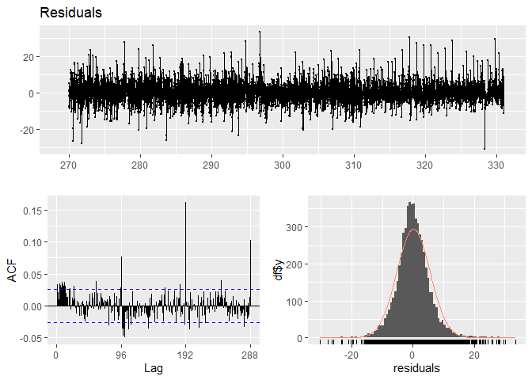

    ## 
    ##  Ljung-Box test
    ## 
    ## data:  Residuals
    ## Q* = 515.99, df = 192, p-value < 2.2e-16
    ## 
    ## Model df: 0.   Total lags used: 192

``` r
tsdisplay(nnar_temp_dt_ft$residuals)
```

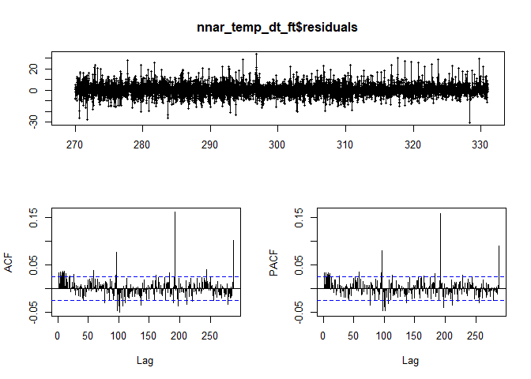

Unfortunately, after multiple iterations we haven’t managed to achieve
better results than the automatic nnetar function. I was changing the
number of lagged values of the time series to use as inputs to the
neural network (p), number of seasonal autoregressive lags (P), and
number of hidden nodes in the neural network (size).


### 3.4.1 RF with temp & daytime w/o lags

Let’s test random forest with temperature and daytime (morning, night,
day, evening) covariates. For now we won’t add time lags into model

``` r
library(randomForest)
set.seed(777)
rf_dt_no_lag=randomForest(ts_historical_cut_train_val[,2],x=ts_historical_cut_train_val[, c(1, 3, 4, 5, 6)])
```

Let’s build a graph

``` r
library(ggplot2)
library(randomForest)

rf_dt_no_lag_forecast=predict(rf_dt_no_lag,newdata=ts_historical_cut_test[, c(1, 3, 4, 5, 6)])

ts_rf_dt_no_lag_forecast=ts(rf_dt_no_lag_forecast,start=c(331,1),end=c(332,96),frequency = 96)

autoplot(ts_historical_cut_test[,"power"], series="test data")+autolayer(ts_rf_dt_no_lag_forecast,series="RF temperature & daytime w/o lags")
```

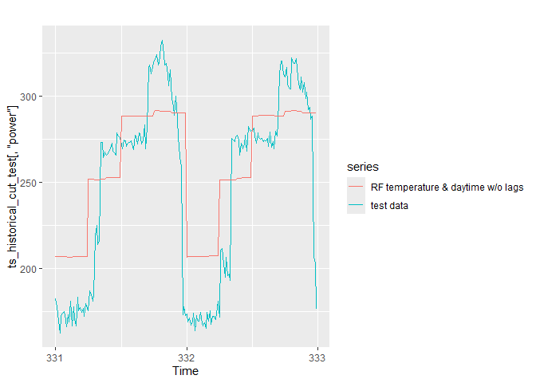

Let’s check RMSE

``` r
rf_dt_no_lag_rmse <- sqrt(mean((rf_dt_no_lag_forecast - ts_historical_cut_test[, 2])^2))
cat("RMSE RF temperature & daytime w/o lags:", rf_dt_no_lag_rmse, "\n")
```

    ## RMSE RF temperature & daytime w/o lags: 34.45074

Residuals

``` r
residuals_rf_dt_no_lag <- ts_historical_cut_test[, "power"] - rf_dt_no_lag_forecast


summary(rf_dt_no_lag)
```

    ##                 Length Class  Mode     
    ## call               3   -none- call     
    ## type               1   -none- character
    ## predicted       5952   -none- numeric  
    ## mse              500   -none- numeric  
    ## rsq              500   -none- numeric  
    ## oob.times       5952   -none- numeric  
    ## importance         5   -none- numeric  
    ## importanceSD       0   -none- NULL     
    ## localImportance    0   -none- NULL     
    ## proximity          0   -none- NULL     
    ## ntree              1   -none- numeric  
    ## mtry               1   -none- numeric  
    ## forest            11   -none- list     
    ## coefs              0   -none- NULL     
    ## y               5952   ts     numeric  
    ## test               0   -none- NULL     
    ## inbag              0   -none- NULL

``` r
print(rf_dt_no_lag)
```

    ## 
    ## Call:
    ##  randomForest(x = ts_historical_cut_train_val[, c(1, 3, 4, 5,      6)], y = ts_historical_cut_train_val[, 2]) 
    ##                Type of random forest: regression
    ##                      Number of trees: 500
    ## No. of variables tried at each split: 1
    ## 
    ##           Mean of squared residuals: 1276.392
    ##                     % Var explained: 68.4

``` r
checkresiduals(residuals_rf_dt_no_lag)
```

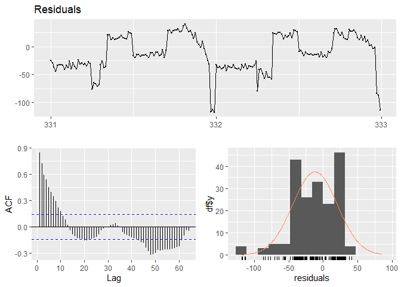

    ## 
    ##  Ljung-Box test
    ## 
    ## data:  Residuals
    ## Q* = 554.31, df = 38, p-value < 2.2e-16
    ## 
    ## Model df: 0.   Total lags used: 38

``` r
tsdisplay(residuals_rf_dt_no_lag)
```

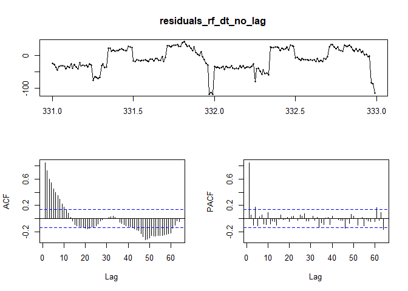

This model demonstrates a quite poor performance. But an interesting
observation is that the model is at least following the pattern of the
daytime covariates. Let’s test a model for which we create for each day
96 numeric labels

### 3.4.2 RF with temp & 96 labels w/o lags

First let’s create and additional feature for train_val and test sets

``` r
# Pattern from 1..96
intraday_train_val <- rep(1:96, times = 62)
intraday_test <- rep(1:96, times = 2)
```

Let’s double check the number of rows in ts_historical_cut_train_val

``` r
# Get the number of rows directly
num_rows <- nrow(ts_historical_cut_train_val)

# Print the number of rows
print(num_rows)
```

    ## [1] 5952

Let’s add intraday column to train_val set

``` r
ts_historical_cut_train_val <- cbind(
  temp    = ts_historical_cut_train_val[, 1],
  power   = ts_historical_cut_train_val[, 2],
  Night  = ts_historical_cut_train_val[, 3],
  Morning  = ts_historical_cut_train_val[, 4],
  Day  = ts_historical_cut_train_val[, 5],
  Evening  = ts_historical_cut_train_val[, 6],
  day_number  = ts_historical_cut_train_val[, 7],
  intraday  = intraday_train_val[1:nrow(ts_historical_cut_train_val)]
)
```

Let’s add intraday column to test set

``` r
ts_historical_cut_test <- cbind(
  temp    = ts_historical_cut_test[, 1],
  power   = ts_historical_cut_test[, 2],
  Night  = ts_historical_cut_test[, 3],
  Morning  = ts_historical_cut_test[, 4],
  Day  = ts_historical_cut_test[, 5],
  Evening  = ts_historical_cut_test[, 6],
  day_number  = ts_historical_cut_test[, 7],
  intraday  = intraday_test[1:nrow(ts_historical_cut_test)]
)
```

Let’s fit the model

``` r
set.seed(777)
rf_id_no_lag=randomForest(y=ts_historical_cut_train_val[,2],x=ts_historical_cut_train_val[, c(1, 8)])
```

Check the graph

``` r
library(ggplot2)
library(randomForest)

rf_id_no_lag_forecast=predict(rf_id_no_lag,newdata=ts_historical_cut_test[, c(1, 8)])

ts_rf_id_no_lag_forecast=ts(rf_id_no_lag_forecast,start=c(331,1),end=c(332,96),frequency = 96)

autoplot(ts_historical_cut_test[,"power"], series="test data")+autolayer(ts_rf_id_no_lag_forecast,series="RF temperature & intraday w/o lags")
```

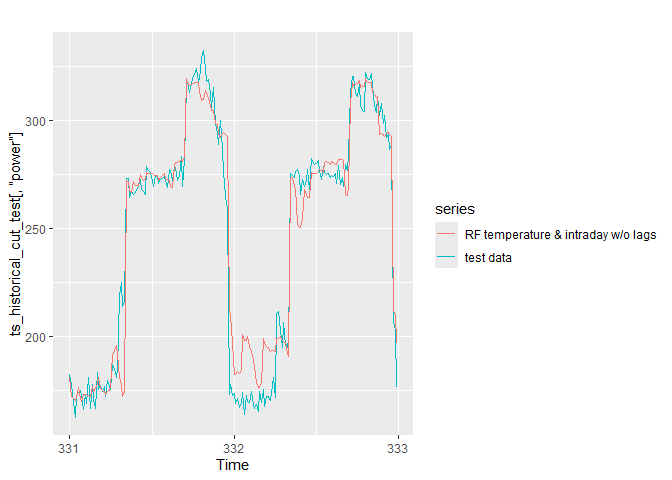

Let’s check RMSE

``` r
rf_id_no_lag_rmse <- sqrt(mean((rf_id_no_lag_forecast - ts_historical_cut_test[, 2])^2))
cat("RMSE RF temperature & intraday w/o lags:", rf_id_no_lag_rmse, "\n")
```

    ## RMSE RF temperature & intraday w/o lags: 12.76255

Residuals

``` r
residuals_rf_id_no_lag <- ts_historical_cut_test[, "power"] - rf_id_no_lag_forecast


summary(rf_id_no_lag)
```

    ##                 Length Class  Mode     
    ## call               3   -none- call     
    ## type               1   -none- character
    ## predicted       5952   -none- numeric  
    ## mse              500   -none- numeric  
    ## rsq              500   -none- numeric  
    ## oob.times       5952   -none- numeric  
    ## importance         2   -none- numeric  
    ## importanceSD       0   -none- NULL     
    ## localImportance    0   -none- NULL     
    ## proximity          0   -none- NULL     
    ## ntree              1   -none- numeric  
    ## mtry               1   -none- numeric  
    ## forest            11   -none- list     
    ## coefs              0   -none- NULL     
    ## y               5952   ts     numeric  
    ## test               0   -none- NULL     
    ## inbag              0   -none- NULL

``` r
print(rf_id_no_lag)
```

    ## 
    ## Call:
    ##  randomForest(x = ts_historical_cut_train_val[, c(1, 8)], y = ts_historical_cut_train_val[,      2]) 
    ##                Type of random forest: regression
    ##                      Number of trees: 500
    ## No. of variables tried at each split: 1
    ## 
    ##           Mean of squared residuals: 186.6302
    ##                     % Var explained: 95.38

``` r
checkresiduals(residuals_rf_id_no_lag)
```

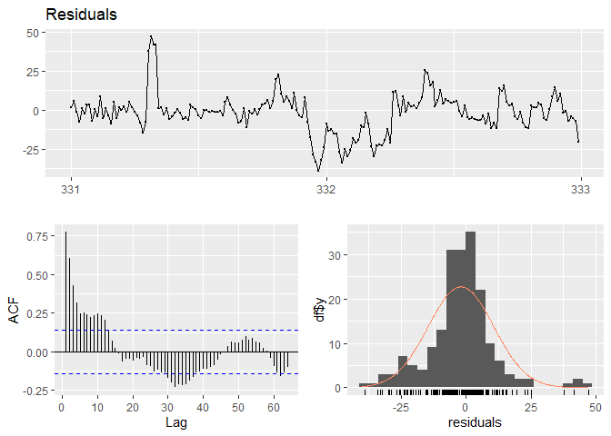

    ## 
    ##  Ljung-Box test
    ## 
    ## data:  Residuals
    ## Q* = 443.02, df = 38, p-value < 2.2e-16
    ## 
    ## Model df: 0.   Total lags used: 38

``` r
tsdisplay(residuals_rf_id_no_lag)
```

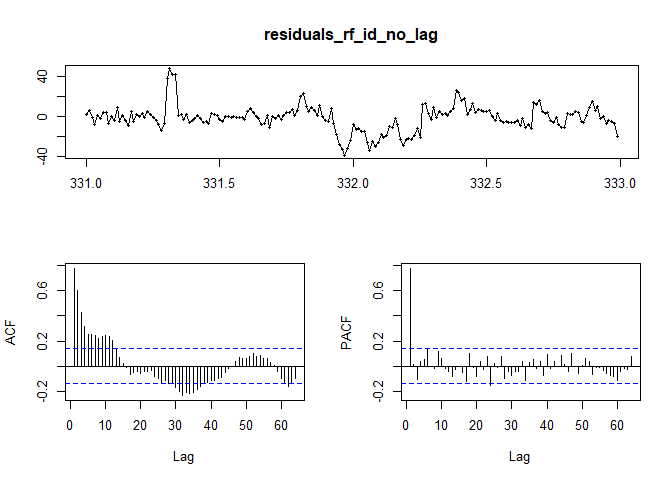

Great! By adding a numeric index for each 15-minutes for each day we
have managed to achieved a decent result comparable to other models. Now
let’s check XGBoost with the similar parameters.

### 3.4.3 XGBoost with temp & 96 labels w/o lags

``` r
set.seed(777)
library(xgboost)
xg_id_no_lag<- xgboost(data = ts_historical_cut_train_val[, c(1, 8)], label = ts_historical_cut_train_val[,2],
max_depth = 10, eta = .5, nrounds = 100,
nthread = 2, objective = "reg:squarederror", verbose = 0)
```

Check the graph

``` r
library(ggplot2)
library(xgboost)

xg_id_no_lag_forecast=predict(xg_id_no_lag,newdata=ts_historical_cut_test[, c(1, 8)])
```


``` r
ts_xg_id_no_lag_forecast=ts(xg_id_no_lag_forecast,start=c(331,1),end=c(332,96),frequency = 96)
```


``` r
autoplot(ts_historical_cut_test[,"power"], series="test data")+autolayer(ts_xg_id_no_lag_forecast,series="XGBoost temperature & intraday w/o lags")
```


Let’s check RMSE

``` r
xg_id_no_lag_rmse <- sqrt(mean((xg_id_no_lag_forecast - ts_historical_cut_test[, 2])^2))
```


``` r
cat("RMSE XGBoost temperature & intraday w/o lags:", xg_id_no_lag_rmse, "\n")
```


XGBoost has demonstrated a worse result than RF. Let’s add lags.

### 3.4.4 RF with temp & 96 labels w/ lags

First let’s create new columns with lagged values for the train_val
dataset

``` r
ts_lagged_train_val <- cbind(
  temp    = ts_historical_cut_train_val[, 1],
  power   = ts_historical_cut_train_val[, 2],
  Night  = ts_historical_cut_train_val[, 3],
  Morning  = ts_historical_cut_train_val[, 4],
  Day  = ts_historical_cut_train_val[, 5],
  Evening  = ts_historical_cut_train_val[, 6],
  day_number  = ts_historical_cut_train_val[, 7],
  intraday  = ts_historical_cut_train_val[, 8],
  x1 = c(rep(NA, 1), head(ts_historical_cut_train_val[, "power"], -1)),
  x2 = c(rep(NA, 2), head(ts_historical_cut_train_val[, "power"], -2)),
  x3 = c(rep(NA, 3), head(ts_historical_cut_train_val[, "power"], -3)),
  x4 = c(rep(NA, 4), head(ts_historical_cut_train_val[, "power"], -4)),
  x5 = c(rep(NA, 5), head(ts_historical_cut_train_val[, "power"], -5)),
  x6 = c(rep(NA, 6), head(ts_historical_cut_train_val[, "power"], -6)),
  x7 = c(rep(NA, 7), head(ts_historical_cut_train_val[, "power"], -7))
)
```

Remove the first 96 rows that contain NA in lag columns:

``` r
ts_lagged_train_val <- ts_lagged_train_val[-c(1:96), ]
```

Let’s fit the model

``` r
library(randomForest)

rf_id_lagged <- randomForest(
  y = ts_lagged_train_val[, 2],
  x = ts_lagged_train_val[, c(1,8:15)]
)
```

Initialize the Lag Vector

``` r
n_train <- nrow(ts_lagged_train_val)
# The last 7 real demands from training (in descending order):
x <- c(
  ts_lagged_train_val[n_train,     "power"],  # 7th-latest
  ts_lagged_train_val[n_train - 1, "power"],  # 6th-latest
  ts_lagged_train_val[n_train - 2, "power"],
  ts_lagged_train_val[n_train - 3, "power"],
  ts_lagged_train_val[n_train - 4, "power"],
  ts_lagged_train_val[n_train - 5, "power"],
  ts_lagged_train_val[n_train - 6, "power"]   # 1st-latest
)
```

Loop Over Each Test Row

``` r
n_test <- nrow(ts_historical_cut_test)
prev   <- numeric(n_test)  # store predictions here

for (i in seq_len(n_test)) {
  test_row <- cbind(
    temp     = ts_historical_cut_test[i, "temp"],
    power    = ts_historical_cut_test[i, "power"],    
    Night    = ts_historical_cut_test[i, "Night"],
    Morning  = ts_historical_cut_test[i, "Morning"],
    Day      = ts_historical_cut_test[i, "Day"],
    Evening  = ts_historical_cut_test[i, "Evening"],
    day_number = ts_historical_cut_test[i, "day_number"],
    intraday = ts_historical_cut_test[i, "intraday"],
    x1 = x[1],
    x2 = x[2],
    x3 = x[3],
    x4 = x[4],
    x5 = x[5],
    x6 = x[6],
    x7 = x[7]
  )
  
  # 2) Predict using the same columns that were in 'x=...' for training
  y_hat <- predict(
    rf_id_lagged, 
    newdata = test_row[, c(1,8:15)]
  )
  
  # 3) Save the forecast
  prev[i] <- y_hat
  
  # 4) SHIFT the x vector to incorporate the new forecast as the "most recent"
  # The sample does: x=c(y, x[1:6])
  x <- c(y_hat, x[1:6])
}

# 'prev' now has 1-step-ahead forecasts for each test row
```

Wrap to ts and build a plot

``` r
ts_preds <- ts(
  prev, 
  start = c(331, 1),  
  frequency = 96      
)

library(ggplot2)
autoplot(ts_historical_cut_test[,"power"], series="Test Data") +
  autolayer(ts_preds, series="RF Lagged Forecast")
```

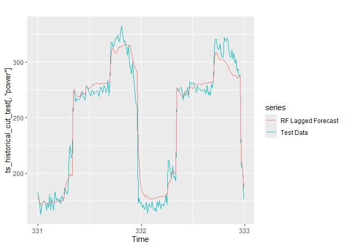

Compute RMSE vs. actual power in test set

``` r
rmse_iterative <- sqrt(mean((prev - ts_historical_cut_test[, "power"])^2))

cat("RMSE (iterative lagged model):", rmse_iterative, "\n")
```

    ## RMSE (iterative lagged model): 10.45727

Great! By adding lags we have managed to improve the model performance

# 4: Forecast


Let’s plot the best models

``` r
library(ggplot2)
library(forecast)

autoplot(ts_historical_cut_test[,"power"], series = "Test Data") +
  autolayer(hw_ft_forecast$mean, series = "Additive HW Finetuned") +
  autolayer(arima_manual_xreg_forecast$mean, series = "Manual ARIMA w/ Temp") +
  autolayer(nnar_temp_dt_forecast$mean, series = "NNAR w/ Temp & Daytime") +
  autolayer(ts_preds, series = "RF w/ Temp & Intraday Lagged") +
  xlab("Time") +
  ylab("Power") +
  ggtitle("Forecast Comparison of Multiple Models") +
  guides(colour = guide_legend(title = "Series"))
```


Let’s compare RMSEs of these models

``` r
# Calculate each model's RMSE
hw_ft_rmse <- sqrt(mean((hw_ft_forecast$mean - ts_historical_cut_test[,"power"]) ^ 2))
arima_manual_xreg_rmse <- sqrt(mean((arima_manual_xreg_forecast$mean - ts_historical_cut_test[,"power"]) ^ 2))
nnar_temp_dt_rmse <- sqrt(mean((nnar_temp_dt_forecast$mean - ts_historical_cut_test[,"power"]) ^ 2))
```


``` r
rmse_iterative <- sqrt(mean((prev - ts_historical_cut_test[, "power"])^2))

# Combine into a data frame
rmse_values <- data.frame(
  Model = c("HW Finetuned", 
            "Manual ARIMA w/ Temp", 
            "NNAR w/ Temp & Daytime", 
            "RF w/ Temp & Intraday Lagged"),
  RMSE = c(hw_ft_rmse, 
           arima_manual_xreg_rmse, 
           nnar_temp_dt_rmse, 
           rmse_iterative)
)
```


``` r
# Order by RMSE (ascending)
rmse_values <- rmse_values[order(rmse_values$RMSE), ]
```


``` r
# Print the table
print(rmse_values)
```


ARIMA with temperature as covariate is the best performing model.
Despite all our efforts we haven’t managed to achieve similar results
with all other approaches. But interestingly neural network with
covariates represented by temperature and one-hot encoded daytime frames
(night, morning, day, evening) has performed quite well. Let’s make a
forecast with our best model.


Let’s retrain our best model on the full dataset to capture the last 2
days we were using for test.

``` r
library(forecast)
final_model <- Arima(ts_historical_cut[,"power"],
                      order = c(0,1,9),
                      seasonal = list(order = c(1,1,1)),
                      xreg = ts_historical_cut[,"temp"])
```

Convert df_forecast to mts

``` r
ts_forecast <- ts(df_forecast[,"temp"],
                        frequency = 96)
```

Make forecast

``` r
library(forecast)
final_forecast <- forecast(final_model, h = 1 * 96, 
                                  xreg = ts_forecast[,"temp"])

autoplot(final_forecast$mean, series = "Manual Arima w/ Temp")
```

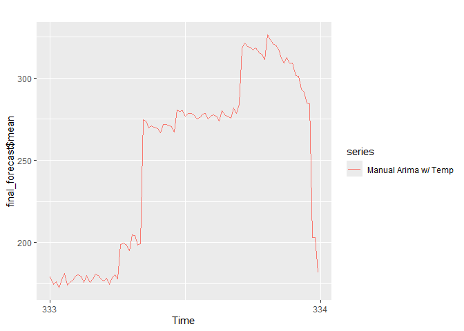

Extract the 96 forecasted values as a data frame

``` r
library(openxlsx)
forecast_values <- as.data.frame(final_forecast$mean)

# Save these values to Excel 
write.xlsx(
  x        = forecast_values,
  file     = "output.xlsx",
  colNames = FALSE,
  rowNames = FALSE
)
```

## Contact

Nikolai Len

👤 [LinkedIn](https://www.linkedin.com/in/niklen/)
